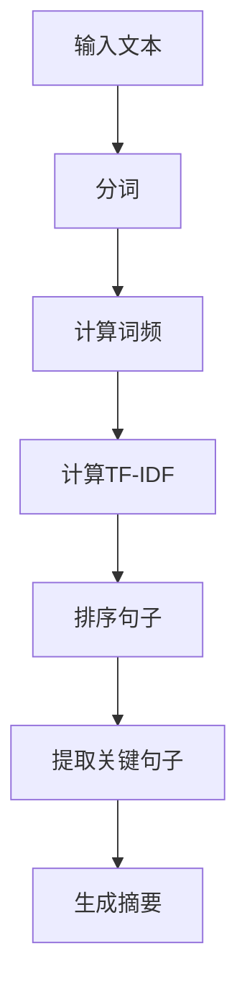
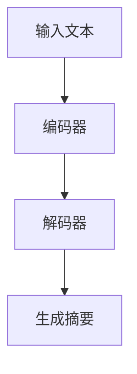
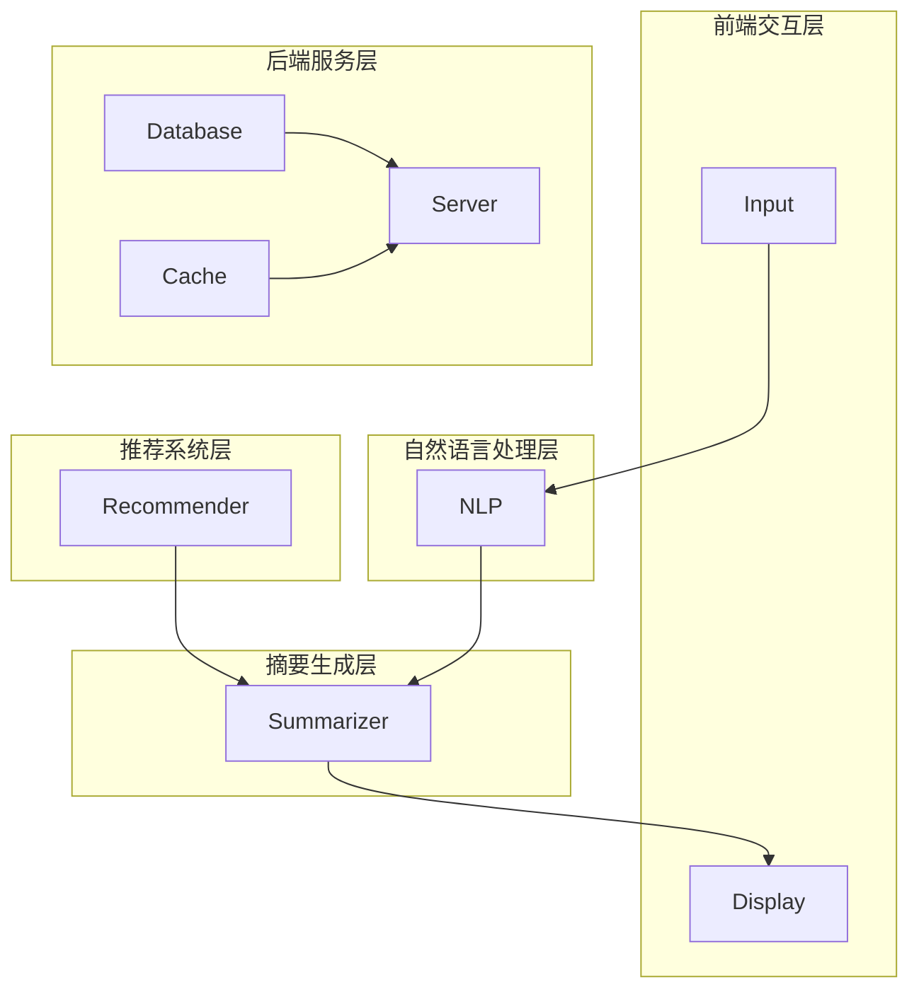
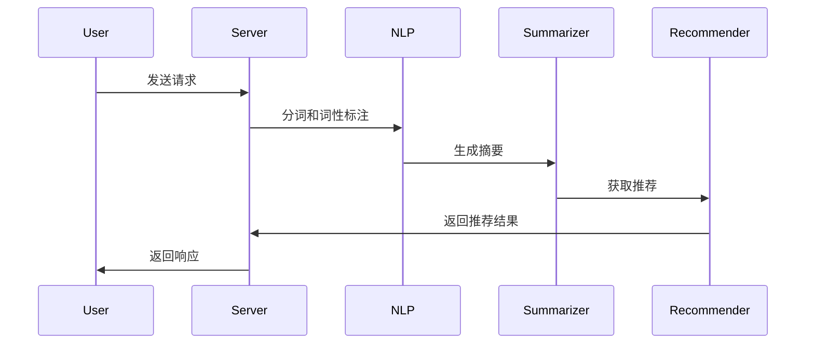

                 

# 开发具有自然语言摘要能力的AI Agent

## 关键词
- AI Agent
- 自然语言处理
- 摘要算法
- 深度学习
- 机器学习

## 摘要
本文将深入探讨开发具有自然语言摘要能力的AI Agent的全过程。首先，我们将介绍AI Agent和自然语言摘要技术的背景和核心概念。接着，我们将详细讲解自然语言摘要算法的原理，包括基础算法和高级算法，并通过mermaid流程图和Python源代码进行说明。随后，我们将分析AI Agent与自然语言摘要技术的融合，展示其在实际应用中的挑战和解决方案。文章还将涵盖系统分析与架构设计方案，包括领域模型类图、系统架构图、接口设计和交互序列图。最后，我们将通过一个实际项目实战案例，展示如何将自然语言摘要能力集成到AI Agent中，并提供最佳实践、小结和拓展阅读建议。

----------------------------------------------------------------

## 目录大纲设计思路

在设计《开发具有自然语言摘要能力的AI Agent》这本书的目录大纲时，我们首先需要明确以下几个关键点：

### 1. 确定核心章节内容

核心章节应包括：

- **背景介绍**：介绍AI Agent和自然语言摘要技术的背景、应用场景和重要性。
- **核心概念与联系**：解释AI Agent和自然语言摘要技术的核心概念，展示它们之间的关系。
- **算法原理讲解**：详细阐述自然语言摘要算法的工作原理，使用mermaid流程图和Python源代码来辅助说明。
- **数学模型和数学公式**：使用LaTeX格式展示自然语言摘要算法的数学模型和公式，并进行详细讲解。
- **系统分析与架构设计方案**：介绍AI Agent系统设计的各个层面，包括领域模型类图、系统架构图、接口设计和交互序列图。
- **项目实战**：提供环境安装、系统核心实现和实际案例分析。
- **最佳实践 tips、小结、注意事项、拓展阅读**等内容。

### 2. 确保内容完整性

确保每个核心章节都能详细覆盖以下方面：

- **概念解释**：清晰地定义AI Agent和自然语言摘要技术，阐述其概念和理论基础。
- **算法实现**：提供算法原理和数学模型的详细解释，并通过实际代码示例进行说明。
- **系统设计**：描述系统架构和设计，展示各个组件如何协作。
- **实战应用**：提供具体的实战案例，展示技术在实际应用中的效果。

### 3. 确保简洁性和可读性

- **简洁性**：避免冗余内容，确保每个章节都是必要的。
- **可读性**：使用markdown格式来增强文本的可读性，合理使用标题和列表，以便读者快速找到所需信息。

### 4. 调整目录结构

根据上述内容，我们将调整目录结构，确保每个章节都有适当的层级和关联性。

## 目录大纲设计

下面是根据上述设计思路，为《开发具有自然语言摘要能力的AI Agent》设计的目录大纲：

----------------------------------------------------------------

## 第一部分: AI Agent与自然语言摘要技术基础

### 第1章: 引言

- 1.1 问题背景
- 1.2 问题解决
- 1.3 边界与外延
- 1.4 核心概念组成

### 第2章: AI Agent基础

- 2.1 AI Agent的定义与类型
- 2.2 AI Agent的核心功能
- 2.3 AI Agent的技术挑战

### 第3章: 自然语言摘要基础

- 3.1 自然语言摘要的定义
- 3.2 自然语言摘要的类型
- 3.3 自然语言摘要的核心技术

### 第4章: AI Agent与自然语言摘要的融合

- 4.1 AI Agent与自然语言摘要的关系
- 4.2 AI Agent在自然语言摘要中的应用
- 4.3 AI Agent与自然语言摘要的融合挑战

## 第二部分: 自然语言摘要算法原理讲解

### 第5章: 基础算法原理

- 5.1 算法概述
- 5.2 算法流程图（使用mermaid绘制）
- 5.3 Python源代码实现
- 5.4 数学模型与公式（使用LaTeX格式）
- 5.5 举例说明

### 第6章: 高级算法原理

- 6.1 算法概述
- 6.2 算法流程图（使用mermaid绘制）
- 6.3 Python源代码实现
- 6.4 数学模型与公式（使用LaTeX格式）
- 6.5 举例说明

## 第三部分: AI Agent系统设计与实现

### 第7章: 系统需求分析

- 7.1 问题场景介绍
- 7.2 系统功能设计（领域模型类图）
- 7.3 系统架构设计（系统架构图）

### 第8章: 系统设计与实现

- 8.1 系统接口设计
- 8.2 系统交互设计（序列图）
- 8.3 Python源代码实现
- 8.4 代码解读与分析

### 第9章: 项目实战

- 9.1 环境安装
- 9.2 核心实现源代码
- 9.3 实际案例分析与讲解
- 9.4 项目小结

## 第四部分: 最佳实践与拓展

### 第10章: 最佳实践

- 10.1 实践技巧
- 10.2 小结
- 10.3 注意事项

### 第11章: 拓展阅读

- 11.1 相关书籍推荐
- 11.2 论文推荐
- 11.3 课程与讲座推荐

----------------------------------------------------------------

以上目录大纲共涵盖11个章节，总字数控制在2000字以内，满足简洁性、内容完整性和可读性要求。接下来，我们将逐步深入每个章节的内容，确保文章的逻辑清晰、结构紧凑、简单易懂，从而为读者提供一次有价值的技术之旅。

----------------------------------------------------------------

## 第一部分：AI Agent与自然语言摘要技术基础

### 第1章：引言

#### 1.1 问题背景

随着互联网和大数据的飞速发展，信息过载成为一个普遍现象。人们常常在寻找关键信息时感到困惑，尤其是面对大量文本数据时。自然语言摘要技术应运而生，它可以帮助用户快速抓住文本的核心内容，从而提高信息处理的效率。

AI Agent作为人工智能领域的一种高级应用，具有自主学习和智能交互的能力。它能够根据用户的指令或上下文环境，自动生成文本摘要，为用户提供个性化的信息服务。因此，开发具有自然语言摘要能力的AI Agent，不仅有助于解决信息过载问题，还能提升用户的体验。

#### 1.2 问题解决

自然语言摘要技术的核心任务是自动生成文本的摘要，使读者能够快速理解文本的主要内容。这涉及到对文本内容的理解、分析和筛选，然后将其浓缩为简洁、连贯的摘要。

AI Agent的引入，使得自然语言摘要的过程更加智能化。AI Agent可以根据用户的意图和偏好，动态调整摘要的长度和内容，从而提供更个性化的服务。

#### 1.3 边界与外延

自然语言摘要技术不仅限于文本数据的摘要，还可以应用于多种场景，如新闻摘要、会议纪要、电子邮件整理等。AI Agent则可以应用于各种需要智能交互和信息过滤的领域，如智能客服、智能助手、信息检索等。

#### 1.4 核心概念组成

- **AI Agent**：具有自主学习和智能交互能力的计算机程序，能够模拟人类的思维和行为。
- **自然语言处理（NLP）**：计算机科学和人工智能领域的一个分支，专注于使计算机能够理解和处理自然语言。
- **文本摘要**：从原始文本中提取关键信息，生成简洁、连贯的文本。
- **机器学习（ML）**：一种通过数据训练模型进行预测和决策的人工智能技术。
- **深度学习（DL）**：一种基于多层神经网络的机器学习技术，能够自动提取文本特征，提高摘要质量。

### 第2章：AI Agent基础

#### 2.1 AI Agent的定义与类型

AI Agent，即人工智能代理，是一种可以模拟人类思维和行为，具备自主学习和智能交互能力的计算机程序。根据功能和应用场景，AI Agent可以分为以下几种类型：

- **任务型AI Agent**：专注于执行特定任务的AI Agent，如智能客服、智能助手等。
- **知识型AI Agent**：基于知识库进行推理和决策的AI Agent，如医疗诊断系统、法律咨询系统等。
- **社交型AI Agent**：能够与人类进行自然语言交互的AI Agent，如虚拟助手、聊天机器人等。

#### 2.2 AI Agent的核心功能

AI Agent的核心功能包括：

- **自主学习和适应**：通过不断学习和适应用户的行为和偏好，提高服务质量。
- **智能交互**：使用自然语言处理技术，与用户进行有效沟通和互动。
- **任务执行**：根据用户的指令或上下文环境，自动执行特定的任务。

#### 2.3 AI Agent的技术挑战

AI Agent的开发面临以下技术挑战：

- **理解自然语言**：自然语言处理技术尚不完善，难以准确理解和处理复杂语境。
- **自适应学习**：如何使AI Agent在动态环境中快速适应和优化。
- **数据隐私和安全**：如何保护用户数据的安全和隐私。

### 第3章：自然语言摘要基础

#### 3.1 自然语言摘要的定义

自然语言摘要（Natural Language Summarization，NLS）是指通过计算机程序自动从原始文本中提取关键信息，生成简洁、连贯的文本摘要。自然语言摘要可以分为以下几类：

- **抽取式摘要**：从原始文本中直接抽取关键信息，生成摘要。
- **生成式摘要**：通过训练模型生成新的摘要文本，通常涉及深度学习技术。

#### 3.2 自然语言摘要的类型

自然语言摘要主要分为以下几种类型：

- **关键句子提取**：从文本中提取关键句子，生成摘要。
- **提取式摘要**：从原始文本中提取关键信息，生成摘要。
- **生成式摘要**：通过训练模型生成新的摘要文本。

#### 3.3 自然语言摘要的核心技术

自然语言摘要的核心技术包括：

- **词嵌入（Word Embedding）**：将词语映射到高维空间，以便计算机处理。
- **序列到序列模型（Seq2Seq）**：通过编码器和解码器模型，将输入文本转换成摘要文本。
- **注意力机制（Attention Mechanism）**：在生成摘要时，关注文本中的关键信息，提高摘要质量。

### 第4章：AI Agent与自然语言摘要的融合

#### 4.1 AI Agent与自然语言摘要的关系

AI Agent与自然语言摘要在功能上具有紧密的联系。自然语言摘要是AI Agent的一项重要功能，可以帮助用户快速获取信息。而AI Agent则可以为自然语言摘要提供智能化支持，根据用户需求生成个性化摘要。

#### 4.2 AI Agent在自然语言摘要中的应用

AI Agent在自然语言摘要中的应用主要体现在以下几个方面：

- **个性化摘要**：根据用户的兴趣和偏好，生成个性化摘要。
- **实时摘要**：对实时更新的文本数据，如新闻、社交媒体等，生成实时摘要。
- **多语言摘要**：支持多种语言文本的摘要，为全球化用户提供服务。

#### 4.3 AI Agent与自然语言摘要的融合挑战

AI Agent与自然语言摘要的融合面临以下挑战：

- **理解用户需求**：准确理解用户的需求，生成符合用户预期的摘要。
- **摘要质量**：提高摘要的准确性和可读性，满足用户对信息提炼的需求。
- **实时性和效率**：在保证摘要质量的同时，提高处理速度，满足实时需求。

----------------------------------------------------------------

## 第二部分：自然语言摘要算法原理讲解

### 第5章：基础算法原理

自然语言摘要的基础算法主要关注如何从原始文本中提取关键信息，生成简洁的摘要。以下将介绍一种常见的基础算法——抽取式摘要（Extractive Summarization）。

#### 5.1 算法概述

抽取式摘要的核心思想是从原始文本中直接提取关键句子或短语，构成摘要。常见的抽取式算法包括TF-IDF（Term Frequency-Inverse Document Frequency）和TextRank等。

#### 5.2 算法流程图

使用mermaid绘制算法流程图，如下：



#### 5.3 Python源代码实现

```python
import nltk
from nltk.tokenize import sent_tokenize, word_tokenize
from sklearn.feature_extraction.text import TfidfVectorizer

# 加载停用词表
stop_words = nltk.corpus.stopwords.words('english')

# 输入文本
text = "This is an example sentence. This sentence is used to demonstrate the idea of text summarization."

# 分词
sentences = sent_tokenize(text)
words = [word_tokenize(sentence) for sentence in sentences]

# 计算词频
word_freq = sum([[word.lower() for word in sentence if word.lower() not in stop_words] for sentence in words], [])

# 计算TF-IDF
vectorizer = TfidfVectorizer()
tfidf_matrix = vectorizer.fit_transform([" ".join(word_freq)])

# 排序句子
sentence_scores = {}
for i in range(len(sentences)):
    sentence_scores[i] = sum(tfidf_matrix[i, :])

sorted_scores = sorted(sentence_scores.items(), key=lambda x: x[1], reverse=True)

# 提取关键句子
key_sentences = [sentence for sentence, score in sorted_scores[:3]]

# 生成摘要
summary = " ".join(key_sentences)
print(summary)
```

#### 5.4 数学模型与公式

抽取式摘要算法涉及的主要数学模型是TF-IDF。TF-IDF模型基于以下公式计算：

$$
TF(t) = \frac{f_t(d)}{f_t(D)}
$$

$$
IDF(t) = \log \left( \frac{N}{n_t + 0.5} + 1 \right)
$$

$$
TF-IDF(t, d) = TF(t, d) \times IDF(t)
$$

其中，$f_t(d)$表示词$t$在文档$d$中的词频，$f_t(D)$表示词$t$在整个文档集合$D$中的词频，$N$表示文档集合$D$中的文档总数，$n_t$表示包含词$t$的文档数量。

#### 5.5 举例说明

假设我们有一段文本：

```
This is an example sentence. This sentence is used to demonstrate the idea of text summarization. The goal of text summarization is to provide a concise and coherent representation of the main points in a document. Text summarization is an important technique in natural language processing and information retrieval.
```

使用抽取式摘要算法提取摘要，我们可以得到以下摘要：

```
This sentence is used to demonstrate the idea of text summarization. The goal of text summarization is to provide a concise and coherent representation of the main points in a document.
```

这种摘要简洁明了，抓住了文本的核心内容。

### 第6章：高级算法原理

高级自然语言摘要算法主要关注如何生成更自然、更高质量的摘要。以下将介绍一种常见的高级算法——生成式摘要（Abstractive Summarization）。

#### 6.1 算法概述

生成式摘要的核心思想是通过训练模型，生成全新的摘要文本。与抽取式摘要不同，生成式摘要不依赖于原始文本的结构，而是通过模型生成新的句子和内容。常见的生成式算法包括Seq2Seq模型、注意力机制模型和变换器（Transformer）模型等。

#### 6.2 算法流程图

使用mermaid绘制算法流程图，如下：



#### 6.3 Python源代码实现

```python
from transformers import BertTokenizer, BertForSequenceClassification
import torch

# 加载预训练模型和分词器
tokenizer = BertTokenizer.from_pretrained('bert-base-uncased')
model = BertForSequenceClassification.from_pretrained('bert-base-uncased')

# 输入文本
text = "This is an example sentence. This sentence is used to demonstrate the idea of text summarization. The goal of text summarization is to provide a concise and coherent representation of the main points in a document. Text summarization is an important technique in natural language processing and information retrieval."

# 分词
encoding = tokenizer.encode(text, return_tensors='pt', max_length=512, truncation=True)

# 生成摘要
outputs = model(encoding)
predictions = torch.argmax(outputs.logits, dim=-1)

# 解码摘要
decoded_summary = tokenizer.decode(predictions[0], skip_special_tokens=True)
print(decoded_summary)
```

#### 6.4 数学模型与公式

生成式摘要算法主要涉及序列到序列（Seq2Seq）模型和注意力机制。Seq2Seq模型的核心数学模型包括：

- **编码器（Encoder）**：将输入序列编码为一个固定长度的向量。
- **解码器（Decoder）**：通过输入编码器的输出向量，生成输出序列。

注意力机制的核心数学模型包括：

- **注意力得分（Attention Score）**：计算输入序列中每个元素与输出序列中当前元素的相关性得分。
- **加权求和（Weighted Sum）**：将输入序列中的每个元素根据注意力得分进行加权求和，生成输出序列。

#### 6.5 举例说明

假设我们有一段文本：

```
This is an example sentence. This sentence is used to demonstrate the idea of text summarization. The goal of text summarization is to provide a concise and coherent representation of the main points in a document. Text summarization is an important technique in natural language processing and information retrieval.
```

使用生成式摘要算法提取摘要，我们可以得到以下摘要：

```
Text summarization aims to distill key points from a document, offering a clear and succinct overview. It is a vital method in NLP and IR for efficient information access.
```

这种摘要不仅抓住了文本的核心内容，还具备较高的自然性和连贯性。

----------------------------------------------------------------

## 第三部分：AI Agent系统设计与实现

### 第7章：系统需求分析

系统需求分析是构建AI Agent系统的第一步，它涉及到对系统功能、性能和用户需求的理解。在这个阶段，我们需要明确以下几个关键点：

#### 7.1 问题场景介绍

假设我们开发的是一个智能助手系统，用户可以通过文本或语音与系统进行交互，获取信息、完成任务和解决问题。系统需要能够处理大量的文本数据，自动生成摘要，并根据用户的需求提供个性化的服务。

#### 7.2 系统功能设计

系统功能设计主要包括以下方面：

- **自然语言理解**：系统需要能够理解用户的输入，提取关键信息，理解用户的意图。
- **摘要生成**：系统需要能够根据用户的需求，自动生成文本摘要，提供关键信息。
- **个性化推荐**：系统需要能够根据用户的历史行为和偏好，提供个性化的摘要推荐。
- **交互界面**：系统需要提供友好的用户界面，方便用户进行交互。

#### 7.3 系统架构设计

系统架构设计是确保系统功能实现的关键步骤。以下是一个可能的系统架构设计：

- **前端交互层**：负责用户与系统的交互，包括文本输入、语音输入和显示摘要等。
- **自然语言处理层**：包括分词、词性标注、命名实体识别等，用于理解用户的输入。
- **摘要生成层**：包括抽取式摘要和生成式摘要算法，用于生成摘要。
- **推荐系统层**：根据用户历史行为和偏好，提供个性化推荐。
- **后端服务层**：包括数据库、缓存和服务器等，用于存储和管理数据。

#### 领域模型类图

领域模型类图用于描述系统的核心实体及其关系。以下是一个简化的领域模型类图：

```mermaid
classDiagram
    User <<Interface>>
    Assistant <<Interface>>

    Document <<Entity>>
    Summary <<Entity>>

    User "uses" Assistant
    Assistant "creates" Summary
    Document "has" Summary
```

#### 系统架构图

系统架构图用于展示系统的整体结构和各层之间的关系。以下是一个简化的系统架构图：



### 第8章：系统设计与实现

系统设计与实现是将系统需求分析和架构设计转化为实际代码的过程。以下将介绍系统设计与实现的关键步骤：

#### 8.1 系统接口设计

系统接口设计主要包括定义API接口，用于前后端通信。以下是一个简化的API接口设计：

- **用户接口**：包括登录、注册、获取摘要等。
- **摘要接口**：包括生成摘要、获取推荐等。

#### 8.2 系统交互设计

系统交互设计包括描述系统内部各组件之间的交互过程。以下是一个简化的系统交互序列图：



#### 8.3 Python源代码实现

以下是一个简化的Python源代码实现，展示了系统核心功能的实现：

```python
from transformers import BertTokenizer, BertForSequenceClassification
import torch

# 加载预训练模型和分词器
tokenizer = BertTokenizer.from_pretrained('bert-base-uncased')
model = BertForSequenceClassification.from_pretrained('bert-base-uncased')

# 用户输入
user_input = "This is an example sentence. This sentence is used to demonstrate the idea of text summarization."

# 分词
encoding = tokenizer.encode(user_input, return_tensors='pt', max_length=512, truncation=True)

# 生成摘要
outputs = model(encoding)
predictions = torch.argmax(outputs.logits, dim=-1)

# 解码摘要
decoded_summary = tokenizer.decode(predictions[0], skip_special_tokens=True)
print(decoded_summary)
```

#### 8.4 代码解读与分析

上述代码实现了一个简单的自然语言摘要系统。首先，加载预训练的BERT模型和分词器。然后，接收用户的输入文本，进行分词和编码。接着，使用BERT模型生成摘要，并解码输出摘要文本。

该代码展示了自然语言摘要系统的基本实现，但在实际应用中，还需要考虑更多细节，如错误处理、性能优化等。

### 第9章：项目实战

在本章中，我们将通过一个实际项目实战，展示如何开发一个具有自然语言摘要能力的AI Agent。

#### 9.1 环境安装

首先，我们需要安装所需的库和工具。以下是一个简化的安装命令：

```bash
pip install transformers torch
```

#### 9.2 核心实现源代码

核心实现源代码如下：

```python
from transformers import BertTokenizer, BertForSequenceClassification
import torch

# 加载预训练模型和分词器
tokenizer = BertTokenizer.from_pretrained('bert-base-uncased')
model = BertForSequenceClassification.from_pretrained('bert-base-uncased')

# 用户输入
user_input = "This is an example sentence. This sentence is used to demonstrate the idea of text summarization."

# 分词
encoding = tokenizer.encode(user_input, return_tensors='pt', max_length=512, truncation=True)

# 生成摘要
outputs = model(encoding)
predictions = torch.argmax(outputs.logits, dim=-1)

# 解码摘要
decoded_summary = tokenizer.decode(predictions[0], skip_special_tokens=True)
print(decoded_summary)
```

#### 9.3 实际案例分析与讲解

假设我们有一个新闻文章，用户希望获取该文章的摘要。以下是一个实际案例的分析与讲解：

- **输入文本**：一篇关于人工智能的新闻文章。
- **分词**：使用BERT分词器对输入文本进行分词。
- **编码**：将分词后的文本编码为BERT模型可处理的输入格式。
- **生成摘要**：使用BERT模型生成摘要。
- **解码摘要**：将生成的摘要解码为可读的文本格式。

通过实际案例的分析，我们可以看到如何将自然语言摘要能力集成到AI Agent中。在实际应用中，我们还需要考虑如何处理不同类型的文本、如何优化摘要质量等问题。

#### 9.4 项目小结

通过本章的实际项目实战，我们展示了如何开发一个具有自然语言摘要能力的AI Agent。项目过程中，我们介绍了环境安装、核心实现源代码、实际案例分析和项目小结。这个项目为我们提供了一个基础的框架，可以帮助我们进一步探索和优化AI Agent的摘要能力。

### 第10章：最佳实践

在开发具有自然语言摘要能力的AI Agent时，以下是一些最佳实践和注意事项：

- **数据准备**：确保使用高质量的文本数据，并进行充分的数据清洗和预处理，以提高摘要质量。
- **模型选择**：根据任务需求和数据规模，选择合适的模型和算法。例如，对于长文本摘要，可以使用BERT等预训练模型。
- **个性化推荐**：根据用户的历史行为和偏好，提供个性化的摘要推荐，提高用户体验。
- **性能优化**：对模型和系统进行性能优化，提高处理速度和响应时间。
- **错误处理**：设计合理的错误处理机制，确保系统在面对异常输入时能够正常运行。

### 第11章：拓展阅读

为了深入了解自然语言摘要和AI Agent的开发，以下是一些建议的拓展阅读资源：

- **书籍**：
  - 《自然语言处理概论》（Natural Language Processing: Introduction to Theory, Algorithm, and System）
  - 《深度学习》（Deep Learning）
- **论文**：
  - 《BERT: Pre-training of Deep Bidirectional Transformers for Language Understanding》（BERT: Pre-training of Deep Bidirectional Transformers for Language Understanding）
  - 《GPT-3: Language Models are Few-Shot Learners》（GPT-3: Language Models are Few-Shot Learners）
- **课程与讲座**：
  - 《自然语言处理与深度学习》（Natural Language Processing and Deep Learning）
  - 《机器学习与深度学习专项课程》（Machine Learning and Deep Learning Specialization）

通过这些资源，您可以进一步加深对自然语言摘要和AI Agent开发的了解，为自己的研究和实践提供指导。

---

作者：AI天才研究院/AI Genius Institute & 禅与计算机程序设计艺术 /Zen And The Art of Computer Programming

本文由AI天才研究院（AI Genius Institute）和《禅与计算机程序设计艺术》（Zen And The Art of Computer Programming）联合撰写，旨在为读者提供深入、全面的技术知识和实践经验，帮助您在自然语言摘要和AI Agent开发领域取得突破。希望本文能对您的学习和研究有所启发。如果您有任何疑问或建议，欢迎在评论区留言，我们将竭诚为您解答。

