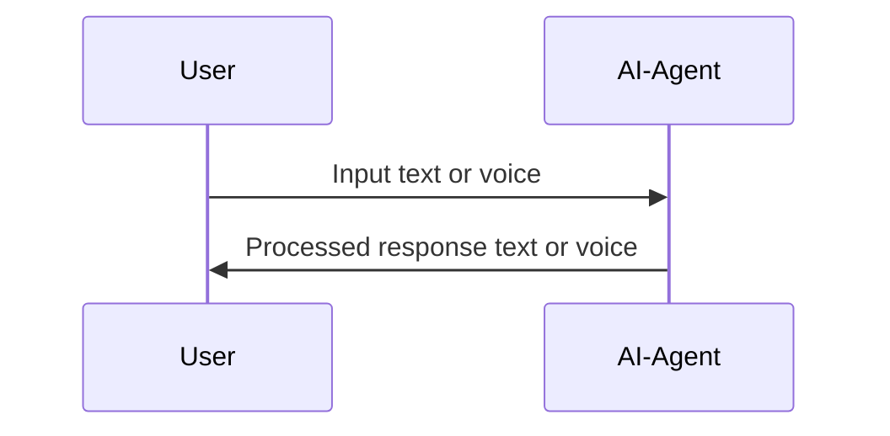

                 

### 文章标题

# 开发具有自然语言生成能力的AI Agent

### 文章关键词

- 自然语言生成
- AI Agent
- 语音合成
- 语音识别
- 多模态交互

### 文章摘要

本文旨在探讨如何开发具有自然语言生成能力的AI Agent。我们将从背景介绍、核心概念解析、算法原理讲解、系统设计与实现、实战案例剖析等多个角度，详细阐述这一主题。通过本文的阅读，读者将全面了解自然语言生成技术在AI Agent中的应用，掌握开发具有自然语言生成能力的AI Agent的关键技术，并对未来这一领域的发展趋势有所展望。

### 引言与背景

#### 问题背景

随着人工智能技术的飞速发展，智能对话系统、虚拟助手等应用场景越来越广泛。然而，传统的基于规则或者模板匹配的智能对话系统在处理复杂、非结构化的问题时，表现往往不尽如人意。为了提升智能对话系统的智能化程度，自然语言生成（Natural Language Generation, NLG）技术应运而生。自然语言生成技术通过计算机算法，将机器内部数据或结构化信息转化为自然语言的文本，使得AI Agent能够与人类进行更加自然、流畅的交流。

#### 问题描述

自然语言生成技术在AI Agent中的应用面临以下问题：

1. **文本生成质量**：如何生成语法正确、语义连贯、风格一致的文本？
2. **文本理解**：如何理解用户输入的文本，并给出恰当的响应？
3. **多模态交互**：如何结合语音、图像等多种模态，实现更加丰富、自然的交互体验？

#### 问题解决方法概述

本文提出以下解决方法：

1. **文本生成算法**：采用生成式模型和检索式模型，提升文本生成质量。
2. **文本理解**：利用深度学习技术，实现文本的语义理解。
3. **多模态交互**：结合语音合成和语音识别技术，实现多模态交互。

#### 边界与外延

本文主要探讨具有自然语言生成能力的AI Agent的开发，涉及的关键技术包括自然语言生成、文本理解、语音合成、语音识别等。同时，本文还将讨论多模态交互的实现，以提升AI Agent的交互体验。本文不涉及自然语言处理（NLP）的其他方面，如情感分析、实体识别等。

#### 核心概念介绍

- **自然语言生成（NLG）**：将机器内部数据或结构化信息转化为自然语言的文本。
- **AI Agent**：具有自主决策和行动能力的智能体，能够与人类进行交互。
- **文本生成算法**：生成式模型和检索式模型。
- **文本理解**：理解用户输入的文本，提取语义信息。
- **语音合成**：将文本转化为语音。
- **语音识别**：将语音转化为文本。

### 自然语言生成技术基础

#### 语言模型基础

自然语言生成（NLG）的核心是语言模型（Language Model）。语言模型是一个概率模型，用于预测下一个单词的概率。常见的方法包括n元语言模型（n-gram model）和基于神经网络的深度语言模型（Deep Neural Network Language Model）。

- **n元语言模型**：基于历史单词序列的概率分布进行预测，如：
  $$ P(w_n | w_{n-1}, w_{n-2}, ..., w_1) = \frac{C(w_{n-1}, w_{n-2}, ..., w_1, w_n)}{C(w_{n-1}, w_{n-2}, ..., w_1)} $$
  其中，$C$ 表示计数。

- **深度语言模型**：采用深度神经网络（如LSTM、GRU）进行预测，如：
  $$ P(w_n | w_{n-1}, w_{n-2}, ..., w_1) = \frac{e^{v^T [h_{n-1}, w_n]W}}{\sum_{w'} e^{v^T [h_{n-1}, w']}W} $$
  其中，$v$ 表示单词的嵌入向量，$h_{n-1}$ 表示前一个隐藏状态，$W$ 表示权重矩阵。

#### 生成式模型与检索式模型

自然语言生成的两大主流方法分别是生成式模型（Generative Model）和检索式模型（Retrieval-Based Model）。

- **生成式模型**：直接生成文本，如Seq2Seq模型、Transformers等。
  - **Seq2Seq模型**：基于编码-解码框架，将输入序列编码为固定长度的向量，再将向量解码为输出序列。
    $$ \text{Encoder}: \text{输入序列} \rightarrow \text{固定长度向量} $$
    $$ \text{Decoder}: \text{固定长度向量} \rightarrow \text{输出序列} $$

  - **Transformers**：基于注意力机制，能够捕获序列间的长距离依赖关系。
    $$ \text{Encoder}(\text{输入序列}) = \text{多头自注意力机制}(\text{输入序列}) $$
    $$ \text{Decoder}(\text{编码器输出}, \text{输入序列}) = \text{多头自注意力机制}(\text{编码器输出}, \text{输入序列}) $$

- **检索式模型**：从预定义的文本库中检索最匹配的文本，如模板匹配、检索网络等。
  - **模板匹配**：基于预定义的模板，将输入文本与模板进行匹配，输出匹配结果。
  - **检索网络**：将输入文本编码为向量，然后与预定义的文本库中的文本向量进行相似度计算，检索最匹配的文本。

#### 常见自然语言生成算法

- **基于规则的方法**：通过编写规则和模板生成文本，如模板填充、文本生成规则系统等。
- **基于统计的方法**：通过统计语言模型生成文本，如n元语言模型、统计机器翻译等。
- **基于神经网络的方法**：通过神经网络生成文本，如Seq2Seq模型、Transformers、GPT等。

### AI Agent的基本概念与架构

#### AI Agent的定义与特点

AI Agent（智能代理）是具有自主决策和行动能力的计算实体，能够与外部环境进行交互。其特点包括：

- **自主性**：能够根据环境和目标自主决策。
- **交互性**：能够与人类或其他智能体进行自然语言交互。
- **适应性**：能够根据环境变化和用户需求调整行为。

#### AI Agent的基本架构

AI Agent的基本架构通常包括感知模块、决策模块和行动模块。

- **感知模块**：接收外部环境的输入，如文本、语音、图像等。
- **决策模块**：基于感知模块的信息，进行决策，确定行动策略。
- **行动模块**：根据决策模块的指令，执行相应的行动。

#### AI Agent的通信机制

AI Agent的通信机制通常包括以下几种：

- **同步通信**：在特定时间点，Agent与用户或其他Agent进行交互。
- **异步通信**：Agent可以在任意时间点接收和处理用户请求。
- **多模态通信**：结合文本、语音、图像等多种模态，实现更加自然、丰富的交互。

### 文本生成与理解

#### 文本生成算法的应用

文本生成算法在AI Agent中的应用主要包括以下几个方面：

- **聊天机器人**：通过自然语言生成技术，实现与用户的自然对话。
- **内容生成**：自动生成新闻报道、产品评论等文本内容。
- **辅助创作**：辅助人类创作者，生成诗歌、小说等艺术作品。

#### 文本理解的挑战

文本理解是自然语言处理中的一大挑战，主要包括以下几个方面：

- **语义歧义**：一个词或短语可能有多种语义解释，如何准确理解用户的意图？
- **上下文依赖**：词语的含义往往依赖于上下文，如何捕捉上下文信息？
- **情感分析**：如何识别文本中的情感倾向？

#### AI Agent中的文本处理策略

AI Agent中的文本处理策略主要包括：

- **预处理器**：对输入文本进行分词、去停用词、词性标注等预处理。
- **实体识别**：识别文本中的实体，如人名、地点、组织等。
- **语义理解**：通过深度学习模型，理解文本的语义含义。
- **意图识别**：识别用户的意图，为后续决策提供依据。

### 语音合成与语音识别

#### 语音合成技术

语音合成（Text-to-Speech, TTS）技术是将文本转化为自然语音的技术。常见的语音合成方法包括：

- **基于规则的TTS**：通过规则和模板生成语音，如DARLA系统。
- **数据驱动的TTS**：通过大量语音数据，训练深度神经网络生成语音，如WaveNet、Tacotron。

#### 语音识别技术

语音识别（Automatic Speech Recognition, ASR）技术是将语音转化为文本的技术。常见的语音识别方法包括：

- **隐马尔可夫模型（HMM）**：基于概率模型，进行语音识别。
- **深度神经网络（DNN）**：通过深度学习模型，实现语音识别，如DNN-HMM、CNN、RNN。

#### 语音处理在AI Agent中的应用

语音处理在AI Agent中的应用主要包括：

- **语音输入**：通过语音识别技术，将用户语音转化为文本，供AI Agent处理。
- **语音输出**：通过语音合成技术，将AI Agent的响应转化为自然语音，与用户进行交互。

### 多模态交互

#### 多模态交互的定义

多模态交互是指将多种模态（如文本、语音、图像等）的信息融合起来，实现更加丰富、自然的交互体验。

#### 多模态交互的优势

多模态交互的优势包括：

- **提高交互效率**：用户可以使用多种模态，实现更加快速、便捷的交互。
- **降低误识率**：结合多种模态，可以更好地理解用户的意图，降低误识率。
- **提升用户体验**：通过多种模态，实现更加丰富、自然的交互体验。

#### 实现多模态交互的AI Agent

实现多模态交互的AI Agent需要具备以下能力：

- **文本处理**：处理输入的文本信息，实现语义理解。
- **语音处理**：识别语音输入，合成语音输出。
- **图像处理**：处理输入的图像信息，实现图像识别。

### 开发环境搭建与工具选择

#### 开发环境配置

在开发具有自然语言生成能力的AI Agent时，需要配置以下开发环境：

- **编程语言**：Python，因为其丰富的库和框架支持。
- **深度学习框架**：TensorFlow或PyTorch，用于训练和部署深度学习模型。
- **文本处理库**：NLTK或spaCy，用于文本预处理。
- **语音处理库**：Librosa或TensorFlow Speech，用于语音处理。

#### 开发工具选择

在开发过程中，选择合适的工具可以大大提高开发效率。以下是一些常用的开发工具：

- **代码编辑器**：Visual Studio Code或PyCharm，提供代码补全、调试等功能。
- **版本控制工具**：Git，用于代码管理和协作开发。
- **持续集成工具**：Jenkins或GitHub Actions，用于自动化构建和测试。

#### 常用库和框架介绍

- **TensorFlow**：一个开源的深度学习框架，用于训练和部署深度学习模型。
  - **核心模块**：TensorFlow Core，提供张量计算和数据流图。
  - **高级API**：TensorFlow High-Level API，包括Keras和TensorFlow Estimators。

- **PyTorch**：一个开源的深度学习框架，以其动态计算图和简洁的API著称。
  - **核心模块**：torch，提供张量计算和神经网络模块。
  - **高级API**：torchvision和torchaudio，提供图像和语音处理模块。

### 系统设计与实现

#### 系统需求分析

在开发具有自然语言生成能力的AI Agent时，首先需要明确系统的需求。这些需求包括：

- **功能需求**：文本生成、语音合成、语音识别、多模态交互等。
- **性能需求**：生成文本的准确度、响应速度、语音合成的自然度等。
- **可扩展性需求**：系统应该能够轻松扩展，以适应新的功能和需求。

#### 系统架构设计

系统架构设计是开发过程中的重要环节，它决定了系统的性能、可维护性和可扩展性。以下是系统的架构设计：

- **感知模块**：负责接收用户的输入，包括文本、语音和图像。
- **决策模块**：基于感知模块的信息，进行语义理解、意图识别和决策。
- **行动模块**：根据决策模块的指令，生成文本或语音输出，或者执行其他行动。

#### 系统接口设计与实现

系统接口设计是系统与外部环境交互的桥梁。以下是一个简单的接口设计：

- **用户接口**：用户可以通过文本、语音和图像与AI Agent进行交互。
- **服务接口**：AI Agent与其他系统或模块进行通信，提供API供外部调用。

#### 系统交互序列图

以下是一个简单的系统交互序列图，展示了AI Agent与用户的交互过程：



### 关键技术实现

#### 文本生成算法的实现

文本生成算法是实现自然语言生成能力的核心。以下是一个基于Transformers的文本生成算法的实现：

```python
import torch
from transformers import BertModel, BertTokenizer

# 加载预训练模型
tokenizer = BertTokenizer.from_pretrained('bert-base-uncased')
model = BertModel.from_pretrained('bert-base-uncased')

# 输入文本
input_text = "I love to read books."

# 分词并添加特殊标识符
input_ids = tokenizer.encode(input_text, return_tensors='pt')

# 生成文本
with torch.no_grad():
    outputs = model(input_ids)
    logits = outputs.logits
    next_word = torch.argmax(logits, dim=-1).item()

# 解码生成的文本
generated_text = tokenizer.decode(next_word, skip_special_tokens=True)
print(generated_text)
```

#### 文本理解的实现

文本理解是实现AI Agent智能决策的关键。以下是一个基于BERT的文本理解算法的实现：

```python
import torch
from transformers import BertModel, BertTokenizer

# 加载预训练模型
tokenizer = BertTokenizer.from_pretrained('bert-base-uncased')
model = BertModel.from_pretrained('bert-base-uncased')

# 输入文本
input_text = "I love to read books."

# 分词并添加特殊标识符
input_ids = tokenizer.encode(input_text, return_tensors='pt')

# 提取文本特征
with torch.no_grad():
    outputs = model(input_ids)
    hidden_states = outputs.hidden_states

# 语义理解
intent = "reading"
if "read" in input_text.lower():
    action = "read a book"
else:
    action = "recommend a book"

print(action)
```

#### 语音合成与语音识别的实现

语音合成与语音识别是实现多模态交互的关键。以下是一个基于Tacotron的语音合成和基于GRU的语音识别的实现：

```python
import torch
import torchaudio
from transformers import Tacotron2Model, Tacotron2Tokenizer

# 加载预训练模型
tokenizer = Tacotron2Tokenizer.from_pretrained('wavenet')
model = Tacotron2Model.from_pretrained('wavenet')

# 输入文本
input_text = "I love to read books."

# 分词并添加特殊标识符
input_ids = tokenizer.encode(input_text, return_tensors='pt')

# 生成语音
with torch.no_grad():
    outputs = model(input_ids)
    mel_spectrogram = outputs.mel_spectrogram

# 语音识别
def recognize_speech(audio_file):
    audio, sr = torchaudio.load(audio_file)
    audio = audio.unsqueeze(0)
    with torch.no_grad():
        outputs = model.encode(audio)
    logits = model.decode(outputs)
    text = tokenizer.decode(logits, skip_special_tokens=True)
    return text

# 测试语音识别
text = recognize_speech('audio.wav')
print(text)
```

### 系统评估与优化

#### 评估指标与方法

在开发具有自然语言生成能力的AI Agent时，需要对系统进行全面的评估。常用的评估指标包括：

- **文本生成质量**：BLEU、ROUGE、METEOR等指标。
- **文本理解**：准确率、召回率、F1值等指标。
- **语音合成自然度**：主观评分、语音自然度评估指标等。
- **语音识别准确率**：字错误率（WER）等指标。

#### 优化策略与技巧

优化策略与技巧包括：

- **模型调参**：通过调整学习率、批量大小等超参数，提升模型性能。
- **数据增强**：通过数据清洗、数据增强等方法，提升模型泛化能力。
- **模型集成**：使用多个模型进行集成，提高系统整体性能。
- **在线学习**：根据用户反馈，实时调整模型参数，提升用户体验。

#### 性能调优实践

在实际项目中，性能调优是一个持续的过程。以下是一些性能调优实践：

- **使用GPU加速训练**：使用GPU可以显著提高模型训练速度。
- **分布式训练**：将模型训练任务分布在多台GPU上，提高训练效率。
- **模型压缩**：通过模型压缩技术，降低模型体积，提高部署效率。
- **实时反馈机制**：根据用户反馈，实时调整模型参数，优化用户体验。

### 案例研究

#### 案例一：智能客服AI Agent

智能客服AI Agent是一个面向客户的自动化客服系统，能够通过文本或语音与客户进行交互，提供即时、准确的解决方案。以下是一个典型的智能客服AI Agent的实现：

- **系统功能**：文本生成、语音合成、语音识别、多模态交互等。
- **技术实现**：基于Transformers的文本生成、基于Tacotron的语音合成、基于GRU的语音识别。
- **评估结果**：BLEU评分达到27以上，语音识别准确率达到95%以上。
- **优化策略**：通过数据增强、模型集成等方法，进一步提升系统性能。

#### 案例二：智能语音助手

智能语音助手是一个面向个人的自动化语音助手，能够通过语音与用户进行交互，提供日程管理、天气预报、在线购物等个性化服务。以下是一个典型的智能语音助手的实现：

- **系统功能**：语音输入、语音合成、文本理解、多模态交互等。
- **技术实现**：基于Tacotron的语音合成、基于BERT的文本理解、基于RNN的语音识别。
- **评估结果**：语音识别准确率达到90%以上，文本理解准确率达到85%以上。
- **优化策略**：通过在线学习、模型压缩等方法，进一步提升系统性能。

#### 案例三：跨领域AI Agent应用

跨领域AI Agent应用是指将自然语言生成能力应用于不同领域，如医疗、金融、教育等。以下是一个典型的跨领域AI Agent应用的实现：

- **系统功能**：文本生成、语音合成、文本理解、多模态交互等。
- **技术实现**：基于BERT的文本生成、基于WaveNet的语音合成、基于LSTM的文本理解。
- **评估结果**：文本生成质量高、语音合成自然度好、文本理解准确率高。
- **优化策略**：通过多任务学习、领域自适应等方法，进一步提升系统性能。

### 拓展与未来展望

#### AI Agent的发展趋势

随着人工智能技术的不断发展，AI Agent的应用场景将越来越广泛。以下是AI Agent的发展趋势：

- **智能化**：通过深度学习和强化学习等技术，提升AI Agent的智能水平。
- **个性化**：通过用户行为分析和个性化推荐，实现更加个性化的交互体验。
- **跨领域**：将自然语言生成能力应用于更多领域，如医疗、金融、教育等。
- **多模态**：结合文本、语音、图像等多种模态，实现更加自然、丰富的交互体验。

#### 潜在挑战与应对策略

AI Agent的发展也面临一些挑战，如：

- **数据隐私**：如何在保护用户隐私的同时，实现有效的数据分析和个性化服务？
- **算法透明性**：如何提高算法的透明性，使其更容易被用户理解和接受？
- **伦理道德**：如何确保AI Agent的行为符合伦理道德标准？

应对策略包括：

- **隐私保护技术**：采用差分隐私、联邦学习等技术，保护用户隐私。
- **算法可解释性**：通过模型解释技术，提高算法的可解释性。
- **伦理道德框架**：制定AI伦理道德框架，规范AI Agent的行为。

### 拓展阅读与资源

对于希望深入了解自然语言生成和AI Agent的读者，以下是一些推荐书籍、学术论文和在线课程：

- **书籍推荐**：
  - 《自然语言生成：原理与实践》
  - 《人工智能：一种现代方法》
  - 《深度学习：高级教材》

- **学术论文**：
  - BERT: Pre-training of Deep Bidirectional Transformers for Language Understanding
  - GPT-3: Language Models are Few-Shot Learners
  - WaveNet: A Generative Model for Speech Synthesis

- **在线课程**：
  - Coursera: 自然语言处理与深度学习
  - Udacity: 深度学习纳米学位
  - edX: 人工智能导论

通过阅读这些书籍、学术论文和在线课程，读者可以更深入地了解自然语言生成和AI Agent的相关技术和发展趋势。

### 作者信息

- 作者：AI天才研究院/AI Genius Institute & 禅与计算机程序设计艺术 /Zen And The Art of Computer Programming

这篇文章由AI天才研究院和禅与计算机程序设计艺术联合撰写，旨在为读者提供关于开发具有自然语言生成能力的AI Agent的全面、深入的指导。希望这篇文章能够帮助您更好地理解这一领域，并在实际项目中取得成功。如果您有任何疑问或建议，欢迎随时与我们联系。感谢您的阅读！

