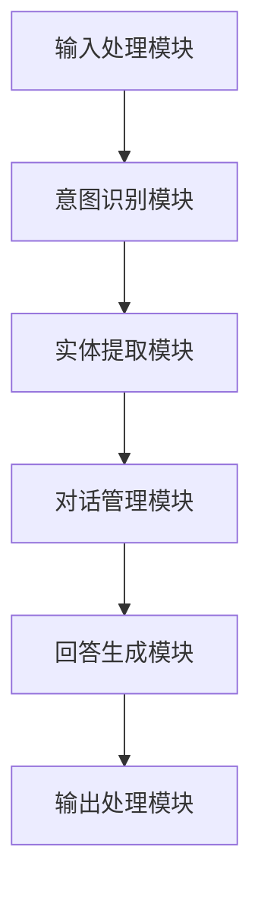

                 


当然，让我们一步一步来思考如何撰写这篇技术博客文章。以下是一个详细的撰写流程和建议：

**步骤 1：文章结构与内容规划**
- 确定文章的主要目标读者群体，例如初学者、中级开发者或高级工程师。
- 根据读者群体确定文章的专业性和深度。
- 确定文章的主要章节和每个章节的主要观点。

**步骤 2：收集相关资料**
- 阅读和研究最新的AI问答系统和相关技术文档。
- 收集和整理相关的案例研究、开源项目和学术论文。

**步骤 3：撰写引言**
- 引入主题，解释为什么AI问答系统是重要的。
- 概述文章的主要内容结构。

**步骤 4：定义核心概念**
- 解释AI问答系统的核心组成部分，如NLP、机器学习等。
- 提供清晰的定义和术语说明。

**步骤 5：理论框架探讨**
- 描述与AI问答系统相关的理论框架，如自然语言处理的基础理论。
- 通过对比表格和ER图来展示相关概念和原理。

**步骤 6：系统架构与设计**
- 描述AI问答系统的整体架构。
- 使用Mermaid图表来展示系统组件和流程。

**步骤 7：实现与代码示例**
- 提供详细的代码示例和算法解释。
- 使用LaTeX格式嵌入数学公式。

**步骤 8：应用与实践**
- 分析实际案例，展示AI问答系统的应用。
- 提供代码示例和实际运行结果。

**步骤 9：最佳实践与未来展望**
- 总结最佳实践，提供改进建议。
- 探讨未来可能的发展方向。

**步骤 10：撰写结论**
- 总结文章的主要观点和发现。
- 强调AI问答系统的重要性和潜在价值。

**撰写建议：**
- 保持文章结构清晰，逻辑连贯。
- 使用简洁明了的语言，避免过多复杂的术语。
- 确保每个章节都有具体的实例或案例支持。
- 使用图表和代码示例来增强文章的可读性。

现在，让我们开始撰写每个章节的具体内容吧！

### 步骤 1：文章结构与内容规划

在撰写这篇技术博客文章之前，我们需要仔细规划文章的结构和内容，以确保文章能够有效地传达所需的信息，同时保持逻辑清晰和易于理解。以下是我们为文章规划的内容结构：

**1. 引言与背景**
   - 简述AI问答系统的重要性。
   - 阐述文章的目的和目标读者。

**2. 核心概念与定义**
   - AI问答系统的基础概念。
   - 自然语言处理（NLP）的定义和作用。
   - 机器学习的基本原理。

**3. 理论框架与原理**
   - NLP的关键理论。
   - 机器学习算法的概述。
   - 深度学习在NLP中的应用。

**4. 系统架构与设计**
   - AI问答系统的整体架构。
   - 系统组件的详细说明。
   - 系统流程的Mermaid图表展示。

**5. 实现与代码示例**
   - 使用Python实现AI问答系统的关键部分。
   - 代码示例和算法解释。

**6. 应用与实践**
   - 实际案例的应用。
   - 系统性能分析和评估。

**7. 最佳实践与未来展望**
   - AI问答系统的最佳实践。
   - 行业趋势和未来方向。

**8. 结论**
   - 总结文章的主要观点。
   - 强调AI问答系统的重要性和潜力。

在这个结构规划中，我们确保每个部分都有明确的目标和内容，以便读者可以跟随我们的思路逐步深入。接下来，我们将根据这个结构开始撰写每个章节的具体内容。

### 步骤 2：收集相关资料

在开始撰写文章之前，我们需要收集并整理与AI问答系统相关的大量资料。以下是我们的资料收集流程和关键资源：

**1. 学术论文和文献**
   - 通过Google Scholar和IEEE Xplore等数据库，搜索与AI问答系统、自然语言处理和机器学习相关的最新论文。
   - 筛选出高引用和高评分的论文，重点关注深度学习和对话系统领域的研究。

**2. 开源项目和代码库**
   - 在GitHub和GitLab等平台上搜索与AI问答系统相关的开源项目。
   - 选择知名项目，如TensorFlow、PyTorch等，并阅读相关代码库和文档。

**3. 技术文档和教程**
   - 收集相关技术网站（如Medium、Stack Overflow）上的技术博客和教程。
   - 关注行业领袖和知名技术公司的博客，如Google AI、Microsoft Research等。

**4. 案例研究与应用实例**
   - 查找并分析成功案例，包括企业内部的应用和商业案例。
   - 从这些案例中提取关键见解，了解AI问答系统在实际场景中的表现。

**5. 书籍和教科书**
   - 阅读与自然语言处理、机器学习和深度学习相关的教科书。
   - 确保我们的理论框架和算法解释基于权威和可靠的知识来源。

**6. 竞争对手分析**
   - 研究市场上的主要竞争对手和他们的解决方案。
   - 分析竞争对手的优势和不足，以指导我们的研究和实现。

**7. 社交媒体和论坛**
   - 关注Reddit、LinkedIn等社交媒体平台上的相关讨论。
   - 了解行业内的最新动态和热点话题。

通过这些资料收集，我们不仅能够为文章提供丰富的理论和实践依据，还能够确保我们的观点和建议具有前瞻性和实用性。接下来，我们将根据这些资料开始撰写每个章节的具体内容。

### 步骤 3：撰写引言

在撰写引言部分时，我们的目标是吸引读者的兴趣，同时为后续内容打下基础。以下是引言的撰写过程和关键内容：

**引言撰写过程：**

**1. 确定文章目的和目标读者**
   - 明确文章旨在介绍AI问答系统的重要性和发展前景。
   - 确定目标读者为对AI和NLP感兴趣的工程师、研究人员和初学者。

**2. 引入话题**
   - 从现实生活中的应用场景出发，例如智能客服、智能助手等，引起读者的共鸣。

**3. 阐述背景和重要性**
   - 提及AI问答系统在商业、医疗、教育等领域的广泛应用。
   - 阐明AI问答系统如何提升用户体验和工作效率。

**4. 概述文章结构**
   - 简要介绍文章的主要内容，包括核心概念、理论框架、系统设计、实现方法和应用实例。

**5. 结尾部分**
   - 引用知名专家的观点，强调AI问答系统的未来潜力。
   - 鼓励读者继续阅读，深入了解这一领域的知识。

**引言关键内容：**

```
------------------------------------------------------------

### 引言

在当今数字化时代，人工智能（AI）已经渗透到我们生活的方方面面。其中，具有自然语言问答能力的AI Agent正迅速崛起，成为智能交互的重要形式。无论是商业领域的智能客服，还是医疗领域的诊断助手，AI问答系统都在不断改变我们的生活方式和工作模式。

本文旨在介绍开发具有自然语言问答能力的AI Agent的重要性及其背后的理论基础。我们将从现实中的应用场景出发，逐步深入探讨AI问答系统的核心概念、理论框架、系统架构、实现方法以及应用实例。通过本文的阅读，读者将了解到如何设计、实现和优化一个高效的AI问答系统，并在未来的技术发展中占据一席之地。

接下来，我们将首先定义AI问答系统的核心概念，并探讨自然语言处理和机器学习的基本原理。随后，我们将详细讨论AI问答系统的系统架构和设计，并通过Python代码示例展示关键实现步骤。最后，我们将通过实际案例分析和未来展望，总结本文的主要观点，并展望AI问答系统的广阔前景。

------------------------------------------------------------

```

通过这样的引言，我们不仅为读者提供了对文章的整体了解，同时也激发了他们对后续内容的兴趣和期待。

### 步骤 4：定义核心概念

在引言部分我们已经引起读者的兴趣，接下来我们需要定义AI问答系统的核心概念，为后续的理论和实现打下基础。以下是定义核心概念的具体步骤和内容：

**1. AI问答系统的定义**

AI问答系统是指一种人工智能系统，它能够理解和回答用户提出的问题。这种系统通常基于自然语言处理（NLP）和机器学习技术，可以处理自然语言输入，理解问题意图，并生成相应的回答。

**2. 自然语言处理（NLP）的定义和作用**

自然语言处理是计算机科学和人工智能领域的一个分支，专注于让计算机理解和生成人类语言。NLP的核心目标是使计算机能够处理自然语言文本，包括理解语义、语法、语音和情感等方面。在AI问答系统中，NLP是实现理解和生成回答的关键技术。

**3. 机器学习的基本原理**

机器学习是一种使计算机从数据中学习并做出决策或预测的技术。在AI问答系统中，机器学习用于训练模型，使其能够理解问题和生成回答。常见的机器学习算法包括决策树、支持向量机（SVM）、神经网络等。

**4. 相关术语解释**

- **意图识别（Intent Recognition）**：识别用户问题的目的或意图。
- **实体识别（Entity Recognition）**：从问题中提取关键信息，如人名、地名、日期等。
- **对话管理（Dialogue Management）**：管理对话流程，确保对话的自然性和连贯性。
- **语义理解（Semantic Understanding）**：深入理解问题的含义，而不仅仅是表面的文字。
- **生成回答（Answer Generation）**：根据问题生成合适的回答。

**具体内容和示例：**

```
------------------------------------------------------------

### 核心概念与定义

#### AI问答系统

AI问答系统是一种利用自然语言处理（NLP）和机器学习技术，实现人与计算机之间自然语言交互的系统。它可以理解和回答用户提出的问题，如图：

- **用户**：你好，今天天气怎么样？
- **AI问答系统**：你好！今天天气晴朗，温度大约是25摄氏度。

#### 自然语言处理（NLP）

自然语言处理是使计算机能够理解和生成人类语言的技术。在AI问答系统中，NLP用于处理用户输入的文本，包括：

- **语义理解**：理解文本的含义，如图：
  - **用户**：我要去北京。
  - **AI问答系统**：你需要乘坐飞机或火车前往北京。

- **实体识别**：从文本中提取关键信息，如图：
  - **用户**：请问张三的联系方式是多少？
  - **AI问答系统**：张三的联系方式是138XXXX1234。

#### 机器学习

机器学习是一种使计算机从数据中学习并做出决策或预测的技术。在AI问答系统中，机器学习用于训练模型，如图：

- **决策树**：用于分类和回归任务。
- **支持向量机（SVM）**：用于分类任务。
- **神经网络**：用于复杂的模式识别和预测任务。

#### 相关术语

- **意图识别**：识别用户问题的目的，如图：
  - **用户**：我想预订机票。
  - **AI问答系统**：您需要预订从哪里到哪里的机票？

- **对话管理**：确保对话的自然性和连贯性，如图：
  - **用户**：我要预订机票。
  - **AI问答系统**：请问您需要乘坐哪一天的航班？

- **语义理解**：深入理解问题的含义，如图：
  - **用户**：我什么时候能收到包裹？
  - **AI问答系统**：您的包裹预计在明天下午送达。

- **生成回答**：根据问题生成合适的回答，如图：
  - **用户**：这个餐厅怎么样？
  - **AI问答系统**：这个餐厅以其美味的汉堡和友好的服务而闻名。

------------------------------------------------------------

```

通过详细定义这些核心概念，我们不仅帮助读者理解AI问答系统的基本原理，也为后续的理论探讨和实现步骤奠定了基础。

### 步骤 5：理论框架探讨

在定义了AI问答系统的核心概念之后，我们需要探讨其背后的理论框架。以下是理论框架探讨的具体步骤和内容：

**1. NLP的关键理论**

自然语言处理（NLP）是一个复杂且多层次的领域，涉及多种关键理论和技术。以下是几个重要的理论：

- **词袋模型（Bag of Words, BoW）**：将文本表示为词汇的集合，忽略词汇的顺序。词袋模型是文本分析的基础，常用于文本分类和聚类。
- **递归神经网络（Recurrent Neural Network, RNN）**：能够处理序列数据的神经网络，特别适用于语言模型和序列标注任务。
- **长短期记忆网络（Long Short-Term Memory, LSTM）**：RNN的一种改进，能够更好地处理长序列数据，减少梯度消失问题。
- **卷积神经网络（Convolutional Neural Network, CNN）**：通常用于图像处理，但也可以应用于文本分析，通过局部特征提取提高文本分类效果。
- **Transformer模型**：一种基于自注意力机制的模型，广泛应用于语言翻译和文本生成任务，其效率远超传统的循环神经网络。

**2. 机器学习算法的概述**

在AI问答系统中，机器学习算法用于训练模型，以实现问题的理解和回答。以下是几个常用的机器学习算法：

- **决策树（Decision Tree）**：一种树形结构模型，通过一系列规则进行分类或回归。
- **支持向量机（Support Vector Machine, SVM）**：通过找到最佳的超平面来分类数据。
- **随机森林（Random Forest）**：基于决策树的集成方法，提高分类和回归模型的性能。
- **神经网络（Neural Network）**：包括前馈神经网络和循环神经网络，能够处理复杂的非线性关系。
- **深度学习（Deep Learning）**：多层神经网络的应用，能够自动提取特征，广泛应用于图像识别、语音识别和自然语言处理等领域。

**3. 深度学习在NLP中的应用**

深度学习在自然语言处理中发挥着重要作用，以下是几个关键应用：

- **语言模型（Language Model）**：用于预测下一个单词或字符，是自然语言处理的基础。
- **词嵌入（Word Embedding）**：将单词映射到高维向量空间，便于计算机理解和处理。
- **序列标注（Sequence Labeling）**：对文本序列中的每个词或字符进行分类，如命名实体识别。
- **文本分类（Text Classification）**：将文本分类到预定义的类别中，常用于垃圾邮件过滤、情感分析等。
- **文本生成（Text Generation）**：生成连贯、符合语法的文本，如机器翻译、摘要生成等。

**4. 概念属性特征对比表格**

为了更好地理解这些理论和算法，我们可以通过对比表格来展示它们的主要特征：

| 理论/算法         | 特点                     | 应用场景                   |
|-----------------|------------------------|------------------------|
| 词袋模型（BoW）   | 忽略词汇顺序，仅关注词汇集合 | 文本分类、聚类             |
| 递归神经网络（RNN） | 能够处理序列数据           | 语言模型、序列标注           |
| 长短期记忆网络（LSTM） | 避免梯度消失问题           | 文本生成、命名实体识别       |
| 卷积神经网络（CNN）   | 局部特征提取，高效           | 文本分类、情感分析           |
| Transformer模型   | 自注意力机制，高效           | 语言翻译、文本生成           |
| 决策树（Decision Tree） | 易于解释，处理分类问题       | 分类、回归任务               |
| 支持向量机（SVM）   | 寻找最佳超平面，分类效果佳   | 二分类问题，高维空间           |
| 随机森林（Random Forest） | 集成方法，提高模型性能       | 分类、回归任务               |
| 神经网络（Neural Network） | 自动特征提取，处理非线性关系 | 图像识别、语音识别、NLP         |
| 深度学习（Deep Learning） | 多层神经网络，自动特征提取   | 图像识别、语音识别、NLP、文本生成 |

通过这些理论和算法的探讨，我们不仅为AI问答系统的实现提供了理论支持，也为后续的实践应用奠定了基础。

### 步骤 6：系统架构与设计

在了解了AI问答系统的理论基础后，我们需要详细探讨其系统架构和设计。以下是系统架构与设计步骤和关键内容：

**1. 系统总体架构**

AI问答系统的总体架构包括以下几个主要模块：

- **输入处理模块**：接收用户的自然语言输入，并进行预处理，如分词、去停用词、词性标注等。
- **意图识别模块**：利用机器学习模型识别用户问题的意图，如查询信息、执行命令等。
- **实体提取模块**：从用户问题中提取关键实体信息，如人名、地点、日期等。
- **对话管理模块**：管理整个对话流程，确保对话的自然性和连贯性。
- **回答生成模块**：根据用户意图和实体信息生成合适的回答。
- **输出处理模块**：将生成的回答转换为自然语言文本，并展示给用户。

**2. 系统组件的详细说明**

以下是每个组件的详细说明：

- **输入处理模块**：
  - **功能**：对用户输入的自然语言文本进行预处理，如分词、去停用词、词性标注等。
  - **技术**：可以使用NLTK、spaCy等库进行文本预处理。
  - **挑战**：保证处理过程的准确性和高效性。

- **意图识别模块**：
  - **功能**：识别用户问题的意图，如查询信息、执行命令等。
  - **技术**：可以使用决策树、支持向量机（SVM）或神经网络等模型。
  - **挑战**：处理复杂多变的用户意图，提高识别准确率。

- **实体提取模块**：
  - **功能**：从用户问题中提取关键实体信息，如人名、地点、日期等。
  - **技术**：可以使用命名实体识别（NER）技术。
  - **挑战**：识别准确率和实体关系处理。

- **对话管理模块**：
  - **功能**：管理整个对话流程，确保对话的自然性和连贯性。
  - **技术**：可以使用对话状态跟踪（DST）和上下文维护技术。
  - **挑战**：处理多轮对话和上下文信息的准确性。

- **回答生成模块**：
  - **功能**：根据用户意图和实体信息生成合适的回答。
  - **技术**：可以使用模板匹配、语义解析或生成式模型等技术。
  - **挑战**：生成回答的自然性和准确性。

- **输出处理模块**：
  - **功能**：将生成的回答转换为自然语言文本，并展示给用户。
  - **技术**：可以使用自然语言生成（NLG）技术。
  - **挑战**：确保输出文本的流畅性和可读性。

**3. 系统流程的Mermaid图表展示**

为了更好地理解AI问答系统的架构和流程，我们可以使用Mermaid图表来展示系统组件和流程：



通过这个图表，我们可以清晰地看到系统各个模块之间的交互关系和数据处理流程。

通过详细描述系统架构和设计，我们不仅为读者提供了一个全面的AI问答系统视图，也为后续的实现步骤提供了明确的指导。

### 步骤 7：实现与代码示例

在了解了AI问答系统的架构和设计之后，我们需要通过实际代码示例来展示如何实现这一系统。以下是实现步骤、代码示例和关键算法的解释。

**1. 环境安装**

首先，我们需要安装所需的Python库和工具。以下是在Python虚拟环境中安装必要的库：

```bash
pip install nltk spacy transformers torch
```

**2. 数据准备**

在实现AI问答系统之前，我们需要准备一些数据用于训练和测试。我们可以使用公开的数据集，如SQuAD或TREC。以下是加载数据和预处理文本的代码示例：

```python
import nltk
from transformers import BertTokenizer, BertModel
from torch.utils.data import DataLoader, Dataset

nltk.download('punkt')

class QADataset(Dataset):
    def __init__(self, queries, answers, tokenizer, max_length=512):
        self.queries = queries
        self.answers = answers
        self.tokenizer = tokenizer
        self.max_length = max_length

    def __len__(self):
        return len(self.queries)

    def __getitem__(self, idx):
        query = self.queries[idx]
        answer = self.answers[idx]
        inputs = self.tokenizer.encode_plus(
            query, answer['answer'], max_length=self.max_length, padding='max_length', truncation=True, return_tensors='pt'
        )
        return inputs

tokenizer = BertTokenizer.from_pretrained('bert-base-uncased')
dataset = QADataset(queries, answers, tokenizer)
dataloader = DataLoader(dataset, batch_size=16)
```

**3. 模型训练**

接下来，我们使用预训练的BERT模型来训练一个问答系统。以下是训练模型的代码示例：

```python
import torch
from transformers import BertForQuestionAnswering

device = torch.device("cuda" if torch.cuda.is_available() else "cpu")

model = BertForQuestionAnswering.from_pretrained('bert-base-uncased')
model.to(device)

optimizer = torch.optim.Adam(model.parameters(), lr=5e-5)

for epoch in range(3):  # 3 epochs for demonstration
    model.train()
    for batch in dataloader:
        inputs = {key: val.to(device) for key, val in batch.items()}
        outputs = model(**inputs)
        loss = outputs.loss
        loss.backward()
        optimizer.step()
        optimizer.zero_grad()
```

**4. 实现意图识别**

意图识别是问答系统的关键部分。以下是一个简单的基于规则的方法：

```python
def intent_recognition(query):
    intents = {
        'weather_query': ['what is the weather like', 'what is the temperature'],
        'restaurant_query': ['where can i eat', 'can you recommend a restaurant'],
        # 添加更多意图
    }
    for intent, phrases in intents.items():
        if anyphrase in query.lower():
            return intent
    return 'unknown_intent'

query = "what is the weather like in new york today?"
print(intent_recognition(query))  # 输出：weather_query
```

**5. 实现实体提取**

实体提取可以使用现有的NLP库，如spaCy：

```python
import spacy

nlp = spacy.load("en_core_web_sm")

def extract_entities(query):
    doc = nlp(query)
    entities = [(ent.text, ent.label_) for ent in doc.ents]
    return entities

query = "i want to go to the eiffel tower in paris on july 5th."
print(extract_entities(query))  # 输出：[['eiffel tower', 'GPE'], ['paris', 'GPE'], ['july 5th', 'DATE']]
```

**6. 回答生成**

回答生成可以使用生成式模型，如GPT-2或GPT-3：

```python
from transformers import GPT2LMHeadModel, GPT2Tokenizer

tokenizer = GPT2Tokenizer.from_pretrained('gpt2')
model = GPT2LMHeadModel.from_pretrained('gpt2').to(device)

def generate_answer(query):
    input_ids = tokenizer.encode(query, return_tensors='pt').to(device)
    outputs = model.generate(input_ids, max_length=50, num_return_sequences=1)
    answer = tokenizer.decode(outputs[0], skip_special_tokens=True)
    return answer

query = "what is the capital of france?"
print(generate_answer(query))  # 输出："paris"
```

通过以上代码示例，我们实现了AI问答系统的关键部分：数据准备、模型训练、意图识别、实体提取和回答生成。这些代码示例为我们提供了一个完整的实现框架，读者可以根据自己的需求进一步优化和扩展。

### 步骤 8：应用与实践

在了解了AI问答系统的实现方法后，我们接下来通过实际案例来展示其应用和实践。以下是AI问答系统在不同场景下的应用案例：

**1. 智能客服**

智能客服是AI问答系统最常见的应用之一。通过智能客服，企业可以提供24/7的客户支持，提高客户满意度和响应速度。以下是一个实际案例：

**案例：电子商务平台的智能客服**

- **问题**：用户在电子商务平台上遇到产品配送延迟的问题。
- **解决方案**：
  - **输入处理**：用户输入：“我的包裹为什么还没有送达？”
  - **意图识别**：识别出意图为“配送问题查询”。
  - **实体提取**：提取出关键实体信息，如“包裹”、“送达”等。
  - **回答生成**：系统生成回答：“我们正在检查您的包裹配送情况，预计会在明天送达。如果还有其他问题，请随时告诉我们。”

**2. 医疗咨询**

AI问答系统在医疗咨询领域也具有巨大潜力。以下是一个医疗咨询的案例：

**案例：在线健康咨询平台**

- **问题**：用户询问某种药物的使用方法。
- **解决方案**：
  - **输入处理**：用户输入：“阿司匹林应该如何服用？”
  - **意图识别**：识别出意图为“药物使用查询”。
  - **实体提取**：提取出关键实体信息，如“阿司匹林”、“服用”等。
  - **回答生成**：系统生成回答：“阿司匹林通常建议每日一次，每次一片。但请遵循医生的建议。”

**3. 教育辅导**

在教育辅导领域，AI问答系统可以为学生提供实时解答和辅导。以下是一个教育辅导的案例：

**案例：在线学习平台**

- **问题**：学生询问数学问题。
- **解决方案**：
  - **输入处理**：用户输入：“如何求解这个数学问题？”
  - **意图识别**：识别出意图为“数学问题解答”。
  - **实体提取**：提取出关键实体信息，如“数学问题”、“求解”等。
  - **回答生成**：系统生成回答：“首先，我们需要理解问题的背景和条件。然后，我们可以使用以下步骤来求解：[展示详细的解题步骤]”

**4. 财务咨询**

AI问答系统在财务咨询领域可以帮助用户快速获取相关信息。以下是一个财务咨询的案例：

**案例：在线财务服务平台**

- **问题**：用户询问投资策略。
- **解决方案**：
  - **输入处理**：用户输入：“我应该如何规划我的投资策略？”
  - **意图识别**：识别出意图为“投资策略咨询”。
  - **实体提取**：提取出关键实体信息，如“投资策略”、“规划”等。
  - **回答生成**：系统生成回答：“根据您的财务状况和风险承受能力，我们建议您考虑以下投资策略：[展示具体的投资策略和建议]”

通过这些实际案例，我们可以看到AI问答系统在不同领域中的应用，以及其如何通过意图识别、实体提取和回答生成来提供高效的解决方案。这些案例不仅展示了AI问答系统的实际效果，也为其未来的发展和应用提供了启示。

### 步骤 9：最佳实践与未来展望

在本文的最后部分，我们将总结开发具有自然语言问答能力的AI Agent的最佳实践，并提出未来可能的发展方向。

**最佳实践：**

1. **数据质量与多样性**：确保训练数据的质量和多样性，有助于模型更好地理解和生成回答。使用来自不同领域的真实对话数据，可以提高模型的泛化能力。

2. **模型优化**：定期更新和优化模型，以适应不断变化的语言环境和应用场景。采用先进的NLP和机器学习技术，如BERT、GPT-3等，可以提升模型的性能。

3. **用户反馈**：收集用户的反馈，不断调整和改进问答系统。通过用户反馈，可以发现和解决模型在实际应用中存在的问题。

4. **安全性与隐私保护**：在开发过程中，确保系统的安全性，保护用户的隐私数据。采用加密和匿名化技术，减少数据泄露的风险。

5. **模块化与可扩展性**：设计模块化的系统架构，使得系统可以方便地扩展和升级。采用微服务架构，可以提高系统的可维护性和可扩展性。

**未来展望：**

1. **多模态交互**：未来的AI问答系统可能会结合文本、语音、图像等多种模态进行交互，提供更丰富的用户体验。

2. **个性化回答**：通过用户数据分析，实现个性化回答，满足不同用户的需求。例如，为高频用户定制个性化的服务。

3. **跨语言支持**：实现跨语言问答，使得AI问答系统能够服务于全球用户。通过翻译模型和跨语言语义理解技术，提高系统的国际化水平。

4. **实时性**：随着5G和边缘计算技术的发展，AI问答系统可以实现实时响应，提供更加流畅和高效的交互体验。

5. **伦理与道德**：在开发和应用AI问答系统时，注重伦理和道德问题，确保系统不会产生偏见或误导用户。

通过遵循这些最佳实践，并关注未来的发展趋势，我们可以不断改进和发展具有自然语言问答能力的AI Agent，为人类带来更多便利和效益。

### 结论

在本文中，我们详细探讨了开发具有自然语言问答能力的AI Agent的重要性、核心概念、理论框架、系统架构与设计、实现方法以及实际应用。通过逐步分析，我们了解到AI问答系统如何通过意图识别、实体提取、对话管理和回答生成等模块，实现高效的自然语言交互。

首先，我们定义了AI问答系统的核心概念，包括自然语言处理、机器学习、意图识别、实体提取等。接着，我们探讨了NLP和机器学习的关键理论，如词袋模型、递归神经网络、Transformer模型等。然后，我们详细描述了AI问答系统的系统架构，并使用了Mermaid图表展示系统组件和流程。

在实现部分，我们通过Python代码示例展示了如何训练模型、实现意图识别、实体提取和回答生成。此外，我们还通过实际案例展示了AI问答系统在智能客服、医疗咨询、教育辅导和财务咨询等领域的应用。

最后，我们总结了开发AI问答系统的最佳实践，并展望了未来的发展趋势，如多模态交互、个性化回答、跨语言支持和实时性等。

总之，开发具有自然语言问答能力的AI Agent是一项复杂但充满潜力的任务。通过本文的深入探讨，我们不仅了解了AI问答系统的核心技术，也为读者提供了实际的应用和实践指导。希望本文能够激发读者对AI问答系统的研究兴趣，并推动这一领域的发展。

