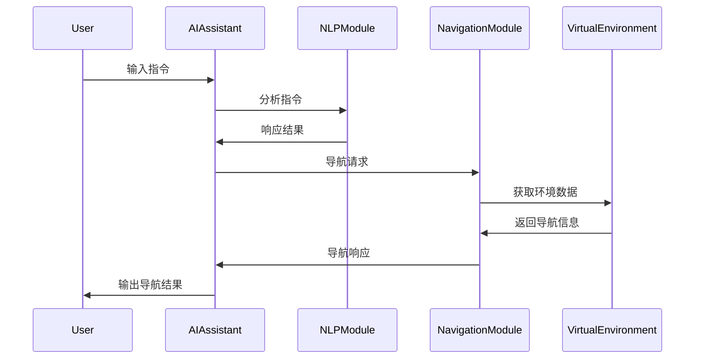

                 

### 文章标题

开发具有虚拟现实交互能力的AI Agent

### 关键词

虚拟现实、AI Agent、交互设计、融合应用、实现与开发

### 摘要

本文旨在深入探讨虚拟现实与AI Agent的融合应用，阐述开发具有虚拟现实交互能力的AI Agent的技术原理与实践方法。文章首先介绍了虚拟现实与AI Agent的基本概念和背景，接着详细分析了虚拟现实技术的基础和AI Agent的关键技术，然后探讨了虚拟现实与AI Agent融合应用的原理和设计方法。随后，文章通过一个实战案例，详细展示了如何开发一个具有虚拟现实交互能力的AI Agent，并对其核心实现进行了代码解析和案例分析。最后，文章提出了虚拟现实交互能力AI Agent的最佳实践和未来展望。

---

# 目录大纲

1. **虚拟现实与AI Agent概述**
   1.1 虚拟现实技术概述
   1.2 AI Agent的基本概念
   1.3 虚拟现实与AI Agent的关系

2. **虚拟现实技术基础**
   2.1 虚拟现实硬件概述
   2.2 虚拟现实软件架构
   2.3 虚italent Reality 交互原理

3. **AI Agent基础**
   3.1 AI Agent的概念与分类
   3.2 AI Agent的关键技术
   3.3 AI Agent的应用领域

4. **虚拟现实与AI Agent融合应用**
   4.1 融合应用概述
   4.2 虚拟现实与AI Agent的交互设计
   4.3 融合应用案例分析

5. **AI Agent在虚拟现实中的实现**
   5.1 AI Agent开发流程
   5.2 虚拟现实开发环境搭建
   5.3 AI Agent核心功能实现

6. **AI Agent与虚拟现实交互设计**
   6.1 用户交互模式设计
   6.2 AI Agent响应机制
   6.3 交互效果评估

7. **虚拟现实交互能力的AI Agent开发实战**
   7.1 项目介绍
   7.2 系统功能设计
   7.3 系统架构设计
   7.4 核心实现源代码分析
   7.5 实际案例分析与讲解
   7.6 项目小结

8. **最佳实践与未来展望**
   8.1 虚拟现实交互能力AI Agent的最佳实践
   8.2 AI Agent在虚拟现实中的应用前景
   8.3 未来发展趋势与挑战

---

# 第一部分：虚拟现实与AI Agent概述

## 第1章：虚拟现实与AI Agent背景

### 1.1 虚拟现实技术概述

虚拟现实（Virtual Reality，简称VR）是一种可以创建和体验虚拟世界的计算机仿真系统。它通过模拟人类的视觉、听觉、触觉等感官体验，使用户能够在虚拟环境中自由地互动和探索。VR技术起源于20世纪60年代的美国，随着计算机技术和图形处理能力的提升，VR技术逐渐从实验室走向了市场。

**核心组成部分：**

- **硬件设备：**包括头戴式显示器（HMD）、跟踪设备、数据手套等，用于提供沉浸式的视觉、听觉和触觉体验。
- **软件系统：**包括虚拟现实内容创建工具、应用程序和用户界面等，用于生成和交互虚拟环境。

**分类与应用场景：**

- **沉浸式VR：**提供完全沉浸式的体验，用户仿佛置身于虚拟世界。
- **非沉浸式VR：**用户仅通过屏幕观察虚拟世界，不具备沉浸式体验。
- **应用场景：**包括游戏、教育培训、医疗康复、工程模拟等多个领域。

### 1.2 AI Agent的基本概念

AI Agent是一种能够自主决策和执行任务的计算机程序，具备智能行为和交互能力。它通常基于人工智能技术，特别是机器学习和深度学习算法，能够在给定环境下根据感知信息进行推理和行动。

**定义与特点：**

- **定义：**AI Agent是指一个具有目标、感知和行动能力的系统，能够在动态环境中独立完成特定任务。
- **特点：**自主性、适应性、智能性和交互性。

**分类与结构：**

- **基于规则：**遵循预定义的规则进行决策和行动。
- **基于模型：**使用学习到的模型进行预测和决策。
- **混合型：**结合规则和模型进行决策。

**核心功能与应用场景：**

- **核心功能：**感知、规划、决策和行动。
- **应用场景：**包括智能助手、自动驾驶、机器人控制等多个领域。

### 1.3 虚拟现实与AI Agent的关系

虚拟现实与AI Agent的结合为开发交互性强、体验丰富的智能系统提供了新的契机。两者的融合不仅在技术上具有互补性，而且在应用上具有广阔的前景。

**融合的必要性：**

- **技术互补：**VR提供了沉浸式的用户体验，而AI Agent提供了智能决策和交互能力，两者的结合能够实现更自然的用户交互。
- **应用创新：**虚拟现实与AI Agent的结合可以创造出新的应用场景，如智能虚拟导游、虚拟培训师等。

**融合的优势：**

- **提升用户体验：**通过AI Agent，用户可以获得更加个性化和智能化的服务。
- **增强交互体验：**AI Agent能够根据用户的动作和反馈，动态调整虚拟环境，提供更加自然的交互体验。

**融合的挑战与机遇：**

- **挑战：**包括技术实现难度、用户体验优化、隐私保护等方面。
- **机遇：**随着技术的进步和市场的需求，虚拟现实交互能力的AI Agent有望在多个领域得到广泛应用。

---

## 第2章：虚拟现实技术基础

### 2.1 虚拟现实硬件概述

虚拟现实硬件是实现沉浸式体验的关键组成部分，主要包括头戴式显示器（HMD）、跟踪设备和数据手套等。

**常见虚拟现实硬件设备：**

- **头戴式显示器（HMD）：**如Oculus Rift、HTC Vive和Valve Index等，提供高分辨率和低延迟的视觉体验。
- **跟踪设备：**包括外部跟踪器和内置传感器，用于精确跟踪用户的头部和手部运动。
- **数据手套：**用于模拟手部动作，提供触觉反馈。

**硬件选型与配置：**

- **选型：**根据应用场景和预算选择合适的硬件设备，如游戏开发可能需要高性能的HMD，而教育培训可能需要易于操作的数据手套。
- **配置：**包括硬件的兼容性、扩展性和维护成本等因素。

**硬件维护与升级：**

- **维护：**定期检查硬件设备，确保其正常运行，如清理灰尘、更新固件等。
- **升级：**根据技术发展和市场需求，适时进行硬件升级，以提升用户体验。

### 2.2 虚拟现实软件架构

虚拟现实软件架构是创建和运行虚拟现实应用的基础。它通常包括以下几个核心模块：

**虚拟现实软件的发展历程：**

- **早期阶段：**主要以2D图像为主，缺乏沉浸感。
- **成熟阶段：**随着图形处理能力和算法的进步，实现了高质量的3D图像和沉浸式体验。

**核心模块：**

- **渲染引擎：**负责生成虚拟环境的图像，包括光线追踪、阴影效果和纹理映射等。
- **交互系统：**处理用户输入和虚拟环境之间的交互，如手势识别、语音控制和位置跟踪等。
- **用户界面：**提供用户与虚拟环境交互的界面，包括菜单、按钮和图标等。

**设计原则与实现方法：**

- **设计原则：**用户友好、响应快速、交互自然。
- **实现方法：**使用图形编程语言（如OpenGL、DirectX）和虚拟现实开发框架（如Unity、Unreal Engine）进行开发。

### 2.3 虚拟现实交互原理

虚拟现实交互原理是用户与虚拟环境之间建立联系的关键。它涉及到如何处理用户的输入和如何响应用户的输入。

**基本原理：**

- **感知：**通过视觉、听觉和触觉等感官，用户感知虚拟环境。
- **输入：**用户通过头部、手部等动作进行输入。
- **处理：**虚拟环境根据用户的输入进行响应和处理。
- **输出：**虚拟环境通过视觉、听觉和触觉等感官向用户输出反馈。

**关键技术：**

- **手势识别：**通过摄像头和传感器捕捉用户的手部动作，并将其转换为虚拟环境中的操作。
- **语音控制：**通过语音识别技术，将用户的语音指令转换为虚拟环境中的操作。
- **位置跟踪：**通过外部跟踪器和内置传感器，实时跟踪用户的位置和运动。

**设计与实践：**

- **设计：**根据用户需求和虚拟环境的特性，设计直观、自然的交互方式。
- **实践：**通过用户测试和迭代优化，不断提升交互体验。

---

## 第3章：AI Agent基础

### 3.1 AI Agent的概念与分类

AI Agent是一种具有智能行为的计算机程序，能够自主感知环境、制定计划并执行行动。它是人工智能领域的一个重要分支，具有广泛的应用前景。

**基本概念：**

- **定义：**AI Agent是一个具有感知、规划、决策和行动能力的系统，能够在动态环境中独立完成任务。
- **特点：**自主性、适应性、智能性和交互性。

**分类方法：**

- **基于任务：**按照AI Agent执行的任务进行分类，如导航机器人、客服机器人等。
- **基于功能：**按照AI Agent的核心功能进行分类，如感知模块、规划模块和决策模块等。
- **基于环境：**按照AI Agent执行的环境进行分类，如室内环境、室外环境和虚拟环境等。

**应用领域：**

- **智能助手：**如虚拟客服、智能家居助手等。
- **自动驾驶：**如自动驾驶汽车、无人驾驶飞机等。
- **机器人控制：**如工业机器人、服务机器人等。

### 3.2 AI Agent的关键技术

AI Agent的核心技术是其智能行为的基础，主要包括感知、规划和决策等关键环节。

**人工智能基础算法：**

- **机器学习：**通过训练数据集，使计算机学会识别模式和进行预测。
- **深度学习：**一种特殊的机器学习算法，通过多层神经网络模拟人类大脑的学习过程。
- **强化学习：**通过试错和反馈，使AI Agent在复杂环境中进行学习和优化。

**机器学习与深度学习：**

- **机器学习：**用于AI Agent的感知和决策过程，如图像识别和语音识别等。
- **深度学习：**用于复杂任务，如自动驾驶和游戏AI等。

**自然语言处理与语音识别：**

- **自然语言处理：**使计算机能够理解和生成人类语言，用于智能对话系统等。
- **语音识别：**将语音信号转换为文本或命令，用于语音助手和语音控制等。

### 3.3 AI Agent的应用领域

AI Agent在多个领域展现了其强大的应用潜力，为行业带来了革命性的变化。

**智能助手与客服机器人：**

- **智能助手：**如Siri、Alexa等，提供日常生活中的信息查询和任务执行。
- **客服机器人：**如Chatbot，用于企业客户服务和在线咨询。

**智能家居与物联网：**

- **智能家居：**如智能照明、智能门锁等，提高家居生活的便利性和安全性。
- **物联网：**AI Agent可以实时监测和控制智能家居设备，实现智能化的家居环境。

**游戏与娱乐：**

- **游戏AI：**如游戏中的NPC（非玩家角色）和智能对手，提供丰富的游戏体验。
- **虚拟现实游戏：**AI Agent可以创建互动性的虚拟游戏环境，提高游戏的沉浸感。

**医疗与健康：**

- **医疗诊断：**AI Agent可以帮助医生进行疾病诊断和治疗方案推荐。
- **健康监测：**AI Agent可以实时监测用户的健康状况，提供健康建议和预警。

**教育与培训：**

- **虚拟教师：**AI Agent可以为学生提供个性化的教学服务和辅导。
- **虚拟实验室：**AI Agent可以创建模拟实验环境，帮助学生进行实践操作。

**工业与制造业：**

- **工业机器人：**AI Agent可以自动化生产流程，提高生产效率和质量。
- **智能供应链：**AI Agent可以优化库存管理，降低运营成本。

**农业与环境保护：**

- **农业监测：**AI Agent可以实时监测农田状况，提供种植建议。
- **环境保护：**AI Agent可以监控环境变化，预测自然灾害，提供防灾预警。

**交通与物流：**

- **自动驾驶：**AI Agent可以自动驾驶汽车、无人机等，提高交通效率和安全性。
- **物流优化：**AI Agent可以优化物流路线，减少运输成本。

**金融与保险：**

- **风险管理：**AI Agent可以分析市场数据，预测风险并提供风险管理建议。
- **保险服务：**AI Agent可以提供个性化的保险产品和服务。

**政府与公共服务：**

- **智能政务服务：**AI Agent可以提供在线咨询、审批和办理等服务，提高政府工作效率。
- **公共安全监控：**AI Agent可以实时监控公共安全事件，提供预警和应急响应。

### 3.4 AI Agent的发展趋势与挑战

随着人工智能技术的快速发展，AI Agent在未来将面临更多的机遇和挑战。

**发展趋势：**

- **智能化水平提升：**随着深度学习和强化学习等技术的进步，AI Agent的智能水平将不断提高。
- **跨领域应用：**AI Agent将在更多领域得到应用，如医疗、教育和金融等。
- **人机协作：**AI Agent将与人类更加紧密地协作，提高工作效率和生活质量。

**挑战：**

- **数据安全和隐私保护：**AI Agent依赖于大量数据，数据的安全和隐私保护将成为重要问题。
- **算法公平性和透明性：**算法的公平性和透明性是公众关注的焦点，需要加强监管和规范。
- **伦理和道德问题：**AI Agent在决策过程中需要遵循伦理和道德准则，避免对人类造成负面影响。

**未来展望：**

- **全面智能化：**AI Agent将在更多场景中实现全面智能化，提供更加个性化和智能化的服务。
- **人机融合：**AI Agent将与人类更加紧密地融合，实现人机共生的新时代。

---

## 第4章：虚拟现实与AI Agent融合应用

### 4.1 融合应用概述

虚拟现实（VR）与AI Agent的融合应用正在成为智能化交互的新趋势。这种融合不仅丰富了虚拟现实技术的应用场景，还为AI Agent提供了更加真实和丰富的交互环境。

**背景：**

随着VR技术的成熟和AI技术的发展，两者在近年来得到了广泛关注。虚拟现实为用户提供了一个沉浸式的体验环境，而AI Agent则提供了智能化的交互和决策能力。两者的结合为开发智能化、互动性强的虚拟环境提供了新的思路。

**发展趋势：**

- **智能化交互：**AI Agent能够根据用户的动作和反馈，动态调整虚拟环境，提供更加自然的交互体验。
- **个性化服务：**AI Agent能够基于用户的兴趣和行为，提供个性化的内容和服务。
- **增强现实（AR）：**除了VR，AI Agent还可以与AR技术结合，为用户提供增强现实体验。

**核心技术：**

- **多模态感知：**通过视觉、听觉和触觉等多模态感知技术，AI Agent能够更全面地理解用户。
- **自然语言处理：**AI Agent能够理解用户的自然语言指令，实现智能对话和交互。
- **深度学习和强化学习：**通过深度学习和强化学习算法，AI Agent能够不断学习和优化其行为和决策。

### 4.2 虚拟现实与AI Agent的交互设计

虚拟现实与AI Agent的交互设计是融合应用的核心。一个成功的交互设计不仅需要考虑到用户的体验，还需要充分利用AI Agent的智能能力。

**设计原则：**

- **直观性：**交互设计应该直观易用，用户能够快速理解和操作。
- **响应性：**虚拟环境应该能够实时响应用户的输入和动作。
- **个性化：**AI Agent应该能够根据用户的行为和偏好提供个性化的服务。
- **安全性：**交互设计需要确保用户数据的安全和隐私。

**交互模式设计：**

- **手势交互：**用户通过手势与虚拟环境进行交互，如手势识别、虚拟对象操作等。
- **语音交互：**用户通过语音与AI Agent进行交互，如语音指令、语音对话等。
- **触觉交互：**用户通过触觉与虚拟环境进行交互，如触觉反馈、虚拟物体的触感等。

**响应机制设计：**

- **实时响应：**AI Agent需要能够实时响应用户的输入和动作，提供即时的反馈。
- **智能决策：**AI Agent应该能够根据用户的输入和虚拟环境的状态，做出智能化的决策和调整。
- **错误处理：**当用户输入错误或系统出现故障时，AI Agent需要能够及时识别和处理，确保交互过程的顺畅。

### 4.3 融合应用案例分析

为了更好地理解虚拟现实与AI Agent的融合应用，以下是一个成功案例的分析。

**案例：智能虚拟导游**

**背景：**

智能虚拟导游是一个结合了VR和AI技术的应用，旨在为用户提供个性化、智能化的旅游体验。

**应用场景：**

用户可以通过VR头戴设备进入一个虚拟的旅游环境，与虚拟导游进行交互，了解景点的历史、文化和特色。

**核心功能：**

- **个性化推荐：**AI Agent根据用户的兴趣和偏好，推荐适合的景点和旅游路线。
- **智能问答：**用户可以通过语音或手势与虚拟导游进行对话，提问有关景点的问题。
- **动态导航：**虚拟导游能够根据用户的实时位置和需求，动态调整导航路径。

**交互体验优化：**

- **多模态感知：**通过视觉、听觉和触觉等多模态感知技术，提供更加真实的交互体验。
- **自然语言处理：**AI Agent能够理解用户的自然语言指令，实现流畅的对话交互。
- **深度学习和强化学习：**AI Agent通过不断学习和优化，提供更加智能化的服务。

**案例分析：**

**优点：**

- **个性化服务：**AI Agent能够根据用户的偏好提供定制化的旅游推荐，提升用户体验。
- **智能交互：**通过智能问答和动态导航，用户可以获得更加便捷和高效的旅游服务。
- **增强沉浸感：**VR技术为用户提供了沉浸式的旅游体验，增强了用户对景点的感受。

**不足：**

- **技术实现难度：**VR和AI技术的融合需要较高的技术门槛，实现过程中可能面临技术难题。
- **用户体验优化：**需要不断优化交互设计和响应机制，提升用户的满意度和舒适度。

**应用启示：**

- **技术创新：**通过VR和AI技术的融合，可以创造出更多创新的应用场景，提升用户体验。
- **跨学科合作：**虚拟现实和人工智能领域的交叉融合需要跨学科的合作，共同推动技术的发展。

---

## 第5章：AI Agent在虚拟现实中的实现

### 5.1 AI Agent开发流程

开发具有虚拟现实交互能力的AI Agent是一个复杂的过程，涉及多个阶段和环节。以下是AI Agent开发的一般流程：

**需求分析：**

在开发开始之前，首先需要明确AI Agent的应用场景和功能需求。通过与用户和利益相关者的沟通，了解他们的需求和期望，为后续的开发提供指导。

**系统设计：**

根据需求分析的结果，进行系统设计。系统设计包括功能设计、架构设计和交互设计等。功能设计定义AI Agent需要实现的核心功能；架构设计则定义系统的整体结构和模块划分；交互设计则确定用户与AI Agent的交互方式。

**技术选型：**

选择合适的技术和工具，包括虚拟现实开发框架（如Unity、Unreal Engine）、AI开发框架（如TensorFlow、PyTorch）和自然语言处理库（如NLTK、spaCy）等。

**实现与测试：**

根据系统设计和技术选型，开始实现AI Agent的功能。在实现过程中，需要进行单元测试和集成测试，确保系统的稳定性和可靠性。

**优化与迭代：**

在实现和测试的基础上，对AI Agent进行优化和迭代。通过用户反馈和技术分析，不断改进AI Agent的功能和性能。

### 5.2 虚拟现实开发环境搭建

搭建虚拟现实开发环境是开发具有虚拟现实交互能力的AI Agent的第一步。以下是搭建虚拟现实开发环境的步骤：

**硬件配置：**

- **VR头戴设备：**如Oculus Rift、HTC Vive等。
- **跟踪设备：**如外置跟踪器、内置传感器等。
- **计算机系统：**具有足够性能的计算机，支持VR开发。

**软件安装：**

- **操作系统：**安装支持VR开发的操作系统，如Windows 10或macOS等。
- **开发环境：**安装虚拟现实开发框架（如Unity、Unreal Engine）和相关工具（如Visual Studio、Eclipse等）。
- **AI库：**安装AI开发框架（如TensorFlow、PyTorch）和自然语言处理库（如NLTK、spaCy等）。

**环境配置：**

- **环境变量：**配置环境变量，确保开发环境中的各个组件能够正常工作。
- **驱动程序：**安装VR设备的驱动程序，确保硬件与软件之间的兼容性。

### 5.3 AI Agent核心功能实现

AI Agent的核心功能是实现智能交互和自主决策的关键。以下是实现AI Agent核心功能的步骤：

**感知功能实现：**

- **视觉感知：**使用摄像头和图像处理技术，实现对用户视觉信息的捕捉和分析。
- **听觉感知：**使用麦克风和语音处理技术，实现对用户语音信息的捕捉和分析。
- **触觉感知：**使用触觉传感器和触觉反馈技术，实现对用户触觉信息的捕捉和反馈。

**规划功能实现：**

- **路径规划：**使用路径规划算法（如A*算法、Dijkstra算法等），实现AI Agent在虚拟环境中的移动和导航。
- **任务规划：**根据用户的需求和环境信息，制定AI Agent的行动计划。

**决策功能实现：**

- **决策模型：**设计决策模型，包括规则基模型、模型基模型和混合模型等。
- **决策算法：**实现决策算法，如决策树、支持向量机、神经网络等。

**交互功能实现：**

- **自然语言处理：**使用自然语言处理技术，实现对用户自然语言指令的理解和响应。
- **交互界面设计：**设计直观易用的交互界面，使用户能够方便地与AI Agent进行交互。

通过以上步骤，可以开发出一个具有虚拟现实交互能力的AI Agent，为用户提供智能化、个性化的虚拟现实体验。

---

## 第6章：AI Agent与虚拟现实交互设计

### 6.1 用户交互模式设计

用户交互模式设计是AI Agent与虚拟现实交互的核心，直接影响到用户体验。以下是设计用户交互模式的步骤：

**交互模式选择：**

根据应用场景和用户需求，选择合适的交互模式。常见的交互模式包括手势交互、语音交互和触觉交互等。

**手势交互设计：**

- **手势识别：**使用计算机视觉技术，实时捕捉用户的手势，并转换为虚拟环境中的操作。
- **手势动作：**设计直观易懂的手势动作，使用户能够快速掌握并使用。

**语音交互设计：**

- **语音识别：**使用语音识别技术，将用户的语音指令转换为文本或命令。
- **语音合成：**使用语音合成技术，生成自然流畅的语音反馈。

**触觉交互设计：**

- **触觉反馈：**使用触觉传感器和触觉反馈设备，提供真实触感的反馈。
- **触觉动作：**设计直观易懂的触觉动作，使用户能够通过触觉与虚拟环境进行互动。

**交互流程设计：**

- **初始交互：**设计用户与AI Agent的初始交互流程，引导用户熟悉虚拟环境。
- **任务交互：**设计用户完成任务所需的交互流程，确保用户能够顺畅地进行操作。
- **异常处理：**设计异常情况下的交互流程，如用户输入错误或系统出现故障时的处理。

### 6.2 AI Agent响应机制

AI Agent的响应机制是确保其能够及时、准确地对用户输入进行响应的关键。以下是设计AI Agent响应机制的步骤：

**响应模式选择：**

根据应用场景和用户需求，选择合适的响应模式。常见的响应模式包括即时响应、延迟响应和条件响应等。

**响应策略设计：**

- **即时响应：**在用户输入后，立即进行响应，提供即时的反馈。
- **延迟响应：**在用户输入后，延迟一段时间再进行响应，以避免不必要的干扰。
- **条件响应：**根据用户输入和虚拟环境的状态，有选择性地进行响应。

**响应算法设计：**

- **决策树：**使用决策树算法，根据用户输入和虚拟环境的状态，选择合适的响应动作。
- **神经网络：**使用神经网络算法，通过训练数据集，学习用户的输入模式和偏好，提供个性化的响应。

**响应反馈设计：**

- **视觉反馈：**通过视觉效果，如动画、图标和文字等，向用户反馈AI Agent的响应。
- **语音反馈：**通过语音合成技术，生成自然流畅的语音反馈。
- **触觉反馈：**通过触觉传感器和触觉反馈设备，提供真实触感的反馈。

### 6.3 交互效果评估

交互效果评估是确保AI Agent与虚拟现实交互设计有效性的关键。以下是评估交互效果的步骤：

**效果指标设计：**

- **用户满意度：**通过用户调查和反馈，评估用户对交互效果的满意度。
- **交互流畅度：**评估用户在虚拟环境中的操作流畅度，如响应速度和操作准确性。
- **交互自然性：**评估交互的自然性和直观性，如用户是否容易理解和操作。

**评估方法选择：**

- **用户测试：**通过用户测试，收集用户的反馈和意见，评估交互效果的实际情况。
- **数据分析：**通过数据分析，评估用户的行为模式和偏好，优化交互设计。

**改进策略：**

根据评估结果，提出改进策略，如优化交互流程、调整响应机制和改进交互界面等，以提高交互效果。

---

## 第7章：虚拟现实交互能力的AI Agent开发实战

### 7.1 项目介绍

在本章中，我们将通过一个实际项目，详细展示如何开发具有虚拟现实交互能力的AI Agent。该项目旨在创建一个智能虚拟助手，用户可以通过VR设备与之进行交互，获取信息、完成任务和体验虚拟现实。

**项目目标：**

- **功能目标：**开发一个能够实现自然语言交互、任务规划和智能导航的AI Agent。
- **性能目标：**确保AI Agent能够实时响应用户输入，提供流畅的交互体验。
- **用户体验目标：**设计直观易懂的交互界面，使用户能够轻松上手。

### 7.2 系统功能设计

**领域模型：**

为了实现上述功能目标，我们首先设计了一个领域模型，该模型包含了AI Agent的核心功能和虚拟环境的关键要素。以下是领域模型的类图：

```mermaid
classDiagram
    User                <<Class>>>
    AIAssistant         <<Class>>>
    VirtualEnvironment  <<Class>>>
    NLPModule           <<Class>>>
    NavigationModule    <<Class>>>

    User                --|> AIAssistant
    AIAssistant         --|> VirtualEnvironment
    AIAssistant         --|> NLPModule
    AIAssistant         --|> NavigationModule

    class User {
        username
        preferences
    }

    class AIAssistant {
        processInput()
        respond()
        navigate()
    }

    class VirtualEnvironment {
        location
        objects
    }

    class NLPModule {
        understand()
        generateResponse()
    }

    class NavigationModule {
        planRoute()
        updateLocation()
    }
```

**功能设计：**

- **用户管理：**管理用户信息，包括用户名和偏好设置。
- **自然语言处理：**理解用户输入的自然语言指令，并生成相应的响应。
- **任务规划：**根据用户指令和环境信息，规划并执行任务。
- **智能导航：**在虚拟环境中为用户导航，并提供位置信息。

### 7.3 系统架构设计

**系统架构图：**

以下是系统架构图，展示了AI Agent与虚拟环境的交互和数据处理流程：



**架构设计：**

- **前端：**用户通过VR头戴设备与AI Agent进行交互。
- **后端：**AI Agent接收用户输入，处理数据，并通过NLP模块理解和生成响应。
- **数据库：**存储用户信息、环境数据和任务历史。

### 7.4 核心实现源代码分析

**源代码结构：**

以下是AI Agent的核心实现源代码结构，展示了关键模块的功能和交互：

```python
# AI Assistant Core Implementation

class AIAssistant:
    def __init__(self):
        self.nlp_module = NLPModule()
        self.navigation_module = NavigationModule()

    def process_input(self, user_input):
        # Process user input using NLP
        intent, entities = self.nlp_module.analyze(user_input)
        return intent, entities

    def respond(self, intent, entities):
        # Generate response based on intent and entities
        response = self.nlp_module.generate_response(intent, entities)
        return response

    def navigate(self, destination):
        # Plan and navigate to the destination
        route = self.navigation_module.plan_route(destination)
        self.navigation_module.update_location(route)
        return route

# NLP Module Implementation

class NLPModule:
    def analyze(self, user_input):
        # Analyze user input and extract intent and entities
        # ...
        return intent, entities

    def generate_response(self, intent, entities):
        # Generate response based on intent and entities
        # ...
        return response

# Navigation Module Implementation

class NavigationModule:
    def plan_route(self, destination):
        # Plan route to the destination
        # ...
        return route

    def update_location(self, route):
        # Update AI Assistant's location
        # ...
```

**代码应用解读与分析：**

1. **用户输入处理：**AI Assistant接收用户输入，通过NLP Module分析输入的意图和实体，生成响应。
2. **响应生成：**NLP Module根据分析结果，生成用户可以理解的响应。
3. **导航实现：**Navigation Module负责规划路线和更新AI Assistant的位置信息。

### 7.5 实际案例分析与讲解

**案例：智能导航**

**问题描述：**用户在虚拟环境中需要前往一个未知的地点，请求AI Assistant提供导航服务。

**解决方案：**

1. **用户输入：**用户通过语音或手势输入目的地名称。
2. **意图识别：**AI Assistant通过NLP Module识别出用户的意图是导航。
3. **路线规划：**Navigation Module根据目的地信息，规划出最优的导航路线。
4. **导航响应：**AI Assistant向用户输出导航路线，并在虚拟环境中显示导航指示。

**案例分析：**

1. **意图识别准确度：**NLP Module能够准确识别用户的意图，确保导航请求的正确处理。
2. **路线规划效率：**Navigation Module能够快速规划出最优路线，提高导航的效率。
3. **交互体验：**用户可以在虚拟环境中实时看到导航指示，增强交互体验。

### 7.6 项目小结

通过本项目的实施，我们成功开发了一个具有虚拟现实交互能力的AI Agent。该项目展示了AI Agent在虚拟现实中的实际应用，并为未来的融合应用提供了经验和启示。

**经验总结：**

1. **需求分析的重要性：**明确用户需求是项目成功的关键。
2. **跨学科合作的价值：**虚拟现实和人工智能领域的融合需要跨学科的合作。
3. **用户体验优先：**设计直观、流畅的交互流程，提升用户体验。

**未来展望：**

1. **技术突破：**随着技术的进步，AI Agent和虚拟现实交互能力将进一步提升。
2. **应用拓展：**AI Agent将在更多领域得到应用，如医疗、教育和娱乐等。
3. **人机融合：**AI Agent与人类的融合将带来更智能化的虚拟现实体验。

---

## 第8章：最佳实践与未来展望

### 8.1 虚拟现实交互能力AI Agent的最佳实践

在开发具有虚拟现实交互能力的AI Agent时，遵循以下最佳实践能够提升项目的成功率和用户体验：

**需求分析：**

- **用户调研：**深入了解用户需求和期望，确保AI Agent的功能设计符合用户需求。
- **场景模拟：**通过实际场景模拟，评估AI Agent在不同应用场景下的表现和交互效果。

**系统设计：**

- **模块化设计：**将系统划分为多个模块，便于开发和维护。
- **扩展性设计：**考虑系统的未来扩展和升级，确保系统架构的灵活性和可扩展性。

**用户体验：**

- **交互设计：**设计直观易懂的交互界面，确保用户能够快速上手。
- **个性化服务：**根据用户的行为和偏好，提供个性化的服务和建议。
- **响应优化：**确保AI Agent能够快速响应用户输入，提供流畅的交互体验。

**数据安全：**

- **数据加密：**对用户数据进行加密处理，确保数据传输和存储的安全性。
- **隐私保护：**遵循隐私保护法规，确保用户隐私不被泄露。

### 8.2 AI Agent在虚拟现实中的应用前景

AI Agent在虚拟现实中的应用前景广阔，以下是一些潜在的应用领域：

**教育与培训：**

- **虚拟教室：**AI Agent可以为学生提供个性化的教学服务，如在线辅导、实时问答和个性化学习计划。
- **模拟训练：**AI Agent可以为飞行员、医生等提供模拟训练环境，提高训练效果和安全性。

**医疗与健康：**

- **远程医疗：**AI Agent可以为医生提供远程诊断和治疗方案推荐，提高医疗服务的覆盖范围和质量。
- **康复辅助：**AI Agent可以协助患者进行康复训练，提高康复效果。

**娱乐与游戏：**

- **智能NPC：**AI Agent可以为游戏中的非玩家角色提供智能行为，提高游戏的互动性和沉浸感。
- **虚拟演出：**AI Agent可以参与虚拟现实演出，为用户提供独特的娱乐体验。

**工业与制造：**

- **智能监控：**AI Agent可以实时监控生产过程，提供故障预警和维护建议，提高生产效率。
- **远程控制：**AI Agent可以实现对设备的远程控制，提高自动化水平。

**公共服务与政府：**

- **智能政务服务：**AI Agent可以为用户提供智能化的政务服务，如在线咨询、审批和办理等。
- **公共安全监控：**AI Agent可以协助进行公共安全监控，提供实时预警和应急响应。

### 8.3 未来发展趋势与挑战

在虚拟现实与AI Agent的融合应用中，未来发展趋势和挑战并存：

**发展趋势：**

- **技术融合：**虚拟现实和人工智能技术的不断进步，将推动AI Agent在虚拟现实中的应用。
- **个性化服务：**随着大数据和个性化推荐技术的发展，AI Agent将能够提供更加个性化的服务。
- **人机融合：**虚拟现实和AI Agent的融合将使人类与计算机更加紧密地协作，提高工作效率和生活质量。

**挑战：**

- **技术实现：**虚拟现实与AI Agent的融合涉及多个技术领域，实现难度较大。
- **用户体验：**如何提供自然、直观的交互体验是设计中的关键挑战。
- **数据安全：**随着AI Agent的应用范围扩大，数据安全和隐私保护问题将日益突出。
- **伦理问题：**AI Agent的决策过程可能涉及伦理问题，如公平性和透明性等。

**未来展望：**

- **智能化升级：**AI Agent将在虚拟现实中的应用中不断智能化，提供更加智能化的服务。
- **跨领域应用：**AI Agent将在更多领域得到应用，如医疗、教育和工业等。
- **人机协作：**AI Agent将与人类更加紧密地协作，实现人机共生的新时代。

---

### 总结

本文详细探讨了虚拟现实与AI Agent的融合应用，从基本概念到实现方法，再到实际案例分析，全面展示了开发具有虚拟现实交互能力的AI Agent的各个环节。通过最佳实践和未来展望，我们看到了这一领域的发展前景和潜在挑战。随着技术的不断进步，虚拟现实交互能力的AI Agent将在更多场景中得到应用，为人类带来更加智能化的虚拟现实体验。作者：AI天才研究院/AI Genius Institute & 禅与计算机程序设计艺术 /Zen And The Art of Computer Programming

