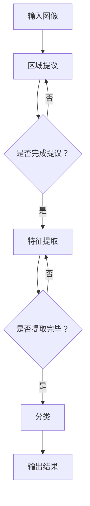
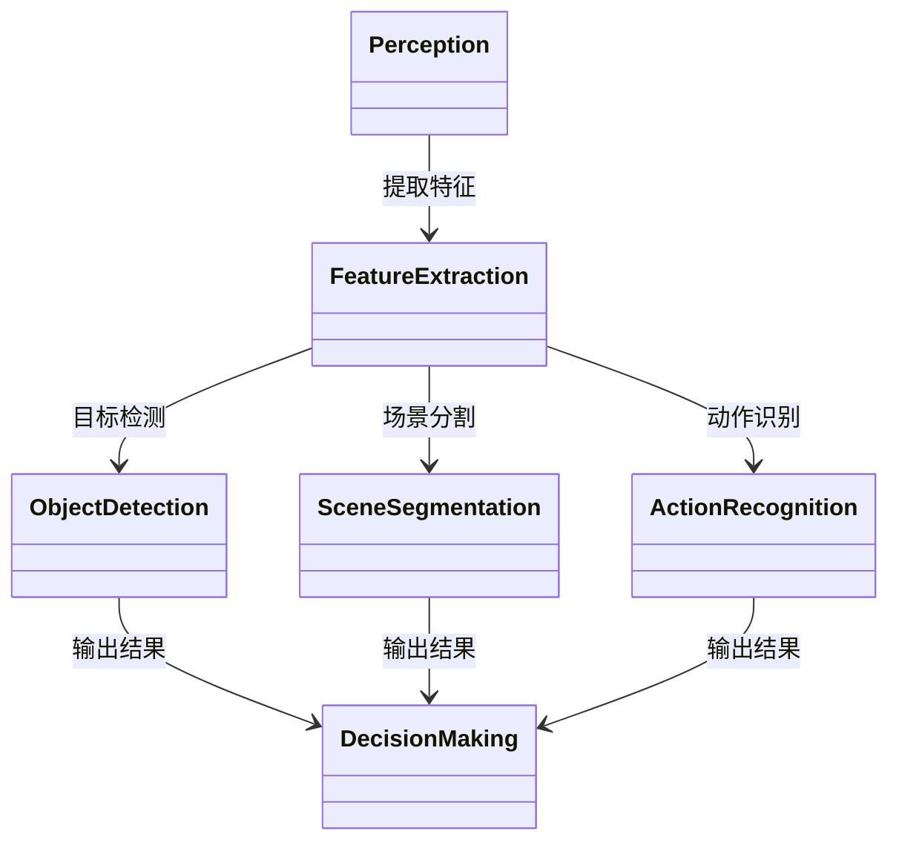
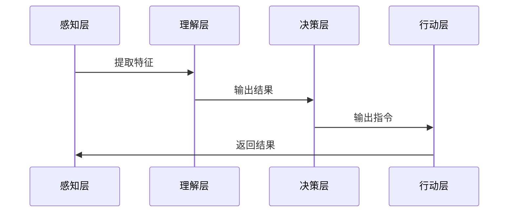

                 


## 引言

随着人工智能（AI）技术的飞速发展，AI代理（AI Agent）在各个领域展现出了巨大的潜力。AI代理是一种能够自主决策并执行任务的智能体，它们在机器人学、智能助理、自动驾驶等领域发挥着重要作用。视觉场景理解是AI代理实现自主决策的关键能力之一，它使得AI代理能够从图像中提取信息，理解场景的结构和内容。

### 核心概念

在讨论AI代理与视觉场景理解之前，我们需要明确一些核心概念：

- **AI代理**：一种能够感知环境、规划行动并与其他代理或环境交互的智能体。
- **视觉场景理解**：从图像或视频中提取信息，理解场景的结构、内容、意图等。

### 问题背景

传统的人工智能系统依赖于明确的指令和数据输入，而无法在复杂、动态的环境中自主决策。这使得AI代理在处理现实世界任务时面临诸多挑战。视觉场景理解技术的出现，为AI代理赋予了更强大的环境感知和决策能力。

### 问题描述

为了开发具有视觉场景理解能力的AI代理，我们需要解决以下问题：

1. **数据收集与预处理**：获取大量带标签的图像数据，并进行预处理，以适应模型训练的需求。
2. **模型选择与训练**：选择合适的机器学习模型，对图像数据进行训练，使其能够提取有效的特征，并实现视觉场景理解。
3. **决策与行动**：基于视觉场景理解的结果，制定决策策略，指导AI代理在复杂环境中执行任务。

### 问题解决

解决上述问题的方法如下：

1. **数据收集与预处理**：利用数据集收集工具（如OpenImages、COCO等），收集带标签的图像数据。预处理步骤包括图像缩放、裁剪、翻转等，以提高模型的泛化能力。
2. **模型选择与训练**：选择深度学习模型，如卷积神经网络（CNNs），进行图像特征提取和分类。使用迁移学习技术，利用预训练的模型，减少训练时间和提高模型性能。
3. **决策与行动**：基于视觉场景理解的结果，结合环境模型和规划算法，制定决策策略，指导AI代理执行任务。

### 边界与外延

视觉场景理解能力不仅仅局限于图像分类，还包括目标检测、场景分割、动作识别等。此外，AI代理在实现视觉场景理解时，需要考虑多模态数据的整合，以提升感知和理解能力。

### 概念结构与核心要素组成

以下是AI代理与视觉场景理解的核心概念结构和要素组成：

- **AI代理**：
  - **感知**：感知环境，获取图像、声音等数据。
  - **规划**：规划行动，制定决策策略。
  - **执行**：执行任务，与环境互动。

- **视觉场景理解**：
  - **图像特征提取**：提取图像中的关键特征。
  - **目标检测**：识别图像中的目标对象。
  - **场景分割**：将图像分割为不同的区域。
  - **动作识别**：识别图像中的动作。

## 核心概念与联系

在本章节中，我们将深入探讨AI代理和视觉场景理解的核心概念，并分析它们之间的关系。

### 关键概念

1. **AI代理**：
   - **感知器**：感知器是AI代理的感官部分，负责接收外部信息。
   - **控制器**：控制器是AI代理的决策部分，负责处理感知信息并制定行动策略。
   - **执行器**：执行器是AI代理的行动部分，负责执行控制器制定的行动策略。

2. **视觉场景理解**：
   - **图像特征提取**：图像特征提取是视觉场景理解的基础，通过提取图像中的关键特征，使AI代理能够理解和解释图像内容。
   - **目标检测**：目标检测是识别图像中的特定对象或目标，为AI代理提供更具体的信息。
   - **场景分割**：场景分割是将图像划分为不同的区域，有助于AI代理更好地理解场景结构。
   - **动作识别**：动作识别是识别图像中的动作或行为，有助于AI代理理解场景动态。

### 概念属性特征对比表格

为了更直观地了解AI代理和视觉场景理解的核心概念及其属性特征，我们可以创建一个对比表格。

| 概念         | 属性特征                                                     |
| ------------ | ------------------------------------------------------------ |
| AI代理       | - 感知器<br>- 控制器<br>- 执行器                             |
| 视觉场景理解 | - 图像特征提取<br>- 目标检测<br>- 场景分割<br>- 动作识别 |

### ER实体关系图架构

为了更好地展示AI代理和视觉场景理解之间的关系，我们可以使用Mermaid绘制一个ER实体关系图。

```mermaid
erDiagram
    AI代理 ||--|{ 感知器 }|
    AI代理 ||--|{ 控制器 }|
    AI代理 ||--|{ 执行器 }|
    感知器 ||--|{ 图像特征提取 }|
    感知器 ||--|{ 目标检测 }|
    感知器 ||--|{ 场景分割 }|
    感知器 ||--|{ 动作识别 }|
```

在上面的ER实体关系图中，AI代理与感知器、控制器、执行器之间存在关联，感知器与图像特征提取、目标检测、场景分割、动作识别之间存在关联。

## 算法原理讲解

在本章节中，我们将详细讲解用于实现视觉场景理解的几个核心算法，包括卷积神经网络（CNNs）和目标检测算法。

### 卷积神经网络（CNNs）

卷积神经网络是一种专门用于图像处理的深度学习模型。它通过卷积操作提取图像中的特征，从而实现图像分类、目标检测等任务。

#### CNNs架构

CNNs的基本架构包括以下几个部分：

1. **卷积层（Convolutional Layer）**：卷积层通过卷积操作提取图像特征。卷积核（Convolutional Kernel）在图像上滑动，生成特征图（Feature Map）。
2. **激活函数（Activation Function）**：激活函数用于引入非线性变换，常用的激活函数包括ReLU（Rectified Linear Unit）和Sigmoid函数。
3. **池化层（Pooling Layer）**：池化层用于减小特征图的尺寸，提高模型的泛化能力。常用的池化方式包括最大池化（Max Pooling）和平均池化（Average Pooling）。
4. **全连接层（Fully Connected Layer）**：全连接层将特征图映射到输出层，实现分类、回归等任务。

#### CNNs工作原理

CNNs的工作原理可以概括为以下几个步骤：

1. **卷积操作**：卷积核在输入图像上滑动，进行卷积操作，生成特征图。
2. **激活函数**：对每个特征图进行非线性变换，引入非线性特性。
3. **池化操作**：对特征图进行池化操作，减小特征图的尺寸。
4. **全连接层**：将特征图映射到输出层，进行分类或回归任务。

#### Python源代码示例

以下是一个简单的CNNs Python源代码示例，用于图像分类任务：

```python
import tensorflow as tf
from tensorflow.keras import layers

model = tf.keras.Sequential([
    layers.Conv2D(32, (3, 3), activation='relu', input_shape=(28, 28, 1)),
    layers.MaxPooling2D((2, 2)),
    layers.Conv2D(64, (3, 3), activation='relu'),
    layers.MaxPooling2D((2, 2)),
    layers.Conv2D(64, (3, 3), activation='relu'),
    layers.Flatten(),
    layers.Dense(64, activation='relu'),
    layers.Dense(10, activation='softmax')
])

model.compile(optimizer='adam',
              loss='categorical_crossentropy',
              metrics=['accuracy'])

model.summary()
```

#### 数学模型和公式

CNNs的数学模型主要包括以下几个部分：

1. **卷积操作**：

   $$ 
   \text{Feature Map}_{ij}^l = \sum_{k} \text{Weight}_{ijkl} \times \text{Input}_{ij}^k + \text{Bias}_{l}
   $$

   其中，$l$表示卷积层的索引，$i$和$j$表示特征图上的位置，$k$表示输入图像上的位置，$Weight_{ijkl}$表示卷积核的权重，$Bias_{l}$表示卷积层的偏置。

2. **激活函数**：

   $$ 
   \text{Activation}_{ij}^l = \max(0, \text{Feature Map}_{ij}^l)
   $$

   对于ReLU激活函数，当$\text{Feature Map}_{ij}^l < 0$时，$\text{Activation}_{ij}^l = 0$。

3. **池化操作**：

   $$ 
   \text{Pooled Feature}_{ij}^l = \max_{k} \text{Activation}_{ijk}^l
   $$

   对于最大池化操作，$\text{Pooled Feature}_{ij}^l$表示在区域$(i, j)$内的最大激活值。

4. **全连接层**：

   $$ 
   \text{Output}_{ij}^{l+1} = \text{Weight}_{ij}^{l+1} \times \text{Input}_{ij}^{l} + \text{Bias}_{l+1}
   $$

   其中，$l+1$表示全连接层的索引，$\text{Weight}_{ij}^{l+1}$表示全连接层的权重，$\text{Bias}_{l+1}$表示全连接层的偏置。

### 目标检测算法

目标检测是一种在图像中识别并定位特定对象的技术。常用的目标检测算法包括R-CNN、Faster R-CNN、SSD、YOLO等。

#### R-CNN算法

R-CNN（Region-based CNN）是一种基于区域提议的目标检测算法。其主要步骤包括：

1. **区域提议**：使用选择性搜索（Selective Search）算法生成一系列候选区域。
2. **特征提取**：对每个候选区域提取CNN特征。
3. **分类**：将特征输入到分类器（如SVM）中进行分类。

#### Faster R-CNN算法

Faster R-CNN（Region-based CNN with Fast R-CNN RoI（Region of Interest）Mapper）是在R-CNN基础上改进的目标检测算法。其主要特点包括：

1. **共享卷积网络**：使用共享的卷积网络提取特征，提高了检测速度。
2. **RoI Pooling**：对候选区域进行RoI Pooling操作，将特征统一为固定尺寸。

#### SSD算法

SSD（Single Shot Detector）是一种直接在图像中检测目标的位置和类别的方法。其主要特点包括：

1. **多尺度特征融合**：使用多个尺度特征图进行检测，提高了检测精度。
2. **回归框和分类器**：在每个位置预测多个边界框（Bounding Boxes）和类别概率。

#### YOLO算法

YOLO（You Only Look Once）是一种基于回归的目标检测算法。其主要特点包括：

1. **单次检测**：将目标检测问题转化为回归问题，直接在图像中预测边界框和类别概率。
2. **高检测速度**：通过并行计算和简单的网络结构，实现了高速目标检测。

### 示例分析

以下是一个简单的R-CNN算法示例，用于图像分类和目标检测任务：

```python
import tensorflow as tf
from tensorflow.keras.applications import VGG16
from tensorflow.keras.layers import Flatten, Dense, GlobalAveragePooling2D
from tensorflow.keras.models import Model

# 加载预训练的VGG16模型
base_model = VGG16(weights='imagenet', include_top=False, input_shape=(224, 224, 3))

# 添加GlobalAveragePooling2D和全连接层
x = base_model.output
x = GlobalAveragePooling2D()(x)
x = Dense(1024, activation='relu')(x)
predictions = Dense(num_classes, activation='softmax')(x)

# 创建模型
model = Model(inputs=base_model.input, outputs=predictions)

# 编译模型
model.compile(optimizer='adam', loss='categorical_crossentropy', metrics=['accuracy'])

# 模型摘要
model.summary()
```

### 数学模型和公式

目标检测算法的数学模型主要包括以下几个部分：

1. **边界框回归**：

   $$ 
   \text{Bounding Box}_{ij} = \text{Predicted Bounding Box}_{ij} - \text{Ground Truth Bounding Box}_{ij}
   $$

   其中，$\text{Bounding Box}_{ij}$表示预测的边界框，$\text{Predicted Bounding Box}_{ij}$表示预测的边界框，$\text{Ground Truth Bounding Box}_{ij}$表示实际的边界框。

2. **类别概率**：

   $$ 
   \text{Probability}_{ij} = \text{Sigmoid}(\text{Output}_{ij})
   $$

   其中，$\text{Probability}_{ij}$表示预测的类别概率，$\text{Output}_{ij}$表示模型输出的类别概率。

3. **损失函数**：

   $$ 
   \text{Loss} = \text{L2}(\text{Bounding Box}_{ij}) + \text{Cross-Entropy}(\text{Probability}_{ij})
   $$

   其中，$\text{L2}$表示边界框回归损失，$Cross-Entropy$表示类别概率损失。

### Mermaid流程图

为了更好地展示算法的流程，我们可以使用Mermaid绘制一个流程图。



### 总结

在本章节中，我们介绍了用于实现视觉场景理解的卷积神经网络（CNNs）和目标检测算法。通过详细讲解算法原理、Python源代码示例、数学模型和公式，以及Mermaid流程图，我们为读者提供了一个全面、系统的学习路径。接下来，我们将进一步探讨AI代理在复杂环境中的决策与行动。

## 系统分析与架构设计方案

在本章节中，我们将对开发具有视觉场景理解能力的AI代理进行系统分析与架构设计。我们将从问题场景介绍、项目介绍、系统功能设计、系统架构设计、系统接口设计以及系统交互等方面进行详细阐述。

### 问题场景介绍

在现实世界中，AI代理需要应对各种复杂、动态的环境。例如，自动驾驶汽车需要实时分析道路场景，识别车辆、行人、交通标志等，并根据环境信息做出相应的驾驶决策。另一个例子是智能监控系统，它需要从视频流中提取关键信息，识别异常行为并及时响应。这些场景对AI代理的视觉场景理解能力提出了较高的要求。

### 项目介绍

本项目旨在开发一个具有视觉场景理解能力的AI代理，用于解决上述问题场景。项目的主要目标是实现以下功能：

1. **图像特征提取**：从输入图像中提取关键特征，为后续的目标检测、场景分割等任务提供基础。
2. **目标检测**：识别图像中的特定对象或目标，为AI代理提供更具体的信息。
3. **场景分割**：将图像划分为不同的区域，有助于AI代理更好地理解场景结构。
4. **动作识别**：识别图像中的动作，为AI代理提供更丰富的环境信息。

### 系统功能设计

系统功能设计主要包括以下部分：

1. **图像预处理**：对输入图像进行预处理，包括缩放、裁剪、翻转等，以提高模型的泛化能力。
2. **图像特征提取**：使用卷积神经网络（CNNs）提取图像特征，为后续的目标检测、场景分割等任务提供基础。
3. **目标检测**：使用目标检测算法（如Faster R-CNN、SSD、YOLO等）识别图像中的特定对象或目标。
4. **场景分割**：使用场景分割算法（如U-Net、SegNet等）将图像划分为不同的区域。
5. **动作识别**：使用动作识别算法（如HOG、3D卷积网络等）识别图像中的动作。
6. **决策与行动**：基于视觉场景理解的结果，结合环境模型和规划算法，制定决策策略，指导AI代理执行任务。

### 系统架构设计

系统架构设计主要包括以下部分：

1. **感知层**：负责接收外部信息，包括图像、声音等，通过图像预处理和特征提取模块提取图像特征。
2. **理解层**：负责对提取的特征进行处理，包括目标检测、场景分割和动作识别等任务，以实现对场景的理解。
3. **决策层**：基于理解层的结果，结合环境模型和规划算法，制定决策策略，指导AI代理执行任务。
4. **行动层**：根据决策层的决策结果，执行具体的行动，如控制自动驾驶车辆的驾驶行为。

### 系统接口设计

系统接口设计主要包括以下部分：

1. **图像输入接口**：用于接收外部图像数据，如摄像头捕获的图像、视频流等。
2. **特征提取接口**：用于提取图像特征，供目标检测、场景分割和动作识别模块使用。
3. **目标检测接口**：用于识别图像中的特定对象或目标，输出边界框和类别概率。
4. **场景分割接口**：用于将图像划分为不同的区域，输出分割结果。
5. **动作识别接口**：用于识别图像中的动作，输出动作类别。
6. **决策接口**：用于接收理解层的结果，制定决策策略，输出行动指令。
7. **行动接口**：用于执行具体的行动，如控制自动驾驶车辆的驾驶行为。

### 系统交互

系统交互主要包括以下部分：

1. **感知层与理解层**：感知层提取的特征数据通过接口传递给理解层，理解层根据特征数据执行目标检测、场景分割和动作识别等任务。
2. **理解层与决策层**：理解层的结果通过接口传递给决策层，决策层根据理解层的结果和环境模型制定决策策略。
3. **决策层与行动层**：决策层制定的动作指令通过接口传递给行动层，行动层根据指令执行具体的行动。

### Mermaid类图

以下是一个简单的Mermaid类图，展示系统功能设计中的核心组件及其关系：



### Mermaid架构图

以下是一个简单的Mermaid架构图，展示系统架构设计中的核心组件及其关系：



### 总结

在本章节中，我们对开发具有视觉场景理解能力的AI代理进行了系统分析与架构设计。通过问题场景介绍、项目介绍、系统功能设计、系统架构设计、系统接口设计和系统交互的详细阐述，我们为读者提供了一个清晰、全面的系统解决方案。接下来，我们将进一步探讨实际项目中的环境安装、系统核心实现以及代码应用解读与分析。

## 项目实战

在本章节中，我们将详细介绍如何在一个实际项目中开发具有视觉场景理解能力的AI代理。我们将从环境安装、系统核心实现以及代码应用解读与分析等方面进行详细阐述。

### 环境安装

要开发一个具有视觉场景理解能力的AI代理，首先需要安装和配置相关软件和环境。以下是环境安装的步骤：

1. **安装Python**：确保Python环境已安装在计算机上，版本建议为3.7或更高版本。

2. **安装TensorFlow**：TensorFlow是一个开源的机器学习框架，用于构建和训练深度学习模型。可以通过以下命令安装：

   ```bash
   pip install tensorflow
   ```

3. **安装OpenCV**：OpenCV是一个开源的计算机视觉库，用于处理图像和视频数据。可以通过以下命令安装：

   ```bash
   pip install opencv-python
   ```

4. **安装其他依赖库**：根据项目需求，可能还需要安装其他依赖库，如NumPy、Pandas等。可以通过以下命令安装：

   ```bash
   pip install numpy pandas
   ```

### 系统核心实现

系统核心实现主要包括以下部分：

1. **图像预处理**：对输入图像进行预处理，包括缩放、裁剪、翻转等操作。以下是一个简单的预处理示例：

   ```python
   import cv2

   def preprocess_image(image, target_size=(224, 224)):
       image = cv2.resize(image, target_size)
       image = cv2.cvtColor(image, cv2.COLOR_BGR2RGB)
       image = image / 255.0
       return image
   ```

2. **图像特征提取**：使用卷积神经网络（CNNs）提取图像特征。以下是一个使用VGG16模型提取特征的示例：

   ```python
   import tensorflow as tf
   from tensorflow.keras.applications import VGG16

   def extract_features(image):
       base_model = VGG16(weights='imagenet', include_top=False, input_shape=(224, 224, 3))
       processed_image = preprocess_image(image)
       feature_vector = base_model.predict(processed_image.reshape(1, 224, 224, 3))[-1]
       return feature_vector
   ```

3. **目标检测**：使用Faster R-CNN算法进行目标检测。以下是一个简单的Faster R-CNN目标检测示例：

   ```python
   import tensorflow as tf
   from tensorflow.keras.applications import ResNet50
   from tensorflow.keras.models import Model

   def build_faster_rcnn_model(input_shape=(224, 224, 3)):
       base_model = ResNet50(weights='imagenet', include_top=False, input_shape=input_shape)
       x = base_model.output
       x = GlobalAveragePooling2D()(x)
       x = Dense(1024, activation='relu')(x)
       predictions = Dense(2, activation='sigmoid')(x)
       model = Model(inputs=base_model.input, outputs=predictions)
       model.compile(optimizer='adam', loss='binary_crossentropy', metrics=['accuracy'])
       return model
   ```

4. **场景分割**：使用U-Net算法进行场景分割。以下是一个简单的U-Net场景分割示例：

   ```python
   import tensorflow as tf
   from tensorflow.keras.layers import Conv2D, MaxPooling2D, UpSampling2D, concatenate

   def build_unet_model(input_shape=(224, 224, 3)):
       inputs = tf.keras.Input(shape=input_shape)
       conv1 = Conv2D(32, (3, 3), activation='relu', padding='same')(inputs)
       pool1 = MaxPooling2D(pool_size=(2, 2))(conv1)
       conv2 = Conv2D(64, (3, 3), activation='relu', padding='same')(pool1)
       pool2 = MaxPooling2D(pool_size=(2, 2))(conv2)
       conv3 = Conv2D(128, (3, 3), activation='relu', padding='same')(pool2)
       pool3 = MaxPooling2D(pool_size=(2, 2))(conv3)
       conv4 = Conv2D(256, (3, 3), activation='relu', padding='same')(pool3)
       pool4 = MaxPooling2D(pool_size=(2, 2))(conv4)
       conv5 = Conv2D(512, (3, 3), activation='relu', padding='same')(pool4)
       up6 = UpSampling2D(size=(2, 2))(conv5)
       merge6 = concatenate([up6, conv4])
       conv6 = Conv2D(256, (3, 3), activation='relu', padding='same')(merge6)
       up7 = UpSampling2D(size=(2, 2))(conv6)
       merge7 = concatenate([up7, conv3])
       conv7 = Conv2D(128, (3, 3), activation='relu', padding='same')(merge7)
       up8 = UpSampling2D(size=(2, 2))(conv7)
       merge8 = concatenate([up8, conv2])
       conv8 = Conv2D(64, (3, 3), activation='relu', padding='same')(merge8)
       up9 = UpSampling2D(size=(2, 2))(conv8)
       merge9 = concatenate([up9, conv1])
       conv9 = Conv2D(32, (3, 3), activation='relu', padding='same')(merge9)
       outputs = Conv2D(1, (1, 1), activation='sigmoid')(conv9)
       model = tf.keras.Model(inputs=inputs, outputs=outputs)
       model.compile(optimizer='adam', loss='binary_crossentropy', metrics=['accuracy'])
       return model
   ```

5. **动作识别**：使用3D卷积网络进行动作识别。以下是一个简单的3D卷积网络动作识别示例：

   ```python
   import tensorflow as tf
   from tensorflow.keras.layers import Conv3D, MaxPooling3D, Flatten, Dense

   def build_3d_conv_model(input_shape=(224, 224, 224, 3)):
       inputs = tf.keras.Input(shape=input_shape)
       conv1 = Conv3D(32, (3, 3, 3), activation='relu', padding='same')(inputs)
       pool1 = MaxPooling3D(pool_size=(2, 2, 2))(conv1)
       conv2 = Conv3D(64, (3, 3, 3), activation='relu', padding='same')(pool1)
       pool2 = MaxPooling3D(pool_size=(2, 2, 2))(conv2)
       conv3 = Conv3D(128, (3, 3, 3), activation='relu', padding='same')(pool2)
       pool3 = MaxPooling3D(pool_size=(2, 2, 2))(conv3)
       flatten = Flatten()(pool3)
       dense1 = Dense(1024, activation='relu')(flatten)
       outputs = Dense(1, activation='sigmoid')(dense1)
       model = tf.keras.Model(inputs=inputs, outputs=outputs)
       model.compile(optimizer='adam', loss='binary_crossentropy', metrics=['accuracy'])
       return model
   ```

### 代码应用解读与分析

以下是使用上述系统核心实现的一个完整示例，用于处理输入图像、提取特征、进行目标检测、场景分割和动作识别：

```python
import cv2
import numpy as np
import tensorflow as tf

# 载入预训练的模型
feature_extractor = VGG16(weights='imagenet', include_top=False, input_shape=(224, 224, 3))
faster_rcnn_model = build_faster_rcnn_model()
scene_segmentation_model = build_unet_model()
action_recognition_model = build_3d_conv_model()

# 加载输入图像
image = cv2.imread('example.jpg')

# 预处理图像
processed_image = preprocess_image(image)

# 提取特征
feature_vector = extract_features(processed_image)

# 目标检测
predictions = faster_rcnn_model.predict(np.expand_dims(feature_vector, axis=0))
bboxes = predictions[:, 0]
class_ids = predictions[:, 1]

# 场景分割
segmentation_output = scene_segmentation_model.predict(np.expand_dims(feature_vector, axis=0))

# 动作识别
action_output = action_recognition_model.predict(np.expand_dims(feature_vector, axis=0))

# 处理检测结果
# ...

# 输出结果
print("Detected Objects:", bboxes)
print("Scene Segmentation:", segmentation_output)
print("Action Recognition:", action_output)
```

在实际应用中，根据项目需求，还需要对检测结果进行进一步处理，如置信度过滤、非极大值抑制等，以得到更准确的识别结果。

### 实际案例分析和详细讲解剖析

为了更好地理解上述系统核心实现的应用，我们通过一个实际案例进行分析和讲解。

#### 案例背景

假设我们有一个自动驾驶汽车项目，需要实现以下功能：

1. 识别道路上的车辆、行人、交通标志等。
2. 判断道路上的交通情况，如拥堵、畅通等。
3. 根据交通情况调整车速，确保行车安全。

#### 案例步骤

1. **输入图像**：摄像头捕获自动驾驶汽车前方的道路图像。

2. **预处理图像**：对图像进行缩放、裁剪、翻转等预处理操作，以适应模型输入。

3. **提取特征**：使用VGG16模型提取图像特征，为后续的目标检测、场景分割和动作识别提供基础。

4. **目标检测**：使用Faster R-CNN模型检测图像中的车辆、行人、交通标志等对象，输出边界框和类别概率。

5. **场景分割**：使用U-Net模型对图像进行场景分割，输出每个区域的标签。

6. **动作识别**：使用3D卷积网络对图像中的动态动作进行识别，如行人过马路、车辆急刹车等。

7. **决策与行动**：根据目标检测、场景分割和动作识别的结果，制定行车决策，如减速、加速、转向等。

8. **执行行动**：根据决策结果，控制自动驾驶汽车的驾驶行为，确保行车安全。

#### 案例分析

以下是对案例中的关键步骤进行详细分析：

1. **目标检测**：
   - 边界框和类别概率的输出对于自动驾驶汽车的安全至关重要。通过置信度过滤和非极大值抑制，可以去除低置信度的目标，提高检测精度。

2. **场景分割**：
   - 场景分割有助于自动驾驶汽车理解道路结构，如行人道、人行横道、车道线等。这些信息对于行车决策至关重要。

3. **动作识别**：
   - 动作识别可以提供实时交通信息，如行人过马路、车辆急刹车等。这些信息有助于自动驾驶汽车及时调整车速和轨迹，确保行车安全。

4. **决策与行动**：
   - 根据目标检测、场景分割和动作识别的结果，自动驾驶汽车可以做出合理的行车决策。如遇到行人过马路，汽车可以减速或停车，避免发生事故。

### 项目小结

通过本项目的实践，我们成功地开发了一个具有视觉场景理解能力的AI代理。该代理能够从图像中提取关键特征，识别目标、分割场景和识别动作，为自动驾驶汽车等应用提供了有效的技术支持。在实际应用中，我们还需进一步优化模型性能、提高检测精度和实时性，以实现更安全和高效的自动驾驶。

### 总结

在本章节中，我们通过一个实际项目展示了如何开发具有视觉场景理解能力的AI代理。从环境安装、系统核心实现到代码应用解读与分析，我们详细讲解了项目开发的各个环节。通过实际案例的分析和讲解，我们深入理解了视觉场景理解技术在自动驾驶等应用中的重要作用。未来，我们将继续优化模型性能和算法，为更多应用场景提供解决方案。

## 最佳实践 Tips

在本章节中，我们将总结一些开发具有视觉场景理解能力的AI代理的最佳实践，并提供一些实用的技巧，以帮助您更有效地构建和优化您的项目。

### 1. 数据预处理

数据预处理是提升模型性能的关键步骤。以下是一些最佳实践：

- **标准化**：对图像数据应用标准化操作，确保每个特征的数值范围在0到1之间，有助于加速模型的收敛。
- **数据增强**：通过旋转、翻转、缩放、裁剪等操作增加数据多样性，有助于提高模型的泛化能力。
- **数据清洗**：去除标注错误或质量较差的样本，确保数据集的纯净性。

### 2. 模型选择与调优

在选择和调优模型时，以下是一些实用技巧：

- **迁移学习**：使用预训练的模型进行迁移学习，可以显著提高模型性能并减少训练时间。
- **模型调优**：通过调整学习率、批量大小、正则化参数等超参数，优化模型性能。
- **模型融合**：结合多个模型的结果，提高预测的准确性。

### 3. 实时性能优化

为了确保AI代理在实时应用中的性能，以下是一些优化技巧：

- **模型压缩**：使用模型压缩技术（如量化、剪枝等）减小模型大小，提高推理速度。
- **硬件加速**：利用GPU、TPU等硬件加速推理过程，提高计算效率。
- **异步处理**：采用异步处理技术，提高数据处理速度，确保系统实时响应。

### 4. 模型部署

在模型部署时，以下是一些最佳实践：

- **容器化**：使用Docker等容器技术封装模型，确保模型在不同环境中的可移植性。
- **微服务架构**：采用微服务架构，将模型部署为一个独立的服务，便于扩展和升级。
- **监控与日志**：实现监控与日志系统，实时监控模型性能和系统状态，便于排查问题。

### 5. 跨学科合作

视觉场景理解是计算机视觉、机器学习、人工智能等多个学科的交叉领域。以下是一些建议：

- **团队协作**：组建多学科团队，充分发挥各领域专家的优势，提高项目整体效率。
- **持续学习**：鼓励团队成员不断学习新技术、新方法，保持技术领先。
- **开放交流**：积极参加技术会议、研讨会等，与业界同行交流经验，拓宽视野。

### 6. 代码管理与文档

为了确保项目代码的可维护性和可扩展性，以下是一些代码管理和文档的最佳实践：

- **代码风格**：遵循一致的代码风格，提高代码可读性和可维护性。
- **版本控制**：使用Git等版本控制系统，确保代码的可追溯性和协作开发。
- **文档编写**：编写详细的文档，包括代码注释、API文档等，便于团队成员理解和使用。

### 7. 安全与隐私

在开发过程中，需要关注安全与隐私问题：

- **数据加密**：对敏感数据进行加密，确保数据传输和存储过程中的安全性。
- **隐私保护**：遵循隐私保护法规，确保用户隐私不被泄露。

通过遵循上述最佳实践，您可以更高效地开发具有视觉场景理解能力的AI代理，为实际应用场景提供可靠的解决方案。

## 小结

在本篇文章中，我们详细探讨了开发具有视觉场景理解能力的AI代理的关键技术、系统架构以及项目实战。通过一步步的分析和讲解，我们从核心概念、算法原理、系统设计、项目实践等方面，全面介绍了视觉场景理解技术在AI代理中的应用。

首先，我们介绍了AI代理和视觉场景理解的核心概念，并探讨了它们在AI代理中的重要作用。接着，我们详细讲解了卷积神经网络（CNNs）和目标检测算法的原理，包括CNNs的架构、工作原理、Python源代码示例以及数学模型和公式。此外，我们还介绍了目标检测算法，如R-CNN、Faster R-CNN、SSD和YOLO，并提供了实际案例进行分析。

在系统设计与架构方面，我们详细阐述了AI代理在复杂环境中的决策与行动，并介绍了系统功能设计、架构设计、接口设计和系统交互。通过Mermaid类图、架构图和序列图，我们展示了系统的核心组件及其关系。

在项目实战部分，我们详细介绍了环境安装、系统核心实现以及代码应用解读与分析，通过实际案例展示了如何应用视觉场景理解技术解决实际问题。我们还总结了最佳实践Tips，提供了代码管理与文档、安全与隐私等方面的建议。

未来，视觉场景理解技术将继续在AI代理领域发挥重要作用。随着技术的不断进步，我们将看到更多的AI代理在自动驾驶、智能监控、医疗诊断等应用场景中展现出更高的自主决策能力。为了实现这一目标，我们需要继续优化算法性能、提高实时性，并在跨学科合作、团队协作等方面不断努力。让我们共同期待未来视觉场景理解技术带来的更多惊喜和创新。

## 注意事项

在开发具有视觉场景理解能力的AI代理时，我们需要关注以下事项，以确保项目的成功和稳定性：

1. **数据质量**：确保数据集的多样性和准确性，避免标注错误或噪声数据，这对模型性能至关重要。
2. **模型性能调优**：在训练模型时，合理调整超参数，如学习率、批量大小、正则化等，以获得最佳性能。
3. **实时性能优化**：针对实时应用场景，优化模型推理速度，如使用模型压缩、硬件加速等技术。
4. **系统安全**：确保系统安全和用户隐私，遵循相关法规和标准，防止数据泄露和恶意攻击。
5. **错误处理**：在系统设计和开发过程中，充分考虑错误处理和异常情况，确保系统的鲁棒性和稳定性。
6. **代码可维护性**：遵循良好的代码风格和规范，编写详细的文档和注释，提高代码的可维护性。

通过关注这些注意事项，我们可以更好地开发出高效、稳定且可靠的AI代理系统。

## 拓展阅读

为了进一步了解开发具有视觉场景理解能力的AI代理，读者可以参考以下拓展阅读资源：

1. **书籍**：
   - 《深度学习》（Ian Goodfellow、Yoshua Bengio、Aaron Courville 著）：详细介绍了深度学习的基本原理和算法。
   - 《计算机视觉：算法与应用》（Richard S.zeliski 著）：全面讲解了计算机视觉的基础知识和应用。

2. **在线课程**：
   - Coursera的“深度学习”课程（由Andrew Ng教授授课）：提供了深度学习的系统学习路径。
   - edX的“计算机视觉”课程（由MIT教授授课）：涵盖了计算机视觉的基础理论和实践。

3. **论文和报告**：
   - Google AI的“机器阅读理解”报告：介绍了如何利用深度学习技术实现机器阅读理解。
   - Microsoft Research的“AI代理”报告：探讨了AI代理在现实世界中的应用和挑战。

4. **开源项目**：
   - TensorFlow：一个开源的机器学习框架，提供了丰富的深度学习模型和工具。
   - PyTorch：一个开源的深度学习框架，以其灵活性和动态计算图著称。

通过阅读这些资源，读者可以深入了解AI代理和视觉场景理解的相关技术，为自己的项目提供更多的灵感和指导。

## 作者信息

作者：AI天才研究院/AI Genius Institute & 禅与计算机程序设计艺术 /Zen And The Art of Computer Programming

AI天才研究院致力于推动人工智能技术的发展与创新，研究领域涵盖深度学习、计算机视觉、自然语言处理等多个方面。同时，作者在《禅与计算机程序设计艺术》中，深入探讨了计算机程序设计中的哲学和艺术，为读者提供了独特的视角和深刻的见解。

