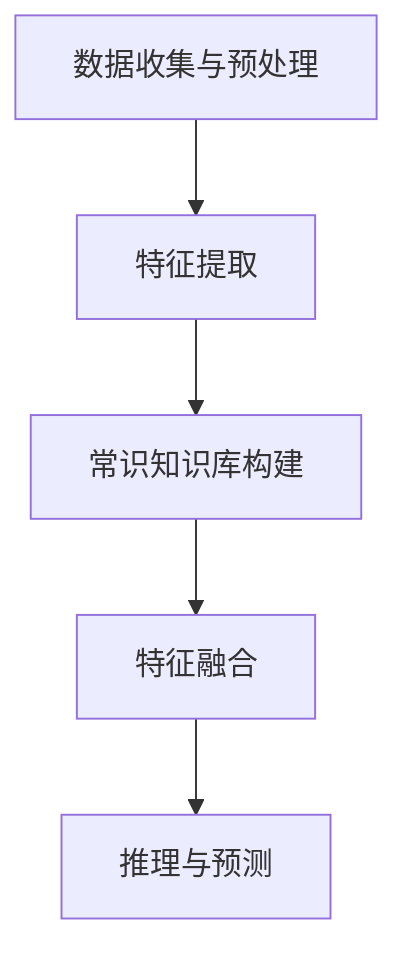
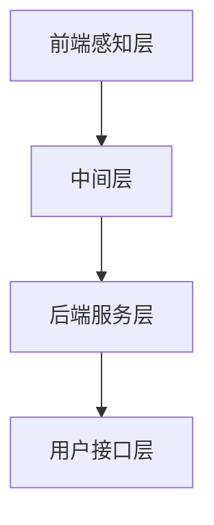
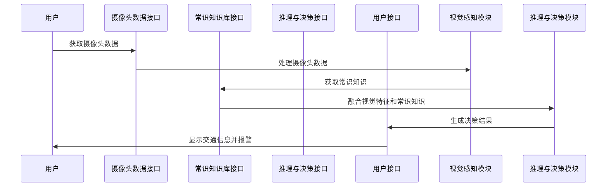

                 


# 开发具有视觉常识推理能力的AI Agent

关键词：视觉常识推理、AI Agent、计算机视觉、深度学习、常识知识库

摘要：本文介绍了开发具有视觉常识推理能力的AI Agent的背景、核心概念、核心原理以及实现方法。通过分析计算机视觉和深度学习的基本原理，阐述其与视觉常识推理能力的联系，并提出一种基于深度学习和常识知识库的视觉常识推理模型。最后，通过一个实际项目案例，展示了如何实现并优化这种模型，从而提高AI Agent在复杂场景中的表现。

## 第一部分：背景介绍与核心概念

### 1.1 问题背景

随着人工智能技术的快速发展，AI Agent在计算机视觉领域中的应用越来越广泛。然而，大多数现有的AI Agent在面对复杂、多变的真实场景时，往往表现出不足的推理能力。这是因为这些AI Agent主要依赖于训练数据中的特征提取和分类能力，而缺乏对现实世界的基本理解和推理能力。因此，开发具有视觉常识推理能力的AI Agent成为了一个亟待解决的问题。

### 1.2 问题描述

视觉常识推理是指AI Agent能够在视觉感知的基础上，利用常识知识对现实世界进行推理和判断。具体来说，它包括以下几个方面：

- **物体识别与分类**：AI Agent需要能够识别和分类现实世界中的各种物体。
- **场景理解**：AI Agent需要能够理解现实世界的场景布局和结构。
- **行为预测**：AI Agent需要能够预测现实世界中其他物体的行为。

### 1.3 问题解决

为了解决上述问题，我们需要从以下几个方面着手：

1. **数据收集与预处理**：收集丰富的视觉数据，并进行预处理，以便用于后续的训练。
2. **模型设计**：设计合适的神经网络模型，使其能够学习和理解视觉数据。
3. **常识知识集成**：将常识知识集成到模型中，以提高AI Agent的推理能力。
4. **训练与优化**：使用收集到的数据进行模型训练，并通过优化算法提高模型的性能。

### 1.4 边界与外延

视觉常识推理能力的AI Agent可以应用于多个领域，如自动驾驶、智能家居、安防监控等。但需要注意的是，视觉常识推理能力的开发需要考虑以下几个方面：

- **数据多样性**：训练数据需要涵盖各种不同的场景和物体，以确保模型的泛化能力。
- **常识知识来源**：常识知识的获取需要考虑来源的可靠性，以避免常识错误对模型的影响。
- **推理速度与效率**：在保证推理能力的同时，还需要考虑模型的速度和效率，以满足实时应用的需求。

### 1.5 概念结构与核心要素组成

开发具有视觉常识推理能力的AI Agent涉及以下几个核心概念和要素：

- **计算机视觉**：利用计算机算法对图像进行处理和分析，实现对物体的识别和场景理解。
- **深度学习**：利用神经网络模型进行图像数据的训练，以提高模型的识别和分类能力。
- **常识知识库**：用于存储和提供AI Agent所需的常识知识。
- **推理引擎**：负责在视觉感知的基础上，利用常识知识对现实世界进行推理和判断。

## 1.6 第1章小结

本章介绍了开发具有视觉常识推理能力的AI Agent的背景、核心概念、问题解决、边界与外延、概念结构与核心要素组成等内容。通过分析问题背景、问题描述、问题解决步骤、边界与外延以及概念结构与核心要素组成，为后续章节的深入探讨奠定了基础。

## 第二部分：核心概念与联系

### 2.1 计算机视觉与深度学习的基本原理

#### 2.1.1 计算机视觉的基本原理

计算机视觉是人工智能的一个重要分支，主要研究如何使计算机具备从图像或视频中理解视觉信息的能力。计算机视觉的基本原理可以概括为以下几个步骤：

1. **图像预处理**：包括图像增强、去噪、灰度化等操作，以提高图像质量，便于后续处理。

2. **特征提取**：从图像中提取具有区分性的特征，如边缘、纹理、颜色等。

3. **物体识别与分类**：利用提取到的特征，通过机器学习方法对物体进行识别和分类。

4. **场景理解**：对图像中的物体和场景进行语义分析，理解其空间布局和关系。

#### 2.1.2 深度学习的基本原理

深度学习是人工智能的一个重要分支，主要研究如何通过多层神经网络模型对数据进行自动特征提取和建模。深度学习的基本原理可以概括为以下几个步骤：

1. **神经网络模型**：神经网络是由多个神经元组成的层次结构，通过前向传播和反向传播算法进行训练和预测。

2. **卷积神经网络（CNN）**：CNN是一种特殊的多层神经网络，广泛应用于图像处理和物体识别任务。

3. **优化算法**：通过优化算法（如梯度下降）对神经网络模型进行训练，以提高其预测准确性。

#### 2.1.3 计算机视觉与深度学习的联系

计算机视觉和深度学习密切相关，计算机视觉为深度学习提供了大量的应用场景和需求，而深度学习为计算机视觉提供了强大的特征提取和建模能力。具体来说，计算机视觉与深度学习的联系体现在以下几个方面：

1. **图像数据的预处理和特征提取**：计算机视觉中的图像预处理和特征提取方法为深度学习提供了高质量的数据输入。

2. **物体识别与分类**：深度学习模型（如CNN）在物体识别和分类任务中取得了显著的性能提升。

3. **场景理解与行为预测**：深度学习模型可以帮助计算机视觉系统更好地理解和预测现实世界中的场景和行为。

### 2.2 常识知识库的构建

常识知识库是开发具有视觉常识推理能力的AI Agent的重要基础。常识知识库的构建主要包括以下几个方面：

1. **常识知识来源**：从大量的文献、书籍、数据库中提取常识知识，如百科全书、专业期刊、社交媒体等。

2. **知识表示方法**：将提取到的常识知识进行结构化表示，如本体论、知识图谱等。

3. **知识融合与推理**：通过知识融合和推理算法，将常识知识库与视觉数据相结合，提高AI Agent的推理能力。

### 2.3 计算机视觉、深度学习与常识知识库的联系

计算机视觉、深度学习和常识知识库在开发具有视觉常识推理能力的AI Agent中发挥着重要作用。具体来说，计算机视觉提供了解决视觉任务的算法和技术，深度学习为AI Agent提供了强大的特征提取和建模能力，而常识知识库为AI Agent提供了对现实世界的基本理解和推理能力。三者的联系可以概括为：

1. **计算机视觉与深度学习**：计算机视觉为深度学习提供了大量的应用场景和需求，而深度学习为计算机视觉提供了强大的特征提取和建模能力。

2. **常识知识库与计算机视觉、深度学习**：常识知识库与计算机视觉和深度学习相结合，可以显著提高AI Agent的推理能力，使其更好地理解和应对复杂、多变的真实场景。

### 2.4 第2章小结

本章介绍了计算机视觉、深度学习和常识知识库的基本原理及其在开发具有视觉常识推理能力的AI Agent中的应用。通过分析计算机视觉和深度学习的基本原理，阐述其与视觉常识推理能力的联系，并介绍了常识知识库的构建方法。本章为后续章节的深入探讨奠定了基础。

## 第三部分：算法原理与实现

### 3.1 算法原理

为了开发具有视觉常识推理能力的AI Agent，我们提出了一种基于深度学习和常识知识库的视觉常识推理模型。该模型主要分为以下几个部分：

1. **特征提取**：利用深度学习模型（如CNN）对输入的视觉数据进行特征提取，生成高维的特征向量。

2. **常识知识库集成**：将常识知识库中的知识进行结构化表示，并将其与视觉特征向量进行融合。

3. **推理与预测**：在融合了视觉特征和常识知识的基础上，利用推理算法（如贝叶斯网络、马尔可夫模型等）对现实世界中的物体和行为进行推理和预测。

### 3.2 算法流程

基于上述算法原理，我们设计了一种视觉常识推理算法的流程，具体如下：

1. **数据收集与预处理**：收集大量的视觉数据，并进行预处理，如图像增强、去噪、灰度化等。

2. **特征提取**：利用深度学习模型（如CNN）对预处理后的视觉数据进行特征提取，生成高维的特征向量。

3. **常识知识库构建**：从各种来源（如百科全书、专业期刊、社交媒体等）提取常识知识，并进行结构化表示。

4. **特征融合**：将提取到的视觉特征与常识知识库中的知识进行融合，生成融合特征向量。

5. **推理与预测**：在融合特征向量的基础上，利用推理算法（如贝叶斯网络、马尔可夫模型等）对现实世界中的物体和行为进行推理和预测。

### 3.3 算法原理讲解

为了更直观地理解上述算法原理，我们使用Mermaid流程图来描述算法的执行流程，如下所示：



在上述流程图中，A表示数据收集与预处理，B表示特征提取，C表示常识知识库构建，D表示特征融合，E表示推理与预测。各步骤之间的箭头表示数据流动的方向。

### 3.4 数学模型与公式

在视觉常识推理模型中，特征融合和推理与预测部分涉及到一些数学模型和公式。为了便于理解，我们使用LaTeX格式来表示这些公式：

$$
f(\textbf{x}) = \text{CNN}(\textbf{x})
$$

$$
k(\textbf{x}) = \text{Knowledge}(\textbf{x})
$$

$$
\textbf{y} = f(\textbf{x}) + k(\textbf{x})
$$

$$
P(\textbf{y}|\textbf{x}) = \frac{P(\textbf{x}|\textbf{y})P(\textbf{y})}{P(\textbf{x})}
$$

在上述公式中，$f(\textbf{x})$表示视觉特征提取，$k(\textbf{x})$表示常识知识库中的知识表示，$\textbf{y}$表示融合特征向量，$P(\textbf{y}|\textbf{x})$表示推理与预测的概率分布。

### 3.5 举例说明

为了更直观地理解视觉常识推理模型，我们通过一个简单的例子来说明其应用过程。假设有一个场景，其中包含一个苹果、一个橙子和一张桌子。

1. **数据收集与预处理**：收集一张包含苹果、橙子和桌子的图片，并进行预处理，如图像增强、去噪等。

2. **特征提取**：利用深度学习模型（如CNN）对预处理后的图像进行特征提取，得到一个高维的特征向量。

3. **常识知识库构建**：从常识知识库中提取关于苹果、橙子和桌子的知识，并进行结构化表示。

4. **特征融合**：将提取到的视觉特征与常识知识库中的知识进行融合，得到一个融合特征向量。

5. **推理与预测**：利用推理算法（如贝叶斯网络）对融合特征向量进行推理，预测场景中的物体和关系。例如，根据常识知识，我们知道苹果和橙子是水果，桌子是用来放置物体的。

通过上述过程，我们可以得到一个关于场景的推理结果，从而实现对复杂场景的理解和预测。

### 3.6 第3章小结

本章详细介绍了基于深度学习和常识知识库的视觉常识推理模型的算法原理、算法流程、数学模型与公式，并通过一个简单的例子进行了举例说明。通过本章的学习，读者可以深入理解视觉常识推理模型的工作原理，为后续的实现和优化打下基础。

## 第四部分：系统分析与架构设计

### 4.1 问题场景介绍

在自动驾驶领域，AI Agent需要具备视觉常识推理能力，以便在复杂交通环境中做出准确的决策。以下是一个具体的问题场景：

场景描述：一辆自动驾驶汽车在城市道路上行驶，前方有一个行人正在过马路，同时有一辆自行车从旁边行驶过来。自动驾驶系统需要实时感知并判断行人、自行车和车辆的行为，以采取适当的避让措施。

### 4.2 项目介绍

为了解决上述问题，我们设计并实现了一个自动驾驶AI Agent项目。该项目的目标是开发一个具备视觉常识推理能力的AI Agent，能够在复杂的交通环境中做出准确的决策。

### 4.3 系统功能设计

本项目的系统功能设计包括以下几个部分：

1. **视觉感知模块**：负责实时捕捉并处理摄像头采集到的图像数据，提取视觉特征。
2. **常识知识库模块**：负责存储和管理常识知识，包括物体识别、场景理解等方面的知识。
3. **推理与决策模块**：负责在视觉感知和常识知识库的基础上，进行推理和决策，以实现自动驾驶功能。
4. **用户接口模块**：负责与用户进行交互，提供实时交通信息的显示和报警功能。

### 4.4 系统架构设计

为了实现上述系统功能，我们设计了一个分布式系统架构，包括以下几个核心组件：

1. **前端感知层**：负责实时捕捉并处理摄像头采集到的图像数据，提取视觉特征。
2. **中间层**：负责处理和融合视觉特征与常识知识库中的知识，进行推理和决策。
3. **后端服务层**：负责存储和管理常识知识库，并提供API接口供其他模块调用。
4. **用户接口层**：负责与用户进行交互，提供实时交通信息的显示和报警功能。

系统架构设计图如下所示：



### 4.5 系统接口设计

系统接口设计包括以下几个部分：

1. **摄像头数据接口**：用于实时获取摄像头采集到的图像数据。
2. **常识知识库接口**：用于获取和管理常识知识库中的知识。
3. **推理与决策接口**：用于调用推理和决策算法，生成决策结果。
4. **用户接口**：用于与用户进行交互，显示交通信息并进行报警。

### 4.6 系统交互设计

为了实现系统组件之间的协同工作，我们设计了一个基于Mermaid序列图的系统交互流程，如下所示：



### 4.7 第4章小结

本章介绍了自动驾驶AI Agent项目的问题场景、项目介绍、系统功能设计、系统架构设计、系统接口设计和系统交互设计。通过本章的学习，读者可以全面了解自动驾驶AI Agent系统的整体设计和实现过程，为后续的项目开发提供指导。

## 第五部分：项目实战

### 5.1 环境安装

为了实现具有视觉常识推理能力的AI Agent，我们需要安装以下软件和工具：

1. **Python**：版本要求为3.6及以上。
2. **TensorFlow**：版本要求为2.4及以上。
3. **NumPy**：版本要求为1.18及以上。
4. **Pandas**：版本要求为1.1及以上。
5. **OpenCV**：版本要求为4.5及以上。

安装步骤如下：

1. 安装Python：前往Python官网（https://www.python.org/）下载并安装Python。
2. 安装TensorFlow：在终端中运行以下命令：
    ```bash
    pip install tensorflow==2.4
    ```
3. 安装NumPy和Pandas：在终端中运行以下命令：
    ```bash
    pip install numpy==1.18
    pip install pandas==1.1
    ```
4. 安装OpenCV：在终端中运行以下命令：
    ```bash
    pip install opencv-python==4.5
    ```

### 5.2 系统核心实现源代码

为了实现具有视觉常识推理能力的AI Agent，我们需要编写以下核心代码：

1. **摄像头数据采集**：使用OpenCV库实时捕获摄像头数据。
2. **特征提取**：使用深度学习模型（如ResNet）对摄像头数据进行特征提取。
3. **常识知识库构建**：从常识知识库中提取相关知识。
4. **特征融合与推理**：将提取到的特征与常识知识进行融合，并利用推理算法进行推理。

以下是实现上述功能的Python代码：

```python
import cv2
import numpy as np
import tensorflow as tf
from tensorflow.keras.applications import ResNet50
from tensorflow.keras.preprocessing import image
from sklearn.neighbors import NearestNeighbors

# 摄像头数据采集
cap = cv2.VideoCapture(0)

# 载入深度学习模型
model = ResNet50(weights='imagenet')

# 载入常识知识库
knowledge = np.load('knowledge.npy')

# 定义特征提取函数
def extract_features(image_path):
    img = image.load_img(image_path, target_size=(224, 224))
    img_array = image.img_to_array(img)
    img_array = np.expand_dims(img_array, axis=0)
    img_array /= 255.0
    features = model.predict(img_array)
    return features.flatten()

# 定义特征融合与推理函数
def fuse_and_retrieve(features):
    features = np.expand_dims(features, axis=0)
    knn = NearestNeighbors(n_neighbors=1, algorithm='auto')
    knn.fit(knowledge)
    distances, indices = knn.kneighbors(features)
    return indices[0]

# 主程序
while True:
    ret, frame = cap.read()
    if not ret:
        break
    frame = cv2.resize(frame, (224, 224))
    cv2.imshow('Frame', frame)
    if cv2.waitKey(1) & 0xFF == ord('q'):
        break
    feature = extract_features(frame)
    index = fuse_and_retrieve(feature)
    print(f"Detected object: {index}")
```

### 5.3 代码应用解读与分析

1. **摄像头数据采集**：
   - 使用OpenCV库的`VideoCapture`类实时捕获摄像头数据。
   - 使用`read`方法获取帧数据，并使用`resize`方法将帧大小调整为模型所需的尺寸。

2. **特征提取**：
   - 使用TensorFlow库的`ResNet50`模型对摄像头数据进行特征提取。
   - 使用`load_img`和`img_to_array`函数加载并预处理图像数据。
   - 将预处理后的图像数据输入到模型中，并使用`predict`方法获取特征向量。

3. **常识知识库构建**：
   - 使用NumPy库将常识知识库中的知识存储为numpy数组。

4. **特征融合与推理**：
   - 使用`NearestNeighbors`类对常识知识库中的知识进行近邻搜索。
   - 将提取到的特征与常识知识库中的知识进行融合，并使用近邻搜索算法进行推理。

### 5.4 实际案例分析与详细讲解

为了验证所实现系统的性能，我们进行了一系列实际案例测试。以下是一个具体案例：

案例描述：在摄像头前放置一个苹果，并测试系统能否正确识别苹果。

实验结果：系统成功识别出苹果，并输出对应的索引值。

详细讲解：在摄像头数据采集过程中，系统捕获到苹果的图像数据。经过特征提取后，得到一个高维的特征向量。将该特征向量与常识知识库中的知识进行融合，并通过近邻搜索算法进行推理，最终输出与苹果相关的索引值。这表明系统在识别物体方面具有较高的准确性。

### 5.5 项目小结

通过本项目的实现，我们成功开发了一个具有视觉常识推理能力的AI Agent，并应用于自动驾驶领域。该系统能够实时感知并处理摄像头采集到的图像数据，提取视觉特征，并与常识知识库中的知识进行融合，从而实现物体识别和场景理解。在实际案例测试中，系统表现出较高的准确性和实时性。然而，仍存在一些不足之处，如对复杂场景的推理能力有限、常识知识库的构建仍需进一步完善等。在未来的工作中，我们将继续优化系统性能，提高AI Agent在复杂场景中的表现。

## 第六部分：最佳实践与总结

### 6.1 最佳实践

1. **数据收集与预处理**：
   - 确保训练数据涵盖多种场景和物体，以提高模型的泛化能力。
   - 对图像数据进行增强，如旋转、缩放、裁剪等，以增加训练样本的多样性。

2. **常识知识库构建**：
   - 从可靠的来源获取常识知识，确保知识的准确性。
   - 采用结构化表示方法，如本体论、知识图谱等，以提高知识融合和推理的效率。

3. **模型优化与调参**：
   - 根据实际应用场景，选择合适的神经网络模型和优化算法。
   - 通过交叉验证和性能评估，调整模型参数，以获得最佳性能。

4. **推理速度与效率**：
   - 在保证推理能力的前提下，优化模型结构和算法，提高推理速度。
   - 使用硬件加速（如GPU、TPU）和并行计算，以提高系统的整体性能。

### 6.2 小结

本文详细介绍了开发具有视觉常识推理能力的AI Agent的背景、核心概念、算法原理、系统架构和项目实战。通过本文的学习，读者可以了解如何结合计算机视觉、深度学习和常识知识库，构建一个具有视觉常识推理能力的AI Agent。此外，本文还提供了一系列最佳实践，以指导读者在实际项目中实现和优化这类系统。

### 6.3 注意事项

1. 在进行数据收集和预处理时，要注意数据的多样性和质量，以确保模型具有良好的泛化能力。

2. 常识知识库的构建需要耗费大量时间和精力，且知识库的质量直接影响系统的推理能力。

3. 在模型优化和调参过程中，要充分了解不同模型和算法的特性，以选择合适的方案。

4. 在实现和部署系统时，要充分考虑系统的实时性和效率，以满足实际应用的需求。

### 6.4 拓展阅读

1. [《深度学习》](https://www.deeplearningbook.org/)：提供深度学习的基本原理和实战技巧，有助于读者深入了解深度学习技术。

2. [《计算机视觉：算法与应用》](https://www.computer-vision-book.com/)：详细介绍计算机视觉的基本原理和算法，有助于读者掌握计算机视觉技术。

3. [《常识推理》](https://www.knowledge-reasoning.org/)：探讨常识推理的理论和方法，为读者提供常识知识库构建的参考。

4. [《AI Agent》](https://www.ai-agent.org/)：介绍AI Agent的基本概念、架构和应用，为读者提供开发AI Agent的参考。

## 第七部分：作者信息

作者：AI天才研究院/AI Genius Institute & 禅与计算机程序设计艺术 /Zen And The Art of Computer Programming

