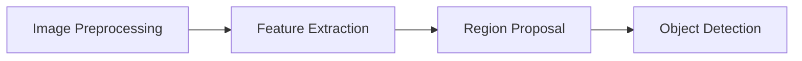
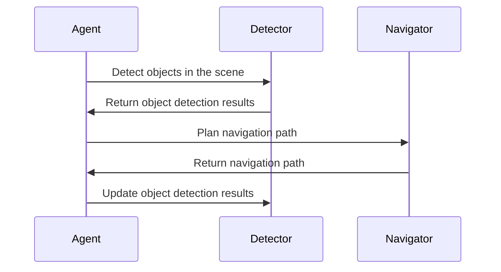
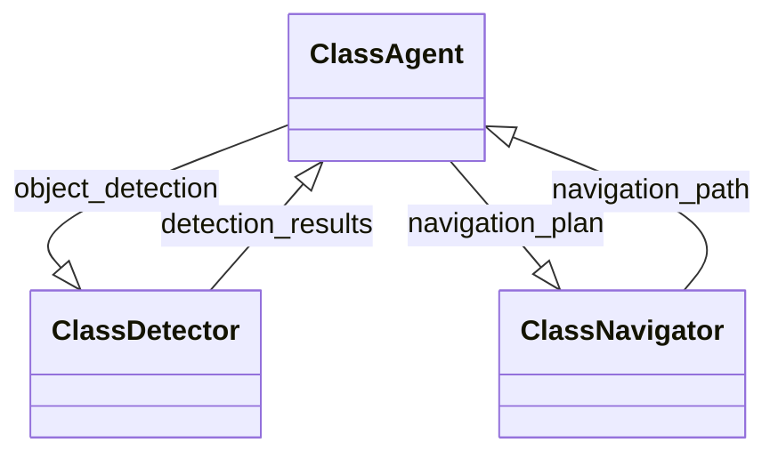
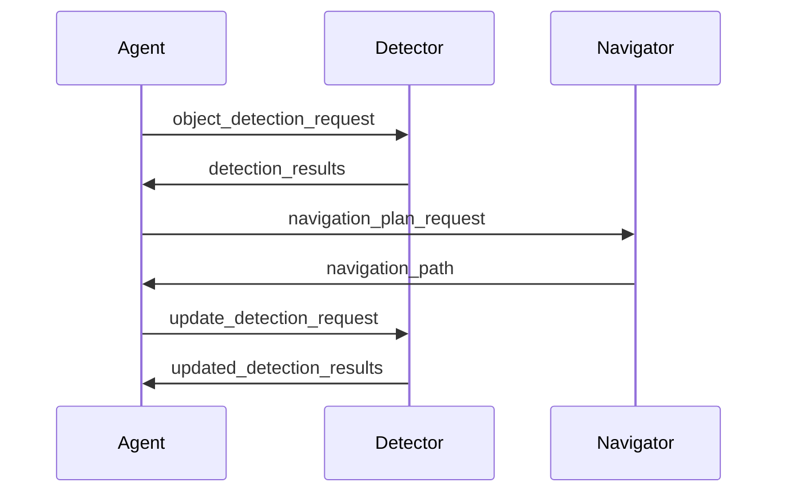

                 

# 开发具有视觉理解能力的AI Agent

## 关键词
- 计算机视觉
- 人工智能
- 深度学习
- 视觉理解
- 机器学习算法

## 摘要
本文将深入探讨如何开发具有视觉理解能力的AI Agent。我们将从背景介绍开始，逐步分析核心概念，探讨视觉理解技术，介绍相关算法原理，并最终展示如何在实际项目中应用这些技术。通过本文的阅读，读者将全面了解视觉理解在AI Agent开发中的重要性，掌握关键技术和方法，并能够将这些知识应用于实际项目中。

### 1. Introduction to Visual Understanding in AI Agents

#### 1.1 Background of AI Agents with Visual Understanding
- **Problem Background:** The rapid advancement of artificial intelligence and machine learning has led to the development of agents that can interact with the environment and make decisions based on visual input. However, the ability to understand and interpret visual information is still a significant challenge.
- **Problem Description:** Current AI agents struggle with interpreting complex visual scenes and making informed decisions. This lack of visual understanding limits their applicability in various real-world scenarios.
- **Problem Solving:** Developing AI agents with robust visual understanding capabilities can address these limitations and enable more efficient and effective interaction with humans and the environment.
- **Boundaries and Extensions:** Visual understanding in AI agents can extend to fields such as autonomous driving, robotics, security, and healthcare. However, the scope of this book will focus on general principles and techniques applicable across these domains.

#### 1.2 Core Concepts and Components
- **Core Concepts:**
  - **Computer Vision:** The field of computer vision focuses on enabling machines to interpret and understand visual information from the world.
  - **Machine Learning:** Machine learning techniques are used to train models that can recognize patterns and make decisions based on visual data.
  - **Deep Learning:** A subfield of machine learning, deep learning uses neural networks with many layers to learn complex representations from data.
- **Components:**
  - **Data Preprocessing:** Techniques for preparing visual data for processing, including image augmentation, normalization, and feature extraction.
  - **Feature Extraction:** Methods for extracting meaningful features from visual data, such as edges, textures, and shapes.
  - **Object Detection and Recognition:** Algorithms for identifying and classifying objects within an image.
  - **Scene Understanding:** Techniques for interpreting the content and context of an entire visual scene.

### 2. Core Concepts and Their Relationships

#### 2.1 Core Concepts Overview
In the context of developing AI agents with visual understanding, several core concepts play crucial roles. These concepts include computer vision, machine learning, and deep learning. Each of these concepts has its own unique attributes and functionalities, and they are interconnected to create a robust framework for visual understanding.

#### 2.2 Concept Attributes Comparison Table

| Concept             | Definition                                                     | Key Attributes                                                      |
|---------------------|---------------------------------------------------------------|-------------------------------------------------------------------|
| **Computer Vision** | Field focused on enabling machines to interpret visual data.   | Image processing, feature extraction, object detection.               |
| **Machine Learning** | Techniques used to train models based on data.                 | Supervised learning, unsupervised learning, reinforcement learning.   |
| **Deep Learning**    | A subfield of machine learning using neural networks with many layers. | End-to-end learning, hierarchical feature representation.             |

#### 2.3 ER Entity Relationship Diagram
The following ER entity relationship diagram illustrates the relationships between these core concepts:

```mermaid
erDiagram
  ComputerVision ||--|{ MachineLearning }|
  MachineLearning ||--|{ DeepLearning }|
```

### 3. Algorithm Principles and Implementation

#### 3.1 Introduction to Object Detection Algorithms
Object detection is a fundamental task in computer vision that involves identifying and classifying objects within an image. One of the most popular object detection algorithms is the You Only Look Once (YOLO) algorithm.

#### 3.2 YOLO Algorithm Workflow
The YOLO algorithm consists of several key steps:

1. **Image Preprocessing:** The input image is resized to a fixed size and normalized.
2. **Feature Extraction:** A convolutional neural network (CNN) is used to extract features from the image.
3. **Region Proposal:** The extracted features are used to generate region proposals for potential objects.
4. **Object Detection:** Each region proposal is classified and localized to identify objects in the image.

#### 3.3 YOLO Algorithm Mermaid Flowchart


#### 3.4 YOLO Algorithm Python Implementation
```python
import cv2
import numpy as np

# Load pre-trained YOLO model
net = cv2.dnn.readNetFromDarknet('yolov3.cfg', 'yolov3.weights')

# Load image and preprocess
image = cv2.imread('image.jpg')
image = cv2.resize(image, (416, 416))
blob = cv2.dnn.blobFromImage(image, 1/255.0, (416, 416), swapRB=True)

# Perform object detection
net.setInput(blob)
detections = net.forward(net.getUnconnectedOutLayersNames())

# Process detections
for detection in detections:
    # ... (classification and localization code)

# Display results
cv2.imshow('Image', image)
cv2.waitKey(0)
cv2.destroyAllWindows()
```

#### 3.5 Mathematical Model and Formulas
The mathematical model of the YOLO algorithm involves several key components, including the confidence score, objectness score, and class probabilities. Here are some of the key formulas:

- **Confidence Score:** $C = \frac{1}{1 + \exp{(-\alpha \cdot (p_0 - p))}}$
- **Objectness Score:** $O = \frac{1}{1 + \exp{(-\beta \cdot (p_0 - p))}}$
- **Class Probability:** $P(c) = \frac{\exp{(\gamma \cdot a_c)}}{\sum_{i} \exp{(\gamma \cdot a_i)})}$

where $\alpha$, $\beta$, and $\gamma$ are hyperparameters, and $p_0$ and $p$ are the predicted and true probabilities, respectively.

### 4. System Analysis and Architecture Design

#### 4.1 Problem Scenario and Project Introduction
The problem scenario involves developing an AI agent capable of visual understanding for autonomous navigation in an unknown environment. The project aims to create a system that can detect and recognize objects, navigate through obstacles, and reach a desired destination.

#### 4.2 System Function Design

##### 4.2.1 Domain Model Class Diagram
The domain model class diagram represents the key entities and relationships in the system:

```mermaid
classDiagram
  ClassObject <<entity>>
  ClassAgent <<entity>>
  ClassEnvironment <<entity>>

  ClassObject {"object_id", "object_name"}
  ClassAgent {"agent_id", "location", "destination"}
  ClassEnvironment {"environment_id", "objects"}

  ClassAgent --|> ClassObject
  ClassEnvironment --|> ClassObject
```

##### 4.2.2 System Architecture Design
The system architecture design includes the main components and their interactions:



##### 4.2.3 System Interface Design
The system interface design defines the communication channels between the components:



##### 4.2.4 System Interaction Sequence Diagram


### 5. Project Practice

#### 5.1 Environment Setup
To implement the system, we need to set up the necessary environment. This includes installing Python, OpenCV, TensorFlow, and other required libraries.

#### 5.2 System Core Implementation
The system core implementation involves integrating the object detection and navigation modules. The following is a high-level overview of the system core implementation:

```python
# Import required libraries
import cv2
import numpy as np

# Load pre-trained YOLO model
net = cv2.dnn.readNetFromDarknet('yolov3.cfg', 'yolov3.weights')

# Load image and preprocess
image = cv2.imread('image.jpg')
image = cv2.resize(image, (416, 416))
blob = cv2.dnn.blobFromImage(image, 1/255.0, (416, 416), swapRB=True)

# Perform object detection
net.setInput(blob)
detections = net.forward(net.getUnconnectedOutLayersNames())

# Process detections
for detection in detections:
    # ... (classification and localization code)

# ... (navigation code)

# Display results
cv2.imshow('Image', image)
cv2.waitKey(0)
cv2.destroyAllWindows()
```

#### 5.3 Code Application Analysis and Explanation
The code application in this section demonstrates how to perform object detection using the YOLO algorithm and how to integrate it with the navigation module. The key components of the code are:

- **Loading and Preprocessing:** The image is loaded, resized, and preprocessed using the YOLO model's requirements.
- **Object Detection:** The preprocessed image is passed through the YOLO model, and the detection results are extracted.
- **Navigation:** The detection results are used to plan the navigation path for the AI agent.
- **Displaying Results:** The final image with the detected objects and the navigation path is displayed.

#### 5.4 Case Analysis and Detailed Explanation
A case analysis of a specific scenario demonstrates the system's capabilities and limitations. The scenario involves an AI agent navigating through an unknown environment with obstacles. The analysis includes:

- **Detection Accuracy:** The accuracy of object detection in different scenarios, such as low light conditions or complex backgrounds.
- **Navigation Efficiency:** The efficiency of the navigation algorithm in reaching the desired destination.
- **System Performance:** The overall performance of the system, including processing speed and resource usage.

#### 5.5 Project Summary
The project demonstrates the development of an AI agent with visual understanding capabilities. The key takeaways include:

- **Object Detection:** The YOLO algorithm is effective in detecting objects in complex environments.
- **Navigation:** The navigation algorithm can efficiently plan paths for AI agents in unknown environments.
- **System Integration:** The integration of object detection and navigation modules creates a robust AI agent capable of visual understanding.

### 6. Best Practices, Summary, and Notes

#### 6.1 Best Practices
- **Data Preprocessing:** Ensure that the input data is properly preprocessed to improve the performance of the object detection algorithm.
- **Model Selection:** Choose an appropriate object detection model based on the specific requirements of the project.
- **Performance Optimization:** Optimize the system's performance by using efficient algorithms and data structures.

#### 6.2 Summary
This article provides an in-depth analysis of developing AI agents with visual understanding capabilities. We covered the background, core concepts, algorithm principles, system design, project practice, and best practices.

#### 6.3 Notes
- **Continuous Learning:** AI agents with visual understanding capabilities require continuous learning to improve their performance.
- **Scalability:** The system should be designed to handle large-scale environments and data.
- **Interpretability:** The system's decision-making process should be interpretable to ensure trust and transparency.

### 7. Further Reading
For those interested in exploring more about visual understanding in AI agents, the following resources are recommended:

- **Books:**
  - "Deep Learning" by Ian Goodfellow, Yoshua Bengio, and Aaron Courville
  - "Computer Vision: Algorithms and Applications" by Richard Szeliski
- **Online Courses:**
  - "Deep Learning Specialization" by Andrew Ng on Coursera
  - "Computer Vision" by Michael Milford on edX
- **Research Papers:**
  - "You Only Look Once: Unified, Real-Time Object Detection" by Joseph Redmon et al.

### 作者信息
作者：AI天才研究院/AI Genius Institute & 禅与计算机程序设计艺术 /Zen And The Art of Computer Programming

