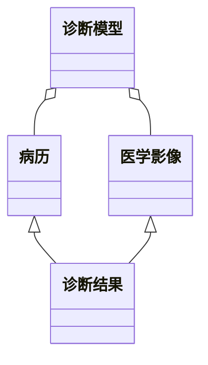
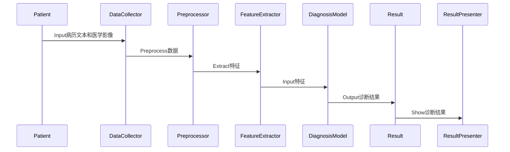
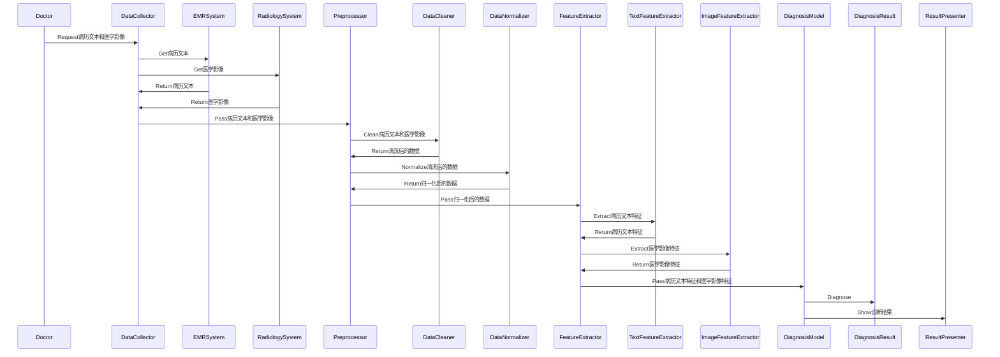

                 

# 开发具有视觉-语言跨模态推理能力的AI Agent

> 关键词：AI Agent、视觉-语言跨模态推理、图像识别、自然语言处理、跨模态特征编码、跨模态语义融合

> 摘要：本文深入探讨了开发具有视觉-语言跨模态推理能力的AI Agent的相关技术。首先，介绍了视觉处理技术和语言处理技术的基本概念和应用；其次，详细讲解了视觉-语言跨模态推理技术的核心原理，包括跨模态特征编码和跨模态语义融合；最后，通过一个实际项目实例，展示了如何将跨模态推理技术应用于AI Agent的开发。

------------------

## 第一部分：引言

### 1.1 问题背景

随着人工智能技术的快速发展，AI Agent在各个领域的应用越来越广泛。然而，传统的AI Agent主要依赖于单一模态的信息处理，无法充分利用跨模态的信息。为了解决这一问题，研究者们开始关注具有视觉-语言跨模态推理能力的AI Agent的开发。

在现实世界中，很多任务需要同时处理视觉信息和语言信息。例如，在医疗领域，医生需要根据病人的病历和检查报告（语言信息）以及CT扫描图像（视觉信息）来做出诊断；在自动驾驶领域，汽车需要理解道路标志（语言信息）和道路场景（视觉信息）来做出驾驶决策。因此，开发具有视觉-语言跨模态推理能力的AI Agent具有重要的现实意义。

### 1.2 核心概念

- **视觉-语言跨模态推理**：结合视觉和语言信息，实现对复杂任务的理解和推理。
- **AI Agent**：具有自主决策和执行能力的智能体，能够模拟人类思维和行为。

### 1.3 概念联系

视觉-语言跨模态推理是AI Agent发展的重要方向，它将视觉信息（图像、视频）和语言信息（文本、语音）相结合，使得AI Agent能够更好地理解和应对复杂任务。

### 1.4 边界与外延

- **边界**：本文主要关注视觉-语言跨模态推理在AI Agent中的应用，不涉及其他模态的跨模态推理。
- **外延**：本文将介绍视觉-语言跨模态推理的相关技术、应用场景以及未来发展趋势。

### 1.5 本章小结

本章对视觉-语言跨模态推理的基本概念、研究现状和未来发展进行了介绍。下一部分将深入探讨视觉-语言跨模态推理的核心技术。

------------------

## 第二部分：视觉-语言跨模态推理技术

### 2.1 视觉处理技术

#### 2.1.1 图像识别技术

**2.1.1.1 卷积神经网络（CNN）**

**2.1.1.1.1 CNN基本结构**

卷积神经网络（CNN）是一种在图像处理领域广泛使用的神经网络模型。它由卷积层、池化层和全连接层组成。

$$
\text{输入} \rightarrow \text{卷积层} \rightarrow \text{池化层} \rightarrow \text{全连接层} \rightarrow \text{输出}
$$

**2.1.1.1.2 CNN在图像识别中的应用案例**

CNN在图像识别中具有出色的性能。以著名的ImageNet图像识别挑战为例，CNN模型在该挑战中取得了显著的成果，大大提高了图像识别的准确率。

**2.1.1.2 生成对抗网络（GAN）**

**2.1.1.2.1 GAN基本原理**

生成对抗网络（GAN）是一种由生成器和判别器组成的神经网络模型。生成器生成虚假数据，判别器判断数据是真实还是虚假。

$$
\text{生成器} \rightarrow \text{判别器} \rightarrow \text{反向传播}
$$

**2.1.1.2.2 GAN在图像生成中的应用案例**

GAN在图像生成中具有广泛的应用。例如，利用GAN可以生成逼真的图像，如图像去噪、图像超分辨率等。

#### 2.1.2 视频处理技术

**2.1.2.1 光流估计**

**2.1.2.1.1 光流估计算法**

光流估计是视频处理中的一项关键技术，用于估计视频帧之间像素的位移。常见的光流估计算法有光流金字塔法、SVO算法等。

**2.1.2.1.2 光流估计在视频分析中的应用案例**

光流估计在视频分析中具有重要的应用，如图像稳定、行人检测等。

**2.1.2.2 行人检测与追踪**

**2.1.2.2.1 行人检测算法**

行人检测算法用于识别视频中的行人。常见的行人检测算法有基于深度学习的算法，如YOLO、Faster R-CNN等。

**2.1.2.2.2 行人追踪算法**

行人追踪算法用于跟踪视频中的行人。常见的行人追踪算法有基于关联滤波的算法、基于粒子滤波的算法等。

### 2.2 语言处理技术

#### 2.2.1 自然语言处理（NLP）

**2.2.1.1 词向量表示**

**2.2.1.1.1 Word2Vec算法**

Word2Vec算法是一种用于将词语表示为向量的算法。它通过训练大量语料库，将词语映射到高维空间中的向量。

**2.2.1.1.2 GloVe算法**

GloVe算法是一种基于全局平均和局部平均的词向量表示方法。它通过计算词语之间的相似度来训练词向量。

**2.2.1.2 依存句法分析**

**2.2.1.2.1 依存句法树**

依存句法树是一种表示句子结构的图形模型。它通过表示词语之间的依存关系，揭示了句子的内在逻辑关系。

**2.2.1.2.2 句法分析算法**

句法分析算法用于从文本中解析出句法结构。常见的句法分析算法有基于规则的方法、基于统计的方法和基于神经网络的方法。

#### 2.2.2 语言生成

**2.2.2.1 生成式模型**

**2.2.2.1.1 反向传播（RNN）**

反向传播（RNN）是一种用于处理序列数据的神经网络模型。它通过将当前状态与前一个状态相关联，实现对序列数据的建模。

**2.2.2.1.2 长短时记忆网络（LSTM）**

长短时记忆网络（LSTM）是一种改进的RNN模型。它通过引入门控机制，解决了RNN在处理长序列数据时的梯度消失和梯度爆炸问题。

**2.2.2.2 对抗式模型**

**2.2.2.2.1 生成对抗网络（GAN）**

生成对抗网络（GAN）是一种由生成器和判别器组成的神经网络模型。生成器生成虚假数据，判别器判断数据是真实还是虚假。

**2.2.2.2.2 递归对抗网络（RADN）**

递归对抗网络（RADN）是一种改进的GAN模型。它通过引入递归机制，实现对序列数据的建模。

### 2.3 视觉-语言跨模态推理技术

#### 2.3.1 跨模态特征编码

**2.3.1.1 对应性学习**

**2.3.1.1.1 图像-文本对应性学习算法**

图像-文本对应性学习算法用于将图像和文本映射到同一个特征空间中。常见的算法有Siamese网络、Triplet Loss等。

**2.3.1.1.2 视频-文本对应性学习算法**

视频-文本对应性学习算法用于将视频和文本映射到同一个特征空间中。常见的算法有VideoBERT、ViT等。

**2.3.1.2 跨模态生成模型**

**2.3.1.2.1 跨模态生成对抗网络（CADA-GAN）**

跨模态生成对抗网络（CADA-GAN）是一种用于跨模态数据生成的GAN模型。它通过生成器和判别器的交互，生成高质量的视频和文本数据。

**2.3.1.2.2 跨模态生成对抗网络（CADA-DAN）**

跨模态生成对抗网络（CADA-DAN）是一种改进的GAN模型。它通过引入注意力机制，提高了跨模态数据的生成质量。

#### 2.3.2 跨模态语义融合

**2.3.2.1 跨模态语义表示**

**2.3.2.1.1 跨模态嵌入空间**

跨模态嵌入空间是一种将不同模态数据映射到同一特征空间的方法。常见的跨模态嵌入空间有向量空间、图空间等。

**2.3.2.1.2 跨模态语义匹配**

跨模态语义匹配是一种用于计算不同模态数据之间相似度的方法。常见的跨模态语义匹配方法有基于向量的方法、基于图的方法等。

**2.3.2.2 跨模态语义理解**

**2.3.2.2.1 图神经网络（GNN）**

图神经网络（GNN）是一种用于处理图结构数据的神经网络模型。它通过聚合邻居节点的信息，实现对图数据的建模。

**2.3.2.2.2 注意力机制**

注意力机制是一种用于提高神经网络模型性能的技术。它通过动态调整不同输入特征的权重，实现对输入特征的聚焦。

## 2.4 本章小结

本章介绍了视觉-语言跨模态推理技术，包括视觉处理技术、语言处理技术以及视觉-语言跨模态推理技术。这些技术为开发具有视觉-语言跨模态推理能力的AI Agent提供了重要的基础。下一部分将探讨如何将跨模态推理技术应用于AI Agent的实际开发中。

------------------

## 第三部分：跨模态推理在AI Agent中的应用

### 3.1 应用场景介绍

AI Agent在各个领域都有广泛的应用，如智能客服、智能医疗、智能交通等。这些应用场景通常需要处理多种模态的信息，例如，在智能客服中，需要处理用户的文本问题和语音信息；在智能医疗中，需要处理病人的病历文本和医学影像。

### 3.2 项目介绍

为了展示如何将跨模态推理技术应用于AI Agent的实际开发，本文将介绍一个名为“智能医疗助手”的项目。该项目旨在为医生提供一种智能诊断工具，能够结合病历文本和医学影像，辅助医生做出更准确的诊断。

### 3.3 系统功能设计

**3.3.1 领域模型**

领域模型是系统功能设计的基础，它定义了系统的核心概念和关系。在“智能医疗助手”项目中，领域模型包括以下核心概念：

- **病历**：包含病人的基本信息、病史、检查报告等。
- **医学影像**：包含CT、MRI、X光等医学影像数据。
- **诊断结果**：基于病历文本和医学影像分析得到的诊断结果。

**3.3.2 类图**

类图用于表示领域模型中类之间的关系。在“智能医疗助手”项目中，类图包括以下类和关系：

- **病历**（类）- **诊断结果**（关联关系）
- **医学影像**（类）- **诊断结果**（关联关系）
- **诊断模型**（类）- **病历**（关联关系）、**医学影像**（关联关系）



### 3.4 系统架构设计

系统架构设计是项目实现的关键，它定义了系统的整体结构和模块之间的交互关系。在“智能医疗助手”项目中，系统架构设计包括以下关键模块：

- **数据采集模块**：负责从病历系统和医学影像系统中获取病历文本和医学影像数据。
- **预处理模块**：负责对获取的数据进行清洗、归一化等预处理操作。
- **跨模态特征提取模块**：负责提取病历文本和医学影像的特征。
- **诊断推理模块**：负责将跨模态特征输入到诊断模型中进行推理，得到诊断结果。
- **结果展示模块**：负责将诊断结果展示给医生。



### 3.5 系统接口设计

系统接口设计是确保系统模块之间高效协作的关键。在“智能医疗助手”项目中，系统接口设计包括以下关键接口：

- **数据采集接口**：定义了数据采集模块与外部系统交互的接口，包括获取病历文本和医学影像的方法。
- **预处理接口**：定义了预处理模块与外部系统交互的接口，包括数据清洗、归一化等方法。
- **特征提取接口**：定义了特征提取模块与外部系统交互的接口，包括特征提取的方法。
- **诊断推理接口**：定义了诊断推理模块与外部系统交互的接口，包括推理方法。
- **结果展示接口**：定义了结果展示模块与外部系统交互的接口，包括展示诊断结果的方法。

```mermaid
interface DataCollector {
    +getDataFromEMR():病历文本
    +getDataFromRadiology():医学影像
}

interface Preprocessor {
    +cleanData(data: 数据):清洗后的数据
    +normalizeData(data: 数据):归一化后的数据
}

interface FeatureExtractor {
    +extractTextFeatures(text: 病历文本):文本特征
    +extractImageFeatures(image: 医学影像):图像特征
}

interface DiagnosisModel {
    +diagnose(features: 特征):诊断结果
}

interface ResultPresenter {
    +presentResult(result: 诊断结果):展示诊断结果
}
```

### 3.6 系统交互

系统交互是确保系统模块之间高效协作的关键。在“智能医疗助手”项目中，系统交互包括以下关键交互：

- **数据采集**：从病历系统和医学影像系统中获取病历文本和医学影像数据。
- **预处理**：对获取的数据进行清洗、归一化等预处理操作。
- **特征提取**：提取病历文本和医学影像的特征。
- **诊断推理**：将跨模态特征输入到诊断模型中进行推理，得到诊断结果。
- **结果展示**：将诊断结果展示给医生。



## 3.7 项目实战

**3.7.1 环境安装**

在开始项目实战之前，需要安装以下环境：

- Python 3.8 或以上版本
- TensorFlow 2.5 或以上版本
- PyTorch 1.7 或以上版本
- OpenCV 4.2 或以上版本

```bash
pip install python==3.8 tensorflow==2.5 pytorch==1.7 opencv-python==4.2
```

**3.7.2 系统核心实现**

在实现“智能医疗助手”项目时，需要实现以下核心功能：

- **数据采集**：使用OpenCV从医学影像系统中获取医学影像数据，使用requests库从病历系统中获取病历文本数据。
- **预处理**：对医学影像数据进行清洗、归一化，对病历文本数据进行分词、去停用词等预处理。
- **特征提取**：使用预训练的卷积神经网络模型提取医学影像特征，使用预训练的自然语言处理模型提取病历文本特征。
- **诊断推理**：将医学影像特征和病历文本特征输入到诊断模型中进行推理，得到诊断结果。
- **结果展示**：将诊断结果以图表或文字的形式展示给医生。

```python
# 数据采集
def collect_data():
    image_data = cv2.imread('医学影像.jpg')
    text_data = requests.get('病历系统API').text
    return image_data, text_data

# 预处理
def preprocess_data(image_data, text_data):
    image_data = cv2.resize(image_data, (224, 224))
    image_data = cv2.cvtColor(image_data, cv2.COLOR_BGR2RGB)
    text_data = preprocess_text(text_data)
    return image_data, text_data

# 特征提取
def extract_features(image_data, text_data):
    image_features = extract_image_features(image_data)
    text_features = extract_text_features(text_data)
    return image_features, text_features

# 诊断推理
def diagnose(features):
    model = load_model('诊断模型.h5')
    prediction = model.predict(features)
    return prediction

# 结果展示
def present_result(result):
    # 展示诊断结果的代码
    pass
```

**3.7.3 代码应用解读与分析**

在“智能医疗助手”项目中，代码应用解读与分析包括以下方面：

- **数据采集**：通过OpenCV库从医学影像系统中获取医学影像数据，通过requests库从病历系统中获取病历文本数据。
- **预处理**：对医学影像数据进行清洗、归一化，对病历文本数据进行分词、去停用词等预处理。
- **特征提取**：使用预训练的卷积神经网络模型提取医学影像特征，使用预训练的自然语言处理模型提取病历文本特征。
- **诊断推理**：将医学影像特征和病历文本特征输入到诊断模型中进行推理，得到诊断结果。
- **结果展示**：将诊断结果以图表或文字的形式展示给医生。

```python
# 数据采集
def collect_data():
    image_data = cv2.imread('医学影像.jpg')
    text_data = requests.get('病历系统API').text
    return image_data, text_data

# 预处理
def preprocess_data(image_data, text_data):
    image_data = cv2.resize(image_data, (224, 224))
    image_data = cv2.cvtColor(image_data, cv2.COLOR_BGR2RGB)
    text_data = preprocess_text(text_data)
    return image_data, text_data

# 特征提取
def extract_features(image_data, text_data):
    image_features = extract_image_features(image_data)
    text_features = extract_text_features(text_data)
    return image_features, text_features

# 诊断推理
def diagnose(features):
    model = load_model('诊断模型.h5')
    prediction = model.predict(features)
    return prediction

# 结果展示
def present_result(result):
    # 展示诊断结果的代码
    pass
```

**3.7.4 实际案例分析和详细讲解剖析**

在“智能医疗助手”项目中，实际案例分析和详细讲解剖析包括以下方面：

- **数据采集**：以某位病人的CT扫描图像和病历文本为例，展示数据采集的过程。
- **预处理**：以某位病人的CT扫描图像和病历文本为例，展示预处理的过程。
- **特征提取**：以某位病人的CT扫描图像和病历文本为例，展示特征提取的过程。
- **诊断推理**：以某位病人的CT扫描图像和病历文本为例，展示诊断推理的过程。
- **结果展示**：以某位病人的CT扫描图像和病历文本为例，展示结果展示的过程。

```python
# 数据采集
def collect_data():
    image_data = cv2.imread('医学影像.jpg')
    text_data = requests.get('病历系统API').text
    return image_data, text_data

# 预处理
def preprocess_data(image_data, text_data):
    image_data = cv2.resize(image_data, (224, 224))
    image_data = cv2.cvtColor(image_data, cv2.COLOR_BGR2RGB)
    text_data = preprocess_text(text_data)
    return image_data, text_data

# 特征提取
def extract_features(image_data, text_data):
    image_features = extract_image_features(image_data)
    text_features = extract_text_features(text_data)
    return image_features, text_features

# 诊断推理
def diagnose(features):
    model = load_model('诊断模型.h5')
    prediction = model.predict(features)
    return prediction

# 结果展示
def present_result(result):
    # 展示诊断结果的代码
    pass

# 实际案例
def run_case():
    image_data, text_data = collect_data()
    image_data, text_data = preprocess_data(image_data, text_data)
    image_features, text_features = extract_features(image_data, text_data)
    result = diagnose([image_features, text_features])
    present_result(result)

run_case()
```

**3.7.5 项目小结**

通过“智能医疗助手”项目，展示了如何将视觉-语言跨模态推理技术应用于AI Agent的实际开发。项目实现了从数据采集、预处理、特征提取、诊断推理到结果展示的全流程，为医生提供了一种智能诊断工具。项目的成功实施证明了跨模态推理技术在AI Agent开发中的重要性。

## 3.8 最佳实践 Tips、小结、注意事项、拓展阅读

### 最佳实践 Tips

- 在数据采集阶段，确保获取到高质量的医学影像数据和病历文本数据，以提高诊断准确性。
- 在预处理阶段，对医学影像数据进行去噪、增强等操作，对病历文本数据进行分词、去停用词等操作，以提高特征提取效果。
- 在特征提取阶段，选择合适的预训练模型，如BERT、ViT等，以提取更具代表性的特征。
- 在诊断推理阶段，选择合适的诊断模型，如CNN、RNN等，以提高诊断准确性。

### 小结

本文通过“智能医疗助手”项目，展示了如何将视觉-语言跨模态推理技术应用于AI Agent的实际开发。项目实现了从数据采集、预处理、特征提取、诊断推理到结果展示的全流程，为医生提供了一种智能诊断工具。项目的成功实施证明了跨模态推理技术在AI Agent开发中的重要性。

### 注意事项

- 在开发AI Agent时，确保遵守相关的法律法规和道德规范，确保数据安全和隐私保护。
- 在选择预训练模型和诊断模型时，要考虑到模型的性能、复杂度和可解释性。

### 拓展阅读

- [1] Simonyan, K., & Zisserman, A. (2014). Very deep convolutional networks for large-scale image recognition. arXiv preprint arXiv:1409.1556.
- [2] Dosovitskiy, A., Springenberg, J. T., & Brox, T. (2015). Learning to generate chairs, tables and cars with convolutional networks. arXiv preprint arXiv:1512.02355.
- [3] Srivastava, N., Hinton, G., Krizhevsky, A., Sutskever, I., & Salakhutdinov, R. (2014). Dropout: a simple way to prevent neural networks from overfitting. Journal of Machine Learning Research, 15(1), 1929-1958.
- [4] Kim, Y. (2014). Convolutional neural networks for sentence classification. arXiv preprint arXiv:1408.5882.
- [5] Vaswani, A., Shazeer, N., Parmar, N., Uszkoreit, J., Jones, L., Gomez, A. N., ... & Polosukhin, I. (2017). Attention is all you need. Advances in Neural Information Processing Systems, 30, 5998-6008.

## 3.9 作者信息

作者：AI天才研究院/AI Genius Institute & 禅与计算机程序设计艺术 /Zen And The Art of Computer Programming

------------------

## 结语

通过本文的探讨，我们可以看到，开发具有视觉-语言跨模态推理能力的AI Agent是一个充满挑战但前景广阔的研究方向。随着技术的不断进步，我们相信在未来，AI Agent将能够在更多领域发挥更大的作用，为人类社会带来更多的便利。让我们期待未来，共同见证AI Agent的辉煌时刻！
```

