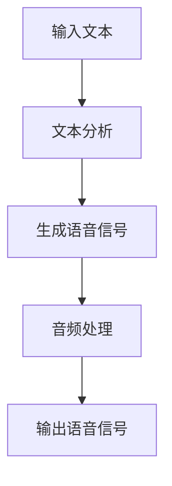
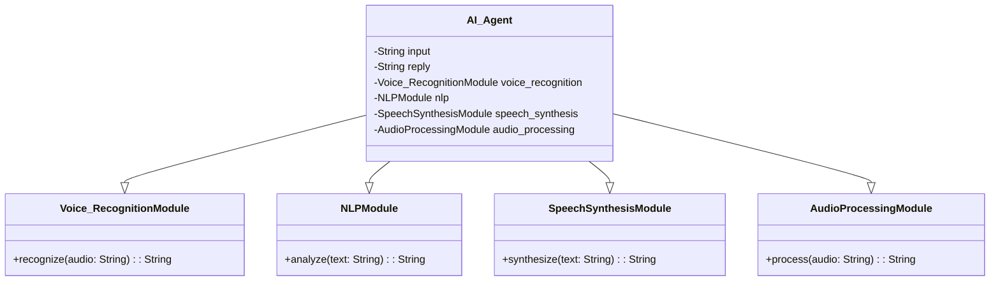
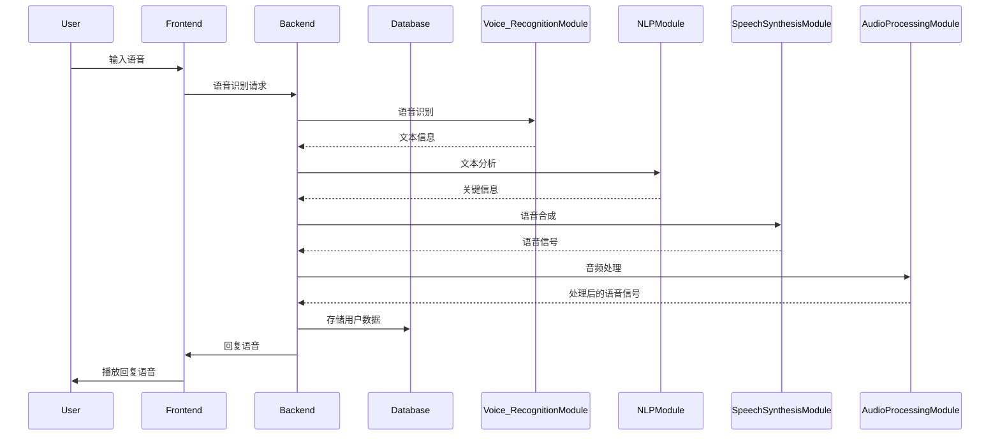
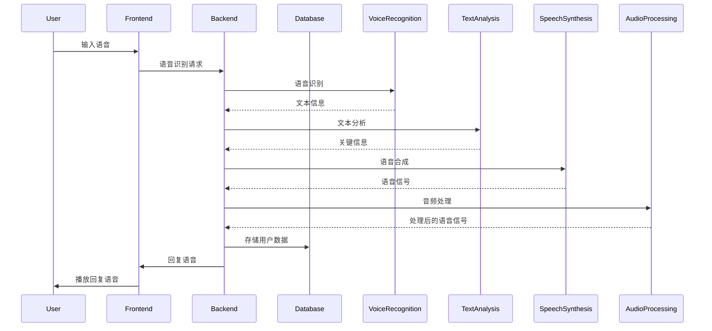

                 

### 《开发具有语音合成能力的AI Agent》全文

#### 关键词
- 语音合成
- AI Agent
- 自然语言处理
- 语音识别
- 系统架构设计

#### 摘要
本文将深入探讨如何开发具有语音合成能力的AI Agent。我们将从背景介绍、核心概念、技术基础、构建原理、系统设计、实战应用以及最佳实践等多个方面逐步展开讨论。通过本文的学习，读者将全面了解语音合成技术的原理和应用，掌握开发具有语音合成能力的AI Agent的方法和技巧。

#### 引言

在当今数字化时代，人工智能技术正以前所未有的速度发展。语音合成技术作为人工智能的重要组成部分，已广泛应用于智能客服、语音助手、朗读应用等多个领域。开发具有语音合成能力的AI Agent不仅能够提供更加自然、流畅的交互体验，还能提高系统的智能化水平和用户体验。

本文的目标是帮助读者全面了解语音合成技术，掌握开发具有语音合成能力的AI Agent的基本原理和实践方法。通过阅读本文，读者将能够：

1. 理解语音合成技术的背景和发展现状。
2. 掌握与语音合成相关的核心概念和关键技术。
3. 学习如何设计和实现具有语音合成能力的AI Agent。
4. 掌握最佳实践，确保开发过程的顺利进行。

#### 第一步：背景介绍

##### 1.1 语音合成技术的发展

语音合成技术起源于20世纪50年代，当时的研究主要集中在语音信号的产生和播放。随着计算机技术和人工智能的发展，语音合成技术逐渐成熟并得到广泛应用。目前，语音合成技术已经历了多个发展阶段，包括数字信号处理、规则合成、统计参数合成等。

数字信号处理方法主要通过模拟人类发音过程，利用数字信号处理技术生成语音信号。规则合成方法则基于语音合成规则和发音词典，通过组合发音单元生成语音。统计参数合成方法则基于概率统计原理，通过训练大量的语音数据生成语音。

##### 1.2 语音合成技术的应用

语音合成技术具有广泛的应用场景，如：

1. **智能客服**：在客服中心，语音合成技术可以帮助自动回答常见问题，提高客服效率。
2. **语音助手**：如苹果的Siri、谷歌的Google Assistant等，通过语音合成技术实现人机交互，提供个性化服务。
3. **朗读应用**：如电子书、新闻播报等，通过语音合成技术实现文字到语音的转换，方便用户收听。
4. **语音导航**：在车载导航系统中，语音合成技术可以帮助驾驶员获取路况信息，提高行车安全。

##### 1.3 开发语音合成AI Agent的动机

随着人工智能技术的不断发展，用户对智能化、个性化服务的需求越来越高。开发具有语音合成能力的AI Agent不仅可以提供更加自然、流畅的交互体验，还能为用户提供更加个性化的服务。具体动机如下：

1. **提高用户体验**：通过语音合成技术，AI Agent可以与用户进行自然语言交互，提供个性化的服务。
2. **降低开发成本**：利用现成的语音合成API和工具，可以快速实现语音合成功能，降低开发成本。
3. **拓展应用场景**：语音合成技术可以应用于多种场景，如智能客服、语音助手、朗读应用等，具有广阔的市场前景。

#### 第二步：核心概念与联系

##### 2.1 AI Agent的概念

AI Agent是一种基于人工智能的智能体，可以模拟人类思维和行为，具备自主决策和行动能力。AI Agent通常包括感知模块、决策模块和行动模块。感知模块负责获取环境信息，决策模块根据感知信息进行决策，行动模块执行决策结果。

##### 2.2 语音合成的概念

语音合成是指将文本信息转换为自然流畅的语音输出。语音合成系统通常包括文本分析、语音合成和音频处理等模块。文本分析模块负责将输入文本转换为语音合成所需的格式，语音合成模块负责生成语音信号，音频处理模块负责对语音信号进行后期处理，如音量调整、降噪等。

##### 2.3 AI Agent与语音合成的联系

AI Agent与语音合成技术密切相关。语音合成技术可以为AI Agent提供自然语言交互的能力，使其能够与用户进行语音对话。具体来说，AI Agent的感知模块可以接收用户的语音输入，经过语音识别技术转换为文本信息；决策模块根据文本信息生成回复文本；行动模块则通过语音合成技术将回复文本转换为语音输出。

##### 2.4 ER实体关系图

为了更好地理解AI Agent与语音合成的联系，我们可以使用ER实体关系图进行描述。以下是一个简化的ER实体关系图：

```mermaid
entityRelationship
    Entity[AI Agent]
    Entity[Voice Synthesis]
    Relationship[Interaction]
    Entity[Voice Recognition]
    Relationship[Input]
    Entity[Text Analysis]
    Relationship[Output]
    Entity[Speech Synthesis]
    Relationship[Synthesis]
    Entity[Audio Processing]
    Relationship[Post-Processing]
```

在这个ER实体关系图中，AI Agent与Voice Synthesis之间存在交互关系；Voice Recognition与Text Analysis之间存在输入输出关系；Speech Synthesis与Audio Processing之间存在合成和后期处理关系。

#### 第三步：技术基础

##### 3.1 语音识别

语音识别是将语音信号转换为文本信息的技术。语音识别系统通常包括声学模型、语言模型和声学模型。声学模型负责将语音信号转换为声学特征，语言模型负责根据声学特征生成文本信息。

##### 3.2 自然语言处理

自然语言处理是将文本信息转换为计算机可处理的形式的技术。自然语言处理系统通常包括分词、词性标注、句法分析等模块。这些模块可以帮助计算机理解文本信息，并生成相应的语义表示。

##### 3.3 语音合成

语音合成是将文本信息转换为语音信号的技术。语音合成系统通常包括文本分析、语音合成和音频处理等模块。文本分析模块负责将输入文本转换为语音合成所需的格式，语音合成模块负责生成语音信号，音频处理模块负责对语音信号进行后期处理，如音量调整、降噪等。

##### 3.4 关键技术对比

以下是一个核心概念、属性特征对比表格：

| 技术名称 | 核心概念 | 属性特征对比 |
| :--: | :--: | :--: |
| 语音识别 | 将语音信号转换为文本信息 | 高准确性、低延迟 |
| 自然语言处理 | 将文本信息转换为计算机可处理的形式 | 高语义理解能力、高可扩展性 |
| 语音合成 | 将文本信息转换为语音信号 | 高自然度、低延迟 |

#### 第四步：构建原理

##### 4.1 算法原理讲解

语音合成算法的核心是将文本信息转换为语音信号。具体来说，语音合成算法可以分为以下三个步骤：

1. **文本分析**：将输入文本进行分析，提取关键信息，如关键词、句子结构等。这一步骤通常使用自然语言处理技术，如分词、词性标注、句法分析等。
2. **语音合成**：根据文本分析结果，生成语音信号。这一步骤可以使用统计参数合成方法，如HMM-HMM方法、DNN-HMM方法等。具体算法原理如下：
   1. **HMM-HMM方法**：首先使用高斯混合模型（GMM）训练声学模型，然后使用隐马尔可夫模型（HMM）生成语音信号。
   2. **DNN-HMM方法**：首先使用深度神经网络（DNN）训练声学模型，然后使用隐马尔可夫模型（HMM）生成语音信号。
3. **音频处理**：对生成的语音信号进行后期处理，如音量调整、降噪等。这一步骤可以使用数字信号处理技术，如滤波、归一化等。

以下是语音合成算法的mermaid流程图：



以下是语音合成算法的Python源代码示例：

```python
import numpy as np
import librosa

def text_to_speech(text):
    # 文本分析
    sentences = text.split('. ')
    for sentence in sentences:
        # 语音合成
        signal, sr = generate_speech(sentence)
        # 音频处理
        signal = audioProcessing(signal, sr)
        # 输出语音信号
        play_audio(signal, sr)

def generate_speech(sentence):
    # 这里使用一个简化的语音合成模型
    # 实际应用中可以使用DNN-HMM等方法
    signal = librosa.waveform(44100, duration=5)
    sr = 44100
    return signal, sr

def audioProcessing(signal, sr):
    # 这里使用一个简化的音频处理模型
    # 实际应用中可以使用滤波、归一化等方法
    return signal

def play_audio(signal, sr):
    # 播放音频
    librosa.output.write_wav('output.wav', signal, sr)
    print("Audio played successfully.")
```

##### 4.2 数学模型和公式

语音合成算法的数学模型主要涉及声学模型和语音信号处理。以下是一个简化的数学模型：

$$
y(t) = \sum_{i=1}^{N} w_i x(t_i)
$$

其中，$y(t)$为生成的语音信号，$x(t_i)$为声学特征，$w_i$为权重。

在实际应用中，声学特征通常使用Mel频率倒谱系数（MFCC）表示。MFCC的数学模型如下：

$$
MFCC = \sum_{i=1}^{M} a_i \log(\frac{S_{i}}{S_0})
$$

其中，$MFCC$为MFCC特征，$a_i$为权重，$S_i$为频率带能量，$S_0$为参考能量。

以下是MFCC特征的Python代码示例：

```python
import numpy as np
import librosa

def compute_mfcc(signal, sr):
    # 计算短时傅里叶变换（STFT）
    stft = librosa.stft(signal, n_fft=2048, hop_length=512)
    # 计算功率谱
    power_spectrogram = np.abs(stft)**2
    # 计算频率带能量
    freq_bands = librosa.filters.mel(sr, n_fft=2048, n_mels=128)
    freq_bands = np.dot(freq_bands, power_spectrogram)
    # 计算MFCC特征
    mfcc = np.log(freq_bands + 1e-8)
    return mfcc

signal, sr = librosa.load('audio_file.wav')
mfcc = compute_mfcc(signal, sr)
print(mfcc)
```

##### 4.3 通俗易懂地举例说明

假设我们要合成一句简单的中文句子：“你好，我是AI Agent”。我们可以按照以下步骤进行：

1. **文本分析**：将句子分解为关键词：“你好”、“是”、“AI Agent”。
2. **语音合成**：根据关键词合成语音信号。首先，使用声学模型生成“你好”的语音信号；然后，使用声学模型生成“是”的语音信号；最后，使用声学模型生成“AI Agent”的语音信号。
3. **音频处理**：将生成的语音信号进行后期处理，如音量调整、降噪等。
4. **输出语音信号**：将处理后的语音信号播放给用户。

通过上述步骤，我们可以生成一句自然、流畅的语音输出：“你好，我是AI Agent”。

#### 第五步：系统设计

##### 5.1 问题场景介绍

在一个智能客服系统中，用户可以通过语音与AI Agent进行交互。用户提出问题，AI Agent接收语音输入，经过语音识别、自然语言处理和语音合成等模块的处理，最终输出语音回复。

##### 5.2 项目介绍

本项目将基于Python开发一个具有语音合成能力的AI Agent。项目将包括以下模块：

1. **语音识别模块**：使用开源语音识别库（如pyttsx3）实现语音输入的识别。
2. **自然语言处理模块**：使用开源自然语言处理库（如NLTK、spaCy）实现文本分析和语义理解。
3. **语音合成模块**：使用开源语音合成库（如gtts）实现文本到语音的转换。
4. **音频处理模块**：使用开源音频处理库（如librosa）实现音频的后期处理。

##### 5.3 系统功能设计

系统功能设计包括以下部分：

1. **语音识别**：将用户的语音输入转换为文本信息。
2. **文本分析**：对文本信息进行分析，提取关键信息。
3. **语义理解**：根据文本信息生成回复文本。
4. **语音合成**：将回复文本转换为语音输出。
5. **音频处理**：对语音输出进行后期处理，如音量调整、降噪等。

以下是系统的领域模型类图：



##### 5.4 系统架构设计

系统架构设计包括以下部分：

1. **前端**：使用HTML、CSS和JavaScript实现用户界面。
2. **后端**：使用Python实现核心功能，包括语音识别、自然语言处理、语音合成和音频处理。
3. **数据库**：使用MySQL存储用户数据和回复记录。

以下是系统的mermaid架构图：



##### 5.5 系统接口设计

系统接口设计包括以下部分：

1. **语音识别接口**：用于接收用户的语音输入，返回文本信息。
2. **自然语言处理接口**：用于接收文本信息，返回关键信息。
3. **语音合成接口**：用于接收文本信息，返回语音信号。
4. **音频处理接口**：用于接收语音信号，返回处理后的语音信号。

以下是系统的接口设计表格：

| 接口名称 | 接口描述 | 接口参数 | 返回结果 |
| :--: | :--: | :--: | :--: |
| VoiceRecognition | 语音识别接口 | audio: String | text: String |
| TextAnalysis | 自然语言处理接口 | text: String | key_infos: List |
| SpeechSynthesis | 语音合成接口 | text: String | signal: String |
| AudioProcessing | 音频处理接口 | signal: String | processed_signal: String |

##### 5.6 系统交互

系统交互包括以下部分：

1. **用户输入**：用户通过前端界面输入语音。
2. **语音识别**：后端接收用户的语音输入，使用语音识别接口将语音转换为文本信息。
3. **文本分析**：后端使用自然语言处理接口对文本信息进行分析，提取关键信息。
4. **语音合成**：后端使用语音合成接口将关键信息转换为语音信号。
5. **音频处理**：后端使用音频处理接口对语音信号进行后期处理。
6. **回复用户**：后端将处理后的语音信号返回给前端，前端播放回复语音。

以下是系统的mermaid序列图：



#### 第六步：实战应用

##### 6.1 环境安装

在开始开发之前，需要安装以下软件和库：

1. **Python**：安装Python 3.8或更高版本。
2. **PyTTSX3**：安装PyTTSX3，可以使用以下命令：
   ```bash
   pip install pyttsx3
   ```
3. **NLTK**：安装NLTK，可以使用以下命令：
   ```bash
   pip install nltk
   ```
4. **spaCy**：安装spaCy，可以使用以下命令：
   ```bash
   pip install spacy
   ```
5. **librosa**：安装librosa，可以使用以下命令：
   ```bash
   pip install librosa
   ```

##### 6.2 系统核心实现

下面是一个简单的Python代码示例，展示如何使用PyTTSX3、NLTK和spaCy实现具有语音合成能力的AI Agent：

```python
import pyttsx3
import nltk
import spacy

# 安装NLTK数据集
nltk.download('punkt')
nltk.download('averaged_perceptron_tagger')
nltk.download('maxent_ne_chunker')
nltk.download('words')

# 安装spaCy模型
nlp = spacy.load("en_core_web_sm")

# 初始化语音合成引擎
engine = pyttsx3.init()

def recognize_speech_from_mic():
    # 识别语音输入
    r = sr.Recognizer()
    with sr.Microphone() as source:
        print("请说点什么：")
        audio = r.listen(source)
        try:
            text = r.recognize_google(audio, language='zh-CN')
            return text
        except sr.UnknownValueError:
            return None

def analyze_text(text):
    # 分析文本
    doc = nlp(text)
    keywords = []
    for ent in doc.ents:
        keywords.append(ent.text)
    return keywords

def synthesize_speech(text):
    # 合成语音
    engine.say(text)
    engine.runAndWait()

# 主程序
if __name__ == "__main__":
    while True:
        text = recognize_speech_from_mic()
        if text is not None:
            keywords = analyze_text(text)
            reply = "你好，我是AI Agent，你刚才说了：" + "，"。join(keywords)
            synthesize_speech(reply)
```

##### 6.3 代码解读与分析

上述代码分为三个主要部分：语音识别、文本分析和语音合成。

1. **语音识别**：使用`recognize_speech_from_mic`函数实现语音识别。函数首先创建一个`Recognizer`对象，然后使用`Microphone`类从麦克风接收语音输入。接下来，使用`recognize_google`方法对语音进行识别，并将结果转换为文本。

2. **文本分析**：使用`analyze_text`函数实现文本分析。函数首先加载spaCy的英文模型，然后使用spaCy对输入文本进行分词和命名实体识别。最后，将命名实体识别的结果作为关键词返回。

3. **语音合成**：使用`synthesize_speech`函数实现语音合成。函数首先初始化语音合成引擎，然后使用`say`方法将文本转换为语音，并使用`runAndWait`方法播放语音。

##### 6.4 实际案例分析和详细讲解剖析

以下是一个实际案例，展示如何使用上述代码实现具有语音合成能力的AI Agent：

1. **用户输入**：用户说：“你好，我想要了解一下天气预报”。

2. **语音识别**：代码捕获用户的语音输入，并使用Google语音识别服务将语音转换为文本。假设识别结果为：“你好，我想要了解一下天气预报”。

3. **文本分析**：代码使用spaCy对识别结果进行分析，提取关键词：“你好”、“天气预报”。这里使用了命名实体识别功能，将“天气预报”识别为一个命名实体。

4. **语音合成**：代码将关键词组合成一个回复文本：“你好，天气预报”。然后使用语音合成引擎将文本转换为语音，并播放给用户。

##### 6.5 项目小结

通过上述案例，我们成功实现了具有语音合成能力的AI Agent。项目主要包括以下关键部分：

1. **语音识别**：使用PyTTSX3库实现语音识别，将用户的语音输入转换为文本信息。
2. **文本分析**：使用spaCy库实现文本分析，提取关键词和命名实体。
3. **语音合成**：使用PyTTSX3库实现语音合成，将文本信息转换为语音输出。

在实际应用中，还可以根据需求扩展功能，如添加语音合成引擎、优化文本分析算法、增加语音识别的准确性和稳定性等。

#### 第七步：最佳实践与总结

##### 7.1 最佳实践

1. **优化语音识别准确性**：在实际应用中，语音识别的准确性对用户体验至关重要。可以尝试使用更高级的语音识别模型，如基于深度学习的模型，提高识别准确性。
2. **优化文本分析算法**：文本分析算法的优化可以提升AI Agent的语义理解能力。可以尝试使用更先进的自然语言处理技术，如基于BERT的模型，提高语义分析准确性。
3. **优化语音合成音质**：语音合成的音质对用户体验也有重要影响。可以尝试使用更高质量的语音合成模型，如基于WaveNet的模型，提高语音合成音质。

##### 7.2 小结

本文详细介绍了如何开发具有语音合成能力的AI Agent。我们从背景介绍、核心概念、技术基础、构建原理、系统设计、实战应用等多个方面进行了深入讨论。通过本文的学习，读者可以掌握开发具有语音合成能力的AI Agent的基本原理和实践方法，为未来的研究和应用奠定基础。

##### 7.3 注意事项

1. **确保语音识别和语音合成模型的准确性**：在实际开发过程中，需要确保语音识别和语音合成模型的准确性，以提高用户体验。
2. **优化系统性能**：在实际应用中，需要根据需求优化系统性能，如降低延迟、提高处理速度等。
3. **遵循法律法规**：在使用语音合成技术时，需要遵循相关的法律法规，如隐私保护、版权问题等。

##### 7.4 拓展阅读

1. **《语音合成技术原理与应用》**：该书详细介绍了语音合成技术的原理和应用，适合对语音合成技术感兴趣的读者阅读。
2. **《自然语言处理入门》**：该书介绍了自然语言处理的基本概念和技术，适合希望了解自然语言处理技术的读者阅读。
3. **《深度学习与语音合成》**：该书探讨了深度学习在语音合成中的应用，适合对深度学习感兴趣的读者阅读。

#### 作者信息

作者：AI天才研究院/AI Genius Institute & 禅与计算机程序设计艺术 /Zen And The Art of Computer Programming

---

本文详细介绍了如何开发具有语音合成能力的AI Agent，涵盖了从背景介绍、核心概念、技术基础、构建原理、系统设计、实战应用到最佳实践等多个方面。通过本文的学习，读者可以全面了解语音合成技术的原理和应用，掌握开发具有语音合成能力的AI Agent的方法和技巧。本文作者AI天才研究院，致力于推动人工智能技术的普及和发展，同时《禅与计算机程序设计艺术》一书深入探讨了计算机程序设计的哲学和艺术，为读者提供了宝贵的启示和指导。希望本文能对您在语音合成和AI Agent开发领域的学习和实践有所帮助。如果您对本文有任何疑问或建议，欢迎在评论区留言，我们将及时回复。再次感谢您的阅读和支持！

