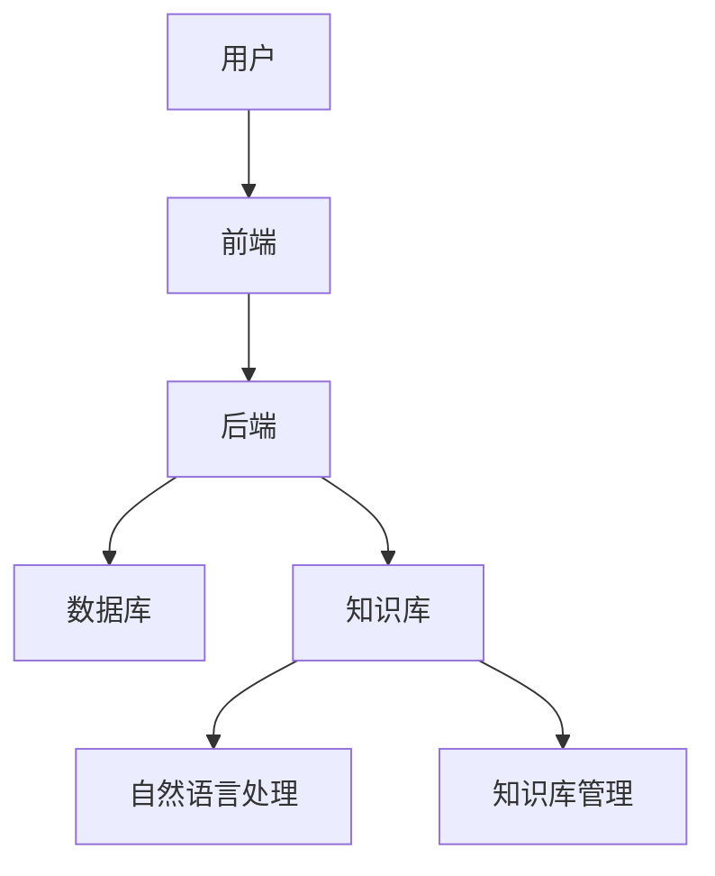
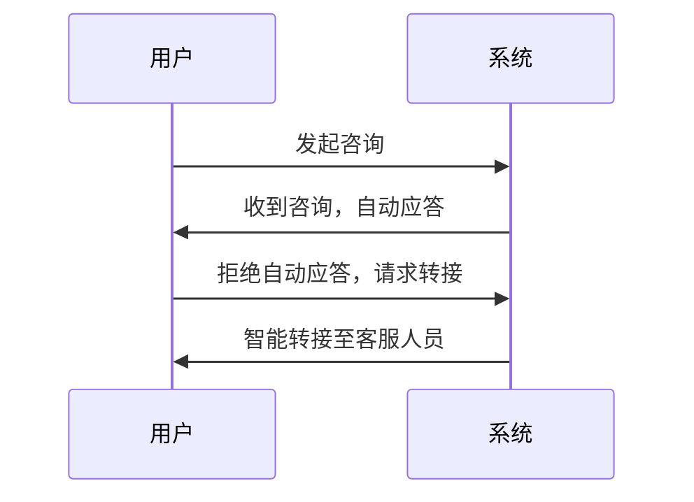
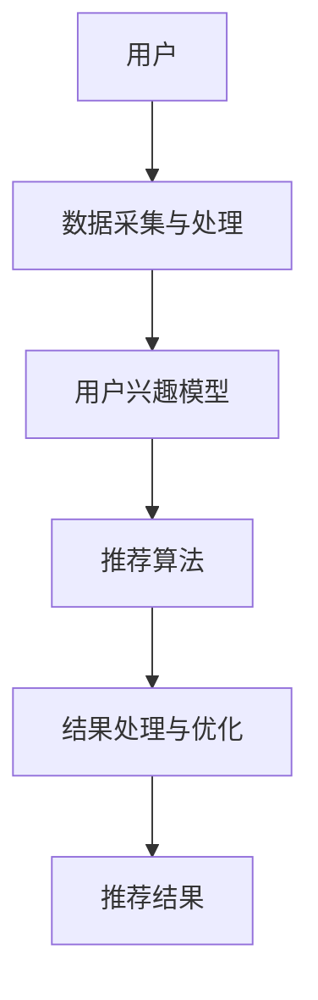
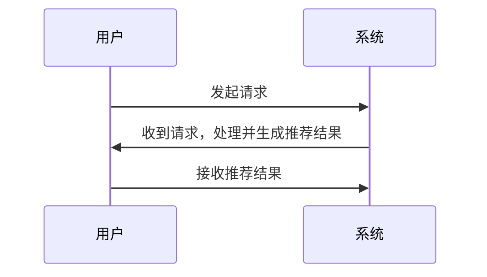

                 

# 开发具有跨域知识推理能力的AI Agent

## 关键词

- 人工智能
- 跨域知识推理
- AI Agent
- 知识库
- 知识图谱
- 深度学习
- 智能客服
- 智能推荐

## 摘要

本文将探讨如何开发具有跨域知识推理能力的AI Agent。首先，我们将回顾人工智能的发展历程和跨域知识推理的核心概念。接着，我们将详细介绍AI Agent的基本概念和架构设计，以及如何构建和维护跨域知识库。随后，我们将深入分析常见的跨域知识推理算法，并通过实际案例展示其在智能客服和智能推荐系统中的应用。本文旨在为读者提供一个全面、详细的跨域知识推理解决方案，帮助他们在人工智能领域取得突破。

### 目录大纲

1. **问题背景与核心概念介绍**

    1.1 人工智能与跨域知识推理
    
    1.2 跨域知识推理的基本原理
    
    1.3 跨域知识推理的核心概念对比表格
    
    1.4 跨域知识推理的ER实体关系图架构

2. **AI Agent 的设计与实现**

    2.1 AI Agent 的基本概念与架构设计
    
    2.2 跨域知识库的构建与维护
    
    2.3 跨域知识推理算法详解
    
3. **AI Agent 的跨域知识推理应用**

    3.1 智能客服系统的设计与实现
    
    3.2 智能推荐系统的设计与实现

---

### 第一部分：问题背景与核心概念介绍

#### 1.1 人工智能与跨域知识推理

**问题背景：**

随着信息技术的飞速发展，人工智能（AI）已经成为现代社会的一个重要组成部分。从早期的规则系统到现代的深度学习，人工智能在各个领域都展现出了巨大的潜力。然而，传统的AI系统往往局限于特定领域的知识应用，难以实现跨领域知识的推理和融合。

**核心概念：**

- **人工智能（AI）：** 模拟人类智能的计算机系统，能够理解、学习和适应新环境。
- **跨域知识推理：** 在不同领域之间进行知识整合和推理，以实现更广泛的应用。

**发展历程：**

1. **早期AI：** 以符号计算和规则系统为主，如专家系统。
2. **现代AI：** 以机器学习和深度学习为代表，通过大量数据训练模型，实现智能决策。
3. **跨域知识推理：** 结合多领域知识，实现更广泛的应用。

**重要性：**

- **提高AI系统的通用性：** 跨域知识推理使得AI系统不再局限于特定领域，提高了其通用性。
- **促进知识整合：** 通过跨领域知识融合，可以实现更高效的知识利用。

**挑战与机遇：**

- **挑战：** 领域知识的多样性和复杂性，使得跨域知识推理面临巨大挑战。
- **机遇：** 随着数据和技术的发展，跨域知识推理迎来了新的机遇。

---

#### 1.2 跨域知识推理的基本原理

**跨域知识推理的方法与框架：**

- **基于知识图谱的推理：** 通过构建知识图谱，实现跨领域知识的整合和推理。
- **基于深度学习的推理：** 利用神经网络模型，实现跨领域知识的自动学习与推理。

**核心技术：**

- **知识图谱：** 用于表示和整合跨领域知识。
- **深度学习：** 用于处理大规模数据，实现知识自动学习。

**应用场景：**

- **智能问答：** 利用跨领域知识库，实现智能问答系统。
- **智能推荐：** 基于用户跨领域兴趣，实现个性化推荐。
- **智能决策：** 利用跨领域知识，支持复杂决策。

**核心概念对比表格：**

| 概念 | 描述 |
| --- | --- |
| 知识图谱 | 用于表示和整合跨领域知识 |
| 深度学习 | 用于处理大规模数据，实现知识自动学习 |
| 跨域知识推理 | 在不同领域之间进行知识整合和推理 |

**ER实体关系图架构：**

```mermaid
erDiagram
  User ||--|{ KnowledgeGraph } KnowledgeGraph
  KnowledgeGraph ||--|{ QuestionAnswering } QuestionAnswering
  KnowledgeGraph ||--|{ RecommenderSystem } RecommenderSystem
  KnowledgeGraph ||--|{ DecisionSupport } DecisionSupport
```

---

### 第二部分：AI Agent 的设计与实现

#### 2.1 AI Agent 的基本概念与架构设计

**什么是AI Agent？**

AI Agent是一种具有自主性和智能性的计算实体，能够在复杂的环境中执行任务，并与其他实体进行交互。与传统的软件系统不同，AI Agent能够通过学习、推理和决策，实现更高级的智能行为。

**主要功能：**

- **感知与理解：** 通过感知环境，理解当前状态。
- **决策与规划：** 基于目标，进行决策和规划。
- **执行与反馈：** 实现任务的执行，并通过反馈进行调整。

**应用领域：**

- **智能客服：** 提供24/7的智能客服服务，提高客户满意度。
- **智能推荐：** 基于用户行为，提供个性化推荐。
- **智能决策：** 支持企业决策，提高决策效率。

**AI Agent的架构设计：**

AI Agent的架构通常包括以下几个核心模块：

- **感知模块：** 负责收集环境信息，如文本、图像、语音等。
- **理解模块：** 负责对感知到的信息进行理解，如自然语言处理、图像识别等。
- **决策模块：** 负责根据目标和状态，进行决策。
- **执行模块：** 负责执行决策结果，如发送请求、执行操作等。
- **反馈模块：** 负责收集执行结果，进行反馈和学习。

**交互机制：**

AI Agent通常通过以下方式进行交互：

- **文本交互：** 通过自然语言处理技术，实现文本对话。
- **语音交互：** 通过语音识别和语音合成技术，实现语音交互。
- **多模态交互：** 结合文本、语音、图像等多种方式进行交互。

**设计原则与最佳实践：**

- **模块化设计：** 将AI Agent的功能分解为多个模块，实现模块化设计，提高可维护性和可扩展性。
- **数据驱动：** 基于数据驱动，实现AI Agent的不断学习和优化。
- **用户中心：** 以用户需求为中心，提供高质量的服务。

---

### 第三部分：AI Agent 的跨域知识推理应用

#### 3.1 智能客服系统的设计与实现

**智能客服系统的概述：**

智能客服系统是一种利用人工智能技术提供客户服务的系统，能够自动处理大量客户咨询，提高服务效率和质量。通过跨域知识推理，智能客服系统可以实现更智能、更个性化的服务。

**智能客服系统的功能：**

- **自动应答：** 利用自然语言处理技术，自动回答常见问题。
- **智能转接：** 根据客户问题，智能地将客户转接给合适的客服人员。
- **客户画像：** 基于客户行为数据，构建客户画像，提供个性化服务。
- **知识库管理：** 维护和管理跨领域知识库，支持智能问答。

**智能客服系统的应用场景：**

- **电子商务：** 提供24/7的智能客服服务，提高客户满意度。
- **金融保险：** 处理大量客户咨询，提高服务效率。
- **旅游出行：** 提供智能预订、查询等服务。

**智能客服系统的架构设计：**

智能客服系统的架构通常包括以下几个核心部分：

- **前端：** 负责与用户进行交互，如网站、APP等。
- **后端：** 负责处理业务逻辑，如自然语言处理、知识库管理等。
- **数据库：** 负责存储客户数据、知识库数据等。

**系统功能设计：**

- **自动应答：** 利用自然语言处理技术，实现自动回答常见问题。
- **智能转接：** 根据客户问题，智能地将客户转接给合适的客服人员。
- **客户画像：** 基于客户行为数据，构建客户画像，提供个性化服务。
- **知识库管理：** 维护和管理跨领域知识库，支持智能问答。

**系统架构设计：**



**系统接口设计：**

- **API接口：** 提供RESTful API，支持前端调用。
- **消息队列：** 采用消息队列，实现异步处理，提高系统性能。

**系统交互设计：**



**核心实现：**

- **跨域知识库的构建：** 构建跨领域知识库，支持智能问答。
- **跨域知识推理算法的应用：** 利用跨域知识推理算法，实现智能问答和客户画像。
- **智能对话管理：** 实现智能对话管理，提高客户满意度。
- **智能推荐系统的集成：** 集成智能推荐系统，提供个性化服务。

---

#### 3.2 智能推荐系统的设计与实现

**智能推荐系统的概述：**

智能推荐系统是一种利用人工智能技术，根据用户的历史行为和偏好，为用户推荐相关内容的系统。通过跨域知识推理，智能推荐系统可以实现更精准、更个性化的推荐。

**智能推荐系统的功能：**

- **内容推荐：** 根据用户兴趣和行为，推荐相关内容。
- **广告推荐：** 根据用户兴趣和行为，推荐相关广告。
- **购物推荐：** 根据用户购物行为，推荐相关商品。

**智能推荐系统的应用场景：**

- **电子商务：** 提供个性化商品推荐，提高销售额。
- **社交媒体：** 提供个性化内容推荐，提高用户粘性。
- **在线教育：** 提供个性化课程推荐，提高学习效果。

**智能推荐系统的架构设计：**

智能推荐系统的架构通常包括以下几个核心部分：

- **数据采集与处理：** 负责采集用户行为数据，并进行预处理。
- **用户兴趣模型：** 负责构建用户兴趣模型，用于推荐算法。
- **推荐算法：** 负责实现推荐算法，生成推荐结果。
- **结果处理与优化：** 负责处理推荐结果，并进行优化。

**系统功能设计：**

- **内容推荐：** 根据用户兴趣和行为，推荐相关内容。
- **广告推荐：** 根据用户兴趣和行为，推荐相关广告。
- **购物推荐：** 根据用户购物行为，推荐相关商品。

**系统架构设计：**



**系统接口设计：**

- **API接口：** 提供RESTful API，支持前端调用。
- **消息队列：** 采用消息队列，实现异步处理，提高系统性能。

**系统交互设计：**



**核心实现：**

- **用户兴趣模型的构建：** 利用机器学习算法，构建用户兴趣模型。
- **推荐算法的应用：** 采用协同过滤、基于内容的推荐等算法，实现推荐结果。
- **推荐结果的处理与优化：** 负责处理推荐结果，并进行优化，提高推荐质量。
- **跨域知识的应用：** 利用跨域知识推理，提高推荐系统的多样性。

---

通过本文的介绍，我们了解了如何开发具有跨域知识推理能力的AI Agent。AI Agent的设计与实现涉及多个领域的技术，包括自然语言处理、知识图谱、深度学习等。在实际应用中，智能客服系统和智能推荐系统为我们展示了跨域知识推理的强大能力。在未来，随着技术的不断进步，跨域知识推理将在更多领域发挥重要作用，为人类带来更多便利。

---

**作者信息：**

- 作者：AI天才研究院/AI Genius Institute & 禅与计算机程序设计艺术 /Zen And The Art of Computer Programming****

