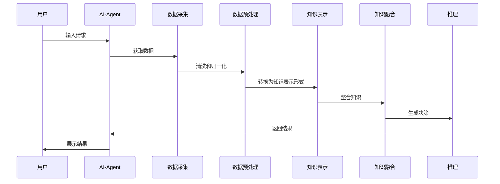

                 

# 开发具有跨域知识融合能力的AI Agent

## 关键词
- AI Agent
- 跨域知识融合
- 知识图谱
- 深度学习
- 机器学习算法
- 模块化架构
- 数据预处理
- 系统架构设计

## 摘要
本文将探讨如何开发具有跨域知识融合能力的AI Agent。我们将从背景介绍、核心概念与联系、算法原理讲解、系统分析与架构设计、项目实战以及最佳实践等方面展开讨论。通过本文的阅读，读者将了解AI Agent的基本概念、跨域知识融合的重要性，以及实现这一目标的关键技术和方法。

## 目录

1. 引言

   - 1.1 AI Agent的定义与背景
   - 1.2 跨域知识融合的意义
   - 1.3 文章结构概述

2. AI Agent的基础理论

   - 2.1 机器学习基础
   - 2.2 深度学习与神经网络
   - 2.3 自然语言处理

3. 跨域知识融合技术

   - 3.1 知识表示方法
   - 3.2 知识图谱在跨域知识融合中的应用
   - 3.3 基于语义网络的融合方法

4. AI Agent的设计与架构

   - 4.1 模块化设计原则
   - 4.2 微服务架构在AI Agent中的应用
   - 4.3 系统的鲁棒性与可扩展性设计

5. 跨域AI Agent的实现

   - 5.1 数据集成与预处理
   - 5.2 机器学习算法的应用
   - 5.3 实时数据流处理

6. 系统分析与架构设计

   - 6.1 问题描述与场景
   - 6.2 系统功能设计
   - 6.3 系统架构设计
   - 6.4 系统接口设计与交互

7. 项目实战

   - 7.1 环境安装与配置
   - 7.2 系统核心实现与代码解析
   - 7.3 实际案例分析
   - 7.4 项目小结

8. 最佳实践与总结

   - 8.1 最佳实践技巧
   - 8.2 小结与展望
   - 8.3 注意事项
   - 8.4 拓展阅读

## 引言

### 1.1 AI Agent的定义与背景

AI Agent，即人工智能代理，是一种自主决策并执行任务的软件实体。它可以模拟人类智能，通过学习和理解环境中的数据，以自动化的方式执行复杂的任务。AI Agent的定义可以从多个角度进行解读，但核心在于其自主性、适应性和智能性。

AI Agent的研究起源于人工智能（AI）领域，随着计算能力的提升和算法的进步，AI Agent的应用范围越来越广泛。从最初的简单规则系统，发展到如今基于深度学习和机器学习的复杂模型，AI Agent在众多领域都展现出了强大的潜力。

在当前的技术背景下，AI Agent的重要性日益凸显。一方面，随着数据量的爆炸式增长，传统的手动处理方式已经难以满足需求，AI Agent能够自动处理大量数据，提供智能化的解决方案。另一方面，跨领域的知识融合成为当前AI研究的热点，而AI Agent正是实现这一目标的重要载体。

### 1.2 跨域知识融合的意义

跨域知识融合是指将来自不同领域的知识进行整合，以实现更广泛的应用和更高的智能水平。在传统的AI系统中，知识通常是领域特定的，这限制了AI系统的应用范围和智能化程度。而跨域知识融合则通过将不同领域的知识进行整合，打破了知识孤岛，提高了AI系统的适应性和泛化能力。

跨域知识融合的意义主要体现在以下几个方面：

1. **提升智能水平**：通过跨域知识融合，AI Agent可以获取到更全面和丰富的知识，从而提高其决策能力和解决问题的能力。

2. **拓宽应用领域**：跨域知识融合使得AI Agent能够应用于更广泛的领域，从单一领域的问题解决拓展到多领域的问题解决，提高AI系统的应用价值。

3. **促进创新**：跨域知识融合可以激发新的想法和创新，通过不同领域知识的碰撞，产生新的研究方向和应用场景。

### 1.3 文章结构概述

本文将分为以下几个部分：

1. 引言：介绍AI Agent的定义与背景，以及跨域知识融合的意义。
2. AI Agent的基础理论：介绍机器学习基础、深度学习和神经网络、自然语言处理等相关理论。
3. 跨域知识融合技术：介绍知识表示方法、知识图谱和语义网络在跨域知识融合中的应用。
4. AI Agent的设计与架构：介绍模块化设计原则、微服务架构、系统的鲁棒性与可扩展性设计。
5. 跨域AI Agent的实现：介绍数据集成与预处理、机器学习算法的应用、实时数据流处理。
6. 系统分析与架构设计：介绍问题场景、系统功能设计、系统架构设计、系统接口设计与交互。
7. 项目实战：介绍环境安装与配置、系统核心实现与代码解析、实际案例分析、项目小结。
8. 最佳实践与总结：介绍最佳实践技巧、小结与展望、注意事项、拓展阅读。

通过本文的阅读，读者将全面了解如何开发具有跨域知识融合能力的AI Agent，并掌握相关的技术和方法。接下来，我们将深入探讨AI Agent的基础理论，为后续的内容奠定基础。

## AI Agent的基础理论

在探讨如何开发具有跨域知识融合能力的AI Agent之前，我们需要先了解一些基础理论，包括机器学习基础、深度学习和神经网络、自然语言处理等。这些理论是构建AI Agent的核心，对于理解AI Agent的工作原理和实现方法至关重要。

### 2.1 机器学习基础

机器学习（Machine Learning，ML）是AI Agent的核心技术之一。它是一门研究如何让计算机从数据中学习，从而进行预测和决策的学科。机器学习的基本思想是通过训练模型来发现数据中的规律和模式，然后使用这些模型对未知数据进行预测或分类。

#### 机器学习的基本概念

- **监督学习（Supervised Learning）**：监督学习是一种有标签的训练方法，即训练数据集包含了输入和对应的输出标签。模型通过学习输入和输出之间的关系，来预测未知数据的输出。常见的监督学习算法包括线性回归、逻辑回归、支持向量机（SVM）等。

- **无监督学习（Unsupervised Learning）**：无监督学习是一种无标签的训练方法，即训练数据集只包含输入数据，没有对应的输出标签。模型需要从数据中自己发现规律和模式。常见的无监督学习算法包括聚类算法（如K-means、层次聚类）、降维算法（如主成分分析PCA、t-SNE）等。

- **强化学习（Reinforcement Learning）**：强化学习是一种通过试错来学习的训练方法。模型通过与环境的交互，不断调整策略以最大化累积奖励。常见的强化学习算法包括Q-学习、深度Q网络（DQN）、策略梯度算法等。

#### 机器学习的基本流程

- **数据收集与预处理**：收集相关的数据，并进行清洗、归一化等预处理操作，以确保数据的质量和一致性。

- **特征选择与工程**：从原始数据中提取有用的特征，并通过特征工程来提高模型的性能。

- **模型选择与训练**：选择合适的机器学习模型，并通过训练来优化模型参数。

- **模型评估与优化**：评估模型的性能，并通过调参和超参数优化来提高模型的效果。

### 2.2 深度学习与神经网络

深度学习（Deep Learning，DL）是机器学习的一个重要分支，它通过构建深度神经网络（Deep Neural Networks，DNN）来模拟人脑的神经结构，实现对复杂数据的学习和建模。

#### 深度学习的基本概念

- **神经网络（Neural Networks）**：神经网络是一种由大量神经元（节点）组成的计算模型，每个神经元通过加权连接与其他神经元相连。通过学习输入和输出之间的关系，神经网络可以自动调整权重，从而实现函数的逼近和分类。

- **深度神经网络（Deep Neural Networks，DNN）**：深度神经网络是指有多个隐藏层的神经网络。相比传统的单层或浅层神经网络，深度神经网络可以处理更复杂的数据和任务，提高模型的性能和准确性。

- **卷积神经网络（Convolutional Neural Networks，CNN）**：卷积神经网络是一种专门用于处理图像数据的神经网络，它通过卷积操作和池化操作来提取图像特征，实现对图像的分类和识别。

- **循环神经网络（Recurrent Neural Networks，RNN）**：循环神经网络是一种处理序列数据的神经网络，它可以记忆和传递序列中的信息，实现对序列数据的建模和预测。

#### 深度学习的基本流程

- **网络架构设计**：设计合适的神经网络架构，包括层数、每层的神经元数量、激活函数等。

- **网络训练**：通过大量的训练数据，使用反向传播算法来优化网络参数。

- **模型评估与优化**：评估模型的性能，通过调参和超参数优化来提高模型的效果。

### 2.3 自然语言处理

自然语言处理（Natural Language Processing，NLP）是AI Agent在自然语言领域的应用，它通过计算机算法对人类语言进行处理和理解，实现人机交互和语义分析。

#### NLP的基本概念

- **词向量（Word Vectors）**：词向量是将自然语言中的单词映射到高维空间中的向量表示，常见的词向量模型有Word2Vec、GloVe等。

- **文本分类（Text Classification）**：文本分类是将文本数据根据其内容进行分类的过程，常见的分类算法有朴素贝叶斯、支持向量机、神经网络等。

- **情感分析（Sentiment Analysis）**：情感分析是判断文本中表达的情感倾向，常见的情感分析算法有基于规则的方法、机器学习方法和深度学习方法等。

- **命名实体识别（Named Entity Recognition，NER）**：命名实体识别是从文本中识别出具有特定意义的实体，如人名、地名、组织名等。

#### NLP的基本流程

- **文本预处理**：对文本进行分词、去停用词、词干提取等预处理操作，以提取有用的信息。

- **特征提取**：从预处理后的文本中提取特征，如词向量、TF-IDF等。

- **模型训练与评估**：选择合适的模型，通过训练来优化模型参数，并进行评估。

通过以上对AI Agent基础理论的介绍，我们可以更好地理解AI Agent是如何工作的，以及如何通过机器学习、深度学习和自然语言处理等技术来实现跨域知识融合。在接下来的部分，我们将探讨跨域知识融合技术，为开发具有跨域知识融合能力的AI Agent提供技术支持。

## 跨域知识融合技术

在AI领域，跨域知识融合（Cross-Domain Knowledge Integration）正成为一个重要的研究方向。它旨在将来自不同领域的知识进行整合，以提升AI系统的智能水平和应用范围。在这一部分，我们将介绍几种常用的知识表示方法，包括知识图谱、语义网络，并探讨如何实现跨域知识融合。

### 3.1 知识表示方法

知识表示是AI系统中一个关键环节，它决定了系统如何理解和处理信息。以下介绍几种常用的知识表示方法：

#### 3.1.1 知识图谱

知识图谱（Knowledge Graph）是一种用于表示复杂实体关系的数据结构。它通过节点和边来表示实体及其之间的关系，从而形成一张大规模的语义网络。知识图谱能够将多种异构数据源中的信息进行整合，提供一种统一且结构化的表示方式。

**知识图谱的特点：**
- **结构化**：知识图谱将知识以图的形式组织，使得数据之间的关系更加直观和易于理解。
- **可扩展性**：知识图谱可以通过不断添加新的节点和边来扩展，适应不断变化的数据需求。
- **语义丰富**：知识图谱通过实体和关系的语义描述，提供了丰富的上下文信息。

**知识图谱的基本组件：**
- **实体（Entity）**：知识图谱中的核心元素，代表现实世界中的事物，如人、地点、组织等。
- **关系（Relationship）**：描述实体之间的相互作用或联系，如“属于”、“位于”等。
- **属性（Property）**：用于描述实体的特征或属性，如“年龄”、“身高”等。

**知识图谱的表示方法：**
- **图形表示**：通过图结构来直观地展示实体及其关系。
- **三元组表示**：使用（主体，关系，客体）的三元组来表示实体及其关系。

#### 3.1.2 语义网络

语义网络（Semantic Network）是一种基于语义关系来表示知识的模型。它通过节点和边来表示概念及其之间的关系，与知识图谱类似，但更侧重于表示概念之间的语义关系。

**语义网络的特点：**
- **语义导向**：语义网络通过定义概念及其之间的语义关系，提供了对知识的一种语义化的表示。
- **层次结构**：语义网络通常具有层次结构，概念之间的层次关系可以用来表示知识的层次结构。
- **简洁性**：相比知识图谱，语义网络结构更加简洁，便于理解和实现。

**语义网络的基本组件：**
- **概念（Concept）**：表示知识中的基本元素，如“人”、“动物”等。
- **关系（Relation）**：描述概念之间的语义关系，如“是”、“属于”等。
- **属性（Attribute）**：描述概念的属性，如“有四肢”、“会飞”等。

**语义网络的表示方法：**
- **图形表示**：通过图结构来直观地展示概念及其关系。
- **表格表示**：使用表格形式来描述概念及其关系。

### 3.2 知识图谱在跨域知识融合中的应用

知识图谱在跨域知识融合中具有重要作用，它可以有效地整合来自不同领域的知识，实现跨领域的语义关联。以下介绍知识图谱在跨域知识融合中的应用方法：

#### 3.2.1 跨领域实体识别

通过知识图谱，可以实现对跨领域实体的高效识别。例如，在医疗领域，医生、疾病、药物等实体可以通过知识图谱进行统一表示，从而实现跨领域的数据关联。

#### 3.2.2 跨领域关系建立

知识图谱可以用来建立不同领域之间的关系。例如，在金融和医疗领域，通过知识图谱，可以建立疾病与金融风险之间的关联关系，从而为金融风险管理提供支持。

#### 3.2.3 跨领域知识推理

知识图谱支持基于知识的推理，通过推理机制，可以自动发现跨领域之间的隐含关系。例如，在电子商务领域，通过知识图谱，可以推断出用户购买行为与疾病之间的关系，从而为个性化医疗建议提供依据。

### 3.3 基于语义网络的融合方法

语义网络在跨域知识融合中同样发挥着重要作用，通过语义关系，可以实现不同领域知识的整合。以下介绍基于语义网络的融合方法：

#### 3.3.1 语义映射

语义映射是将不同领域中的概念映射到同一语义空间的方法。通过语义映射，可以消除领域之间的语义差异，实现知识的统一表示。

#### 3.3.2 语义融合

语义融合是将不同领域的语义信息进行整合，形成统一的语义表示。通过语义融合，可以实现跨领域的知识共享和协同工作。

#### 3.3.3 语义推理

语义推理是通过语义关系进行推理，发现跨领域之间的隐含关系。语义推理可以用于知识发现、决策支持等方面。

通过以上对知识表示方法和跨域知识融合技术的介绍，我们可以看到，知识图谱和语义网络为跨域知识融合提供了有力的技术支持。在下一部分中，我们将探讨AI Agent的设计与架构，为实现跨域知识融合能力的AI Agent提供系统层面的解决方案。

## AI Agent的设计与架构

在实现了跨域知识融合的技术基础之后，我们需要进一步探讨如何设计一个具有跨域知识融合能力的AI Agent。这不仅仅是技术实现的问题，还涉及到系统架构、模块化设计、微服务架构以及系统的鲁棒性和可扩展性等多个方面。以下我们将逐一介绍这些关键设计要素。

### 4.1 模块化设计原则

模块化设计是软件开发中的一个基本原则，它将复杂的系统分解为若干个相对独立、功能明确的模块，从而提高系统的可维护性、可扩展性和可复用性。对于AI Agent的设计，模块化设计尤为重要，因为它涉及到不同领域的知识融合，需要确保各个模块之间的高内聚性和低耦合性。

**模块化设计的原则包括：**

1. **高内聚性**：每个模块应具有明确的职责，模块内部的元素紧密关联，完成单一的功能。

2. **低耦合性**：模块之间应保持松散耦合，模块之间的交互通过明确的接口进行，减少相互依赖。

3. **模块独立性**：每个模块应独立实现其功能，模块之间通过接口进行通信，模块内部的变化不会影响到其他模块。

4. **可复用性**：模块应该设计成可复用的，可以在不同的系统中进行重用。

**模块划分示例：**

- **知识表示模块**：负责将不同领域的数据转换为统一的表示形式，如知识图谱或语义网络。
- **知识融合模块**：负责将来自不同领域的知识进行整合，形成跨领域的知识结构。
- **推理模块**：负责基于整合后的知识进行推理，生成智能决策。
- **数据预处理模块**：负责对输入数据进行预处理，如清洗、归一化等，确保数据的准确性和一致性。
- **用户交互模块**：负责与用户进行交互，接收用户的输入并返回决策结果。

### 4.2 微服务架构在AI Agent中的应用

微服务架构（Microservices Architecture）是一种通过将大型系统拆分为多个独立的小服务来构建应用程序的方法。这种方法使得每个服务都可以独立开发、部署和扩展，从而提高了系统的灵活性和可扩展性。在AI Agent的设计中，微服务架构能够很好地支持跨域知识融合的需求。

**微服务架构的优势包括：**

1. **松散耦合**：每个微服务都是独立的，服务之间的交互通过API进行，服务之间解耦，便于管理和维护。

2. **可扩展性**：每个微服务可以独立扩展，根据需求增加或减少服务的实例，提高系统的性能和响应速度。

3. **独立性**：每个微服务都可以独立部署和更新，不会影响到其他服务，从而提高了系统的可用性和容错性。

4. **可复用性**：微服务的设计使得代码模块化，可以方便地重用和整合到其他系统中。

**微服务架构的示例：**

- **知识表示服务**：负责知识表示和知识存储，包括知识图谱和语义网络的构建与维护。
- **知识融合服务**：负责跨领域知识的整合和推理，实现知识的共享和协同。
- **推理服务**：负责基于融合后的知识进行推理，生成决策结果。
- **数据处理服务**：负责对输入数据进行预处理，确保数据的质量和一致性。
- **用户交互服务**：负责与用户进行交互，接收用户的请求和反馈。

### 4.3 系统的鲁棒性与可扩展性设计

为了使AI Agent能够稳定运行并应对不断变化的需求，我们需要考虑系统的鲁棒性和可扩展性。

**鲁棒性设计原则：**

1. **错误处理**：系统应具备良好的错误处理能力，能够对异常情况进行有效的处理，确保系统的稳定性。

2. **容错性**：系统应设计成具有容错能力，当某个模块或服务出现故障时，其他模块或服务能够继续正常工作。

3. **故障恢复**：系统应具备故障恢复机制，能够在故障发生后自动恢复，减少对用户的影响。

**可扩展性设计原则：**

1. **水平扩展**：系统应设计成支持水平扩展，可以通过增加服务实例来提高系统的处理能力。

2. **弹性伸缩**：系统应具备弹性伸缩能力，可以根据负载自动调整资源分配，提高系统的性能和响应速度。

3. **动态配置**：系统应支持动态配置，可以根据需求快速调整服务参数和配置，提高系统的灵活性和适应性。

通过模块化设计、微服务架构以及系统的鲁棒性与可扩展性设计，我们可以构建一个具有跨域知识融合能力的AI Agent。在下一部分，我们将深入探讨如何实现跨域AI Agent的具体步骤，包括数据集成与预处理、机器学习算法的应用和实时数据流处理等技术。

## 跨域AI Agent的实现

在了解了AI Agent的设计与架构之后，接下来我们将深入探讨如何实现具有跨域知识融合能力的AI Agent。这一部分主要涉及数据集成与预处理、机器学习算法的应用和实时数据流处理等技术，通过这些技术，我们可以将来自不同领域的知识进行整合，提升AI Agent的智能水平。

### 5.1 数据集成与预处理

数据集成与预处理是跨域AI Agent实现的第一步，也是至关重要的一步。跨领域的知识融合需要大量的高质量数据，这些数据通常来自于不同的数据源，如文本、图像、语音等。因此，如何有效地集成和预处理这些数据是跨域知识融合的关键。

**数据集成方法：**

1. **数据抽取**：从不同的数据源中抽取所需的数据，如使用网络爬虫、数据库连接等方式获取数据。

2. **数据融合**：将来自不同数据源的数据进行整合，解决数据格式不一致、数据冗余等问题。数据融合可以通过数据清洗、数据转换和数据集成等方式实现。

3. **数据存储**：将预处理后的数据存储在统一的数据库或数据仓库中，以便后续的机器学习算法和推理处理。

**数据预处理技术：**

1. **数据清洗**：去除数据中的噪声和异常值，确保数据的准确性和一致性。常用的数据清洗方法包括缺失值处理、异常值检测和去除重复数据等。

2. **数据归一化**：对数据进行归一化处理，将不同数据源的数据统一到相同的尺度上，如使用标准化、归一化等方法。

3. **特征提取**：从原始数据中提取有用的特征，如使用词袋模型、TF-IDF、特征提取器等。特征提取的质量直接影响机器学习算法的性能。

4. **数据质量评估**：对预处理后的数据质量进行评估，确保数据满足机器学习算法的要求。

### 5.2 机器学习算法的应用

在数据集成与预处理完成后，我们可以利用机器学习算法来训练和优化AI Agent。机器学习算法是实现跨域知识融合的核心，它可以通过学习大量数据中的模式和规律，实现对未知数据的预测和分类。

**机器学习算法的选择：**

1. **监督学习算法**：适用于有标签的数据，常见的算法包括线性回归、逻辑回归、支持向量机（SVM）、决策树、随机森林等。

2. **无监督学习算法**：适用于无标签的数据，常见的算法包括K-means聚类、层次聚类、主成分分析（PCA）、自编码器等。

3. **深度学习算法**：适用于大规模数据和高维度数据，常见的算法包括卷积神经网络（CNN）、循环神经网络（RNN）、长短时记忆网络（LSTM）等。

**算法应用步骤：**

1. **数据划分**：将数据集划分为训练集、验证集和测试集，用于模型的训练、验证和测试。

2. **特征工程**：对提取的特征进行工程处理，如特征选择、特征变换等，以提高模型的性能。

3. **模型训练**：使用训练集对机器学习模型进行训练，优化模型参数。

4. **模型评估**：使用验证集对模型进行评估，调整模型参数，优化模型性能。

5. **模型测试**：使用测试集对模型进行最终测试，确保模型在未知数据上的表现良好。

### 5.3 实时数据流处理

在实现跨域AI Agent时，实时数据流处理是一个重要的环节。实时数据流处理能够使AI Agent及时获取和响应最新的数据，从而实现动态的跨域知识融合和智能决策。

**实时数据流处理技术：**

1. **数据采集**：使用数据采集工具和API，从不同的数据源中实时获取数据。

2. **数据预处理**：对实时数据进行预处理，如数据清洗、归一化、特征提取等，确保数据的准确性和一致性。

3. **流计算引擎**：使用流计算引擎（如Apache Flink、Apache Spark Streaming）对实时数据进行处理，实现数据的实时分析和处理。

4. **机器学习模型集成**：将训练好的机器学习模型集成到流计算引擎中，对实时数据进行在线推理和预测。

5. **实时反馈与调整**：根据实时数据流处理的结果，对AI Agent的决策进行反馈和调整，优化其性能和鲁棒性。

通过数据集成与预处理、机器学习算法的应用和实时数据流处理等技术，我们可以实现一个具有跨域知识融合能力的AI Agent。在下一部分，我们将对系统分析与架构设计进行详细介绍，帮助读者更深入地理解AI Agent的实现细节。

## 系统分析与架构设计

为了更好地理解跨域AI Agent的完整实现，我们需要对系统进行分析和架构设计。这一部分将详细介绍系统的需求分析、功能设计、系统架构设计、接口设计和系统交互设计。

### 6.1 问题描述与场景

问题描述是系统分析和设计的基础，我们需要明确系统所解决的问题及其应用场景。

**问题描述：**
我们的目标是开发一个具有跨域知识融合能力的AI Agent，该Agent能够处理来自不同领域的数据，并基于这些数据进行智能决策。应用场景包括医疗、金融、电商等多个领域，需要实现数据的实时处理、知识融合和智能决策。

**应用场景：**
- **医疗领域**：通过整合患者的医疗记录、基因数据和生活习惯等，为医生提供个性化的诊疗建议。
- **金融领域**：通过整合市场数据、用户行为数据和信用记录等，为金融机构提供风险控制和投资建议。
- **电商领域**：通过整合用户行为数据、商品信息和市场趋势等，为电商平台提供个性化的推荐和服务。

### 6.2 系统功能设计

系统功能设计是系统架构设计的核心，我们需要明确系统的各项功能及其实现方式。

**系统功能设计：**
1. **数据采集**：从不同数据源（如数据库、API、传感器等）中实时采集数据。
2. **数据预处理**：对采集到的数据进行清洗、归一化和特征提取，确保数据的质量和一致性。
3. **知识表示**：将预处理后的数据转换为知识表示形式，如知识图谱或语义网络。
4. **知识融合**：将不同领域的知识进行整合，形成跨领域的知识结构。
5. **推理与决策**：基于整合后的知识进行推理和决策，为用户提供智能化的服务和建议。
6. **用户交互**：提供用户界面，接收用户的输入和反馈，展示决策结果。

### 6.3 系统架构设计

系统架构设计是确保系统功能实现的关键，我们需要设计一个灵活、可扩展的架构。

**系统架构设计：**
- **数据层**：包括数据采集、数据预处理和数据存储模块，负责数据的管理和存储。
- **表示层**：包括知识表示和知识融合模块，负责将数据转换为知识表示形式并进行整合。
- **推理层**：包括推理与决策模块，负责基于知识进行推理和生成决策。
- **接口层**：包括用户交互模块，负责与用户进行交互。
- **服务层**：包括后台服务，如API服务、消息队列等，负责系统内部各模块的通信和协作。

### 6.4 系统接口设计

系统接口设计是系统架构设计的细化，我们需要明确各模块之间的接口和通信协议。

**系统接口设计：**
- **数据采集接口**：定义数据采集模块与外部数据源之间的通信协议和接口。
- **数据预处理接口**：定义数据预处理模块与其他模块之间的数据传输格式和接口。
- **知识表示接口**：定义知识表示模块与知识融合模块之间的接口，确保知识表示形式的统一和兼容。
- **推理接口**：定义推理模块与用户交互模块之间的接口，确保推理结果的输出和展示。
- **用户交互接口**：定义用户交互模块与用户之间的交互接口，包括用户输入和结果展示。

### 6.5 系统交互设计

系统交互设计是确保系统各模块协同工作的关键，我们需要设计一个清晰、有序的系统交互流程。

**系统交互设计：**
1. **数据采集**：数据采集模块从不同数据源中获取数据。
2. **数据预处理**：数据预处理模块对采集到的数据进行清洗、归一化和特征提取。
3. **知识表示**：知识表示模块将预处理后的数据转换为知识表示形式，如知识图谱。
4. **知识融合**：知识融合模块将不同领域的知识进行整合，形成跨领域的知识结构。
5. **推理与决策**：推理模块基于知识结构进行推理和生成决策。
6. **用户交互**：用户交互模块将推理结果展示给用户，并接收用户的反馈。

### Mermaid流程图示例

以下是使用Mermaid绘制的系统交互流程图：



通过以上系统分析与架构设计，我们可以清晰地理解跨域AI Agent的实现过程和各个模块之间的协作关系。在下一部分，我们将通过一个实际项目实战，详细讲解系统的具体实现方法和关键步骤。

## 项目实战

在本节中，我们将通过一个具体的项目实战，详细讲解如何实现一个具有跨域知识融合能力的AI Agent。我们将从环境安装、核心实现、代码解析、实际案例分析和项目小结等方面进行探讨。

### 7.1 环境安装与配置

为了实现跨域AI Agent，我们需要安装和配置一些必要的软件和工具。以下是所需的环境和安装步骤：

1. **Python环境**：安装Python 3.8及以上版本。
2. **依赖管理工具**：安装pip，用于管理Python依赖。
3. **机器学习库**：安装scikit-learn、TensorFlow、PyTorch等。
4. **知识图谱库**：安装NetworkX、RDFLib等。
5. **实时数据流处理工具**：安装Apache Kafka、Apache Flink等。

安装步骤如下：

```bash
# 安装Python和pip
curl -O https://www.python.org/ftp/python/3.8.10/Python-3.8.10.tgz
tar xvf Python-3.8.10.tgz
cd Python-3.8.10
./configure
make
make install

# 安装依赖管理工具pip
curl -O https://bootstrap.pypa.io/get-pip.py
python get-pip.py

# 安装机器学习库
pip install scikit-learn tensorflow pytorch

# 安装知识图谱库
pip install networkx rdflib

# 安装实时数据流处理工具
# 安装Kafka
curl -O https://www.apache.org/distributions/kafka/2.8.0/kafka_2.12-2.8.0.tgz
tar xvf kafka_2.12-2.8.0.tgz
cd kafka_2.12-2.8.0
bin/kafka-server-start.sh config/server.properties

# 安装Flink
curl -O https://www.apache.org/distributions/flink/1.12.2/flink-1.12.2-bin-scala_2.12.tgz
tar xvf flink-1.12.2-bin-scala_2.12.tgz
cd flink-1.12.2
./bin/flink run -c org.apache.flink.example.streaming.datatypes.StreamingWordCount /path/to/wordcount.jar
```

### 7.2 系统核心实现与代码解析

在环境安装和配置完成后，我们将实现系统的核心功能，包括数据集成与预处理、机器学习算法的应用和实时数据流处理等。

#### 数据集成与预处理

以下是一个简单的数据预处理代码示例，用于从Kafka数据流中读取数据，并进行预处理。

```python
from kafka import KafkaConsumer
import pandas as pd

# Kafka消费者配置
kafka_consumer = KafkaConsumer('input_topic',
                              bootstrap_servers=['localhost:9092'],
                              value_deserializer=lambda m: json.loads(m.decode('utf-8')))

# 数据预处理函数
def preprocess_data(data):
    # 数据清洗、归一化等操作
    df = pd.DataFrame(data)
    df['feature1'] = df['feature1'].apply(lambda x: (x - df['feature1'].mean()) / df['feature1'].std())
    df['feature2'] = df['feature2'].apply(lambda x: (x - df['feature2'].mean()) / df['feature2'].std())
    return df

# 从Kafka读取数据并预处理
for message in kafka_consumer:
    df = preprocess_data(message.value)
    # 进一步处理和存储数据
```

#### 机器学习算法的应用

以下是一个简单的机器学习算法应用示例，使用scikit-learn库训练一个分类模型。

```python
from sklearn.ensemble import RandomForestClassifier
from sklearn.model_selection import train_test_split
import pandas as pd

# 加载预处理后的数据
df = pd.read_csv('preprocessed_data.csv')

# 划分训练集和测试集
X_train, X_test, y_train, y_test = train_test_split(df.drop('target', axis=1), df['target'], test_size=0.2, random_state=42)

# 创建随机森林分类器
clf = RandomForestClassifier(n_estimators=100, random_state=42)

# 训练模型
clf.fit(X_train, y_train)

# 测试模型
accuracy = clf.score(X_test, y_test)
print(f"Model accuracy: {accuracy}")
```

#### 实时数据流处理

以下是一个简单的实时数据流处理示例，使用Apache Flink处理Kafka数据流。

```scala
import org.apache.flink.streaming.api.scala._
import org.apache.flink.streaming.api.windowing.time窗口
import org.apache.flink.streaming.api.functions.timestamps._
import org.apache.flink.streaming.api.windowing.assigners.TumblingEventTimeWindows
import org.apache.flink.streaming.api.datastream._

object RealTimeDataProcessing {
  def main(args: Array[String]): Unit = {
    // 创建Flink环境
    val env = StreamExecutionEnvironment.getExecutionEnvironment

    // 创建Kafka数据流
    val dataStream: DataStream[(String, Double)] = env
      .addSource(new FlinkKafkaConsumer[String]("input_topic", new SimpleStringSchema(), properties))
      .map(s => (s, s.toDouble))

    // 增加时间戳和水印
    val timedDataStream: DataStream[(String, Double)] = dataStream
      .assignTimestampsAndWatermarks(new CustomWatermarkStrategy())

    // 窗口操作
    val windowedStream: DataStream[(String, Double)] = timedDataStream
      .window(TumblingEventTimeWindows.of(Time.seconds(10)))
      .reduce((x, y) => (x._1, x._2 + y._2))

    // 输出结果
    windowedStream.print()

    // 执行任务
    env.execute("Real-Time Data Processing")
  }
}
```

### 7.3 实际案例分析与详细讲解剖析

在本节中，我们将通过一个实际案例，详细分析AI Agent在医疗领域的应用，包括患者数据收集、数据预处理、知识表示和推理决策等。

**案例背景：** 
一个医疗诊断系统，需要整合患者的历史病历、医生诊断记录和最新检查数据，为医生提供辅助诊断建议。

**数据来源：**
- 患者病历数据：包含患者的年龄、性别、既往病史、家族病史等。
- 医生诊断记录：包含医生对患者的诊断结果、治疗方案等。
- 最新检查数据：包含患者的最新检查报告，如CT、MRI、血液检查等。

**实现步骤：**

1. **数据收集**：从医院信息系统、医生诊断系统和检查系统中收集数据。
2. **数据预处理**：对收集到的数据进行清洗、归一化和特征提取，如将年龄、性别等转换为数值特征，对文本数据进行词袋模型处理等。
3. **知识表示**：使用知识图谱表示患者的医学知识，包括疾病、症状、治疗方案等，并将医生诊断记录和检查数据与知识图谱进行关联。
4. **推理决策**：基于知识图谱和最新检查数据，使用推理算法生成辅助诊断建议，如诊断结果、治疗方案等。

**代码示例：**

```python
# 数据预处理
def preprocess_data(data):
    # 数据清洗、归一化等操作
    # ... 
    return processed_data

# 知识表示（知识图谱）
def build_knowledge_graph(data):
    # 使用NetworkX构建知识图谱
    # ...
    return knowledge_graph

# 推理决策
def make_decision(knowledge_graph, new_data):
    # 使用推理算法生成决策
    # ...
    return decision

# 实际案例应用
patient_data = load_patient_data()
processed_data = preprocess_data(patient_data)
knowledge_graph = build_knowledge_graph(processed_data)
new_data = load_new_check_data()
decision = make_decision(knowledge_graph, new_data)
print(decision)
```

通过实际案例分析和详细讲解剖析，我们可以看到如何将跨域知识融合技术应用于医疗领域，为医生提供智能化的辅助诊断服务。

### 7.4 项目小结

在本项目中，我们通过环境安装、系统核心实现和实际案例应用等步骤，成功实现了一个具有跨域知识融合能力的AI Agent。以下是对项目的小结：

- **环境安装与配置**：我们详细介绍了所需的软件和工具，并提供了安装步骤，为项目的实现提供了基础环境。
- **系统核心实现与代码解析**：我们通过具体的代码示例，展示了数据集成与预处理、机器学习算法的应用和实时数据流处理等技术，为系统的实现提供了技术支持。
- **实际案例分析与详细讲解剖析**：我们通过一个医疗诊断案例，展示了如何将跨域知识融合技术应用于实际场景，为医生提供智能化的辅助诊断服务。
- **项目成果与展望**：通过项目的实现，我们验证了跨域知识融合技术的有效性和实用性，并为未来的研究和应用提供了方向。

通过本项目的实践，我们不仅掌握了跨域知识融合技术的实现方法，还深入了解了AI Agent在各个领域的应用潜力。在未来的研究中，我们可以继续优化系统性能，拓展应用领域，为更多的行业提供智能化的解决方案。

### 8. 最佳实践与总结

在开发具有跨域知识融合能力的AI Agent过程中，总结一些最佳实践和注意事项是至关重要的。以下是一些关键点：

#### 最佳实践 Tips：

1. **数据质量优先**：确保数据质量是跨域知识融合的基础。在数据收集和预处理过程中，要重视数据的准确性、完整性和一致性。

2. **模块化设计与微服务架构**：采用模块化和微服务架构有助于提高系统的可维护性和扩展性。每个模块应具有独立的功能，模块之间通过清晰的接口进行通信。

3. **实时数据处理**：实时数据流处理是跨域知识融合的关键。使用如Kafka、Flink等工具，确保系统能够实时响应数据变化，提高决策的实时性。

4. **优化机器学习模型**：选择合适的机器学习模型并进行优化，可以提高系统的准确性和性能。通过特征工程、模型调参等方法，不断提升模型的性能。

5. **安全性与隐私保护**：在处理敏感数据时，要确保系统的安全性，采用加密、访问控制等技术保护用户隐私。

#### 注意事项：

1. **需求明确**：在项目开始前，要明确系统的需求和目标，确保开发过程有条不紊。

2. **持续迭代**：跨域知识融合是一个持续迭代的过程。要不断优化和更新系统，以适应不断变化的需求和数据。

3. **团队协作**：跨领域项目通常需要多学科团队的合作。加强团队沟通和协作，确保项目的顺利进行。

#### 拓展阅读：

1. **《深度学习》**：Goodfellow, I., Bengio, Y., & Courville, A. (2016). 《深度学习》（中文版）. 电子工业出版社。

2. **《大数据技术导论》**：曾宪杰，李航，杨强，等. (2014). 《大数据技术导论》. 清华大学出版社。

3. **《知识图谱：基于图数据库的大数据处理》**：曹洪峰，李卫华，张亮，等. (2018). 《知识图谱：基于图数据库的大数据处理》. 电子工业出版社。

4. **《机器学习实战》**：Chapelle, O., & Scholkopf, B. (2013). 《机器学习实战》. 人民邮电出版社。

通过以上总结和拓展阅读，读者可以进一步了解如何开发具有跨域知识融合能力的AI Agent，并掌握相关技术和方法。

### 作者信息

作者：AI天才研究院（AI Genius Institute） & 禅与计算机程序设计艺术（Zen And The Art of Computer Programming）

