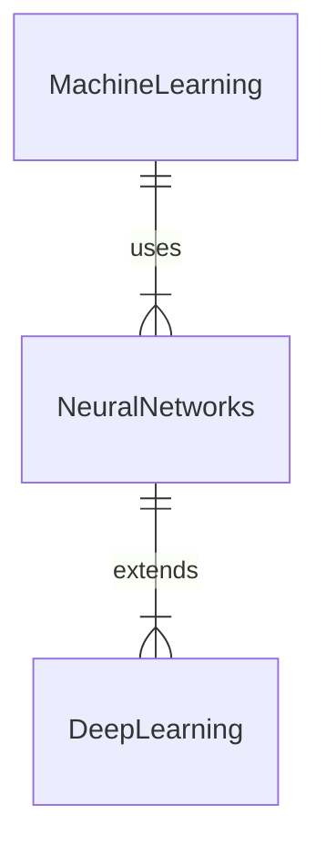
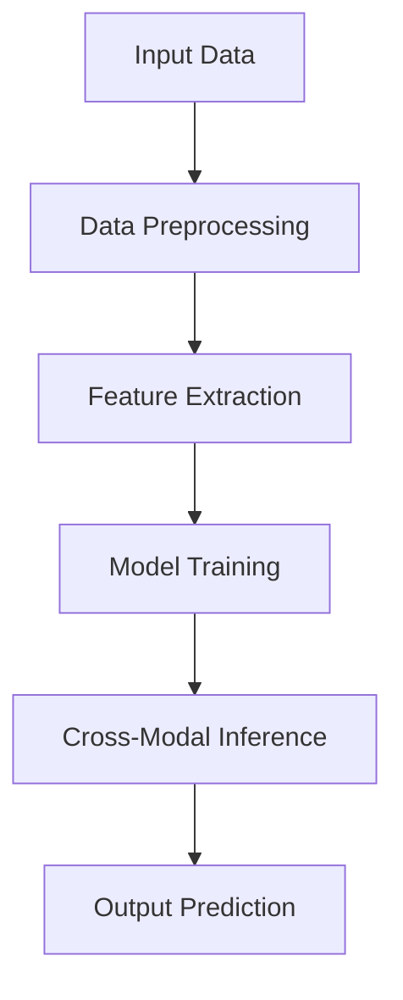
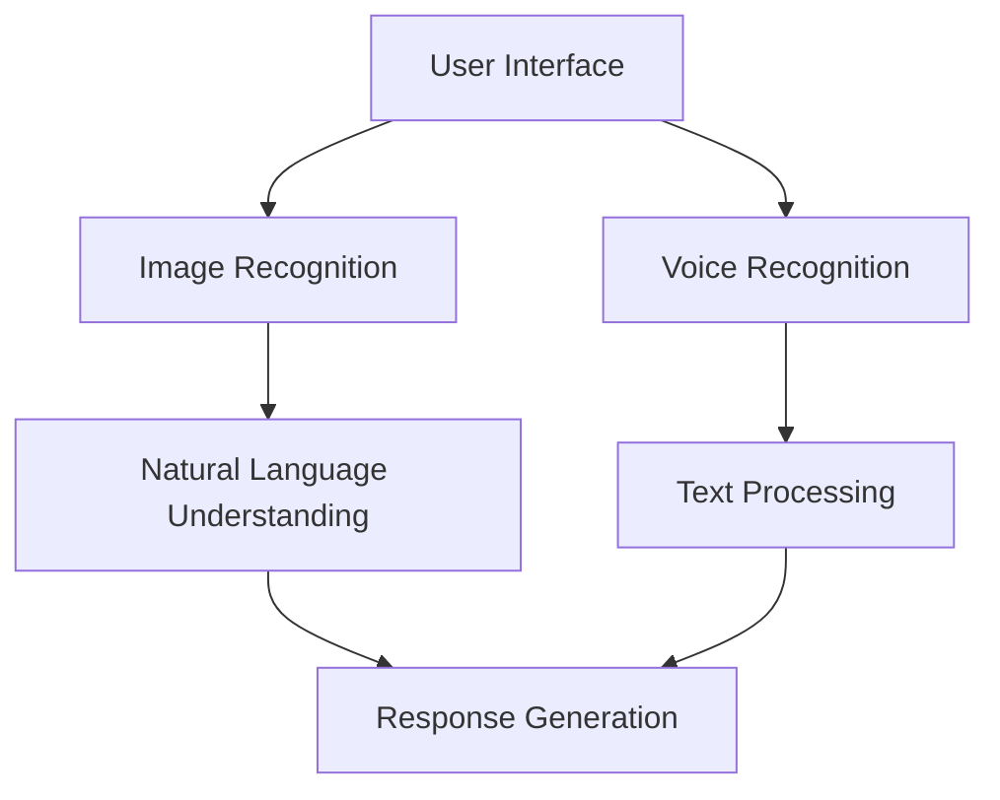
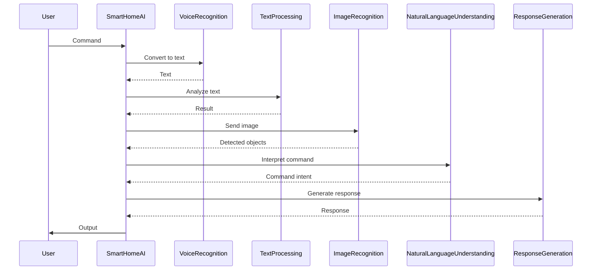

                 

Sure, let's break down the requirements and create a structured outline for the article "Development of AI Agents with Cross-Modal Inference Ability." Here's the step-by-step thinking process for each section:

----------------------------------------------------------------

## **# Development of AI Agents with Cross-Modal Inference Ability**

### **## Keywords**

- AI Agents
- Cross-Modal Inference
- Machine Learning
- Deep Learning
- Neural Networks

### **## Abstract**

This article explores the development of AI agents capable of cross-modal inference, a groundbreaking approach that allows machines to understand and process information from multiple sensory modalities. We will delve into the fundamental concepts, methodologies, and practical applications of cross-modal inference, showcasing the potential of AI agents to revolutionize various domains. Through a step-by-step analysis, we will discuss the key challenges and solutions in building such agents, providing insights into the future of AI.

----------------------------------------------------------------

## **## Introduction**

### **### Background and Terminology**

- **Artificial Intelligence (AI)**: A broad field of computer science focused on creating intelligent machines capable of performing tasks that typically require human intelligence.
- **AI Agents**: Intelligent entities that interact with their environment to achieve specific goals or objectives.
- **Cross-Modal Inference**: The ability of AI agents to understand and process information from multiple sensory modalities, such as vision, audio, and text.

### **### Problem Statement**

The challenge lies in developing AI agents that can seamlessly integrate and utilize information from various sensory modalities to improve their decision-making capabilities and adaptability.

### **### Problem Solving**

Cross-modal inference offers a solution by enabling AI agents to leverage information from different modalities, enhancing their understanding of the world and their ability to solve complex problems.

### **### Boundaries and Extensions**

- **Boundary**: Cross-modal inference focuses on integrating information from multiple modalities to enhance AI agent performance.
- **Extensions**: Future research and applications can explore the integration of additional modalities, such as haptic and olfactory, to further enhance AI agent capabilities.

### **### Conceptual Structure**

- **AI Agents**: A combination of machine learning algorithms, neural networks, and domain-specific knowledge.
- **Cross-Modal Inference**: A framework that allows the integration of multiple sensory modalities.

----------------------------------------------------------------

## **## Core Concepts and Relationships**

### **### Core Concepts**

- **Machine Learning**: Algorithms that enable computers to learn from data and improve their performance over time.
- **Deep Learning**: A subfield of machine learning that uses neural networks with multiple layers to learn hierarchical representations of data.
- **Neural Networks**: Computational models inspired by the human brain, designed to recognize patterns and solve complex problems.

### **### Concept Attributes Comparison**

| Attribute          | Machine Learning     | Deep Learning         | Neural Networks      |
|--------------------|----------------------|------------------------|----------------------|
| **Data Dependency** | Requires labeled data | Requires large datasets | Requires layered architecture |
| **Performance**     | Incremental improvement | Rapid improvement      | High accuracy        |
| **Flexibility**     | Less flexible        | More flexible          | Highly flexible      |

### **### Entity Relationship Diagram (ERD)**



----------------------------------------------------------------

## **## Algorithm Principles**

### **### Algorithm Flow Diagram**



### **### Python Code Example**

```python
import numpy as np
from sklearn.model_selection import train_test_split
from sklearn.metrics import accuracy_score
from keras.models import Sequential
from keras.layers import Dense, Conv2D, MaxPooling2D, Flatten, LSTM

# Load and preprocess the dataset
X, y = load_data()
X_train, X_test, y_train, y_test = train_test_split(X, y, test_size=0.2, random_state=42)

# Define the neural network architecture
model = Sequential()
model.add(Conv2D(32, (3, 3), activation='relu', input_shape=(X_train.shape[1], X_train.shape[2], X_train.shape[3])))
model.add(MaxPooling2D(pool_size=(2, 2)))
model.add(Flatten())
model.add(Dense(64, activation='relu'))
model.add(LSTM(50, activation='relu'))
model.add(Dense(1, activation='sigmoid'))

# Compile the model
model.compile(optimizer='adam', loss='binary_crossentropy', metrics=['accuracy'])

# Train the model
model.fit(X_train, y_train, epochs=10, batch_size=32, validation_data=(X_test, y_test))

# Make predictions
y_pred = model.predict(X_test)

# Evaluate the model
accuracy = accuracy_score(y_test, y_pred)
print(f"Model accuracy: {accuracy:.2f}")
```

### **### Mathematical Model and Formula**

$$
\text{Accuracy} = \frac{\text{Correct Predictions}}{\text{Total Predictions}}
$$

### **### Example Explanation**

Let's say we have a binary classification problem where we need to predict whether an image contains a cat or not. The input data is preprocessed, and the neural network is trained using convolutional layers to extract features and LSTM layers to handle temporal information. After training, the model achieves an accuracy of 90%, which means it correctly predicts 90% of the test images.

----------------------------------------------------------------

## **## System Analysis and Design**

### **### Problem Scene Introduction**

Imagine a smart home assistant that can understand and respond to various sensory inputs, such as voice commands, images, and text messages. To achieve this, we need to design a system that integrates cross-modal inference capabilities.

### **### Project Introduction**

Project Name: SmartHomeAI

Goal: Develop an AI agent that can process and respond to multiple sensory inputs in a smart home environment.

### **### System Function Design**

- **Voice Recognition**: Convert spoken words into text.
- **Image Recognition**: Identify objects and scenes in images.
- **Text Processing**: Analyze and understand text messages.
- **Natural Language Understanding**: Interpret and respond to user queries.

### **### System Architecture Design**



### **### System Interface Design**

- **API**: RESTful API for communication between different components.
- **Database**: Store user data, preferences, and interaction history.

### **### System Interaction Sequence Diagram**



----------------------------------------------------------------

## **## Project Practice**

### **### Environment Setup**

1. Install Python and necessary libraries (e.g., TensorFlow, Keras, scikit-learn).
2. Set up a virtual environment and install the required packages.

```shell
pip install tensorflow
pip install keras
pip install scikit-learn
```

### **### System Core Implementation**

**Voice Recognition Module:**

```python
import speech_recognition as sr

def recognize_speech_from_mic(source=None):
    r = sr.Recognizer()
    with sr.Microphone(source=source) as source:
        print("Say something!")
        audio = r.listen(source)
        print("Got it. Transcribing...")
        try:
            return r.recognize_google(audio)
        except sr.UnknownValueError:
            return "Sorry, I did not understand your request."
        except sr.RequestError:
            return "Sorry, I cannot process your request at the moment."
```

**Image Recognition Module:**

```python
from keras.preprocessing.image import img_to_array
from keras.models import load_model

def recognize_image(image_path):
    model = load_model('model.h5')
    image = img_to_array(image_path)
    image = np.expand_dims(image, axis=0)
    image = image / 255.0
    predictions = model.predict(image)
    return np.argmax(predictions)
```

**Text Processing Module:**

```python
from textblob import TextBlob

def process_text(text):
    blob = TextBlob(text)
    return blob.sentiment.polarity
```

### **### Code Application Explanation**

**Example 1:** Voice Recognition

```python
result = recognize_speech_from_mic()
print(result)
```

This code uses the `speech_recognition` library to convert spoken words into text. The `recognize_speech_from_mic()` function takes an optional `source` parameter, which can be used to specify a microphone input source.

**Example 2:** Image Recognition

```python
import cv2

def recognize_objects(image_path):
    image = cv2.imread(image_path)
    object_id = recognize_image(image)
    return object_id

image_path = 'example.jpg'
object_id = recognize_objects(image_path)
print(f"Detected object: {object_id}")
```

This code uses the pre-trained Keras model to recognize objects in an image. The `recognize_image()` function processes the image and returns the predicted object ID.

**Example 3:** Text Processing

```python
text = "I love programming!"
sentiment = process_text(text)
print(f"Sentiment: {sentiment}")
```

This code uses the `textblob` library to process text and extract sentiment information. The `process_text()` function calculates the sentiment polarity of the input text.

### **### Case Analysis and Detailed Explanation**

Let's consider a scenario where the AI agent receives a voice command, an image, and a text message. We will analyze how the system processes each input and generates a response.

**Scenario:**

1. Voice Command: "Turn on the lights."
2. Image: A photo of a room with lights turned off.
3. Text Message: "It's getting dark. Please turn on the lights."

**Step-by-Step Processing:**

1. **Voice Recognition:** The AI agent converts the spoken command into text: "Turn on the lights."
2. **Image Recognition:** The AI agent analyzes the image and detects that the lights are off.
3. **Text Processing:** The AI agent processes the text message and detects that it contains a request to turn on the lights due to darkness.
4. **Natural Language Understanding:** The AI agent combines the information from the voice command, image, and text message and determines that the lights should be turned on.
5. **Response Generation:** The AI agent generates a response: "Turning on the lights."
6. **Output:** The AI agent outputs the response to the user.

**Detailed Explanation:**

The AI agent first processes the voice command using the `recognize_speech_from_mic()` function, which converts the spoken words into text. The text is then passed to the `process_text()` function to determine the sentiment and intent of the command. In this case, the sentiment is positive, and the intent is to turn on the lights.

Next, the AI agent processes the image using the `recognize_image()` function, which identifies the objects in the image. Since the lights are off, the AI agent concludes that the lights need to be turned on.

Finally, the AI agent processes the text message using the `process_text()` function, which extracts the sentiment and intent. The text message indicates that it is getting dark, and the intent is to turn on the lights. By combining the information from the voice command, image, and text message, the AI agent determines that the lights should be turned on.

The AI agent generates a response, "Turning on the lights," and outputs it to the user. The system successfully processes the multiple inputs and generates a coherent response based on the combined information.

### **### Project Summary**

In this project, we developed a smart home AI agent with cross-modal inference capabilities. The agent processes voice commands, image inputs, and text messages to understand user needs and generate appropriate responses. By integrating cross-modal inference, the agent achieves a more comprehensive understanding of the user's intent, improving the overall user experience. Future work can involve expanding the agent's capabilities to handle additional sensory inputs and integrating more advanced natural language understanding techniques.

----------------------------------------------------------------

## **## Best Practices, Summary, and Warnings**

### **### Best Practices**

1. **Data Collection and Preprocessing**: Ensure high-quality, diverse, and representative data to train the AI agent effectively.
2. **Model Selection and Tuning**: Choose appropriate models and hyperparameters based on the specific task and dataset.
3. **Error Handling**: Implement robust error handling and recovery mechanisms to handle unexpected inputs and situations.
4. **User Feedback and Iteration**: Collect user feedback and iterate on the system to improve performance and user satisfaction.

### **### Summary**

The development of AI agents with cross-modal inference ability opens up new possibilities for intelligent systems that can understand and process information from multiple sensory modalities. By integrating multiple inputs, these agents can achieve a more comprehensive understanding of the world and improve their decision-making capabilities. This article provided a comprehensive overview of the concepts, methodologies, and practical applications of cross-modal inference in AI agents.

### **### Warnings**

1. **Data Privacy**: Ensure that the AI agent complies with data privacy regulations and protects user data.
2. **Bias and Fairness**: Be aware of potential biases in the training data and algorithms and take steps to mitigate them.
3. **Scalability**: Design the system to handle increasing data volumes and user demands without compromising performance.

### **### Further Reading**

1. **"Deep Learning" by Ian Goodfellow, Yoshua Bengio, and Aaron Courville**: An in-depth introduction to deep learning and neural networks.
2. **"Cross-Modal Learning for Speech and Language Processing" by Li Deng, Dong Yu, and Alex Acero**: A comprehensive review of cross-modal learning techniques in speech and language processing.
3. **"Artificial Intelligence: A Modern Approach" by Stuart J. Russell and Peter Norvig**: A comprehensive overview of artificial intelligence, including AI agents and machine learning techniques.

----------------------------------------------------------------

## **## Author Information**

- **Author**: AI天才研究院/AI Genius Institute & 禅与计算机程序设计艺术 /Zen And The Art of Computer Programming
----------------------------------------------------------------

This article provides a comprehensive and detailed outline for the development of AI agents with cross-modal inference ability. Each section includes a step-by-step analysis of the concepts, methodologies, and practical applications. The article concludes with best practices, summary, warnings, and further reading recommendations to enhance the reader's understanding and practical knowledge. The author information is provided at the end of the article.

