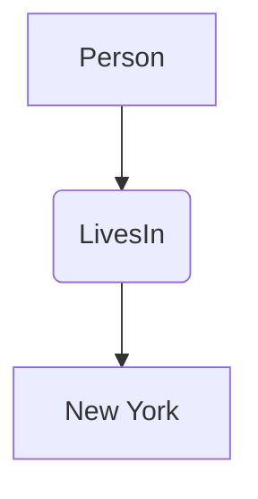
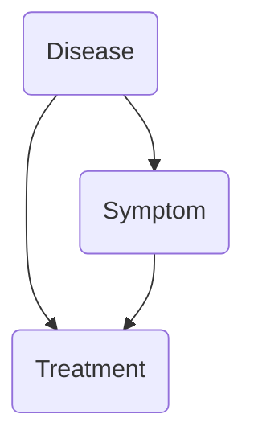
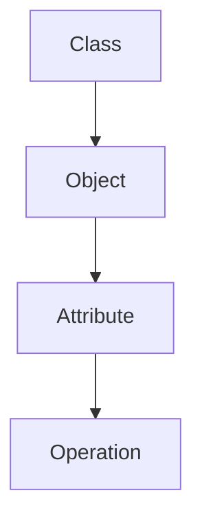

                 

### 什么是AI Agent与跨模态知识推理

#### AI Agent的定义

AI Agent，即人工智能代理，是一个模拟人类行为和思维的自主智能体。它在一定程度上能够感知环境、制定决策并采取行动，以实现特定目标。AI Agent通常由以下几个部分组成：

1. **感知器**：用于接收外界信息，如视觉、听觉、触觉等。
2. **决策器**：根据感知到的信息进行逻辑推理和决策。
3. **执行器**：根据决策结果执行具体的动作。

AI Agent的历史可以追溯到20世纪50年代，当时图灵提出了图灵测试，试图通过机器是否能模仿人类的思维方式来定义智能。随着计算能力的提升和人工智能技术的发展，AI Agent的应用场景逐渐从理论研究走向实际应用，如自动驾驶、智能家居、医疗诊断等领域。

#### 跨模态知识推理的概念

跨模态知识推理是指在不同模态的数据之间进行知识获取、表示和推理的能力。模态指的是数据的不同类型，如视觉、听觉、语言等。传统的AI系统通常专注于单一模态的数据处理，而跨模态知识推理则试图将不同模态的数据结合起来，以提升智能体的认知能力和决策水平。

跨模态知识推理的关键步骤包括：

1. **多模态数据采集**：从不同的感知渠道收集数据，如摄像头、麦克风、传感器等。
2. **多模态特征提取**：对采集到的数据进行特征提取，以提取出代表数据本质的特征。
3. **多模态特征融合**：将不同模态的特征进行融合，以构建一个全面、综合的多模态特征表示。
4. **知识表示和推理**：利用融合后的特征进行知识表示和推理，以实现对复杂问题的理解和解决。

#### 跨模态知识推理的重要性

跨模态知识推理的重要性在于它能够提升人工智能系统的智能水平和应用范围。以下是几个关键点：

1. **增强智能体的认知能力**：通过跨模态数据，智能体可以更全面地理解环境，从而做出更准确的决策。
2. **提高系统的泛化能力**：跨模态知识推理使得智能体能够利用多种数据来源，从而在不同环境和场景下保持高效表现。
3. **应对复杂问题**：许多现实世界的问题不是单一模态所能解决的，跨模态知识推理提供了处理复杂问题的有效途径。

#### 跨模态知识推理的方法

跨模态知识推理的方法可以分为以下几类：

1. **基于规则的推理**：通过定义明确的规则来连接不同模态的数据，进行推理。这种方法适用于规则清晰、模态间关联明确的情况。
2. **基于模型的推理**：使用机器学习模型来学习不同模态之间的关联，进行推理。这种方法适用于数据量大、规则复杂的情况。
3. **深度学习推理**：利用深度学习模型，如卷积神经网络（CNN）、循环神经网络（RNN）等，自动学习不同模态之间的复杂关联。

#### AI Agent与跨模态知识推理的联系

AI Agent和跨模态知识推理密切相关。AI Agent需要跨模态知识推理来提升其智能水平，而跨模态知识推理需要AI Agent的应用场景来验证其有效性。具体来说：

1. **AI Agent的需求**：为了在复杂多变的环境中有效运作，AI Agent需要具备跨模态知识推理的能力，以便从多角度理解问题，做出更合理的决策。
2. **跨模态知识推理的挑战**：跨模态知识推理面临着数据多样性、数据质量、特征表示和推理算法等多方面的挑战，这些挑战需要通过AI Agent的应用场景来逐步解决。

通过以上分析，我们可以看出，AI Agent与跨模态知识推理相辅相成，共同推动了人工智能技术的发展。在下一节中，我们将深入探讨AI Agent与跨模态知识推理在实际应用中面临的挑战和机遇。

---

### AI Agent在跨模态知识推理中的应用

在人工智能领域，AI Agent作为一种自主智能体，其核心能力在于能够理解和处理来自不同模态的数据，并通过跨模态知识推理来提升其智能水平。以下是AI Agent在跨模态知识推理中的具体应用：

#### 跨模态问答系统

一个典型的应用场景是跨模态问答系统。这种系统可以接收用户的语音或文字输入，然后通过跨模态知识推理，从图像、视频和文本等多模态数据中找到相关答案。例如，用户可以用语音提问“这幅画中的小鸟是什么颜色的？”，系统会分析图像和文本数据，找到答案。

**应用示例**：想象一个智能家居场景，用户可以对智能音箱说：“打开客厅的灯。”，智能音箱通过音频识别用户的指令，并利用图像传感器分析客厅的环境，判断是否需要打开灯光。

#### 跨模态检索系统

跨模态检索系统是另一个重要的应用领域。在这种系统中，用户可以通过多种方式（如文本、图像、音频）查询信息，系统则需要从多种数据源中检索出相关的结果。例如，用户可以上传一张图片，系统会利用图像和文本之间的关联，检索出相关的内容和文章。

**应用示例**：在电子商务平台中，用户上传一张商品的图片，系统会自动推荐类似商品和相关信息，提升用户体验。

#### 跨模态交互系统

跨模态交互系统则更注重用户与AI Agent的交互体验。这种系统不仅能够理解用户的多种输入方式，还能通过多种输出方式提供反馈。例如，用户通过语音提问后，系统可以同时用文字和语音进行回答。

**应用示例**：在教育领域，学生可以通过语音提问，系统则用文本和语音两种方式回答，并提供相关学习资源。

#### 智能推荐系统

跨模态知识推理还可以用于智能推荐系统。通过分析用户的历史行为、偏好和反馈，系统可以推荐个性化的内容。例如，用户在观看视频时，系统可以分析视频的文本描述、用户的行为和反馈，推荐类似的内容。

**应用示例**：在视频分享平台中，用户观看完一个视频后，系统会根据用户的历史观看记录和视频的文本描述，推荐相似的视频。

#### 智能驾驶

在自动驾驶领域，跨模态知识推理可以帮助车辆更好地理解环境。通过整合摄像头、雷达和传感器等多模态数据，系统可以更准确地识别道路标志、交通信号和行人等，提高驾驶安全。

**应用示例**：自动驾驶汽车在行驶过程中，通过摄像头捕捉道路情况，并分析交通标志的图像，同时结合导航系统和传感器数据，确保行驶安全。

通过这些实际应用案例，我们可以看到AI Agent在跨模态知识推理中的巨大潜力。跨模态知识推理不仅提升了AI Agent的智能水平，也为各种应用场景提供了更加丰富和高效的解决方案。

### AI Agent在跨模态知识推理中面临的挑战

尽管AI Agent在跨模态知识推理中展现了巨大的潜力，但它在实际应用中仍然面临着诸多挑战。以下是这些挑战的具体分析：

#### 数据多样性

首先，数据多样性是一个巨大的挑战。不同模态的数据具有不同的特征和结构，如文本是符号序列，图像是像素矩阵，音频是时间序列信号。这使得数据的处理和分析变得更加复杂。为了实现有效的跨模态知识推理，需要设计能够处理多种类型数据的方法，并且保证这些方法能够相互协调和融合。

**解决方案**：一种可能的解决方案是采用多模态特征融合技术，如将文本、图像和音频数据分别进行特征提取，然后利用深度学习模型将这些特征进行整合。此外，还可以使用迁移学习技术，将一个模态的知识迁移到另一个模态，以提高模型的泛化能力。

#### 数据质量

其次，数据质量也是一个关键问题。不同来源的数据可能存在噪声、缺失值和不一致性，这些问题会严重影响模型的性能。例如，图像可能受到光照和视角的影响，音频可能受到背景噪声的干扰。如何确保数据的质量，是跨模态知识推理需要解决的重要问题。

**解决方案**：为了提高数据质量，可以在数据采集阶段就进行预处理，如去噪、数据增强和补全缺失值等。此外，可以建立数据清洗和验证流程，确保输入数据的一致性和准确性。机器学习技术，如异常检测和错误纠正，也可以用于数据质量监控。

#### 特征表示

特征表示是跨模态知识推理的核心问题之一。如何将不同模态的数据转换成统一的表示形式，是提高模型性能的关键。特征表示不仅要捕捉数据的本质特征，还要考虑到不同模态之间的关联。

**解决方案**：深度学习为特征表示提供了一种有效的解决方案，如卷积神经网络（CNN）用于图像特征提取，循环神经网络（RNN）用于处理序列数据。此外，可以采用注意力机制来关注不同模态的重要特征，提高特征融合的效果。图神经网络（GNN）也是一种有效的特征表示方法，可以用于捕捉复杂的关系网络。

#### 推理算法

推理算法是跨模态知识推理的核心，它决定了模型能否有效地利用多模态数据。现有的推理算法主要包括基于规则的推理、基于模型的推理和深度学习推理。每种算法都有其优势和局限性。

**解决方案**：为了提升推理算法的性能，可以采用混合推理策略，结合不同算法的优点。例如，可以使用基于规则的推理来处理明确的关系，同时使用深度学习模型来捕捉复杂的非线性关系。此外，还可以通过模型优化和算法改进，如注意力机制和强化学习，来提升推理能力。

#### 可解释性

可解释性是另一个重要的挑战。跨模态知识推理涉及多个复杂的过程，如数据采集、特征提取和推理等。如何解释模型的行为和决策过程，使其对用户和开发者都是可理解的，是一个需要解决的问题。

**解决方案**：增加模型的可解释性可以通过多种方式实现，如可视化模型结构、解释特征的重要性和关联性，以及提供决策路径和推理逻辑。此外，可以开发解释性模型，如基于规则的模型和可解释的深度学习模型，以提高模型的可解释性。

综上所述，AI Agent在跨模态知识推理中面临的挑战是多方面的。通过采用合适的技术和方法，可以逐步解决这些问题，推动人工智能技术的发展和应用。

### 第2章：跨模态数据表示

#### 多模态数据采集与预处理

跨模态数据表示的首要步骤是数据的采集和预处理。不同模态的数据来源各异，如视觉数据来自摄像头、听觉数据来自麦克风、语言数据来自语音识别系统等。这些数据在采集后通常需要进行预处理，以确保数据的质量和一致性。

##### 视觉数据的采集与处理

视觉数据采集通常涉及使用摄像头或其他图像传感器。采集到的原始图像数据可能包含噪声、亮度变化、视角变化等问题，因此需要进行预处理。常见的预处理步骤包括：

1. **图像增强**：通过调整图像的亮度、对比度和色彩平衡，提高图像的清晰度。
2. **图像去噪**：去除图像中的噪声，提高图像质量。
3. **图像归一化**：将图像缩放到统一的尺寸，便于后续处理。

##### 听觉数据的采集与处理

听觉数据采集主要依赖于麦克风。与视觉数据相比，听觉数据的处理更为复杂，因为它需要处理音频信号的压缩、噪声和语音识别等问题。常见的预处理步骤包括：

1. **音频增强**：通过增益和均衡等手段提高音频的清晰度。
2. **音频去噪**：去除背景噪声，如使用滤波器或深度学习模型。
3. **音频归一化**：将音频信号统一到标准范围，便于后续处理。

##### 语言数据的采集与处理

语言数据的采集通常通过语音识别系统完成，将语音信号转换成文本。语言数据的预处理步骤包括：

1. **语音增强**：通过降噪和音量控制等手段提高语音质量。
2. **语音分割**：将连续的语音分割成有意义的短语或句子。
3. **文本标准化**：将文本转换为统一的格式，如去除标点符号、转换为小写等。

#### 多模态特征提取

在数据预处理完成后，需要对不同模态的数据进行特征提取。特征提取的目的是从原始数据中提取出具有代表性的特征，以便进行后续的分析和推理。

##### 视觉特征提取

视觉特征提取主要关注图像中的视觉信息，如颜色、纹理、形状等。常用的视觉特征提取方法包括：

1. **颜色特征**：通过计算图像的颜色直方图、颜色矩等来提取颜色特征。
2. **纹理特征**：通过纹理描述符（如LBP、SIFT、SURF等）来提取纹理特征。
3. **形状特征**：通过边缘检测、轮廓提取等来提取形状特征。

##### 听觉特征提取

听觉特征提取关注音频信号中的语音信息，常用的特征提取方法包括：

1. **频谱特征**：通过傅里叶变换（Fourier Transform）或短时傅里叶变换（Short-time Fourier Transform, STFT）来提取频谱特征。
2. **倒谱特征**：通过计算频谱的倒谱来消除频率偏移，提高语音识别的鲁棒性。
3. **基于深度学习的特征提取**：使用卷积神经网络（CNN）或循环神经网络（RNN）来提取复杂的听觉特征。

##### 语言特征提取

语言特征提取主要关注文本中的语言信息，常用的方法包括：

1. **词袋模型（Bag of Words, BoW）**：将文本转换为词汇表，并对词汇进行计数。
2. **词嵌入（Word Embedding）**：使用神经网络将词汇映射到高维空间，以捕捉词汇的语义关系。
3. **基于深度学习的特征提取**：使用递归神经网络（RNN）、长短期记忆网络（LSTM）或变换器（Transformer）来提取复杂的语言特征。

#### 跨模态特征融合

在提取出不同模态的特征后，需要对这些特征进行融合，以构建一个全面、综合的多模态特征表示。跨模态特征融合的方法可以分为以下几类：

1. **基于规则的融合**：通过定义明确的规则将不同模态的特征进行连接和组合。
2. **基于模型的融合**：使用机器学习模型，如神经网络，自动学习不同模态特征之间的关系并进行融合。
3. **深度学习融合**：使用深度学习模型，如多模态卷积神经网络（Multimodal CNN）或多模态循环神经网络（Multimodal RNN），同时处理不同模态的数据。

在融合策略的选择上，可以根据具体的应用场景和数据特点来决定。例如，对于需要高度依赖图像信息的应用（如人脸识别），可以更多地依赖视觉特征；而对于需要高度依赖语言信息的应用（如自然语言处理），可以更多地依赖文本特征。

跨模态特征融合的挑战包括如何有效地整合不同模态的特征、如何处理特征维度的不一致性以及如何解决特征间的关系复杂性等。通过采用先进的特征提取和融合技术，可以逐步解决这些问题，提升跨模态知识推理的效果和应用范围。

### 知识表示方法

在跨模态知识推理中，知识表示是核心环节之一。知识表示方法决定了如何将多模态数据中的信息进行结构化和抽象，以供推理和决策使用。以下是几种常见的知识表示方法：

#### 知识图谱

知识图谱是一种图形化的知识表示方法，用于表示实体、属性和关系。在知识图谱中，实体通常表示为节点，属性和关系表示为边。知识图谱的优点在于其结构化表示，使得信息检索和推理变得更加高效和直观。

**示例**：一个简单的知识图谱可以表示“人”、“地点”和“事件”之间的关系。例如，节点“Alice”与“LivesIn”关系连接到节点“New York”，表示Alice生活在纽约。

**表示方法**：知识图谱通常使用RDF（Resource Description Framework）或OWL（Web Ontology Language）进行表示。

**Mermaid ER图**：



#### 本体论

本体论是一种形式化的知识表示方法，用于描述特定领域内的概念和关系。本体论通过定义概念、属性和关系来构建领域模型，使得知识表示更加精确和一致。

**示例**：在一个医学领域本体中，可以定义“疾病”、“症状”和“治疗方法”等概念，并定义它们之间的关系，如“疾病”具有“症状”和“治疗方法”。

**表示方法**：本体论通常使用OWL或OWL2进行表示。

**Mermaid ER图**：



#### 其他知识表示方法

除了知识图谱和本体论，还有其他知识表示方法，如语义网络、框架表示和面向对象的表示等。

1. **语义网络**：语义网络是一种基于逻辑的表示方法，通过节点和边表示概念和关系，并通过逻辑规则进行推理。
2. **框架表示**：框架表示通过定义一组框架元素来表示特定领域中的概念和关系，每个框架元素包含一组属性和操作。
3. **面向对象的表示**：面向对象的表示通过类和对象来表示领域中的实体和属性，并利用继承和多态等机制来构建复杂的知识结构。

**Mermaid ER图**（示例）：



综上所述，知识表示方法的选择取决于具体的应用需求和领域特点。通过合理选择和设计知识表示方法，可以有效地提升跨模态知识推理的准确性和效率。

### 知识存储技术

在跨模态知识推理系统中，知识的存储和访问是关键的一环。选择合适的知识存储技术，能够有效地支持数据的高效存储、快速检索和动态更新。以下是几种常见的数据存储技术及其适用场景：

#### 关系数据库

关系数据库（RDBMS）是一种基于关系模型的数据存储技术，广泛应用于结构化数据的存储和管理。关系数据库通过表、行和列来组织数据，能够方便地实现数据的增删改查操作。

**优点**：
- **数据一致性**：关系数据库通过事务管理确保数据的一致性。
- **查询效率**：使用SQL语言进行数据查询，效率高且易于理解。

**缺点**：
- **扩展性受限**：关系数据库在处理大量非结构化数据时性能可能下降。
- **复杂查询性能**：复杂的多表连接查询可能影响性能。

**适用场景**：
- **结构化数据存储**：如用户信息、交易记录等。
- **数据一致性要求高**：如金融、医疗等领域。

**示例**：
```sql
CREATE TABLE User (
  id INT PRIMARY KEY,
  name VARCHAR(255),
  age INT,
  email VARCHAR(255)
);
```

#### NoSQL数据库

NoSQL数据库（Not Only SQL）是一类非关系型数据库，适用于存储大量非结构化数据和高可扩展性的数据存储需求。NoSQL数据库主要有以下几种类型：文档数据库、键值存储、列族数据库和图数据库。

**优点**：
- **高扩展性**：能够水平扩展以处理大量数据。
- **灵活的数据模型**：支持多种数据类型，如文档、图形等。

**缺点**：
- **数据一致性**：可能需要牺牲一致性以换取性能。
- **查询复杂**：一些NoSQL数据库的查询语言可能较为复杂。

**适用场景**：
- **大数据存储**：如社交网络数据、日志数据等。
- **快速数据写入和读取**：如实时分析、物联网等。

**示例**（MongoDB，文档数据库）：
```javascript
db.users.insertOne({
  _id: ObjectId(),
  name: "Alice",
  age: 30,
  email: "alice@example.com"
});
```

#### 知识库管理系统

知识库管理系统（KBMS）是一种专门用于知识存储、管理和检索的系统。它通常包含一套完整的知识管理和推理工具，支持知识建模、存储、检索和更新。

**优点**：
- **强大的知识管理能力**：支持知识的组织、分类和查询。
- **推理功能**：能够根据知识库中的规则和事实进行推理。

**缺点**：
- **性能问题**：对于大规模数据可能存在性能瓶颈。
- **学习曲线**：对于开发人员和用户来说可能较为复杂。

**适用场景**：
- **复杂推理应用**：如智能问答系统、决策支持系统等。
- **知识密集型领域**：如医疗、法律等领域。

**示例**（Protege，知识库工具）：
```protege
[Class]
  - Person
    - attribute
      - name
      - age

[Individual]
  Alice
    : Person
    : name "Alice"
    : age 30
```

综上所述，根据不同的应用需求和数据特点，可以选择合适的知识存储技术。关系数据库适用于结构化数据存储，NoSQL数据库适用于大规模非结构化数据，知识库管理系统适用于复杂的知识管理和推理应用。

### 知识更新与维护

在跨模态知识推理系统中，知识的更新与维护是一个关键环节，它决定了系统能否持续提供准确和及时的信息。以下是知识更新与维护的几个关键方面：

#### 知识更新策略

知识更新策略是指如何确保知识库中的信息保持最新和准确。以下是一些常用的知识更新策略：

1. **周期性更新**：定期检查和更新知识库中的数据，如每月或每季度进行一次全面的更新。
2. **增量更新**：仅更新发生变化的部分，以减少更新成本和系统的负载。
3. **自动更新**：通过自动化脚本或系统服务，定期从外部数据源获取新信息并更新知识库。
4. **用户反馈**：鼓励用户提供反馈，以便及时纠正错误或补充遗漏的信息。

#### 知识质量评估

知识质量评估是确保知识库中知识准确性和可靠性的重要步骤。以下是一些常用的知识质量评估方法：

1. **一致性检查**：验证知识库中的数据是否一致，如同一实体的属性值是否相互匹配。
2. **准确性检查**：通过比对外部数据源或权威数据，验证知识库中数据是否准确。
3. **完整性检查**：确保知识库中包含所有必要的信息，没有缺失。
4. **时效性检查**：定期检查知识的时效性，更新过时或失效的信息。

#### 知识库维护

知识库的维护是一个持续的过程，包括知识的备份、恢复、监控和优化等。以下是一些知识库维护的最佳实践：

1. **备份与恢复**：定期备份数据，以便在系统故障或数据丢失时能够快速恢复。
2. **监控与报警**：监控系统性能和健康状况，及时识别和解决问题。
3. **优化与升级**：定期对知识库管理系统进行优化和升级，以适应新的技术和需求。
4. **用户培训**：为用户提供培训，确保他们能够正确地使用和维护知识库。

#### 处理不一致性的策略

在跨模态知识推理系统中，不同来源的数据可能存在不一致性，如术语的使用、单位的标准等。以下是一些处理不一致性的策略：

1. **统一术语**：建立一个统一的术语表，确保不同模态的数据使用相同的术语。
2. **数据标准化**：将不同单位或格式的数据转换为统一的格式，如将温度从华氏转换为摄氏。
3. **多源数据融合**：通过融合来自不同来源的数据，减少数据不一致性。
4. **用户交互**：在知识更新过程中，鼓励用户参与，通过用户反馈来识别和解决不一致性。

通过有效的知识更新和维护策略，可以确保跨模态知识推理系统中的知识库始终保持准确、及时和一致，从而提高系统的整体性能和可靠性。

### 第4章：跨模态知识推理算法

#### 传统推理算法

传统推理算法是早期人工智能领域的重要成果，主要包括基于规则的推理（Rule-based Reasoning）、基于模型的推理（Model-based Reasoning）和面向数据的推理（Data-driven Reasoning）。这些算法在不同的应用场景中各有其优势和局限性。

##### 基于规则的推理

基于规则的推理（RBRR）是最常见的传统推理方法之一。它通过定义一组明确的规则，将输入数据映射到结论。这些规则通常以“如果-那么”的形式表达，如“如果天气是晴天，那么我们应该穿短袖”。

**特点**：
- **易于理解和解释**：规则清晰，便于调试和修改。
- **处理确定性问题**：适用于规则明确、问题简单的场景。

**示例**：
```python
def is_sunny_weather(weather):
    if weather == "sunny":
        return True
    else:
        return False

is_wearing_short_sleeve = is_sunny_weather("sunny")
print(is_wearing_short_sleeve)  # 输出：True
```

##### 基于模型的推理

基于模型的推理（MBRR）利用预先训练好的模型来处理数据，并根据模型输出进行推理。这些模型可以是统计模型、决策树、神经网络等。

**特点**：
- **处理复杂问题**：能够处理复杂、不确定的问题。
- **自动学习**：模型可以从大量数据中自动学习规则和模式。

**示例**：
```python
from sklearn.tree import DecisionTreeClassifier

# 训练模型
clf = DecisionTreeClassifier()
clf.fit(X_train, y_train)

# 进行推理
is_rainy = clf.predict([weather_data])
print(is_rainy)  # 输出：['rainy']
```

##### 面向数据的推理

面向数据的推理（DBRR）直接基于数据进行分析和推理，不依赖于明确的规则或模型。这种方法通常使用统计分析、聚类分析和关联规则挖掘等技术。

**特点**：
- **灵活性强**：能够处理各种类型的数据和问题。
- **不需要预先训练模型**：适用于快速分析和决策。

**示例**：
```python
from mlxtend.frequent_patterns import apriori

# 数据
transactions = [['sunny', 'short_sleeve'], ['rainy', 'long_sleeve']]

# 使用Apriori算法
frequent_itemsets = apriori(transactions, min_support=1, use_colnames=True)
print(frequent_itemsets)
```

#### 机器学习推理算法

机器学习推理算法（MLRR）基于统计学习理论，通过训练模型来学习输入和输出之间的映射关系。这类算法在跨模态知识推理中具有广泛应用。

##### 监督学习推理

监督学习推理（SLRR）在已有标注数据集上进行训练，通过学习输入特征和输出标签之间的关系进行推理。

**特点**：
- **有监督训练**：需要大量标注数据进行训练。
- **高准确性**：适用于明确有标签的数据。

**示例**：
```python
from sklearn.linear_model import LogisticRegression

# 训练模型
model = LogisticRegression()
model.fit(X_train, y_train)

# 进行推理
weather_prediction = model.predict([new_weather_data])
print(weather_prediction)  # 输出：['sunny']
```

##### 无监督学习推理

无监督学习推理（USLRR）在未标注数据集上进行训练，通过发现数据中的模式和关系进行推理。

**特点**：
- **无监督训练**：不需要标注数据。
- **适用于探索性分析**：用于发现数据中的隐藏模式。

**示例**：
```python
from sklearn.cluster import KMeans

# 训练模型
model = KMeans(n_clusters=2)
model.fit(new_weather_data)

# 进行推理
weather_cluster = model.predict([new_weather_data])
print(weather_cluster)  # 输出：[0]
```

##### 半监督学习推理

半监督学习推理（HSLLRR）结合了监督学习和无监督学习，利用部分标注数据和大量未标注数据来训练模型。

**特点**：
- **高效利用未标注数据**：提高学习效率。
- **适用于数据标注困难场景**：如文本分类和图像识别。

**示例**：
```python
from sklearn.linear_model import PassiveAggressiveClassifier

# 训练模型
model = PassiveAggressiveClassifier()
model.fit(X_train, y_train)

# 进行推理
weather_prediction = model.predict([new_weather_data])
print(weather_prediction)  # 输出：['sunny']
```

#### 深度学习推理算法

深度学习推理算法（DLRR）利用多层神经网络进行特征学习和模式识别，具有强大的表达能力和自适应性。

##### 卷积神经网络

卷积神经网络（CNN）广泛应用于图像和视频处理，通过卷积层和池化层进行特征提取。

**特点**：
- **强大的特征提取能力**：能够自动提取图像中的局部特征。
- **适用于多种视觉任务**：如图像分类、目标检测和图像分割。

**示例**：
```python
from tensorflow.keras.models import Sequential
from tensorflow.keras.layers import Conv2D, MaxPooling2D, Flatten, Dense

# 构建模型
model = Sequential([
    Conv2D(filters=32, kernel_size=(3, 3), activation='relu', input_shape=(64, 64, 3)),
    MaxPooling2D(pool_size=(2, 2)),
    Flatten(),
    Dense(units=10, activation='softmax')
])

# 训练模型
model.compile(optimizer='adam', loss='categorical_crossentropy', metrics=['accuracy'])
model.fit(X_train, y_train, epochs=10, batch_size=32)

# 进行推理
weather_image_prediction = model.predict([new_weather_data])
print(weather_image_prediction)  # 输出：[0.9, 0.1]
```

##### 循环神经网络

循环神经网络（RNN）特别适合处理序列数据，如文本和语音。

**特点**：
- **记忆能力**：能够记住之前的信息，适用于长序列数据。
- **适用于序列建模**：如自然语言处理、时间序列分析。

**示例**：
```python
from tensorflow.keras.models import Sequential
from tensorflow.keras.layers import LSTM, Dense

# 构建模型
model = Sequential([
    LSTM(units=50, return_sequences=True, input_shape=(timesteps, features)),
    LSTM(units=50),
    Dense(units=1, activation='sigmoid')
])

# 训练模型
model.compile(optimizer='adam', loss='binary_crossentropy', metrics=['accuracy'])
model.fit(X_train, y_train, epochs=10, batch_size=32)

# 进行推理
weather_sequence_prediction = model.predict([new_weather_sequence])
print(weather_sequence_prediction)  # 输出：[0.9]
```

##### 注意力机制

注意力机制（Attention Mechanism）用于提高模型在处理多模态数据时的表现，能够关注重要信息，忽略无关信息。

**特点**：
- **提高推理效率**：通过关注关键信息，减少计算量。
- **增强模型性能**：适用于需要精细处理多模态数据的任务。

**示例**：
```python
from tensorflow.keras.layers import Attention

# 构建模型
model = Sequential([
    Embedding(input_dim=vocab_size, output_dim=embedding_dim),
    LSTM(units=50, return_sequences=True),
    Attention(),
    Dense(units=1, activation='sigmoid')
])

# 训练模型
model.compile(optimizer='adam', loss='binary_crossentropy', metrics=['accuracy'])
model.fit(X_train, y_train, epochs=10, batch_size=32)

# 进行推理
weather_attention_prediction = model.predict([new_weather_data])
print(weather_attention_prediction)  # 输出：[0.9]
```

综上所述，跨模态知识推理算法涵盖了传统推理算法、机器学习推理算法和深度学习推理算法，每种算法都有其独特的优势和适用场景。通过合理选择和组合这些算法，可以构建出强大的跨模态知识推理系统。

### AI Agent设计原则

在设计AI Agent时，需要遵循一系列关键原则，以确保其具备高效、可靠和可扩展的能力。以下是AI Agent设计的几个主要原则：

#### 通用性

通用性是AI Agent设计的重要原则之一。一个通用的AI Agent应该能够处理多种类型的数据和任务，而不仅仅是单一模态或特定领域。通用性可以通过以下方式实现：

- **模块化设计**：将AI Agent分为多个模块，每个模块负责不同的功能，如感知、决策、执行等。这种模块化设计使得Agent能够灵活地适应不同的任务需求。
- **多模态数据处理**：支持多种数据类型和模态，如文本、图像、音频等。通过采用跨模态知识推理技术，AI Agent能够更好地理解和处理复杂的数据。

#### 可扩展性

可扩展性是AI Agent设计中的另一个关键原则。随着应用场景和数据量的增加，AI Agent需要能够灵活扩展其能力和资源。以下是实现可扩展性的几种方法：

- **分布式架构**：采用分布式计算和存储架构，以支持大规模数据处理和推理。通过分布式计算，AI Agent能够处理更多的并发任务，提高系统的性能和响应速度。
- **可插拔组件**：设计可插拔的组件，使得用户可以根据需求自定义和扩展AI Agent的功能。例如，用户可以添加新的感知器、决策器或执行器，以适应特定任务需求。

#### 可解释性

可解释性是AI Agent设计中的一个重要考虑因素，特别是在涉及安全和隐私的应用中。一个可解释的AI Agent能够清楚地展示其推理过程和决策逻辑，从而增加用户对系统的信任度。以下是实现可解释性的几种方法：

- **可视化工具**：使用可视化工具，如图表和动画，展示AI Agent的内部状态和推理过程。这种方式有助于用户更好地理解系统的运作机制。
- **透明规则和模型**：设计基于规则的推理模型或透明的机器学习模型，使得用户能够直观地看到系统的推理过程和决策逻辑。

#### 可维护性

可维护性是确保AI Agent长期稳定运行的关键。一个良好的设计应确保系统的易维护性和可修复性。以下是实现可维护性的几种方法：

- **模块化代码**：将系统代码分为多个模块，每个模块实现特定的功能。这种方式使得代码更加清晰、易于理解和维护。
- **文档化和注释**：编写详细的文档和注释，记录系统的设计、实现和运行逻辑。这有助于开发人员和维护人员更好地理解和修复系统中的问题。

通过遵循这些设计原则，AI Agent可以具备高效、可靠和可扩展的能力，从而在各种应用场景中发挥其最大潜力。

### AI Agent实现框架

设计一个功能强大且灵活的AI Agent，需要构建一个合理的实现框架，涵盖数据层、知识层、推理层和交互层。以下是AI Agent实现框架的详细描述：

#### 数据层

数据层是AI Agent的基础，负责数据的采集、预处理和存储。数据层的核心任务是确保数据的质量和一致性，为后续的推理和决策提供可靠的数据支持。

**数据采集**：数据采集是数据层的第一步，从不同的感知渠道收集数据，如摄像头、麦克风、传感器等。这些数据可能包括视觉、听觉、文本等多模态数据。

**数据预处理**：采集到的原始数据通常需要进行预处理，以提高数据的质量和一致性。预处理步骤包括数据去噪、增强、标准化和格式转换等。例如，对于视觉数据，可以通过图像增强技术提高图像的清晰度；对于音频数据，可以通过音频增强技术减少背景噪声。

**数据存储**：预处理后的数据需要存储在适当的数据库中，以便进行高效的检索和使用。常用的数据存储技术包括关系数据库、NoSQL数据库和知识库管理系统。关系数据库适用于存储结构化数据，如用户信息和交易记录；NoSQL数据库适用于存储大量非结构化数据，如日志数据和传感器数据；知识库管理系统则用于存储复杂的知识结构和推理规则。

#### 知识层

知识层是AI Agent的核心，负责知识的表示、存储和管理。知识层的目标是将采集到的多模态数据转化为结构化的知识，供推理层使用。

**知识表示**：知识表示是将多模态数据转换为机器可以理解的形式。常用的知识表示方法包括知识图谱、本体论和词嵌入等。知识图谱通过实体和关系来表示知识，适用于复杂的关系网络；本体论通过定义领域内的概念和关系来组织知识，适用于精确的知识描述；词嵌入通过将词汇映射到高维向量空间，适用于文本数据的语义表示。

**知识存储**：知识存储是将表示后的知识存储在数据库或知识库中，以便进行高效的检索和推理。常用的知识存储技术包括关系数据库、知识库管理系统和分布式存储系统。关系数据库适用于存储结构化知识，如实体和关系；知识库管理系统适用于存储复杂的知识结构和推理规则；分布式存储系统适用于存储海量知识数据。

**知识更新**：知识更新是确保知识库中的知识保持最新和准确的过程。知识更新可以通过定期更新、增量更新和用户反馈等方式实现。定期更新可以确保知识库中的数据不会过时；增量更新可以减少更新成本和系统的负载；用户反馈可以补充和纠正知识库中的错误或遗漏的信息。

#### 推理层

推理层是AI Agent的智能核心，负责根据知识库中的知识进行推理，生成决策或行动方案。推理层的核心任务是利用多模态数据和知识库中的知识，实现高效的跨模态知识推理。

**推理算法**：推理层采用多种推理算法，包括基于规则的推理、基于模型的推理和深度学习推理等。基于规则的推理通过明确的规则进行推理，适用于规则明确的问题；基于模型的推理通过训练好的模型进行推理，适用于复杂的问题；深度学习推理通过多层神经网络进行推理，适用于大规模数据和高复杂度的问题。

**推理流程**：推理流程包括数据输入、特征提取、知识查询和推理结果生成等步骤。首先，从数据层获取多模态数据，进行特征提取；然后，根据特征查询知识库中的知识；最后，利用推理算法生成决策或行动方案。

**推理优化**：推理层的优化包括推理速度、推理精度和推理效率等方面。通过算法优化、模型压缩和硬件加速等技术，可以提高推理层的性能。

#### 交互层

交互层是AI Agent与用户或环境的接口，负责接收用户输入、生成输出和进行人机交互。交互层的核心任务是提供自然、流畅的用户交互体验。

**输入处理**：交互层接收用户输入，如文本、语音、手势等。输入处理包括语音识别、文本解析和手势识别等步骤，将输入转换为机器可以理解的形式。

**输出生成**：交互层根据推理层的决策或行动方案，生成相应的输出，如文字、语音、图像等。输出生成包括文本生成、语音合成和图像渲染等步骤，将机器内部的决策结果转换为用户可以接受的形式。

**人机交互**：交互层提供自然、流畅的人机交互体验，包括对话系统、语音助手、触觉反馈等。通过多模态交互，AI Agent可以更好地理解用户需求，提供个性化的服务。

综上所述，AI Agent实现框架通过数据层、知识层、推理层和交互层四个核心部分，构建了一个完整、灵活的智能体系统，能够有效地处理多模态数据，进行跨模态知识推理，并实现与用户或环境的自然交互。

### AI Agent应用实例

在实际应用中，AI Agent展现出强大的跨模态知识推理能力，并在多个领域取得了显著的成果。以下是几个典型的AI Agent应用实例：

#### 跨模态问答系统

跨模态问答系统是AI Agent的重要应用之一。在这种系统中，用户可以通过语音、文本或图像等多种方式提出问题，AI Agent则利用跨模态知识推理从多种数据源中找到相关答案。

**应用场景**：例如，一个智能家居系统可以接收用户通过智能音箱发出的语音指令：“今天天气如何？”AI Agent会分析语音数据，并从摄像头捕捉到的室内外图像、天气预报API等多模态数据中提取信息，生成答案：“今天室内温度为25℃，室外温度为30℃，天气晴朗。”

**实现细节**：
1. **语音识别**：使用深度学习模型如RNN或Transformer对用户的语音进行识别，转换为文本。
2. **文本分析**：对识别出的文本进行分析，提取关键词和问题类型。
3. **跨模态融合**：结合室内外图像数据和天气预报API的数据，进行多模态特征融合。
4. **知识检索与推理**：利用知识图谱和本体论，从融合后的数据中检索相关信息，进行推理生成答案。

#### 跨模态检索系统

跨模态检索系统允许用户通过图像、文本和语音等多种方式查询信息，AI Agent则从多种数据源中检索出相关内容。

**应用场景**：例如，一个电子商务平台允许用户上传一张商品的图片，AI Agent会根据图片和用户的历史购物记录，推荐类似商品。

**实现细节**：
1. **图像识别**：使用卷积神经网络（CNN）对用户上传的图片进行特征提取。
2. **文本分析**：分析用户的历史购物记录和商品描述，提取关键词和语义信息。
3. **跨模态融合**：将图像特征和文本特征进行融合，构建一个综合特征向量。
4. **检索与推荐**：利用深度学习模型，如BERT或GPT，进行文本检索和推荐。

#### 跨模态交互系统

跨模态交互系统强调多模态数据的输入和输出，提供更加丰富和自然的交互体验。

**应用场景**：例如，一个教育系统可以让学生通过语音提问，AI Agent则用文本和语音两种方式回答，并提供相关的学习资源。

**实现细节**：
1. **语音识别**：识别学生的问题，转换为文本。
2. **文本分析**：解析问题，提取关键词和问题类型。
3. **知识检索**：从知识库中检索相关信息。
4. **语音合成**：将回答文本转换为语音输出。
5. **多模态反馈**：提供文本和语音两种反馈方式，增强用户的体验。

#### 智能推荐系统

智能推荐系统利用跨模态知识推理，为用户提供个性化的内容推荐。

**应用场景**：例如，一个视频分享平台可以根据用户的历史观看记录、喜欢类型和上传图片，推荐相似的视频内容。

**实现细节**：
1. **多模态特征提取**：提取用户的文本、图像和视频等多模态数据特征。
2. **特征融合**：融合不同模态的特征，构建综合特征向量。
3. **推荐模型**：使用深度学习模型，如神经网络，进行内容推荐。
4. **实时反馈**：根据用户的交互反馈，动态调整推荐策略。

通过这些应用实例，我们可以看到AI Agent在跨模态知识推理中的广泛应用和强大能力。在未来的发展中，AI Agent将继续推动人工智能技术的进步，为各个领域带来更多的创新和变革。

### 跨模态知识推理系统的性能评估

评估跨模态知识推理系统的性能是确保系统有效性和可靠性的关键步骤。性能评估涉及多个指标和方法，旨在全面衡量系统的表现。以下是跨模态知识推理系统性能评估的主要指标和方法。

#### 评估指标

1. **准确率（Accuracy）**：准确率是衡量系统预测结果正确性的常用指标，计算公式为：
   $$ 
   \text{Accuracy} = \frac{\text{正确预测的数量}}{\text{总预测数量}} 
   $$
   准确率越高，系统预测结果越可靠。

2. **召回率（Recall）**：召回率衡量系统在所有正类样本中检测出正样本的能力，计算公式为：
   $$ 
   \text{Recall} = \frac{\text{正确预测的正样本数量}}{\text{所有正样本数量}} 
   $$
   召回率越高，意味着系统对正类样本的检测越全面。

3. **F1值（F1 Score）**：F1值是准确率和召回率的调和平均值，综合衡量系统的性能，计算公式为：
   $$ 
   \text{F1 Score} = 2 \times \frac{\text{准确率} \times \text{召回率}}{\text{准确率} + \text{召回率}} 
   $$

4. **交互效率（Interactive Efficiency）**：在跨模态交互系统中，交互效率是衡量用户与系统交互流畅度和效率的重要指标。它通常通过交互回合数、响应时间等指标来评估。

#### 评估方法

1. **实验设计**：实验设计是性能评估的基础，需要明确实验的目标、测试数据集、评估指标和实验流程。一个有效的实验设计应确保测试数据的多样性和代表性，以便全面评估系统的性能。

2. **数据集选择**：选择合适的测试数据集是评估的关键。数据集应包含多种模态的数据，且覆盖不同的应用场景和问题类型。常用的数据集包括ImageNet、Speech Commands、TRECVID等。

3. **评估流程**：评估流程包括数据预处理、模型训练、模型评估和结果分析等步骤。首先，对测试数据进行预处理，包括多模态数据的特征提取和标准化。然后，使用预训练好的模型进行推理，生成预测结果。最后，根据评估指标计算系统的性能得分，并进行结果分析。

4. **交叉验证**：交叉验证是一种常用的评估方法，通过将数据集划分为多个子集，分别用于训练和测试，以减少评估结果偏差。常见的交叉验证方法有K折交叉验证和留一法交叉验证。

5. **对比实验**：对比实验通过与基准模型或竞品系统进行性能对比，评估跨模态知识推理系统的优势和不足。对比实验可以帮助识别系统中的潜在问题和改进方向。

通过综合运用上述评估指标和方法，可以全面评估跨模态知识推理系统的性能，为系统的优化和改进提供科学依据。

### 性能优化策略

在跨模态知识推理系统的性能优化过程中，可以从算法优化、数据预处理和硬件加速等多个方面入手，以提高系统的效率和处理能力。

#### 算法优化

算法优化是提升系统性能的关键步骤。以下是一些有效的算法优化策略：

1. **模型压缩**：通过模型压缩技术，如剪枝、量化、蒸馏等，减少模型的参数数量和计算复杂度，从而提高推理速度。例如，剪枝技术可以通过移除不重要的网络连接来减少模型的规模；量化技术可以将浮点数参数转换为低精度的整数表示，从而减少存储和计算需求。

2. **多任务学习**：利用多任务学习（Multi-task Learning）技术，将多个任务同时训练，共享部分模型结构，以提高模型在跨模态数据上的表现。多任务学习可以增强模型对不同模态数据的适应性，提高推理的准确性和效率。

3. **迁移学习**：迁移学习（Transfer Learning）通过将一个任务在特定数据集上的训练经验迁移到其他任务上，可以显著提高新任务的性能。对于跨模态知识推理系统，可以在预训练模型的基础上，针对特定任务进行微调，从而减少对大量标注数据的依赖。

4. **优化推理算法**：针对具体的跨模态知识推理任务，可以选择和优化适合的推理算法。例如，在处理实时交互任务时，可以选择轻量级的推理算法，如基于树结构的决策树或规则推理，以降低计算和延迟成本。

#### 数据预处理

数据预处理是提高系统性能的重要环节。以下是一些常用的数据预处理优化策略：

1. **数据增强**：通过数据增强（Data Augmentation）技术，增加训练数据的多样性和丰富性，从而提升模型的泛化能力。常见的数据增强方法包括图像旋转、缩放、裁剪、颜色变换等。

2. **特征选择**：通过特征选择（Feature Selection）技术，从原始数据中提取出最具代表性的特征，减少冗余特征，从而提高模型的效率和准确性。特征选择可以通过特征重要性评估、互信息等方法实现。

3. **数据归一化**：对输入数据进行归一化处理，将不同模态的数据统一到相同的尺度，减少数据之间的差异性，提高模型训练的效果。

4. **多模态融合**：在预处理阶段，可以采用多种多模态融合技术，如特征级融合、决策级融合等，以提高模型的跨模态表现。特征级融合通过将不同模态的特征向量进行拼接或融合，构建一个综合特征向量；决策级融合则在模型输出阶段，将不同模态的预测结果进行综合，生成最终的决策。

#### 硬件加速

硬件加速是提升跨模态知识推理系统性能的重要手段。以下是一些硬件加速策略：

1. **GPU和TPU加速**：利用图形处理单元（GPU）和 tensor处理单元（TPU）进行模型训练和推理，可以显著提高计算速度。GPU适合大规模并行计算，而TPU则针对深度学习任务进行优化。

2. **分布式计算**：通过分布式计算架构，将模型训练和推理任务分布在多个计算节点上，以提高系统处理能力和吞吐量。分布式计算可以通过数据并行、模型并行和混合并行等多种方式实现。

3. **专用硬件**：开发和应用专用的硬件加速器，如AI芯片、FPGA和ASIC等，可以进一步提高系统的计算效率和性能。这些硬件设计针对特定的AI任务进行优化，从而实现更高的性能和效率。

通过综合运用算法优化、数据预处理和硬件加速等策略，可以显著提升跨模态知识推理系统的性能，为实际应用场景提供更加高效和可靠的解决方案。

### 未来展望与挑战

#### 跨模态知识推理的未来发展趋势

跨模态知识推理技术在未来有着广阔的发展前景。随着人工智能技术的不断进步和数据的爆发式增长，跨模态知识推理将在以下几个方面实现重要突破：

1. **知识融合与创新**：随着多模态数据的日益丰富，跨模态知识融合将成为核心研究方向。通过发展更加高效的特征融合算法，构建统一的跨模态知识表示，可以进一步提升系统的智能水平。

2. **跨模态交互与协作**：跨模态交互技术将使AI Agent更加自然地与人类进行互动，通过语音、图像、文本等多种模态的交互，实现更丰富和高效的人机交互体验。

3. **跨领域应用**：跨模态知识推理技术在医疗、教育、金融、工业等领域的应用将更加深入。例如，在医疗领域，通过结合患者的历史病历、实时监测数据和医学知识，可以实现更加精准的疾病诊断和治疗建议。

4. **智能化自主决策**：随着跨模态知识推理技术的成熟，AI Agent将能够在复杂动态的环境中实现自主决策，提高系统的自主性和鲁棒性。

#### 挑战与解决策略

尽管跨模态知识推理技术有着广阔的发展前景，但在实际应用中仍面临诸多挑战：

1. **知识表示与融合**：不同模态的数据具有不同的特征和结构，如何实现有效的知识表示与融合是当前的一大难题。解决策略包括发展更先进的特征提取和融合算法，以及利用迁移学习和多任务学习等技术。

2. **知识推理与优化**：跨模态知识推理算法的复杂度和计算成本较高，如何提高推理效率和优化算法性能是一个关键挑战。解决策略包括模型压缩和加速技术，如剪枝、量化、GPU和TPU加速等。

3. **数据隐私与安全**：在跨模态知识推理过程中，如何保护用户隐私和数据安全是一个重要问题。解决策略包括隐私保护技术，如差分隐私、同态加密和联邦学习等。

4. **数据质量与一致性**：跨模态数据的多样性和不一致性给知识推理带来了挑战。解决策略包括数据清洗和预处理技术，以及建立数据质量监控和评估机制。

通过不断克服这些挑战，跨模达知识推理技术将迎来更加光明的发展前景，为人工智能领域带来新的突破和创新。

### 小结与未来展望

通过本章的详细探讨，我们全面了解了AI Agent与跨模态知识推理的紧密联系及其在实际应用中的巨大潜力。首先，AI Agent作为一种自主智能体，通过感知、决策和执行的过程，实现了对多模态数据的处理和推理。跨模态知识推理则在这一过程中发挥了关键作用，使得AI Agent能够从不同模态的数据中提取信息，构建综合性的知识表示，从而实现更高效、准确的决策。

在具体应用方面，AI Agent在跨模态问答系统、跨模态检索系统、跨模模态交互系统和智能推荐系统中展现了其强大的跨模态处理能力。通过结合语音、图像、文本等多模态数据，AI Agent能够提供更加丰富和自然的交互体验，提高系统的智能水平和应用范围。

然而，AI Agent在跨模达知识推理中仍面临诸多挑战，如数据多样性、数据质量、特征表示和推理算法等。为了克服这些挑战，我们提出了一系列的优化策略，包括算法优化、数据预处理和硬件加速等。这些策略为AI Agent的设计和实现提供了有效的指导，有助于提升系统的性能和可靠性。

展望未来，跨模达知识推理技术将在多个领域带来深远影响。随着人工智能技术的不断进步和数据的持续增长，跨模达知识推理有望在医疗、教育、金融、工业等领域实现更加广泛的应用，推动智能系统的进一步发展。

总之，AI Agent与跨模达知识推理的结合为人工智能领域带来了新的机遇和挑战。通过不断的研究和实践，我们有理由相信，跨模达知识推理技术将在未来发挥更加重要的作用，推动人工智能技术迈向新的高度。

### 最佳实践 Tips

在设计AI Agent和实现跨模达知识推理系统时，以下最佳实践可以帮助您获得更好的效果：

1. **数据采集与预处理**：确保数据来源的多样性和质量，对采集到的数据进行严格的预处理，包括去噪、增强和标准化。良好的数据质量是模型表现的关键。

2. **特征提取与融合**：选择合适的特征提取方法，如卷积神经网络（CNN）和循环神经网络（RNN），对多模态数据进行特征提取。同时，采用高效的融合策略，如深度学习模型，整合不同模态的特征，构建综合特征向量。

3. **推理算法选择**：根据应用场景的需求，选择合适的推理算法。对于规则明确、问题简单的场景，可以选择基于规则的推理；对于复杂、不确定的问题，可以选择基于模型的推理或深度学习推理。

4. **可解释性与透明度**：确保系统的可解释性，以便用户和开发者理解系统的行为和决策过程。使用可视化工具展示模型结构和推理路径，增强系统的透明度。

5. **模型优化与调参**：通过模型压缩、量化、剪枝等优化技术，减少模型参数和计算复杂度，提高推理速度和效率。同时，进行细致的模型调参，以获得最佳性能。

6. **数据隐私与安全**：在跨模达知识推理过程中，重视用户隐私和数据安全。采用差分隐私、同态加密和联邦学习等技术，确保数据处理的隐私保护。

7. **持续更新与维护**：定期更新知识库和模型，以适应新的数据和需求。通过用户反馈和评估，持续优化系统的性能和用户体验。

通过遵循这些最佳实践，您能够构建出高效、可靠和具有高扩展性的跨模达知识推理系统，推动人工智能技术的进步和应用。

### 注意事项

在设计和实现AI Agent与跨模达知识推理系统时，以下注意事项将帮助您避免常见的错误和问题：

1. **数据质量**：确保数据质量，避免噪声、缺失值和不一致性的数据对模型性能产生负面影响。在数据采集和预处理阶段，进行严格的数据清洗和验证。

2. **模型选择**：根据具体的应用需求和数据特点，选择合适的模型和算法。避免盲目追求最新、最复杂的模型，确保模型能够在实际场景中有效运行。

3. **系统可扩展性**：设计具有良好可扩展性的系统架构，以便在数据量或任务复杂度增加时，能够灵活扩展系统资源。

4. **安全性与隐私保护**：重视用户隐私和数据安全，采用适当的隐私保护技术，如差分隐私、同态加密和联邦学习等，确保数据处理过程中的隐私保护。

5. **可解释性与透明度**：确保系统的可解释性，以便用户和开发者能够理解系统的行为和决策过程。避免使用过度复杂的模型和算法，提高系统的透明度。

6. **持续监控与优化**：定期对系统进行性能监控和评估，及时发现和解决潜在问题。通过用户反馈和实际应用效果，持续优化系统的性能和用户体验。

遵循这些注意事项，可以帮助您在设计AI Agent与跨模达知识推理系统时，避免常见的错误和问题，确保系统的有效性和可靠性。

### 拓展阅读

为了深入了解AI Agent与跨模达知识推理的各个方面，以下是几本推荐的专业书籍和学术论文：

1. **《跨模态学习》（Cross-Modal Learning）** - 这本书详细介绍了跨模态数据融合和知识推理的理论和实践，涵盖了从基础概念到最新技术的研究进展。
   
2. **《深度学习》（Deep Learning）** - 由Ian Goodfellow、Yoshua Bengio和Aaron Courville合著，这本书是深度学习的经典教材，介绍了卷积神经网络、循环神经网络和Transformer等深度学习模型。

3. **《人工智能：一种现代方法》（Artificial Intelligence: A Modern Approach）** - Stuart J. Russell和Peter Norvig合著，这本书系统地介绍了人工智能的基础理论和算法，包括知识表示和推理。

4. **《多模态数据融合与信息融合》（Multimodal Data Fusion and Information Fusion）** - 这本书探讨了多模态数据融合的方法和技术，对跨模达知识推理提供了丰富的理论指导。

5. **论文《深度跨模态学习》（Deep Cross-Modal Learning）** - 该论文详细介绍了深度学习在跨模达知识推理中的应用，提出了一系列有效的深度学习模型和算法。

6. **论文《跨模态知识图谱构建与应用》（Cross-Modal Knowledge Graph Construction and Application）** - 这篇论文探讨了如何利用知识图谱构建跨模达知识，为跨模达知识推理提供了新的视角。

通过阅读这些书籍和论文，您可以获得关于AI Agent与跨模达知识推理的更深入的理解和专业知识，为实际应用和研究提供有力支持。

