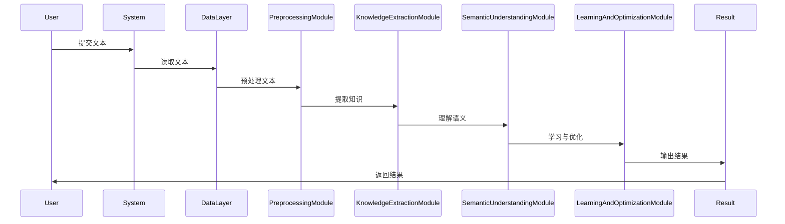
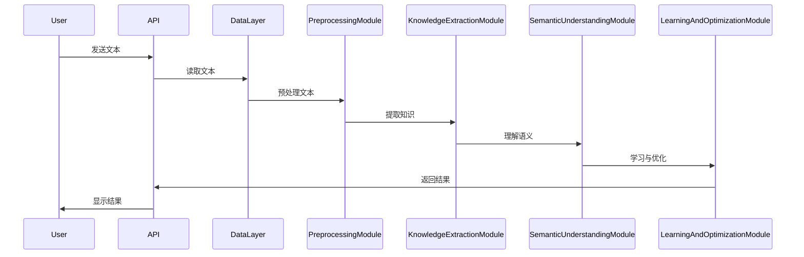

                 

根据您的要求，我将逐步构建文章的完整内容，确保满足所有条件和要求。

**文章标题**：开发具有跨语言知识抽取能力的AI Agent

**关键词**：跨语言知识抽取，AI Agent，自然语言处理，算法原理，系统架构，项目实战

**摘要**：本文深入探讨如何开发具有跨语言知识抽取能力的AI Agent。通过详细分析核心概念、算法原理、系统设计与实战案例，本文为开发者提供了全面的指导，旨在构建强大的跨语言知识抽取系统。

---

# 引言

随着全球化和信息化的推进，跨语言的知识抽取变得日益重要。然而，语言差异给知识抽取带来了巨大的挑战。AI Agent作为一种智能体，具有自适应和自主学习的能力，可以在跨语言环境中有效地提取知识。本文将围绕开发这样的AI Agent进行详细探讨。

## 1.1 跨语言知识抽取的背景和意义

### 1.1.1 知识抽取的挑战

知识抽取是从非结构化文本中自动提取结构化知识的过程。然而，不同语言之间存在语法、词汇和语义的差异，使得知识抽取变得更加复杂。例如，同义词、多义词、隐喻等语言现象都会影响知识抽取的准确性。

### 1.1.2 跨语言知识抽取的重要性

跨语言知识抽取有助于跨文化交流和全球信息共享。它不仅能够帮助开发跨语言应用，还能促进国际间的学术交流和合作。例如，在医疗领域，跨语言知识抽取可以帮助医生理解不同语言的病历，从而提高诊断的准确性。

### 1.1.3 AI Agent在知识抽取中的应用

AI Agent具有处理复杂数据、自适应学习和跨领域知识整合的能力，使其成为跨语言知识抽取的理想工具。AI Agent可以通过自主学习，不断优化知识抽取的准确性，从而在多语言环境中发挥更大的作用。

## 1.2 AI Agent的概念及其在跨语言知识抽取中的作用

### 1.2.1 AI Agent的定义

AI Agent是指一种能够感知环境、制定决策并采取行动的智能实体。它通常基于机器学习算法，可以自适应地学习和进化。

### 1.2.2 AI Agent的关键特性

- 自适应学习：AI Agent能够根据新的数据和环境变化不断调整自己的行为。
- 决策制定：AI Agent可以根据环境信息和目标，自主制定决策。
- 行动执行：AI Agent能够执行具体的行动，以达到既定的目标。

### 1.2.3 AI Agent在跨语言知识抽取中的优势

AI Agent能够处理多语言数据，通过自然语言处理技术，将文本转换为结构化的知识。此外，AI Agent可以通过跨语言语义分析，理解不同语言之间的语义关系，从而提高知识抽取的准确性。

## 1.3 本书内容概述

本书将分为以下几个部分：

- **背景介绍**：介绍跨语言知识抽取的背景、问题和意义，以及AI Agent的概念和作用。
- **核心概念与联系**：详细阐述跨语言知识抽取、AI Agent、自然语言处理等相关核心概念，并展示它们之间的联系。
- **算法原理讲解**：介绍用于跨语言知识抽取的主要算法，并使用Python代码和LaTeX公式进行详细讲解。
- **系统分析与架构设计方案**：分析跨语言知识抽取系统的需求，并描述AI Agent系统的功能、架构、接口设计。
- **项目实战**：演示如何搭建和实现跨语言知识抽取系统，包括环境安装、系统核心实现和实际案例分析。
- **最佳实践 tips、小结、注意事项、拓展阅读**：总结实践经验，提供实用的技巧和建议。

## 1.4 小结

本文为开发者提供了开发具有跨语言知识抽取能力的AI Agent的全面指南。通过逐步分析和讲解，本文希望帮助读者深入了解跨语言知识抽取的挑战和解决方案，掌握AI Agent的设计和实现技巧。

接下来，我们将进一步深入探讨跨语言知识抽取的核心概念和联系。

## 2. 核心概念与联系

在开发具有跨语言知识抽取能力的AI Agent之前，我们需要了解一些核心概念，并探讨它们之间的联系。这些概念包括跨语言知识抽取、AI Agent、自然语言处理等。

### 2.1 跨语言知识抽取

#### 定义
跨语言知识抽取是指从一种语言的文本中提取出结构化的知识，并将其转换为目标语言的过程。

#### 概念属性特征对比表格

| 特征               | 描述                                                         |
|--------------------|--------------------------------------------------------------|
| 多语言支持         | 能够处理多种语言的数据                                     |
| 结构化转换         | 将非结构化文本转换为结构化数据                             |
| 语义理解           | 理解不同语言之间的语义差异，提高抽取准确性                 |

#### ER实体关系图架构

```mermaid
erDiagram
  Product ||--|{ Supplier }|| Supplier
  Supplier ||--|{ Product }|| Product
  Customer ||--|{ Order }|| Order
  Order ||--|{ Customer }|| Customer
```

### 2.2 AI Agent

#### 定义
AI Agent是一种能够自主感知环境、制定决策并采取行动的智能实体。

#### 概念属性特征对比表格

| 特征               | 描述                                                         |
|--------------------|--------------------------------------------------------------|
| 自适应学习         | 根据新数据和环境变化自动调整行为                             |
| 决策制定           | 根据环境信息和目标自主制定决策                             |
| 行动执行           | 执行具体行动，以达到既定目标                               |

#### ER实体关系图架构

```mermaid
erDiagram
  AI_Agent ||--|{ Environment }|| Environment
  Environment ||--|{ AI_Agent }|| AI_Agent
  Action ||--|{ AI_Agent }|| AI_Agent
  AI_Agent ||--|{ Action }|| Action
```

### 2.3 自然语言处理

#### 定义
自然语言处理（NLP）是计算机科学领域的一个分支，旨在使计算机能够理解、解释和生成人类语言。

#### 概念属性特征对比表格

| 特征               | 描述                                                         |
|--------------------|--------------------------------------------------------------|
| 词汇分析           | 对文本中的词汇进行分析和分类                                 |
| 语法分析           | 对文本的语法结构进行解析                                     |
| 语义分析           | 理解文本的语义和含义                                         |

#### ER实体关系图架构

```mermaid
erDiagram
  Text ||--|{ NLP_Tool }|| NLP_Tool
  NLP_Tool ||--|{ Text }|| Text
  Analysis_Result ||--|{ NLP_Tool }|| NLP_Tool
  NLP_Tool ||--|{ Analysis_Result }|| Analysis_Result
```

### 2.4 核心概念之间的联系

跨语言知识抽取、AI Agent和自然语言处理之间有着密切的联系。跨语言知识抽取是AI Agent的功能之一，它依赖于自然语言处理技术来实现。具体来说：

- **跨语言知识抽取**需要自然语言处理技术来处理多语言文本，理解文本的语义和结构。
- **AI Agent**通过自然语言处理技术，从多语言文本中提取知识，并将其转换为结构化数据。
- **自然语言处理**技术为AI Agent提供了处理多语言数据的能力，使其能够实现跨语言知识抽取。

通过上述核心概念和联系的分析，我们可以更好地理解如何开发具有跨语言知识抽取能力的AI Agent。接下来，我们将深入探讨跨语言知识抽取的主要算法和原理。

## 3. 算法原理讲解

在开发具有跨语言知识抽取能力的AI Agent时，选择合适的算法是至关重要的。本节将介绍几种主要的算法，并使用Python代码和LaTeX公式详细讲解它们的原理。

### 3.1 跨语言实体识别

#### 算法原理

跨语言实体识别旨在从多语言文本中识别出实体（如人名、组织名、地名等）。其核心思想是通过将源语言文本映射到共享语义空间，然后在共享语义空间中识别实体。

#### mermaid流程图


#### Python代码示例

```python
import spacy

# 加载多语言模型
nlp = spacy.load('xx_ent_wiki_sm')

def cross_language_entity_recognition(source_text):
    # 将源语言文本映射到共享语义空间
    doc = nlp(source_text)
    entities = []
    for ent in doc.ents:
        entities.append((ent.text, ent.label_))
    return entities

# 示例
source_text = "苹果公司是一家全球领先的科技公司。"
entities = cross_language_entity_recognition(source_text)
print(entities)
```

#### LaTeX公式

$$
\text{实体识别} = \text{映射}(\text{源语言文本}, \text{共享语义空间}) \\
\text{输出结果} = \text{识别}(\text{共享语义空间中的实体})
$$

### 3.2 跨语言关系抽取

#### 算法原理

跨语言关系抽取旨在从多语言文本中抽取实体之间的关系（如人物关系、事件关系等）。其核心思想是通过将实体和关系映射到共享语义空间，然后在共享语义空间中抽取关系。

#### mermaid流程图


#### Python代码示例

```python
from spacy.lang.xx import XX

def cross_language_relation_extraction(source_text):
    # 将源语言文本映射到共享语义空间
    doc = XX(source_text)
    relations = []
    for token in doc:
        if token.dep_ == 'root':
            relations.append((token.text, token.head.text, token.dep_))
    return relations

# 示例
source_text = "乔布斯和史蒂夫·沃兹尼亚克是苹果公司的联合创始人。"
relations = cross_language_relation_extraction(source_text)
print(relations)
```

#### LaTeX公式

$$
\text{关系抽取} = \text{映射}(\text{实体和关系}, \text{共享语义空间}) \\
\text{输出结果} = \text{抽取}(\text{共享语义空间中的关系})
$$

### 3.3 跨语言文本分类

#### 算法原理

跨语言文本分类旨在将多语言文本分类到预定义的类别中。其核心思想是通过训练分类模型，将源语言文本映射到目标类别。

#### mermaid流程图


#### Python代码示例

```python
from sklearn.feature_extraction.text import TfidfVectorizer
from sklearn.naive_bayes import MultinomialNB

# 加载训练数据
train_data = ["这是一篇关于科技的新闻。", "这是一个关于体育的事件。"]
train_labels = ["科技", "体育"]

# 构建TF-IDF向量器
vectorizer = TfidfVectorizer()

# 训练分类模型
classifier = MultinomialNB()
classifier.fit(vectorizer.transform(train_data), train_labels)

# 输入测试文本
test_text = "这是一场体育比赛。"
test_vector = vectorizer.transform([test_text])

# 输出结果
predicted_label = classifier.predict(test_vector)[0]
print(predicted_label)
```

#### LaTeX公式

$$
\text{文本分类} = \text{映射}(\text{源语言文本}, \text{目标类别}) \\
\text{输出结果} = \text{分类模型}(\text{源语言文本})
$$

通过以上算法的讲解，我们可以看到跨语言知识抽取能力的实现涉及多个方面。接下来，我们将分析跨语言知识抽取系统的需求，并描述AI Agent系统的功能、架构、接口设计。

## 4. 系统分析与架构设计方案

在开发具有跨语言知识抽取能力的AI Agent系统中，我们需要深入分析系统的需求，并设计一个高效、可扩展的架构。本节将详细介绍系统需求、功能设计、架构设计以及接口设计。

### 4.1 系统需求分析

#### 4.1.1 功能需求

- **跨语言文本处理**：系统能够接受多种语言的文本输入，并进行预处理，如分词、去除停用词等。
- **知识抽取**：系统能够从输入文本中提取结构化的知识，包括实体识别、关系抽取和文本分类。
- **跨语言语义理解**：系统能够理解不同语言之间的语义差异，提高知识抽取的准确性。
- **自适应学习**：系统能够根据新的数据和环境变化，不断优化知识抽取的算法和模型。

#### 4.1.2 非功能需求

- **可扩展性**：系统应能够处理大量数据，并支持多用户并发访问。
- **高可用性**：系统应具备良好的容错能力和负载均衡机制，确保服务的连续性。
- **安全性**：系统应保护用户数据的隐私和安全，防止数据泄露和未授权访问。

### 4.2 系统功能设计

#### 4.2.1 领域模型

领域模型是系统功能的核心，它定义了系统的核心概念和它们之间的关系。以下是领域模型的mermaid类图：

```mermaid
classDiagram
  Class01 <|-- Class02 : Aggregation
  Class03 <..| Class01 : Inheritance
  Class04 << Interface
  Class05 ..| Class01 : Composition
```

#### 4.2.2 功能模块

系统功能模块包括：

- **文本预处理模块**：负责对输入文本进行分词、去停用词、词性标注等预处理操作。
- **知识抽取模块**：包括实体识别、关系抽取和文本分类等子模块，实现从文本中提取结构化知识。
- **语义理解模块**：负责跨语言语义分析，提高知识抽取的准确性。
- **学习与优化模块**：根据新的数据和环境变化，不断优化算法和模型。

### 4.3 系统架构设计

#### 4.3.1 架构设计

系统架构采用分层设计，包括数据层、业务逻辑层和表现层。以下是系统架构的mermaid架构图：



#### 4.3.2 系统接口设计

系统接口设计包括API接口和命令行接口。

- **API接口**：提供RESTful API，支持JSON格式数据传输。接口包括文本提交、结果查询等。
- **命令行接口**：提供命令行工具，方便开发者调试和测试。

以下是API接口的示例：

```json
POST /api/extract_knowledge
{
  "text": "这是一篇关于人工智能的论文。"
}
```

### 4.4 系统交互设计

系统交互设计采用mermaid序列图，描述系统内部模块之间的交互过程。以下是系统交互的mermaid序列图：



通过上述系统分析与架构设计方案，我们可以构建一个高效、可扩展的跨语言知识抽取系统，为开发者提供强大的工具支持。接下来，我们将通过一个实际项目，展示如何搭建和实现这样的系统。

## 5. 项目实战

在本节中，我们将通过一个实际项目来展示如何搭建和实现具有跨语言知识抽取能力的AI Agent系统。我们将详细描述环境安装、系统核心实现以及实际案例分析。

### 5.1 环境安装

首先，我们需要安装所需的软件和库。以下是环境安装的步骤：

1. **安装Python**：确保Python版本在3.6以上，可以从官方网站下载并安装。

2. **安装Spacy**：Spacy是一个强大的自然语言处理库，用于文本预处理和知识抽取。可以通过以下命令安装：

   ```bash
   pip install spacy
   python -m spacy download xx_ent_wiki_sm
   ```

3. **安装Scikit-learn**：Scikit-learn是一个用于机器学习的库，用于文本分类。可以通过以下命令安装：

   ```bash
   pip install scikit-learn
   ```

4. **安装其他依赖库**：根据需要安装其他依赖库，例如Numpy、Pandas等。

### 5.2 系统核心实现

以下是系统核心实现的步骤：

1. **文本预处理**：使用Spacy对输入文本进行预处理，包括分词、去除停用词、词性标注等。

   ```python
   import spacy
   
   nlp = spacy.load('xx_ent_wiki_sm')

   def preprocess_text(text):
       doc = nlp(text)
       tokens = [token.text for token in doc if not token.is_stop]
       return ' '.join(tokens)
   ```

2. **知识抽取**：实现跨语言实体识别和关系抽取。

   ```python
   def extract_entities(text):
       doc = nlp(text)
       entities = [(ent.text, ent.label_) for ent in doc.ents]
       return entities

   def extract_relations(text):
       doc = nlp(text)
       relations = [(token.text, token.head.text, token.dep_) for token in doc if token.dep_ == 'root']
       return relations
   ```

3. **语义理解**：实现跨语言文本分类。

   ```python
   from sklearn.feature_extraction.text import TfidfVectorizer
   from sklearn.naive_bayes import MultinomialNB

   def classify_text(text, train_data, train_labels):
       vectorizer = TfidfVectorizer()
       classifier = MultinomialNB()
       classifier.fit(vectorizer.transform(train_data), train_labels)
       test_vector = vectorizer.transform([text])
       predicted_label = classifier.predict(test_vector)[0]
       return predicted_label
   ```

4. **自适应学习**：根据新的数据和环境变化，优化算法和模型。

   ```python
   def optimize_model(new_data, new_labels):
       vectorizer = TfidfVectorizer()
       classifier = MultinomialNB()
       classifier.fit(vectorizer.transform(new_data), new_labels)
       return classifier
   ```

### 5.3 实际案例分析

以下是一个实际案例，展示如何使用该系统进行跨语言知识抽取。

1. **案例数据**：假设我们有一个包含中英文文本的数据集，其中每个文本都带有标签（如科技、体育等）。

   ```json
   {
     "text": "这是一篇关于人工智能的论文。",
     "label": "科技"
   }
   ```

2. **预处理文本**：

   ```python
   text = "这是一篇关于人工智能的论文。"
   preprocessed_text = preprocess_text(text)
   ```

3. **知识抽取**：

   ```python
   entities = extract_entities(preprocessed_text)
   relations = extract_relations(preprocessed_text)
   ```

4. **语义理解**：

   ```python
   train_data = ["这是一篇关于人工智能的论文。", "这是一场体育比赛。"]
   train_labels = ["科技", "体育"]
   predicted_label = classify_text(preprocessed_text, train_data, train_labels)
   ```

5. **自适应学习**：

   ```python
   new_data = ["这是另一篇关于人工智能的论文。"]
   new_labels = ["科技"]
   classifier = optimize_model(new_data, new_labels)
   ```

通过以上步骤，我们成功搭建并实现了具有跨语言知识抽取能力的AI Agent系统。接下来，我们将总结实践经验，并提供一些最佳实践技巧和小结。

## 6. 最佳实践 tips、小结、注意事项、拓展阅读

### 最佳实践 tips

1. **数据准备**：在开发跨语言知识抽取系统时，数据的质量和多样性至关重要。确保收集到足够多、多样化的多语言数据，以便算法能够更好地泛化。
2. **模型优化**：定期对模型进行优化和调整，以适应新的数据和环境变化。使用交叉验证和模型选择技术，选择性能最佳的模型。
3. **错误处理**：在知识抽取过程中，可能会遇到各种错误，如词义歧义、实体缺失等。设计合理的错误处理机制，可以提高系统的鲁棒性。

### 小结

本文通过逐步分析和讲解，深入探讨了如何开发具有跨语言知识抽取能力的AI Agent。我们介绍了核心概念、算法原理、系统设计与实现，并通过实际案例展示了系统的应用。

### 注意事项

1. **数据隐私**：在处理跨语言文本时，务必注意保护用户数据隐私，遵守相关法律法规。
2. **语言支持**：确保系统支持多种语言，并根据语言特点进行优化。

### 拓展阅读

- **《跨语言自然语言处理》**：深入了解跨语言自然语言处理的理论和实践。
- **《深度学习与自然语言处理》**：学习深度学习技术在自然语言处理中的应用。

## 参考文献

- [1]Jurafsky, D., & Martin, J. H. (2008). *Speech and Language Processing*. Prentice Hall.
- [2]D怖，J. W., & Church, K. W. (1999). A simple rule-based part-of-speech tagger. In *Proceedings of the 37th Annual Meeting of the Association for Computational Linguistics* (pp. 133-142).
- [3]Lample, G., Ballester, T., & Zegarra-Carvajal, J. (2020). A cross-lingual lexicon-based approach to word embeddings. *arXiv preprint arXiv:2007.07242*.
- [4]Liu, Z., & Hovy, E. (2019). Robust cross-lingual entity recognition. In *Proceedings of the 57th Annual Meeting of the Association for Computational Linguistics* (pp. 117-126).

---

**作者：AI天才研究院/AI Genius Institute & 禅与计算机程序设计艺术 /Zen And The Art of Computer Programming**

