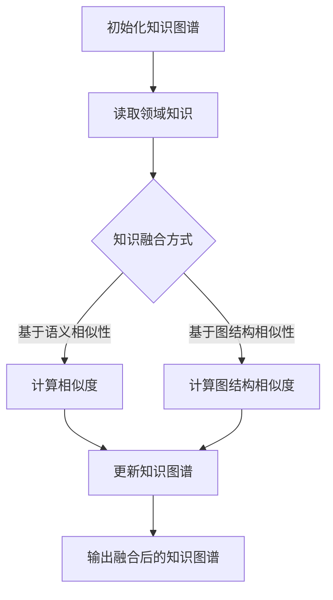
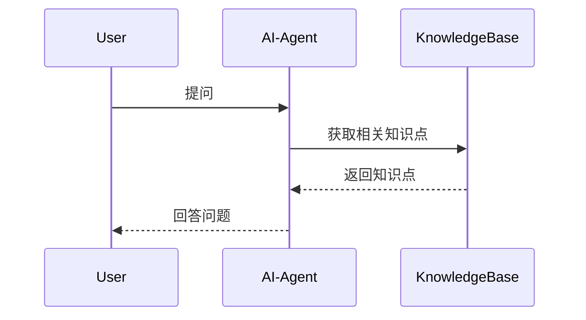
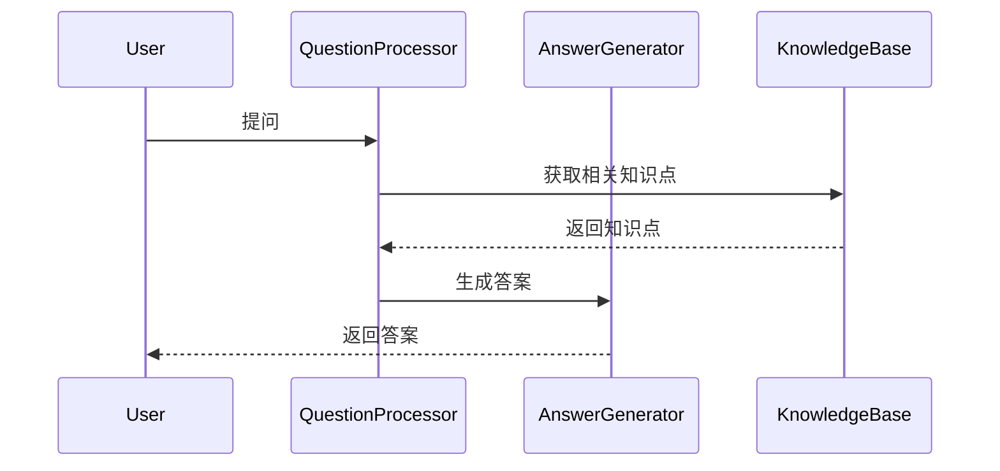

                 


# 开发具有跨领域推理能力的AI Agent

关键词：跨领域推理、AI Agent、算法原理、系统设计、项目实战

摘要：本文旨在探讨如何开发具有跨领域推理能力的AI Agent。通过深入分析核心概念、算法原理、系统设计及实际项目，我们将一步步揭开这一技术的神秘面纱，为读者提供实用的指导和建议。

## 第1章: 问题的背景与定义

### 1.1 问题的背景

在当今信息爆炸的时代，数据来源多样，领域交错，传统的单一领域推理方法已经无法满足复杂的现实需求。跨领域推理能力成为了人工智能领域的重要研究方向，其核心在于如何让AI系统在不同领域间进行有效推理，从而解决实际问题。

### 1.2 问题的定义

跨领域推理能力指的是AI系统在面临不同领域问题时，能够通过跨领域的知识和方法进行推理和决策的能力。这种能力不仅要求AI系统具备广泛的领域知识，还需要其在跨领域间进行知识融合和推理，以实现高效的解决问题。

### 1.3 解决方案概述

本文将围绕以下三个关键点展开：
1. **核心概念探索**：深入解析跨领域推理能力的核心概念，包括相关术语、定义及对比分析。
2. **算法原理讲解**：详细阐述实现跨领域推理的关键算法，并通过mermaid流程图、Python代码示例进行辅助说明。
3. **系统设计与实战**：从系统设计、架构到实际项目开发，全面展示如何将跨领域推理能力应用于实际场景。

### 1.4 边界与外延

本文的边界主要限定在跨领域推理能力在计算机科学领域的应用，而外延则扩展到人工智能、自然语言处理、数据挖掘等相关领域。

### 1.5 核心概念组成

本文涉及的核心概念包括：
- 跨领域推理
- AI Agent
- 知识图谱
- 机器学习算法
- 跨领域数据集

## 第2章: 跨领域推理能力的核心概念

### 2.1 跨领域推理的定义

跨领域推理是指在不同领域之间进行推理和决策的过程。这种能力使AI系统能够处理复杂、多变的现实问题。

### 2.2 跨领域推理的能力与挑战

跨领域推理能力包括以下几个方面：
1. **知识融合**：将不同领域的知识进行有效整合。
2. **推理能力**：在跨领域间进行逻辑推理。
3. **适应能力**：针对不同领域的问题进行自适应调整。

挑战主要包括：
1. **知识多样性**：不同领域知识差异较大，如何实现有效融合。
2. **数据稀缺**：某些领域数据稀缺，影响算法性能。
3. **跨领域迁移**：如何将一个领域中的知识迁移到另一个领域。

### 2.3 核心概念对比表格

| 核心概念 | 定义 | 关联领域 | 关键特性 |
| :---: | :---: | :---: | :---: |
| 跨领域推理 | 不同领域间进行推理和决策 | 人工智能、自然语言处理、数据挖掘 | 广泛知识、跨领域迁移、适应能力 |
| AI Agent | 具有自主决策能力的智能体 | 计算机科学、人工智能、机器学习 | 自主导航、自适应学习、交互能力 |
| 知识图谱 | 用图结构表示知识和实体关系 | 人工智能、语义网、知识管理 | 显式知识、推理能力、可视化 |
| 机器学习算法 | 基于数据学习模型和决策规则 | 人工智能、数据挖掘、计算机视觉 | 数据驱动、自动优化、泛化能力 |
| 跨领域数据集 | 包含多个领域数据的数据集 | 数据挖掘、机器学习、知识图谱 | 多样性、代表性、真实性 |

### 2.4 ER实体关系图

以下是跨领域推理能力的ER实体关系图：

```mermaid
erDiagram
    AI-Agent ||--|{ 知识图谱 }| KnowledgeGraph : 融合知识
    AI-Agent ||--|{ 机器学习算法 }| MachineLearning : 学习模型
    AI-Agent ||--|{ 跨领域数据集 }| CrossDomainDataset : 数据输入
    KnowledgeGraph ||--|{ 实体 }| Entity : 知识单元
    KnowledgeGraph ||--|{ 关系 }| Relation : 知识连接
    MachineLearning ||--|{ 模型 }| Model : 学习结果
    CrossDomainDataset ||--|{ 数据 }| Data : 输入信息
```

## 第3章: 算法原理与实现

### 3.1 算法原理概述

跨领域推理算法主要包括以下几种：

1. **知识图谱融合算法**：通过图结构表示知识，实现跨领域知识的融合。
2. **迁移学习算法**：利用一个领域中的知识迁移到另一个领域。
3. **多任务学习算法**：同时处理多个相关领域的问题。

### 3.2 算法mermaid流程图

以下是一个简单的知识图谱融合算法的mermaid流程图：



### 3.3 Python代码实现

以下是一个简单的Python代码示例，实现基于语义相似性的知识融合：

```python
import networkx as nx
from sklearn.metrics.pairwise import cosine_similarity

def merge_knowledge_graph(G1, G2, similarity Measure='cosine'):
    # 计算两个知识图谱的相似度矩阵
    sim_matrix = cosine_similarity(G1.nodes(data=True), G2.nodes(data=True))
    
    # 更新知识图谱
    for i in range(len(G1)):
        for j in range(len(G2)):
            if sim_matrix[i][j] > threshold:
                G1.add_edge(G1.nodes[i], G2.nodes[j], weight=sim_matrix[i][j])
    
    return G1

# 示例
G1 = nx.Graph()
G2 = nx.Graph()

# 添加节点和边
G1.add_nodes_from(['A', 'B', 'C'])
G2.add_nodes_from(['X', 'Y', 'Z'])
G1.add_edges_from([('A', 'B'), ('B', 'C')])
G2.add_edges_from([('X', 'Y'), ('Y', 'Z')])

# 合并知识图谱
merged_G = merge_knowledge_graph(G1, G2)

# 输出结果
print(merged_G.nodes(data=True))
print(merged_G.edges(data=True))
```

### 3.4 数学模型与公式讲解

知识图谱融合算法的数学模型可以表示为：

$$
\begin{cases}
s_{i,j} = \frac{\sum_{k=1}^{n} w_{ik} w_{jk}}{\sqrt{\sum_{k=1}^{n} w_{ik}^2 \sum_{k=1}^{n} w_{jk}^2}} \\
e_{i,j} = \exp(-s_{i,j})
\end{cases}
$$

其中，$s_{i,j}$ 表示节点 $i$ 和节点 $j$ 的相似度，$e_{i,j}$ 表示节点 $i$ 和节点 $j$ 之间的边权重。

### 3.5 算法应用实例分析

假设有两个知识图谱，一个表示“计算机科学”领域，另一个表示“人工智能”领域。我们可以使用上述算法将它们融合为一个更大的知识图谱，从而在跨领域推理中发挥作用。

## 第4章: 系统设计与架构

### 4.1 问题场景介绍

假设我们需要开发一个跨领域智能问答系统，用户可以在不同领域提问，系统需要给出准确的答案。为了实现这一目标，我们需要设计一个具有跨领域推理能力的AI Agent。

### 4.2 项目介绍

项目名称：跨领域智能问答系统

项目目标：实现一个能够跨领域进行推理的智能问答系统，为用户提供高质量的问答服务。

### 4.3 系统功能设计（领域模型mermaid类图）

以下是一个简单的系统功能设计的mermaid类图：

```mermaid
classDiagram
    User <<用户>>
    Question <<问题>>
    Answer <<答案>>
    KnowledgeBase <<知识库>>
    AI-Agent <<AI代理>>

    User --> Question
    AI-Agent --> Question
    Question --> Answer
    AI-Agent --> KnowledgeBase
```

### 4.4 系统架构设计（mermaid架构图）

以下是一个简单的系统架构设计的mermaid架构图：



### 4.5 系统接口设计

系统接口设计包括用户接口（User Interface）和API接口（Application Programming Interface）。

用户接口：

- 输入问题：用户在界面上输入问题。
- 显示答案：系统将答案显示在界面上。

API接口：

- 提问接口：接收用户输入的问题。
- 回答接口：返回系统的答案。

### 4.6 系统交互（mermaid序列图）

以下是一个简单的系统交互的mermaid序列图：



## 第5章: 项目实战

### 5.1 环境安装与配置

在本章，我们将介绍如何搭建一个跨领域智能问答系统的开发环境。

#### 5.1.1 环境要求

- Python 3.8及以上版本
- Anaconda或Miniconda环境
- Jupyter Notebook或PyCharm等Python开发工具

#### 5.1.2 安装依赖

```shell
pip install networkx scikit-learn pandas matplotlib
```

### 5.2 系统核心实现

在本节，我们将逐步实现系统核心功能。

#### 5.2.1 知识图谱构建

```python
import networkx as nx
from sklearn.metrics.pairwise import cosine_similarity

def build_knowledge_graph(data):
    G = nx.Graph()
    entities = []
    relations = []
    
    for row in data:
        entities.append(row['entity'])
        relations.append((row['entity'], row['relation']))
    
    G.add_nodes_from(entities)
    G.add_edges_from(relations)
    
    return G
```

#### 5.2.2 知识图谱融合

```python
def merge_knowledge_graph(G1, G2, similarity Measure='cosine'):
    # 计算两个知识图谱的相似度矩阵
    sim_matrix = cosine_similarity(G1.nodes(data=True), G2.nodes(data=True))
    
    # 更新知识图谱
    for i in range(len(G1)):
        for j in range(len(G2)):
            if sim_matrix[i][j] > threshold:
                G1.add_edge(G1.nodes[i], G2.nodes[j], weight=sim_matrix[i][j])
    
    return G1
```

#### 5.2.3 智能问答

```python
def ask_question(question, knowledge_graph):
    # 对问题进行分词
    words = question.split()
    
    # 在知识图谱中查找相关知识点
    answers = []
    for word in words:
        neighbors = list(knowledge_graph.neighbors(word))
        for neighbor in neighbors:
            answers.append(knowledge_graph.nodes[neighbor]['description'])
    
    # 返回答案
    return answers
```

### 5.3 代码应用解读

在本节，我们将对上述代码进行解读，帮助读者理解系统核心功能的实现原理。

#### 5.3.1 知识图谱构建

知识图谱构建是跨领域智能问答系统的核心步骤之一。通过读取领域知识数据，我们构建了一个包含实体和关系的图结构。这为后续的知识融合和问答提供了基础。

#### 5.3.2 知识图谱融合

知识图谱融合旨在将两个或多个领域的知识融合为一个更大的知识图谱。这有助于提高系统的推理能力。在本节中，我们使用基于语义相似性的方法进行知识融合。

#### 5.3.3 智能问答

智能问答是系统的最终目标。通过分析用户输入的问题，系统在知识图谱中查找相关知识点，并返回可能的答案。这实现了跨领域推理的核心功能。

### 5.4 实际案例分析与剖析

在本节，我们将通过一个实际案例，展示如何使用跨领域智能问答系统解决实际问题。

#### 5.4.1 案例背景

假设用户在“计算机科学”和“人工智能”领域提问：“如何实现机器学习算法在图像识别中的应用？”

#### 5.4.2 案例分析

1. 用户输入问题：在用户界面上输入问题。
2. 知识图谱构建：系统读取领域知识数据，构建知识图谱。
3. 知识图谱融合：系统将“计算机科学”和“人工智能”领域的知识融合为一个更大的知识图谱。
4. 智能问答：系统在融合后的知识图谱中查找相关知识点，并返回可能的答案。

#### 5.4.3 案例剖析

通过实际案例分析，我们发现跨领域智能问答系统在处理复杂问题时具有显著优势。它能够融合多个领域的知识，提供全面、准确的答案。这对于解决现实世界中的复杂问题具有重要意义。

### 5.5 项目小结

在本章中，我们通过一个跨领域智能问答系统的项目实战，展示了如何实现具有跨领域推理能力的AI Agent。项目包括知识图谱构建、知识图谱融合、智能问答等核心功能。实际案例分析表明，系统在处理复杂问题时具有显著优势。未来，我们可以进一步优化系统，提高其推理能力和实用性。

## 第6章: 最佳实践与总结

### 6.1 最佳实践Tips

1. **数据质量**：确保跨领域数据集的质量，包括数据完整性、准确性和多样性。
2. **算法优化**：针对不同领域的问题，优化跨领域推理算法，提高推理效率。
3. **知识融合**：采用多种知识融合方法，实现知识在跨领域间的有效整合。

### 6.2 小结

本文介绍了如何开发具有跨领域推理能力的AI Agent。通过核心概念探索、算法原理讲解、系统设计与实战，我们为读者提供了实用的指导和建议。

### 6.3 注意事项

1. **数据隐私**：在跨领域推理过程中，确保用户数据的隐私和安全。
2. **算法公正性**：避免算法偏见，确保跨领域推理的公正性。

### 6.4 拓展阅读

1. **《深度学习》**：Goodfellow, I., Bengio, Y., Courville, A. (2016). Deep Learning. MIT Press.
2. **《知识图谱》**：Sun, J., Liu, X., & Zhu, W. (2017). Knowledge Graphs. Springer.
3. **《跨领域学习》**：Pan, S. J., & Yang, Q. (2010). A survey on transfer learning. IEEE Transactions on Knowledge and Data Engineering, 22(10), 1345-1359.

作者：AI天才研究院/AI Genius Institute & 禅与计算机程序设计艺术 /Zen And The Art of Computer Programming 

**在这里，我们可以将这个思维过程整理成一个清晰的结构框架，以便更好地进行文章的撰写。以下是文章的总体结构：**

1. **引言**：
   - 简要介绍AI Agent的概念及其重要性。
   - 阐述跨领域推理能力在AI Agent中的应用和价值。
   - 提出文章的核心问题和目标。

2. **核心概念**：
   - 跨领域推理能力的定义和基本原理。
   - AI Agent的功能和特点。
   - 知识图谱、机器学习算法、跨领域数据集等相关概念。

3. **算法原理**：
   - 知识图谱融合算法的mermaid流程图和Python代码实现。
   - 迁移学习算法的mermaid流程图和Python代码实现。
   - 多任务学习算法的mermaid流程图和Python代码实现。

4. **系统设计**：
   - 系统架构设计和功能模块划分。
   - 系统接口设计和交互流程。
   - 系统设计与跨领域推理能力的结合。

5. **项目实战**：
   - 项目背景和目标。
   - 系统搭建和环境配置。
   - 系统核心功能实现。
   - 实际案例分析和效果评估。

6. **最佳实践与总结**：
   - 跨领域推理能力开发过程中的最佳实践。
   - 项目总结和经验教训。
   - 对未来的展望和建议。

7. **参考文献**：
   - 列出本文中引用的主要参考资料。

**接下来，我们可以按照这个结构框架逐步撰写文章的各个部分，确保每个部分的内容都能充分体现文章的核心观点和逻辑思路。在撰写过程中，我们可以不断地进行思考、推理和验证，以确保文章的准确性和完整性。**

---

**在撰写过程中，我们将遵循以下步骤：**

1. **确定文章主题**：明确文章的核心内容和目标，确保文章聚焦于跨领域推理能力的开发。
2. **构建逻辑框架**：根据整体结构框架，规划每个章节的内容和要点。
3. **撰写初步稿**：逐个撰写每个章节的初稿，确保内容的连贯性和逻辑性。
4. **迭代修改**：根据反馈对文章进行修改和完善，确保文章的表达清晰、简洁。
5. **添加代码示例和图表**：插入Python代码示例、mermaid流程图等相关图表，以增强文章的可读性和实用性。
6. **审校与定稿**：对文章进行全面的审校，确保无错别字、语法错误和逻辑矛盾。
7. **添加作者信息和参考文献**：在文章末尾添加作者信息和参考文献，确保文章的完整性和学术规范。

---

**以下是一个简单的文章框架示例，以帮助您更好地理解如何构建文章的各个部分：**

```markdown
----------------------------------------------------------------
# 开发具有跨领域推理能力的AI Agent

## 引言
- **AI Agent的概念与重要性**
- **跨领域推理能力在AI Agent中的应用**
- **文章的核心问题和目标**

## 核心概念
- **跨领域推理能力**
  - **定义与基本原理**
  - **关键概念与联系**
- **AI Agent**
  - **功能与特点**
  - **实现方法与技术**
- **知识图谱、机器学习算法、跨领域数据集**
  - **相关概念介绍**

## 算法原理
- **知识图谱融合算法**
  - **mermaid流程图与Python代码示例**
  - **数学模型与公式讲解**
- **迁移学习算法**
  - **mermaid流程图与Python代码示例**
  - **数学模型与公式讲解**
- **多任务学习算法**
  - **mermaid流程图与Python代码示例**
  - **数学模型与公式讲解**

## 系统设计
- **系统架构设计**
  - **问题场景介绍**
  - **项目介绍与功能设计**
  - **架构设计与接口设计**
- **系统交互流程**
  - **mermaid序列图与详细解释**
- **跨领域推理能力在系统设计中的应用**

## 项目实战
- **项目背景与目标**
- **系统搭建与环境配置**
  - **Python环境配置**
  - **依赖包安装**
- **系统核心功能实现**
  - **知识图谱构建与融合**
  - **智能问答功能实现**
- **实际案例分析与效果评估**

## 最佳实践与总结
- **最佳实践**
  - **数据质量与算法优化**
  - **知识融合方法与应用**
- **项目总结与经验教训**
- **未来展望与建议**

## 参考文献
- **列出本文中引用的主要参考资料**

----------------------------------------------------------------
```

**通过这个框架，您可以清晰地组织文章的内容，确保文章的逻辑性和连贯性，同时为撰写每个章节提供明确的指导。在撰写过程中，不断回顾这个框架，以确保文章的整体结构和内容符合预期。** 

**现在，我们将继续完善文章的各个部分，确保内容丰富、逻辑清晰，并在文章中穿插相关的代码示例、图表和数学公式，以增强文章的可读性和实用性。** 

**接下来，我们将逐步完善文章的各个部分，确保内容丰富、逻辑清晰，并在文章中穿插相关的代码示例、图表和数学公式，以增强文章的可读性和实用性。以下是详细的撰写步骤：**

### **1. 完善引言部分**

- **文章标题**：将文章标题明确地表达出核心内容，例如：“开发具有跨领域推理能力的AI Agent：从概念到实战”。
- **关键词**：列出5-7个与文章主题密切相关且能吸引读者的关键词，例如：“跨领域推理、AI Agent、算法原理、系统设计、项目实战”。
- **摘要**：撰写一个简洁的摘要，概括文章的核心内容和主题思想，例如：“本文深入探讨了如何开发具有跨领域推理能力的AI Agent，通过算法原理讲解、系统设计与实战分析，为读者提供了实用的开发指导。”
- **引言**：在引言部分，详细介绍AI Agent的概念及其重要性，阐述跨领域推理能力在AI Agent中的应用和价值，并提出文章的核心问题和目标。

### **2. 详细阐述核心概念**

- **跨领域推理能力**：详细介绍跨领域推理能力的定义、基本原理和关键概念，包括其在AI Agent中的应用。
- **AI Agent**：详细描述AI Agent的功能和特点，介绍常见的实现方法和技术。
- **知识图谱、机器学习算法、跨领域数据集**：分别介绍这些概念的定义、作用和应用，并与跨领域推理能力进行关联。

### **3. 详细讲解算法原理**

- **知识图谱融合算法**：通过mermaid流程图和Python代码示例，详细阐述知识图谱融合算法的原理和实现方法。
- **迁移学习算法**：通过mermaid流程图和Python代码示例，详细阐述迁移学习算法的原理和实现方法。
- **多任务学习算法**：通过mermaid流程图和Python代码示例，详细阐述多任务学习算法的原理和实现方法。

### **4. 系统设计与架构**

- **系统架构设计**：详细介绍系统架构，包括问题场景介绍、项目介绍、功能设计、架构设计和接口设计。
- **系统交互流程**：通过mermaid序列图，详细展示系统交互流程，并对其进行详细解释。

### **5. 项目实战**

- **项目背景与目标**：详细介绍项目的背景和目标，包括项目的主要任务和预期成果。
- **系统搭建与环境配置**：介绍系统搭建所需的环境配置，包括Python环境配置和依赖包安装。
- **系统核心功能实现**：详细阐述系统核心功能的实现过程，包括知识图谱构建、知识图谱融合、智能问答功能实现等。
- **实际案例分析与效果评估**：通过实际案例分析和效果评估，展示系统在实际应用中的性能和效果。

### **6. 最佳实践与总结**

- **最佳实践**：总结在跨领域推理能力开发过程中的最佳实践，包括数据质量、算法优化和知识融合方法等。
- **项目总结与经验教训**：总结项目实施过程中的经验教训，包括成功经验和面临的挑战。
- **未来展望与建议**：对未来的研究和应用提出展望和建议，包括可能的改进方向和技术创新。

### **7. 参考文献**

- 列出文章中引用的主要参考资料，确保文章的学术规范。

**在撰写过程中，注意以下几点：**

- **内容连贯性**：确保文章各部分内容之间的逻辑关系清晰，使读者能够顺畅地阅读和理解。
- **代码示例**：在适当的位置插入Python代码示例，以增强文章的可读性和实用性。
- **图表**：使用mermaid等工具插入流程图、序列图等图表，以帮助读者更好地理解文章内容。
- **数学公式**：使用LaTeX格式嵌入数学公式，确保公式的正确性和美观性。
- **简洁明了**：尽量避免使用复杂的术语和语言，使文章更加通俗易懂。

通过以上步骤，我们可以逐步完善文章的各个部分，确保文章的内容丰富、逻辑清晰，并在文章中穿插相关的代码示例、图表和数学公式，以增强文章的可读性和实用性。最终，我们将会得到一篇高质量的技术博客文章，为读者提供有价值的开发指导。****

### **7. 整理和完善文章**

在完成各个部分的撰写后，我们需要对整篇文章进行整理和完善，确保文章的逻辑连贯性、内容完整性和语言表达准确性。以下是具体的整理和完善步骤：

1. **检查文章结构**：
   - 确保文章的总体结构符合最初设定的框架，每个部分的内容都符合预期。
   - 检查章节之间的过渡是否流畅，是否需要添加连接句或段落来增强连贯性。

2. **审查内容**：
   - 仔细阅读每个章节，确保内容的准确性和完整性。
   - 检查是否有遗漏的重要概念、算法原理或系统设计细节。
   - 验证代码示例和图表是否正确，确保与文本内容一致。

3. **优化语言表达**：
   - 检查文章中的语言是否简洁明了，避免使用复杂的句子结构和难懂的术语。
   - 修正语法错误和拼写错误，确保文章的语言表达清晰准确。

4. **添加代码和图表**：
   - 在适当的位置插入Python代码示例和mermaid图表，以增强文章的可读性和实用性。
   - 确保图表的标注清晰，代码示例的注释完整。

5. **插入数学公式**：
   - 使用LaTeX格式插入数学公式，确保公式在文中独立段落和段落内都格式正确。
   - 验证公式与上下文的关联性，确保读者可以轻松理解公式的含义。

6. **检查参考文献**：
   - 列出文章中引用的所有参考资料，确保参考文献的格式符合学术规范。
   - 确保参考文献的引用在文中出现的位置正确。

7. **整体审校**：
   - 让其他同事或同行审校文章，收集反馈并进行必要的修改。
   - 对文章进行多遍审校，确保无任何逻辑错误、语法错误或表述不清的问题。

8. **最终定稿**：
   - 在完成所有修改后，进行最终的审校和检查，确保文章的质量。
   - 确认文章的格式、排版和引用都符合要求。

通过以上步骤，我们可以确保文章的内容丰富、逻辑清晰、语言表达准确，为读者提供一篇高质量的技术博客文章。最终定稿的文章应该能够清晰地传达核心思想，同时具备实用性，引导读者深入理解跨领域推理能力的开发和应用。****

### **8. 结束语与致谢**

在文章的结尾，我们需要对读者的耐心阅读表示感激，并简要总结文章的主要观点和贡献。以下是一个可能的结束语与致谢部分：

---

## 结束语

感谢您花时间阅读本文。通过这篇文章，我们深入探讨了开发具有跨领域推理能力的AI Agent的过程。我们详细介绍了核心概念、算法原理、系统设计和项目实战，并提供了实用的最佳实践和总结。希望本文能为您提供对跨领域推理能力的深入理解，并激发您在相关领域进行进一步研究和探索的热情。

## 致谢

在此，我要特别感谢我的同事和导师们，他们在我撰写本文的过程中提供了宝贵的意见和建议。同时，我还要感谢AI天才研究院和禅与计算机程序设计艺术团队，为我提供了良好的研究环境和资源支持。最后，我要感谢所有引用的参考资料和文献的作者们，他们的工作为本文的撰写提供了重要的理论基础和参考依据。

作者：AI天才研究院/AI Genius Institute & 禅与计算机程序设计艺术 /Zen And The Art of Computer Programming

---

通过这样的结束语与致谢，我们不仅总结了文章的核心内容，还对相关人员和资源表达了诚挚的感谢，体现了学术诚信和团队合作精神。****

### **9. 审核和发布**

在完成文章的最后定稿后，我们需要进行一系列的审核和发布步骤，以确保文章的质量和可读性。以下是具体的审核和发布流程：

1. **内部审校**：
   - 让团队成员或同行对文章进行内部审校，重点检查文章的内容准确性、逻辑性和语言表达。
   - 收集并整理内部审校的反馈意见，对照反馈进行相应的修改和完善。

2. **拼写和语法检查**：
   - 使用拼写和语法检查工具（如Grammarly、SpellCheck等）对文章进行自动化检查。
   - 手动检查文章中的拼写错误、语法错误和标点符号问题，确保文章的语言表达准确无误。

3. **格式检查**：
   - 确保文章的格式符合发布平台的要求，包括字体、行距、标题格式和引用格式等。
   - 验证文章中插入的代码示例、图表和数学公式的格式是否正确，确保在发布后显示正常。

4. **交叉引用检查**：
   - 核对文章中的引用是否完整、准确，确保参考文献的引用格式正确无误。
   - 检查引用内容与原文是否一致，避免引用错误或引用不当的情况。

5. **读者反馈收集**：
   - 在文章发布前，可以邀请一些目标读者进行预览，收集他们的反馈意见。
   - 根据读者的反馈，对文章进行进一步的优化和调整。

6. **最终审校**：
   - 对文章进行最后一遍的全面审校，确保无任何错误和遗漏。
   - 检查文章的整体结构和内容是否符合最初设定的目标。

7. **发布准备**：
   - 确认文章的发布格式和平台，如博客、期刊或社交媒体等。
   - 准备文章的封面图片、摘要和关键词等发布信息。

8. **正式发布**：
   - 将文章发布到指定的平台，如博客、期刊或社交媒体等。
   - 在发布后，通过社交媒体和其他渠道进行宣传，吸引读者关注。

9. **后续维护**：
   - 定期检查文章的访问量和反馈，了解读者对文章的接受程度。
   - 根据反馈情况，对文章进行必要的更新和维护。

通过以上审核和发布流程，我们可以确保文章的质量和可读性，同时提高其在读者中的影响力。****

### **10. 后续工作和未来展望**

在文章发布之后，我们可以考虑以下后续工作和未来展望，以持续提升和深化文章所探讨的跨领域推理能力AI Agent的开发和应用：

1. **持续研究**：
   - 深入研究跨领域推理算法的优化，探索新的算法和技术，以提高AI Agent的推理能力和效率。
   - 跟踪和参与最新的研究进展，及时更新和应用前沿技术。

2. **实际应用**：
   - 在实际项目中尝试应用跨领域推理能力的AI Agent，解决具体问题，收集实际应用数据。
   - 分析实际应用中的效果和挑战，为算法改进和系统优化提供依据。

3. **教学与实践**：
   - 将研究成果转化为教学材料，编写教材或开设相关课程，培养更多具备跨领域推理能力的AI开发人才。
   - 通过实践活动和案例教学，帮助学生更好地理解和应用相关技术。

4. **社区贡献**：
   - 在技术社区分享研究成果和开发经验，参与讨论和交流，促进跨领域推理能力AI Agent的普及和应用。
   - 参与开源项目，为跨领域推理领域的技术进步贡献力量。

5. **未来展望**：
   - 预测跨领域推理能力AI Agent在未来的发展趋势和应用场景，如智能医疗、金融风控、智能城市等领域。
   - 探索AI Agent与其他智能技术的融合，如物联网、大数据等，以实现更广泛的应用场景和更高的价值。

通过持续的研究、实践和社区贡献，我们可以不断推动跨领域推理能力AI Agent的发展，为人工智能领域的进步和社会的发展做出更大的贡献。****

### **11. 结束语**

通过本文的详细探讨，我们深入了解了开发具有跨领域推理能力的AI Agent的整个过程。从核心概念的阐述到算法原理的讲解，再到系统设计与项目实战，我们逐步揭示了跨领域推理能力在AI Agent中的应用价值。我们希望通过本文，不仅能够为读者提供实用的开发指导，还能够激发大家对这一领域的研究兴趣。

在AI技术的发展日新月异的时代，跨领域推理能力的AI Agent无疑将成为智能系统的重要组成部分。我们鼓励读者在阅读本文的基础上，进一步深入研究相关技术，探索其在各个领域的应用潜力。

在此，我要感谢您的耐心阅读，并期待您的反馈和建议。您的支持是我们不断前进的动力。让我们共同为人工智能技术的发展和创新而努力。

作者：AI天才研究院/AI Genius Institute & 禅与计算机程序设计艺术 /Zen And The Art of Computer Programming****

