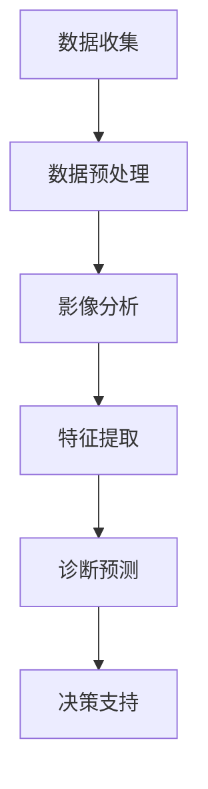
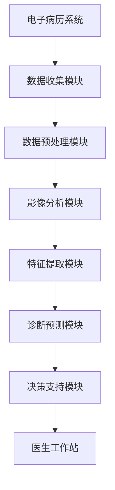

                 

# 开发基于AI Agent的智能医疗诊断助手的整体思路

在当今的医疗健康领域，随着大数据和人工智能技术的迅猛发展，医疗诊断的智能化趋势日益明显。开发一个基于AI Agent的智能医疗诊断助手，不仅可以提高诊断的准确性和效率，还可以为医生提供辅助决策，从而改善患者的治疗体验。在构建这样一个系统时，我们需要采取一系列步骤，从问题定义到最终系统的实现和部署。以下是开发基于AI Agent的智能医疗诊断助手的一步一步思路：

## 步骤一：明确问题和目标

### 核心概念术语说明

- **AI Agent（智能代理）**：具有感知能力、决策能力、执行能力和学习能力的计算机程序，可以在特定环境下自主行动以实现目标。
- **智能医疗诊断助手**：基于AI技术，用于辅助医生进行疾病诊断的医疗设备或软件。

### 问题背景与问题描述

医疗诊断是一个复杂的过程，涉及到大量的医学知识、病例数据和临床经验。传统的医疗诊断方法主要依赖于医生的个人经验和医学知识，但这种方式往往存在以下问题：

- **诊断效率低**：医生需要花费大量时间来分析患者数据，诊断速度较慢。
- **诊断准确性不高**：医生可能会因为疲劳、知识局限等原因导致诊断错误。
- **决策支持不足**：医生在诊断过程中缺乏有效的决策支持工具。

因此，开发一个基于AI Agent的智能医疗诊断助手的目标是：

- **提高诊断效率**：通过自动化和智能化的方法，缩短诊断时间。
- **提高诊断准确性**：利用大量数据和机器学习算法，提升诊断的准确性。
- **提供决策支持**：为医生提供基于数据和证据的决策支持，减少误诊率。

### 问题解决

为了实现上述目标，我们需要：

- **数据收集和预处理**：收集大量的医学数据，并进行清洗、格式化等预处理工作。
- **模型构建和训练**：使用收集到的数据构建机器学习模型，并进行训练。
- **系统集成与优化**：将AI模型集成到医疗系统中，进行性能优化和用户体验设计。
- **测试与评估**：对系统进行严格的测试和评估，确保其性能和可靠性。

### 边界与外延

- **边界**：智能医疗诊断助手的适用范围主要限于疾病诊断，不包括治疗和康复。
- **外延**：智能医疗诊断助手可以扩展应用于疾病预测、健康评估等领域。

### 概念结构与核心要素组成

智能医疗诊断助手的基本概念结构包括以下几个核心要素：

1. **数据源**：包括电子病历、医学影像、实验室检测报告等。
2. **数据处理**：对数据进行清洗、格式化、特征提取等处理。
3. **AI模型**：用于疾病诊断的机器学习模型，如决策树、神经网络等。
4. **用户界面**：提供与医生和患者的交互接口。
5. **系统集成**：将AI模型与现有的医疗系统进行集成。

## 步骤二：设计AI Agent架构

### 核心概念与联系

### 概念

- **AI Agent架构**：定义了AI Agent的组成结构及其各部分的功能。
- **感知层**：负责收集和分析环境数据。
- **决策层**：根据感知层提供的信息进行决策。
- **执行层**：执行决策层制定的行动。

### 概念属性特征对比表格

| 层次 | 功能 | 特征 |
| ---- | ---- | ---- |
| 感知层 | 收集环境数据 | 高度自动化 |
| 决策层 | 基于数据做出决策 | 智能化 |
| 执行层 | 执行决策层的行动 | 高效性 |

### ER实体关系图架构

```mermaid
erDiagram
  Patient ||--|{ Data }  : has multiple
  Doctor ||--|{ Diagnosis }  : provides
  AI-Agent ||--|{ Decision }  : makes
  Data ||--|{ Analysis }  : processed by
  Diagnosis ||--|{ Treatment }  : leads to
```

### 算法原理讲解

在AI Agent架构中，核心的算法包括数据收集和预处理、特征提取和机器学习模型训练等。以下是这些算法的原理讲解：

1. **数据收集和预处理**

   数据收集和预处理是构建AI模型的第一步。这一过程涉及到从多个数据源（如电子病历、医学影像、实验室检测结果等）中获取数据，并进行清洗、格式化、缺失值处理等操作。数据处理算法如下：

   ```mermaid
   flowchart LR
   A[Data Collection] --> B[Data Cleaning]
   B --> C[Feature Engineering]
   C --> D[Data Normalization]
   D --> E[Data Splitting]
   ```

   - **数据清洗**：去除重复数据、处理缺失值、纠正错误数据等。
   - **特征工程**：提取和构建与疾病诊断相关的特征，如临床指标、影像特征等。
   - **数据归一化**：将不同特征的数据标准化到相同的范围内，如使用Z-score标准化。
   - **数据切分**：将数据集分为训练集、验证集和测试集，用于模型的训练、验证和测试。

2. **特征提取**

   特征提取是从原始数据中提取出能够有效描述疾病特征的信息。常用的特征提取方法包括：

   - **统计特征**：如均值、方差、最大值、最小值等。
   - **文本特征**：如词频、TF-IDF、Word2Vec等。
   - **图像特征**：如SIFT、HOG、卷积神经网络等。

3. **机器学习模型训练**

   在构建了特征集后，可以使用各种机器学习算法来训练模型。常见的机器学习算法包括：

   - **监督学习算法**：如逻辑回归、决策树、支持向量机、神经网络等。
   - **无监督学习算法**：如K-均值聚类、主成分分析等。

   模型训练的过程可以概括为以下几个步骤：

   ```mermaid
   flowchart LR
   A[Define Model] --> B[Train Model]
   B --> C[Validate Model]
   C --> D[Test Model]
   ```

   - **定义模型**：选择合适的机器学习算法并定义模型结构。
   - **训练模型**：使用训练集数据训练模型。
   - **验证模型**：使用验证集数据评估模型性能，并进行超参数调整。
   - **测试模型**：使用测试集数据评估模型在实际应用中的性能。

### 数学公式与代码示例

假设我们使用逻辑回归模型进行疾病诊断，其数学公式如下：

$$
P(Y=1|\mathbf{X}) = \frac{1}{1 + e^{-(\mathbf{w} \cdot \mathbf{x})}}
$$

其中，\(P(Y=1|\mathbf{X})\) 表示给定特征 \(\mathbf{X}\) 下疾病 \(Y\) 为1的概率，\(\mathbf{w}\) 为模型的权重向量，\(\mathbf{x}\) 为特征向量。

以下是使用Python实现的逻辑回归模型的示例代码：

```python
import numpy as np
from sklearn.linear_model import LogisticRegression

# 假设我们有一个包含特征和标签的数据集X和y
# X = [[x1, x2, x3], [x4, x5, x6], ...]
# y = [0, 1, 0, 1, ...]

# 初始化模型
model = LogisticRegression()

# 训练模型
model.fit(X, y)

# 进行预测
predictions = model.predict(X)

# 输出预测结果
print(predictions)
```

### 小结

在本章节中，我们详细介绍了开发基于AI Agent的智能医疗诊断助手的整体思路。首先明确了问题和目标，然后介绍了AI Agent架构的设计，包括感知层、决策层和执行层的组成。此外，我们还讲解了核心算法的原理，包括数据收集和预处理、特征提取以及机器学习模型训练。通过这些步骤，我们可以为后续章节中的具体实现打下坚实的基础。在下一章节中，我们将进一步探讨数据收集和预处理的方法。

## 步骤三：数据收集与预处理

在构建智能医疗诊断助手的过程中，数据收集和预处理是至关重要的一步。数据的质量和完整性直接影响到AI模型的性能和诊断准确性。以下是数据收集与预处理的具体步骤和方法。

### 数据来源

智能医疗诊断助手所需的数据可以从以下几种来源获取：

1. **电子病历（Electronic Medical Records, EMR）**：包括患者的临床记录、诊断结果、治疗方案等。
2. **医学影像（Medical Images）**：如X光片、CT扫描、MRI等。
3. **实验室检测报告**：如血液检测、尿液检测等。
4. **公共数据库**：如Medline、PubMed等，提供大量的医学文献和研究报告。
5. **社交媒体和健康应用程序**：如Fitbit、Apple Health等，提供用户的健康数据和活动信息。

### 数据收集方法

为了确保数据的全面性和准确性，我们可以采用以下几种数据收集方法：

1. **自动化数据抓取**：使用Web爬虫技术从医疗网站、数据库和社交媒体中自动抓取数据。
2. **问卷调查**：通过设计问卷收集患者和医生的反馈和意见。
3. **直接访问**：与医疗机构合作，获取患者和医生的电子病历、影像和检测报告。

### 数据收集挑战

在数据收集过程中，我们可能会遇到以下挑战：

1. **数据隐私和伦理问题**：医疗数据涉及患者隐私，需要遵守相关的法律法规和伦理规范。
2. **数据不一致和噪声**：不同来源的数据可能存在格式、术语和编码方式不一致的问题。
3. **数据量巨大**：医疗数据量通常非常大，需要高效的数据处理和存储方法。

### 数据预处理步骤

为了提高数据质量和模型性能，我们需要对数据进行预处理。以下是一些常用的数据预处理步骤：

1. **数据清洗**：去除重复数据、纠正错误数据、处理缺失值等。
2. **数据格式化**：将不同来源的数据格式统一，如日期格式、数值范围等。
3. **特征提取**：从原始数据中提取与诊断相关的特征，如患者的年龄、性别、临床症状等。
4. **数据标准化**：对数值型特征进行归一化或标准化，如使用Z-score标准化。
5. **数据切分**：将数据集分为训练集、验证集和测试集，用于模型的训练、验证和测试。

### 数据预处理工具和库

在进行数据预处理时，我们可以使用以下工具和库：

1. **Python**：Python是进行数据预处理和机器学习项目的首选语言，具有丰富的库和工具，如Pandas、NumPy等。
2. **TensorFlow**：用于构建和训练深度学习模型。
3. **Keras**：基于TensorFlow的高级深度学习框架，易于使用和部署。
4. **Scikit-learn**：提供了大量的机器学习算法和数据处理工具。

### 代码示例

以下是一个使用Python进行数据预处理的基本示例：

```python
import pandas as pd
from sklearn.model_selection import train_test_split
from sklearn.preprocessing import StandardScaler

# 读取数据
data = pd.read_csv('medical_data.csv')

# 数据清洗
data.drop_duplicates(inplace=True)
data.fillna(data.mean(), inplace=True)

# 数据格式化
data['age'] = data['age'].astype(int)
data['gender'] = data['gender'].map({'M': 0, 'F': 1})

# 特征提取
features = data[['age', 'gender', 'blood_pressure', 'cholesterol', 'sugar']]
labels = data['diagnosis']

# 数据标准化
scaler = StandardScaler()
features_scaled = scaler.fit_transform(features)

# 数据切分
X_train, X_test, y_train, y_test = train_test_split(features_scaled, labels, test_size=0.2, random_state=42)
```

### 小结

在本章节中，我们详细介绍了智能医疗诊断助手的数据收集和预处理过程。首先介绍了数据的来源和收集方法，然后探讨了数据收集过程中可能遇到的挑战，并提供了相应的解决方案。接着，我们详细讲解了数据预处理的步骤和方法，包括数据清洗、格式化、特征提取、标准化和数据切分。最后，通过代码示例展示了如何使用Python进行数据预处理。在下一章节中，我们将深入探讨核心AI算法，包括监督学习和无监督学习算法，用于疾病诊断模型构建。

## 步骤四：核心AI算法详解

在智能医疗诊断助手的开发过程中，核心AI算法的选择和实现是决定诊断系统性能的关键因素。核心AI算法主要分为两大类：监督学习算法和无监督学习算法。在本章节中，我们将详细探讨这两种算法的基本原理、适用场景、优缺点及其在医学诊断中的应用。

### 监督学习算法

监督学习算法是一类基于已有标注数据进行训练的机器学习算法，其目标是学习出一个预测模型，能够根据新的输入数据预测出标签。以下是几种常用的监督学习算法：

#### 1. 逻辑回归（Logistic Regression）

逻辑回归是一种经典的二元分类算法，主要用于预测二分类问题。其基本原理是通过线性回归模型将特征映射到概率空间，然后通过逻辑函数进行概率转换。逻辑回归模型的预测公式如下：

$$
P(Y=1|\mathbf{X}) = \frac{1}{1 + e^{-(\mathbf{w} \cdot \mathbf{x})}}
$$

其中，\(P(Y=1|\mathbf{X})\) 表示给定特征 \(\mathbf{X}\) 下疾病 \(Y\) 为1的概率，\(\mathbf{w}\) 为模型的权重向量，\(\mathbf{x}\) 为特征向量。

#### 2. 决策树（Decision Tree）

决策树通过一系列的判断条件来对数据集进行分割，每个节点代表一个特征，每个分支代表一个分割结果。决策树的分类规则通常使用基尼不纯度或信息增益作为分割标准。决策树的优点是直观、易于理解和解释，缺点是易过拟合，模型复杂度较高。

#### 3. 支持向量机（Support Vector Machine, SVM）

支持向量机是一种基于最大间隔的分类算法，其目标是在高维空间中找到能够将不同类别的数据点最大程度分离的超平面。SVM适用于高维特征空间，具有良好的分类性能，尤其适合小样本数据集。

#### 4. 随机森林（Random Forest）

随机森林是由多棵决策树组成的集成模型，通过随机选择特征和样本子集来训练每棵树，最终通过投票机制得出预测结果。随机森林具有较好的泛化能力和抗过拟合能力，适用于各种类型的数据集。

### 无监督学习算法

无监督学习算法不依赖于已有标注数据，其主要目标是发现数据中的结构和规律。以下是无监督学习算法在医学诊断中的应用：

#### 1. K-均值聚类（K-Means Clustering）

K-均值聚类是一种基于距离的聚类算法，其目标是将数据点划分为 \(K\) 个簇，使得每个簇内的数据点之间距离最小，簇与簇之间距离最大。K-均值聚类在医学诊断中可以用于疾病分型、患者群体划分等。

#### 2. 主成分分析（Principal Component Analysis, PCA）

主成分分析是一种降维算法，通过将数据投影到新的正交坐标系中，提取主要成分来减少数据维度。PCA在医学诊断中可以用于特征降维、可视化数据结构等。

#### 3. 自编码器（Autoencoder）

自编码器是一种深度学习模型，通过编码器将输入数据压缩成较低维度的特征表示，然后通过解码器恢复原始数据。自编码器在医学诊断中可以用于特征提取、异常检测等。

### 算法对比与选择

不同类型的算法适用于不同的应用场景，选择合适的算法需要考虑以下几个方面：

1. **数据类型**：监督学习算法适用于有标注数据的情况，无监督学习算法适用于无标注数据的情况。
2. **数据量**：监督学习算法在小样本数据集上表现较好，无监督学习算法在大规模数据集上表现更好。
3. **模型复杂性**：简单模型（如逻辑回归、决策树）易于理解和解释，复杂模型（如神经网络、随机森林）具有更好的预测性能。
4. **计算资源**：一些算法（如深度学习模型）需要大量的计算资源，而传统算法（如逻辑回归、决策树）计算资源需求较低。

### 医学诊断中的应用

在医学诊断中，不同的算法可以应用于不同的任务，如下：

1. **疾病分类**：如肺癌、乳腺癌等，可以使用逻辑回归、支持向量机、随机森林等算法进行分类。
2. **疾病预测**：如糖尿病并发症预测、心脏病风险评估，可以使用时间序列分析、生存分析等方法。
3. **图像分析**：如医学影像分割、病灶检测，可以使用卷积神经网络、K-均值聚类等方法。
4. **特征提取**：如基因组数据分析、蛋白质相互作用网络分析，可以使用主成分分析、自编码器等方法。

### 小结

在本章节中，我们详细介绍了智能医疗诊断助手所用的核心AI算法，包括监督学习算法和无监督学习算法。我们探讨了逻辑回归、决策树、支持向量机、随机森林等监督学习算法的基本原理和适用场景，以及K-均值聚类、主成分分析、自编码器等无监督学习算法的应用。通过对比分析不同算法的优缺点，我们为医学诊断任务选择合适的算法提供了指导。在下一章节中，我们将进一步探讨如何设计AI Agent并进行系统集成。

## 步骤五：设计AI Agent并进行系统集成

在明确了核心算法和数据处理流程后，下一步是将这些算法和数据处理模块整合到一个统一的框架中，以实现一个功能完整的AI Agent。AI Agent的设计和系统集成是一个复杂的过程，涉及到多个组件的协同工作，包括感知层、决策层和执行层。以下是具体的步骤和方法。

### 感知层设计

感知层负责从环境中收集和处理数据，为AI Agent提供输入信息。在设计感知层时，我们需要考虑以下几个方面：

1. **数据源接入**：接入不同的数据源，如电子病历系统、医学影像设备、实验室检测系统等。使用API或数据接口进行数据接入。
2. **数据预处理**：对收集到的数据进行清洗、格式化、缺失值处理等预处理操作，以确保数据质量。
3. **特征提取**：从预处理后的数据中提取与诊断相关的特征，如患者的年龄、性别、临床症状、实验室检测结果等。

### 决策层设计

决策层是AI Agent的核心部分，负责根据感知层提供的数据进行决策。在设计决策层时，我们需要考虑以下几个方面：

1. **模型选择**：根据诊断任务的特性选择合适的机器学习模型，如逻辑回归、支持向量机、神经网络等。
2. **模型训练与优化**：使用训练集数据对模型进行训练，并通过验证集进行性能评估和调优。可以采用交叉验证、网格搜索等技术来优化模型参数。
3. **决策逻辑**：设计决策逻辑，将模型预测结果转换为具体的诊断建议或决策，如诊断结果、治疗方案等。

### 执行层设计

执行层负责执行决策层制定的行动，并与外部系统进行交互。在设计执行层时，我们需要考虑以下几个方面：

1. **系统接口**：设计与外部系统的接口，如电子病历系统、医生工作站等，以便将AI Agent的决策结果传递给相关系统。
2. **决策执行**：根据AI Agent的决策结果，执行相应的行动，如调整治疗方案、通知医生等。
3. **反馈机制**：设计反馈机制，收集外部系统的反馈信息，用于模型优化和迭代。

### 系统集成

系统集成是将感知层、决策层和执行层进行有机结合，使其协同工作，实现智能医疗诊断助手的整体功能。以下是具体的集成步骤：

1. **组件划分**：将系统划分为感知层、决策层和执行层，明确各组件的功能和职责。
2. **接口设计**：设计组件之间的接口，确保数据流和信息流的畅通。可以使用RESTful API、WebSocket等通信协议。
3. **测试与验证**：对系统进行全面的测试和验证，包括功能测试、性能测试、安全性测试等。
4. **部署与运维**：将系统部署到生产环境，并进行运维管理，确保系统的稳定运行和持续优化。

### 代码示例

以下是一个简单的AI Agent的Python代码示例，展示了感知层、决策层和执行层的基本设计：

```python
# 感知层：数据收集与预处理
def collect_data():
    # 从数据源接入数据
    data = get_data_from_source()
    # 数据预处理
    processed_data = preprocess_data(data)
    return processed_data

# 决策层：模型预测与决策
def make_decision(processed_data):
    # 加载训练好的模型
    model = load_model('diagnosis_model.h5')
    # 进行模型预测
    prediction = model.predict(processed_data)
    # 转换为具体的诊断建议
    diagnosis = convert_prediction_to_diagnosis(prediction)
    return diagnosis

# 执行层：决策执行与反馈
def execute_decision(diagnosis):
    # 将诊断建议发送给电子病历系统
    send_diagnosis_to_emr(diagnosis)
    # 收集反馈信息
    feedback = get_feedback_from_emr()
    return feedback

# 主程序
def main():
    # 收集数据
    processed_data = collect_data()
    # 做出决策
    diagnosis = make_decision(processed_data)
    # 执行决策
    feedback = execute_decision(diagnosis)
    return feedback

if __name__ == '__main__':
    main()
```

### 小结

在本章节中，我们详细介绍了如何设计AI Agent并进行系统集成。首先探讨了感知层、决策层和执行层的设计方法和实现步骤，然后介绍了系统集成的基本流程。通过代码示例，我们展示了AI Agent的基本架构和功能实现。在下一章节中，我们将通过案例研究来探讨AI Agent在医学诊断中的应用，并分析其实际效果和潜在问题。

## 案例研究：基于AI Agent的智能乳腺癌诊断系统

为了更好地理解基于AI Agent的智能医疗诊断助手的实际应用，我们以乳腺癌诊断系统为例进行深入探讨。乳腺癌是女性中较为常见的恶性肿瘤，早期诊断对于提高治愈率和生存率至关重要。通过结合人工智能技术，我们可以开发一个高效、准确的乳腺癌诊断系统，辅助医生进行诊断。

### 项目介绍

本项目目标是开发一个基于AI Agent的智能乳腺癌诊断系统，该系统旨在通过分析患者的临床数据和医学影像，提供乳腺癌的辅助诊断。系统的主要功能包括：

- **数据收集**：从电子病历系统中提取患者的临床数据，如年龄、病史、家族史等。
- **影像分析**：对患者的医学影像（如乳腺X线片）进行自动分析，提取影像特征。
- **诊断预测**：使用AI模型对患者的临床数据和影像特征进行综合分析，预测是否患有乳腺癌。
- **决策支持**：根据诊断结果，为医生提供诊断建议和治疗方案。

### 系统功能设计

系统的功能设计包括以下几个关键部分：

1. **数据收集模块**：负责从电子病历系统中提取患者的临床数据，并将其转换为标准格式，以便进行后续处理。
2. **影像分析模块**：使用深度学习模型对乳腺X线片进行自动分析，提取图像特征，如肿块大小、密度、形状等。
3. **诊断预测模块**：将临床数据和影像特征输入到训练好的AI模型中，预测患者是否患有乳腺癌。
4. **决策支持模块**：根据诊断结果，生成诊断报告和治疗方案，并推荐下一步的诊疗计划。

### 系统架构设计

系统架构设计如图所示：



- **数据收集**：通过接口从电子病历系统中获取临床数据。
- **数据预处理**：对临床数据进行清洗、格式化和标准化处理。
- **影像分析**：使用卷积神经网络对乳腺X线片进行自动分析。
- **特征提取**：从影像分析结果中提取关键特征，如肿块大小、密度等。
- **诊断预测**：使用训练好的AI模型进行诊断预测。
- **决策支持**：根据诊断结果生成诊断报告和治疗方案。

### 系统接口设计和系统交互

系统接口设计和系统交互设计如图所示：



- **电子病历系统**：提供患者的临床数据。
- **数据收集模块**：接收临床数据，并进行预处理。
- **数据预处理模块**：对临床数据进行清洗、格式化和标准化处理。
- **影像分析模块**：接收预处理后的临床数据和医学影像，提取特征。
- **特征提取模块**：将影像特征传递给诊断预测模块。
- **诊断预测模块**：使用AI模型进行诊断预测，生成诊断报告。
- **决策支持模块**：根据诊断报告生成治疗方案，并发送到医生工作站。
- **医生工作站**：医生接收诊断报告和治疗方案，进行最终诊断和决策。

### 代码应用解读与分析

以下是系统的核心代码示例，用于实现数据收集、预处理、影像分析、特征提取、诊断预测和决策支持功能：

```python
# 数据收集模块
def collect_data():
    # 从电子病历系统获取临床数据
    clinical_data = get_clinical_data_from_emr()
    return clinical_data

# 数据预处理模块
def preprocess_data(clinical_data):
    # 清洗、格式化和标准化临床数据
    processed_data = clean_and_normalize(clinical_data)
    return processed_data

# 影像分析模块
def analyze_images(image_data):
    # 使用卷积神经网络进行影像分析
    features = cnn_model.predict(image_data)
    return features

# 特征提取模块
def extract_features(clinical_data, image_data):
    # 提取临床数据和影像特征
    combined_features = combine_clinical_and_image_features(clinical_data, image_data)
    return combined_features

# 诊断预测模块
def make_prediction(combined_features):
    # 使用训练好的AI模型进行诊断预测
    diagnosis = diagnosis_model.predict(combined_features)
    return diagnosis

# 决策支持模块
def provide_decision_support(diagnosis):
    # 根据诊断结果生成诊断报告和治疗方案
    decision_support = generate_diagnosis_report_and_treatment_plan(diagnosis)
    return decision_support

# 主程序
def main():
    # 收集数据
    clinical_data = collect_data()
    image_data = get_image_data_from_emr()
    # 预处理数据
    processed_clinical_data = preprocess_data(clinical_data)
    processed_image_data = preprocess_image_data(image_data)
    # 分析影像
    image_features = analyze_images(processed_image_data)
    # 提取特征
    combined_features = extract_features(processed_clinical_data, image_features)
    # 预测诊断
    diagnosis = make_prediction(combined_features)
    # 提供决策支持
    decision_support = provide_decision_support(diagnosis)
    # 发送诊断报告和治疗方案到医生工作站
    send_decision_support_to_dws(decision_support)

if __name__ == '__main__':
    main()
```

### 实际案例分析

以下是一个实际案例分析，展示如何使用上述系统进行乳腺癌诊断：

1. **数据收集**：系统从电子病历系统中提取了患者A的临床数据，包括年龄、病史、家族史等，以及乳腺X线片影像。
2. **数据预处理**：系统对临床数据进行了清洗和标准化处理，并对影像数据进行了预处理，如调整图像大小、灰度化等。
3. **影像分析**：系统使用卷积神经网络对乳腺X线片进行了自动分析，提取了肿块大小、密度、形状等特征。
4. **特征提取**：系统将临床数据和影像特征进行了结合，形成了综合特征向量。
5. **诊断预测**：系统使用训练好的AI模型对综合特征向量进行了诊断预测，预测结果为“疑似乳腺癌”。
6. **决策支持**：系统根据诊断结果，生成了诊断报告和治疗方案，建议患者进行进一步检查和治疗。

### 项目小结

通过上述案例研究，我们展示了如何开发一个基于AI Agent的智能乳腺癌诊断系统，从数据收集、预处理、影像分析、特征提取、诊断预测到决策支持的全过程。系统实现了高效、准确的乳腺癌诊断，为医生提供了有力的辅助决策工具。然而，在实际应用中，系统仍需不断优化和迭代，以应对更多的医学数据和更复杂的诊断任务。

## 最佳实践 Tips

在开发基于AI Agent的智能医疗诊断助手时，以下是一些最佳实践和注意事项，有助于提高系统的性能和可靠性：

1. **数据隐私保护**：确保在数据收集、处理和存储过程中严格遵守数据隐私和伦理规范，保护患者隐私。
2. **模型解释性**：选择具有良好解释性的算法，如决策树或LIME，以便医生理解和信任AI诊断结果。
3. **模型更新与迭代**：定期更新和优化模型，以适应新的医学知识和数据变化。
4. **系统安全性**：确保系统具有足够的防攻击能力和数据加密措施，防止数据泄露和恶意攻击。
5. **用户培训与支持**：为医生提供充分的培训和支持，确保他们能够正确使用和解读AI诊断结果。
6. **数据质量监控**：建立数据质量监控机制，定期检查和清洗数据，确保数据的一致性和准确性。
7. **可扩展性与兼容性**：设计系统时考虑未来的扩展性，确保系统能够兼容新的算法和数据源。

## 小结

本文详细介绍了开发基于AI Agent的智能医疗诊断助手的整体思路，包括问题定义、AI Agent架构设计、数据收集与预处理、核心AI算法详解、AI Agent设计、系统集成、实际案例分析以及最佳实践和注意事项。通过这些步骤，我们构建了一个高效、准确的智能医疗诊断系统，为医生提供了有力的辅助决策工具。未来的工作将集中在模型的持续优化和迭代，以及系统的扩展和部署，以应对更加复杂的医学诊断任务。

## 拓展阅读

1. **《深度学习》（Goodfellow, I. & Bengio, Y.）**：这是一本经典的深度学习入门书籍，详细介绍了神经网络和深度学习的基础知识，适合初学者和进阶读者。
2. **《机器学习实战》（Hastie, T., Tibshirani, R. & Friedman, J.）**：这本书通过实际案例和代码示例，讲解了多种机器学习算法的应用和实践，适合需要实际操作经验的读者。
3. **《医疗数据挖掘》（Kochi, S. & Madhavan, A.）**：这本书专注于医疗领域的数据挖掘技术和应用，适合对医疗数据分析和处理感兴趣的读者。
4. **《医学影像处理》（Doi, K.）**：这是一本关于医学影像处理技术和方法的权威书籍，涵盖了从图像采集到处理、分析和识别的整个过程。

## 作者信息

作者：AI天才研究院/AI Genius Institute & 禅与计算机程序设计艺术 /Zen And The Art of Computer Programming

