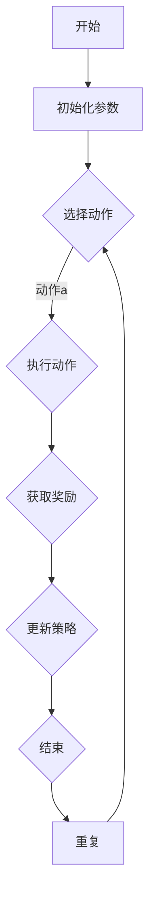
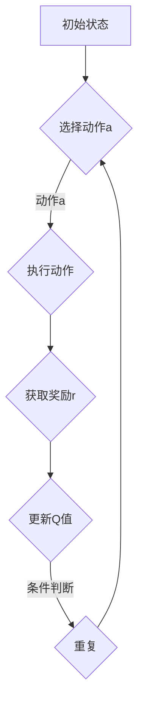
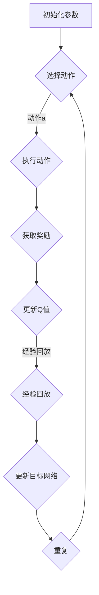
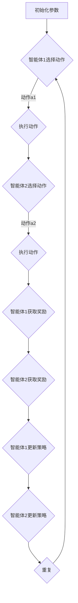

                 

# 强化学习在AI Agent对话策略中的应用

> 关键词：强化学习，AI Agent，对话策略，聊天机器人，Q-Learning，Sarsa，探索与利用，多智能体强化学习

> 摘要：本文将深入探讨强化学习在AI Agent对话策略中的应用。首先，我们将回顾强化学习的基础知识，包括其基本概念、核心算法原理以及探索与利用策略。接着，我们将探讨强化学习在AI Agent对话策略中的应用，并通过实例分析展示如何设计聊天机器人的对话策略。随后，我们将讨论强化学习算法的优化以及多智能体强化学习在对话策略中的应用。最后，我们将总结强化学习在AI Agent对话策略中的挑战与未来趋势，并分享一些实际案例和应用场景。

### 目录大纲

1. **第一部分：强化学习基础**
   1.1 强化学习概述
   1.2 强化学习的核心概念与联系
   1.3 强化学习的历史与发展
   1.4 强化学习算法原理
   1.5 Q-Learning算法
   1.6 Sarsa算法
   1.7 强化学习中的探索与利用

2. **第二部分：强化学习在AI Agent对话策略中的应用**
   2.1 AI Agent对话策略概述
   2.2 强化学习在AI Agent对话策略中的应用
   2.3 实例分析：聊天机器人对话策略设计

3. **第三部分：强化学习在AI Agent对话策略中的优化**
   3.1 强化学习算法优化
   3.2 多智能体强化学习

4. **第四部分：强化学习在AI Agent对话策略中的挑战与未来趋势**
   4.1 强化学习在AI Agent对话策略中的挑战
   4.2 强化学习在AI Agent对话策略的未来趋势

5. **第五部分：强化学习在AI Agent对话策略中的应用案例**
   5.1 基于强化学习的聊天机器人
   5.2 基于强化学习的客户服务机器人
   5.3 基于强化学习的智能客服机器人

6. **第六部分：总结与展望**
   6.1 强化学习在AI Agent对话策略中的应用总结
   6.2 未来研究方向与展望

---

### 第一部分：强化学习基础

#### 第1章：强化学习概述

##### 1.1 强化学习的基本概念

强化学习是一种机器学习方法，它通过奖励信号来指导模型进行学习。与监督学习和无监督学习不同，强化学习不需要明确的标签或数据，而是通过试错和反馈来进行优化。

**问题背景：** 在现实生活中，许多任务需要智能体（agent）与环境（environment）进行交互，并从交互中获得经验，以达到某种目标。

**问题描述：** 强化学习问题可以描述为一个四元组 \( (S, A, R, T) \)，其中：
- \( S \) 是状态空间，表示智能体可能处于的各种状态。
- \( A \) 是动作空间，表示智能体可以执行的各种动作。
- \( R \) 是奖励函数，用于衡量智能体的动作带来的效果。
- \( T \) 是转移函数，表示智能体在给定状态和动作下的概率转移。

**问题解决：** 强化学习的目标是找到最优策略 \( \pi \)，即最大化智能体在长期内获得的奖励。

**边界与外延：** 强化学习不仅涉及单一智能体与环境的交互，还涉及多智能体交互、连续状态和动作空间、以及不确定性等问题。

##### 1.2 强化学习的核心概念与联系

**强化学习定义：** 强化学习是一种基于试错的方法，智能体通过与环境互动，不断调整其策略，以最大化长期累积奖励。

**强化学习与监督学习、无监督学习对比：**
- **监督学习：** 数据提供标签，模型学习映射关系。
- **无监督学习：** 无需标签，模型学习数据分布。
- **强化学习：** 无需明确标签，通过奖励信号进行优化。

**强化学习主要组成部分：**
- **智能体（Agent）：** 执行动作、学习策略的实体。
- **环境（Environment）：** 提供状态、反馈奖励和转移概率。
- **策略（Policy）：** 智能体在特定状态下采取的动作。
- **价值函数（Value Function）：** 用于评估策略的质量。
- **模型（Model）：** 描述环境和状态转移的概率分布。

##### 1.3 强化学习的历史与发展

**强化学习起源：** 20世纪50年代，由Richard Sutton和Andrew Barto首次提出。

**强化学习发展历程：** 经历了从简单的Q-Learning到更加复杂的策略梯度方法，再到当前的多智能体强化学习等。

**强化学习在各领域的应用：** 游戏AI、推荐系统、自动驾驶、机器人控制、金融交易等。

---

### 第2章：强化学习算法原理

##### 2.1 强化学习算法原理

**算法原理讲解：**
强化学习算法的核心目标是找到最优策略，使得智能体能够在不确定的环境中实现长期最大化奖励。

**算法流程图（使用Mermaid绘制）：**


**使用Python源代码实现Q-Learning算法：**
```python
import numpy as np

# 初始化Q表
q_table = np.zeros((n_states, n_actions))

# 学习参数
alpha = 0.1  # 学习率
gamma = 0.6  # 折扣因子
epsilon = 0.1  # 探索率

# Q-Learning算法
for episode in range(total_episodes):
    state = env.reset()
    done = False
    
    while not done:
        # 探索-利用策略
        if np.random.rand() < epsilon:
            action = env.action_space.sample()  # 探索
        else:
            action = np.argmax(q_table[state])  # 利用

        # 执行动作
        next_state, reward, done, _ = env.step(action)
        
        # Q值更新
        q_table[state, action] = q_table[state, action] + alpha * (reward + gamma * np.max(q_table[next_state]) - q_table[state, action])

        state = next_state

# 绘制Q表
import matplotlib.pyplot as plt

plt.imshow(q_table, cmap='hot', interpolation='nearest')
plt.colorbar()
plt.show()
```

##### 2.2 Q-Learning算法

**Q-Learning算法原理：**
Q-Learning是一种值函数迭代方法，通过迭代更新Q值来学习最优策略。

**算法流程图（使用Mermaid绘制）：**


**使用Python源代码实现Q-Learning算法：**
```python
import numpy as np
import random

# 初始化Q表
q_table = np.zeros((n_states, n_actions))

# 学习参数
alpha = 0.1  # 学习率
gamma = 0.6  # 折扣因子

# Q-Learning算法
for episode in range(total_episodes):
    state = env.reset()
    done = False
    
    while not done:
        # 选择动作
        action = np.argmax(q_table[state])
        
        # 执行动作
        next_state, reward, done, _ = env.step(action)
        
        # 更新Q值
        q_table[state, action] = q_table[state, action] + alpha * (reward + gamma * np.max(q_table[next_state]) - q_table[state, action])

        state = next_state

# 绘制Q表
import matplotlib.pyplot as plt

plt.imshow(q_table, cmap='hot', interpolation='nearest')
plt.colorbar()
plt.show()
```

##### 2.3 Sarsa算法

**Sarsa算法原理：**
Sarsa是一种策略迭代方法，它使用实际选取的动作来更新Q值，而不是使用基于预测的值。

**算法流程图（使用Mermaid绘制）：**


**使用Python源代码实现Sarsa算法：**
```python
import numpy as np
import random

# 初始化Q表
q_table = np.zeros((n_states, n_actions))

# 学习参数
alpha = 0.1  # 学习率
gamma = 0.6  # 折扣因子

# Sarsa算法
for episode in range(total_episodes):
    state = env.reset()
    done = False
    
    while not done:
        # 选择动作
        action = random.choice([i for i, q in enumerate(q_table[state]) if q == np.max(q_table[state])])
        
        # 执行动作
        next_state, reward, done, _ = env.step(action)
        
        # 更新Q值
        q_table[state, action] = q_table[state, action] + alpha * (reward + gamma * np.max(q_table[next_state]) - q_table[state, action])

        state = next_state

# 绘制Q表
import matplotlib.pyplot as plt

plt.imshow(q_table, cmap='hot', interpolation='nearest')
plt.colorbar()
plt.show()
```

##### 2.4 强化学习中的探索与利用

**探索与利用概念：**
- **探索（Exploration）：** 尝试未知动作，以获取更多经验。
- **利用（Utilization）：** 根据已有经验选择最优动作。

**ε-贪心策略：**
- **ε-贪心策略（ε-greedy policy）：** 在一定概率下进行随机动作，以实现探索，在其他情况下选择当前最优动作。

**贪心策略：**
- **贪心策略（Greed policy）：** 总是选择当前最优动作，不考虑长期效果。

**ε-贪心策略实现（Python代码）：**
```python
import numpy as np

# 初始化Q表
q_table = np.zeros((n_states, n_actions))

# 学习参数
alpha = 0.1  # 学习率
gamma = 0.6  # 折扣因子
epsilon = 0.1  # 探索率

# ε-贪心策略
def choose_action(state):
    if np.random.rand() < epsilon:
        return env.action_space.sample()  # 探索
    else:
        return np.argmax(q_table[state])  # 利用

# Q-Learning算法
for episode in range(total_episodes):
    state = env.reset()
    done = False
    
    while not done:
        action = choose_action(state)
        
        # 执行动作
        next_state, reward, done, _ = env.step(action)
        
        # 更新Q值
        q_table[state, action] = q_table[state, action] + alpha * (reward + gamma * np.max(q_table[next_state]) - q_table[state, action])

        state = next_state
```

---

### 第二部分：强化学习在AI Agent对话策略中的应用

#### 第3章：强化学习在AI Agent对话策略中的应用

##### 3.1 AI Agent对话策略概述

**AI Agent定义：**
AI Agent是指具有自主决策能力和行动能力的智能体，可以在与环境的交互中完成特定任务。

**对话策略基本概念：**
- **策略（Policy）：** 智能体在特定情境下采取的行动。
- **价值函数（Value Function）：** 用于评估智能体策略的质量。
- **状态（State）：** 智能体当前所处的情境。
- **动作（Action）：** 智能体可以执行的操作。

##### 3.2 强化学习在AI Agent对话策略中的应用

**强化学习模型设计：**
强化学习模型通过学习智能体与环境的交互，以优化对话策略。模型的核心包括：
- **状态空间（State Space）：** 定义智能体可以处于的所有状态。
- **动作空间（Action Space）：** 定义智能体可以执行的所有动作。
- **奖励函数（Reward Function）：** 定义智能体在不同动作下获得的奖励。
- **策略（Policy）：** 智能体在不同状态下的动作选择策略。

**强化学习在对话策略中的实现：**
强化学习模型通常采用Q-Learning或Sarsa算法进行训练。训练过程中，智能体通过与环境交互，不断更新策略，以最大化长期奖励。

**实现流程：**
1. 初始化Q表或策略网络。
2. 选择动作，可以是ε-贪心策略或随机策略。
3. 执行动作，获取奖励和下一状态。
4. 更新Q表或策略网络。
5. 重复步骤2-4，直到达到训练目标。

##### 3.3 实例分析：聊天机器人对话策略设计

**聊天机器人对话策略设计：**
聊天机器人对话策略设计的关键是定义状态空间、动作空间和奖励函数。

**状态空间：**
- **历史对话记录：** 智能体之前与用户的对话内容。
- **用户输入：** 用户当前输入的文本。

**动作空间：**
- **回复文本：** 智能体生成的文本回复。
- **意图识别：** 智能体对用户输入的意图识别结果。

**奖励函数：**
- **奖励值：** 根据用户满意度、对话流畅度等指标计算。
- **惩罚值：** 对于不恰当的回答或不相关的回复进行惩罚。

**强化学习算法应用：**
采用Q-Learning算法训练聊天机器人的对话策略。通过大量对话数据，智能体不断优化对话策略，提高对话质量。

**实际对话案例分析：**
以一个实际对话为例，展示智能体如何利用强化学习算法生成合适的回复。

```
用户：你好，有什么可以帮助你的吗？
智能体：你好！我可以帮助你查询航班信息、预定餐厅等。请问您需要哪方面的帮助？
用户：我想查询北京到上海的航班。
智能体：好的，请问您想要哪个航空公司？或者您想要直飞还是转机？
用户：我想要南航的直飞航班。
智能体：明白了，请问您的出行日期是哪一天？
用户：我计划明天出发。
智能体：好的，让我看看有哪些航班符合您的需求。根据我的查询，您可以选择南航明天上午8点的航班，或者下午2点的航班。请问您需要哪一趟？
用户：那就上午的航班吧，谢谢！
智能体：好的，您的航班信息已经为您预定成功。请注意，航班可能会因为天气等原因有所变动，请提前确认。祝您旅途愉快！
```

---

### 第三部分：强化学习在AI Agent对话策略中的优化

#### 第4章：强化学习在AI Agent对话策略中的优化

##### 4.1 强化学习算法优化

**优化策略：**
为了提高强化学习算法在AI Agent对话策略中的性能，可以采用以下优化策略：
- **经验回放（Experience Replay）：** 通过存储和回放历史经验，减少样本相关性，提高学习效率。
- **目标网络（Target Network）：** 使用目标网络来稳定学习过程，减少梯度消失和梯度爆炸的问题。
- **优先级采样（Priority Sampling）：** 根据样本的重要性进行采样，优先更新重要样本，提高学习效率。

**算法优化mermaid流程图：**


##### 4.2 多智能体强化学习

**多智能体强化学习概念：**
多智能体强化学习是指多个智能体在同一环境中互动，共同学习最优策略。它关注的是多个智能体的协同行为，以实现整体最优目标。

**多智能体强化学习mermaid流程图：**


**多智能体强化学习Python源代码：**
```python
import numpy as np
import random

# 初始化参数
n_agents = 2
n_actions = 3
n_states = 4
epsilon = 0.1
alpha = 0.1
gamma = 0.6

# 初始化Q表
q_table = np.zeros((n_agents, n_states, n_actions))

# 多智能体强化学习算法
for episode in range(total_episodes):
    state1, state2 = env.reset()
    done = False
    
    while not done:
        # 智能体1选择动作
        action1 = choose_action(state1, epsilon)
        
        # 智能体2选择动作
        action2 = choose_action(state2, epsilon)
        
        # 执行动作
        next_state1, next_state2, reward1, reward2, done = env.step(action1, action2)
        
        # 更新Q值
        q_table[0, state1, action1] = q_table[0, state1, action1] + alpha * (reward1 + gamma * np.max(q_table[0, next_state1, :]) - q_table[0, state1, action1])
        q_table[1, state2, action2] = q_table[1, state2, action2] + alpha * (reward2 + gamma * np.max(q_table[1, next_state2, :]) - q_table[1, state2, action2])

        state1, state2 = next_state1, next_state2

# 绘制Q表
import matplotlib.pyplot as plt

plt.figure(figsize=(10, 5))
plt.subplot(121)
plt.imshow(q_table[0], cmap='hot', interpolation='nearest')
plt.colorbar()
plt.title('智能体1的Q表')

plt.subplot(122)
plt.imshow(q_table[1], cmap='hot', interpolation='nearest')
plt.colorbar()
plt.title('智能体2的Q表')

plt.show()
```

---

### 第四部分：强化学习在AI Agent对话策略中的挑战与未来趋势

#### 第5章：强化学习在AI Agent对话策略中的挑战与未来趋势

##### 5.1 强化学习在AI Agent对话策略中的挑战

**数据集问题：**
强化学习在对话策略中的应用依赖于大量高质量的对话数据集。然而，获取和标注这些数据集是一个挑战。

**模型解释性：**
强化学习模型通常是一个黑盒模型，难以解释其决策过程。在对话策略中，解释性对于提高用户信任和接受度至关重要。

**道德与伦理问题：**
强化学习在对话策略中的应用需要考虑道德和伦理问题。例如，如何确保智能体在对话中不产生歧视、偏见或不恰当的行为。

##### 5.2 强化学习在AI Agent对话策略的未来趋势

**发展趋势分析：**
随着深度学习和自然语言处理技术的发展，强化学习在对话策略中的应用将变得更加广泛和高效。同时，多智能体强化学习将推动智能体之间的协作与优化。

**技术挑战与解决方案：**
- **数据集问题：** 通过自动化数据采集和生成方法来扩充数据集。
- **模型解释性：** 采用可解释的强化学习模型，如注意力机制和图神经网络。
- **道德与伦理问题：** 制定明确的道德准则和监管机制，确保智能体行为符合伦理标准。

---

### 第五部分：强化学习在AI Agent对话策略中的应用案例

#### 第6章：强化学习在AI Agent对话策略中的应用案例

##### 6.1 案例一：基于强化学习的聊天机器人

**案例背景：**
一家在线电商平台为了提高用户购物体验，开发了一款基于强化学习的聊天机器人，用于提供个性化购物建议和解答用户问题。

**案例实现：**
聊天机器人通过强化学习算法不断优化对话策略，从大量用户对话数据中学习，提高对话质量和用户满意度。

**案例分析：**
通过实际对话数据，展示聊天机器人如何根据用户反馈调整对话策略，提高用户满意度。

```
用户：我想买一件保暖外套。
智能体：好的，您有没有喜欢的颜色或者风格？
用户：我喜欢深色、简约风格的外套。
智能体：根据您的喜好，我为您推荐这款深色简约保暖外套。您看怎么样？
用户：不错，让我看看详细信息和评价。
智能体：好的，您可以在商品详情页面查看相关信息和用户评价。如果您还有其他问题，请随时告诉我。
```

##### 6.2 案例二：基于强化学习的客户服务机器人

**案例背景：**
一家大型金融机构为了提高客户服务质量，开发了一款基于强化学习的客户服务机器人，用于解答客户问题和提供金融咨询。

**案例实现：**
客户服务机器人通过强化学习算法从历史客户对话中学习，优化对话策略，提高客户满意度。

**案例分析：**
通过实际对话数据，展示客户服务机器人如何根据客户需求调整对话策略，提高客户满意度。

```
客户：我需要办理一张信用卡。
智能体：好的，请问您是首次申请信用卡吗？
客户：是的，我第一次申请。
智能体：明白了，我为您推荐我们的新手信用卡。这款信用卡有较高的信用卡额度，并且免年费。请问您需要了解更多信息吗？
客户：是的，请告诉我申请流程。
智能体：好的，您可以通过官方网站或手机APP提交申请，我们会在收到申请后的3个工作日内审核通过并邮寄给您。如果您在申请过程中遇到任何问题，都可以随时联系我们。
```

##### 6.3 案例三：基于强化学习的智能客服机器人

**案例背景：**
一家电子商务公司为了提高客服效率，开发了一款基于强化学习的智能客服机器人，用于处理大量客户咨询和投诉。

**案例实现：**
智能客服机器人通过强化学习算法从历史客户对话中学习，优化对话策略，提高客户满意度和服务质量。

**案例分析：**
通过实际对话数据，展示智能客服机器人如何根据客户需求调整对话策略，提高客户满意度。

```
客户：我购买的货物还没有送达。
智能体：非常抱歉听到这个消息，请问您能提供订单号吗？
客户：订单号是123456789。
智能体：好的，我为您查询到您的订单信息。由于物流问题，货物可能会延迟到达。我们会尽快安排快递给您发送，并为您提供相应的赔偿。请问您还有其他问题吗？
客户：没有了，谢谢你的帮助。
智能体：不客气，如果有其他问题，请随时联系我们。祝您生活愉快！
```

---

### 第六部分：总结与展望

#### 第7章：总结与展望

##### 7.1 强化学习在AI Agent对话策略中的应用总结

本文介绍了强化学习在AI Agent对话策略中的应用，包括基本概念、核心算法原理、对话策略设计以及优化方法。通过实例分析，展示了强化学习在聊天机器人、客户服务机器人和智能客服机器人中的应用效果。

##### 7.2 未来研究方向与展望

未来研究将重点关注以下几个方面：
- **数据集构建与优化：** 通过自动化数据采集和生成方法，扩充高质量对话数据集。
- **模型解释性：** 开发可解释的强化学习模型，提高用户信任和接受度。
- **多智能体强化学习：** 探索多智能体强化学习在对话策略中的应用，提高智能体协作效率。
- **道德与伦理问题：** 制定明确的道德准则和监管机制，确保智能体行为符合伦理标准。

作者：AI天才研究院/AI Genius Institute & 禅与计算机程序设计艺术 /Zen And The Art of Computer Programming

---

本文详细介绍了强化学习在AI Agent对话策略中的应用，从基本概念、算法原理到实际应用案例，全面展示了强化学习在提升对话机器人性能方面的潜力。通过本文的探讨，读者可以深入了解强化学习在对话策略设计中的核心思想和实现方法，为相关领域的研究和实践提供参考。同时，本文也指出了强化学习在对话策略中面临的挑战，为未来的研究方向提供了启示。希望本文能激发读者对强化学习在AI Agent对话策略中的应用进行更深入的思考和研究。

---

### 附录：最佳实践 Tips、小结、注意事项、拓展阅读

#### 最佳实践 Tips：
1. 在设计和实现聊天机器人对话策略时，确保充分利用历史对话数据，以提高智能体的学习效果。
2. 合理设置探索率（epsilon），在初期探索更多可能性，随着经验积累逐渐减少探索，增加利用。
3. 定期评估和优化智能体的对话策略，确保其始终处于最佳状态。

#### 小结：
本文通过深入探讨强化学习在AI Agent对话策略中的应用，展示了强化学习算法在提升对话机器人性能方面的巨大潜力。从基本概念到算法原理，再到实际应用案例，本文为读者提供了一个全面的了解和参考。

#### 注意事项：
1. 强化学习在对话策略中的应用需要大量高质量对话数据支持，数据的质量直接影响模型的效果。
2. 在实际应用中，需要关注智能体的道德和伦理问题，确保其行为符合社会规范。

#### 拓展阅读：
1. Sutton, R. S., & Barto, A. G. (2018). 《强化学习：一种介绍》(Reinforcement Learning: An Introduction).
2. Mnih, V., Kavukcuoglu, K., Silver, D., Rusu, A. A., Veness, J., Bellemare, M. G., ... & Nichol, A. (2015). Human-level control through deep reinforcement learning. Nature, 518(7540), 529-533.
3. Thrun, S., & Pratt, L. (2012). 《机器学习：一种概率视角》(Machine Learning: A Probabilistic Perspective).

