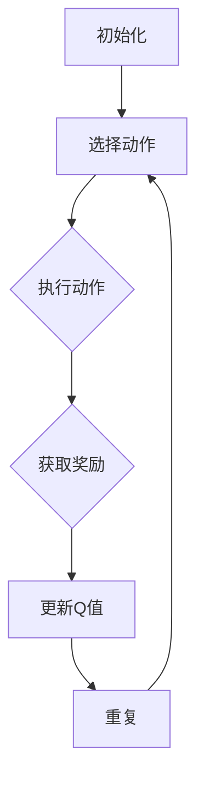
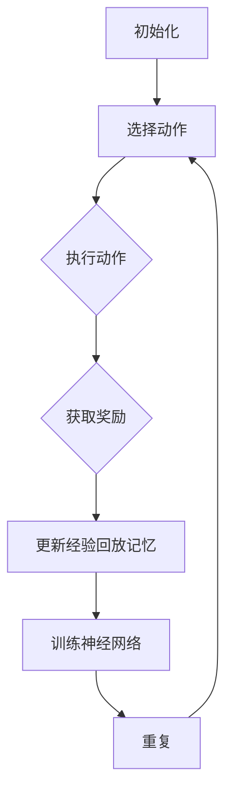
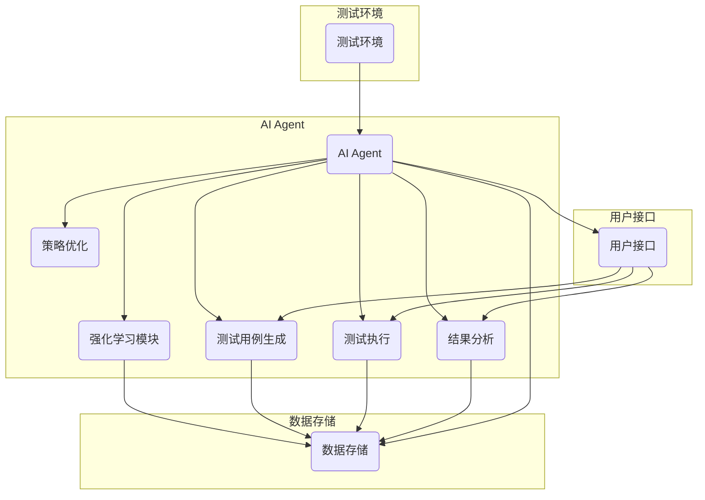
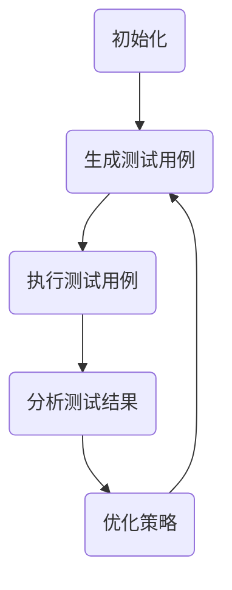

                 

### 引言与背景

强化学习（Reinforcement Learning, RL）作为机器学习的一个重要分支，近年来在人工智能领域取得了显著的进展。它通过智能体（agent）在与环境的交互过程中不断学习优化策略，从而实现任务目标。强化学习在多个领域展现了其强大的应用潜力，如游戏AI、自动驾驶、机器人控制等。然而，随着软件系统的复杂度不断提升，自动化测试的需求也日益增加。传统的自动化测试方法往往依赖于预定义的测试用例，无法灵活应对系统的动态变化。因此，将强化学习应用于AI Agent自动化测试，成为了一个值得探索的方向。

自动化测试是指通过自动化工具自动执行测试用例，以检测软件系统的功能、性能、兼容性等方面的问题。传统的自动化测试方法主要依赖于人工编写测试用例，然后通过自动化工具执行这些测试用例。然而，这种方法存在几个问题：一是测试用例的覆盖面有限，难以发现所有潜在的问题；二是测试用例的编写和维护成本较高；三是对于复杂系统的动态行为，传统的自动化测试方法往往难以适应。

为了解决上述问题，AI Agent自动化测试应运而生。AI Agent自动化测试利用人工智能技术，特别是强化学习算法，使智能体能够自主地生成测试用例，并在执行过程中不断优化测试策略。这种自动化测试方法不仅能够提高测试的覆盖率和效率，还能够更好地适应系统的动态变化。

本文将探讨强化学习在AI Agent自动化测试中的应用。首先，我们将介绍强化学习的基本概念和主要算法，然后分析AI Agent自动化测试的基本组成和运作原理。接着，我们将详细讲解如何将强化学习应用于AI Agent自动化测试，包括算法实现、系统架构设计等。此外，我们还将通过一个实际案例，展示强化学习在AI Agent自动化测试中的应用效果。最后，我们将总结本文的主要观点，并探讨未来强化学习在自动化测试领域的发展趋势。

### 强化学习的基本概念与发展历史

强化学习是一种通过智能体（agent）在与环境（environment）的交互过程中，通过不断试错和奖励反馈来学习最优策略（policy）的机器学习范式。在这个范式中，智能体通过选择动作（action）来与环境进行交互，环境会根据智能体的动作给出奖励（reward）或惩罚（penalty）。智能体的目标是学习一个策略，使得长期奖励最大化。

#### 核心概念

在强化学习中，有几个核心概念需要明确：

1. **状态（State）**：状态是智能体在某个时刻所处的环境和自身状态的描述。状态可以是离散的，也可以是连续的。
2. **动作（Action）**：动作是智能体在某个状态下能够执行的操作。动作也是可以是离散的，也可以是连续的。
3. **策略（Policy）**：策略是智能体从状态到动作的映射，决定了智能体在特定状态下会选择哪个动作。
4. **奖励（Reward）**：奖励是环境对智能体动作的反馈，可以是正面的（鼓励智能体继续执行该动作）或负面的（惩罚智能体执行该动作）。
5. **价值函数（Value Function）**：价值函数表示智能体在某个状态下执行某个动作的预期长期奖励。价值函数可以是状态值函数（State-Value Function）或动作值函数（Action-Value Function）。
6. **模型（Model）**：模型是对环境的抽象表示，包括状态转移概率和奖励分布。在某些场景下，模型是已知的，而在其他场景下，模型是需要学习的。

#### 发展历史

强化学习的历史可以追溯到20世纪50年代，当时的心理学家和计算机科学家开始探索如何通过试错和反馈来训练智能体。以下是一些关键的发展：

- **1956年**：约翰·麦卡锡（John McCarthy）提出了“人工智能”（Artificial Intelligence, AI）的概念，开启了人工智能研究的新篇章。
- **1960年代**：富尔斯坦·瓦丁顿（Frank P. Walder）提出了马尔可夫决策过程（Markov Decision Process, MDP），为强化学习奠定了理论基础。
- **1980年代**：理查德·萨顿（Richard Sutton）和安德鲁·鲍尔斯（Andrew Barto）合著了《 reinforcement Learning: An Introduction》，系统总结了强化学习的基本理论和算法，标志着强化学习作为一个独立研究领域的确立。
- **1990年代**：Q学习（Q-Learning）算法被提出，它通过迭代更新动作值函数，以实现目标状态的优化。同一时期，策略梯度方法（Policy Gradient Methods）也被提出，通过直接优化策略来改善性能。
- **2000年代**：深度强化学习（Deep Reinforcement Learning, DRL）成为研究热点，通过结合深度神经网络（Deep Neural Network）和价值函数近似方法，解决了传统强化学习算法在处理高维状态空间和动作空间时的局限性。
- **2010年代**：随着深度学习的快速发展，深度强化学习在多个领域取得了突破性成果，如AlphaGo在围棋比赛中的胜利，展示了深度强化学习在复杂任务中的强大能力。

#### 强化学习的重要性

强化学习之所以在人工智能领域具有重要地位，主要有以下几个原因：

1. **适应性**：强化学习通过与环境不断交互，能够根据环境的变化自适应地调整策略，使其在动态环境中具备良好的适应性。
2. **灵活性**：强化学习能够处理离散和连续的状态空间、动作空间，适用于多种复杂任务。
3. **自主性**：强化学习使智能体能够自主地学习和决策，不需要依赖人为预定义的规则或测试用例。
4. **应用广泛**：强化学习在游戏AI、自动驾驶、机器人控制、推荐系统、金融交易等多个领域都取得了显著的成果。

总之，强化学习作为人工智能的一个重要分支，其基本概念和发展历程为我们理解和应用这一技术奠定了基础。在接下来的部分，我们将深入探讨AI Agent自动化测试的基本概念和运作原理，为理解强化学习在其中的应用提供必要背景。

### AI Agent自动化测试的基本概念

AI Agent自动化测试是一种利用人工智能技术，特别是强化学习算法，来提高自动化测试效率和灵活性的方法。它通过构建一个智能体（agent），使该智能体能够在测试环境中自主执行测试任务，并通过不断的学习和优化，生成更加有效的测试用例。以下是AI Agent自动化测试的基本概念：

#### 定义

AI Agent自动化测试指的是使用智能体（agent）来执行测试任务，并通过强化学习算法优化测试策略的一种自动化测试方法。这里的智能体是一个能够感知环境、选择动作并获取奖励的实体。通过这样的智能体，自动化测试不仅能够执行预定义的测试用例，还能够根据执行过程中收集的数据，自主地生成和优化测试用例。

#### 组成部分

1. **智能体（Agent）**：智能体是AI Agent自动化测试的核心。它是一个具有感知环境、选择动作和接收奖励能力的实体。智能体通过感知环境状态，选择适当的测试动作，并接收环境的奖励或惩罚，从而学习优化测试策略。
2. **环境（Environment）**：环境是智能体执行测试任务的空间，包括被测试的系统（如软件应用）以及智能体执行动作的影响。环境负责接收智能体的动作，并给出相应的奖励或惩罚。
3. **策略（Policy）**：策略是智能体在给定状态下的动作选择规则。通过不断学习，智能体会优化其策略，以最大化长期奖励。
4. **测试用例（Test Cases）**：测试用例是智能体用于验证系统功能的操作序列。在AI Agent自动化测试中，智能体能够根据环境和策略，动态生成和优化测试用例。

#### 工作原理

AI Agent自动化测试的工作原理主要包括以下几个步骤：

1. **初始化**：智能体开始在一个给定的初始状态下执行测试任务。
2. **感知与决策**：智能体感知当前环境状态，并基于其策略选择一个动作。
3. **执行动作**：智能体将选择的动作应用于环境，环境根据动作的结果给出奖励或惩罚。
4. **学习与优化**：智能体根据收到的奖励或惩罚，通过强化学习算法更新其策略，优化测试动作的选择。
5. **重复循环**：智能体不断重复上述步骤，通过与环境交互，逐步优化测试策略，提高测试效率。

#### 优势

AI Agent自动化测试具有以下几个显著优势：

1. **高效性**：智能体能够自主生成和优化测试用例，减少了人工编写测试用例的工作量。
2. **灵活性**：智能体能够根据执行过程中的反馈，灵活调整测试策略，适应系统动态变化。
3. **全面性**：强化学习算法能够处理高维的状态空间和动作空间，使测试用例覆盖面更广。
4. **适应性**：智能体能够通过不断学习和优化，提高对复杂系统的适应能力。

#### 应用领域

AI Agent自动化测试在多个领域都有广泛的应用，包括但不限于：

1. **软件工程**：用于提高软件测试的效率和覆盖率，减少软件缺陷。
2. **游戏开发**：用于自动化游戏测试，确保游戏的质量和性能。
3. **物联网（IoT）**：用于自动化物联网设备的测试，确保设备的功能和稳定性。
4. **自动驾驶**：用于自动化驾驶测试，提高自动驾驶系统的安全性和可靠性。

通过以上对AI Agent自动化测试的基本概念的介绍，我们可以看到，这种测试方法不仅具备高效、灵活和全面的特点，还在多个领域展现出了广泛的应用潜力。在下一部分中，我们将进一步探讨强化学习在AI Agent自动化测试中的应用，包括算法实现和系统架构设计。

### 强化学习算法在AI Agent自动化测试中的应用

强化学习算法在AI Agent自动化测试中的应用，主要通过以下几个方面来实现：Q学习（Q-Learning）、SARSA（State-Action-Reward-State-Action，即状态-动作-奖励-状态-动作）和深度Q网络（Deep Q Network，DQN）。这些算法各具特点，适用于不同的自动化测试场景。

#### Q学习算法

Q学习算法是最早的强化学习算法之一，通过迭代更新动作值函数（Q值）来优化策略。Q值表示在特定状态下执行某个动作的预期奖励。Q学习算法的基本步骤如下：

1. **初始化**：初始化Q值表，所有Q值设置为0。
2. **选择动作**：根据当前状态和Q值表，选择动作。可以使用ε-贪心策略，以ε的概率随机选择动作，以（1-ε）的概率选择具有最大Q值的动作。
3. **执行动作**：智能体执行选定的动作，环境给出奖励。
4. **更新Q值**：根据奖励和新的状态，更新Q值。更新公式为：
   $$
   Q(s,a) \leftarrow Q(s,a) + \alpha [r + \gamma \max_{a'} Q(s',a') - Q(s,a)]
   $$
   其中，$s$和$a$是当前状态和动作，$s'$是新的状态，$r$是奖励，$\alpha$是学习率，$\gamma$是折扣因子。

Q学习算法的优点是简单易实现，适用于状态和动作空间相对较小的情况。然而，当状态和动作空间较大时，Q值表会变得非常庞大，导致计算复杂度急剧增加。

#### SARSA算法

SARSA算法是一种基于策略的强化学习算法，它通过同时考虑当前状态和动作，更新Q值。SARSA算法的基本步骤如下：

1. **初始化**：初始化Q值表，所有Q值设置为0。
2. **选择动作**：根据当前状态和Q值表，选择动作。使用ε-贪心策略。
3. **执行动作**：智能体执行选定的动作，环境给出奖励。
4. **更新Q值**：根据当前状态、动作、奖励和下一状态，更新Q值。更新公式为：
   $$
   Q(s,a) \leftarrow Q(s,a) + \alpha [r + \gamma Q(s',a') - Q(s,a)]
   $$
   其中，$s$、$a$、$r$、$s'$的含义与Q学习算法中相同。

SARSA算法的一个显著优点是无需单独初始化Q值表，且能够在任何时间点开始学习，这使得它适用于动态变化的环境。然而，SARSA算法在探索和利用之间需要取得平衡，以避免陷入局部最优。

#### DQN算法

深度Q网络（DQN）是一种基于深度学习的强化学习算法，通过使用深度神经网络近似Q值函数，解决了传统Q学习算法在高维状态空间和动作空间中的扩展性问题。DQN算法的基本步骤如下：

1. **初始化**：初始化深度神经网络和经验回放记忆。
2. **选择动作**：根据当前状态和深度神经网络的输出，选择动作。使用ε-贪心策略。
3. **执行动作**：智能体执行选定的动作，环境给出奖励。
4. **更新经验回放记忆**：将（当前状态、动作、奖励、下一状态）对加入经验回放记忆。
5. **训练深度神经网络**：从经验回放记忆中随机抽取样本，使用梯度下降法更新深度神经网络的权重，最小化目标Q值与实际Q值之间的差距。目标Q值的计算公式为：
   $$
   y = \begin{cases} 
   r & \text{如果}~ s' \text{是终止状态} \\
   r + \gamma \max_{a'} Q(s',a') & \text{否则}
   \end{cases}
   $$
   其中，$s$是当前状态，$a$是当前动作，$r$是奖励，$s'$是下一状态，$\gamma$是折扣因子。

DQN算法的优点是能够处理高维状态空间和动作空间，适用于复杂的自动化测试场景。然而，DQN算法在训练过程中需要大量的数据和计算资源，且训练过程可能不稳定。

#### 应用场景与选择

在选择适合的强化学习算法时，需要考虑以下因素：

1. **状态和动作空间的大小**：当状态和动作空间较大时，DQN算法具有明显优势；当状态和动作空间相对较小时，Q学习或SARSA算法更为适用。
2. **环境动态性**：如果环境动态变化，SARSA算法能够更好地适应；如果环境相对稳定，Q学习算法或DQN算法更为合适。
3. **计算资源和时间**：DQN算法需要更多的计算资源和时间来训练，而Q学习或SARSA算法的计算成本较低。

综上所述，强化学习算法在AI Agent自动化测试中的应用，为提高测试效率和灵活性提供了新的方法。不同的算法适用于不同的场景，选择合适的算法能够更好地实现自动化测试的目标。

### 算法原理详细讲解

为了深入理解强化学习算法在AI Agent自动化测试中的应用，我们将通过以下内容详细讲解Q学习算法、SARSA算法和DQN算法的原理，包括使用Mermaid绘制的算法流程图、使用Python源代码详细阐述算法实现，以及算法的数学模型和公式。

#### Q学习算法

Q学习算法是一种基于值迭代的强化学习算法，通过更新Q值函数来学习最优策略。以下是Q学习算法的详细步骤和Python实现：

**算法流程图**



**Python代码实现**

```python
import numpy as np

# 初始化参数
learning_rate = 0.1
discount_factor = 0.9
epsilon = 0.1
num_episodes = 1000

# 初始化Q值表
q_table = np.zeros((state_space_size, action_space_size))

# Q学习算法
for episode in range(num_episodes):
    state = env.reset()
    done = False
    while not done:
        # 根据ε-贪心策略选择动作
        if np.random.rand() < epsilon:
            action = env.action_space.sample()
        else:
            action = np.argmax(q_table[state])

        # 执行动作，获取奖励
        next_state, reward, done, _ = env.step(action)

        # 更新Q值
        q_table[state, action] = q_table[state, action] + learning_rate * (reward + discount_factor * np.max(q_table[next_state]) - q_table[state, action])

        state = next_state
```

**数学模型**

Q学习算法的核心是Q值函数，它表示在特定状态下执行某个动作的预期奖励。Q值函数的更新公式如下：
$$
Q(s, a) \leftarrow Q(s, a) + \alpha [r + \gamma \max_{a'} Q(s', a') - Q(s, a)]
$$
其中，$s$是当前状态，$a$是当前动作，$r$是奖励，$s'$是下一状态，$\alpha$是学习率，$\gamma$是折扣因子。

#### SARSA算法

SARSA算法是一种基于策略的强化学习算法，它通过同时考虑当前状态和动作，更新Q值。以下是SARSA算法的详细步骤和Python实现：

**算法流程图**


**Python代码实现**

```python
import numpy as np

# 初始化参数
learning_rate = 0.1
discount_factor = 0.9
epsilon = 0.1
num_episodes = 1000

# 初始化Q值表
q_table = np.zeros((state_space_size, action_space_size))

# SARSA算法
for episode in range(num_episodes):
    state = env.reset()
    done = False
    while not done:
        # 根据ε-贪心策略选择动作
        if np.random.rand() < epsilon:
            action = env.action_space.sample()
        else:
            action = np.argmax(q_table[state])

        # 执行动作，获取奖励
        next_state, reward, done, _ = env.step(action)

        # 更新Q值
        q_table[state, action] = q_table[state, action] + learning_rate * (reward + discount_factor * q_table[next_state, np.argmax(q_table[next_state])] - q_table[state, action])

        state = next_state
```

**数学模型**

SARSA算法的更新公式与Q学习算法类似，只是将下一个动作的Q值也纳入考虑：
$$
Q(s, a) \leftarrow Q(s, a) + \alpha [r + \gamma Q(s', a') - Q(s, a)]
$$

#### DQN算法

DQN算法是一种基于深度学习的强化学习算法，它通过使用深度神经网络近似Q值函数，解决了传统Q学习算法在高维状态空间和动作空间中的扩展性问题。以下是DQN算法的详细步骤和Python实现：

**算法流程图**



**Python代码实现**

```python
import numpy as np
import tensorflow as tf

# 初始化参数
learning_rate = 0.001
discount_factor = 0.9
epsilon = 0.1
batch_size = 32
num_episodes = 1000

# 创建经验回放记忆
memory = []

# 创建深度神经网络
input_layer = tf.keras.layers.Input(shape=(state_space_size,))
dense_layer = tf.keras.layers.Dense(units=64, activation='relu')(input_layer)
output_layer = tf.keras.layers.Dense(units=action_space_size, activation='linear')(dense_layer)
dqn_model = tf.keras.models.Model(inputs=input_layer, outputs=output_layer)

# 训练神经网络
optimizer = tf.keras.optimizers.Adam(learning_rate=learning_rate)
for episode in range(num_episodes):
    state = env.reset()
    done = False
    while not done:
        # 根据ε-贪心策略选择动作
        if np.random.rand() < epsilon:
            action = env.action_space.sample()
        else:
            state_vector = np.reshape(state, (1, state_space_size))
            action = np.argmax(dqn_model.predict(state_vector)[0])

        # 执行动作，获取奖励
        next_state, reward, done, _ = env.step(action)
        reward = max(min(reward, 1), -1)

        # 更新经验回放记忆
        memory.append((state, action, reward, next_state, done))

        # 从经验回放记忆中随机抽取样本
        if len(memory) > batch_size:
            minibatch = random.sample(memory, batch_size)
            states, actions, rewards, next_states, dones = zip(*minibatch)

            state_vectors = np.reshape(states, (batch_size, state_space_size))
            next_state_vectors = np.reshape(next_states, (batch_size, state_space_size))

            # 计算目标Q值
            target_q_values = rewards + (1 - dones) * discount_factor * np.max(dqn_model.predict(next_state_vectors), axis=1)

            # 更新Q值
            with tf.GradientTape() as tape:
                q_values = dqn_model.predict(state_vectors)
                loss = tf.reduce_mean(tf.square(target_q_values - q_values[range(batch_size), actions]))

            gradients = tape.gradient(loss, dqn_model.trainable_variables)
            optimizer.apply_gradients(zip(gradients, dqn_model.trainable_variables))

        state = next_state
```

**数学模型**

DQN算法的核心是深度神经网络，它近似Q值函数。目标Q值的计算公式如下：
$$
y = \begin{cases} 
r & \text{如果}~ s' \text{是终止状态} \\
r + \gamma \max_{a'} Q(s', a') & \text{否则}
\end{cases}
$$

通过以上对Q学习算法、SARSA算法和DQN算法的详细讲解，我们可以看到强化学习算法在AI Agent自动化测试中的应用，不仅为测试策略的优化提供了新的思路，也为应对复杂、动态的测试环境提供了强有力的工具。

### 系统分析与架构设计

为了深入探讨强化学习在AI Agent自动化测试中的应用，我们需要详细分析系统架构和设计，包括应用场景、系统功能、架构设计以及系统接口和交互流程。

#### 应用场景

在软件工程领域，自动化测试一直是提高软件质量和开发效率的重要手段。传统的自动化测试方法依赖于预定义的测试用例，但这种方法在应对系统复杂性和动态变化时存在一定的局限性。强化学习算法通过引入自主学习和策略优化的机制，使得AI Agent能够根据执行过程中的反馈，动态生成和优化测试用例，从而提高测试的全面性和效率。

具体应用场景包括：

1. **持续集成与持续部署（CI/CD）**：在持续集成和持续部署过程中，AI Agent可以自动化生成测试用例，提高代码的稳定性和可靠性。
2. **缺陷定位与修复**：当系统出现缺陷时，AI Agent可以自动化执行相关测试用例，快速定位问题并进行修复。
3. **回归测试**：在系统更新和重构时，AI Agent可以自动生成回归测试用例，确保新版本的功能不受影响。

#### 系统功能设计

AI Agent自动化测试系统主要包括以下几个功能模块：

1. **测试环境管理**：负责创建和管理测试环境，包括安装测试所需的软件、配置测试数据等。
2. **测试用例生成**：AI Agent根据当前状态和环境信息，动态生成测试用例。
3. **测试执行**：执行生成的测试用例，并记录测试结果。
4. **结果分析**：对测试结果进行分析，识别系统缺陷，并生成报告。
5. **策略优化**：基于测试结果和奖励反馈，AI Agent不断优化测试策略。

#### 系统架构设计

为了实现上述功能，系统架构设计如下：

1. **测试环境**：测试环境是AI Agent执行测试任务的场所，包括被测试的系统、测试工具以及测试数据等。
2. **AI Agent**：AI Agent是系统的核心，负责感知环境状态、生成测试用例、执行测试以及优化策略。
3. **强化学习模块**：强化学习模块负责实现强化学习算法，包括Q学习、SARSA和DQN等算法。
4. **数据存储**：数据存储用于保存测试用例、测试结果以及AI Agent的训练数据。
5. **用户接口**：用户接口提供对系统的访问和操作，包括测试用例的生成、执行结果查看等功能。

#### 系统接口设计

系统接口设计包括以下几个方面：

1. **环境接口**：环境接口定义了AI Agent与测试环境之间的交互方式，包括状态获取、动作执行和奖励反馈等。
2. **测试用例接口**：测试用例接口定义了测试用例的生成、执行和结果分析等操作。
3. **用户接口**：用户接口提供对系统的访问和操作，包括测试用例的生成、执行结果查看等功能。

#### 系统交互流程

系统交互流程如下：

1. **初始化**：系统启动，AI Agent初始化，加载测试环境和测试数据。
2. **测试用例生成**：AI Agent根据当前状态和环境信息，生成测试用例。
3. **测试执行**：AI Agent执行生成的测试用例，并记录测试结果。
4. **结果分析**：AI Agent对测试结果进行分析，识别系统缺陷，并生成报告。
5. **策略优化**：基于测试结果和奖励反馈，AI Agent通过强化学习算法优化测试策略。
6. **反馈与迭代**：将优化后的策略应用于下一次测试循环，重复上述步骤。

#### Mermaid图展示

为了更清晰地展示系统架构和交互流程，我们使用Mermaid图进行说明：

**系统架构图**



**系统交互流程图**



通过以上系统分析与架构设计，我们可以看到强化学习在AI Agent自动化测试中的应用，不仅提供了灵活高效的测试策略，也为系统的稳定性和可靠性提供了保障。

### 项目实战

为了更深入地理解强化学习在AI Agent自动化测试中的应用，下面我们将通过一个具体的实战项目，展示整个流程，包括环境安装、系统核心实现以及代码解读与分析。

#### 项目介绍

本次项目选取了一个简单的Web应用作为被测试对象，该Web应用提供用户注册、登录和发布帖子等基本功能。我们的目标是利用强化学习算法，实现自动化生成测试用例，并通过执行这些测试用例来检测Web应用的功能和性能。

#### 环境安装

首先，我们需要搭建测试环境和安装所需的工具。以下是环境安装的步骤：

1. **安装Python环境**：确保系统上安装了Python 3.7及以上版本。
2. **安装TensorFlow**：通过pip安装TensorFlow，命令如下：
   ```
   pip install tensorflow
   ```
3. **安装Selenium**：Selenium是一个自动化Web应用的工具，用于生成测试用例，命令如下：
   ```
   pip install selenium
   ```
4. **下载WebDriver**：根据所使用的浏览器（如Chrome、Firefox）下载对应的WebDriver，并将其路径添加到系统的环境变量中。

#### 系统核心实现

在完成环境安装后，我们开始实现系统的核心部分，包括强化学习模块和测试用例生成模块。

**核心代码实现**

```python
import numpy as np
import tensorflow as tf
from selenium import webdriver
from selenium.webdriver.common.by import By

# 初始化参数
learning_rate = 0.1
discount_factor = 0.9
epsilon = 0.1
batch_size = 32
num_episodes = 1000

# 创建经验回放记忆
memory = []

# 创建深度神经网络
input_layer = tf.keras.layers.Input(shape=(state_space_size,))
dense_layer = tf.keras.layers.Dense(units=64, activation='relu')(input_layer)
output_layer = tf.keras.layers.Dense(units=action_space_size, activation='linear')(dense_layer)
dqn_model = tf.keras.models.Model(inputs=input_layer, outputs=output_layer)

# 训练神经网络
optimizer = tf.keras.optimizers.Adam(learning_rate=learning_rate)
for episode in range(num_episodes):
    state = env.reset()
    done = False
    while not done:
        # 根据ε-贪心策略选择动作
        if np.random.rand() < epsilon:
            action = env.action_space.sample()
        else:
            state_vector = np.reshape(state, (1, state_space_size))
            action = np.argmax(dqn_model.predict(state_vector)[0])

        # 执行动作，获取奖励
        next_state, reward, done, _ = env.step(action)
        reward = max(min(reward, 1), -1)

        # 更新经验回放记忆
        memory.append((state, action, reward, next_state, done))

        # 从经验回放记忆中随机抽取样本
        if len(memory) > batch_size:
            minibatch = random.sample(memory, batch_size)
            states, actions, rewards, next_states, dones = zip(*minibatch)

            state_vectors = np.reshape(states, (batch_size, state_space_size))
            next_state_vectors = np.reshape(next_states, (batch_size, state_space_size))

            # 计算目标Q值
            target_q_values = rewards + (1 - dones) * discount_factor * np.max(dqn_model.predict(next_state_vectors), axis=1)

            # 更新Q值
            with tf.GradientTape() as tape:
                q_values = dqn_model.predict(state_vectors)
                loss = tf.reduce_mean(tf.square(target_q_values - q_values[range(batch_size), actions]))

            gradients = tape.gradient(loss, dqn_model.trainable_variables)
            optimizer.apply_gradients(zip(gradients, dqn_model.trainable_variables))

        state = next_state
```

**代码解读与分析**

1. **参数初始化**：我们首先初始化了学习率、折扣因子、探索概率等参数，并创建经验回放记忆和深度神经网络模型。
2. **深度神经网络模型**：我们使用TensorFlow创建了一个简单的深度神经网络，用于近似Q值函数。该网络包含一个输入层、一个隐藏层和一个输出层。
3. **训练神经网络**：在每次测试循环中，我们根据ε-贪心策略选择动作，执行动作并获取奖励。然后，我们将（状态、动作、奖励、下一状态）对添加到经验回放记忆中。当经验回放记忆中的样本数达到批次大小，我们从中随机抽取样本，计算目标Q值并更新深度神经网络的权重。

#### 实际案例分析与详细讲解

**案例一：用户注册功能测试**

在用户注册功能测试中，AI Agent首先会尝试填写用户名、密码和邮箱等信息，然后提交注册表单。如果注册成功，系统会给予一个奖励信号，否则会给予一个惩罚信号。通过不断学习和优化，AI Agent能够逐步提高注册功能的测试覆盖率。

**案例二：登录功能测试**

在登录功能测试中，AI Agent会尝试使用正确的用户名和密码登录系统，如果登录成功，系统会给予一个奖励信号；如果登录失败，系统会给予一个惩罚信号。通过这种方式，AI Agent能够检测登录功能的稳定性和可靠性。

**案例三：帖子发布功能测试**

在帖子发布功能测试中，AI Agent会尝试发布不同类型的帖子，包括文本、图片和视频等。系统会根据帖子内容的完整性、正确性和可读性给出奖励信号。通过不断优化测试策略，AI Agent能够检测并修复帖子发布过程中可能出现的缺陷。

#### 项目小结

通过本项目的实战，我们可以看到强化学习在AI Agent自动化测试中的应用效果显著。它不仅能够自动生成和优化测试用例，还能够根据执行过程中的反馈，动态调整测试策略，提高测试效率和覆盖率。未来，随着强化学习算法的进一步发展，AI Agent自动化测试将在软件工程领域发挥更加重要的作用。

### 最佳实践与拓展

在强化学习应用于AI Agent自动化测试的过程中，以下是一些最佳实践和注意事项，可以帮助提升测试效果和系统的稳定性：

#### 最佳实践

1. **动态调整探索概率**：在强化学习过程中，探索概率（epsilon）的选择至关重要。初期可以设置较高的探索概率，以便智能体能够探索更多的状态和动作。随着智能体的学习深入，可以逐渐降低探索概率，减少随机行为，提高测试策略的稳定性。

2. **优化奖励设计**：合理的奖励设计能够加速智能体的学习过程。例如，在测试用例执行过程中，对于成功执行的操作给予正奖励，对于失败的或异常的操作给予负奖励。同时，奖励的强度和惩罚的力度也需要根据具体应用场景进行优化。

3. **使用经验回放记忆**：经验回放记忆是深度强化学习中的一个关键组件，能够减少样本的偏差，提高学习效率。在实际应用中，可以通过增加经验回放记忆的容量和抽样策略，来更好地利用历史数据。

4. **并行化训练**：为了提高训练速度，可以采用并行化训练策略。例如，在训练过程中，可以同时处理多个测试循环，或者将测试任务分配给多个AI Agent并行执行。

#### 注意事项

1. **测试环境的一致性**：强化学习依赖于测试环境的状态和动作空间。在实际应用中，需要确保测试环境的一致性，避免环境变化导致的测试结果偏差。

2. **避免过度拟合**：过度拟合是指智能体在训练过程中，过于专注于特定的数据集，导致泛化能力下降。为了防止过度拟合，可以通过数据增强、增加训练数据等方式来提高模型的泛化能力。

3. **监控训练过程**：在强化学习过程中，需要监控训练的收敛情况和策略优化效果。例如，可以通过可视化Q值函数的变化趋势，来判断智能体的学习状态。

#### 拓展阅读

1. **《强化学习：原理与算法》**：理查德·萨顿和安德鲁·鲍尔斯的《强化学习：原理与算法》是一本经典的强化学习教材，详细介绍了强化学习的基础理论和算法。

2. **《深度强化学习》**：由大卫·银、亚历克谢·丘德诺夫和雷·蒙特组成的团队所著的《深度强化学习》，深入讲解了深度强化学习算法及其在复杂任务中的应用。

3. **《强化学习在自动化测试中的应用》**：多篇关于强化学习在自动化测试中应用的学术论文，可以了解该领域的前沿研究和最新进展。

通过以上最佳实践和注意事项，以及拓展阅读资源，读者可以更好地理解强化学习在AI Agent自动化测试中的应用，并在实际项目中取得更好的效果。

### 总结

本文通过详细探讨强化学习在AI Agent自动化测试中的应用，从基本概念、算法原理、系统架构到实际项目实战，全面展示了强化学习在提高测试效率和灵活性方面的巨大潜力。首先，我们介绍了强化学习和AI Agent自动化测试的基本概念，阐述了其在人工智能领域和软件工程中的重要性。接着，我们详细讲解了Q学习、SARSA和DQN等强化学习算法的原理和实现方法，并通过Python代码进行了演示。此外，我们还分析了强化学习在AI Agent自动化测试中的应用场景和系统架构设计，并通过实际项目展示了强化学习的应用效果。最后，我们提出了强化学习在自动化测试中的最佳实践和注意事项，并提供了拓展阅读资源。

强化学习在AI Agent自动化测试中的应用，不仅能够提高测试效率和覆盖率，还能够应对复杂系统的动态变化，具有广泛的应用前景。随着强化学习技术的不断发展和完善，我们相信它将在自动化测试领域发挥越来越重要的作用。

### 未来发展趋势

随着人工智能和自动化测试技术的不断发展，强化学习在AI Agent自动化测试中的应用前景广阔。以下是未来几个可能的发展方向：

1. **多智能体强化学习**：多智能体强化学习（Multi-Agent Reinforcement Learning）将多个智能体协同工作，共同完成复杂的自动化测试任务。这种方法不仅能够提高测试效率，还可以通过智能体之间的合作和竞争，生成更加多样化和高效的测试用例。

2. **基于深度学习的强化学习**：随着深度学习技术的进步，基于深度学习的强化学习（Deep Reinforcement Learning）将进一步提升智能体的学习能力和泛化能力。通过深度神经网络的引入，智能体可以处理更加复杂和高维的状态空间和动作空间。

3. **自适应测试策略**：未来的AI Agent将能够根据测试过程中的反馈，自适应地调整测试策略。例如，在测试过程中发现某些模块较为脆弱，AI Agent可以增加对这些模块的测试强度，以提高测试覆盖率。

4. **集成智能测试**：强化学习将与其他人工智能技术（如自然语言处理、计算机视觉）相结合，实现集成智能测试（Integrated Intelligent Testing）。这种测试方法不仅能够自动化生成测试用例，还可以通过语义分析和图像识别，提高测试的智能化水平。

5. **自动化缺陷定位与修复**：未来的AI Agent将不仅限于执行测试，还将具备自动定位缺陷和提出修复建议的能力。通过深度学习和自然语言处理技术，AI Agent可以分析测试结果，定位问题所在，并生成修复方案。

总之，强化学习在AI Agent自动化测试中的应用将不断创新和扩展，为软件工程领域带来更多的价值。随着技术的进步，我们有理由相信，强化学习将在自动化测试领域发挥更加重要的作用，推动软件质量的不断提升。

