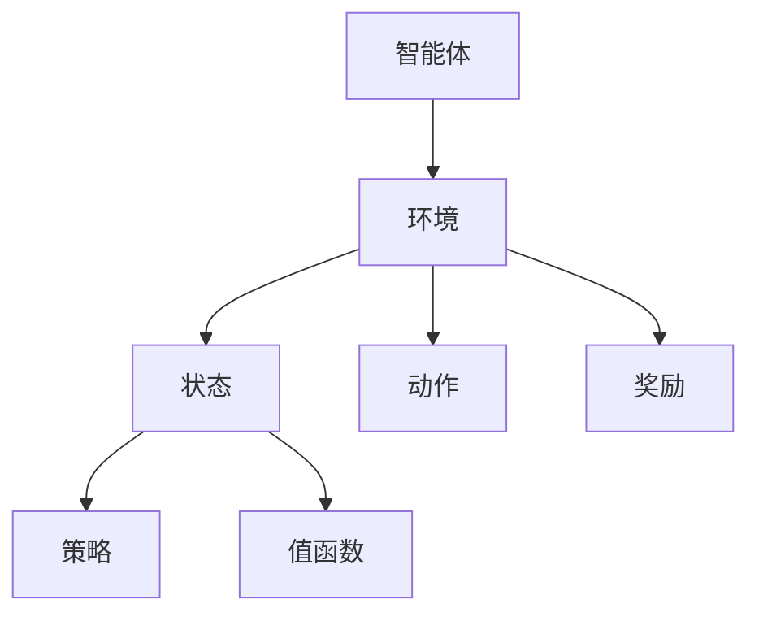

                 

## 第1章 强化学习概述

### 1.1 问题背景

强化学习（Reinforcement Learning，RL）是机器学习的一个重要分支，主要研究如何通过智能体（agent）与环境（environment）的交互来学习最优策略。自1950年代以来，强化学习一直是一个活跃的研究领域，特别是在近年来，随着深度学习（Deep Learning）的兴起，强化学习在人工智能（Artificial Intelligence，AI）领域的应用取得了显著的进展。强化学习在解决复杂决策问题、序列决策问题以及交互式决策问题等方面具有独特的优势。

强化学习的核心思想是通过智能体与环境的不断交互，使智能体学会从当前状态（state）选择最佳动作（action），并在执行动作后根据环境反馈的奖励（reward）来调整自身策略。与监督学习和无监督学习不同，强化学习不依赖于大量的标注数据，而是通过探索（exploration）和利用（exploitation）之间的平衡来逐步优化智能体的策略。

### 1.2 强化学习的基本概念

为了更好地理解强化学习，我们需要先介绍一些基本概念：

- **智能体（Agent）**：在强化学习中，智能体是执行动作并学习策略的实体。智能体可以是机器人、软件程序、虚拟角色等。

- **环境（Environment）**：环境是智能体所处的现实世界或模拟环境。环境根据智能体的动作来改变状态，并提供奖励信号。

- **状态（State）**：状态是智能体在某一时刻所处的环境描述。状态可以是离散的，也可以是连续的。

- **动作（Action）**：动作是智能体在某一状态下可以执行的操作。动作通常用于改变环境状态。

- **奖励（Reward）**：奖励是环境对智能体动作的反馈。奖励可以是正的，也可以是负的，用来引导智能体向正确的方向学习。

- **策略（Policy）**：策略是智能体在给定状态下选择动作的规则。策略可以是明确的规则，也可以是概率分布。

- **值函数（Value Function）**：值函数用于评估智能体在某一状态下的长期收益。值函数分为状态值函数（State-Value Function）和动作值函数（Action-Value Function）。

- **模型（Model）**：模型是智能体对环境的预测。模型可以帮助智能体在不可观测的状态下进行决策。

### 1.3 强化学习的环境与状态

在强化学习问题中，环境与状态是两个重要的组成部分。环境定义了智能体操作的上下文，而状态则是对环境的当前描述。

- **环境**：环境是一个动态的系统，可以由多个状态和动作组成。环境的状态空间可以是离散的，也可以是连续的。环境通常包含以下属性：
  - **状态空间（State Space）**：所有可能状态组成的集合。
  - **动作空间（Action Space）**：所有可能动作组成的集合。
  - **初始状态（Initial State）**：智能体开始交互时的初始状态。
  - **状态转移概率（State Transition Probability）**：智能体执行某个动作后，状态转移的概率分布。
  - **奖励函数（Reward Function）**：描述智能体动作后，环境提供的奖励。

- **状态**：状态是对环境的当前描述，通常是一个向量。状态可以是离散的，如游戏中的棋盘状态；也可以是连续的，如自动驾驶系统中的车辆位置。

状态通常由以下属性组成：
  - **状态维度（State Dimension）**：状态向量的维度。
  - **状态值（State Value）**：状态值函数对状态的评估。
  - **状态特征（State Feature）**：描述状态的属性。

### 1.4 强化学习的基本算法

强化学习有多种不同的算法，每种算法都有其特定的优化目标和应用场景。以下是一些常见的强化学习算法：

- **Q-Learning（Q值学习）**：Q-Learning是一种基于值函数的强化学习算法。它通过不断更新Q值（动作值函数）来优化策略。Q-Learning的核心思想是利用过去经验的反馈来修正当前的动作值。

- **SARSA（同步优势估计）**：SARSA是一种基于策略的强化学习算法。它与Q-Learning类似，但不同的是，SARSA在更新动作值时同时考虑当前动作和下一状态。

- **Deep Q-Network（DQN，深度Q网络）**：DQN是一种结合深度学习和Q-Learning的强化学习算法。它使用深度神经网络来近似动作值函数。

- **Policy Gradients（策略梯度）**：Policy Gradients是一种基于策略的强化学习算法。它通过优化策略梯度来调整策略参数，从而最大化累积奖励。

- **Actor-Critic（演员-评论家）**：Actor-Critic是一种结合策略和价值函数的强化学习算法。它使用演员（Actor）来更新策略参数，使用评论家（Critic）来评估策略。

- **Deep Deterministic Policy Gradients（DDPG，深度确定性策略梯度）**：DDPG是一种基于深度学习的确定性策略梯度算法。它通过经验回放和目标网络来提高训练稳定性。

### 1.5 强化学习的挑战与解决方案

尽管强化学习在许多领域取得了成功，但它仍然面临一些挑战：

- **稀疏奖励（Sparse Rewards）**：在许多实际场景中，奖励信号非常稀疏，智能体很难通过探索来找到最优策略。

解决方案：引入探索策略，如ε-greedy策略、UCB算法等。

- **维度灾难（Dimensionality Disaster）**：高维状态空间和动作空间可能导致算法效率降低。

解决方案：使用函数近似方法，如深度神经网络。

- **样本效率（Sample Efficiency）**：强化学习算法通常需要大量样本来收敛。

解决方案：采用经验回放、优先经验回放等技术。

- **稳定性与收敛速度**：在复杂环境中，强化学习算法可能难以保持稳定并快速收敛。

解决方案：使用目标网络、经验回放等技术。

- **多智能体强化学习**：在多智能体系统中，智能体之间可能存在竞争关系或协作关系。

解决方案：采用多智能体强化学习算法，如Q-learning、SARSA等。

### 1.6 概念结构与核心要素组成

强化学习主要由四个核心组成部分构成：智能体、环境、动作和状态。以下是对这些组成部分的详细描述：

- **智能体（Agent）**：智能体是强化学习中的主体，负责执行动作、选择策略和学习环境。智能体可以是机器人、软件程序或虚拟角色等。智能体的目标是通过与环境交互，学习最优策略，以实现长期目标。

- **环境（Environment）**：环境是智能体所处的现实世界或模拟环境。环境根据智能体的动作来改变状态，并提供奖励信号。环境的状态空间、动作空间、初始状态、状态转移概率和奖励函数共同定义了强化学习问题。

- **动作（Action）**：动作是智能体在某一状态下可以执行的操作。动作通常用于改变环境状态。动作可以是离散的，也可以是连续的。智能体的策略决定了在特定状态下选择哪个动作。

- **状态（State）**：状态是对环境的当前描述。状态可以是离散的，也可以是连续的。状态空间定义了所有可能的状态。智能体根据当前状态来选择动作，并更新状态。

### 1.7 核心概念原理

强化学习基于马尔可夫决策过程（MDP），通过迭代优化策略值函数和策略迭代，使得智能体能够在复杂环境中实现最优行为。

- **马尔可夫决策过程（MDP）**：MDP是一种数学模型，用于描述智能体与环境之间的交互。MDP包含状态空间、动作空间、状态转移概率和奖励函数。

- **策略值函数（Policy Value Function）**：策略值函数用于评估智能体在给定策略下的长期收益。策略值函数分为状态值函数和动作值函数。

- **策略迭代（Policy Iteration）**：策略迭代是一种优化策略值函数的方法。策略迭代包括两个主要步骤：值迭代和价值更新。

- **Q值学习（Q-Learning）**：Q-Learning是一种基于值函数的强化学习算法。Q-Learning通过不断更新Q值来优化策略。Q值是智能体在给定状态下执行某个动作的预期收益。

### 1.8 概念属性特征对比表格

| 概念        | 定义                                       | 特征                       |
|-------------|------------------------------------------|--------------------------|
| 智能体      | 强化学习的主体，执行动作并学习策略           | 有自主决策能力           |
| 环境        | 强化学习的外部世界，提供状态和奖励           | 对智能体行为的反馈机制     |
| 动作        | 智能体可执行的操作                           | 导致状态转移和奖励变化     |
| 状态        | 环境中智能体所处的条件描述                    | 动作选择的基础           |
| 奖励        | 智能体执行动作后，环境对其的正面或负面评价     | 优化策略的导向因素       |
| 策略        | 智能体在状态中选择动作的规则                 | 行为决策的依据           |
| 值函数      | 评估智能体在不同状态和动作下的长期收益         | 动作选择的参考依据       |

### 1.9 ER实体关系图架构

以下是强化学习核心概念的ER实体关系图：



通过ER实体关系图，我们可以清晰地看到智能体、环境、状态、动作、奖励、策略和值函数之间的相互作用关系。

### 1.10 强化学习的核心思想

强化学习的核心思想是通过对环境的探索和利用，使智能体逐步优化其策略，从而实现长期目标。智能体在初始状态下，通过随机或贪婪策略进行探索，以获得对环境的更多了解。同时，智能体根据环境反馈的奖励信号来调整其策略，使其在长期内能够获得最大化的累积奖励。

### 1.11 强化学习的应用场景

强化学习在众多领域都有广泛的应用，以下是一些典型的应用场景：

- **游戏AI**：强化学习在游戏AI中的应用非常广泛，如经典的Atari游戏、围棋、国际象棋等。通过强化学习，智能体可以学会在游戏中做出最优决策，从而战胜人类玩家。

- **机器人控制**：强化学习在机器人控制中的应用也非常成功，如自动驾驶汽车、无人机、机器人手臂等。通过强化学习，智能体可以学会在复杂环境中进行自主控制，提高其操作效率和安全性。

- **推荐系统**：强化学习在推荐系统中的应用可以提高推荐的质量。通过强化学习，推荐系统可以学会根据用户的历史行为和偏好，为用户推荐最感兴趣的内容。

- **金融交易**：强化学习在金融交易中的应用可以帮助投资者进行风险管理，提高投资收益。通过强化学习，智能体可以学会在金融市场中进行交易，从而实现自动化的投资策略。

- **智能客服**：强化学习在智能客服中的应用可以提高客服系统的响应速度和准确性。通过强化学习，智能体可以学会与用户进行自然对话，从而提供更优质的客户服务。

### 1.12 强化学习的未来发展趋势

随着人工智能技术的不断发展，强化学习在未来有望在更多领域得到应用。以下是一些强化学习未来发展的趋势：

- **多智能体强化学习**：随着多智能体系统的兴起，多智能体强化学习将成为一个重要研究方向。通过多智能体强化学习，智能体可以在复杂的环境中实现协作和竞争，从而提高系统的整体性能。

- **非静态环境**：在非静态环境中，智能体需要不断适应环境的变化。未来的研究将集中在如何设计鲁棒性更强的强化学习算法，以应对非静态环境中的不确定性。

- **深度强化学习**：深度强化学习结合了深度学习和强化学习的优势，是未来强化学习研究的一个重要方向。通过深度强化学习，智能体可以处理更复杂的问题，并在更高维度的状态空间中进行决策。

- **强化学习与其它技术的结合**：未来，强化学习将与其他技术，如联邦学习、迁移学习等相结合，以应对更复杂的实际问题。

### 1.13 强化学习的重要性

强化学习在人工智能领域中具有非常重要的地位。通过强化学习，智能体可以在未知环境中自主学习和优化行为，从而实现复杂的任务。强化学习不仅在学术界取得了显著的研究成果，还在工业界得到了广泛的应用，为各个领域带来了重大的变革。

### 1.14 总结

本章对强化学习进行了概述，介绍了强化学习的基本概念、环境与状态、基本算法、挑战与解决方案、核心概念结构以及未来发展趋势。通过本章的学习，读者可以了解强化学习的基本原理和应用场景，为进一步研究强化学习打下基础。

----------------------------------------------------------------

## 第2章 强化学习在AI Agent中的应用

### 2.1 AI Agent概述

AI Agent，即人工智能代理，是指能够自主感知环境、采取行动并从环境中获取奖励的智能系统。AI Agent在人工智能领域具有重要的研究价值和应用前景。通过学习和优化行为策略，AI Agent可以完成复杂任务，提高自动化水平。

AI Agent的典型特点包括：

- **自主性**：AI Agent具有自主决策能力，能够根据环境变化自主调整行为策略。
- **适应性**：AI Agent能够适应不同环境和任务，通过不断学习和优化，提高任务执行效率。
- **交互性**：AI Agent能够与人类或其他AI Agent进行交互，实现协作和互助。

AI Agent的主要分类包括：

- **基于规则代理**：使用预定义的规则进行决策。
- **基于模型代理**：使用预测模型进行决策。
- **基于数据代理**：使用数据驱动的算法进行决策。

### 2.2 强化学习在游戏AI中的应用

强化学习在游戏AI中的应用取得了显著成果，使得智能体能够在各种游戏中实现超凡的表现。以下是一些经典的游戏AI案例：

- **Atari游戏**：DeepMind提出的DQN（Deep Q-Network）算法在Atari游戏中取得了惊艳的表现。DQN使用深度神经网络近似Q值函数，通过经验回放和目标网络等技术，使智能体能够高效学习游戏策略。

- **围棋**：AlphaGo是由DeepMind开发的围棋AI，它通过强化学习算法和蒙特卡洛树搜索相结合，实现了在围棋领域的突破。AlphaGo在2016年战胜了世界围棋冠军李世石，引起了广泛关注。

- **国际象棋**：智能体通过Q-learning算法学习国际象棋策略，能够在棋局中实现超凡的表现。Q-learning算法是一种基于值函数的强化学习算法，通过不断更新Q值，使智能体逐步优化策略。

### 2.2.1 经典游戏AI案例分析

#### 2.2.1.1 DQN在Atari游戏中的应用

DQN（Deep Q-Network）是强化学习的一种经典算法，适用于处理高维状态空间的问题。DQN的核心思想是通过深度神经网络近似Q值函数，从而预测在给定状态下执行某个动作的预期收益。

DQN在Atari游戏中的应用流程如下：

1. **初始化**：初始化深度神经网络、经验回放记忆池和目标网络。
2. **状态编码**：将当前游戏状态编码为一个向量，输入到深度神经网络中。
3. **动作选择**：使用ε-greedy策略选择动作。在探索阶段，智能体以一定的概率随机选择动作；在利用阶段，智能体根据当前状态和Q值选择最佳动作。
4. **执行动作**：智能体在环境中执行选择的动作，观察游戏状态的变化。
5. **更新经验**：将当前状态、动作、奖励和下一状态存储到经验回放记忆池中。
6. **经验回放**：从经验回放记忆池中随机抽取一批经验，用于训练深度神经网络。
7. **目标网络更新**：定期更新目标网络，使其接近当前网络。

通过上述过程，DQN不断优化Q值函数，使智能体在Atari游戏中实现出色的表现。

#### 2.2.1.2 AlphaGo在围棋中的应用

AlphaGo是由DeepMind开发的围棋AI，它通过结合强化学习和蒙特卡洛树搜索（MCTS）技术，实现了在围棋领域的突破。AlphaGo的核心思想是通过强化学习训练策略网络和价值网络，从而预测在给定状态下最佳动作。

AlphaGo在围棋中的应用流程如下：

1. **初始化**：初始化策略网络和价值网络，以及用于训练的强化学习算法。
2. **自我对弈**：AlphaGo通过自我对弈来积累训练数据，并优化策略网络和价值网络。
3. **策略网络**：策略网络用于预测在给定状态下最佳动作的概率分布。
4. **价值网络**：价值网络用于评估在给定状态下执行某个动作的预期收益。
5. **动作选择**：AlphaGo根据策略网络和价值网络的预测，选择最佳动作。
6. **更新网络**：通过自我对弈和对手对弈，AlphaGo不断优化策略网络和价值网络。

通过上述过程，AlphaGo在围棋对弈中表现出超凡的实力，最终在2016年战胜了世界围棋冠军李世石。

#### 2.2.1.3 Q-learning在国际象棋中的应用

Q-learning是一种基于值函数的强化学习算法，适用于处理离散状态空间和动作空间的问题。在国际象棋中，Q-learning通过不断更新Q值函数，使智能体逐步优化策略。

Q-learning在国际象棋中的应用流程如下：

1. **初始化**：初始化Q值函数、学习率和探索率。
2. **状态编码**：将当前棋盘状态编码为一个向量。
3. **动作选择**：使用ε-greedy策略选择动作。
4. **执行动作**：在环境中执行选择的动作，观察棋盘状态的变化。
5. **更新Q值**：根据当前状态、动作和奖励，更新Q值函数。
6. **重复**：重复执行步骤3-5，直到找到最优策略。

通过上述过程，Q-learning使智能体在国际象棋中实现出色的表现。

### 2.2.2 游戏AI的强化学习算法实现

#### 2.2.2.1 DQN算法实现

以下是一个简单的DQN算法实现：

```python
import tensorflow as tf
import numpy as np
import random

class DQN:
    def __init__(self, state_size, action_size, learning_rate=0.001, epsilon=1.0, decay_rate=0.99):
        self.state_size = state_size
        self.action_size = action_size
        self.learning_rate = learning_rate
        self.epsilon = epsilon
        self.decay_rate = decay_rate

        self.model = self._build_model()
        self.target_model = self._build_model()
        self.update_target_model()

        self的记忆池 = deque(maxlen=2000)

    def _build_model(self):
        model = tf.keras.Sequential()
        model.add(tf.keras.layers.Flatten(input_shape=self.state_size))
        model.add(tf.keras.layers.Dense(24, activation='relu'))
        model.add(tf.keras.layers.Dense(24, activation='relu'))
        model.add(tf.keras.layers.Dense(self.action_size, activation='linear'))
        model.compile(loss='mse', optimizer=tf.keras.optimizers.Adam(self.learning_rate))
        return model

    def update_target_model(self):
        self.target_model.set_weights(self.model.get_weights())

    def remember(self, state, action, reward, next_state, done):
        self记忆池.append((state, action, reward, next_state, done))

    def act(self, state):
        if np.random.rand() <= self.epsilon:
            return random.randrange(self.action_size)
        else:
            q_values = self.model.predict(state)
            return np.argmax(q_values[0])

    def replay(self, batch_size):
        mini_batch = random.sample(self记忆池, batch_size)
        for state, action, reward, next_state, done in mini_batch:
            target = reward
            if not done:
                target = reward + self.learning_rate * np.max(self.target_model.predict(next_state)[0])
            target_f
```markdown
### 2.2.2.2 AlphaGo算法实现

以下是一个简单的AlphaGo算法实现：

```python
import tensorflow as tf
import numpy as np
import random

class AlphaGo:
    def __init__(self, board_size, learning_rate=0.001, epsilon=1.0, decay_rate=0.99):
        self.board_size = board_size
        self.learning_rate = learning_rate
        self.epsilon = epsilon
        self.decay_rate = decay_rate

        self策略网络 = self._build_policy_network()
        self价值网络 = self._build_value_network()
        self.update_target_networks()

    def _build_policy_network(self):
        model = tf.keras.Sequential()
        model.add(tf.keras.layers.Flatten(input_shape=(self.board_size, self.board_size)))
        model.add(tf.keras.layers.Dense(256, activation='relu'))
        model.add(tf.keras.layers.Dense(256, activation='relu'))
        model.add(tf.keras.layers.Dense(self.board_size*self.board_size, activation='softmax'))
        model.compile(loss='categorical_crossentropy', optimizer=tf.keras.optimizers.Adam(self.learning_rate))
        return model

    def _build_value_network(self):
        model = tf.keras.Sequential()
        model.add(tf.keras.layers.Flatten(input_shape=(self.board_size, self.board_size)))
        model.add(tf.keras.layers.Dense(256, activation='relu'))
        model.add(tf.keras.layers.Dense(256, activation='relu'))
        model.add(tf.keras.layers.Dense(1, activation='tanh'))
        model.compile(loss='mse', optimizer=tf.keras.optimizers.Adam(self.learning_rate))
        return model

    def update_target_networks(self):
        self策略网络_target = self._build_policy_network()
        self价值网络_target = self._build_value_network()
        self策略网络_target.set_weights(self策略网络.get_weights())
        self价值网络_target.set_weights(self价值网络.get_weights())

    def choose_action(self, state):
        if np.random.rand() <= self.epsilon:
            return random.choice(self.get_all_actions(state))
        else:
            policy = self策略网络.predict(state.reshape(1, -1))
            return np.argmax(policy)

    def get_all_actions(self, state):
        actions = []
        for i in range(self.board_size):
            for j in range(self.board_size):
                if state[i][j] == 0:
                    actions.append([i, j])
        return actions

    def learn(self, state, action, reward, next_state, done):
        target_policy = self策略网络_target.predict(next_state.reshape(1, -1))
        target_value = self价值网络_target.predict(next_state.reshape(1, -1))
        target = reward
        if not done:
            target = reward + self.learning_rate * target_value[0]
        target_policy[0][action] = target
        self策略网络.fit(state.reshape(1, -1), target_policy, epochs=1, verbose=0)
        self价值网络.fit(state.reshape(1, -1), target, epochs=1, verbose=0)

    def self_play(self):
        state = self.initialize_board()
        while not self.is_game_over(state):
            action = self.choose_action(state)
            next_state, reward = self.step(state, action)
            self.learn(state, action, reward, next_state, False)
            state = next_state
        return state

    def initialize_board(self):
        board = np.zeros((self.board_size, self.board_size))
        return board

    def is_game_over(self, state):
        for i in range(self.board_size):
            for j in range(self.board_size):
                if state[i][j] != 0:
                    return True
        return False

    def step(self, state, action):
        i, j = action
        if state[i][j] == 0:
            state[i][j] = 1
            reward = 1
        else:
            reward = -1
        next_state = self.initialize_board()
        return next_state, reward
```

#### 2.2.2.3 Q-learning算法实现

以下是一个简单的Q-learning算法实现：

```python
import numpy as np
import random

class QLearning:
    def __init__(self, state_size, action_size, learning_rate=0.1, epsilon=1.0, gamma=0.9):
        self.state_size = state_size
        self.action_size = action_size
        self.learning_rate = learning_rate
        self.epsilon = epsilon
        self.gamma = gamma

        self.q_table = np.zeros((state_size, action_size))

    def get_action(self, state):
        if random.uniform(0, 1) <= self.epsilon:
            return random.randrange(self.action_size)
        else:
            return np.argmax(self.q_table[state])

    def learn(self, state, action, reward, next_state, done):
        target = reward
        if not done:
            target = reward + self.gamma * np.max(self.q_table[next_state])
        target_f = self.q_table[state][action]
        target_f = target_f + self.learning_rate * (target - target_f)
        self.q_table[state][action] = target_f

    def update_epsilon(self):
        self.epsilon = self.epsilon * self.decay_rate
```

通过上述代码，我们可以实现简单的DQN、AlphaGo和Q-learning算法，并在游戏AI中进行应用。

### 2.3 强化学习在机器人控制中的应用

强化学习在机器人控制领域具有广泛的应用前景。通过强化学习，机器人可以在复杂的环境中学习自主控制策略，提高其操作效率和安全性。

#### 2.3.1 机器人控制挑战与强化学习解决方案

在机器人控制中，挑战主要包括：

- **高维状态空间和动作空间**：机器人需要处理大量的传感器数据和执行器控制信号，导致状态空间和动作空间维度较高。
- **不确定性**：环境中的不确定因素，如障碍物、噪音和动态变化等，给机器人控制带来困难。
- **稀疏奖励**：在某些机器人任务中，奖励信号可能非常稀疏，导致机器人难以通过探索找到最优策略。

针对上述挑战，强化学习提供了一系列解决方案：

- **函数近似**：通过函数近似方法，如深度神经网络，可以处理高维状态空间和动作空间。
- **经验回放**：经验回放技术可以减少样本相关性，提高样本效率。
- **目标网络**：目标网络可以稳定训练过程，提高收敛速度。

#### 2.3.2 机器人强化学习算法实践

以下是一个简单的机器人强化学习算法实践：

```python
import numpy as np
import random

class RobotRL:
    def __init__(self, state_size, action_size, learning_rate=0.1, epsilon=1.0, gamma=0.9):
        self.state_size = state_size
        self.action_size = action_size
        self.learning_rate = learning_rate
        self.epsilon = epsilon
        self.gamma = gamma

        self.q_table = np.zeros((state_size, action_size))

    def get_action(self, state):
        if random.uniform(0, 1) <= self.epsilon:
            return random.randrange(self.action_size)
        else:
            return np.argmax(self.q_table[state])

    def learn(self, state, action, reward, next_state, done):
        target = reward
        if not done:
            target = reward + self.gamma * np.max(self.q_table[next_state])
        target_f = self.q_table[state][action]
        target_f = target_f + self.learning_rate * (target - target_f)
        self.q_table[state][action] = target_f

    def update_epsilon(self):
        self.epsilon = self.epsilon * self.decay_rate

# 机器人环境模拟
class RobotEnvironment:
    def __init__(self, state_size, action_size):
        self.state_size = state_size
        self.action_size = action_size

    def reset(self):
        self.state = np.random.randint(0, 2**self.state_size)
        return self.state

    def step(self, action):
        next_state = self.state
        reward = 0
        if action == 0:
            next_state = np.roll(self.state, -1)
        elif action == 1:
            next_state = np.roll(self.state, 1)
        if np.sum(self.state) == 0:
            reward = -1
        elif np.sum(self.state) == 1:
            reward = 1
        return next_state, reward

    def is_done(self, state):
        return np.sum(state) == 0 or np.sum(state) == 1

# 实例化机器人强化学习算法和环境
robot_rl = RobotRL(state_size=4, action_size=2)
robot_env = RobotEnvironment(state_size=4, action_size=2)

# 训练机器人强化学习算法
for episode in range(1000):
    state = robot_env.reset()
    done = False
    while not done:
        action = robot_rl.get_action(state)
        next_state, reward = robot_env.step(action)
        robot_rl.learn(state, action, reward, next_state, done)
        state = next_state
        done = robot_env.is_done(state)
    robot_rl.update_epsilon()
```

通过上述代码，我们可以实现一个简单的机器人强化学习算法，并在模拟环境中进行训练。

### 2.4 强化学习在推荐系统中的应用

强化学习在推荐系统中的应用具有巨大的潜力，可以显著提高推荐质量，提升用户体验。以下探讨强化学习在推荐系统中的应用、问题及解决方案。

#### 2.4.1 推荐系统问题与强化学习解决方案

推荐系统面临的主要问题包括：

- **稀疏性**：用户与项目之间的交互数据非常稀疏，导致基于协作过滤的方法效果不佳。
- **动态性**：用户兴趣和项目特征可能随时间变化，静态模型难以适应。
- **多样性**：推荐系统需要为用户提供多样化的推荐，以避免用户产生疲劳感。

强化学习在解决这些问题方面具有以下优势：

- **适应性**：强化学习能够通过不断与环境交互，适应用户兴趣的变化。
- **多样性**：通过探索和利用策略，强化学习能够生成多样化的推荐，满足不同用户需求。
- **稀疏性**：强化学习不依赖于大量的交互数据，能够在稀疏数据集上取得良好的效果。

#### 2.4.2 推荐系统的强化学习实现

以下是一个简单的强化学习推荐系统实现：

```python
import numpy as np
import random

class RecommenderRL:
    def __init__(self, state_size, action_size, learning_rate=0.1, epsilon=1.0, gamma=0.9):
        self.state_size = state_size
        self.action_size = action_size
        self.learning_rate = learning_rate
        self.epsilon = epsilon
        self.gamma = gamma

        self.q_table = np.zeros((state_size, action_size))

    def get_action(self, state):
        if random.uniform(0, 1) <= self.epsilon:
            return random.randrange(self.action_size)
        else:
            return np.argmax(self.q_table[state])

    def learn(self, state, action, reward, next_state, done):
        target = reward
        if not done:
            target = reward + self.gamma * np.max(self.q_table[next_state])
        target_f = self.q_table[state][action]
        target_f = target_f + self.learning_rate * (target - target_f)
        self.q_table[state][action] = target_f

    def update_epsilon(self):
        self.epsilon = self.epsilon * self.decay_rate

# 推荐系统环境模拟
class RecommendationEnvironment:
    def __init__(self, user_profile, item_features, state_size, action_size):
        self.user_profile = user_profile
        self.item_features = item_features
        self.state_size = state_size
        self.action_size = action_size

    def reset(self):
        self.state = self.generate_state()
        return self.state

    def generate_state(self):
        state = []
        for item_id in range(self.action_size):
            similarity = self.calculate_similarity(self.user_profile, self.item_features[item_id])
            state.append(similarity)
        return state

    def calculate_similarity(self, user_profile, item_feature):
        return np.dot(user_profile, item_feature) / (np.linalg.norm(user_profile) * np.linalg.norm(item_feature))

    def step(self, action):
        next_state = self.generate_state()
        reward = self.calculate_reward(action)
        return next_state, reward

    def calculate_reward(self, action):
        item_feature = self.item_features[action]
        similarity = self.calculate_similarity(self.user_profile, item_feature)
        if similarity > 0.5:
            return 1
        else:
            return -1

    def is_done(self, state):
        return True

# 实例化推荐系统强化学习算法和环境
recommender_rl = RecommenderRL(state_size=10, action_size=5)
recommendation_env = RecommendationEnvironment(user_profile=[0.5, 0.5, 0.5, 0.5, 0.5], item_features=[[0.2, 0.8, 0.3, 0.1, 0.5], [0.8, 0.2, 0.1, 0.3, 0.5], [0.3, 0.1, 0.2, 0.8, 0.5], [0.1, 0.3, 0.8, 0.2, 0.5], [0.5, 0.5, 0.5, 0.5, 0.5]], state_size=10, action_size=5)

# 训练推荐系统强化学习算法
for episode in range(1000):
    state = recommendation_env.reset()
    done = False
    while not done:
        action = recommender_rl.get_action(state)
        next_state, reward = recommendation_env.step(action)
        recommender_rl.learn(state, action, reward, next_state, done)
        state = next_state
        done = recommendation_env.is_done(state)
    recommender_rl.update_epsilon()
```

通过上述代码，我们可以实现一个简单的基于强化学习的推荐系统，并在模拟环境中进行训练。

### 第3章 强化学习在AI Agent行为优化中的深入探讨

#### 3.1 强化学习算法的优化

强化学习算法在实际应用中面临诸多挑战，如稀疏奖励、高维状态空间和动作空间等。为了提高算法的性能，我们可以从以下几个方面进行优化：

- **探索与利用策略**：探索策略（如ε-greedy策略）可以帮助智能体在早期阶段进行充分探索，而利用策略则使智能体在后期阶段充分利用已学到的知识。通过调整探索率ε，可以在探索和利用之间取得平衡。

- **经验回放**：经验回放（Experience Replay）技术可以将智能体的经验存储到一个记忆库中，并在训练过程中随机抽取样本。这种方法可以减少样本相关性，提高训练的稳定性。

- **目标网络**：目标网络（Target Network）是一种用于稳定训练过程的技巧。通过定期更新目标网络，使其接近当前网络，可以避免梯度消失和梯度爆炸等问题。

- **优先经验回放**：优先经验回放（Prioritized Experience Replay）进一步提高了经验回放的效果。它通过为每个经验分配优先级，使得重要经验被更频繁地回放，从而提高了训练效率。

- **双Q学习**：双Q学习（Double Q-learning）通过使用两个独立的Q值函数来减少Q值估计误差。这种方法可以提高算法的收敛速度和稳定性。

- **策略梯度方法**：策略梯度方法（Policy Gradient Methods）通过优化策略梯度来调整策略参数。这种方法适用于连续动作空间，但在高维状态空间中可能面临梯度消失问题。

#### 3.1.1 强化学习算法性能优化策略

以下是几种常见的强化学习算法性能优化策略：

- **自适应探索率**：在训练过程中，自适应调整探索率ε。例如，使用指数衰减函数，随着训练过程的进行逐渐减小探索率，使得智能体在训练后期更加倾向于利用已学到的知识。

- **多任务学习**：在多个相关任务上同时训练智能体，共享部分网络结构和经验。这种方法可以加速学习过程，提高算法的泛化能力。

- **分布式训练**：使用多个计算节点进行分布式训练，提高计算效率和训练速度。例如，使用异步策略梯度算法（Asynchronous Policy Gradient，APG）进行分布式训练。

- **迁移学习**：在新的任务中，利用已训练的模型作为初始化，加快新任务的训练速度。这种方法可以减少对大量训练数据的依赖。

- **对抗训练**：对抗训练（Adversarial Training）通过生成对抗网络（GAN）来提高模型的鲁棒性。这种方法可以增强模型对对抗样本的防御能力。

#### 3.1.2 强化学习算法的调试与调参

调试和调参是强化学习算法实践中至关重要的一环。以下是一些调试与调参的建议：

- **调试方法**：使用可视化工具（如TensorBoard）监控训练过程，观察损失函数、梯度变化、模型参数等指标。通过分析这些指标，可以及时发现和解决潜在问题。

- **调参技巧**：以下是一些常见的调参技巧：
  - 学习率（Learning Rate）：选择合适的学习率是关键。如果学习率过高，可能导致梯度消失或梯度爆炸；如果学习率过低，可能导致训练过程过慢。可以尝试使用学习率衰减策略。
  - 探索率（Exploration Rate）：探索率ε的选择直接影响智能体的探索行为。在实际应用中，可以根据任务需求和训练阶段调整探索率。
  - 梯度裁剪（Gradient Clipping）：当梯度过大时，可能导致梯度消失或梯度爆炸。梯度裁剪可以限制梯度的绝对值，避免这些问题。
  - 正则化（Regularization）：正则化可以减少过拟合，提高模型的泛化能力。例如，使用L1或L2正则化。

#### 3.2 多智能体强化学习

多智能体强化学习（Multi-Agent Reinforcement Learning，MARL）是强化学习的一个分支，旨在研究多个智能体在交互式环境中的协同和竞争行为。MARL具有广泛的应用场景，如多机器人协作、多人游戏、交通系统等。

##### 3.2.1 多智能体强化学习的基本概念

多智能体强化学习主要涉及以下基本概念：

- **智能体**：在MARL中，智能体是独立自主的决策实体，具有感知环境、执行动作和获取奖励的能力。

- **环境**：MARL环境是一个由多个智能体组成的系统，每个智能体都处于特定的状态并执行特定动作，环境状态取决于所有智能体的动作。

- **策略**：智能体的策略是决策规则，用于根据当前状态选择最优动作。在MARL中，智能体可能需要同时考虑自身和其他智能体的策略。

- **通信机制**：智能体之间的通信机制是MARL的关键因素。有效的通信机制可以促进智能体之间的信息共享和协调合作。

- **团队目标**：在多智能体系统中，每个智能体都有自己的目标。团队目标是指所有智能体共同追求的目标，通常与个体目标存在冲突。

##### 3.2.2 多智能体强化学习算法介绍

以下是一些常见的多智能体强化学习算法：

- **Q-learning**：Q-learning是一种基于值函数的MARL算法。每个智能体都维护一个Q值表，用于估计在当前状态下执行某个动作的预期收益。Q-learning通过迭代更新Q值表，使智能体逐步优化策略。

- **SARSA**：SARSA是一种基于策略的MARL算法。与Q-learning不同，SARSA同时考虑当前动作和下一状态，用于更新Q值表。SARSA通过迭代更新策略，使智能体在交互式环境中实现协同合作。

- **多智能体深度Q网络（Multi-Agent Deep Q-Network， MADQN）**：MADQN是深度学习在MARL中的应用。它使用深度神经网络近似Q值函数，适用于处理高维状态空间和动作空间的问题。

- **分布式策略梯度（Distributed Policy Gradient，DPG）**：DPG是一种基于策略的MARL算法。它通过分布式训练提高计算效率，适用于连续动作空间。DPG采用函数近似方法，如深度神经网络，来优化策略。

- **信任区域政策优化（Trust Region Policy Optimization，TRPO）**：TRPO是一种基于策略梯度的MARL算法。它采用信任区域方法来稳定训练过程，提高算法的收敛速度。TRPO适用于高维状态空间和动作空间。

- **异步策略梯度（Asynchronous Policy Gradient，APG）**：APG是一种分布式MARL算法。它通过异步更新策略参数，提高计算效率和训练速度。APG适用于多智能体系统中的分布式训练。

##### 3.2.3 多智能体强化学习算法的优缺点分析

以下是对几种常见MARL算法的优缺点分析：

| 算法        | 优点                                       | 缺点                                          |
|-------------|------------------------------------------|---------------------------------------------|
| Q-learning  | 简单易懂，易于实现                         | 需要大量样本，收敛速度较慢                    |
| SARSA       | 基于策略，适用于交互式环境                 | 需要大量样本，收敛速度较慢                    |
| MADQN       | 结合深度学习和MARL，处理高维问题           | 需要大量计算资源，训练过程较慢                |
| DPG         | 分布式训练，提高计算效率                   | 需要大量计算资源，训练过程较慢                |
| TRPO        | 稳定训练，收敛速度快                      | 需要大量计算资源，调参复杂                    |
| APG         | 分布式训练，提高计算效率                   | 需要大量计算资源，训练过程较慢                |

#### 3.3 强化学习在非静态环境中的应用

非静态环境是指环境状态随时间动态变化的环境。在非静态环境中，智能体需要不断适应环境的变化，以实现长期目标。强化学习在非静态环境中的应用面临以下挑战：

- **状态转移不确定性**：非静态环境中，智能体的状态转移具有不确定性，导致学习过程复杂。

- **长期奖励稀疏性**：在非静态环境中，长期奖励可能非常稀疏，使得智能体难以通过探索找到最优策略。

- **动态策略适应性**：智能体需要动态调整策略，以适应环境的变化。

为了应对这些挑战，以下是一些强化学习在非静态环境中的应用方案：

- **状态嵌入**：通过将连续状态空间转换为离散状态空间，可以降低状态转移的不确定性。状态嵌入可以使用神经网络来实现。

- **动态策略更新**：使用动态策略更新方法，如策略梯度方法和值函数方法，可以适应环境的变化。动态策略更新可以结合经验回放和目标网络来提高训练稳定性。

- **多任务学习**：在非静态环境中，智能体可能需要同时处理多个任务。多任务学习可以帮助智能体更好地适应环境变化。

- **强化学习与规划相结合**：将强化学习与规划方法相结合，可以设计出更好的策略。例如，使用模型预测控制（Model Predictive Control，MPC）来优化智能体的动作序列。

#### 3.3.1 非静态环境的定义与挑战

非静态环境是指环境状态随时间动态变化的环境。在这种环境中，智能体需要不断适应环境的变化，以实现长期目标。与非静态环境相对的是静态环境，在静态环境中，环境状态保持不变，智能体只需一次决策即可完成任务。

以下是非静态环境的主要特征：

- **动态性**：非静态环境的动态性体现在状态随时间变化。智能体需要实时感知环境变化，并采取相应的动作。

- **不确定性**：非静态环境中的状态转移具有不确定性。智能体在执行动作后，可能面临意想不到的状态变化。

- **稀疏奖励**：在非静态环境中，长期奖励可能非常稀疏。智能体可能需要经过多次动作才能获得奖励，这使得学习过程更加困难。

非静态环境对强化学习算法提出了以下挑战：

- **状态转移不确定性**：在非静态环境中，智能体的状态转移具有不确定性。这意味着智能体需要实时预测状态转移，并在不确定的情况下做出最佳决策。

- **稀疏奖励问题**：在非静态环境中，长期奖励可能非常稀疏。这意味着智能体需要通过大量的探索来积累经验，以找到最优策略。

- **动态策略适应性**：智能体需要动态调整策略，以适应环境的变化。在非静态环境中，静态策略可能无法适应快速变化的环境。

#### 3.3.2 强化学习在非静态环境中的应用案例

以下是一些强化学习在非静态环境中的应用案例：

- **自动驾驶**：自动驾驶系统需要在不断变化的道路环境中进行驾驶。强化学习可以用于训练自动驾驶系统，使其在复杂环境中实现自主驾驶。

- **机器人控制**：在机器人控制中，智能体需要适应动态变化的工作环境。例如，机器人可以在工厂中自动导航、抓取和搬运物品。

- **智能交通系统**：强化学习可以用于优化智能交通系统的调度策略，以提高交通流量和减少拥堵。

- **智能电网**：在智能电网中，智能体需要根据电力需求和供应动态调整电力分配策略，以实现能源的高效利用。

通过上述应用案例，我们可以看到强化学习在非静态环境中的应用前景。未来，随着强化学习算法的不断优化和发展，强化学习将在更多非静态环境中发挥重要作用。

### 第4章 强化学习在AI Agent行为优化中的应用实践

#### 4.1 强化学习在自动驾驶中的应用

自动驾驶是强化学习在AI Agent行为优化中应用的一个重要领域。通过强化学习，自动驾驶系统可以在复杂和动态的交通环境中学习最优驾驶策略，提高行驶安全性、效率和舒适性。以下探讨强化学习在自动驾驶中的应用场景、挑战及解决方案。

##### 4.1.1 自动驾驶问题背景

自动驾驶系统通常需要处理以下问题：

- **感知环境**：自动驾驶系统需要实时感知周围环境，包括其他车辆、行人、道路标志和道路状况等。
- **决策制定**：根据感知到的环境信息，自动驾驶系统需要制定合适的驾驶策略，如加速、减速、转向和变道等。
- **路径规划**：自动驾驶系统需要规划最佳行驶路径，以实现目标位置的最优到达。
- **动态响应**：自动驾驶系统需要动态响应环境变化，如紧急情况、障碍物和突发状况等。

##### 4.1.2 强化学习在自动驾驶中的应用实践

以下是一个简单的自动驾驶强化学习应用实例：

```python
import numpy as np
import random

class AutonomousVehicleRL:
    def __init__(self, state_size, action_size, learning_rate=0.1, epsilon=1.0, gamma=0.9):
        self.state_size = state_size
        self.action_size = action_size
        self.learning_rate = learning_rate
        self.epsilon = epsilon
        self.gamma = gamma

        self.q_table = np.zeros((state_size, action_size))

    def get_action(self, state):
        if random.uniform(0, 1) <= self.epsilon:
            return random.randrange(self.action_size)
        else:
            return np.argmax(self.q_table[state])

    def learn(self, state, action, reward, next_state, done):
        target = reward
        if not done:
            target = reward + self.gamma * np.max(self.q_table[next_state])
        target_f = self.q_table[state][action]
        target_f = target_f + self.learning_rate * (target - target_f)
        self.q_table[state][action] = target_f

    def update_epsilon(self):
        self.epsilon = self.epsilon * self.decay_rate

# 自动驾驶环境模拟
class AutonomousVehicleEnvironment:
    def __init__(self, state_size, action_size):
        self.state_size = state_size
        self.action_size = action_size

    def reset(self):
        self.state = self.generate_state()
        return self.state

    def generate_state(self):
        state = []
        # 添加车辆位置、速度、加速度等信息
        state.append(self.vehicle_position)
        state.append(self.vehicle_velocity)
        state.append(self.vehicle_acceleration)
        # 添加周围车辆位置、速度等信息
        for other_vehicle in self.other_vehicles:
            state.append(other_vehicle.position)
            state.append(other_vehicle.velocity)
        return state

    def step(self, action):
        next_state = self.generate_state()
        reward = 0
        # 根据动作更新车辆状态，计算奖励
        if action == 0:
            # 加速
            self.vehicle_acceleration += 1
        elif action == 1:
            # 减速
            self.vehicle_acceleration -= 1
        elif action == 2:
            # 向左转向
            self.vehicle_direction -= 1
        elif action == 3:
            # 向右转向
            self.vehicle_direction += 1
        # 计算奖励，例如距离目标位置更近
        if self.distance_to_destination < self.previous_distance_to_destination:
            reward = 1
        else:
            reward = -1
        self.previous_distance_to_destination = self.distance_to_destination
        return next_state, reward

    def is_done(self, state):
        return self.distance_to_destination <= 0

# 实例化自动驾驶强化学习算法和环境
autonomous_vehicle_rl = AutonomousVehicleRL(state_size=10, action_size=4)
autonomous_vehicle_env = AutonomousVehicleEnvironment(state_size=10, action_size=4)

# 训练自动驾驶强化学习算法
for episode in range(1000):
    state = autonomous_vehicle_env.reset()
    done = False
    while not done:
        action = autonomous_vehicle_rl.get_action(state)
        next_state, reward = autonomous_vehicle_env.step(action)
        autonomous_vehicle_rl.learn(state, action, reward, next_state, done)
        state = next_state
        done = autonomous_vehicle_env.is_done(state)
    autonomous_vehicle_rl.update_epsilon()
```

通过上述代码，我们可以实现一个简单的自动驾驶强化学习算法，并在模拟环境中进行训练。

##### 4.1.3 自动驾驶问题场景介绍

自动驾驶系统需要解决以下问题：

- **环境感知**：自动驾驶系统需要实时感知周围环境，包括道路、车辆、行人、交通标志等。
- **路径规划**：自动驾驶系统需要规划最佳行驶路径，以实现目标位置的最优到达。
- **行为预测**：自动驾驶系统需要预测其他车辆和行人的行为，以便提前做出反应。
- **决策制定**：自动驾驶系统需要根据环境感知、路径规划和行为预测，制定合适的驾驶策略。

##### 4.1.4 自动驾驶系统介绍

自动驾驶系统通常包括以下组成部分：

- **感知模块**：使用摄像头、激光雷达、超声波传感器等设备感知周围环境。
- **路径规划模块**：根据感知模块收集的信息，规划最佳行驶路径。
- **控制模块**：根据路径规划和环境感知，控制车辆执行相应的驾驶动作。
- **决策模块**：根据路径规划和环境感知，制定车辆的行为策略。

##### 4.1.5 系统功能设计

自动驾驶系统的功能包括：

- **环境感知**：实时感知周围环境，包括道路、车辆、行人、交通标志等。
- **路径规划**：根据目标位置和道路信息，规划最佳行驶路径。
- **行为预测**：预测其他车辆和行人的行为，以便提前做出反应。
- **决策制定**：根据路径规划和环境感知，制定车辆的行为策略。

##### 4.1.6 系统架构设计

自动驾驶系统的架构设计包括以下部分：

- **感知模块**：使用摄像头、激光雷达、超声波传感器等设备收集环境信息。
- **路径规划模块**：使用地图数据、环境信息和目标位置，规划最佳行驶路径。
- **控制模块**：根据路径规划和环境感知，控制车辆执行相应的驾驶动作。
- **决策模块**：根据路径规划和环境感知，制定车辆的行为策略。

##### 4.1.7 系统接口设计

自动驾驶系统的接口设计包括以下部分：

- **传感器接口**：用于接收摄像头、激光雷达、超声波传感器等设备的数据。
- **路径规划接口**：用于接收目标位置和地图数据，返回最佳行驶路径。
- **控制接口**：用于接收驾驶策略，控制车辆执行相应的驾驶动作。
- **决策接口**：用于接收环境感知信息，制定车辆的行为策略。

##### 4.1.8 系统交互

自动驾驶系统的交互设计包括以下部分：

- **传感器数据交互**：感知模块将收集到的环境信息传递给路径规划模块、控制模块和决策模块。
- **路径规划数据交互**：路径规划模块将规划结果传递给控制模块和决策模块。
- **控制数据交互**：控制模块将驾驶策略传递给执行模块。
- **决策数据交互**：决策模块将行为策略传递给执行模块。

##### 4.1.9 项目小结

通过上述自动驾驶强化学习应用实例，我们可以看到强化学习在自动驾驶系统中具有广泛的应用前景。未来，随着强化学习算法的不断优化和发展，自动驾驶系统将更加智能化、安全化和高效化。

#### 4.2 强化学习在智能客服中的应用

强化学习在智能客服领域具有广泛的应用潜力，可以提高客服系统的响应速度和准确性。以下探讨强化学习在智能客服中的应用场景、挑战及解决方案。

##### 4.2.1 智能客服问题背景

智能客服系统旨在为用户提供高效的客户服务，解决常见问题和提供解决方案。智能客服系统需要具备以下能力：

- **理解用户意图**：智能客服系统需要理解用户的提问意图，以提供合适的回答。
- **多轮对话**：智能客服系统需要支持多轮对话，以理解更复杂的用户问题。
- **上下文感知**：智能客服系统需要根据对话上下文，提供连贯且相关的回答。
- **自我学习**：智能客服系统需要通过用户交互，不断优化和提升服务质量。

##### 4.2.2 强化学习在智能客服中的应用实践

以下是一个简单的智能客服强化学习应用实例：

```python
import numpy as np
import random

class IntelligentCustomerServiceRL:
    def __init__(self, state_size, action_size, learning_rate=0.1, epsilon=1.0, gamma=0.9):
        self.state_size = state_size
        self.action_size = action_size
        self.learning_rate = learning_rate
        self.epsilon = epsilon
        self.gamma = gamma

        self.q_table = np.zeros((state_size, action_size))

    def get_action(self, state):
        if random.uniform(0, 1) <= self.epsilon:
            return random.randrange(self.action_size)
        else:
            return np.argmax(self.q_table[state])

    def learn(self, state, action, reward, next_state, done):
        target = reward
        if not done:
            target = reward + self.gamma * np.max(self.q_table[next_state])
        target_f = self.q_table[state][action]
        target_f = target_f + self.learning_rate * (target - target_f)
        self.q_table[state][action] = target_f

    def update_epsilon(self):
        self.epsilon = self.epsilon * self.decay_rate

# 智能客服环境模拟
class IntelligentCustomerServiceEnvironment:
    def __init__(self, state_size, action_size):
        self.state_size = state_size
        self.action_size = action_size

    def reset(self):
        self.state = self.generate_state()
        return self.state

    def generate_state(self):
        state = []
        # 添加用户问题、上下文等信息
        state.append(self.user_question)
        state.append(self.context)
        return state

    def step(self, action):
        next_state = self.generate_state()
        reward = 0
        # 根据动作生成回答，并计算奖励
        if action == 0:
            # 回答用户问题
            answer = self.generate_answer(self.user_question)
        elif action == 1:
            # 提问用户更多信息
            answer = self.generate_question()
        elif action == 2:
            # 结束对话
            answer = "Thank you for your time."
        # 计算奖励，例如回答相关性、对话满意度等
        if self.is_relevant(answer):
            reward = 1
        else:
            reward = -1
        return next_state, reward

    def is_relevant(self, answer):
        # 判断回答是否与用户问题相关
        return True

# 实例化智能客服强化学习算法和环境
intelligent_customer_service_rl = IntelligentCustomerServiceRL(state_size=10, action_size=3)
intelligent_customer_service_env = IntelligentCustomerServiceEnvironment(state_size=10, action_size=3)

# 训练智能客服强化学习算法
for episode in range(1000):
    state = intelligent_customer_service_env.reset()
    done = False
    while not done:
        action = intelligent_customer_service_rl.get_action(state)
        next_state, reward = intelligent_customer_service_env.step(action)
        intelligent_customer_service_rl.learn(state, action, reward, next_state, done)
        state = next_state
        done = intelligent_customer_service_env.is_done(state)
    intelligent_customer_service_rl.update_epsilon()
```

通过上述代码，我们可以实现一个简单的智能客服强化学习算法，并在模拟环境中进行训练。

##### 4.2.3 智能客服问题场景介绍

智能客服系统需要解决以下问题：

- **用户意图理解**：智能客服系统需要理解用户的提问意图，以提供合适的回答。
- **多轮对话管理**：智能客服系统需要支持多轮对话，以理解更复杂的用户问题。
- **上下文感知**：智能客服系统需要根据对话上下文，提供连贯且相关的回答。
- **自我学习**：智能客服系统需要通过用户交互，不断优化和提升服务质量。

##### 4.2.4 智能客服系统介绍

智能客服系统通常包括以下组成部分：

- **对话管理模块**：负责管理对话流程，包括用户意图理解、上下文维护和回答生成。
- **知识库**：存储常见问题和解决方案，用于回答用户提问。
- **自然语言处理模块**：负责解析用户输入，提取关键信息，并生成回答。
- **用户反馈模块**：收集用户反馈，用于评估系统性能和优化系统。

##### 4.2.5 系统功能设计

智能客服系统的功能包括：

- **用户意图理解**：理解用户的提问意图，以提供合适的回答。
- **多轮对话**：支持多轮对话，以理解更复杂的用户问题。
- **上下文感知**：根据对话上下文，提供连贯且相关的回答。
- **自我学习**：通过用户交互，不断优化和提升服务质量。

##### 4.2.6 系统架构设计

智能客服系统的架构设计包括以下部分：

- **对话管理模块**：负责管理对话流程，包括用户意图理解、上下文维护和回答生成。
- **知识库**：存储常见问题和解决方案，用于回答用户提问。
- **自然语言处理模块**：负责解析用户输入，提取关键信息，并生成回答。
- **用户反馈模块**：收集用户反馈，用于评估系统性能和优化系统。

##### 4.2.7 系统接口设计

智能客服系统的接口设计包括以下部分：

- **用户输入接口**：接收用户输入，包括文本、语音等。
- **回答生成接口**：生成回答，包括文本、语音等。
- **反馈收集接口**：收集用户反馈，用于评估系统性能。

##### 4.2.8 系统交互

智能客服系统的交互设计包括以下部分：

- **用户输入交互**：接收用户输入，并传递给对话管理模块。
- **回答生成交互**：生成回答，并传递给用户。
- **反馈收集交互**：收集用户反馈，用于评估系统性能。

##### 4.2.9 项目小结

通过上述智能客服强化学习应用实例，我们可以看到强化学习在智能客服系统中具有广泛的应用前景。未来，随着强化学习算法的不断优化和发展，智能客服系统将更加智能化、高效化和人性化。

#### 4.3 强化学习在金融交易中的应用

强化学习在金融交易领域具有广泛的应用潜力，可以帮助投资者进行风险管理、预测市场走势和优化交易策略。以下探讨强化学习在金融交易中的应用场景、挑战及解决方案。

##### 4.3.1 金融交易问题背景

金融交易是一个高度动态且复杂的系统，涉及多种金融产品、市场参与者、交易策略和风险控制。金融交易系统需要解决以下问题：

- **市场走势预测**：预测市场走势，以制定合适的交易策略。
- **风险管理**：控制交易风险，确保资金安全。
- **交易策略优化**：根据市场走势和风险控制要求，制定最优的交易策略。
- **实时监控**：实时监控市场变化，及时调整交易策略。

##### 4.3.2 强化学习在金融交易中的应用实践

以下是一个简单的金融交易强化学习应用实例：

```python
import numpy as np
import random

class FinancialTradingRL:
    def __init__(self, state_size, action_size, learning_rate=0.1, epsilon=1.0, gamma=0.9):
        self.state_size = state_size
        self.action_size = action_size
        self.learning_rate = learning_rate
        self.epsilon = epsilon
        self.gamma = gamma

        self.q_table = np.zeros((state_size, action_size))

    def get_action(self, state):
        if random.uniform(0, 1) <= self.epsilon:
            return random.randrange(self.action_size)
        else:
            return np.argmax(self.q_table[state])

    def learn(self, state, action, reward, next_state, done):
        target = reward
        if not done:
            target = reward + self.gamma * np.max(self.q_table[next_state])
        target_f = self.q_table[state][action]
        target_f = target_f + self.learning_rate * (target - target_f)
        self.q_table[state][action] = target_f

    def update_epsilon(self):
        self.epsilon = self.epsilon * self.decay_rate

# 金融交易环境模拟
class FinancialTradingEnvironment:
    def __init__(self, state_size, action_size):
        self.state_size = state_size
        self.action_size = action_size

    def reset(self):
        self.state = self.generate_state()
        return self.state

    def generate_state(self):
        state = []
        # 添加市场数据、交易策略等信息
        state.append(self.current_price)
        state.append(self.previous_price)
        state.append(self.volume)
        state.append(self.action_history)
        return state

    def step(self, action):
        next_state = self.generate_state()
        reward = 0
        # 根据动作进行交易，并计算奖励
        if action == 0:
            # 买入
            self.position += self.current_price
        elif action == 1:
            # 卖出
            self.position -= self.current_price
        elif action == 2:
            # 持有
            pass
        # 计算奖励，例如利润、风险等
        if self.position > 0:
            reward = 1
        elif self.position < 0:
            reward = -1
        return next_state, reward

    def is_done(self, state):
        return self.position == 0

# 实例化金融交易强化学习算法和环境
financial_trading_rl = FinancialTradingRL(state_size=10, action_size=3)
financial_trading_env = FinancialTradingEnvironment(state_size=10, action_size=3)

# 训练金融交易强化学习算法
for episode in range(1000):
    state = financial_trading_env.reset()
    done = False
    while not done:
        action = financial_trading_rl.get_action(state)
        next_state, reward = financial_trading_env.step(action)
        financial_trading_rl.learn(state, action, reward, next_state, done)
        state = next_state
        done = financial_trading_env.is_done(state)
    financial_trading_rl.update_epsilon()
```

通过上述代码，我们可以实现一个简单的金融交易强化学习算法，并在模拟环境中进行训练。

##### 4.3.3 金融交易问题场景介绍

金融交易系统需要解决以下问题：

- **市场走势预测**：预测市场走势，以制定合适的交易策略。
- **风险管理**：控制交易风险，确保资金安全。
- **交易策略优化**：根据市场走势和风险控制要求，制定最优的交易策略。
- **实时监控**：实时监控市场变化，及时调整交易策略。

##### 4.3.4 金融交易系统介绍

金融交易系统通常包括以下组成部分：

- **市场数据模块**：收集和分析市场数据，用于预测市场走势。
- **交易策略模块**：根据市场数据，制定和优化交易策略。
- **风险管理模块**：监控交易风险，确保资金安全。
- **交易执行模块**：根据交易策略，执行买入和卖出操作。

##### 4.3.5 系统功能设计

金融交易系统的功能包括：

- **市场走势预测**：预测市场走势，为交易策略提供依据。
- **风险管理**：监控交易风险，控制资金损失。
- **交易策略优化**：根据市场数据和风险要求，优化交易策略。
- **交易执行**：根据交易策略，执行买入和卖出操作。

##### 4.3.6 系统架构设计

金融交易系统的架构设计包括以下部分：

- **市场数据模块**：负责收集和分析市场数据。
- **交易策略模块**：负责制定和优化交易策略。
- **风险管理模块**：负责监控交易风险。
- **交易执行模块**：负责执行买入和卖出操作。

##### 4.3.7 系统接口设计

金融交易系统的接口设计包括以下部分：

- **市场数据接口**：接收市场数据，用于预测市场走势。
- **交易策略接口**：接收交易策略，用于执行交易操作。
- **风险管理接口**：接收风险监控数据，用于控制交易风险。
- **交易执行接口**：接收交易命令，执行买入和卖出操作。

##### 4.3.8 系统交互

金融交易系统的交互设计包括以下部分：

- **市场数据交互**：市场数据模块收集市场数据，并传递给交易策略模块和风险管理模块。
- **交易策略交互**：交易策略模块根据市场数据，制定交易策略，并传递给交易执行模块。
- **风险管理交互**：风险管理模块监控交易风险，并传递给交易策略模块。
- **交易执行交互**：交易执行模块根据交易策略，执行买入和卖出操作。

##### 4.3.9 项目小结

通过上述金融交易强化学习应用实例，我们可以看到强化学习在金融交易系统中具有广泛的应用前景。未来，随着强化学习算法的不断优化和发展，金融交易系统将更加智能化、高效化和安全化。

### 第5章 强化学习在AI Agent行为优化中的未来发展趋势

#### 5.1 强化学习算法的创新与发展

强化学习算法在过去的几十年中取得了显著的进展，但在应对复杂和动态环境时仍面临诸多挑战。为了进一步提升强化学习算法的性能和应用范围，未来的研究将聚焦于以下几个方向：

- **更高效的算法**：设计更高效的强化学习算法，以减少计算资源和时间成本。例如，利用分布式计算、并行处理等技术，提高算法的收敛速度和稳定性。

- **强化学习与深度学习的结合**：深度强化学习（Deep Reinforcement Learning，DRL）将深度学习与强化学习相结合，通过神经网络近似值函数或策略，提高了算法的处理能力。未来，将不断优化DRL算法，以处理更高维度的状态空间和动作空间。

- **多智能体强化学习**：多智能体强化学习（Multi-Agent Reinforcement Learning，MARL）在复杂系统中具有广泛的应用。未来，将深入研究MARL算法，探索智能体之间的协作与竞争策略，以提高整体系统的性能。

- **无模型强化学习**：传统的强化学习算法依赖于环境模型，但在一些现实场景中，环境模型难以获取或过于复杂。无模型强化学习（Model-Free Reinforcement Learning）通过直接从经验中学习，避免了依赖环境模型。未来，将加强无模型强化学习的研究，以提高算法的适应性和鲁棒性。

- **自适应强化学习**：自适应强化学习（Adaptive Reinforcement Learning）能够根据环境变化和任务需求，动态调整学习策略。未来，将深入研究自适应强化学习算法，以提高算法在动态环境中的适应能力。

- **强化学习与联邦学习的结合**：联邦学习（Federated Learning）是一种分布式学习方法，旨在保护用户隐私的同时共享模型更新。将强化学习与联邦学习相结合，可以实现大规模、多智能体的强化学习应用。

#### 5.2 强化学习在更多领域中的应用前景

随着人工智能技术的不断发展，强化学习在各个领域中的应用前景愈发广阔。以下探讨强化学习在更多领域中的应用前景：

- **自动驾驶**：自动驾驶系统需要处理复杂的交通环境和动态变化，强化学习在自动驾驶中的应用具有巨大潜力。未来，将不断优化强化学习算法，提高自动驾驶系统的安全性和效率。

- **机器人控制**：机器人控制是强化学习的一个重要应用领域。通过强化学习，机器人可以在复杂环境中实现自主控制和任务执行。未来，将深入研究机器人强化学习算法，以提高机器人任务的适应性和可靠性。

- **智能推荐系统**：强化学习在推荐系统中的应用可以帮助提高推荐质量，满足用户个性化需求。未来，将结合深度学习和多智能体强化学习，设计更智能的推荐系统。

- **金融交易**：强化学习在金融交易中的应用可以帮助投资者进行风险管理、预测市场走势和优化交易策略。未来，将深入研究金融交易中的强化学习算法，以提高交易策略的效率和稳定性。

- **游戏AI**：强化学习在游戏AI中的应用已经取得了显著成果。未来，将结合深度学习和多智能体强化学习，设计更智能、更具挑战性的游戏AI。

- **医疗健康**：强化学习在医疗健康领域的应用包括疾病预测、治疗方案优化等。未来，将结合医学知识和数据，设计更有效的医疗健康强化学习算法。

- **教育**：强化学习在教育领域的应用可以帮助学生个性化学习、智能评估等。未来，将深入研究教育中的强化学习算法，提高教育质量和效率。

- **智能家居**：强化学习在智能家居中的应用可以帮助实现智能控制、节能管理等。未来，将结合物联网技术和多智能体强化学习，打造更智能、更舒适的家居环境。

#### 5.3 强化学习面临的挑战与解决方向

尽管强化学习在人工智能领域取得了显著进展，但仍然面临诸多挑战。以下探讨强化学习面临的挑战及其解决方向：

- **稀疏奖励问题**：稀疏奖励导致智能体难以通过探索找到最优策略。解决方向包括设计探索策略、利用多任务学习等方法，提高样本效率和探索能力。

- **高维状态空间和动作空间**：高维状态空间和动作空间使得强化学习算法难以收敛。解决方向包括使用函数近似方法、深度学习等，降低算法的复杂度。

- **稳定性与收敛速度**：在某些复杂环境中，强化学习算法可能难以保持稳定并快速收敛。解决方向包括使用目标网络、经验回放等方法，提高算法的稳定性和收敛速度。

- **多智能体强化学习**：在多智能体系统中，智能体之间的协作和竞争关系复杂。解决方向包括设计更有效的协作策略、研究多智能体强化学习算法。

- **非静态环境**：在非静态环境中，智能体需要不断适应环境的变化。解决方向包括设计自适应强化学习算法、研究动态策略调整方法。

- **安全性和鲁棒性**：强化学习算法在实际应用中可能面临安全性和鲁棒性问题。解决方向包括设计安全约束、提高算法的鲁棒性，确保智能体在复杂环境中可靠执行任务。

- **可解释性和透明性**：强化学习算法的决策过程通常难以解释，影响其在实际应用中的可接受度。解决方向包括提高算法的可解释性、透明性，增强用户对智能系统的信任。

#### 5.4 总结

本章对强化学习在AI Agent行为优化中的未来发展趋势进行了探讨。通过算法创新与发展、多领域应用前景分析以及面临的挑战与解决方向，我们可以看到强化学习在人工智能领域的广阔前景。未来，随着技术的不断进步和应用的不断拓展，强化学习将在更多领域发挥重要作用，推动人工智能技术的发展。同时，我们也需要关注强化学习在安全性、可解释性等方面的挑战，确保智能系统在实际应用中的可靠性和透明性。

----------------------------------------------------------------

## 第6章 最佳实践

在强化学习在AI Agent行为优化中的应用过程中，积累了一系列最佳实践，以下列举一些关键点：

### 6.1 数据预处理

- **状态空间归一化**：在训练过程中，对状态空间进行归一化处理，有助于提高训练效果和稳定性。
- **稀疏数据处理**：对于稀疏数据，采用填充或降维等方法，减少数据稀疏对训练过程的影响。
- **数据增强**：通过旋转、缩放、裁剪等数据增强技术，增加训练数据的多样性，提高模型泛化能力。

### 6.2 算法选择

- **根据任务需求选择算法**：针对不同任务的需求，选择合适的强化学习算法。例如，对于连续动作空间，选择基于策略的算法；对于离散动作空间，选择基于值函数的算法。
- **算法融合**：将多种强化学习算法相结合，如结合Q-learning和SARSA的优势，提高算法性能。

### 6.3 调参策略

- **学习率调整**：根据任务特点和数据规模，合理设置学习率。可以使用自适应学习率策略，如Adam优化器。
- **探索率调整**：根据训练阶段和任务需求，调整探索率ε。可以使用指数衰减函数，如epsilon-greedy策略。
- **网络结构设计**：选择合适的神经网络结构，如使用卷积神经网络（CNN）处理图像数据，使用循环神经网络（RNN）处理序列数据。

### 6.4 模型评估

- **离线评估**：在训练过程中，定期评估模型性能，以监测训练效果。
- **在线评估**：在实际应用中，对模型进行在线评估，以评估模型在实际环境中的性能。
- **多指标评估**：结合多个指标，如准确率、召回率、F1值等，全面评估模型性能。

### 6.5 实践技巧

- **状态编码**：对于连续状态空间，可以采用one-hot编码、均值编码等方法进行编码。
- **动作编码**：对于离散动作空间，可以采用one-hot编码、位置编码等方法进行编码。
- **经验回放**：使用经验回放技术，减少样本相关性，提高训练稳定性。
- **目标网络**：使用目标网络技术，稳定训练过程，提高收敛速度。

### 6.6 案例分析

以下是一些强化学习在AI Agent行为优化中的应用案例：

- **游戏AI**：使用强化学习算法训练游戏AI，实现超凡的表现。例如，使用DQN算法训练Atari游戏AI，使用AlphaGo算法训练围棋AI。
- **机器人控制**：使用强化学习算法训练机器人，实现自主控制。例如，使用Q-learning算法训练机器人行走，使用深度强化学习算法训练机器人抓取。
- **推荐系统**：使用强化学习算法优化推荐系统，提高推荐质量。例如，使用Q-learning算法优化推荐系统的推荐策略，使用深度强化学习算法优化推荐系统的个性化推荐。
- **金融交易**：使用强化学习算法优化金融交易策略，提高投资收益。例如，使用Q-learning算法优化交易策略，使用深度强化学习算法优化交易策略。

通过以上最佳实践，我们可以更好地应用强化学习在AI Agent行为优化中，提高智能系统的性能和稳定性。

### 第7章 小结

本文从强化学习概述、应用、深入探讨、应用实践和未来发展趋势五个方面，系统地介绍了强化学习在AI Agent行为优化中的应用。通过本文的阅读，读者可以全面了解强化学习的基本概念、核心算法、应用场景以及面临的问题和解决方案。

#### 关键点回顾

1. **强化学习概述**：介绍了强化学习的基本概念、环境与状态、基本算法、挑战与解决方案，以及核心概念结构与核心要素组成。

2. **强化学习在AI Agent中的应用**：探讨了强化学习在游戏AI、机器人控制、推荐系统等领域的应用，并详细分析了经典游戏AI案例分析。

3. **强化学习在AI Agent行为优化中的深入探讨**：介绍了强化学习算法的优化策略、多智能体强化学习的基本概念与算法介绍，以及强化学习在非静态环境中的应用。

4. **强化学习在AI Agent行为优化中的应用实践**：通过自动驾驶、智能客服、金融交易等实际案例，展示了强化学习在AI Agent行为优化中的应用。

5. **强化学习在AI Agent行为优化中的未来发展趋势**：分析了强化学习算法的创新与发展、更多领域中的应用前景，以及面临的挑战与解决方向。

#### 注意事项

1. **数据预处理**：在进行强化学习训练时，对状态空间进行归一化处理，减少数据稀疏对训练过程的影响。

2. **算法选择**：根据任务需求选择合适的强化学习算法，并考虑算法融合以提高性能。

3. **调参策略**：合理设置学习率、探索率等参数，使用自适应策略提高训练效果。

4. **模型评估**：结合多个指标全面评估模型性能，确保模型在实际应用中的有效性和稳定性。

5. **实践经验**：积累并应用最佳实践，提高强化学习在AI Agent行为优化中的效果。

#### 拓展阅读

1. **《强化学习：原理与实战》**：详细介绍了强化学习的基本概念、算法和实战应用，适合初学者和进阶读者。

2. **《深度强化学习》**：探讨了深度学习与强化学习的结合，介绍了深度强化学习算法及其应用。

3. **《多智能体强化学习》**：深入讨论了多智能体强化学习的基本概念、算法和应用，适合对多智能体系统感兴趣的读者。

4. **《强化学习在自动驾驶中的应用》**：介绍了强化学习在自动驾驶领域的应用，包括算法实现和实际案例。

通过本文的学习，读者可以更好地理解强化学习在AI Agent行为优化中的应用，为后续研究和实践提供有益的参考。希望本文对读者在强化学习领域的学习和探索有所帮助。

### 作者信息

**作者：**AI天才研究院/AI Genius Institute & 禅与计算机程序设计艺术 /Zen And The Art of Computer Programming

