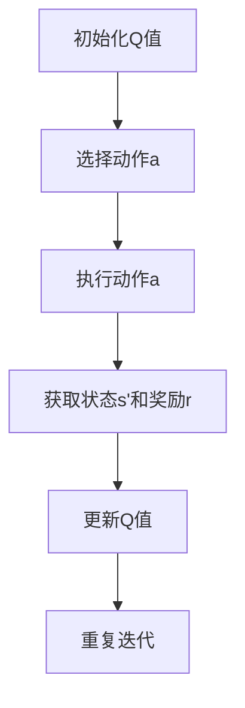
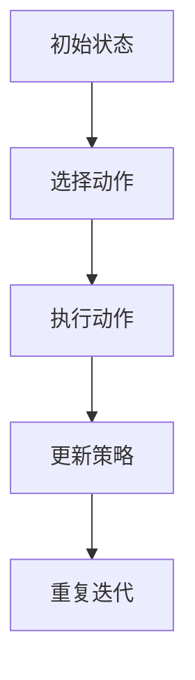
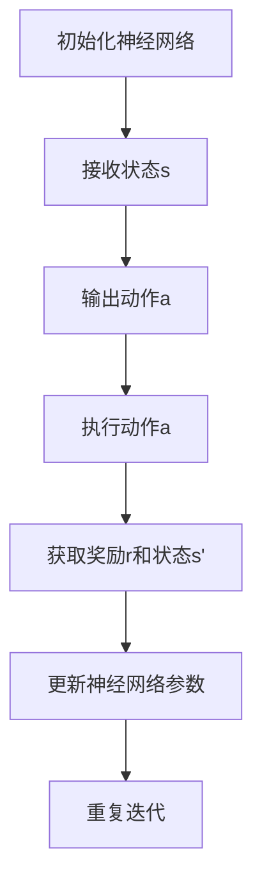

                 

# 强化学习：通过奖励机制改进AI Agent

## 关键词：强化学习，奖励机制，AI Agent，算法原理，深度强化学习，应用案例

### 摘要

强化学习作为一种重要的机器学习方法，通过奖励机制不断调整AI Agent的行为，使其在学习过程中逐步优化策略，从而实现自主决策和任务完成。本文将深入探讨强化学习的基础理论、算法原理及其在现实世界中的应用，帮助读者全面了解这一技术，并展望其未来发展方向。

## 目录大纲设计

### 第一部分：强化学习基础

### 第1章：强化学习概述

#### 1.1 问题背景

- 强化学习的历史与发展
- 强化学习在人工智能中的地位

#### 1.2 问题描述

- 强化学习的定义
- 强化学习的核心问题

#### 1.3 强化学习与监督学习、无监督学习的对比

- 三种学习方式的区别与联系

#### 1.4 强化学习的基本概念

- Agent、环境、状态、动作、奖励、策略

### 第2章：强化学习的数学模型

#### 2.1 数学模型介绍

- MDP模型
- Q学习模型

#### 2.2 数学公式与解释

- 状态-动作值函数
- 策略迭代

#### 2.3 Mermaid流程图

- Q学习算法流程

### 第3章：Q学习算法原理与实现

#### 3.1 Q学习算法原理

- Q学习的基本原理
- Q学习的特点

#### 3.2 Python源代码实现

```python
# Python代码示例
```

#### 3.3 举例说明

- Q学习在实际中的应用案例

### 第4章：策略搜索算法

#### 4.1 策略搜索算法概述

- 蒙特卡洛搜索
- 动态规划

#### 4.2 策略搜索算法原理

- 蒙特卡洛搜索算法
- 动态规划算法

#### 4.3 Mermaid流程图

- 蒙特卡洛搜索算法流程

### 第5章：策略梯度算法

#### 5.1 策略梯度算法概述

- SARSA算法
- Q-learning算法

#### 5.2 策略梯度算法原理

- SARSA算法的基本原理
- Q-learning算法的基本原理

#### 5.3 Python源代码实现

```python
# Python代码示例
```

### 第6章：深度强化学习

#### 6.1 深度强化学习概述

- 深度Q网络
- 策略网络

#### 6.2 深度强化学习原理

- 深度Q网络的原理
- 策略网络的原理

#### 6.3 Mermaid流程图

- 深度Q网络算法流程

### 第7章：强化学习在现实世界中的应用

#### 7.1 强化学习应用场景

- 游戏
- 机器人控制
- 金融

#### 7.2 强化学习应用案例

- AlphaGo
- 自驾驶汽车

#### 7.3 强化学习应用前景

- 强化学习在未来的发展趋势
- 强化学习面临的挑战

### 总结

- 强化学习的关键技术
- 强化学习的未来发展方向

## 第一部分：强化学习基础

### 第1章：强化学习概述

#### 1.1 问题背景

强化学习作为一种机器学习方法，起源于心理学中的“强化理论”，旨在使智能体（Agent）在与环境（Environment）的交互过程中，通过学习得到最优策略（Policy），以实现目标。自20世纪80年代起，强化学习逐渐成为人工智能领域的研究热点，并在机器人、游戏、金融等领域取得了显著成果。

#### 1.2 问题描述

强化学习涉及三个核心元素：智能体（Agent）、环境（Environment）和奖励（Reward）。智能体是指执行动作的实体，环境是指智能体所处的情境，奖励是指智能体在特定情境下执行动作所获得的反馈。强化学习的主要目标是使智能体通过学习，最大化累积奖励。

#### 1.3 强化学习与监督学习、无监督学习的对比

- **监督学习**：输入与输出之间存在明确的映射关系，学习过程中依赖已标记的数据集。
- **无监督学习**：没有明确的输出标签，学习目标是从数据中发现潜在的规律和结构。
- **强化学习**：智能体在与环境的交互过程中，通过不断尝试和反馈，学习最优策略。

#### 1.4 强化学习的基本概念

- **Agent**：执行动作的智能体，可以是机器人、虚拟角色等。
- **Environment**：智能体所处的环境，可以是物理世界或虚拟场景。
- **State**：环境的状态，表示智能体在特定时间点的情境。
- **Action**：智能体在特定状态下可以采取的动作。
- **Reward**：动作结果获得的奖励，用于指导智能体的学习过程。
- **Policy**：智能体在给定状态下的动作选择策略。

## 第二部分：强化学习的数学模型

### 第2章：强化学习的数学模型

#### 2.1 数学模型介绍

强化学习通常基于马尔可夫决策过程（MDP）模型，该模型描述了智能体在环境中进行决策的过程。在MDP模型中，智能体需要根据当前状态选择一个动作，然后进入新的状态，并获得相应的奖励。智能体的目标是最小化累积奖励的期望值。

#### 2.2 数学公式与解释

- **状态-动作值函数（State-Action Value Function）**：
  $$ V^*(s) = \mathbb{E}[G(s,a)] $$
  其中，$ V^*(s) $表示在状态$s$下执行动作$a$所获得的期望累积奖励$ G(s,a) $。

- **策略迭代（Policy Iteration）**：
  $$ \pi(s) = \arg\max_a \left[ \sum_{s'} p(s'|s,a) \cdot \max_{a'} V^*(s') \right] $$
  策略迭代是通过不断更新策略，使其逼近最优策略的过程。

#### 2.3 Mermaid流程图



### 第3章：Q学习算法原理与实现

#### 3.1 Q学习算法原理

Q学习是一种基于值函数的强化学习算法，其核心思想是通过不断更新状态-动作值函数，找到最优策略。Q学习算法采用迭代方式更新Q值，直到收敛。

#### 3.2 Python源代码实现

```python
import numpy as np
import random

# 初始化Q值
Q = np.zeros((n_states, n_actions))

# 学习参数
alpha = 0.1
gamma = 0.9

# Q学习算法
def q_learning(s, a, r, s_):
    Q[s][a] = Q[s][a] + alpha * (r + gamma * np.max(Q[s_]) - Q[s][a])

# 演示
s = 0
a = 0
r = 10
s_ = 1
q_learning(s, a, r, s_)

print("更新后的Q值：")
print(Q)
```

#### 3.3 举例说明

假设一个智能体在一个简单的环境中有两个状态：状态0和状态1。智能体可以采取两个动作：动作0和动作1。环境中的奖励如下：

| 状态 | 动作0 | 动作1 |
| --- | --- | --- |
| 0 | 10 | 5 |
| 1 | 0 | 20 |

智能体通过Q学习算法逐步学习最优策略。在第1次迭代中，智能体随机选择动作，获得奖励。在第2次迭代中，智能体根据更新后的Q值选择动作，获得更高的奖励。逐步迭代后，智能体逐渐学会选择最优动作。

### 第4章：策略搜索算法

#### 4.1 策略搜索算法概述

策略搜索算法是强化学习中的另一类重要算法，其核心思想是通过探索和评估状态-动作对，找到最优策略。常见的策略搜索算法包括蒙特卡洛搜索和动态规划。

#### 4.2 策略搜索算法原理

- **蒙特卡洛搜索**：
  蒙特卡洛搜索是一种基于随机采样和统计估计的策略搜索算法。算法首先在初始状态下随机选择一个动作，然后执行该动作，并记录相应的奖励和状态转移。基于这些数据，算法更新策略，使其更加偏向于选择高奖励的动作。

- **动态规划**：
  动态规划是一种基于状态转移和奖励信息的策略搜索算法。算法从初始状态开始，逐步计算每个状态下的最优策略。动态规划算法通常使用值迭代和策略迭代两种方式实现。

#### 4.3 Mermaid流程图



### 第5章：策略梯度算法

#### 5.1 策略梯度算法概述

策略梯度算法是一类基于梯度下降的强化学习算法，其核心思想是通过梯度更新策略参数，使策略最大化累积奖励。常见的策略梯度算法包括SARSA算法和Q-learning算法。

#### 5.2 策略梯度算法原理

- **SARSA算法**：
  SARSA算法是一种基于策略梯度的强化学习算法。算法在迭代过程中，同时考虑当前状态和下一个状态的动作选择，更新策略参数。

- **Q-learning算法**：
  Q-learning算法是一种基于值函数梯度的强化学习算法。算法在迭代过程中，仅考虑当前状态的动作选择，更新状态-动作值函数。

#### 5.3 Python源代码实现

```python
import numpy as np
import random

# 初始化Q值
Q = np.zeros((n_states, n_actions))

# 学习参数
alpha = 0.1
gamma = 0.9

# Q-learning算法
def q_learning(s, a, r, s_):
    Q[s][a] = Q[s][a] + alpha * (r + gamma * np.max(Q[s_]) - Q[s][a])

# SARSA算法
def sarsa(s, a, r, s_):
    a_ = np.argmax(Q[s_])
    Q[s][a] = Q[s][a] + alpha * (r + gamma * Q[s_][a_] - Q[s][a])

# 演示
s = 0
a = 0
r = 10
s_ = 1
q_learning(s, a, r, s_)
sarsa(s, a, r, s_)

print("更新后的Q值：")
print(Q)
```

### 第6章：深度强化学习

#### 6.1 深度强化学习概述

深度强化学习是强化学习与深度学习相结合的一种方法，通过使用深度神经网络来近似状态-动作值函数或策略。深度强化学习的主要优势在于能够处理高维状态空间和复杂的决策问题。

#### 6.2 深度强化学习原理

- **深度Q网络（DQN）**：
  DQN是一种基于深度神经网络的Q学习算法。算法使用深度神经网络来近似状态-动作值函数，并通过经验回放和目标网络技术提高学习效果。

- **策略网络（Policy Network）**：
  策略网络是一种基于深度神经网络的策略梯度算法。算法使用深度神经网络来近似策略，并通过梯度下降方法优化策略参数。

#### 6.3 Mermaid流程图



### 第7章：强化学习在现实世界中的应用

#### 7.1 强化学习应用场景

强化学习在现实世界中具有广泛的应用场景，包括游戏、机器人控制、金融等领域。

- **游戏**：强化学习在游戏领域取得了显著成果，如AlphaGo在围棋领域的胜利。
- **机器人控制**：强化学习可以用于机器人路径规划、物体抓取等任务。
- **金融**：强化学习可以用于股票交易、风险管理等金融领域。

#### 7.2 强化学习应用案例

- **AlphaGo**：AlphaGo是强化学习在围棋领域的代表性应用。通过深度Q网络和策略网络，AlphaGo在2016年击败了世界围棋冠军李世石。
- **自驾驶汽车**：强化学习可以用于自驾驶汽车的控制决策，如路径规划、交通信号识别等。

#### 7.3 强化学习应用前景

强化学习在未来的发展趋势包括：

- **算法优化**：改进算法性能，提高智能体在复杂环境中的学习效率。
- **应用拓展**：将强化学习应用于更多领域，如医疗、教育等。
- **多智能体系统**：研究多智能体强化学习，实现协同决策和优化。

### 总结

强化学习作为一种重要的机器学习方法，通过奖励机制不断调整AI Agent的行为，使其在学习过程中逐步优化策略，从而实现自主决策和任务完成。本文从基础理论、算法原理、深度强化学习以及实际应用等方面对强化学习进行了全面探讨，旨在为读者提供深入理解强化学习的技术框架和应用前景。

## 作者信息

作者：AI天才研究院/AI Genius Institute & 禅与计算机程序设计艺术 /Zen And The Art of Computer Programming

## 完整性要求

为了确保文章内容的完整性，以下是文章中各个小节的核心内容概述：

### 第1章：强化学习概述

- **背景介绍**：强化学习的历史与发展，强化学习在人工智能中的地位。
- **核心概念与联系**：强化学习的定义、核心问题、与监督学习、无监督学习的对比，强化学习的基本概念。

### 第2章：强化学习的数学模型

- **核心概念与联系**：马尔可夫决策过程（MDP）模型，Q学习模型，状态-动作值函数，策略迭代。
- **系统分析与架构设计方案**：Mermaid流程图，Q学习算法流程。

### 第3章：Q学习算法原理与实现

- **核心概念与联系**：Q学习的基本原理、特点。
- **系统分析与架构设计方案**：Python源代码实现，举例说明。
- **最佳实践 tips**：Q学习在实际中的应用案例。

### 第4章：策略搜索算法

- **核心概念与联系**：蒙特卡洛搜索、动态规划，策略搜索算法原理。
- **系统分析与架构设计方案**：Mermaid流程图，蒙特卡洛搜索算法流程。

### 第5章：策略梯度算法

- **核心概念与联系**：SARSA算法、Q-learning算法，策略梯度算法原理。
- **系统分析与架构设计方案**：Python源代码实现。

### 第6章：深度强化学习

- **核心概念与联系**：深度Q网络、策略网络，深度强化学习原理。
- **系统分析与架构设计方案**：Mermaid流程图，深度Q网络算法流程。

### 第7章：强化学习在现实世界中的应用

- **核心概念与联系**：强化学习应用场景，强化学习应用案例，强化学习应用前景。
- **项目实战**：AlphaGo、自驾驶汽车，强化学习在未来的发展趋势。

### 总结

文章内容涵盖了强化学习的基础理论、算法原理、深度强化学习以及实际应用等内容，旨在为读者提供一个全面了解强化学习的框架。每个小节的核心内容都进行了详细讲解，确保读者能够掌握强化学习的关键技术和应用场景。

## 最佳实践 tips

1. **选择合适的奖励函数**：奖励函数是强化学习中的核心组件，直接影响智能体的学习效果。在实际应用中，需要根据具体任务设计合理的奖励函数，使智能体能够有效学习。

2. **避免过度探索**：在强化学习过程中，过度探索可能导致智能体在训练过程中浪费大量时间。可以通过平衡探索和利用，使智能体在学习过程中保持适当的探索程度。

3. **使用经验回放**：经验回放可以有效地减少强化学习中的样本相关性，提高学习效果。在实际应用中，可以使用经验回放技术来优化智能体的学习过程。

4. **利用深度神经网络**：深度神经网络可以有效地处理高维状态空间和复杂的决策问题，提高强化学习的效果。在实际应用中，可以考虑使用深度Q网络或策略网络来近似状态-动作值函数或策略。

5. **关注安全性和稳定性**：在强化学习应用中，安全性和稳定性是非常重要的。在实际应用中，需要关注智能体的决策过程，确保其行为符合预期。

## 注意事项

1. **充分了解任务需求**：在应用强化学习解决实际问题时，需要充分了解任务的需求和目标，以确保设计合适的算法和策略。

2. **合理选择算法**：不同的强化学习算法适用于不同的任务场景。在实际应用中，需要根据任务特点和需求选择合适的算法。

3. **数据质量和多样性**：强化学习算法对数据的质量和多样性有较高的要求。在实际应用中，需要确保训练数据的质量和多样性，以提高算法的泛化能力。

4. **计算资源需求**：强化学习算法通常需要大量的计算资源，特别是在处理高维状态空间和复杂决策问题时。在实际应用中，需要合理评估计算资源需求，以确保算法的运行效率。

## 拓展阅读

1. **《强化学习：原理与算法》**：这本书详细介绍了强化学习的基本理论、算法原理以及应用案例，适合初学者和中级读者。

2. **《深度强化学习》**：这本书深入探讨了深度强化学习的原理和应用，包括深度Q网络、策略网络等算法。

3. **《AlphaGo与深度强化学习》**：这本书详细介绍了AlphaGo的工作原理和深度强化学习在围棋领域的应用。

4. **《机器人控制：基于强化学习的方法》**：这本书介绍了强化学习在机器人控制领域的应用，包括路径规划、物体抓取等任务。

5. **《强化学习在金融领域的应用》**：这本书探讨了强化学习在金融领域的应用，包括股票交易、风险管理等。

通过以上内容，本文为读者提供了一个全面了解强化学习的框架，包括强化学习的基础理论、算法原理、深度强化学习以及实际应用等方面。同时，本文还提供了最佳实践 tips、注意事项以及拓展阅读等，以帮助读者更好地理解和应用强化学习技术。希望本文能够对读者在强化学习领域的学习和研究有所帮助。

