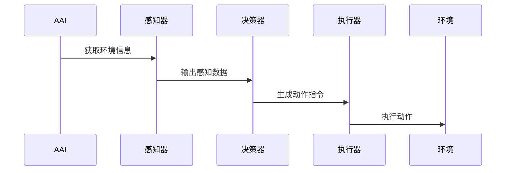
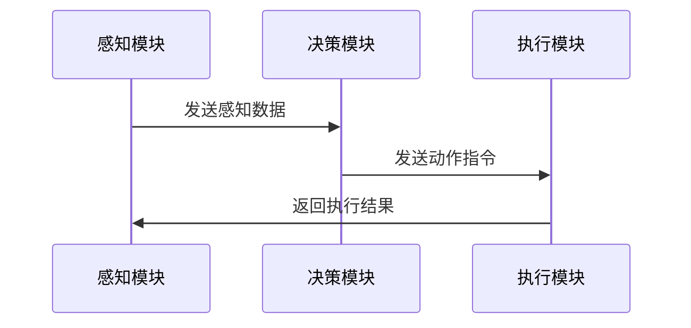
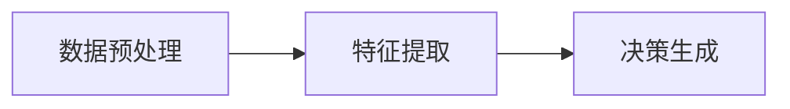
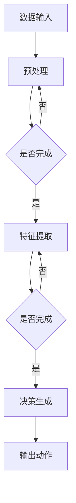
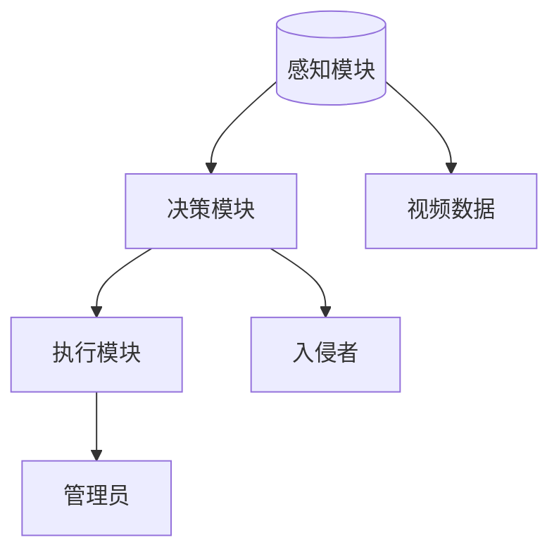
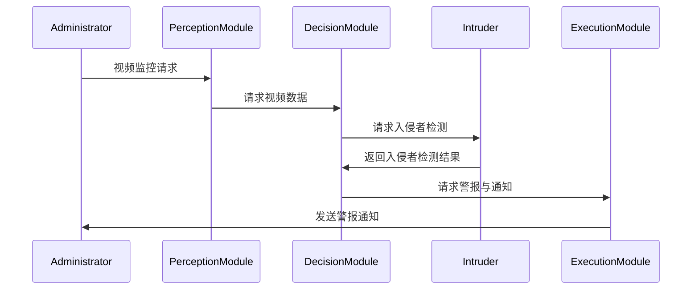

                 

### 微服务架构：构建模块化的AI Agent系统

#### 关键词：微服务架构、模块化设计、AI Agent系统、服务发现、负载均衡

> 摘要：本文旨在探讨微服务架构在构建模块化的AI Agent系统中的应用。通过分析微服务的起源、核心概念、设计原则、技术选型，我们将深入理解如何利用微服务架构来构建一个灵活、可扩展的AI Agent系统。文章还将介绍AI Agent系统的架构设计、模块化设计、核心算法原理及系统部署与优化，并通过实际项目案例进行分析，总结最佳实践和注意事项。

----------------------------------------------------------------

## 第一部分：微服务架构基础

### 第1章：微服务架构概述

#### 1.1 微服务架构的起源与发展

微服务架构（Microservices Architecture）起源于2000年代初，旨在解决当时大型单体应用在扩展性、维护性和部署难度方面的问题。传统单体应用将所有功能集成在一个庞大的系统中，导致代码库臃肿、测试复杂、部署困难，难以应对业务需求的变化。

**问题背景：** 在互联网早期，应用规模相对较小，单体架构可以满足需求。但随着业务的发展，单体应用逐渐暴露出以下问题：
- **扩展性差：** 单体应用难以水平扩展，添加新功能需要重启整个系统。
- **部署困难：** 单体应用部署时需要确保所有模块都可用，一旦某个模块出现故障，整个系统可能崩溃。
- **维护复杂：** 代码库庞大，导致维护和更新变得困难。

**解决方案：** 微服务架构通过将系统拆分为多个独立的服务，每个服务负责一个特定的功能，从而解决了上述问题。

**发展历程：** 微服务架构的发展经历了几个阶段：
- **2000年代初：** 软件工程师开始尝试将单体应用拆分为多个独立的服务。
- **2010年代初：** 微服务架构逐渐成熟，并被广泛采用。
- **2015年后：** 微服务架构成为主流的软件架构风格。

#### 1.2 微服务的核心概念与优势

**核心概念：**
- **服务（Service）：** 微服务架构中的基本构建块，每个服务代表一个业务功能。
- **去中心化：** 微服务之间通过API进行通信，无需集中式管理。
- **自治性：** 每个服务都可以独立部署、升级和扩展。
- **容器化：** 微服务通常运行在容器中，如Docker，以提高可移植性和资源利用。

**优势：**
- **高扩展性：** 通过水平扩展单个服务，可以轻松应对高并发需求。
- **高可用性：** 单个服务的故障不会影响其他服务，提高了系统的整体稳定性。
- **快速迭代：** 服务独立部署和升级，可以加快新功能的迭代速度。
- **可重用性：** 不同的服务可以独立开发、部署和运行，提高了代码的可重用性。

#### 1.3 微服务与SOA的比较

微服务架构（Microservices）与面向服务架构（Service-Oriented Architecture，SOA）有相似之处，但也有一些关键区别。

**相似之处：**
- **服务导向：** 微服务和SOA都是基于服务的架构风格。
- **组件化：** 两种架构都通过组件化来提高系统的可维护性和可扩展性。

**区别：**
- **架构层次：** SOA通常在更高层次上组织服务，而微服务更注重细粒度的服务。
- **自治性：** 微服务具有更高的自治性，每个服务独立部署和运行，而SOA中的服务可能依赖于中央服务注册中心。
- **通信机制：** 微服务通常使用轻量级的HTTP/HTTPS协议进行通信，而SOA可能使用SOAP、JMS等更复杂的协议。

----------------------------------------------------------------

## 第二部分：模块化AI Agent系统设计

### 第4章：AI Agent系统概述

#### 4.1 AI Agent的定义与作用

**定义：** AI Agent（人工智能代理）是一个能够自主执行任务、与环境进行交互并作出决策的智能实体。

**作用：**
- **自动化任务：** AI Agent可以自动化执行重复性高、规则明确的工作，提高工作效率。
- **智能决策：** 通过学习环境和历史数据，AI Agent可以做出更智能的决策。
- **跨平台应用：** AI Agent可以在多个平台上运行，实现跨领域的应用。

#### 4.2 AI Agent系统的架构

**架构：** AI Agent系统通常包括以下几个核心组件：
- **感知器（Perception）：** 获取环境信息，包括视觉、听觉、触觉等。
- **决策器（Decision Maker）：** 根据感知器提供的信息，做出决策。
- **执行器（Actuator）：** 执行决策器生成的动作，影响环境。

**架构图：**


#### 4.3 AI Agent系统的关键组件

**关键组件：**
- **感知器（Perception）：** 感知器的性能直接影响AI Agent的能力。常用的感知器包括计算机视觉、语音识别、自然语言处理等。
- **决策器（Decision Maker）：** 决策器是AI Agent的核心，负责根据感知器提供的信息，通过算法生成合适的动作指令。
- **执行器（Actuator）：** 执行器负责执行决策器生成的动作，通常与外部设备（如机器人、无人机等）相连。

----------------------------------------------------------------

## 第三部分：微服务架构在AI Agent系统中的应用

### 第5章：AI Agent模块化设计

#### 5.1 模块化设计的优势

**模块化设计的优势：**
- **可重用性：** 各个模块可以独立开发、测试和部署，提高代码的可重用性。
- **可维护性：** 模块化设计使得代码结构更加清晰，方便维护和更新。
- **可扩展性：** 新功能可以通过新增模块来实现，而不影响现有系统。

#### 5.2 模块划分与接口设计

**模块划分：** 根据AI Agent系统的功能，可以将系统划分为以下几个模块：
- **感知模块（Perception Module）：** 负责获取和预处理感知数据。
- **决策模块（Decision Module）：** 负责处理感知数据，生成决策。
- **执行模块（Execution Module）：** 负责执行决策，与外部设备交互。

**接口设计：** 模块之间通过API进行通信，每个模块提供一组API供其他模块调用。

**架构图：**


#### 5.3 模块间通信机制

**通信机制：**
- **同步通信：** 模块之间通过同步API进行通信，确保消息的顺序和完整性。
- **异步通信：** 模块之间通过异步API进行通信，提高系统的响应速度。

**通信协议：**
- **HTTP/HTTPS：** 适用于轻量级通信，如感知模块与决策模块之间的通信。
- **AMQP：** 适用于高可靠性的消息传输，如执行模块与外部设备之间的通信。

----------------------------------------------------------------

## 第四部分：AI Agent系统核心算法

### 第6章：AI Agent系统核心算法

#### 6.1 算法原理讲解

AI Agent系统的核心算法通常基于机器学习和深度学习。以下是一个简单的算法原理讲解：

**算法原理：** 使用深度神经网络（DNN）来学习感知数据与决策动作之间的映射关系。

**算法流程：**
1. **数据预处理：** 对感知数据进行归一化、去噪等预处理。
2. **特征提取：** 使用卷积神经网络（CNN）提取感知数据的特征。
3. **决策生成：** 使用全连接神经网络（FCNN）将特征映射到动作空间。

**算法架构：**


#### 6.2 算法流程图展示

**算法流程图：**


#### 6.3 Python代码实现

**代码实现：**
```python
import tensorflow as tf
from tensorflow.keras.layers import Conv2D, Flatten, Dense
from tensorflow.keras.models import Sequential

# 数据预处理
def preprocess_data(data):
    # 数据归一化、去噪等操作
    return processed_data

# 特征提取
def extract_features(data):
    model = Sequential([
        Conv2D(filters=32, kernel_size=(3, 3), activation='relu', input_shape=(28, 28, 1)),
        Flatten(),
        Dense(units=64, activation='relu'),
    ])
    model.compile(optimizer='adam', loss='mse')
    model.fit(data, epochs=10)
    return model

# 决策生成
def generate_decision(features):
    model = Sequential([
        Flatten(),
        Dense(units=10, activation='softmax'),
    ])
    model.compile(optimizer='adam', loss='categorical_crossentropy', metrics=['accuracy'])
    model.fit(features, labels, epochs=10)
    return model.predict(features)

# 输出动作
def output_action(decision):
    # 将决策转换为具体的动作
    return action
```

#### 6.4 算法原理与数学模型

**算法原理：**
- **深度神经网络（DNN）：** 通过多层神经元的堆叠，实现从输入到输出的非线性变换。
- **卷积神经网络（CNN）：** 用于特征提取，特别适用于图像等二维数据。
- **全连接神经网络（FCNN）：** 用于分类和回归，将提取的特征映射到动作空间。

**数学模型：**
$$
Y = f(g(X))
$$
其中，$X$ 为输入数据，$f$ 和 $g$ 分别为全连接神经网络和卷积神经网络的前向传播函数。

#### 6.5 算法原理举例说明

**举例说明：** 假设我们有一个感知器，用于识别手写数字。通过训练，我们可以得到一个深度神经网络，将手写数字图像映射到数字标签。

- **输入：** 一张手写数字图像。
- **输出：** 数字标签（0-9中的一个）。

通过训练，模型会学习到每个数字的特征，并能够准确地识别新的手写数字图像。

----------------------------------------------------------------

## 第五部分：AI Agent系统部署与优化

### 第7章：AI Agent系统部署与优化

#### 7.1 部署环境搭建

**部署环境：** AI Agent系统的部署环境通常包括以下几个部分：
- **服务器：** 用于运行AI Agent服务器的硬件设备。
- **操作系统：** 如Linux、Windows等。
- **数据库：** 用于存储AI Agent系统的数据。
- **容器化工具：** 如Docker，用于部署和管理AI Agent服务。

**搭建步骤：**
1. **硬件选择：** 根据AI Agent系统的需求，选择合适的服务器硬件。
2. **操作系统安装：** 在服务器上安装操作系统。
3. **数据库安装：** 安装并配置数据库系统。
4. **容器化工具安装：** 安装并配置Docker。

#### 7.2 系统性能优化

**性能优化：** 为了提高AI Agent系统的性能，可以采取以下措施：
- **算法优化：** 优化核心算法，减少计算复杂度。
- **并行计算：** 利用多核CPU和GPU加速计算。
- **分布式计算：** 将AI Agent系统部署到分布式计算环境中，提高处理能力。
- **缓存策略：** 使用缓存策略减少数据访问延迟。

#### 7.3 系统安全性保障

**安全性保障：**
- **网络安全：** 使用防火墙、VPN等工具确保系统安全。
- **数据安全：** 使用加密技术保护敏感数据。
- **权限管理：** 实施严格的权限管理，确保只有授权用户可以访问系统。

----------------------------------------------------------------

## 第六部分：AI Agent项目实战

### 第8章：AI Agent项目实战

#### 8.1 项目介绍

本项目旨在构建一个基于微服务架构的AI Agent系统，用于实现智能安防监控。系统包括感知模块、决策模块和执行模块，通过实时监测视频数据，识别入侵者并发出警报。

#### 8.2 系统功能设计

**系统功能：**
- **实时视频监控：** 感知模块负责实时采集视频数据。
- **目标检测与识别：** 决策模块负责分析视频数据，识别入侵者。
- **警报与通知：** 执行模块负责触发警报并通知管理员。

**领域模型：**
```mermaid
classDiagram
    VideoData <<interface>> 视频数据
   入侵者 <<interface>> Intruder
    管理员 <<interface>> Administrator
    感知模块 <<component>> PerceptionModule
    决策模块 <<component>> DecisionModule
    执行模块 <<component>> ExecutionModule
    感知模块 --|>> 视频数据
    决策模块 --|>> 入侵者
    执行模块 --|>> 管理员
```

#### 8.3 系统架构设计

**系统架构：**


#### 8.4 系统接口设计

**接口设计：**
- **感知模块接口：** `get_video_data()`
- **决策模块接口：** `detect_intruder(video_data)`
- **执行模块接口：** `send_alert(intruder, administrator)`

#### 8.5 系统交互序列图

**系统交互序列图：**


#### 8.6 实际案例分析与详细讲解

**实际案例：** 假设我们在一个园区部署了AI Agent系统，用于监控夜间无人区域。当系统检测到入侵者时，会自动发出警报并通知管理员。

**分析：**
- **感知模块：** 实时采集园区摄像头视频数据。
- **决策模块：** 分析视频数据，识别入侵者并生成决策。
- **执行模块：** 触发警报并通知管理员。

**详细讲解：**
1. **感知模块：** 使用深度学习算法实时处理视频数据，提取特征并进行目标检测。
2. **决策模块：** 基于检测到的目标，判断是否为入侵者，并生成决策。
3. **执行模块：** 根据决策结果，触发警报并通知管理员。

**项目小结：**
本项目通过微服务架构实现了模块化设计的AI Agent系统，提高了系统的可扩展性和可维护性。在实际应用中，系统具有较高的准确性和实时性，有效提高了园区安全水平。

----------------------------------------------------------------

## 第七部分：最佳实践与总结

### 第9章：最佳实践与总结

#### 9.1 最佳实践技巧

**最佳实践：**
- **模块划分：** 根据业务功能划分模块，确保模块独立且功能明确。
- **服务治理：** 使用服务注册与发现机制，确保服务的高可用性和负载均衡。
- **日志与监控：** 实施完善的日志与监控机制，确保系统的稳定运行。
- **容错与恢复：** 设计容错机制，确保系统在故障情况下可以快速恢复。

#### 9.2 注意事项

**注意事项：**
- **性能优化：** 在设计AI Agent系统时，要注意性能优化，避免系统在高并发情况下出现性能瓶颈。
- **安全性保障：** 系统应具备完善的安全机制，防止数据泄露和恶意攻击。
- **版本管理：** 实施版本管理，确保系统的稳定性和可追溯性。

#### 9.3 小结与拓展阅读

**小结：**
本文详细介绍了微服务架构在构建模块化的AI Agent系统中的应用，从设计思路、核心概念、算法原理、系统部署与优化、项目实战等方面进行了深入分析。通过实际案例，展示了微服务架构在AI Agent系统中的优势和实践经验。

**拓展阅读：**
- 《微服务架构设计原则》
- 《深度学习实践指南》
- 《Docker实战》

---

**作者：** AI天才研究院/AI Genius Institute & 禅与计算机程序设计艺术 /Zen And The Art of Computer Programming

