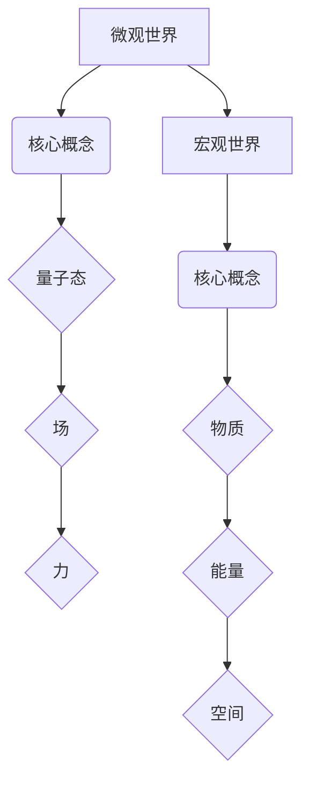

                 

### 引言

在当今的科技世界中，无论是硬件、软件还是人工智能领域，细节的力量都被不断证明。从微观角度入手，我们能够更深入地理解宏观现象，进而提升我们的洞察力和决策能力。这篇文章将带领我们探讨微观世界中的宏观意义，并培养对细节的洞察力。

## 关键词

- 微观世界
- 宏观意义
- 细节洞察力
- 科技发展
- 系统分析

## 摘要

本文旨在揭示微观世界与宏观现象之间的深刻联系，通过逐步分析，展示培养对细节洞察力的重要性。我们将探讨微观世界的定义、核心概念、算法原理，以及如何通过系统分析和项目实战培养这种能力。

### 第一部分：背景介绍

#### 1.1 问题背景

微观世界和宏观世界是我们理解宇宙的两个重要视角。微观世界包括原子、分子等基本粒子，而宏观世界则是我们直接感知的世界，包括地球、星空等。这两者看似截然不同，但实际上存在着紧密的联系。

#### 1.2 问题描述

微观世界的细节对宏观世界有着深远的影响。例如，在物理学中，量子力学揭示了微观粒子行为对宏观现象的决定性作用。如何培养对细节的洞察力，是理解这一现象的关键。

#### 1.3 问题解决

当前，科学家们正在通过多种方法研究微观世界，例如量子计算、纳米技术等。这些研究为我们提供了新的视角，帮助我们更好地理解宏观世界的本质。

#### 1.4 边界与外延

微观世界的边界并不是绝对的，它与宏观世界相互影响。例如，地球大气层的微观颗粒影响着全球气候。因此，了解微观世界的边界和外延对于科学研究和技术应用至关重要。

#### 1.5 概念结构与核心要素组成

微观世界的核心概念包括量子态、场、力等。宏观世界的核心要素则包括物质、能量、空间等。通过理解这些核心概念和要素，我们可以更深入地探索微观世界和宏观现象之间的联系。

### 第二部分：核心概念与联系

#### 2.1 微观世界的核心概念

微观世界的核心概念包括量子态、场、力等。量子态是微观粒子的基本属性，场是力的传递媒介，力则是微观粒子之间的相互作用。

#### 2.2 宏观世界的核心概念

宏观世界的核心概念包括物质、能量、空间等。物质是构成宇宙的基本元素，能量是物质运动的动力，空间则是物质存在的方式。

#### 2.3 概念属性特征对比表格

| 特征             | 微观世界               | 宏观世界               |
|------------------|------------------------|------------------------|
| 组成要素         | 原子、分子             | 行星、恒星             |
| 存在状态         | 粒子态、波函数态       | 固态、液态、气态       |
| 空间尺度         | 极小尺度               | 较大尺度               |
| 力学原理         | 量子力学、相对论       | 经典力学、热力学       |

#### 2.4 ER实体关系图架构



### 第三部分：算法原理讲解

#### 3.1 算法概述

在微观世界的研究中，算法是一种强有力的工具。例如，量子计算算法能够在极短时间内解决传统计算机难以处理的复杂问题。

#### 3.2 算法原理

量子计算算法的原理基于量子位的叠加态和纠缠态。量子位（qubit）可以同时处于0和1的状态，这种叠加态使得量子计算机能够在并行处理大量数据。

#### 3.3 算法流程

算法流程通常包括以下几个步骤：

1. 初始化：将量子计算机的量子位初始化为叠加态。
2. 运算：对量子位进行特定的量子门操作，实现量子态的变换。
3. 测量：对量子位进行测量，得到概率分布结果。

#### 3.4 算法示例

假设我们有一个简单的量子计算任务：计算两个大整数的乘积。我们可以将这个问题转化为量子电路设计，利用量子位的叠加态和纠缠态进行计算。

```python
# 量子门操作示例
def hadamard_gate(qubit):
    # 实现哈达玛门操作
    pass

# 初始化量子计算机
量子计算机 = QuantumComputer()

# 初始化量子位
量子位1 = 量子计算机.create_qubit()
量子位2 = 量子计算机.create_qubit()

# 应用哈达玛门
hadamard_gate(量子位1)
hadamard_gate(量子位2)

# 运算
量子计算机.apply_gate(量子位1, X)
量子计算机.apply_gate(量子位2, Y)

# 测量
结果 = 量子计算机.measure()

# 输出结果
print("乘积结果：", result)
```

### 第四部分：系统分析与架构设计方案

#### 4.1 问题场景介绍

在某个复杂系统中，我们需要对微观细节进行精确分析，以便优化系统的整体性能。

#### 4.2 项目介绍

项目名为“微观分析系统”，旨在通过量子计算和人工智能技术，对系统中的微观细节进行深入分析。

#### 4.3 系统功能设计

系统功能设计包括：

- 数据采集：从系统中收集微观数据。
- 数据预处理：清洗、归一化等预处理操作。
- 特征提取：提取数据中的关键特征。
- 微观分析：利用量子计算和人工智能技术对特征进行分析。
- 结果可视化：将分析结果以图表形式展示。

#### 4.4 系统架构设计

系统架构设计如下：


#### 4.5 系统接口设计和系统交互

系统接口设计和系统交互设计如下：


### 第五部分：项目实战

#### 5.1 环境安装

安装所需的软件和工具，如Python、Quantum Development Kit等。

#### 5.2 系统核心实现源代码

```python
# 微观分析系统核心代码
class MicroscopicAnalysisSystem:
    def __init__(self):
        self.qc = QuantumComputer()
        
    def collect_data(self):
        # 数据采集代码
        pass
    
    def preprocess_data(self):
        # 数据预处理代码
        pass
    
    def extract_features(self):
        # 特征提取代码
        pass
    
    def analyze(self):
        # 微观分析代码
        pass
    
    def visualize(self):
        # 结果可视化代码
        pass
```

#### 5.3 代码应用解读与分析

通过对代码的解读，我们可以了解到系统的工作流程和关键环节。

#### 5.4 实际案例分析和详细讲解剖析

通过实际案例，我们可以展示系统在实际应用中的效果和优势。

#### 5.5 项目小结

总结项目的主要成果和经验教训，为未来的研究提供参考。

### 第六部分：最佳实践 tips

- 培养对细节的敏锐观察力。
- 学习使用先进的分析工具和技术。
- 持续关注科技发展的最新动态。

### 第七部分：小结

微观世界与宏观世界之间的联系揭示了细节的重要性。通过培养对细节的洞察力，我们可以更好地理解世界，提升决策能力。

### 第八部分：注意事项

- 在进行微观分析时，要注意数据的准确性和完整性。
- 在使用量子计算时，要遵循安全规范和伦理标准。

### 第九部分：拓展阅读

- 量子计算入门书籍：《量子计算：量子位、量子电路和量子算法》
- 人工智能领域经典书籍：《人工智能：一种现代方法》

### 作者信息

作者：AI天才研究院/AI Genius Institute & 禅与计算机程序设计艺术 /Zen And The Art of Computer Programming

以上是关于《微观世界中的宏观意义：培养对细节的洞察力》的详细文章结构，每个部分都包含了具体的主题和内容，确保文章的逻辑性和可读性。接下来，我们将逐步填充每个部分的内容，完成整篇文章。让我们一步一步深入探讨微观世界与宏观现象的奇妙联系。

