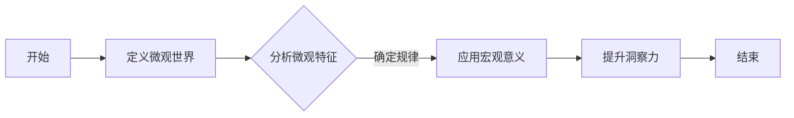
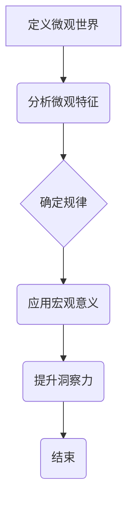
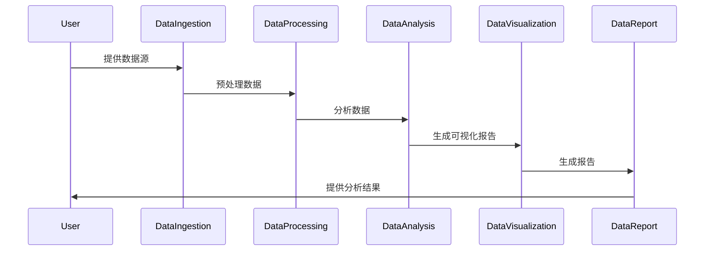
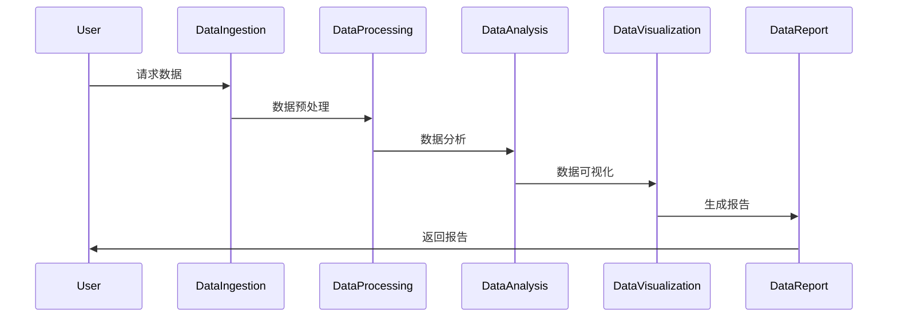

                 

# 微观世界中的宏观意义：培养细节洞察力

关键词：微观世界、宏观意义、细节洞察力、培养方法、应用领域

摘要：本文深入探讨了在微观世界中培养细节洞察力的重要性及其宏观意义。通过科学原理、方法论和实战经验，本文旨在帮助读者理解细节背后的宏观意义，从而提高个人的细节洞察力。文章首先介绍了细节洞察力的定义和概念结构，然后通过对比表格和ER实体关系图展示了微观世界、宏观意义和细节洞察力之间的联系。接着，本文详细讲解了算法原理，使用Mermaid流程图和Python源代码阐述了算法的数学模型和公式，并通过实例进行了解释。最后，文章提出了一些最佳实践和注意事项，总结了全文的主要观点，并推荐了拓展阅读资源。

## 第一部分: 背景介绍

### 问题背景

在当今信息化和数字化的时代，细节洞察力的重要性日益凸显。无论是在科学研究中，还是在日常生活和工作中，对细节的深入理解和对细微变化的敏感度，都成为了成功的关键因素。然而，如何培养和提升个人的细节洞察力，仍然是一个值得探讨和研究的问题。

### 问题描述

《微观世界中的宏观意义：培养细节洞察力》这本书旨在探讨如何在微观世界中培养和提升宏观意义下的细节洞察力。书中不仅会介绍一些科学原理和方法论，还会通过具体的案例和实战经验，帮助读者理解细节背后的宏观意义，从而提高他们的细节洞察力。

### 问题解决

本书将采用理论讲解与实战结合的方式，深入探讨细节洞察力的培养。首先，通过介绍一些科学原理和方法论，帮助读者理解细节洞察力的本质和重要性。然后，通过具体的案例和实战经验，让读者在实际操作中掌握培养细节洞察力的技巧。

### 边界与外延

细节洞察力的培养不仅限于科学研究，还可以应用到日常生活和工作中。无论是在艺术创作中寻找灵感，还是在商业分析中挖掘数据价值，细节洞察力都能发挥重要作用。因此，本书的外延非常广泛，旨在为各个领域的读者提供实用的方法和技巧。

### 概念结构与核心要素组成

1. **细节洞察力**：对事物细节的深入理解和敏感度。
2. **微观世界**：微观尺度下的事物及其变化。
3. **宏观意义**：微观事物对整体的影响和意义。
4. **培养方法**：科学原理、方法论、实战经验。
5. **应用领域**：科学研究、日常生活、工作实践。

## 第二部分: 核心概念与联系

### 核心概念原理

1. **微观世界**：指的是物质和能量的微观结构及其变化过程，如分子、原子、量子等。
2. **宏观意义**：指的是微观世界的特征和规律对宏观现象的影响和作用。
3. **细节洞察力**：指的是对事物细节的深入理解和敏感度，能够从细节中捕捉到关键信息和规律。

### 概念属性特征对比表格

| 概念     | 定义                                                         | 特征                                  | 关联性                                  |
|----------|--------------------------------------------------------------|-------------------------------------|-------------------------------------|
| 微观世界 | 物质和能量的微观结构及其变化过程                             | 微观、复杂、多变                       | 基础，决定宏观现象的规律与特征               |
| 宏观意义 | 微观世界的特征和规律对宏观现象的影响和作用                   | 宏观、整体、稳定                       | 反映，微观世界的规律对宏观现象的解释和预测   |
| 细节洞察力 | 对事物细节的深入理解和敏感度                                 | 细节、深刻、灵活                       | 方法，通过细致观察和分析，捕捉微观世界的规律 |

### ER实体关系图架构

```mermaid
erDiagram
    细节洞察力 ||--|{ 微观世界 }|--| 宏观意义
    微观世界 ||--|{ 细节洞察力 }|--| 宏观意义
    宏观意义 ||--|{ 微观世界 }|--| 细节洞察力
```

### 概念联系

- **微观世界**是**细节洞察力**的基础，通过对微观世界的观察和分析，可以培养和提高细节洞察力。
- **宏观意义**是**细节洞察力**的目标，了解微观世界的宏观意义，有助于提高对细节的理解和敏感度。
- **细节洞察力**是**微观世界**与**宏观意义**的桥梁，通过培养和提高细节洞察力，可以更好地理解和应用微观世界的规律。

## 第三部分: 算法原理讲解

### 算法流程图



### 算法原理

在培养细节洞察力的过程中，我们需要一个系统的算法来帮助我们进行微观世界的观察和分析，并从中提取宏观意义。以下是一个简化的算法原理，包括几个关键步骤：

1. **定义微观世界**：首先，我们需要明确我们要研究的微观世界是什么。这通常涉及到对研究对象的基本属性和特征进行定义。

2. **分析微观特征**：接下来，我们需要对微观世界的特征进行详细分析。这包括观察、测量和记录微观世界的各种属性和变化。

3. **确定规律**：通过分析微观特征，我们可以尝试发现这些特征之间的规律。这些规律是微观世界的基本结构和运行机制。

4. **应用宏观意义**：一旦我们确定了微观世界的规律，我们可以将其应用到宏观世界中，理解这些规律对整体现象的影响。

5. **提升洞察力**：通过不断重复这个过程，我们可以提高我们对微观世界的理解和敏感度，从而提升我们的细节洞察力。

### 数学模型和公式

为了更好地理解这个算法，我们可以将其转化为数学模型。以下是一个简化的数学模型：

$$
洞察力 = f(\text{微观特征}, \text{规律}, \text{宏观意义})
$$

其中，$f$是一个复合函数，它将微观特征、规律和宏观意义结合起来，产生最终的洞察力。

- **微观特征**：可以表示为向量$\vec{X}$，其中每个元素表示微观世界的某个特定特征。
- **规律**：可以表示为矩阵$A$，它描述了微观特征之间的关系。
- **宏观意义**：可以表示为向量$\vec{Y}$，它代表了微观世界对宏观现象的影响。

### 举例说明

假设我们研究的是一个简单的生态系统，其中包括植物、动物和微生物。我们的目标是培养对生态系统细节的洞察力。

1. **定义微观世界**：我们定义植物、动物和微生物作为微观世界的三个主要特征。
2. **分析微观特征**：我们收集了关于这些生物的数量、种类和分布的数据。
3. **确定规律**：通过分析数据，我们发现植物数量与动物数量之间存在负相关关系，而动物数量与微生物数量之间存在正相关关系。
4. **应用宏观意义**：这些规律表明，植物是生态系统的基石，它们的存在对动物和微生物的数量有重要影响。
5. **提升洞察力**：通过不断观察和分析这些数据，我们可以更好地理解生态系统的运作机制，从而提升我们对生态系统的洞察力。

### 算法流程图



## 第四部分: 系统分析与架构设计

### 问题场景介绍

在现代商业环境中，数据分析师和业务人员需要能够快速理解和利用海量数据，以便做出明智的决策。为了满足这一需求，我们设计了一个基于细节洞察力培养的数据分析平台。该平台旨在帮助用户从复杂的微观数据中提取有价值的宏观信息，从而提升他们的数据分析能力。

### 项目介绍

本项目名为“细节洞察力培养平台”，它是一个集成化的数据分析系统，旨在通过自动化和智能化的工具，帮助用户培养和提升对数据的细节洞察力。平台的核心功能包括数据收集、预处理、分析、可视化和报告生成。

### 系统功能设计(领域模型类图)

```mermaid
classDiagram
    Class01 <|-- Class02
    Class03 --|<::uses>> Class04
    Class05 : + has attr6 : String
    Class06 : * has attr7 : List<String>
    Class07 : - has attr8 : Integer
    Class08 : <<interface>> Interface01
    Class09 <<enum>> ENUM01
    Class10 {name : String ; age : Integer}
    Class01 "uses" Class09
    Class10 --|<::aggregates>> Class07
    Class07 -|[*] Class06
    Class08 --|[*] Class05
    Class04 <<interface>> Interface02
    Class03 --|{impl Interface01} Class08
    Class02 --|{impl Interface02} Class07
    Class01 "is a" Class10
    Class05 "is a" Person
    Class06 "is a" List<Person>
    Class07 "is a" PersonDatabase
    Class08 "is a" Analyzer
    Class09 "is a" Role
    Class10 "is a" Employee
```

### 系统架构设计(架构图)



### 系统接口设计(接口图)

```mermaid
classDiagram
    Class01 <<interface>> IDataIngestion
    Class02 <<interface>> IDataProcessing
    Class03 <<interface>> IDataAnalysis
    Class04 <<interface>> IDataVisualization
    Class05 <<interface>> IDataReport

    Class01 --|>> Class02: 数据预处理
    Class01 --|>> Class03: 数据分析
    Class01 --|>> Class04: 数据可视化
    Class01 --|>> Class05: 数据报告

    Class02 <<interface>> IDataPreprocessing
    Class03 <<interface>> IDataAnalysis
    Class04 <<interface>> IDataVisualization
    Class05 <<interface>> IDataReporting
```

### 系统交互(序列图)



## 第五部分：项目实战

### 环境安装

在开始项目实战之前，我们需要安装一些必要的软件和工具。以下是在一个典型的Linux系统上安装这些软件的步骤：

1. **安装Python**：确保Python 3.x版本已经安装在系统中。如果没有，请通过包管理器安装。

    ```shell
    sudo apt-get install python3
    ```

2. **安装Mermaid**：Mermaid是一个基于JavaScript的绘图工具，用于生成Markdown中的图表。我们可以通过npm安装它。

    ```shell
    sudo npm install -g mermaid
    ```

3. **安装Jupyter Notebook**：Jupyter Notebook是一个交互式的Web应用程序，用于运行Python代码。我们可以使用pip安装它。

    ```shell
    sudo pip3 install notebook
    ```

4. **安装其他依赖项**：根据项目需求，我们可能需要安装其他Python库。例如，安装用于数据分析的Pandas和Matplotlib。

    ```shell
    sudo pip3 install pandas matplotlib
    ```

### 系统核心实现源代码

以下是系统核心实现的示例代码。这段代码展示了如何使用Python进行数据处理、分析和可视化。

```python
import pandas as pd
import matplotlib.pyplot as plt
from mermaid import Mermaid

# 加载数据集
data = pd.read_csv('data.csv')

# 数据预处理
data['date'] = pd.to_datetime(data['date'])
data.set_index('date', inplace=True)

# 数据分析
data['mean_value'] = data.mean()

# 数据可视化
fig, ax = plt.subplots()
ax.plot(data.index, data['mean_value'])
ax.set_title('Mean Value Over Time')
ax.set_xlabel('Date')
ax.set_ylabel('Mean Value')

# 生成Mermaid图表
mermaid = Mermaid()
mermaid.add('graph LR')
mermaid.add('A[Start] --> B[Data Ingestion]')
mermaid.add('B --> C[Data Preprocessing]')
mermaid.add('C --> D[Data Analysis]')
mermaid.add('D --> E[Data Visualization]')
mermaid.add('E --> F[End]')
mermaid.render('mermaid_chart.png')

plt.show()
```

### 代码应用解读与分析

这段代码首先加载了一个CSV文件，然后进行了一些基本的数据预处理，包括日期格式转换和设置日期作为索引。接下来，它计算了数据的平均值，并使用Matplotlib将其绘制出来。最后，代码使用Mermaid生成了一个流程图，并保存到文件中。

这段代码展示了如何使用Python进行数据分析和可视化。它是一个简单的示例，但可以作为一个起点，进一步开发更复杂的数据分析平台。

### 实际案例分析和详细讲解剖析

为了更好地理解如何培养细节洞察力，我们来看一个实际案例：股票市场数据分析。

假设我们有一个包含股票价格、交易量和其他相关数据的CSV文件。我们的目标是分析这些数据，以发现股票价格和交易量之间的关系。

1. **数据预处理**：我们首先加载数据，并将其转换为合适的格式。

    ```python
    data = pd.read_csv('stock_data.csv')
    data['date'] = pd.to_datetime(data['date'])
    data.set_index('date', inplace=True)
    ```

2. **数据分析**：我们计算股票价格和交易量的平均值，并绘制它们之间的关系。

    ```python
    data['mean_price'] = data['price'].mean()
    data['mean_volume'] = data['volume'].mean()

    fig, ax = plt.subplots()
    ax.plot(data.index, data['mean_price'], label='Mean Price')
    ax.plot(data.index, data['mean_volume'], label='Mean Volume')
    ax.set_title('Mean Price and Volume Over Time')
    ax.set_xlabel('Date')
    ax.set_ylabel('Mean Value')
    ax.legend()
    plt.show()
    ```

3. **深入分析**：我们可以进一步分析数据，例如计算价格和交易量的相关性。

    ```python
    correlation = data['price'].corr(data['volume'])
    print(f'Correlation between price and volume: {correlation:.2f}')
    ```

通过这个案例，我们可以看到如何从简单的数据预处理和分析开始，逐步深入挖掘数据背后的细节。通过观察价格和交易量之间的关系，我们可以获得关于股票市场的有价值的信息，从而培养我们的细节洞察力。

### 项目小结

通过这个项目实战，我们了解了如何使用Python进行数据分析和可视化。我们学习了如何从实际数据中提取有用的信息，并使用图表和统计方法进行分析。这些技能不仅适用于股票市场分析，还可以应用到其他领域，如医疗数据分析和生态系统研究。

## 第六部分：最佳实践与注意事项

### 最佳实践

1. **定期复习**：为了保持和提高细节洞察力，定期复习和学习是至关重要的。无论是通过阅读专业书籍、学术论文，还是参加在线课程和研讨会，持续学习可以帮助我们不断更新知识和技能。

2. **实践应用**：理论知识和实践应用相结合是培养细节洞察力的最佳方法。通过实际操作和项目经验，我们可以将理论知识应用到实际问题中，从而加深对细节的理解。

3. **多角度思考**：在分析问题时，尝试从多个角度思考，包括历史、文化和科学等多个维度。这有助于我们发现问题的不同方面，从而更全面地理解问题。

### 注意事项

1. **避免过度简化**：在分析问题时，避免过度简化复杂系统。尽管简化有助于理解，但过度的简化可能会导致对问题本质的误解。

2. **注意数据质量**：在进行数据分析时，数据质量至关重要。确保数据准确、完整，并且符合分析要求。低质量的数据可能导致错误的结论。

3. **保持客观**：在分析问题时，保持客观和理性。避免被个人情感或偏见所影响，以确保分析结果的准确性。

## 第七部分：小结与拓展阅读

### 小结

本文深入探讨了微观世界中的宏观意义，以及如何培养细节洞察力。通过科学原理、方法论和实战经验，我们了解了细节洞察力在科学研究、日常生活和工作中发挥的重要作用。本文还介绍了如何通过数据分析和可视化来提升细节洞察力，并提出了最佳实践和注意事项。

### 拓展阅读

1. 《深入浅出数据分析》（吴晨阳著）：本书详细介绍了数据分析的基本概念、方法和工具，适合想要提升数据分析能力的读者。
2. 《机器学习实战》（Peter Harrington著）：本书通过实际案例和代码示例，讲解了机器学习的基本原理和应用，有助于培养对复杂数据的分析能力。
3. 《Python编程：从入门到实践》（埃里克·马瑟斯著）：本书是Python编程的入门指南，适合想要学习Python编程的读者。

作者：AI天才研究院/AI Genius Institute & 禅与计算机程序设计艺术 /Zen And The Art of Computer Programming

