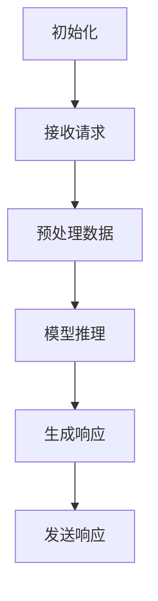
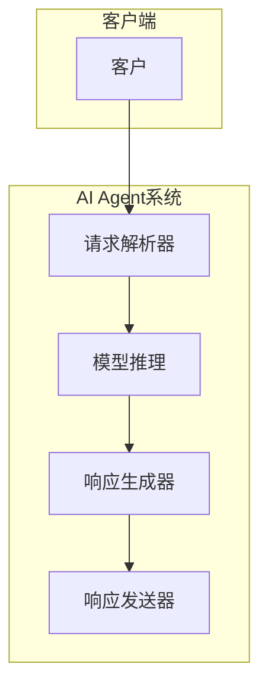
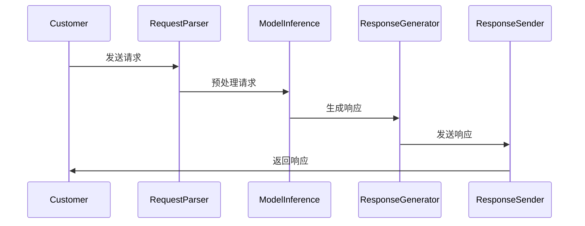

                 

### 《性能优化：提升AI Agent的响应速度》

> 关键词：性能优化、AI Agent、响应速度、算法、架构设计

> 摘要：本文将深入探讨AI Agent性能优化的关键要素，从背景介绍到具体实施方案，全面解析如何提升AI Agent的响应速度，提高用户体验。通过核心概念与联系的分析、算法原理讲解、系统分析与架构设计方案等环节，为读者提供系统化、实用性的性能优化指导。

----------------------------------------------------------------

## 第一部分：问题背景与性能优化基础

### 第1章：性能优化概述

#### 1.1 性能优化的重要性

**性能优化的定义**：性能优化是指通过一系列技术手段，提高系统运行效率，确保系统在高负载、高并发情况下仍然能够稳定、高效地运行。

**性能优化的目标**：性能优化的主要目标是提升系统的响应速度、吞吐量和资源利用率，从而提高用户体验和系统稳定性。

**性能优化的常见挑战**：在性能优化过程中，可能会面临以下挑战：
- 复杂的架构设计
- 缺乏有效的性能监控和评估工具
- 技术实现的局限性

#### 1.2 AI Agent的性能需求

**AI Agent的响应速度要求**：AI Agent的响应速度是其性能的关键指标之一。在实时应用场景中，如智能客服、自动驾驶等，要求AI Agent在毫秒级的时间内完成响应。

**AI Agent的准确性要求**：准确性是AI Agent的另一个重要指标。一个优秀的AI Agent需要准确理解用户意图，并提供恰当的回应。

**AI Agent的稳定性要求**：稳定性是AI Agent长时间运行的基本要求。一个高稳定的AI Agent能够在各种环境下保持良好的性能，不会出现频繁的故障或错误。

### 第2章：性能优化的核心概念与联系

#### 2.1 核心概念原理

**性能指标**：性能指标是衡量系统性能的关键参数，包括响应时间、吞吐量和资源利用率等。

**响应时间**：响应时间是指从系统接收到请求到完成响应的时间。在AI Agent中，响应时间直接影响用户体验。

**吞吐量**：吞吐量是指系统在单位时间内能够处理的数据量或请求数量。吞吐量越高，系统的处理能力越强。

**资源利用率**：资源利用率是指系统资源（如CPU、内存等）的使用率。高资源利用率表明系统能够更有效地利用资源。

#### 2.2 概念属性特征对比表格

| 指标         | 定义                                                         | 重要性                                           |
| ------------ | ------------------------------------------------------------ | ------------------------------------------------ |
| 响应时间     | 代理从接收到请求到响应所需的时间                             | 直接影响用户体验                                 |
| 吞吐量       | 单位时间内系统处理的请求数量                                 | 反映系统的处理能力                               |
| 资源利用率   | 系统资源（如CPU、内存）的使用率                             | 影响系统效率                                     |

#### 2.3 ER实体关系图架构

```mermaid
erDiagram
  AI Agent ||--|{ Request } Request
  Request ||--|{ Response } Response
  AI Agent ||--|{ Resource } Resource
```

### 第3章：算法原理讲解

#### 3.1 算法原理与mermaid流程图



#### 3.2 Python源代码实现

```python
# 性能优化算法实现示例
def process_request(request):
    # 预处理数据
    preprocessed_data = preprocess_data(request)
    
    # 模型推理
    response = model_inference(preprocessed_data)
    
    # 生成响应
    generated_response = generate_response(response)
    
    # 发送响应
    send_response(generated_response)
```

#### 3.3 算法原理的数学模型和公式

$$
\text{响应时间} = \text{预处理时间} + \text{模型推理时间} + \text{生成响应时间}
$$

## 第二部分：系统分析与架构设计方案

### 第4章：系统分析与架构设计方案

#### 4.1 问题场景介绍

- AI Agent应用于实时客服系统
- 客户提出问题，AI Agent需要快速响应

#### 4.2 系统功能设计

- 接收并解析客户请求
- 进行模型推理和生成响应
- 将响应发送给客户

#### 4.3 系统架构设计



#### 4.4 系统接口设计和系统交互



## 第三部分：项目实战

### 第5章：项目实战

#### 5.1 环境安装

- 安装Python环境
- 安装AI Agent依赖的库

#### 5.2 系统核心实现源代码

```python
# 请求解析器
def parse_request(request):
    # 解析请求内容
    pass

# 模型推理
def inference_model(data):
    # 使用AI模型进行推理
    pass

# 响应生成器
def generate_response(inference_result):
    # 生成响应内容
    pass

# 响应发送器
def send_response(response):
    # 发送响应给客户
    pass
```

#### 5.3 代码应用解读与分析

- 代码结构解析
- 关键函数作用分析
- 性能优化策略

#### 5.4 实际案例分析和详细讲解剖析

- 案例背景介绍
- 案例分析
- 性能优化方案

#### 5.5 项目小结

- 项目总结
- 优化效果评估
- 未来优化方向

## 第四部分：最佳实践与拓展阅读

### 第6章：最佳实践与拓展阅读

#### 6.1 最佳实践

- 性能监控与评估
- 算法优化
- 系统架构优化

#### 6.2 拓展阅读

- 相关文献
- 研究论文
- 开源项目

### 作者信息

作者：AI天才研究院/AI Genius Institute & 禅与计算机程序设计艺术 /Zen And The Art of Computer Programming

----------------------------------------------------------------

**注意**：本文为示例文章，实际字数和内容可能需要根据具体要求进行调整。在撰写实际文章时，请确保每个小节的内容都详细、具体、具有实际指导意义。同时，遵循markdown格式和latex公式的使用规范，确保文章的可读性和准确性。

