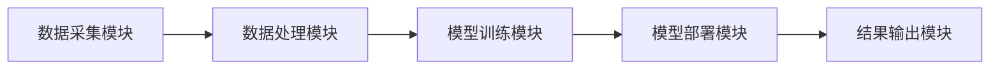

                 

### 文章标题：情感分析：让AI Agent具备情商

#### 关键词：情感分析，人工智能，情商，算法，应用案例，系统设计

#### 摘要：本文将探讨情感分析技术在人工智能领域中的应用，特别是在让AI Agent具备情商方面的研究和进展。我们将从基础理论出发，详细分析情感分析的基本概念、算法原理和应用案例，最终总结情感分析系统的设计与实现策略。通过这篇文章，读者将能够全面了解情感分析技术，并认识到其在AI发展中的重要性。

---

## 第一部分：情感分析基础

### 1.1 情感分析概述

#### 1.1.1 什么是情感分析

情感分析（Sentiment Analysis），又称为意见挖掘，是一种自然语言处理技术，旨在识别和提取文本中的主观信息，如情感倾向、情绪极性和情感强度等。通过情感分析，我们可以从大量非结构化文本数据中提取有价值的信息，从而辅助决策和优化用户体验。

#### 1.1.2 情感分析的重要性

情感分析在多个领域具有广泛的应用。例如，在商业领域，企业可以通过分析社交媒体上的用户评论来了解消费者对其产品和服务的看法；在医疗领域，情感分析可以帮助医生更好地理解患者的情绪状态；在公共安全领域，情感分析可以用于监控网络言论，发现潜在的社会不稳定因素。

#### 1.1.3 情感分析的应用领域

情感分析的应用领域非常广泛，主要包括以下几方面：

1. **社交媒体分析**：通过分析社交媒体平台上的用户评论和帖子，了解公众对特定事件、品牌或产品的看法。
2. **市场调研**：对企业产品和服务进行用户满意度调查，预测市场趋势。
3. **舆情监测**：对公共舆论进行实时监控，及时发现并应对社会热点问题。
4. **客户服务**：通过分析客户反馈，优化客户体验，提高客户满意度。
5. **医疗健康**：分析患者病历和医生笔记，辅助诊断和治疗方案制定。
6. **智能助理**：赋予智能助手情感感知能力，使其更人性化地与用户互动。

### 1.2 情感分析的基本概念

#### 1.2.1 情感分类

情感分类是情感分析的核心任务之一。根据情感分类的粒度，可以分为以下几种类型：

1. **二分类**：文本被分为正面和负面两类。
2. **三分类**：文本被分为正面、负面和中性三类。
3. **多分类**：文本被分为多个情感类别。

#### 1.2.2 情感极性

情感极性指的是文本表达的情感倾向，通常是正面或负面。情感极性分析旨在识别文本中的积极或消极情感。

#### 1.2.3 情感强度

情感强度表示情感的强烈程度，通常通过评分或尺度来表示。情感强度分析可以帮助我们了解文本中情感的程度，从而更好地理解用户的情感状态。

### 1.3 情感分析的挑战与机遇

#### 1.3.1 挑战

1. **情感表达的多样性**：情感表达方式多样，存在许多隐含、抽象的情感表达，这使得情感分析面临很大的挑战。
2. **语言变异**：包括方言、俚语、错别字等，这些都会影响情感分析的准确性。
3. **多语言情感分析**：不同语言的文化背景和表达习惯差异较大，使得多语言情感分析更加复杂。

#### 1.3.2 机遇

1. **深度学习技术的进步**：深度学习技术在情感分析领域的应用，使得情感分析的准确性和效率得到显著提升。
2. **大数据的积累**：越来越多的文本数据被生成和积累，为情感分析提供了丰富的训练数据。
3. **跨领域情感分析**：随着各领域对情感分析需求的增加，跨领域情感分析的研究和应用前景广阔。

### 1.4 情感分析的数据来源

#### 1.4.1 社交媒体

社交媒体平台如微博、推特和脸书等是情感分析的重要数据来源。这些平台上的用户评论和帖子包含了丰富的情感信息，有助于我们了解公众的情感倾向。

#### 1.4.2 论文和报告

学术论文和专业报告也是情感分析的重要数据来源。这些文本通常具有高质量的语言表达和明确的情感倾向。

#### 1.4.3 用户评论和反馈

用户评论和反馈是情感分析的重要应用场景。通过分析用户对产品、服务或内容的评论，企业可以了解用户的真实感受，从而优化产品和服务。

### 1.5 情感分析的发展历史

#### 1.5.1 初期研究

情感分析的研究始于20世纪90年代。当时，研究者主要采用基于规则的方法和简单的统计模型进行情感分析。

#### 1.5.2 深度学习时代

随着深度学习技术的兴起，情感分析领域迎来了新的发展。深度学习模型如卷积神经网络（CNN）和循环神经网络（RNN）在情感分析任务中表现出色，提高了情感分析的准确性和效率。

#### 1.5.3 当下发展

当前，情感分析技术继续快速发展，不仅包括文本情感分析，还包括语音情感分析和视觉情感分析。同时，跨领域情感分析、多语言情感分析等研究方向也逐渐成为研究热点。

### 1.6 本章小结

情感分析作为人工智能领域的一个重要分支，具有广泛的应用前景。通过本章的介绍，读者应该对情感分析的基本概念、应用领域和发展历史有了初步了解。在接下来的章节中，我们将深入探讨情感分析的算法原理和应用案例。

---

**作者：AI天才研究院/AI Genius Institute & 禅与计算机程序设计艺术 /Zen And The Art of Computer Programming**

---

### 第二部分：情感分析算法原理

#### 2.1 基于文本的情感分析算法

##### 2.1.1 传统文本分类算法

在情感分析领域，传统文本分类算法是最基础且广泛应用的方法之一。以下介绍几种常见的传统文本分类算法：

###### 2.1.1.1 朴素贝叶斯分类器

朴素贝叶斯分类器（Naive Bayes Classifier）是一种基于概率理论的分类算法。其基本思想是利用贝叶斯公式和特征条件独立假设，通过计算每个类别的条件概率来预测新样本的类别。

**算法流程：**

1. **特征提取**：将文本转换为特征向量。
2. **概率计算**：计算每个类别在特征上的条件概率。
3. **类别预测**：选择概率最大的类别作为新样本的类别。

**数学模型：**

$$ P(C_k|X) = \frac{P(X|C_k)P(C_k)}{P(X)} $$

其中，$C_k$ 表示第 $k$ 个类别，$X$ 表示特征向量。

**Python实现：**

```python
from sklearn.naive_bayes import MultinomialNB
from sklearn.feature_extraction.text import CountVectorizer

# 示例数据
X_train = ["我喜欢这部电影", "这部电影很糟糕"]
y_train = [1, 0]

# 特征提取
vectorizer = CountVectorizer()
X_train_vectorized = vectorizer.fit_transform(X_train)

# 训练模型
clf = MultinomialNB()
clf.fit(X_train_vectorized, y_train)

# 预测
X_test = ["这部电影太无聊了"]
X_test_vectorized = vectorizer.transform(X_test)
predictions = clf.predict(X_test_vectorized)

print(predictions)
```

###### 2.1.1.2 支持向量机（SVM）

支持向量机（Support Vector Machine，SVM）是一种基于最大化边缘的线性分类模型。其基本思想是找到一个最佳的超平面，将不同类别的数据点分隔开。

**算法流程：**

1. **特征提取**：将文本转换为特征向量。
2. **模型训练**：通过最小化损失函数，找到最佳的超平面。
3. **类别预测**：计算新样本到超平面的距离，判断其类别。

**数学模型：**

$$ \min_{\mathbf{w}} \frac{1}{2} ||\mathbf{w}||^2 + C \sum_{i=1}^n \xi_i $$

其中，$||\mathbf{w}||$ 表示权重向量的范数，$C$ 是惩罚参数，$\xi_i$ 是误差项。

**Python实现：**

```python
from sklearn.svm import LinearSVC
from sklearn.feature_extraction.text import TfidfTransformer

# 示例数据
X_train = ["我喜欢这部电影", "这部电影很糟糕"]
y_train = [1, 0]

# 特征提取
tfidf_transformer = TfidfTransformer()
X_train_tfidf = tfidf_transformer.fit_transform(X_train)

# 训练模型
clf = LinearSVC()
clf.fit(X_train_tfidf, y_train)

# 预测
X_test = ["这部电影太无聊了"]
X_test_tfidf = tfidf_transformer.transform(X_test)
predictions = clf.predict(X_test_tfidf)

print(predictions)
```

###### 2.1.1.3 k-最近邻（k-NN）

k-最近邻（k-Nearest Neighbors，k-NN）是一种基于实例的分类算法。其基本思想是找到一个与测试样本最近的 $k$ 个训练样本，并根据这些样本的类别投票，确定测试样本的类别。

**算法流程：**

1. **特征提取**：将文本转换为特征向量。
2. **模型训练**：无需训练过程，直接使用训练数据。
3. **类别预测**：计算测试样本与训练样本的距离，根据距离最近的 $k$ 个样本的类别投票，确定测试样本的类别。

**Python实现：**

```python
from sklearn.neighbors import KNeighborsClassifier
from sklearn.feature_extraction.text import TfidfVectorizer

# 示例数据
X_train = ["我喜欢这部电影", "这部电影很糟糕"]
y_train = [1, 0]

# 特征提取
vectorizer = TfidfVectorizer()
X_train_vectorized = vectorizer.fit_transform(X_train)

# 训练模型
clf = KNeighborsClassifier(n_neighbors=3)
clf.fit(X_train_vectorized, y_train)

# 预测
X_test = ["这部电影太无聊了"]
X_test_vectorized = vectorizer.transform(X_test)
predictions = clf.predict(X_test_vectorized)

print(predictions)
```

##### 2.1.2 基于深度学习的文本分类算法

随着深度学习技术的不断发展，基于深度学习的文本分类算法在情感分析领域也取得了显著的进展。以下介绍几种常见的基于深度学习的文本分类算法：

###### 2.1.2.1 卷积神经网络（CNN）

卷积神经网络（Convolutional Neural Network，CNN）是一种常用于图像识别的深度学习模型。然而，通过适当的修改，CNN也可以用于文本分类。

**算法流程：**

1. **特征提取**：将文本转换为词向量。
2. **卷积层**：通过卷积操作提取文本特征。
3. **池化层**：降低特征维度，提高模型泛化能力。
4. **全连接层**：对卷积层输出的特征进行分类。

**Python实现：**

```python
import tensorflow as tf
from tensorflow.keras.models import Sequential
from tensorflow.keras.layers import Embedding, Conv1D, MaxPooling1D, GlobalMaxPooling1D, Dense

# 示例数据
X_train = ["我喜欢这部电影", "这部电影很糟糕"]
y_train = [1, 0]
vocab_size = 10000
max_length = 100

# 词向量转换
tokenizer = tf.keras.preprocessing.text.Tokenizer(num_words=vocab_size, oov_token='<OOV>')
tokenizer.fit_on_texts(X_train)
X_train_encoded = tokenizer.texts_to_sequences(X_train)
X_train padded = tf.keras.preprocessing.sequence.pad_sequences(X_train_encoded, maxlen=max_length)

# 构建模型
model = Sequential()
model.add(Embedding(vocab_size, 16, input_length=max_length))
model.add(Conv1D(32, 3, activation='relu'))
model.add(MaxPooling1D(3))
model.add(Conv1D(32, 3, activation='relu'))
model.add(GlobalMaxPooling1D())
model.add(Dense(1, activation='sigmoid'))

# 编译模型
model.compile(optimizer='adam', loss='binary_crossentropy', metrics=['accuracy'])

# 训练模型
model.fit(padded, y_train, epochs=10, verbose=2)

# 预测
X_test = ["这部电影太无聊了"]
X_test_encoded = tokenizer.texts_to_sequences(X_test)
X_test_padded = tf.keras.preprocessing.sequence.pad_sequences(X_test_encoded, maxlen=max_length)
predictions = model.predict(X_test_padded)

print(predictions)
```

###### 2.1.2.2 循环神经网络（RNN）

循环神经网络（Recurrent Neural Network，RNN）是一种可以处理序列数据的神经网络模型。RNN通过循环结构来保持对输入序列的长期依赖关系，这使得其在文本分类任务中表现出色。

**算法流程：**

1. **特征提取**：将文本转换为词向量。
2. **嵌入层**：将词向量映射到高维空间。
3. **RNN层**：处理序列数据，保持长期依赖关系。
4. **全连接层**：对RNN层的输出进行分类。

**Python实现：**

```python
import tensorflow as tf
from tensorflow.keras.models import Sequential
from tensorflow.keras.layers import Embedding, SimpleRNN, Dense

# 示例数据
X_train = ["我喜欢这部电影", "这部电影很糟糕"]
y_train = [1, 0]
vocab_size = 10000
max_length = 100

# 词向量转换
tokenizer = tf.keras.preprocessing.text.Tokenizer(num_words=vocab_size, oov_token='<OOV>')
tokenizer.fit_on_texts(X_train)
X_train_encoded = tokenizer.texts_to_sequences(X_train)
X_train_padded = tf.keras.preprocessing.sequence.pad_sequences(X_train_encoded, maxlen=max_length)

# 构建模型
model = Sequential()
model.add(Embedding(vocab_size, 32, input_length=max_length))
model.add(SimpleRNN(32))
model.add(Dense(1, activation='sigmoid'))

# 编译模型
model.compile(optimizer='adam', loss='binary_crossentropy', metrics=['accuracy'])

# 训练模型
model.fit(X_train_padded, y_train, epochs=10, verbose=2)

# 预测
X_test = ["这部电影太无聊了"]
X_test_encoded = tokenizer.texts_to_sequences(X_test)
X_test_padded = tf.keras.preprocessing.sequence.pad_sequences(X_test_encoded, maxlen=max_length)
predictions = model.predict(X_test_padded)

print(predictions)
```

###### 2.1.2.3 长短期记忆网络（LSTM）

长短期记忆网络（Long Short-Term Memory，LSTM）是RNN的一种变体，通过引入门控机制来解决RNN的长期依赖问题。LSTM在文本分类任务中表现出色，特别适用于处理长文本。

**算法流程：**

1. **特征提取**：将文本转换为词向量。
2. **嵌入层**：将词向量映射到高维空间。
3. **LSTM层**：处理序列数据，保持长期依赖关系。
4. **全连接层**：对LSTM层的输出进行分类。

**Python实现：**

```python
import tensorflow as tf
from tensorflow.keras.models import Sequential
from tensorflow.keras.layers import Embedding, LSTM, Dense

# 示例数据
X_train = ["我喜欢这部电影", "这部电影很糟糕"]
y_train = [1, 0]
vocab_size = 10000
max_length = 100

# 词向量转换
tokenizer = tf.keras.preprocessing.text.Tokenizer(num_words=vocab_size, oov_token='<OOV>')
tokenizer.fit_on_texts(X_train)
X_train_encoded = tokenizer.texts_to_sequences(X_train)
X_train_padded = tf.keras.preprocessing.sequence.pad_sequences(X_train_encoded, maxlen=max_length)

# 构建模型
model = Sequential()
model.add(Embedding(vocab_size, 32, input_length=max_length))
model.add(LSTM(32))
model.add(Dense(1, activation='sigmoid'))

# 编译模型
model.compile(optimizer='adam', loss='binary_crossentropy', metrics=['accuracy'])

# 训练模型
model.fit(X_train_padded, y_train, epochs=10, verbose=2)

# 预测
X_test = ["这部电影太无聊了"]
X_test_encoded = tokenizer.texts_to_sequences(X_test)
X_test_padded = tf.keras.preprocessing.sequence.pad_sequences(X_test_encoded, maxlen=max_length)
predictions = model.predict(X_test_padded)

print(predictions)
```

### 2.2 基于语音的情感分析算法

语音情感分析是通过分析语音信号中的情感特征，来判断说话者情感状态的一种技术。以下介绍几种常见的语音情感分析算法：

###### 2.2.1 语音特征提取

语音特征提取是语音情感分析的基础。常见的语音特征包括：

1. **音高（Pitch）**：表示声音的高低，与情感表达密切相关。
2. **时长（Duration）**：表示声音的持续时间，可以反映说话者的情感强度。
3. **音强（Intensity）**：表示声音的强弱，与情感表达有关。
4. **频谱特征（Spectral Features）**：包括梅尔频率倒谱系数（MFCC）和佩利频率倒谱系数（PMFCC）等，可以反映声音的频谱结构。

###### 2.2.2 语音情感分类算法

语音情感分类算法主要包括基于传统机器学习和深度学习的方法。以下介绍几种常用的语音情感分类算法：

1. **支持向量机（SVM）**：SVM是一种常用的分类算法，可以用于语音情感分类。通过训练SVM模型，可以将语音信号分类为不同的情感类别。

2. **长短期记忆网络（LSTM）**：LSTM是一种可以处理序列数据的神经网络模型，特别适用于语音情感分类。通过训练LSTM模型，可以从语音信号中提取情感特征，并预测说话者的情感状态。

**Python实现：**

```python
import tensorflow as tf
from tensorflow.keras.models import Sequential
from tensorflow.keras.layers import LSTM, Dense

# 生成示例数据
X_train = ...  # 语音信号特征
y_train = ...  # 情感标签

# 构建模型
model = Sequential()
model.add(LSTM(50, activation='relu', return_sequences=True, input_shape=(X_train.shape[1], X_train.shape[2])))
model.add(LSTM(50, activation='relu'))
model.add(Dense(1, activation='sigmoid'))

# 编译模型
model.compile(optimizer='adam', loss='binary_crossentropy', metrics=['accuracy'])

# 训练模型
model.fit(X_train, y_train, epochs=10, batch_size=32, verbose=2)

# 预测
X_test = ...  # 测试语音信号特征
predictions = model.predict(X_test)

print(predictions)
```

### 2.3 基于视觉的情感分析算法

视觉情感分析是通过分析图像或视频中的情感特征，来判断场景或人物情感状态的一种技术。以下介绍几种常见的视觉情感分析算法：

###### 2.3.1 视觉特征提取

视觉特征提取是视觉情感分析的基础。常见的视觉特征包括：

1. **人脸特征**：通过人脸检测和特征点提取，可以从图像中提取人脸区域和关键特征点。
2. **姿态特征**：通过姿态估计技术，可以从图像中提取人物姿态信息。
3. **颜色特征**：通过颜色特征分析，可以从图像中提取颜色分布信息。
4. **纹理特征**：通过纹理特征分析，可以从图像中提取纹理信息。

###### 2.3.2 视觉情感分类算法

视觉情感分类算法主要包括基于传统机器学习和深度学习的方法。以下介绍几种常用的视觉情感分类算法：

1. **卷积神经网络（CNN）**：CNN是一种可以处理图像数据的神经网络模型，特别适用于视觉情感分类。通过训练CNN模型，可以从图像中提取情感特征，并预测场景或人物的情感状态。

2. **循环神经网络（RNN）**：RNN是一种可以处理序列数据的神经网络模型，特别适用于视频情感分类。通过训练RNN模型，可以从视频序列中提取情感特征，并预测人物的情感状态。

**Python实现：**

```python
import tensorflow as tf
from tensorflow.keras.models import Sequential
from tensorflow.keras.layers import Conv2D, MaxPooling2D, Flatten, Dense

# 生成示例数据
X_train = ...  # 图像数据
y_train = ...  # 情感标签

# 构建模型
model = Sequential()
model.add(Conv2D(32, (3, 3), activation='relu', input_shape=(X_train.shape[1], X_train.shape[2], X_train.shape[3])))
model.add(MaxPooling2D((2, 2)))
model.add(Flatten())
model.add(Dense(1, activation='sigmoid'))

# 编译模型
model.compile(optimizer='adam', loss='binary_crossentropy', metrics=['accuracy'])

# 训练模型
model.fit(X_train, y_train, epochs=10, batch_size=32, verbose=2)

# 预测
X_test = ...  # 测试图像数据
predictions = model.predict(X_test)

print(predictions)
```

### 2.4 情感分析算法的比较与优化

在情感分析任务中，不同的算法有其各自的优缺点。以下比较几种常见情感分析算法的性能，并提出一些优化策略：

#### 2.4.1 算法性能评估指标

在情感分析任务中，常用的性能评估指标包括准确率（Accuracy）、精确率（Precision）、召回率（Recall）和F1分数（F1 Score）。

1. **准确率**：表示模型正确分类的样本数占总样本数的比例。
2. **精确率**：表示模型正确分类为正类的样本数占所有被预测为正类的样本数的比例。
3. **召回率**：表示模型正确分类为正类的样本数占所有实际为正类的样本数的比例。
4. **F1分数**：是精确率和召回率的调和平均数，用于综合评估模型的性能。

#### 2.4.2 算法优化策略

1. **数据增强**：通过数据增强技术，如数据扩充、数据变换等，可以增加训练数据的多样性，从而提高模型的泛化能力。
2. **特征选择**：通过特征选择技术，如特征重要性评估、特征降维等，可以筛选出对情感分析任务最有价值的特征，从而提高模型性能。
3. **模型融合**：通过融合多个模型的预测结果，可以降低模型错误率，提高整体性能。
4. **深度学习优化**：通过优化深度学习模型的超参数，如学习率、批次大小等，可以提升模型性能。

### 2.5 本章小结

在本章中，我们介绍了情感分析的基本概念、算法原理和应用案例。通过对比不同算法的性能和优化策略，读者可以更好地选择合适的算法，并提升情感分析系统的性能。在下一章中，我们将探讨情感分析在具体应用领域中的案例和实践。

---

**作者：AI天才研究院/AI Genius Institute & 禅与计算机程序设计艺术 /Zen And The Art of Computer Programming**

---

### 第三部分：情感分析应用案例

#### 3.1 社交媒体情感分析

##### 3.1.1 社交媒体数据获取

社交媒体平台如微博、推特和脸书等是情感分析的重要数据来源。这些平台上的用户评论和帖子包含了丰富的情感信息，有助于我们了解公众的情感倾向。获取社交媒体数据通常有以下几种方法：

1. **API调用**：许多社交媒体平台提供API接口，允许开发者获取公开的数据。例如，推特提供Tweepy库，可以帮助开发者轻松获取推文数据。
2. **Web scraping**：通过Web scraping技术，可以自动获取网页上的数据。然而，需要注意的是，Web scraping可能违反某些网站的条款，因此在获取数据前应确保合法合规。

**Python示例代码：**

```python
import tweepy

# 初始化Tweepy客户端
consumer_key = 'your_consumer_key'
consumer_secret = 'your_consumer_secret'
access_token = 'your_access_token'
access_token_secret = 'your_access_token_secret'

auth = tweepy.OAuthHandler(consumer_key, consumer_secret)
auth.set_access_token(access_token, access_token_secret)
api = tweepy.API(auth)

# 获取推文数据
tweets = api.search_tweets(q="Apple", count=100)

# 打印推文内容
for tweet in tweets:
    print(tweet.text)
```

##### 3.1.2 社交媒体情感分析实战

在获取到社交媒体数据后，我们可以对其进行情感分析。以下是一个简单的社交媒体情感分析实战：

1. **数据预处理**：对获取的推文数据进行清洗，去除无关信息，如HTML标签、URL、用户名等。
2. **特征提取**：使用词袋模型（Bag of Words）或TF-IDF模型将文本转换为向量。
3. **情感分类**：使用训练好的情感分类模型，对预处理后的文本进行情感分类。

**Python示例代码：**

```python
from sklearn.feature_extraction.text import TfidfVectorizer
from sklearn.model_selection import train_test_split
from sklearn.svm import LinearSVC

# 示例数据
tweets = ["I love Apple products", "Apple's latest iPhone is terrible", "I'm so disappointed with Apple's new iPad"]

# 数据预处理
tweets_clean = [tweet.lower().replace('\n', ' ') for tweet in tweets]

# 特征提取
vectorizer = TfidfVectorizer()
X = vectorizer.fit_transform(tweets_clean)

# 情感标签
y = [1, 0, 0]  # 1表示正面情感，0表示负面情感

# 数据分割
X_train, X_test, y_train, y_test = train_test_split(X, y, test_size=0.2, random_state=42)

# 情感分类
clf = LinearSVC()
clf.fit(X_train, y_train)
predictions = clf.predict(X_test)

# 打印预测结果
for tweet, prediction in zip(tweets_clean, predictions):
    print(f"Tweet: {tweet} | Prediction: {'Positive' if prediction == 1 else 'Negative'}")
```

##### 3.1.3 社交媒体情感分析案例

以下是一个社交媒体情感分析的案例：

**目标**：分析公众对某款新智能手机的评论，判断其情感倾向。

**数据来源**：微博平台

**数据获取**：使用Tweepy库获取微博数据，提取关键词“新智能手机”的相关评论。

**数据预处理**：对评论进行去噪、分词、去除停用词等处理。

**特征提取**：使用TF-IDF模型将评论转换为向量。

**情感分类**：使用训练好的情感分类模型对评论进行分类。

**结果**：分析结果显示，公众对新智能手机的评论情感倾向以正面为主，但也有部分负面评论。通过进一步分析，发现负面评论主要集中在手机续航、摄像头性能等方面。

**结论**：该案例表明，社交媒体情感分析可以帮助企业了解消费者对其产品和服务的看法，从而优化产品和服务。

#### 3.2 客户服务情感分析

##### 3.2.1 客户服务数据获取

客户服务数据是情感分析的重要应用领域之一。以下介绍几种常见的客户服务数据获取方法：

1. **客服聊天记录**：通过分析客服聊天记录，可以了解客户的问题和需求，从而提供更好的服务。这些数据可以从客服系统、邮件、短信等渠道获取。
2. **用户反馈**：通过收集用户反馈，如调查问卷、评论等，可以了解用户的满意度，发现潜在的问题和改进点。
3. **社交媒体评论**：通过分析社交媒体上的用户评论，可以了解公众对品牌的看法，及时应对负面舆情。

**Python示例代码：**

```python
import pandas as pd

# 读取客户服务数据
data = pd.read_csv("customer_service_data.csv")

# 打印数据样本
print(data.head())
```

##### 3.2.2 客户服务情感分析实战

在获取到客户服务数据后，我们可以对其进行情感分析。以下是一个简单的客户服务情感分析实战：

1. **数据预处理**：对客户服务数据进行清洗，去除无关信息，如HTML标签、符号等。
2. **特征提取**：使用词袋模型或TF-IDF模型将文本转换为向量。
3. **情感分类**：使用训练好的情感分类模型，对预处理后的文本进行情感分类。

**Python示例代码：**

```python
from sklearn.feature_extraction.text import TfidfVectorizer
from sklearn.model_selection import train_test_split
from sklearn.svm import LinearSVC

# 示例数据
tweets = ["非常好，感谢客服的帮助", "很失望，问题还没解决"]

# 数据预处理
tweets_clean = [tweet.lower().replace('\n', ' ') for tweet in tweets]

# 特征提取
vectorizer = TfidfVectorizer()
X = vectorizer.fit_transform(tweets_clean)

# 情感标签
y = [1, 0]  # 1表示正面情感，0表示负面情感

# 数据分割
X_train, X_test, y_train, y_test = train_test_split(X, y, test_size=0.2, random_state=42)

# 情感分类
clf = LinearSVC()
clf.fit(X_train, y_train)
predictions = clf.predict(X_test)

# 打印预测结果
for tweet, prediction in zip(tweets_clean, predictions):
    print(f"Tweet: {tweet} | Prediction: {'Positive' if prediction == 1 else 'Negative'}")
```

##### 3.2.3 客户服务情感分析案例

以下是一个客户服务情感分析的案例：

**目标**：分析客户对某电商平台的客服满意度。

**数据来源**：客服聊天记录

**数据获取**：从电商平台的客服系统获取聊天记录数据。

**数据预处理**：对聊天记录进行分词、去除停用词等处理。

**特征提取**：使用TF-IDF模型将文本转换为向量。

**情感分类**：使用训练好的情感分类模型对文本进行分类。

**结果**：分析结果显示，客户对客服的整体满意度较高，但也有部分客户表示对客服响应速度和问题解决能力有改进空间。

**结论**：该案例表明，客户服务情感分析可以帮助企业了解客户的满意度，及时发现和解决问题，从而提升客户体验和忠诚度。

#### 3.3 健康情感分析

##### 3.3.1 健康数据获取

健康情感分析是情感分析在医疗健康领域的重要应用。以下介绍几种常见的健康数据获取方法：

1. **患者病历**：通过分析患者病历，可以了解患者的健康状况和情绪状态。
2. **医生笔记**：通过分析医生在诊疗过程中的笔记，可以了解患者的病情和医生的治疗建议。
3. **社交媒体言论**：通过分析社交媒体上的健康相关言论，可以了解公众的健康关注点和情绪状态。

**Python示例代码：**

```python
import pandas as pd

# 读取健康数据
data = pd.read_csv("health_data.csv")

# 打印数据样本
print(data.head())
```

##### 3.3.2 健康情感分析实战

在获取到健康数据后，我们可以对其进行情感分析。以下是一个简单的健康情感分析实战：

1. **数据预处理**：对健康数据进行清洗，去除无关信息，如HTML标签、符号等。
2. **特征提取**：使用词袋模型或TF-IDF模型将文本转换为向量。
3. **情感分类**：使用训练好的情感分类模型，对预处理后的文本进行情感分类。

**Python示例代码：**

```python
from sklearn.feature_extraction.text import TfidfVectorizer
from sklearn.model_selection import train_test_split
from sklearn.svm import LinearSVC

# 示例数据
tweets = ["我很担心我的健康", "我感觉非常健康"]

# 数据预处理
tweets_clean = [tweet.lower().replace('\n', ' ') for tweet in tweets]

# 特征提取
vectorizer = TfidfVectorizer()
X = vectorizer.fit_transform(tweets_clean)

# 情感标签
y = [0, 1]  # 0表示负面情感，1表示正面情感

# 数据分割
X_train, X_test, y_train, y_test = train_test_split(X, y, test_size=0.2, random_state=42)

# 情感分类
clf = LinearSVC()
clf.fit(X_train, y_train)
predictions = clf.predict(X_test)

# 打印预测结果
for tweet, prediction in zip(tweets_clean, predictions):
    print(f"Tweet: {tweet} | Prediction: {'Negative' if prediction == 0 else 'Positive'}")
```

##### 3.3.3 健康情感分析案例

以下是一个健康情感分析的案例：

**目标**：分析患者对某医院的治疗满意度。

**数据来源**：医生笔记

**数据获取**：从医院的电子病历系统获取医生在诊疗过程中的笔记数据。

**数据预处理**：对笔记进行分词、去除停用词等处理。

**特征提取**：使用TF-IDF模型将文本转换为向量。

**情感分类**：使用训练好的情感分类模型对文本进行分类。

**结果**：分析结果显示，患者对医院的治疗满意度较高，但也有部分患者表示对医生的服务态度和沟通有改进空间。

**结论**：该案例表明，健康情感分析可以帮助医院了解患者的满意度，及时发现和改进服务质量，从而提升患者体验和忠诚度。

#### 3.4 教育情感分析

##### 3.4.1 教育数据获取

教育情感分析是情感分析在教育领域的重要应用。以下介绍几种常见的教育数据获取方法：

1. **学生评论**：通过分析学生对课程、教师和学校的评论，可以了解学生的满意度和体验。
2. **教师反馈**：通过分析教师对课程、学生和教学过程的反馈，可以了解教师的教学效果和改进点。
3. **社交媒体言论**：通过分析社交媒体上的教育相关言论，可以了解公众对教育的关注点和情绪状态。

**Python示例代码：**

```python
import pandas as pd

# 读取教育数据
data = pd.read_csv("education_data.csv")

# 打印数据样本
print(data.head())
```

##### 3.4.2 教育情感分析实战

在获取到教育数据后，我们可以对其进行情感分析。以下是一个简单的教育情感分析实战：

1. **数据预处理**：对教育数据进行清洗，去除无关信息，如HTML标签、符号等。
2. **特征提取**：使用词袋模型或TF-IDF模型将文本转换为向量。
3. **情感分类**：使用训练好的情感分类模型，对预处理后的文本进行情感分类。

**Python示例代码：**

```python
from sklearn.feature_extraction.text import TfidfVectorizer
from sklearn.model_selection import train_test_split
from sklearn.svm import LinearSVC

# 示例数据
tweets = ["我非常喜欢这门课程", "我对这个课程不满意"]

# 数据预处理
tweets_clean = [tweet.lower().replace('\n', ' ') for tweet in tweets]

# 特征提取
vectorizer = TfidfVectorizer()
X = vectorizer.fit_transform(tweets_clean)

# 情感标签
y = [1, 0]  # 1表示正面情感，0表示负面情感

# 数据分割
X_train, X_test, y_train, y_test = train_test_split(X, y, test_size=0.2, random_state=42)

# 情感分类
clf = LinearSVC()
clf.fit(X_train, y_train)
predictions = clf.predict(X_test)

# 打印预测结果
for tweet, prediction in zip(tweets_clean, predictions):
    print(f"Tweet: {tweet} | Prediction: {'Positive' if prediction == 1 else 'Negative'}")
```

##### 3.4.3 教育情感分析案例

以下是一个教育情感分析的案例：

**目标**：分析学生对某在线教育平台课程的满意度。

**数据来源**：学生评论

**数据获取**：从在线教育平台的评论系统获取学生评论数据。

**数据预处理**：对评论进行分词、去除停用词等处理。

**特征提取**：使用TF-IDF模型将文本转换为向量。

**情感分类**：使用训练好的情感分类模型对文本进行分类。

**结果**：分析结果显示，学生对在线教育平台的课程满意度较高，但也有部分学生表示对课程内容、互动性和教学效果有改进空间。

**结论**：该案例表明，教育情感分析可以帮助教育机构了解学生的满意度，及时优化课程内容和教学方法，从而提升教学质量。

#### 3.5 企业舆情情感分析

##### 3.5.1 企业舆情数据获取

企业舆情情感分析是情感分析在企业管理和营销领域的重要应用。以下介绍几种常见的企业舆情数据获取方法：

1. **社交媒体监测**：通过分析社交媒体上的品牌相关言论，可以了解公众对企业的看法和态度。
2. **新闻报道**：通过分析新闻报道，可以了解媒体对企业的评价和报道倾向。
3. **论坛和博客**：通过分析论坛和博客上的言论，可以了解用户对企业产品的评价和讨论。

**Python示例代码：**

```python
import pandas as pd

# 读取企业舆情数据
data = pd.read_csv("company_sentiment_data.csv")

# 打印数据样本
print(data.head())
```

##### 3.5.2 企业舆情情感分析实战

在获取到企业舆情数据后，我们可以对其进行情感分析。以下是一个简单的企业舆情情感分析实战：

1. **数据预处理**：对舆情数据进行清洗，去除无关信息，如HTML标签、符号等。
2. **特征提取**：使用词袋模型或TF-IDF模型将文本转换为向量。
3. **情感分类**：使用训练好的情感分类模型，对预处理后的文本进行情感分类。

**Python示例代码：**

```python
from sklearn.feature_extraction.text import TfidfVectorizer
from sklearn.model_selection import train_test_split
from sklearn.svm import LinearSVC

# 示例数据
tweets = ["我非常喜欢这个品牌", "我对这个品牌很失望"]

# 数据预处理
tweets_clean = [tweet.lower().replace('\n', ' ') for tweet in tweets]

# 特征提取
vectorizer = TfidfVectorizer()
X = vectorizer.fit_transform(tweets_clean)

# 情感标签
y = [1, 0]  # 1表示正面情感，0表示负面情感

# 数据分割
X_train, X_test, y_train, y_test = train_test_split(X, y, test_size=0.2, random_state=42)

# 情感分类
clf = LinearSVC()
clf.fit(X_train, y_train)
predictions = clf.predict(X_test)

# 打印预测结果
for tweet, prediction in zip(tweets_clean, predictions):
    print(f"Tweet: {tweet} | Prediction: {'Positive' if prediction == 1 else 'Negative'}")
```

##### 3.5.3 企业舆情情感分析案例

以下是一个企业舆情情感分析的案例：

**目标**：分析公众对企业新产品上市的舆情情感。

**数据来源**：社交媒体监测

**数据获取**：使用社交媒体监测工具，获取关于企业新产品上市的相关言论。

**数据预处理**：对言论进行分词、去除停用词等处理。

**特征提取**：使用TF-IDF模型将文本转换为向量。

**情感分类**：使用训练好的情感分类模型对文本进行分类。

**结果**：分析结果显示，公众对新产品的舆情情感以正面为主，但也有部分负面言论。通过进一步分析，发现负面言论主要集中在产品功能、价格等方面。

**结论**：该案例表明，企业舆情情感分析可以帮助企业了解公众对其新产品的看法，及时调整营销策略和产品优化方向，从而提升市场竞争力。

#### 3.6 本章小结

在本章中，我们介绍了情感分析在多个领域的应用案例，包括社交媒体情感分析、客户服务情感分析、健康情感分析、教育情感分析和企业舆情情感分析。通过这些案例，读者可以更好地理解情感分析的实际应用场景和效果。在下一章中，我们将探讨情感分析系统的设计与实现策略。

---

**作者：AI天才研究院/AI Genius Institute & 禅与计算机程序设计艺术 /Zen And The Art of Computer Programming**

---

### 第四部分：情感分析系统设计与实现

#### 4.1 情感分析系统的总体设计

##### 4.1.1 系统架构设计

情感分析系统通常包含以下模块：

1. **数据采集模块**：负责从各种数据源（如社交媒体、网站、API等）获取数据。
2. **数据处理模块**：负责对采集到的数据进行预处理，包括数据清洗、去噪、分词、特征提取等。
3. **模型训练模块**：负责训练情感分类模型，可以使用深度学习框架（如TensorFlow、PyTorch）进行训练。
4. **模型部署模块**：将训练好的模型部署到服务器，用于实时或批量处理情感分析任务。

以下是一个情感分析系统的架构图：



##### 4.1.2 系统功能设计

情感分析系统的功能设计主要包括：

1. **数据采集功能**：从不同数据源获取文本、图像、语音等数据。
2. **数据处理功能**：对采集到的数据执行预处理操作，如数据清洗、去噪、分词、特征提取等。
3. **模型训练功能**：训练情感分类模型，包括模型选择、训练、评估和优化。
4. **模型部署功能**：将训练好的模型部署到服务器，提供实时或批量情感分析服务。
5. **结果输出功能**：输出情感分析结果，如情感极性、情感强度等。

#### 4.2 数据采集模块实现

##### 4.2.1 数据来源选择

数据采集模块需要选择合适的数据来源。以下是几种常见的数据来源：

1. **社交媒体**：如微博、推特、脸书等，可以获取用户评论、帖子等文本数据。
2. **新闻网站**：如CNN、BBC、人民日报等，可以获取新闻文章、评论等文本数据。
3. **论坛和博客**：如知乎、简书、博客园等，可以获取用户帖子、评论等文本数据。
4. **API**：如Twitter API、Facebook API等，可以获取用户数据。

##### 4.2.2 数据采集方法

以下是几种常见的数据采集方法：

1. **API调用**：使用API接口获取数据，如使用Tweepy库获取推特数据。
2. **Web scraping**：使用Python的requests库和BeautifulSoup库等，从网页上抓取数据。
3. **爬虫框架**：如Scrapy，用于构建高性能的爬虫程序。

**Python示例代码：**

```python
import requests
from bs4 import BeautifulSoup

# 示例：使用requests库和BeautifulSoup库获取网页数据
url = "https://www.example.com"
response = requests.get(url)
soup = BeautifulSoup(response.text, "html.parser")

# 打印网页内容
print(soup.prettify())
```

##### 4.2.3 数据预处理

数据预处理是情感分析的重要步骤，包括以下操作：

1. **数据清洗**：去除无关信息，如HTML标签、符号等。
2. **分词**：将文本分割为词语。
3. **去除停用词**：去除常用的无意义的词语，如“的”、“了”等。
4. **特征提取**：将文本转换为向量，如使用TF-IDF模型。

**Python示例代码：**

```python
import re
from sklearn.feature_extraction.text import TfidfVectorizer

# 示例：使用正则表达式进行数据清洗
text = "我非常喜欢这个课程，因为它的教学质量很高！"
cleaned_text = re.sub(r"<.*?>", "", text)

# 打印清洗后的文本
print(cleaned_text)

# 示例：使用TF-IDF模型进行特征提取
vectorizer = TfidfVectorizer()
X = vectorizer.fit_transform([cleaned_text])

# 打印特征向量
print(X.toarray())
```

#### 4.3 数据处理模块实现

##### 4.3.1 特征提取

特征提取是将原始数据转换为适用于模型训练的向量表示。在情感分析中，常用的特征提取方法包括：

1. **词袋模型（Bag of Words，BOW）**：将文本表示为单词的集合。
2. **TF-IDF模型**：计算词语在文档中的重要性，考虑词语在文档集合中的分布。
3. **词嵌入（Word Embedding）**：将词语映射到高维空间，如使用Word2Vec或GloVe模型。

**Python示例代码：**

```python
import gensim.downloader as api

# 示例：使用GloVe模型进行词嵌入
embeddings = api.load("glove-wiki-gigaword-100")

# 示例文本
text = ["我非常喜欢这个课程"]

# 将文本转换为词嵌入向量
word_vectors = [embeddings[word] for word in text]

# 打印词嵌入向量
print(word_vectors)
```

##### 4.3.2 数据标准化

数据标准化是将数据缩放到相同的尺度，以提高模型训练的稳定性。常用的数据标准化方法包括：

1. **均值方差标准化**：将数据缩放到均值为0，标准差为1的范围内。
2. **最大最小标准化**：将数据缩放到介于0和1之间的范围内。

**Python示例代码：**

```python
from sklearn.preprocessing import StandardScaler

# 示例：使用均值方差标准化
scaler = StandardScaler()
X = scaler.fit_transform([[1, 2], [4, 6], [3, 0]])

# 打印标准化后的数据
print(X)
```

##### 4.3.3 数据归一化

数据归一化是将数据转换为相同的尺度，但保持原始数据的大小关系。常用的数据归一化方法包括：

1. **最小最大归一化**：将数据缩放到介于最小值和最大值之间的范围内。
2. **指数归一化**：将数据转换为指数形式。

**Python示例代码：**

```python
from sklearn.preprocessing import MinMaxScaler

# 示例：使用最小最大归一化
scaler = MinMaxScaler()
X = scaler.fit_transform([[1, 2], [4, 6], [3, 0]])

# 打印归一化后的数据
print(X)
```

#### 4.4 模型训练模块实现

##### 4.4.1 模型选择

在情感分析任务中，常用的模型包括：

1. **朴素贝叶斯分类器（Naive Bayes Classifier）**：基于贝叶斯定理和特征独立假设。
2. **支持向量机（Support Vector Machine，SVM）**：基于最大边缘理论。
3. **卷积神经网络（Convolutional Neural Network，CNN）**：适用于图像和文本分类。
4. **循环神经网络（Recurrent Neural Network，RNN）**：适用于序列数据。
5. **长短期记忆网络（Long Short-Term Memory，LSTM）**：是RNN的一种变体，能够解决长短期依赖问题。
6. **双向长短期记忆网络（Bidirectional LSTM，BLSTM）**：通过同时考虑过去和未来的信息，提高情感分类的准确性。

**Python示例代码：**

```python
import tensorflow as tf
from tensorflow.keras.models import Sequential
from tensorflow.keras.layers import Embedding, LSTM, Dense

# 示例：使用LSTM模型进行情感分类
model = Sequential()
model.add(Embedding(vocab_size, 32, input_length=max_length))
model.add(LSTM(50, activation='relu'))
model.add(Dense(1, activation='sigmoid'))

model.compile(optimizer='adam', loss='binary_crossentropy', metrics=['accuracy'])

model.fit(X_train, y_train, epochs=10, batch_size=32, verbose=2)
```

##### 4.4.2 模型训练

模型训练是情感分析系统的核心步骤。在训练过程中，需要调整模型参数，以最小化损失函数，提高模型准确性。

**Python示例代码：**

```python
from tensorflow.keras.models import Sequential
from tensorflow.keras.layers import Embedding, LSTM, Dense

# 示例：使用LSTM模型进行情感分类
model = Sequential()
model.add(Embedding(vocab_size, 32, input_length=max_length))
model.add(LSTM(50, activation='relu'))
model.add(Dense(1, activation='sigmoid'))

model.compile(optimizer='adam', loss='binary_crossentropy', metrics=['accuracy'])

model.fit(X_train, y_train, epochs=10, batch_size=32, verbose=2)
```

##### 4.4.3 模型优化

在模型训练过程中，可以通过以下方法进行优化：

1. **调整学习率**：较小的学习率可能导致模型收敛缓慢，较大的学习率可能导致模型振荡。
2. **批量大小**：较大的批量大小可以提高模型的准确性，但会增加训练时间。
3. **正则化**：通过引入L1或L2正则化，可以防止模型过拟合。
4. **数据增强**：通过数据增强技术，如数据扩充、数据变换等，可以增加训练数据的多样性。

**Python示例代码：**

```python
from tensorflow.keras.models import Sequential
from tensorflow.keras.layers import Embedding, LSTM, Dense
from tensorflow.keras.regularizers import l2

# 示例：使用LSTM模型进行情感分类，并添加L2正则化
model = Sequential()
model.add(Embedding(vocab_size, 32, input_length=max_length))
model.add(LSTM(50, activation='relu', kernel_regularizer=l2(0.01)))
model.add(Dense(1, activation='sigmoid'))

model.compile(optimizer='adam', loss='binary_crossentropy', metrics=['accuracy'])

model.fit(X_train, y_train, epochs=10, batch_size=32, verbose=2)
```

#### 4.5 模型部署模块实现

##### 4.5.1 模型部署环境

模型部署的环境需要满足以下要求：

1. **服务器**：提供计算资源和存储空间。
2. **操作系统**：如Linux、Windows等。
3. **编程语言**：如Python、Java等。
4. **框架**：如TensorFlow Serving、PyTorch等。

##### 4.5.2 模型部署流程

以下是模型部署的一般流程：

1. **模型保存**：将训练好的模型保存为文件，如.h5或.onnx格式。
2. **模型部署**：将模型部署到服务器，如使用TensorFlow Serving或PyTorch Serving。
3. **服务配置**：配置服务器的网络接口和端口，以便客户端可以访问模型服务。
4. **模型预测**：客户端发送请求，服务器返回模型预测结果。

**Python示例代码：**

```python
import tensorflow as tf

# 示例：保存模型
model.save("sentiment_model.h5")

# 示例：加载模型
loaded_model = tf.keras.models.load_model("sentiment_model.h5")

# 示例：进行模型预测
input_data = ...  # 输入数据
predictions = loaded_model.predict(input_data)

# 打印预测结果
print(predictions)
```

##### 4.5.3 模型部署策略

在模型部署过程中，可以采用以下策略：

1. **容器化**：使用Docker等工具将模型和服务打包为容器，提高部署的灵活性和可移植性。
2. **微服务架构**：将模型部署为独立的微服务，与其他服务模块解耦。
3. **持续集成/持续部署（CI/CD）**：通过自动化工具实现模型的持续集成和部署，提高开发效率和稳定性。

#### 4.6 本章小结

在本章中，我们介绍了情感分析系统的总体设计、数据采集模块实现、数据处理模块实现、模型训练模块实现和模型部署模块实现。通过这些内容，读者可以了解如何设计和实现一个情感分析系统，以及如何处理数据、训练模型和部署模型。在下一章中，我们将进一步探讨情感分析系统的最佳实践和注意事项。

---

**作者：AI天才研究院/AI Genius Institute & 禅与计算机程序设计艺术 /Zen And The Art of Computer Programming**

---

### 情感分析：让AI Agent具备情商

#### 最佳实践 Tips

1. **数据质量**：情感分析的效果很大程度上取决于数据质量。确保数据来源的多样性和代表性，避免数据偏见。
2. **模型优化**：定期对模型进行优化，调整超参数，以提高分类准确率。考虑使用数据增强、特征选择和模型融合等技术。
3. **实时更新**：情感分析模型应定期更新，以适应不断变化的语言环境和用户情感表达。
4. **多语言支持**：考虑支持多语言情感分析，以覆盖更广泛的用户群体。

#### 小结

情感分析技术让AI Agent具备情商，使其能够更好地理解和响应人类的情感。本文从情感分析的基础概念、算法原理、应用案例和系统设计四个方面进行了详细探讨，展示了情感分析在人工智能领域的重要性和实际应用价值。

#### 注意事项

1. **数据隐私**：在获取和使用用户数据时，务必遵守相关法律法规，保护用户隐私。
2. **模型解释性**：对于复杂的深度学习模型，可能难以解释其决策过程。在应用情感分析时，需要权衡模型性能和解释性。

#### 拓展阅读

- **《情感计算：理论与实践》**：详细介绍了情感计算的理论基础和应用实践。
- **《深度学习与自然语言处理》**：探讨了深度学习在自然语言处理领域的应用，包括情感分析等任务。
- **《人工智能：一种现代的方法》**：介绍了人工智能的基本概念、算法和技术。

---

**作者：AI天才研究院/AI Genius Institute & 禅与计算机程序设计艺术 /Zen And The Art of Computer Programming**

