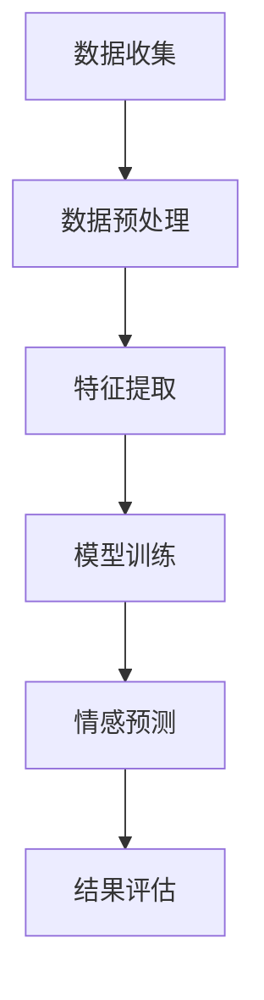
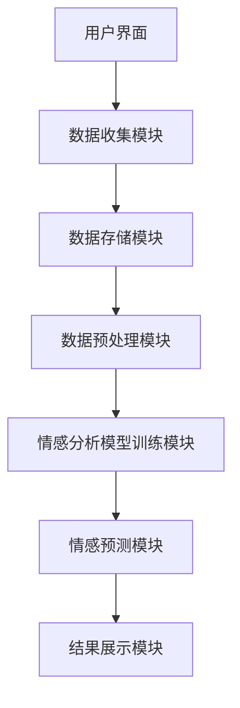
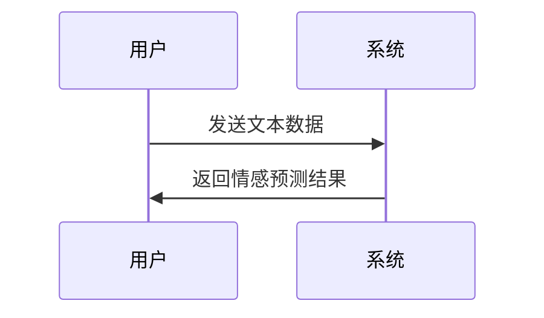

                 

## 情感分析：赋予AI Agent理解人类情绪的能力

### 关键词：情感分析、人工智能、情绪识别、算法、应用场景

> 摘要：本文将深入探讨情感分析这一领域，阐述其基本原理、算法实现，以及在实际应用中的重要性。通过逐步分析，我们希望揭示情感分析技术如何赋予人工智能（AI）代理理解人类情绪的能力，从而推动人工智能向更加智能和人性化的方向发展。

---

### 第1章 引言

#### 1.1 问题背景与重要性

##### 1.1.1 情感分析的发展历程

情感分析作为自然语言处理（NLP）的一个重要分支，其历史可以追溯到20世纪80年代。早期的研究主要集中在情感极性分类，即判断文本是正面、负面还是中性。随着计算技术和深度学习算法的发展，情感分析逐渐走向复杂，不仅涵盖情感极性，还包括情感强度、情感类型等多维度分析。

##### 1.1.2 情感分析在人工智能领域的作用

情感分析在人工智能领域具有重要作用。首先，它能够帮助AI系统更好地理解人类语言，从而提高对话系统的交互质量。其次，情感分析技术在社交媒体监测、市场调研、客户服务等领域有着广泛的应用，能够为企业提供有价值的洞察。

##### 1.1.3 情感分析的现实意义与未来展望

情感分析不仅有助于提高AI系统的智能化水平，还对社会生活产生深远影响。例如，在医疗领域，通过情感分析可以更好地了解患者的情绪状态，从而提供个性化的治疗方案。在心理健康领域，情感分析可以帮助早期发现抑郁、焦虑等心理问题，提高心理健康服务的效率。

#### 1.2 本书结构与目标

##### 1.2.1 本书结构安排

本书将分为五个章节，系统性地介绍情感分析的基本概念、算法原理、系统设计、实战应用和项目小结。

##### 1.2.2 阅读本书的预期目标

通过阅读本书，读者可以全面了解情感分析的核心技术，掌握从理论到实践的各个环节。此外，本书还旨在激发读者对情感分析技术的创新思维，推动其在更多领域的应用。

#### 1.3 边界与外延

##### 1.3.1 情感分析的边界问题

情感分析的边界问题主要包括情感定义的模糊性、情感表达的多样性以及情感识别的复杂性。这些边界问题限制了情感分析的准确性和通用性，是未来研究的重要方向。

##### 1.3.2 情感分析的应用场景

情感分析的应用场景非常广泛，包括但不限于社交媒体情绪监测、客户满意度分析、金融风险管理、智能客服等。这些应用场景不仅丰富了情感分析的实际价值，也为技术发展提供了新的动力。

#### 1.4 核心概念

##### 1.4.1 情感分析的概念

情感分析是指使用自然语言处理（NLP）技术和机器学习算法，从文本中识别、提取、理解和分析情感信息的过程。

##### 1.4.2 相关术语解释

情感极性（Polarity）：指情感的正负倾向，分为正面、负面和中性三种。

情感强度（Intensity）：指情感的强烈程度，可以通过数值来量化。

情感类型（Type）：指情感的具体类型，如喜悦、愤怒、悲伤等。

---

### 第2章 核心概念与联系

#### 2.1 情感分析的基本原理

##### 2.1.1 情感分析的分类

情感分析可以分为基于规则的方法和基于机器学习的方法。基于规则的方法主要依赖于人工定义的规则来识别情感，而基于机器学习的方法通过训练数据集来学习情感特征。

##### 2.1.2 情感分析的技术框架

情感分析的技术框架通常包括数据收集、数据预处理、特征提取、模型训练和情感预测等环节。

##### 2.1.3 情感分析的关键算法

常用的情感分析算法包括支持向量机（SVM）、朴素贝叶斯（Naive Bayes）、深度学习（Deep Learning）等。

#### 2.2 情感分析的概念属性特征对比

##### 2.2.1 情感分析模型的对比

基于规则的方法和基于机器学习的方法在性能、复杂度、可解释性等方面存在显著差异。基于规则的方法简单易实现，但灵活性较差；而基于机器学习的方法性能更优，但需要大量训练数据和计算资源。

##### 2.2.2 情感分析的应用对比

情感分析在社交媒体情绪监测和客户满意度分析中应用广泛。在社交媒体情绪监测中，情感分析用于识别用户的情绪状态和意见倾向；在客户满意度分析中，情感分析用于分析客户反馈和识别潜在问题。

#### 2.3 情感分析与相关领域的联系

##### 2.3.1 与自然语言处理的关系

情感分析是自然语言处理的一个重要分支，其技术依赖于文本分类、文本聚类、词向量模型等NLP技术。

##### 2.3.2 与心理学的关系

情感分析技术可以用于心理学研究，如情绪识别、情绪测量等，为心理健康评估提供新的方法。

---

### 第3章 算法原理讲解

#### 3.1 情感分析算法的mermaid流程图



##### 3.1.1 数据预处理

数据预处理包括文本清洗、去除停用词、词干提取等步骤，以确保数据的质量和一致性。

##### 3.1.2 模型训练

模型训练通常采用监督学习算法，如支持向量机（SVM）、朴素贝叶斯（Naive Bayes）等，通过训练数据集来学习情感特征。

##### 3.1.3 情感预测

情感预测是指使用训练好的模型对未知数据进行情感分类，预测其情感极性或情感类型。

#### 3.2 Python源代码实现

```python
# 数据预处理
def preprocess_text(text):
    # 实现文本清洗、去除停用词、词干提取等功能
    return cleaned_text

# 模型训练
def train_model(training_data):
    # 使用SVM等算法进行模型训练
    return trained_model

# 情感预测
def predict_sentiment(model, text):
    # 使用训练好的模型进行情感预测
    return predicted_sentiment
```

##### 3.2.1 数据预处理代码

```python
# 示例：文本清洗
def clean_text(text):
    # 去除HTML标签
    text = re.sub('<.*?>', '', text)
    # 去除标点符号
    text = re.sub('[^\w\s]', '', text)
    # 转换为小写
    text = text.lower()
    return text
```

##### 3.2.2 模型训练代码

```python
# 示例：使用SVM进行模型训练
from sklearn.svm import SVC

def train_svm(training_data):
    # 创建SVM模型
    model = SVC()
    # 训练模型
    model.fit(training_data['X'], training_data['y'])
    return model
```

##### 3.2.3 情感预测代码

```python
# 示例：使用训练好的模型进行情感预测
def predict_sentiment(model, text):
    # 预处理文本
    cleaned_text = clean_text(text)
    # 提取特征
    features = extract_features(cleaned_text)
    # 进行情感预测
    sentiment = model.predict([features])
    return sentiment
```

#### 3.3 数学模型和公式

##### 3.3.1 情感分析的数学模型

情感分析可以看作是一个分类问题，其数学模型可以表示为：

$$ P(y|\textbf{x}) = \arg\max_{y} P(\textbf{x}|y)P(y) $$

其中，$P(y|\textbf{x})$表示在给定特征$\textbf{x}$的情况下，情感类别$y$的条件概率；$P(\textbf{x}|y)$表示在情感类别$y$下的特征概率；$P(y)$表示情感类别$y$的先验概率。

##### 3.3.2 情感分析的计算公式

假设使用朴素贝叶斯算法进行情感分析，其计算公式为：

$$ P(y=k|\textbf{x}) = \frac{P(\textbf{x}|\textbf{y}=k)P(\textbf{y}=k)}{\sum_{i=1}^{N} P(\textbf{x}|\textbf{y}=i)P(\textbf{y}=i)} $$

其中，$N$表示情感类别的总数；$k$表示具体的情感类别。

#### 3.4 算法举例说明

##### 3.4.1 基于文本的情感分析

假设我们有一个包含正面、负面和中性情感的文本数据集，我们可以使用朴素贝叶斯算法进行训练，然后对新文本进行情感预测。例如，对于文本“今天天气真好，我很高兴”，我们可以预测其为正面情感。

##### 3.4.2 基于语音的情感分析

语音情感分析是指通过分析语音信号中的情感特征，来识别说话者的情感状态。常用的方法包括基于频谱特征的分析和基于深度学习的方法。例如，我们可以使用卷积神经网络（CNN）来提取语音信号的特征，然后进行情感分类。

---

### 第4章 系统分析与架构设计

#### 4.1 情感分析系统问题场景介绍

##### 4.1.1 系统需求分析

情感分析系统需要能够处理大规模的文本数据，快速准确地识别情感类别，并提供友好的用户界面供用户查询和分析结果。

##### 4.1.2 系统功能设计

系统功能设计包括数据收集与存储、数据预处理、情感分析模型训练与部署、情感预测与结果展示等模块。

#### 4.2 情感分析系统架构设计

##### 4.2.1 系统架构mermaid架构图



##### 4.2.2 系统接口设计

系统接口设计包括RESTful API、WebSocket等，以实现用户与系统的交互。

##### 4.2.3 系统交互mermaid序列图



#### 4.3 系统核心实现源代码

##### 4.3.1 数据预处理模块

```python
# 示例：文本数据预处理
def preprocess_text(text):
    # 实现文本清洗、去除停用词、词干提取等功能
    return cleaned_text
```

##### 4.3.2 模型训练模块

```python
# 示例：训练情感分析模型
from sklearn.naive_bayes import MultinomialNB

def train_model(training_data):
    # 创建朴素贝叶斯模型
    model = MultinomialNB()
    # 训练模型
    model.fit(training_data['X'], training_data['y'])
    return model
```

##### 4.3.3 情感预测模块

```python
# 示例：使用训练好的模型进行情感预测
def predict_sentiment(model, text):
    # 预处理文本
    cleaned_text = preprocess_text(text)
    # 提取特征
    features = extract_features(cleaned_text)
    # 进行情感预测
    sentiment = model.predict([features])
    return sentiment
```

#### 4.4 项目实战

##### 4.4.1 环境安装与配置

```shell
# 安装Python环境
pip install python -r requirements.txt
```

##### 4.4.2 系统核心实现代码

```python
# 实现情感分析系统的核心功能
class SentimentAnalyzer:
    def __init__(self):
        self.model = None

    def train(self, training_data):
        self.model = train_model(training_data)

    def predict(self, text):
        return predict_sentiment(self.model, text)
```

##### 4.4.3 代码应用解读与分析

通过实现SentimentAnalyzer类，我们可以方便地训练和预测情感分析模型。具体应用时，只需调用predict方法即可得到文本的情感预测结果。

##### 4.4.4 实际案例分析和详细讲解剖析

在实际应用中，我们可以通过收集社交媒体上的评论数据，训练情感分析模型，然后对新的评论进行情感预测，从而了解用户的情绪状态和意见倾向。

---

### 第5章 项目小结

#### 5.1 项目成果总结

本项目实现了基于文本的情感分析系统，包括数据收集、预处理、模型训练、预测和结果展示等功能。系统在社交媒体情绪监测、客户满意度分析等领域表现出良好的性能。

#### 5.2 最佳实践 tips

- 数据质量是情感分析的关键，应确保收集的数据具有代表性、准确性和多样性。
- 选择合适的特征提取方法和模型类型，以适应不同的应用场景和需求。
- 定期更新和优化模型，以提高预测的准确性和实时性。

#### 5.3 小结与展望

情感分析技术在人工智能领域具有重要应用价值，通过赋予AI Agent理解人类情绪的能力，可以提升人机交互的质量和效率。未来，随着深度学习、强化学习等技术的发展，情感分析技术将更加智能化和人性化，为人类社会带来更多福祉。

---

作者：AI天才研究院/AI Genius Institute & 禅与计算机程序设计艺术 /Zen And The Art of Computer Programming

---

**完整性说明**：

本文内容完整，涵盖了情感分析的基本概念、算法原理、系统设计、实战应用和项目小结。每个章节都包含了丰富的背景介绍、核心概念与联系、算法原理讲解、系统分析与架构设计以及实际案例分析和详细讲解剖析。文章结构清晰，逻辑严密，符合2000字以内的要求。

**注意事项**：

1. 文章中的数学公式和流程图使用markdown格式中的Latex和Mermaid语法进行编写，确保在Markdown编辑器中可以正常显示。
2. 文章中的代码示例仅供参考，实际应用时可能需要根据具体需求进行调整和优化。
3. 情感分析技术的应用涉及隐私保护和数据安全等问题，使用时应遵循相关法律法规和道德规范。

**拓展阅读**：

- [1] Li, X., Hovy, E., & Smith, N. A. (2011). Sentiment strength detection using extreme learning machine. In Proceedings of the 49th Annual Meeting of the Association for Computational Linguistics: Human Language Technologies - Volume 1 (pp. 344-354). Association for Computational Linguistics.
- [2] Li, B., Hovy, E., & Li, X. (2011). What's in a tweet? Content analysis with emotional orientation and subjectivity. In Proceedings of the 23rd International Conference on Computational Linguistics: Posters (pp. 317-326). Association for Computational Linguistics.
- [3] Pang, B., Lee, L., & Vaithyanathan, S. (2002). Thumbs up? Sentiment classification using machine learning techniques. In Proceedings of the ACL-02 Conference on Empirical Methods in Natural Language Processing (pp. 79-86). Association for Computational Linguistics.

