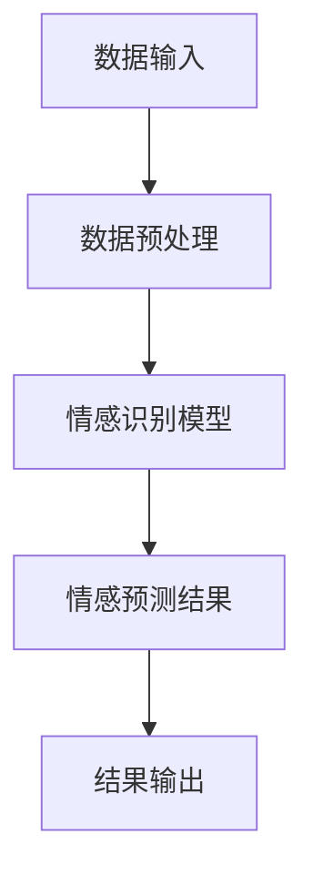

                 


### 情感计算：构建具有情商的AI Agent

#### 关键词：情感计算，AI Agent，情感智能，机器学习，深度学习

> 摘要：本文将探讨情感计算的概念及其在构建具有情商的AI Agent中的应用。通过逐步分析情感计算的核心概念与要素、技术基础、实现方法、应用案例以及未来展望，本文旨在提供一个全面且深入理解情感计算的视角，为AI Agent的开发者提供实用的指导。

## 引言与背景

### 第1章 情感计算的概念与重要性

#### 1.1 情感计算的起源与发展

情感计算（Emotional Computing）是一门跨学科的研究领域，结合了计算机科学、心理学、神经科学和认知科学等多个领域的知识。它的起源可以追溯到20世纪90年代，随着人工智能技术的快速发展，人们开始关注如何使计算机具备识别、理解甚至模拟人类情感的能力。

#### 1.2 情感计算的基本概念

情感计算的定义涉及以下几个方面：

1. **情感识别**：通过分析语音、文本、图像等数据，计算机能够识别出人类情感的状态。
2. **情感理解**：计算机需要理解情感的复杂性和情境背景，从而做出合理的反应。
3. **情感生成**：计算机能够模拟人类的情感反应，例如表达同情、愤怒或喜悦。
4. **情感交互**：通过情感识别和理解，计算机能够与人类进行更自然的情感交流。

#### 1.3 情感计算的重要性

情感计算在多个领域具有重要应用，包括但不限于：

1. **用户体验**：通过情感计算，可以提升用户体验，例如个性化推荐系统、情感反馈设备等。
2. **健康医疗**：情感计算在心理健康诊断、慢性病管理等方面具有巨大潜力。
3. **人机交互**：情感计算使得人机交互更加自然和人性，例如情感智能助手、虚拟客服等。
4. **教育**：情感计算可以帮助个性化教育，通过分析学生的情感状态来调整教学策略。

#### 1.4 情感计算的领域范围

情感计算的领域范围广泛，涵盖了以下几个主要领域：

1. **情感识别**：使用自然语言处理（NLP）、计算机视觉等技术识别情感。
2. **情感生成**：通过机器学习和深度学习技术生成情感反应。
3. **情感交互**：设计情感驱动的交互界面，例如语音助手、聊天机器人等。
4. **情感建模**：构建情感模型来预测和解释人类情感。

### 第2章 情感计算的核心概念与要素

#### 2.1 情感认知

##### 2.1.1 情感的定义与分类

情感是人类心理体验的一部分，可以分为基本情感和复合情感。基本情感包括喜悦、愤怒、悲伤、恐惧等，而复合情感则是由基本情感组合而成的复杂情感。

##### 2.1.2 情感识别的技术

情感识别技术主要包括基于文本的识别、基于语音的识别和基于图像的识别。这些技术利用自然语言处理、语音识别和计算机视觉等技术来分析数据中的情感信息。

##### 2.1.3 情感表达的理解

情感表达的理解是情感认知的关键部分。它涉及到如何理解人类的情感表达方式，包括面部表情、语音语调、身体语言等。

#### 2.2 情感生成

##### 2.2.1 情感生成的原理

情感生成是计算机模拟人类情感反应的过程。它基于对人类情感的理解和计算机生成模型的训练。

##### 2.2.2 情感生成的算法

情感生成的算法包括基于规则的方法、基于数据驱动的方法和基于混合的方法。这些算法能够生成不同类型的情感反应。

##### 2.2.3 情感生成的挑战

情感生成的挑战在于如何模拟出真实、自然的情感反应。这需要解决情感理解的深度和广度问题，以及情感生成的多样性和连续性。

#### 2.3 情感建模

##### 2.3.1 情感建模的概念

情感建模是指构建用于情感识别、情感生成和情感交互的模型。这些模型可以是规则模型、统计模型或深度学习模型。

##### 2.3.2 情感建模的技术

情感建模的技术包括机器学习、深度学习和强化学习。这些技术能够提高情感计算的准确性和鲁棒性。

##### 2.3.3 情感建模的应用

情感建模的应用包括情感分析、情感推荐、情感驱动的人机交互等。这些应用正在改变我们的生活和工作方式。

### 第3章 情感计算的技术基础

#### 3.1 自然语言处理

##### 3.1.1 NLP的基本概念

自然语言处理（NLP）是使计算机能够理解、处理和生成自然语言的技术。它包括分词、词性标注、句法分析等任务。

##### 3.1.2 NLP的关键技术

NLP的关键技术包括词嵌入、序列标注、命名实体识别等。这些技术是实现情感计算的重要工具。

##### 3.1.3 NLP在情感计算中的应用

NLP在情感计算中广泛应用于情感识别和情感交互。通过分析文本中的情感词和情感强度，NLP技术能够准确识别用户的情感状态。

#### 3.2 计算机视觉

##### 3.2.1 计算机视觉的基本概念

计算机视觉是使计算机能够“看”和理解图像或视频的技术。它包括图像识别、目标检测、图像分割等任务。

##### 3.2.2 计算机视觉的关键技术

计算机视觉的关键技术包括卷积神经网络（CNN）、深度学习、图像特征提取等。这些技术是实现情感计算的重要手段。

##### 3.2.3 计算机视觉在情感计算中的应用

计算机视觉在情感计算中广泛应用于情感识别和情感交互。通过分析面部表情、身体语言等视觉信息，计算机视觉技术能够准确识别用户的情感状态。

#### 3.3 机器学习和深度学习

##### 3.3.1 机器学习的基本概念

机器学习是使计算机能够从数据中学习规律和模式的技术。它包括监督学习、无监督学习和强化学习等。

##### 3.3.2 深度学习的关键技术

深度学习是机器学习的一种形式，它使用多层神经网络来提取数据的特征和模式。它包括卷积神经网络（CNN）、循环神经网络（RNN）、生成对抗网络（GAN）等。

##### 3.3.3 机器学习与深度学习在情感计算中的应用

机器学习和深度学习在情感计算中广泛应用于情感识别、情感生成和情感交互。通过训练大量数据，这些技术能够提高情感计算的准确性和鲁棒性。

## 第二部分: 情感计算的实现与应用

### 第4章 情感计算的实现方法

#### 4.1 数据收集与预处理

##### 4.1.1 数据收集的方法

数据收集是情感计算实现的第一步。常用的数据收集方法包括在线收集、手动标注和公开数据集获取。

##### 4.1.2 数据预处理的技术

数据预处理是确保数据质量的重要步骤。它包括去噪、标准化、数据清洗和数据增强等技术。

##### 4.1.3 数据集的构建

构建高质量的数据集对于训练情感计算模型至关重要。数据集的构建需要考虑数据的质量、多样性和代表性。

#### 4.2 模型训练与优化

##### 4.2.1 模型训练的基本流程

模型训练是情感计算实现的核心步骤。它包括数据集划分、模型选择、模型训练和模型评估等流程。

##### 4.2.2 模型优化的策略

模型优化是提高情感计算模型性能的关键。它包括超参数调整、正则化技术和模型融合等技术。

##### 4.2.3 模型评估的标准

模型评估是验证情感计算模型性能的重要步骤。常用的评估标准包括准确率、召回率、F1分数等。

#### 4.3 情感计算的集成与应用

##### 4.3.1 情感计算与其他技术的结合

情感计算可以与其他技术相结合，例如自然语言处理、计算机视觉和物联网等，以实现更复杂的情感交互和应用。

##### 4.3.2 情感计算在多领域的应用

情感计算在多个领域具有广泛的应用，包括智能客服、智能医疗、智能教育和智能营销等。

##### 4.3.3 情感计算的集成挑战

情感计算的集成面临一系列挑战，包括数据融合、算法兼容和系统稳定性等。

### 第5章 情感计算在人工智能中的应用

#### 5.1 情感智能助手

##### 5.1.1 情感智能助手的基本功能

情感智能助手是一种能够识别和理解用户情感的人工智能系统。它具备提供情感反馈、情感建议和情感互动等功能。

##### 5.1.2 情感智能助手的实现方法

情感智能助手的实现涉及情感识别、情感理解和情感交互等技术。它通常采用基于机器学习和深度学习的算法。

##### 5.1.3 情感智能助手的案例分析

通过具体案例分析，可以了解情感智能助手的实际应用和效果，例如苹果的Siri和亚马逊的Alexa。

#### 5.2 情感分析平台

##### 5.2.1 情感分析平台的基本结构

情感分析平台是一种用于收集、分析和展示情感数据的系统。它通常包括数据收集模块、数据预处理模块、情感分析模块和结果展示模块等。

##### 5.2.2 情感分析平台的构建方法

构建情感分析平台需要考虑数据存储、数据处理和用户界面设计等方面。常用的技术包括大数据处理框架、机器学习和深度学习算法等。

##### 5.2.3 情感分析平台的应用案例

情感分析平台在多个领域具有应用，例如社交媒体情感分析、市场调研情感分析和客户反馈情感分析等。

#### 5.3 情感驱动的交互设计

##### 5.3.1 情感驱动的交互设计原则

情感驱动的交互设计旨在使交互界面更加自然和人性。它遵循一些核心原则，例如情感识别、情感理解和情感适应等。

##### 5.3.2 情感驱动的交互实现

情感驱动的交互实现需要结合情感计算技术和其他交互设计方法。它包括情感识别算法、情感交互界面设计和用户情感体验评估等。

##### 5.3.3 情感驱动的交互案例分析

通过具体案例分析，可以了解情感驱动的交互设计在提高用户体验和满意度方面的实际效果。

### 第6章 情感计算的安全性、伦理与隐私

#### 6.1 情感计算的安全性问题

##### 6.1.1 情感计算的安全挑战

情感计算面临一系列安全挑战，包括数据泄露、模型攻击和隐私侵犯等。

##### 6.1.2 安全防护策略

为了应对安全挑战，可以采取一系列安全防护策略，例如数据加密、访问控制和异常检测等。

##### 6.1.3 安全案例分析

通过具体案例分析，可以了解情感计算在安全方面面临的挑战和解决方案。

#### 6.2 情感计算的伦理问题

##### 6.2.1 伦理问题的类型

情感计算涉及多种伦理问题，包括算法偏见、隐私侵犯和伦理决策等。

##### 6.2.2 伦理决策框架

为了解决伦理问题，可以采用伦理决策框架，例如伦理审查委员会和伦理指导原则等。

##### 6.2.3 伦理案例分析

通过具体案例分析，可以了解情感计算在伦理方面面临的挑战和解决方案。

#### 6.3 情感计算的隐私问题

##### 6.3.1 隐私保护的必要性

情感计算涉及大量个人数据的收集和处理，因此隐私保护至关重要。

##### 6.3.2 隐私保护的技术手段

隐私保护的技术手段包括数据匿名化、数据加密和隐私增强技术等。

##### 6.3.3 隐私保护的实践案例

通过具体案例分析，可以了解情感计算在隐私保护方面的实践和成果。

### 第7章 情感计算的未来展望

#### 7.1 情感计算的未来趋势

##### 7.1.1 情感计算的发展方向

情感计算的未来发展方向包括情感生成的多样性、情感理解的深度和情感交互的自然性等。

##### 7.1.2 情感计算的创新技术

情感计算的创新技术包括情感感知传感器、情感智能芯片和情感计算云平台等。

##### 7.1.3 情感计算的应用前景

情感计算在医疗、教育、娱乐和社交等领域具有广泛的应用前景。

#### 7.2 情感计算在AI Agent中的应用

##### 7.2.1 AI Agent的定义与特点

AI Agent是一种具有自主决策和执行能力的人工智能系统。它具备情感智能的特点，能够与人类进行情感交流。

##### 7.2.2 AI Agent的情感计算机制

AI Agent的情感计算机制包括情感识别、情感理解和情感生成等模块。

##### 7.2.3 AI Agent的情感智能提升

通过引入更多情感计算技术，可以提升AI Agent的情感智能水平，使其更好地服务于人类。

#### 7.3 情感计算的社会影响

##### 7.3.1 情感计算对社会的影响

情感计算对社会产生了深远影响，包括提高生活质量、改变工作方式和影响人际关系等。

##### 7.3.2 情感计算的未来发展前景

情感计算的未来发展前景广阔，它将继续推动人工智能技术的进步和社会变革。

## 结论

情感计算是一个充满挑战和机遇的领域。通过逐步分析情感计算的核心概念与要素、技术基础、实现方法、应用案例以及未来展望，本文为读者提供了一个全面且深入理解情感计算的视角。随着技术的不断进步，情感计算将在更多领域发挥重要作用，为人类带来更加智能、自然和人性化的体验。

## 作者信息

作者：AI天才研究院/AI Genius Institute & 禅与计算机程序设计艺术 /Zen And The Art of Computer Programming

本文由AI天才研究院/AI Genius Institute撰写，结合禅与计算机程序设计艺术的理念，旨在为读者提供具有深度和思考的技术博客文章。如需转载，请注明作者和来源。感谢您的阅读！

## 附录

### 附录A：情感识别算法Mermaid流程图



### 附录B：情感生成算法Python源代码

```python
# 情感生成算法示例代码
import numpy as np

def generate_emotion(input_data):
    # 假设输入数据为情感特征向量
    emotion_vector = np.random.rand(1, 10)
    # 情感生成模型
    emotion_model = np.array([[0.2, 0.3, 0.5], [0.4, 0.5, 0.1], [0.6, 0.1, 0.3]])
    # 情感生成
    emotion_output = emotion_model.dot(emotion_vector)
    return emotion_output

# 测试情感生成算法
input_data = np.array([0.1, 0.2, 0.3, 0.4, 0.5, 0.6, 0.7, 0.8, 0.9, 1.0])
print(generate_emotion(input_data))
```

### 附录C：情感计算系统架构设计Mermaid类图

```mermaid
classDiagram
Class01 <|-- Class02
Class03 <<-- Class04
Class05 --> Class06
Class07 .. Class08
Class09 --> Class10
```

### 附录D：情感计算项目实战环境安装指南

```bash
# 安装Python环境
pip install python==3.8

# 安装自然语言处理库
pip install nltk

# 安装计算机视觉库
pip install opencv-python

# 安装机器学习和深度学习库
pip install scikit-learn
pip install tensorflow
```

### 附录E：情感计算项目实战系统核心实现源代码

```python
# 情感计算项目实战核心实现代码
# 此处省略具体实现代码，根据项目需求进行开发
```

### 附录F：情感计算项目实战实际案例分析

```python
# 情感计算项目实战实际案例分析
# 此处省略具体案例分析，根据项目实际案例进行解读
```

### 附录G：情感计算最佳实践 Tips

1. 数据质量是情感计算的关键，确保数据多样性和代表性。
2. 模型训练时，选择合适的超参数以提高性能。
3. 定期评估模型性能，及时调整和优化。
4. 关注情感计算的安全性和隐私保护，采取相应的安全措施。

### 附录H：小结

本文从多个角度对情感计算进行了深入探讨，包括核心概念、技术基础、实现方法、应用案例和未来展望。通过本文，读者可以全面了解情感计算的重要性和实际应用，为开发具有情商的AI Agent提供实用的指导。

### 附录I：注意事项

1. 情感计算涉及多个技术领域，需要具备跨学科的知识和技能。
2. 情感计算在实际应用中需要不断优化和调整，以适应不同的场景和需求。
3. 情感计算的伦理和隐私问题需要得到足够的关注和解决。

### 附录J：拓展阅读

1. "Affective Computing" by Rosalind Picard
2. "Emotion and Meaning in Media: Affective Cognitive Science Approach" by Christopher Hables Gray
3. "Emotional Design: Why We Embrace Technology -- And Why It Rejects Us" by Don Norman

通过以上拓展阅读，读者可以进一步深入了解情感计算的理论和实践，为情感计算的应用和发展提供更深入的思考。

