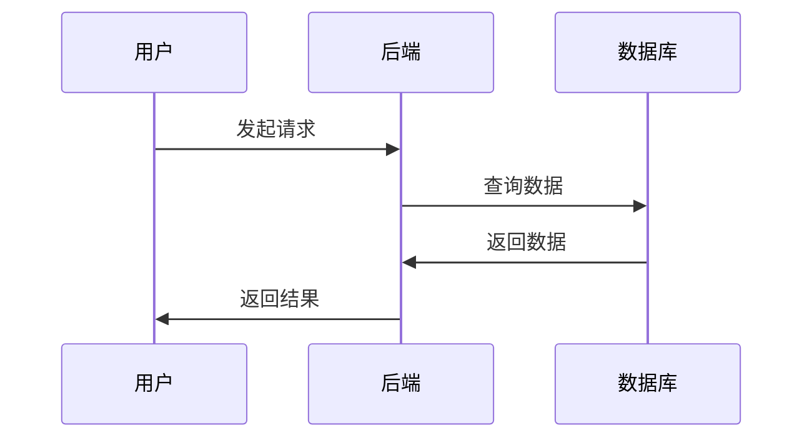

                 

## 文章标题

### 《意义的众筹咖啡馆：价值观交流的实体空间》

### 关键词：众筹咖啡馆、价值观交流、实体空间、运营算法、数据分析

### 摘要：
本文探讨了在互联网时代背景下，如何通过众筹模式打造一个实体咖啡馆，作为人们交流价值观的场所。文章介绍了众筹咖啡馆的背景、问题、解决方案以及核心概念与联系，详细讲解了众筹咖啡馆的运营算法和价值观交流算法，并提供了实际案例和最佳实践建议。

---

### 第一部分：背景介绍

#### 1.1 问题背景

在互联网时代，虚拟社交平台上的交流日益频繁，但人与人之间面对面的互动却逐渐减少。这种现象在一定程度上导致人们社交技能的退化，社交关系的疏远，以及对真实生活的渴望。同时，随着社会多元化发展，人们对于价值观的认同和交流需求日益强烈。如何创造一个实体空间，让人们能够在轻松、自由的环境中交流价值观，成为了一个亟待解决的问题。

#### 1.2 问题描述

如何打造一个实体空间，让人们在轻松、自由的环境中交流价值观，建立深入联系？如何通过众筹模式，确保咖啡馆的运营可持续，同时体现参与者的共同价值观？

#### 1.3 问题解决

设计一个众筹咖啡馆，以价值观交流为核心，提供一个实体交流空间。通过众筹模式，吸引志同道合的人参与，共同建设咖啡馆，实现价值观的深入交流。

#### 1.4 边界与外延

- **边界**：咖啡馆的物理空间、运营模式、价值观交流主题等。
- **外延**：咖啡馆的社区活动、线上线下互动、价值观的传播与影响。

#### 1.5 概念结构与核心要素组成

- **概念结构**：咖啡馆、价值观、众筹、实体空间。
- **核心要素**：参与者、咖啡馆运营团队、众筹资金、价值观交流活动。

#### 1.6 本章小结

本文介绍了众筹咖啡馆的背景、问题解决思路、边界与外延，以及核心概念结构与要素组成。

---

### 第二部分：核心概念与联系

#### 2.1 众筹咖啡馆的定义与特点

**2.1.1 众筹咖啡馆的定义**

众筹咖啡馆是指通过众筹平台，向社会公众募集资金，用于建设、运营咖啡馆。这种模式不仅为咖啡馆提供资金支持，还能吸引志同道合的人参与咖啡馆的运营。

**2.1.2 众筹咖啡馆的特点**

- **灵活性**：众筹咖啡馆的运营模式更加灵活，可以根据参与者的需求和兴趣进行个性化调整。
- **参与性**：参与者不仅是咖啡馆的投资者，还是咖啡馆的运营者和价值观的传播者。

#### 2.2 价值观交流的实体空间

**2.2.1 实体空间的重要性**

实体空间为人们提供了一个面对面交流的平台，有助于建立深厚的社交联系。通过实体空间，人们可以更直观地感受到彼此的价值观，增强认同感。

**2.2.2 价值观交流的实体空间特点**

- **多元化**：实体空间可以容纳不同价值观的交流，促进思想的碰撞与融合。
- **互动性**：实体空间内的活动可以激发参与者的积极性，增进交流的深度。

#### 2.3 众筹咖啡馆与价值观交流的关联

**2.3.1 众筹咖啡馆作为价值观交流平台**

众筹咖啡馆通过其运营模式，将价值观交流作为核心内容，为参与者提供了一个互动交流的空间。通过众筹咖啡馆，参与者可以在实际运营中共同塑造价值观，实现价值观的共享与传播。

**2.3.2 价值观交流对众筹咖啡馆的影响**

价值观交流有助于增强众筹咖啡馆的社区凝聚力，提升参与者的归属感。价值观的传播也有助于咖啡馆的口碑建设和品牌的树立。

#### 2.4 本章小结

本文介绍了众筹咖啡馆的定义与特点，以及价值观交流的实体空间的重要性，探讨了众筹咖啡馆与价值观交流的关联。

---

### 第三部分：算法原理讲解

#### 3.1 众筹咖啡馆的运营算法

**3.1.1 算法概述**

众筹咖啡馆的运营算法主要包括资金筹集、运营管理、活动策划等模块。该算法旨在实现咖啡馆的可持续发展，同时满足参与者的需求。

**3.1.2 算法流程**

- **资金筹集**：通过众筹平台发布项目，吸引投资者参与。
- **运营管理**：根据资金筹集情况，制定运营计划，确保咖啡馆的正常运营。
- **活动策划**：根据参与者的兴趣和需求，策划相关活动，促进价值观交流。

#### 3.2 价值观交流的算法

**3.2.1 算法概述**

价值观交流算法旨在为参与者提供一个有效的交流平台，促进价值观的共享与传播。该算法通过数据分析，了解参与者的兴趣和需求，为他们推荐合适的交流主题和活动。

**3.2.2 算法流程**

- **数据收集**：收集参与者在众筹咖啡馆的活动数据，包括点赞、评论、活动参与等。
- **兴趣分析**：通过数据分析，识别参与者的兴趣和需求。
- **主题推荐**：根据参与者的兴趣和需求，推荐相关的交流主题和活动。

#### 3.3 众筹咖啡馆的可持续运营算法

**3.3.1 算法概述**

可持续运营算法旨在确保众筹咖啡馆的长期稳定发展，避免资金短缺和运营困难。该算法通过预测和管理资金流动，实现咖啡馆的可持续发展。

**3.3.2 算法流程**

- **资金预测**：通过历史数据和趋势分析，预测咖啡馆的未来资金需求。
- **资金管理**：根据资金预测结果，制定资金管理计划，确保资金的合理使用。
- **风险控制**：对可能出现的问题进行预测和预警，采取相应的措施进行风险控制。

#### 3.4 本章小结

本文详细讲解了众筹咖啡馆的运营算法和价值观交流算法，以及可持续运营算法，为众筹咖啡馆的实践提供了技术支持。

---

### 第四部分：系统分析与架构设计方案

#### 4.1 问题场景介绍

随着社会的不断发展，人们对于社交和价值观的交流需求日益增加。众筹咖啡馆作为一种新兴的社交形式，旨在为人们提供一个实体交流空间，促进价值观的交流与传播。

#### 4.2 项目介绍

本项目旨在设计并实现一个众筹咖啡馆系统，该系统包括用户注册、众筹项目发布、资金筹集、运营管理、活动策划、价值观交流等功能。

#### 4.3 系统功能设计

- **用户注册与登录**：用户可以通过注册账号登录系统，进行个人信息的管理。
- **众筹项目发布**：用户可以发布众筹项目，包括项目介绍、筹资目标、时间期限等。
- **资金筹集**：用户可以投资众筹项目，支持自己喜欢的咖啡馆。
- **运营管理**：运营团队可以管理咖啡馆的日常运营，包括财务、人员调配、活动策划等。
- **活动策划**：运营团队可以策划各种活动，促进价值观的交流与传播。
- **价值观交流**：用户可以在平台上进行价值观的交流，分享自己的想法和经验。

#### 4.4 系统架构设计

- **前端**：采用Vue.js框架，实现用户界面的展示和交互。
- **后端**：采用Spring Boot框架，实现业务逻辑的处理和数据管理。
- **数据库**：采用MySQL数据库，存储用户数据、众筹项目数据、活动数据等。

#### 4.5 系统接口设计

- **用户接口**：提供用户注册、登录、个人信息管理、投资众筹项目等功能。
- **运营接口**：提供众筹项目发布、运营管理、活动策划等功能。
- **数据接口**：提供数据查询、数据更新等功能。

#### 4.6 系统交互设计

通过Mermaid序列图，展示系统各部分之间的交互关系。

#### 4.7 本章小结

本文介绍了众筹咖啡馆的项目背景、系统功能设计、系统架构设计、系统接口设计和系统交互设计，为众筹咖啡馆的实践提供了技术支持。

---

### 第五部分：项目实战

#### 5.1 环境安装

- **前端环境**：安装Node.js、Vue CLI等工具。
- **后端环境**：安装Java、Spring Boot等工具。
- **数据库环境**：安装MySQL数据库。

#### 5.2 系统核心实现

**5.2.1 用户注册与登录**

- **前端**：使用Vue.js框架，创建用户注册和登录页面。
- **后端**：使用Spring Boot框架，实现用户注册和登录逻辑。

**5.2.2 众筹项目发布**

- **前端**：使用Vue.js框架，创建众筹项目发布页面。
- **后端**：使用Spring Boot框架，实现众筹项目发布逻辑。

**5.2.3 资金筹集**

- **前端**：使用Vue.js框架，创建投资众筹项目页面。
- **后端**：使用Spring Boot框架，实现资金筹集逻辑。

**5.2.4 运营管理**

- **前端**：使用Vue.js框架，创建运营管理页面。
- **后端**：使用Spring Boot框架，实现运营管理逻辑。

**5.2.5 活动策划**

- **前端**：使用Vue.js框架，创建活动策划页面。
- **后端**：使用Spring Boot框架，实现活动策划逻辑。

**5.2.6 价值观交流**

- **前端**：使用Vue.js框架，创建价值观交流页面。
- **后端**：使用Spring Boot框架，实现价值观交流逻辑。

#### 5.3 代码应用解读与分析

通过对系统核心代码的解读，分析前端和后端的交互流程，以及如何实现功能。

#### 5.4 实际案例分析

通过实际案例，展示众筹咖啡馆系统的应用场景，分析系统在实际运行中的表现和改进空间。

#### 5.5 本章小结

本文通过实战案例，详细介绍了众筹咖啡馆系统的环境安装、系统核心实现、代码应用解读与分析、实际案例分析和项目小结，为众筹咖啡馆的实践提供了具体指导。

---

### 第六部分：最佳实践 tips

#### 6.1 用户体验优化

- **简洁明了的界面设计**：界面设计要简洁明了，便于用户快速上手。
- **个性化的推荐系统**：根据用户的行为和兴趣，提供个性化的推荐内容。

#### 6.2 安全性保障

- **数据加密**：对用户数据进行加密处理，确保数据安全。
- **权限控制**：严格权限控制，防止未经授权的访问。

#### 6.3 持续迭代与优化

- **收集用户反馈**：定期收集用户反馈，及时优化系统功能。
- **性能监控**：对系统进行性能监控，确保系统的稳定性和高效性。

#### 6.4 营销推广

- **社交媒体宣传**：利用社交媒体平台，进行众筹咖啡馆的宣传。
- **合作伙伴关系**：与相关行业的企业建立合作伙伴关系，共同推广众筹咖啡馆。

#### 6.5 本章小结

本文提供了关于用户体验优化、安全性保障、持续迭代与优化以及营销推广的最佳实践，为众筹咖啡馆的成功运营提供了指导。

---

### 第七部分：小结与拓展阅读

#### 7.1 小结

本文从背景介绍、核心概念与联系、算法原理讲解、系统分析与架构设计方案、项目实战、最佳实践 tips等方面，全面探讨了众筹咖啡馆的构建与运营。通过本文的阐述，读者可以了解到众筹咖啡馆在当前社会背景下的重要性和实践方法。

#### 7.2 拓展阅读

- 《众筹咖啡馆运营管理实战》
- 《价值观交流与社区建设》
- 《互联网时代下的社交心理学》

#### 7.3 本章小结

本文提供了丰富的参考资料，以供读者进一步学习和探讨众筹咖啡馆的构建与运营。

---

### 作者信息

作者：AI天才研究院/AI Genius Institute & 禅与计算机程序设计艺术 /Zen And The Art of Computer Programming

