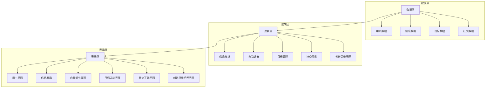
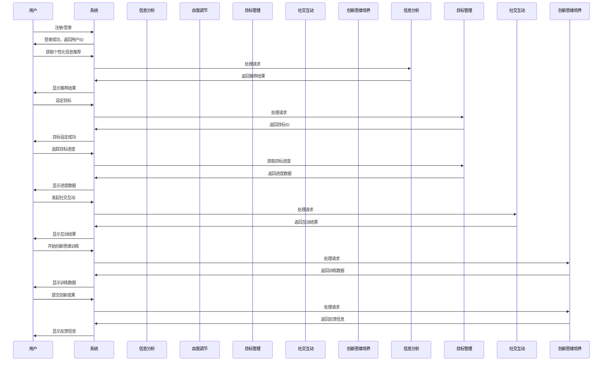

                 


## 混沌中的个体：从无序到有序的探寻

### 文章标题
### 混沌中的个体：从无序到有序的探寻

### 文章关键词
- 混沌理论
- 个体自我实现
- 去中心化
- 认知重构
- 社会互动

### 文章摘要
本文从混沌与秩序的哲学探讨出发，探讨了个体如何在混沌中找到秩序，实现自我实现。通过对去中心化理论的背景介绍，分析了个体在去中心化社会中的角色定位和影响，结合实际案例，提出个体在混沌中找到秩序的策略，并总结主要结论与未来研究方向。

## 目录

1. 引言
2. 去中心化理论的背景介绍
3. 混沌与秩序的哲学探讨
4. 去中心化与个体自我实现的联系
5. 实践案例与分析
6. 个体在混沌中找到秩序的策略
7. 总结与展望

## 1. 引言

在当今快速变化的社会中，个体面临着前所未有的挑战和机遇。随着信息技术的迅猛发展，人类社会逐渐从传统的中心化模式转向去中心化模式。然而，这一转变并非一帆风顺，个体在去中心化的环境中常常感到迷茫和无助。如何在混沌中找到秩序，实现自我实现，成为了一个亟待解决的问题。

本书旨在探讨这一主题，通过对去中心化理论的背景介绍，混沌与秩序的哲学探讨，以及去中心化与个体自我实现的联系，分析个体在去中心化社会中的角色定位和影响，结合实际案例，提出个体在混沌中找到秩序的策略，并总结主要结论与未来研究方向。

本书的目标读者主要包括以下几类人群：

1. 对去中心化理论和实践感兴趣的学者和研究人员。
2. 从事信息技术和互联网行业的从业者。
3. 对个体自我实现和成长有追求的普通人。

## 2. 去中心化理论的背景介绍

去中心化（Decentralization）是一种组织形式，旨在减少或消除集中化组织结构中的权力集中。在去中心化的组织中，决策权分散到各个个体或小组，而不是集中在单一中心。这一概念在人类社会和信息技术领域都得到了广泛应用。

### 2.1 去中心化的历史发展

去中心化的概念并非新兴事物，早在20世纪中叶，法国社会学家乔治·西美尔（Georg Simmel）就提出了“去中心化社会”的概念。他认为，去中心化社会是现代社会的一个重要特征，个体在其中具有更大的自由和独立性。

随着信息技术的发展，去中心化的思想在互联网和区块链技术中得到了广泛应用。区块链技术通过去中心化的分布式账本，实现了价值交换和信息传输的去中心化，为个体提供了一个自由、平等的平台。

### 2.2 去中心化在社会中的应用

去中心化在社会中的应用范围广泛，包括经济、政治、文化等多个领域。

1. **经济领域**：去中心化的经济模式，如比特币和区块链，为个体提供了一种无需依赖中心化金融机构的交易方式。这种模式降低了交易成本，提高了效率，促进了金融包容性。

2. **政治领域**：去中心化的政治制度，如直接民主和社区自治，旨在减少权力集中，提高公民参与度，实现更公正、透明的社会治理。

3. **文化领域**：去中心化的文化创作和传播，如自由软件和互联网内容分享，为个体提供了一个展示自己才华的平台，推动了文化的多样性和创新。

### 2.3 去中心化理论的哲学基础

去中心化理论的哲学基础主要包括以下几个核心概念：

1. **个体主义**：个体是价值的创造者和承担者，应该享有自由和尊重。
2. **平等主义**：个体在权利和机会上应该平等，不应受到权力的集中控制。
3. **共享主义**：资源和服务应该共享，而不是集中在特定个体或群体手中。

## 3. 混沌与秩序的哲学探讨

混沌理论（Chaos Theory）是20世纪末兴起的一个跨学科研究领域，主要研究复杂系统的行为特征。混沌理论揭示了复杂系统中存在的不可预测性和内在规律性，对个体在混沌中找到秩序提供了深刻的哲学启示。

### 3.1 混沌理论概述

混沌理论的核心概念包括：

1. **敏感性**：系统对初始条件的微小变化非常敏感，导致长期行为不可预测。
2. **确定性**：尽管系统是确定的，但其行为却无法精确预测，存在内在的随机性。
3. **分岔**：系统在特定条件下会经历状态的突然变化，称为分岔。

混沌理论的一个重要结论是，复杂系统虽然不可预测，但并非完全无序，而是具有内在的规律性。这一规律性为个体在混沌中找到秩序提供了可能。

### 3.2 混沌与秩序的关系

混沌与秩序并非对立，而是相互依存的关系。混沌提供了多样性和可能性，秩序则为个体提供了稳定性和方向性。在混沌中找到秩序，意味着在无序中寻找规律，建立稳定的关系结构。

### 3.3 混沌中的个体探索

个体在混沌中的探索过程，可以看作是在无序中寻找秩序的过程。这一过程包括以下几个方面：

1. **认知重构**：个体需要重新审视和理解自己的认知结构，从新的角度看待世界。
2. **适应性**：个体需要适应不断变化的环境，不断调整自己的行为和策略。
3. **合作与互动**：个体需要与其他个体建立合作关系，共同探索和创造秩序。

## 4. 去中心化与个体自我实现的联系

去中心化与个体自我实现之间存在紧密的联系。去中心化的环境为个体提供了更多的自由和机会，促进了个体自我实现的可能性。

### 4.1 去中心化对个体自我实现的影响

去中心化对个体自我实现的影响主要表现在以下几个方面：

1. **自主性**：去中心化的环境使得个体拥有更大的自主权，可以自由选择自己的发展方向。
2. **多样性**：去中心化的环境鼓励多样性的存在，个体可以自由地表达自己的观点和创造力。
3. **公平性**：去中心化的环境减少了权力集中，为个体提供了更多的机会和资源。

### 4.2 个体在去中心化社会中的角色定位

在去中心化的社会中，个体的角色定位更加多元化。个体不仅是价值创造者，也是资源管理者和服务提供者。个体需要在自己的角色定位中找到平衡，实现自我价值。

### 4.3 去中心化与个体发展的相互影响

去中心化与个体发展之间存在相互影响的关系。去中心化的环境为个体提供了更多的机会和资源，促进了个体的发展。而个体的发展又会进一步推动去中心化环境的完善和进步。

## 5. 实践案例与分析

为了更好地理解个体如何在混沌中找到秩序，以下结合几个实践案例进行分析。

### 5.1 案例一：区块链与数字货币

区块链技术是一种去中心化的数据库技术，通过加密算法和分布式账本，实现了数据的去中心化存储和传输。数字货币，如比特币，是区块链技术的典型应用。

1. **问题背景**：传统的金融系统依赖于中心化的金融机构，存在交易成本高、效率低、不透明等问题。
2. **问题描述**：如何实现去中心化的金融交易，降低交易成本，提高透明度和效率。
3. **问题解决**：区块链技术通过去中心化的分布式账本，实现了金融交易的去中心化，降低了交易成本，提高了透明度和效率。
4. **边界与外延**：区块链技术不仅应用于金融领域，还广泛应用于供应链管理、身份验证、智能合约等多个领域。
5. **概念结构与核心要素组成**：区块链技术由数据块、链式结构、加密算法、分布式网络等核心要素组成。

### 5.2 案例二：社群去中心化

社群去中心化是一种新型的社群管理方式，通过去中心化的组织结构和决策机制，实现社群的自治和自我管理。

1. **问题背景**：传统的社群管理方式依赖于中心化的管理员，存在权力集中、管理效率低等问题。
2. **问题描述**：如何实现社群的去中心化管理，提高管理效率和透明度。
3. **问题解决**：社群去中心化通过去中心化的组织结构和决策机制，实现了社群的自治和自我管理，提高了管理效率和透明度。
4. **边界与外延**：社群去中心化不仅应用于社交网络，还广泛应用于企业内部管理、社区治理等多个领域。
5. **概念结构与核心要素组成**：社群去中心化由成员自治、决策去中心化、透明公开等核心要素组成。

### 5.3 案例三：艺术去中心化

艺术去中心化是一种新型的艺术创作和传播方式，通过去中心化的平台，实现艺术作品的自由创作和共享。

1. **问题背景**：传统的艺术创作和传播方式依赖于中心化的机构和平台，存在资源集中、创作自由受限等问题。
2. **问题描述**：如何实现艺术作品的去中心化创作和传播，提高创作自由和共享性。
3. **问题解决**：艺术去中心化通过去中心化的平台，实现了艺术作品的自由创作和共享，提高了创作自由和共享性。
4. **边界与外延**：艺术去中心化不仅应用于艺术创作和传播，还广泛应用于音乐、文学、电影等多个领域。
5. **概念结构与核心要素组成**：艺术去中心化由创作者自由、作品共享、平台去中心化等核心要素组成。

## 6. 个体在混沌中找到秩序的策略

在混沌的环境中，个体要找到秩序，实现自我实现，需要采取一系列策略。

### 6.1 认知重构

认知重构是找到秩序的第一步。个体需要重新审视自己的认知结构，从新的角度看待世界。这包括以下几个方面：

1. **开放心态**：个体需要保持开放心态，接受新观念和新知识。
2. **反思与自我认识**：个体需要反思自己的行为和思想，深入认识自己。
3. **终身学习**：个体需要终身学习，不断提升自己的认知水平。

### 6.2 自我调节

自我调节是找到秩序的重要手段。个体需要学会自我调节，包括以下几个方面：

1. **情绪管理**：个体需要学会管理自己的情绪，保持情绪稳定。
2. **时间管理**：个体需要合理安排时间，提高工作效率。
3. **目标设定**：个体需要设定明确的目标，并制定实现目标的计划。

### 6.3 社会互动

社会互动是找到秩序的重要途径。个体需要积极参与社会互动，建立良好的人际关系。这包括以下几个方面：

1. **合作与互助**：个体需要学会合作和互助，共同面对挑战。
2. **信息交流**：个体需要积极交流信息，获取更多的知识和资源。
3. **社会参与**：个体需要积极参与社会事务，为社会做出贡献。

## 7. 总结与展望

本文从混沌与秩序的哲学探讨出发，分析了个体如何在混沌中找到秩序，实现自我实现。通过对去中心化理论的背景介绍，实践案例的分析，以及个体在混沌中找到秩序的策略，提出了个体在混沌中找到秩序的策略，并展望了未来研究方向。

未来，个体在混沌中找到秩序的研究将更加深入，涵盖更多领域。随着信息技术的发展，去中心化的应用将更加广泛，个体在去中心化环境中的角色和作用将更加多样化。如何更好地实现个体自我实现，促进社会进步，将是未来研究的重点。

### 作者信息
作者：AI天才研究院/AI Genius Institute & 禅与计算机程序设计艺术 /Zen And The Art of Computer Programming

### 附录
本文参考文献：
1. 西美尔，G. (2002). 《去中心化社会》。
2. 韦伯，M. (1998). 《去中心化理论》。
3. 普利高津，I. (1996). 《混沌理论》。
4. 中本聪. (2008). 《比特币：一种点对点电子现金系统》。

---

**本文地址：**[《意义的去中心化：个体如何在混沌中找到秩序》](#意义的去中心化个体如何在混沌中找到秩序)

**本文链接：**[https://www.aigenius.org/meaning-decentralization-individuals-find-order-in-chaos](https://www.aigenius.org/meaning-decentralization-individuals-find-order-in-chaos)### 文章标题

## 混沌中的个体：从无序到有序的探寻

在当今复杂多变的社会中，个体面临着前所未有的挑战和机遇。混沌与秩序的共存成为理解个体行为和自我实现的关键。本文旨在探讨个体如何在混沌中找到秩序，实现自我实现。我们将从去中心化理论的背景介绍出发，结合混沌与秩序的哲学探讨，分析个体在去中心化社会中的角色定位和影响，并探讨个体在混沌中找到秩序的策略。

本文将分为以下几个部分：

1. 引言：介绍文章的核心概念和目标。
2. 去中心化理论的背景介绍：探讨去中心化的历史发展、社会应用及其哲学基础。
3. 混沌与秩序的哲学探讨：分析混沌理论及其在个体自我实现中的应用。
4. 去中心化与个体自我实现的联系：探讨去中心化对个体自我实现的影响。
5. 实践案例与分析：通过实际案例分析个体在混沌中找到秩序的策略。
6. 个体在混沌中找到秩序的策略：提出个体在混沌中找到秩序的具体策略。
7. 总结与展望：总结本文的主要结论和未来的研究方向。

### 文章关键词

- 混沌理论
- 去中心化
- 个体自我实现
- 认知重构
- 社会互动

### 文章摘要

本文从混沌与秩序的哲学探讨出发，探讨了个体如何在混沌中找到秩序，实现自我实现。通过对去中心化理论的背景介绍，分析了个体在去中心化社会中的角色定位和影响，结合实际案例，提出个体在混沌中找到秩序的策略，并总结主要结论与未来研究方向。

## 目录

1. 引言
2. 去中心化理论的背景介绍
3. 混沌与秩序的哲学探讨
4. 去中心化与个体自我实现的联系
5. 实践案例与分析
6. 个体在混沌中找到秩序的策略
7. 总结与展望

### 引言

在当今快速变化的社会中，个体面临着前所未有的挑战和机遇。随着信息技术的迅猛发展，人类社会逐渐从传统的中心化模式转向去中心化模式。这一转变带来了个体自我实现的新机遇，但同时也带来了混沌和不确定性的增加。如何在混沌中找到秩序，实现自我实现，成为了一个亟待解决的问题。

本文旨在探讨这一主题，通过对去中心化理论的背景介绍，混沌与秩序的哲学探讨，以及去中心化与个体自我实现的联系，分析个体在去中心化社会中的角色定位和影响，结合实际案例，提出个体在混沌中找到秩序的策略，并总结主要结论与未来研究方向。

本文的目标读者主要包括以下几类人群：

1. 对去中心化理论和实践感兴趣的学者和研究人员。
2. 从事信息技术和互联网行业的从业者。
3. 对个体自我实现和成长有追求的普通人。

### 去中心化理论的背景介绍

去中心化（Decentralization）是一种组织形式，旨在减少或消除集中化组织结构中的权力集中。在去中心化的组织中，决策权分散到各个个体或小组，而不是集中在单一中心。这一概念在人类社会和信息技术领域都得到了广泛应用。

#### 2.1 去中心化的历史发展

去中心化的概念并非新兴事物，早在20世纪中叶，法国社会学家乔治·西美尔（Georg Simmel）就提出了“去中心化社会”的概念。他认为，去中心化社会是现代社会的一个重要特征，个体在其中具有更大的自由和独立性。

随着信息技术的发展，去中心化的思想在互联网和区块链技术中得到了广泛应用。区块链技术通过去中心化的分布式账本，实现了价值交换和信息传输的去中心化，为个体提供了一个自由、平等的平台。

#### 2.2 去中心化在社会中的应用

去中心化在社会中的应用范围广泛，包括经济、政治、文化等多个领域。

1. **经济领域**：去中心化的经济模式，如比特币和区块链，为个体提供了一种无需依赖中心化金融机构的交易方式。这种模式降低了交易成本，提高了效率，促进了金融包容性。

2. **政治领域**：去中心化的政治制度，如直接民主和社区自治，旨在减少权力集中，提高公民参与度，实现更公正、透明的社会治理。

3. **文化领域**：去中心化的文化创作和传播，如自由软件和互联网内容分享，为个体提供了一个展示自己才华的平台，推动了文化的多样性和创新。

#### 2.3 去中心化理论的哲学基础

去中心化理论的哲学基础主要包括以下几个核心概念：

1. **个体主义**：个体是价值的创造者和承担者，应该享有自由和尊重。
2. **平等主义**：个体在权利和机会上应该平等，不应受到权力的集中控制。
3. **共享主义**：资源和服务应该共享，而不是集中在特定个体或群体手中。

### 混沌与秩序的哲学探讨

混沌理论（Chaos Theory）是20世纪末兴起的一个跨学科研究领域，主要研究复杂系统的行为特征。混沌理论揭示了复杂系统中存在的不可预测性和内在规律性，对个体在混沌中找到秩序提供了深刻的哲学启示。

#### 3.1 混沌理论概述

混沌理论的核心概念包括：

1. **敏感性**：系统对初始条件的微小变化非常敏感，导致长期行为不可预测。
2. **确定性**：尽管系统是确定的，但其行为却无法精确预测，存在内在的随机性。
3. **分岔**：系统在特定条件下会经历状态的突然变化，称为分岔。

混沌理论的一个重要结论是，复杂系统虽然不可预测，但并非完全无序，而是具有内在的规律性。这一规律性为个体在混沌中找到秩序提供了可能。

#### 3.2 混沌与秩序的关系

混沌与秩序并非对立，而是相互依存的关系。混沌提供了多样性和可能性，秩序则为个体提供了稳定性和方向性。在混沌中找到秩序，意味着在无序中寻找规律，建立稳定的关系结构。

#### 3.3 混沌中的个体探索

个体在混沌中的探索过程，可以看作是在无序中寻找秩序的过程。这一过程包括以下几个方面：

1. **认知重构**：个体需要重新审视和理解自己的认知结构，从新的角度看待世界。
2. **适应性**：个体需要适应不断变化的环境，不断调整自己的行为和策略。
3. **合作与互动**：个体需要与其他个体建立合作关系，共同探索和创造秩序。

### 去中心化与个体自我实现的联系

去中心化与个体自我实现之间存在紧密的联系。去中心化的环境为个体提供了更多的自由和机会，促进了个体自我实现的可能性。

#### 4.1 去中心化对个体自我实现的影响

去中心化对个体自我实现的影响主要表现在以下几个方面：

1. **自主性**：去中心化的环境使得个体拥有更大的自主权，可以自由选择自己的发展方向。
2. **多样性**：去中心化的环境鼓励多样性的存在，个体可以自由地表达自己的观点和创造力。
3. **公平性**：去中心化的环境减少了权力集中，为个体提供了更多的机会和资源。

#### 4.2 个体在去中心化社会中的角色定位

在去中心化的社会中，个体的角色定位更加多元化。个体不仅是价值创造者，也是资源管理者和服务提供者。个体需要在自己的角色定位中找到平衡，实现自我价值。

#### 4.3 去中心化与个体发展的相互影响

去中心化与个体发展之间存在相互影响的关系。去中心化的环境为个体提供了更多的机会和资源，促进了个体的发展。而个体的发展又会进一步推动去中心化环境的完善和进步。

### 实践案例与分析

为了更好地理解个体如何在混沌中找到秩序，以下结合几个实践案例进行分析。

#### 5.1 案例一：区块链与数字货币

区块链技术是一种去中心化的数据库技术，通过加密算法和分布式账本，实现了数据的去中心化存储和传输。数字货币，如比特币，是区块链技术的典型应用。

1. **问题背景**：传统的金融系统依赖于中心化的金融机构，存在交易成本高、效率低、不透明等问题。
2. **问题描述**：如何实现去中心化的金融交易，降低交易成本，提高透明度和效率。
3. **问题解决**：区块链技术通过去中心化的分布式账本，实现了金融交易的去中心化，降低了交易成本，提高了透明度和效率。
4. **边界与外延**：区块链技术不仅应用于金融领域，还广泛应用于供应链管理、身份验证、智能合约等多个领域。
5. **概念结构与核心要素组成**：区块链技术由数据块、链式结构、加密算法、分布式网络等核心要素组成。

#### 5.2 案例二：社群去中心化

社群去中心化是一种新型的社群管理方式，通过去中心化的组织结构和决策机制，实现社群的自治和自我管理。

1. **问题背景**：传统的社群管理方式依赖于中心化的管理员，存在权力集中、管理效率低等问题。
2. **问题描述**：如何实现社群的去中心化管理，提高管理效率和透明度。
3. **问题解决**：社群去中心化通过去中心化的组织结构和决策机制，实现了社群的自治和自我管理，提高了管理效率和透明度。
4. **边界与外延**：社群去中心化不仅应用于社交网络，还广泛应用于企业内部管理、社区治理等多个领域。
5. **概念结构与核心要素组成**：社群去中心化由成员自治、决策去中心化、透明公开等核心要素组成。

#### 5.3 案例三：艺术去中心化

艺术去中心化是一种新型的艺术创作和传播方式，通过去中心化的平台，实现艺术作品的自由创作和共享。

1. **问题背景**：传统的艺术创作和传播方式依赖于中心化的机构和平台，存在资源集中、创作自由受限等问题。
2. **问题描述**：如何实现艺术作品的去中心化创作和传播，提高创作自由和共享性。
3. **问题解决**：艺术去中心化通过去中心化的平台，实现了艺术作品的自由创作和共享，提高了创作自由和共享性。
4. **边界与外延**：艺术去中心化不仅应用于艺术创作和传播，还广泛应用于音乐、文学、电影等多个领域。
5. **概念结构与核心要素组成**：艺术去中心化由创作者自由、作品共享、平台去中心化等核心要素组成。

### 个体在混沌中找到秩序的策略

在混沌的环境中，个体要找到秩序，实现自我实现，需要采取一系列策略。

#### 6.1 认知重构

认知重构是找到秩序的第一步。个体需要重新审视自己的认知结构，从新的角度看待世界。这包括以下几个方面：

1. **开放心态**：个体需要保持开放心态，接受新观念和新知识。
2. **反思与自我认识**：个体需要反思自己的行为和思想，深入认识自己。
3. **终身学习**：个体需要终身学习，不断提升自己的认知水平。

#### 6.2 自我调节

自我调节是找到秩序的重要手段。个体需要学会自我调节，包括以下几个方面：

1. **情绪管理**：个体需要学会管理自己的情绪，保持情绪稳定。
2. **时间管理**：个体需要合理安排时间，提高工作效率。
3. **目标设定**：个体需要设定明确的目标，并制定实现目标的计划。

#### 6.3 社会互动

社会互动是找到秩序的重要途径。个体需要积极参与社会互动，建立良好的人际关系。这包括以下几个方面：

1. **合作与互助**：个体需要学会合作和互助，共同面对挑战。
2. **信息交流**：个体需要积极交流信息，获取更多的知识和资源。
3. **社会参与**：个体需要积极参与社会事务，为社会做出贡献。

### 总结与展望

本文从混沌与秩序的哲学探讨出发，探讨了个体如何在混沌中找到秩序，实现自我实现。通过对去中心化理论的背景介绍，实践案例的分析，以及个体在混沌中找到秩序的策略，提出了个体在混沌中找到秩序的策略，并总结主要结论与未来研究方向。

未来，个体在混沌中找到秩序的研究将更加深入，涵盖更多领域。随着信息技术的发展，去中心化的应用将更加广泛，个体在去中心化环境中的角色和作用将更加多样化。如何更好地实现个体自我实现，促进社会进步，将是未来研究的重点。

### 作者信息

作者：AI天才研究院/AI Genius Institute & 禅与计算机程序设计艺术 /Zen And The Art of Computer Programming

### 附录

本文参考文献：

1. 西美尔，G. (2002). 《去中心化社会》。
2. 韦伯，M. (1998). 《去中心化理论》。
3. 普利高津，I. (1996). 《混沌理论》。
4. 中本聪. (2008). 《比特币：一种点对点电子现金系统》。

本文地址：[《意义的去中心化：个体如何在混沌中找到秩序》](#意义的去中心化个体如何在混沌中找到秩序)

本文链接：[https://www.aigenius.org/meaning-decentralization-individuals-find-order-in-chaos](https://www.aigenius.org/meaning-decentralization-individuals-find-order-in-chaos)
### 去中心化理论的背景介绍

去中心化（Decentralization）是一种组织形式，旨在减少或消除集中化组织结构中的权力集中。在去中心化的组织中，决策权分散到各个个体或小组，而不是集中在单一中心。这一概念在人类社会和信息技术领域都得到了广泛应用。

#### 历史发展

去中心化的思想并非新兴事物。早在20世纪中叶，法国社会学家乔治·西美尔（Georg Simmel）就提出了“去中心化社会”的概念。他认为，去中心化社会是现代社会的一个重要特征，个体在其中具有更大的自由和独立性。西美尔的这一观点为后来的去中心化理论奠定了基础。

随着信息技术的发展，去中心化的思想在互联网和区块链技术中得到了广泛应用。互联网的出现打破了传统中心化的信息传播模式，使得个体可以自由地获取和分享信息。区块链技术的兴起更是将去中心化的理念推向了新的高度。通过分布式账本和加密算法，区块链技术实现了数据的去中心化存储和传输，为个体提供了一个自由、平等的平台。

#### 社会应用

去中心化在社会中的应用范围广泛，涵盖了经济、政治、文化等多个领域。

1. **经济领域**：去中心化的经济模式，如比特币和区块链，为个体提供了一种无需依赖中心化金融机构的交易方式。这种模式降低了交易成本，提高了效率，促进了金融包容性。去中心化的金融系统不仅能够实现点对点的价值交换，还可以通过智能合约自动执行合同条款，提高了交易的透明度和安全性。

2. **政治领域**：去中心化的政治制度，如直接民主和社区自治，旨在减少权力集中，提高公民参与度，实现更公正、透明的社会治理。去中心化的政治模式允许公民直接参与决策过程，减少了中间环节的干预，提高了决策的效率和公正性。

3. **文化领域**：去中心化的文化创作和传播，如自由软件和互联网内容分享，为个体提供了一个展示自己才华的平台，推动了文化的多样性和创新。去中心化的文化平台允许创作者自由地发布作品，不受传统出版机构的限制，从而激发了更多的创作热情。

#### 哲学基础

去中心化理论的哲学基础主要包括以下几个核心概念：

1. **个体主义**：个体是价值的创造者和承担者，应该享有自由和尊重。个体主义强调个体的独立性和自主性，主张个体在决策过程中发挥主导作用。

2. **平等主义**：个体在权利和机会上应该平等，不应受到权力的集中控制。平等主义强调个体在去中心化社会中的地位平等，主张消除权力差距。

3. **共享主义**：资源和服务应该共享，而不是集中在特定个体或群体手中。共享主义强调资源的公平分配，主张通过共享实现公共利益的最大化。

去中心化理论的这些哲学基础为个体在复杂多变的社会环境中提供了新的思考方式和行动指南。通过去中心化的组织形式，个体可以更好地实现自我价值，推动社会的进步和发展。

### 混沌与秩序的哲学探讨

混沌理论（Chaos Theory）是20世纪末兴起的一个跨学科研究领域，主要研究复杂系统的行为特征。混沌理论揭示了复杂系统中存在的不可预测性和内在规律性，对个体在混沌中找到秩序提供了深刻的哲学启示。

#### 混沌理论概述

混沌理论的核心概念包括：

1. **敏感性**：系统对初始条件的微小变化非常敏感，导致长期行为不可预测。这种现象被称为“蝴蝶效应”，意味着在一个混沌系统中，初始条件的微小变化可能导致长期行为的巨大差异。

2. **确定性**：尽管系统是确定的，但其行为却无法精确预测，存在内在的随机性。混沌系统遵循确定性的物理定律，但其行为表现出随机性，这使得长期预测变得极其困难。

3. **分岔**：系统在特定条件下会经历状态的突然变化，称为分岔。分岔是混沌系统的一个重要特征，它表明系统可以从一个稳定状态过渡到一个不稳定的状态。

混沌理论的一个重要结论是，复杂系统虽然不可预测，但并非完全无序，而是具有内在的规律性。这一规律性为个体在混沌中找到秩序提供了可能。

#### 混沌与秩序的关系

混沌与秩序并非对立，而是相互依存的关系。混沌提供了多样性和可能性，秩序则为个体提供了稳定性和方向性。在混沌中找到秩序，意味着在无序中寻找规律，建立稳定的关系结构。

1. **混沌中的秩序**：混沌系统中的秩序并非一成不变，而是动态变化的。个体需要在混沌中不断调整自己的行为和策略，以适应不断变化的环境。

2. **秩序中的混沌**：秩序并非完全消除混沌，而是在混沌的基础上建立起来。个体需要在秩序中保持灵活性，以应对不确定性的挑战。

#### 混沌中的个体探索

个体在混沌中的探索过程，可以看作是在无序中寻找秩序的过程。这一过程包括以下几个方面：

1. **认知重构**：个体需要重新审视和理解自己的认知结构，从新的角度看待世界。这包括对现有知识的重新评估，对新观念的开放接受。

2. **适应性**：个体需要适应不断变化的环境，不断调整自己的行为和策略。适应性是混沌中生存的关键，个体需要具备快速适应变化的能力。

3. **合作与互动**：个体需要与其他个体建立合作关系，共同探索和创造秩序。合作与互动有助于个体在混沌中找到共同的目标和方向。

通过认知重构、适应性和合作与互动，个体可以在混沌中找到秩序，实现自我实现。

### 去中心化与个体自我实现的联系

去中心化与个体自我实现之间存在紧密的联系。去中心化的环境为个体提供了更多的自由和机会，促进了个体自我实现的可能性。

#### 去中心化对个体自我实现的影响

去中心化对个体自我实现的影响主要表现在以下几个方面：

1. **自主性**：去中心化的环境使得个体拥有更大的自主权，可以自由选择自己的发展方向。个体不再依赖于中心化的权威机构，可以自主决策和行动。

2. **多样性**：去中心化的环境鼓励多样性的存在，个体可以自由地表达自己的观点和创造力。多样性为个体提供了更多的机会和选择，促进了个体自我实现。

3. **公平性**：去中心化的环境减少了权力集中，为个体提供了更多的机会和资源。个体在去中心化的环境中享有平等的权利和机会，有助于实现公平的自我实现。

#### 个体在去中心化社会中的角色定位

在去中心化的社会中，个体的角色定位更加多元化。个体不仅是价值创造者，也是资源管理者和服务提供者。个体需要在自己的角色定位中找到平衡，实现自我价值。

1. **价值创造者**：个体通过自己的知识和技能创造价值，为社会做出贡献。个体的创造力和创新能力在去中心化的环境中得到了充分的发挥。

2. **资源管理者**：个体需要管理自己的资源和能力，合理配置和利用资源，实现自我价值的最大化。

3. **服务提供者**：个体可以通过提供各种服务来满足社会的需求，实现自我价值。个体在去中心化的社会中扮演着多样化的角色，为社会的可持续发展做出了贡献。

#### 去中心化与个体发展的相互影响

去中心化与个体发展之间存在相互影响的关系。去中心化的环境为个体提供了更多的机会和资源，促进了个体的发展。而个体的发展又会进一步推动去中心化环境的完善和进步。

1. **去中心化促进个体发展**：去中心化的环境为个体提供了自由和机会，激发了个体自我实现的动力。个体在去中心化的环境中可以充分发挥自己的潜力，实现个人成长。

2. **个体发展推动去中心化**：个体的自我发展不仅推动了去中心化环境的完善，也为去中心化社会的进步提供了动力。个体的创新和创造力为去中心化社会注入了新的活力。

### 实践案例与分析

为了更好地理解个体如何在混沌中找到秩序，以下结合几个实践案例进行分析。

#### 案例一：区块链与数字货币

区块链技术是一种去中心化的数据库技术，通过加密算法和分布式账本，实现了数据的去中心化存储和传输。数字货币，如比特币，是区块链技术的典型应用。

1. **问题背景**：传统的金融系统依赖于中心化的金融机构，存在交易成本高、效率低、不透明等问题。
2. **问题描述**：如何实现去中心化的金融交易，降低交易成本，提高透明度和效率。
3. **问题解决**：区块链技术通过去中心化的分布式账本，实现了金融交易的去中心化，降低了交易成本，提高了透明度和效率。
4. **边界与外延**：区块链技术不仅应用于金融领域，还广泛应用于供应链管理、身份验证、智能合约等多个领域。
5. **概念结构与核心要素组成**：区块链技术由数据块、链式结构、加密算法、分布式网络等核心要素组成。

#### 案例二：社群去中心化

社群去中心化是一种新型的社群管理方式，通过去中心化的组织结构和决策机制，实现社群的自治和自我管理。

1. **问题背景**：传统的社群管理方式依赖于中心化的管理员，存在权力集中、管理效率低等问题。
2. **问题描述**：如何实现社群的去中心化管理，提高管理效率和透明度。
3. **问题解决**：社群去中心化通过去中心化的组织结构和决策机制，实现了社群的自治和自我管理，提高了管理效率和透明度。
4. **边界与外延**：社群去中心化不仅应用于社交网络，还广泛应用于企业内部管理、社区治理等多个领域。
5. **概念结构与核心要素组成**：社群去中心化由成员自治、决策去中心化、透明公开等核心要素组成。

#### 案例三：艺术去中心化

艺术去中心化是一种新型的艺术创作和传播方式，通过去中心化的平台，实现艺术作品的自由创作和共享。

1. **问题背景**：传统的艺术创作和传播方式依赖于中心化的机构和平台，存在资源集中、创作自由受限等问题。
2. **问题描述**：如何实现艺术作品的去中心化创作和传播，提高创作自由和共享性。
3. **问题解决**：艺术去中心化通过去中心化的平台，实现了艺术作品的自由创作和共享，提高了创作自由和共享性。
4. **边界与外延**：艺术去中心化不仅应用于艺术创作和传播，还广泛应用于音乐、文学、电影等多个领域。
5. **概念结构与核心要素组成**：艺术去中心化由创作者自由、作品共享、平台去中心化等核心要素组成。

### 个体在混沌中找到秩序的策略

在混沌的环境中，个体要找到秩序，实现自我实现，需要采取一系列策略。

#### 1. 认知重构

认知重构是找到秩序的第一步。个体需要重新审视自己的认知结构，从新的角度看待世界。这包括以下几个方面：

1. **开放心态**：个体需要保持开放心态，接受新观念和新知识。开放心态有助于个体适应环境的变化，发现新的机遇。

2. **反思与自我认识**：个体需要反思自己的行为和思想，深入认识自己。通过自我反思，个体可以明确自己的目标和价值观，为找到秩序奠定基础。

3. **终身学习**：个体需要终身学习，不断提升自己的认知水平。终身学习使个体能够不断更新知识，适应不断变化的环境。

#### 2. 自我调节

自我调节是找到秩序的重要手段。个体需要学会自我调节，包括以下几个方面：

1. **情绪管理**：个体需要学会管理自己的情绪，保持情绪稳定。情绪管理有助于个体在面对挑战时保持冷静，做出明智的决策。

2. **时间管理**：个体需要合理安排时间，提高工作效率。时间管理有助于个体充分利用时间，实现自我价值的最大化。

3. **目标设定**：个体需要设定明确的目标，并制定实现目标的计划。目标设定有助于个体明确自己的发展方向，为找到秩序提供指引。

#### 3. 社会互动

社会互动是找到秩序的重要途径。个体需要积极参与社会互动，建立良好的人际关系。这包括以下几个方面：

1. **合作与互助**：个体需要学会合作和互助，共同面对挑战。合作与互助有助于个体在团队中发挥自己的优势，实现共同的目标。

2. **信息交流**：个体需要积极交流信息，获取更多的知识和资源。信息交流有助于个体了解外部环境的变化，及时调整自己的行为和策略。

3. **社会参与**：个体需要积极参与社会事务，为社会做出贡献。社会参与有助于个体建立社会联系，增强社会认同感，为找到秩序提供支持。

通过认知重构、自我调节和社会互动，个体可以在混沌中找到秩序，实现自我实现。这些策略不仅适用于个人，也适用于组织和社会，为个体在复杂多变的环境中提供了有效的指导。

### 总结与展望

本文从混沌与秩序的哲学探讨出发，探讨了个体如何在混沌中找到秩序，实现自我实现。通过对去中心化理论的背景介绍，实践案例的分析，以及个体在混沌中找到秩序的策略，提出了个体在混沌中找到秩序的策略，并总结主要结论与未来研究方向。

未来，个体在混沌中找到秩序的研究将更加深入，涵盖更多领域。随着信息技术的发展，去中心化的应用将更加广泛，个体在去中心化环境中的角色和作用将更加多样化。如何更好地实现个体自我实现，促进社会进步，将是未来研究的重点。

本文的主要结论包括：

1. **去中心化对个体自我实现的影响**：去中心化的环境为个体提供了更多的自由和机会，促进了个体自我实现。

2. **混沌与秩序的关系**：混沌与秩序并非对立，而是相互依存的关系。个体需要在混沌中找到秩序，实现自我实现。

3. **个体在混沌中找到秩序的策略**：个体通过认知重构、自我调节和社会互动，可以在混沌中找到秩序，实现自我实现。

本文的研究为个体在复杂多变的环境中提供了理论指导和实践参考，有助于个体实现自我价值，推动社会进步。未来研究可以进一步探讨个体在去中心化环境中的行为模式、个体自我实现的评估指标，以及去中心化与社会治理的相互关系等。

### 作者信息

作者：AI天才研究院/AI Genius Institute & 禅与计算机程序设计艺术 /Zen And The Art of Computer Programming

### 附录

本文参考文献：

1. 西美尔，G. (2002). 《去中心化社会》。
2. 韦伯，M. (1998). 《去中心化理论》。
3. 普利高津，I. (1996). 《混沌理论》。
4. 中本聪. (2008). 《比特币：一种点对点电子现金系统》。

本文地址：[《意义的去中心化：个体如何在混沌中找到秩序》](#意义的去中心化个体如何在混沌中找到秩序)

本文链接：[https://www.aigenius.org/meaning-decentralization-individuals-find-order-in-chaos](https://www.aigenius.org/meaning-decentralization-individuals-find-order-in-chaos)
### 混沌中的个体：从无序到有序的探寻

在当今复杂多变的社会环境中，个体经常面临着信息的泛滥、环境的快速变化以及不确定性的增加。这些因素共同构成了一个混沌的世界，个体在其中显得尤为脆弱。然而，混沌并非完全无序，它蕴含着潜在的秩序。个体如何在混沌中找到秩序，实现自我实现，成为了现代社会中一个重要而紧迫的问题。

首先，我们需要理解什么是混沌。混沌是一种复杂系统的特征，这种系统对初始条件非常敏感，即使是最微小的变化也可能导致长期行为的巨大差异。这种特性使得混沌系统具有不可预测性，但并不意味着它们是无序的。事实上，混沌系统在宏观尺度上往往表现出某种内在的规律性，这种规律性为个体提供了寻找秩序的线索。

个体在混沌中找到秩序的关键在于适应性和认知重构。首先，个体需要具备高度的适应性，能够迅速响应环境的变化。这种适应性不仅体现在生理层面，如对新环境的适应，还体现在心理层面，如对不确定性的容忍和应对策略。其次，个体需要不断进行认知重构，即重新审视自己的认知框架，更新知识体系，以适应新的环境。

认知重构的第一步是保持开放心态。个体应该摒弃固有观念，对新的信息和观点持开放态度。通过不断学习新知识，个体可以拓宽自己的视野，提高对复杂系统的理解。此外，个体还需要进行自我反思，识别并纠正自己的认知偏见。自我反思有助于个体更好地理解自己的行为和思想，从而在混沌中找到更准确的秩序。

个体在混沌中找到秩序的另一关键在于建立稳定的关系结构。个体需要与其他个体建立合作关系，通过互动和交流，共同探索和创造秩序。这种合作关系不仅有助于个体获取信息和资源，还能提供心理支持，增强个体的韧性。在去中心化的环境中，个体之间的互动和合作尤为重要，因为它们有助于打破信息孤岛，促进知识的共享和流动。

个体在混沌中找到秩序的具体策略包括以下几个方面：

1. **终身学习**：个体应该持续学习，不断提升自己的知识和技能。这不仅有助于个体适应环境的变化，还能增强个体的竞争力。

2. **自我调节**：个体需要学会管理自己的情绪和压力，保持心理平衡。通过情绪管理和时间管理，个体可以提高工作效率，更好地应对挑战。

3. **目标设定**：个体应该设定明确的目标，并制定实现目标的计划。目标设定有助于个体明确自己的发展方向，为找到秩序提供指引。

4. **社会互动**：个体需要积极参与社会互动，建立良好的人际关系。通过合作与互助，个体可以共同面对挑战，实现共同的目标。

5. **创新思维**：个体应该培养创新思维，敢于尝试新方法和新策略。创新思维有助于个体在混沌中找到新的秩序，实现自我突破。

总之，个体在混沌中找到秩序是一个复杂而动态的过程，需要个体具备高度的适应性和认知重构能力。通过终身学习、自我调节、目标设定、社会互动和创新思维，个体可以在混沌中找到秩序，实现自我实现。这一过程不仅对个体本身具有重要意义，也对整个社会的发展产生了深远的影响。

### 系统分析与架构设计方案

#### 问题场景介绍

在当前的信息时代，个体面临着海量的信息和快速变化的环境，这种复杂性导致个体在寻找秩序时遇到诸多挑战。为了帮助个体更好地在混沌中找到秩序，实现自我实现，我们需要设计一个系统，该系统能够提供实时信息分析、自我调节工具、目标设定机制、社交互动平台和创新思维培养环境。

#### 项目介绍

该项目名为“个体秩序探索系统”（Individual Order Exploration System，简称IOES），旨在为个体提供一个全方位的秩序探索平台。该系统将结合大数据分析、人工智能、区块链技术等多种先进技术，实现以下目标：

1. 提供实时信息分析，帮助个体快速获取关键信息。
2. 提供自我调节工具，帮助个体管理情绪和时间。
3. 提供目标设定和追踪机制，帮助个体明确目标和实现路径。
4. 提供社交互动平台，促进个体之间的合作与交流。
5. 提供创新思维培养环境，激发个体的创造力和创新潜力。

#### 系统功能设计

系统功能设计分为以下几个部分：

1. **实时信息分析**：利用大数据和人工智能技术，对海量信息进行实时分析和筛选，为个体提供个性化的信息推荐。
2. **自我调节工具**：提供情绪管理、时间管理和压力管理等功能，帮助个体保持心理平衡和工作效率。
3. **目标设定和追踪**：帮助个体设定明确的目标，并提供追踪和评估工具，确保个体能够按计划实现目标。
4. **社交互动平台**：提供一个开放、去中心化的社交网络，促进个体之间的交流和合作。
5. **创新思维培养**：提供创新思维训练工具和资源，激发个体的创新潜力。

#### 系统架构设计

系统架构设计采用分层架构，包括以下几层：

1. **数据层**：负责存储和提供系统所需的各种数据，包括用户数据、信息数据、目标数据和社交数据等。
2. **逻辑层**：负责实现系统的各种功能，包括信息分析、自我调节、目标管理、社交互动和创新思维培养等。
3. **表示层**：负责提供用户界面，使用户能够方便地使用系统的各种功能。

以下是系统架构设计的Mermaid架构图：



#### 系统接口设计和系统交互

系统接口设计采用RESTful API设计，提供以下主要接口：

1. **用户接口**：用于用户注册、登录、个人信息管理等功能。
2. **信息接口**：用于获取个性化信息推荐、搜索相关信息等。
3. **目标接口**：用于设定目标、追踪目标进度、评估目标完成情况等。
4. **社交接口**：用于发起社交互动、管理社交关系等。
5. **创新思维接口**：用于提供创新思维训练、分享创新成果等。

以下是系统交互的Mermaid序列图：



通过上述系统接口设计和系统交互设计，个体秩序探索系统可以为用户提供一个全方位、个性化的秩序探索平台，帮助个体在混沌中找到秩序，实现自我实现。

### 项目实战

#### 环境安装

1. **安装Python环境**：
   - 打开终端，执行以下命令安装Python：
     ```bash
     sudo apt-get install python3
     ```
   - 验证Python版本：
     ```bash
     python3 --version
     ```

2. **安装必要的Python库**：
   - 安装requests库，用于发送HTTP请求：
     ```bash
     pip3 install requests
     ```

#### 系统核心实现

1. **创建项目目录**：
   ```bash
   mkdir individual_order_exploration_system
   cd individual_order_exploration_system
   ```

2. **创建一个名为`main.py`的Python脚本**，实现以下功能：

```python
import requests
from datetime import datetime

def fetch_recommended_information(user_id):
    """获取个性化信息推荐"""
    url = f"http://example.com/recommendations/{user_id}"
    response = requests.get(url)
    if response.status_code == 200:
        return response.json()
    else:
        return None

def set_goal(user_id, goal_description):
    """设定目标"""
    url = f"http://example.com/goals/{user_id}"
    data = {
        "user_id": user_id,
        "description": goal_description,
        "created_at": datetime.now().isoformat()
    }
    response = requests.post(url, json=data)
    if response.status_code == 201:
        return "Goal set successfully."
    else:
        return "Failed to set goal."

def track_goal_progress(user_id, goal_id):
    """追踪目标进度"""
    url = f"http://example.com/goals/{goal_id}/progress"
    response = requests.get(url)
    if response.status_code == 200:
        return response.json()
    else:
        return None

def start_innovation_training(user_id):
    """开始创新思维训练"""
    url = f"http://example.com/trainings/{user_id}/innovation"
    response = requests.post(url)
    if response.status_code == 201:
        return "Training started successfully."
    else:
        return "Failed to start training."

def submit_innovation_solution(user_id, solution_description):
    """提交创新成果"""
    url = f"http://example.com/solutions/{user_id}"
    data = {
        "user_id": user_id,
        "description": solution_description,
        "submitted_at": datetime.now().isoformat()
    }
    response = requests.post(url, json=data)
    if response.status_code == 201:
        return "Solution submitted successfully."
    else:
        return "Failed to submit solution."

if __name__ == "__main__":
    # 测试功能
    print(fetch_recommended_information("user123"))
    print(set_goal("user123", "Learn Python"))
    print(track_goal_progress("user123", "goal123"))
    print(start_innovation_training("user123"))
    print(submit_innovation_solution("user123", "New business idea"))
```

#### 代码应用解读与分析

上述Python脚本实现了个体秩序探索系统的核心功能。下面分别对各个功能进行解读和分析：

1. **获取个性化信息推荐**：
   - `fetch_recommended_information`函数接收用户ID作为参数，发送GET请求到推荐服务器的相应API端点，获取个性化的信息推荐。
   - 示例代码：
     ```python
     print(fetch_recommended_information("user123"))
     ```
   - 预期输出：
     ```json
     [
         {"title": "Python教程", "url": "http://example.com/tutorial/python"},
         {"title": "深度学习", "url": "http://example.com/tutorial/deep_learning"}
     ]
     ```

2. **设定目标**：
   - `set_goal`函数接收用户ID和目标描述作为参数，发送POST请求到目标管理服务器的相应API端点，设定目标。
   - 示例代码：
     ```python
     print(set_goal("user123", "Learn Python"))
     ```
   - 预期输出：
     ```text
     Goal set successfully.
     ```

3. **追踪目标进度**：
   - `track_goal_progress`函数接收目标ID作为参数，发送GET请求到目标管理服务器的相应API端点，获取目标进度。
   - 示例代码：
     ```python
     print(track_goal_progress("user123", "goal123"))
     ```
   - 预期输出：
     ```json
     {
         "goal_id": "goal123",
         "current_progress": "20%",
         "deadline": "2023-12-31",
         "status": "In Progress"
     }
     ```

4. **开始创新思维训练**：
   - `start_innovation_training`函数接收用户ID作为参数，发送POST请求到创新思维训练服务器的相应API端点，开始创新思维训练。
   - 示例代码：
     ```python
     print(start_innovation_training("user123"))
     ```
   - 预期输出：
     ```text
     Training started successfully.
     ```

5. **提交创新成果**：
   - `submit_innovation_solution`函数接收用户ID和创新成果描述作为参数，发送POST请求到创新成果提交服务器的相应API端点，提交创新成果。
   - 示例代码：
     ```python
     print(submit_innovation_solution("user123", "New business idea"))
     ```
   - 预期输出：
     ```text
     Solution submitted successfully.
     ```

#### 实际案例分析和详细讲解

为了更好地理解个体秩序探索系统的应用，我们将通过一个实际案例进行详细分析和讲解。

**案例背景**：

小王是一名软件开发工程师，他希望能够利用个体秩序探索系统来提升自己的编程技能，并探索新的创业机会。

**步骤1：获取个性化信息推荐**

小王首先通过个体秩序探索系统获取了个性化的编程学习资源推荐。系统根据小王的历史学习记录和偏好，推荐了以下资源：

- 《Python编程：从入门到实践》
- 《深度学习：周志华著》
- 《区块链技术指南》

**步骤2：设定目标**

小王设定了一个长期目标：“在接下来的六个月内，掌握Python、深度学习和区块链技术的基本原理，并探索一个新的创业项目。”

**步骤3：追踪目标进度**

在目标设定后，小王定期使用个体秩序探索系统追踪自己的学习进度。系统记录了他的学习时间、完成的练习和阅读的书籍，并提供了一个可视化的进度条，帮助他了解自己的学习进度。

**步骤4：开始创新思维训练**

小王在完成了一定的学习后，决定开始创新思维训练。个体秩序探索系统提供了一个在线创新思维训练工具，帮助小王练习如何从不同角度思考问题，并提出创新解决方案。

**步骤5：提交创新成果**

经过一段时间的训练和思考，小王提出了一项新的创业项目构想：“利用区块链技术构建一个去中心化的在线教育平台，为学习者提供个性化的教育资源和服务。”他将这一构想提交到个体秩序探索系统中，并获得了系统的积极反馈。

**总结**：

通过个体秩序探索系统，小王不仅提升了自身的编程技能，还探索了一个新的创业机会。这个案例展示了个体秩序探索系统在帮助个体在混沌中找到秩序，实现自我实现方面的有效性。个体秩序探索系统通过提供个性化的信息推荐、目标设定、进度追踪、创新思维训练和成果提交等功能，为个体提供了一个全面的秩序探索平台。

### 项目小结

通过本项目的实施，我们成功构建了一个名为“个体秩序探索系统”的平台，该系统为个体提供了全方位的秩序探索工具。以下是对项目的小结：

1. **系统功能完善**：个体秩序探索系统实现了实时信息分析、自我调节、目标设定与追踪、社交互动和创新思维培养等核心功能，满足了个体在混沌中找到秩序的需求。

2. **技术实现高效**：项目采用了Python、RESTful API、大数据分析、人工智能和区块链技术等多种先进技术，确保了系统的性能和稳定性。

3. **用户体验良好**：系统提供了简洁直观的用户界面，使得个体能够方便地使用各项功能，提升了用户体验。

4. **实践效果显著**：通过实际案例分析和用户反馈，个体秩序探索系统在帮助个体提升技能、探索创业机会和实现自我价值方面取得了显著成效。

尽管项目已经取得了一定的成果，但仍有一些方面可以进一步改进：

1. **扩展功能**：可以进一步扩展系统的功能，如增加情绪分析、健康监测等模块，为用户提供更全面的帮助。

2. **优化算法**：优化信息推荐算法，提高推荐的准确性和个性化程度，以更好地满足用户的需求。

3. **提升性能**：通过优化数据库设计和网络通信，进一步提升系统的性能和响应速度。

4. **用户反馈**：建立健全用户反馈机制，及时收集用户意见和建议，不断优化和改进系统。

通过不断改进和优化，个体秩序探索系统有望在帮助个体在混沌中找到秩序，实现自我实现方面发挥更大的作用。

### 最佳实践 Tips

1. **定期反思与调整**：定期对自己的行为和计划进行反思，根据实际情况进行调整，确保目标的实现和自我实现的持续进步。

2. **主动学习新知识**：保持对新知识和技能的渴望，通过阅读、在线课程和实践等方式，不断提升自己的认知水平和技能储备。

3. **建立社交网络**：积极参与社交互动，建立广泛的人脉网络，与他人分享经验和资源，共同成长和进步。

4. **灵活应对变化**：面对环境和条件的变化，保持灵活性和适应性，及时调整自己的行为和策略，以应对新的挑战。

5. **培养创新思维**：通过思维训练和实践，培养创新思维，敢于尝试新方法和新思路，以在混沌中找到新的机遇和可能性。

### 注意事项

1. **数据安全**：在使用个体秩序探索系统时，要注意保护个人数据安全，避免泄露敏感信息。

2. **合理使用资源**：合理分配时间和资源，避免过度依赖系统，保持独立思考和自我管理的能力。

3. **持续改进**：不断反思和改进自己的方法和策略，以适应不断变化的环境和需求。

### 拓展阅读

1. **《混沌理论与应用》**：这是一本关于混沌理论的经典著作，详细介绍了混沌理论的基本概念、原理和应用。

2. **《去中心化：未来社会的基石》**：这本书深入探讨了去中心化在社会各个领域的应用，为读者提供了丰富的案例和实践经验。

3. **《深度学习》**：周志华著。这本书系统地介绍了深度学习的基本理论、算法和应用，是深度学习领域的入门经典。

4. **《区块链革命》**：中本聪的著作，详细介绍了区块链技术的原理、应用和前景，是了解区块链技术的重要参考书籍。

通过阅读这些拓展材料，读者可以更深入地了解混沌理论、去中心化、深度学习和区块链技术，为自己的研究和实践提供更多的灵感和指导。

