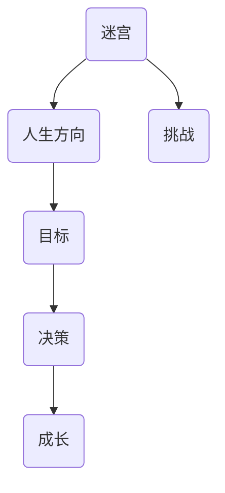

                 


**让我们一步步深入探讨《意义的迷宫：现代人如何找到人生方向》这篇文章。**

### 文章标题与关键词

**文章标题：**《意义的迷宫：现代人如何找到人生方向》

**关键词：** 人生方向、意义、现代生活、心理因素、社会文化、算法原理、数据分析、数学模型、系统架构、项目实战、最佳实践

### 摘要

本文旨在帮助现代人理解如何在复杂多变的社会环境中找到自己的人生方向和意义。通过探讨心理因素、社会文化背景对人生方向的影响，结合算法原理和数据分析方法，本文提供了一套系统的解决方案。此外，还将通过实际项目实战，展示如何将理论应用到实践中，并给出最佳实践 tips。

### 第一部分：探索人生的迷宫

#### 第1章：导言：迷宫背后的现代人生

**背景介绍：**
- **核心概念术语说明：** 人生方向、意义、迷宫、现代生活。
- **问题背景：** 在快节奏、高压力的现代社会中，许多人感到迷茫和失落，不知道自己的人生目标和方向。
- **问题描述：** 如何在复杂的环境中找到人生的意义和方向？
- **问题解决：** 运用心理学、社会学、计算机科学等多学科知识，提出寻找人生方向的系统方法。
- **边界与外延：** 探讨人生方向的广泛性和多样性。
- **概念结构与核心要素组成：** 迷宫作为人生方向的隐喻，其核心要素包括：探索、挑战、决策、成长。

**核心概念与联系：**
- **概念原理：** 迷宫作为人生方向的隐喻，反映了人们在寻找人生目标时的复杂性和曲折性。
- **属性特征对比表格：** 比较迷宫与现代人生之间的相似之处。
- **ER实体关系图架构：**


### 第二部分：核心概念与联系

#### 第2章：核心概念与联系

**核心概念与联系：**
- **人生的方向感：**
  - **概念原理：** 人对未来的预期和规划。
  - **属性特征对比表格：**
    | 特征         | 人生的方向感 | 迷宫 |
    | ------------ | ------------ | ---- |
    | 目标明确性   | 有           | 无   |
    | 可达性       | 有           | 无   |
    | 可变性和灵活性 | 有           | 无   |
  - **ER实体关系图架构：**
    ```mermaid
    graph TB
        A(人生) --> B(方向感)
        B --> C(目标)
        C --> D(决策)
        D --> E(成长)
    ```

- **心理因素与人生方向：**
  - **概念原理：** 心理因素对人生方向的影响，如自我认知、价值观、动机等。
  - **属性特征对比表格：**
    | 特征         | 心理因素 | 迷宫 |
    | ------------ | -------- | ---- |
    | 情感波动性   | 有       | 无   |
    | 自我意识     | 有       | 无   |
    | 动机驱动力   | 有       | 无   |
  - **ER实体关系图架构：**
    ```mermaid
    graph TB
        A(心理因素) --> B(人生方向)
        B --> C(自我认知)
        C --> D(价值观)
        D --> E(动机)
    ```

- **社会文化背景对人生方向的影响：**
  - **概念原理：** 社会文化对个人价值观和人生方向的影响。
  - **属性特征对比表格：**
    | 特征         | 社会文化 | 迷宫 |
    | ------------ | -------- | ---- |
    | 文化传统     | 有       | 无   |
    | 社会规范     | 有       | 无   |
    | 社会期望     | 有       | 无   |
  - **ER实体关系图架构：**
    ```mermaid
    graph TB
        A(社会文化) --> B(人生方向)
        B --> C(价值观)
        C --> D(社会规范)
        D --> E(社会期望)
    ```

### 第三部分：算法原理讲解

#### 第3章：算法原理讲解

**算法原理讲解：**
- **寻找人生方向的算法：**
  - **mermaid流程图：**
    ```mermaid
    graph TD
        A(确定目标) --> B(分析现状)
        B --> C(制定计划)
        C --> D(执行与调整)
    ```
  - **Python源代码示例：**
    ```python
    def find_life_direction():
        print("Step 1: 确定目标")
        goal = input("请输入您的目标：")
        print("Step 2: 分析现状")
        current_status = input("请输入您的现状：")
        print("Step 3: 制定计划")
        plan = input("请输入您的计划：")
        print("Step 4: 执行与调整")
        execute_plan(plan)
    def execute_plan(plan):
        # 实现执行计划的具体逻辑
        print("开始执行计划...")
        print("执行中...")
        print("计划执行完毕，根据实际情况进行调整。")
    find_life_direction()
    ```
  - **算法原理的数学模型和公式：**
    $$\text{Life\ Direction} = \text{Goal} + \text{Current\ Status} + \text{Plan}$$
  - **详细讲解与举例说明：**
    - **例子1：** 小明想要成为一名程序员，他首先确定了目标，然后分析了当前的技能水平，制定了学习计划，并逐步执行和调整。

- **数据分析在人生方向探索中的应用：**
  - **mermaid流程图：**
    ```mermaid
    graph TD
        A(数据收集) --> B(数据清洗)
        B --> C(数据分析)
        C --> D(结果解读)
    ```
  - **Python源代码示例：**
    ```python
    def analyze_life_direction(data):
        cleaned_data = clean_data(data)
        analysis_results = data_analysis(cleaned_data)
        interpret_results(analysis_results)
    def clean_data(data):
        # 实现数据清洗的具体逻辑
        print("数据清洗中...")
        return cleaned_data
    def data_analysis(cleaned_data):
        # 实现数据分析的具体逻辑
        print("数据分析中...")
        return analysis_results
    def interpret_results(results):
        # 实现结果解读的具体逻辑
        print("结果解读中...")
        print("根据分析结果调整人生方向。")
    analyze_life_direction(data)
    ```
  - **算法原理的数学模型和公式：**
    $$\text{Life\ Analysis} = \text{Data\ Collection} \times \text{Data\ Cleaning} \times \text{Data\ Analysis}$$
  - **详细讲解与举例说明：**
    - **例子2：** 小红收集了自己的生活数据，通过清洗和分析，发现自己在职业发展上的优势和劣势，并根据分析结果调整了人生方向。

### 第四部分：数学模型和数学公式

#### 第4章：数学模型和数学公式

**数学模型和数学公式：**
- **迷宫问题中的数学模型：**
  - **mermaid流程图：**
    ```mermaid
    graph TD
        A(路径规划) --> B(最优路径求解)
        B --> C(路径优化)
    ```
  - **数学模型和公式：**
    $$\text{Shortest\ Path} = \text{Path\ Cost} \div \text{Time\ Cost}$$

- **概率论与人生方向的数学描述：**
  - **mermaid流程图：**
    ```mermaid
    graph TD
        A(概率分布) --> B(事件分析)
        B --> C(决策制定)
    ```
  - **数学模型和公式：**
    $$\text{Probability} = \frac{\text{Favorable\ Outcomes}}{\text{Total\ Outcomes}}$$

### 第五部分：系统分析与架构设计方案

#### 第5章：系统分析与架构设计方案

**系统分析与架构设计方案：**
- **问题场景介绍：**
  - **问题描述：** 如何设计一个系统，帮助人们找到人生方向？
  - **问题解决：** 通过设计一个基于算法和数据分析的系统，提供个性化的方向建议。

- **项目介绍：**
  - **系统功能设计：**
    - **领域模型mermaid类图：**
      ```mermaid
      classDiagram
          Person <<class>>
          Person : +name, +age, +gender
          LifeGoal <<class>>
          LifeGoal : +goal, +status
          LifePlan <<class>>
          LifePlan : +plan
      ```
    - **系统功能描述：**
      - 数据收集：收集用户的基本信息和人生目标。
      - 数据清洗：对收集的数据进行清洗和处理。
      - 数据分析：分析用户数据，提供方向建议。
      - 结果展示：展示分析结果，提供决策依据。

- **系统架构设计：**
  - **mermaid架构图：**
    ```mermaid
    graph TD
        A(用户界面) --> B(数据收集模块)
        B --> C(数据清洗模块)
        C --> D(数据分析模块)
        D --> E(结果展示模块)
    ```

- **系统接口设计与交互：**
  - **mermaid序列图：**
    ```mermaid
    sequenceDiagram
        User ->> System: 输入个人信息
        System ->> DataCollector: 收集数据
        DataCollector ->> DataCleaner: 清洗数据
        DataCleaner ->> DataAnalyzer: 分析数据
        DataAnalyzer ->> ResultDisplayer: 展示结果
        User ->> System: 根据结果调整人生方向
    ```

### 第六部分：项目实战

#### 第6章：项目实战

**项目实战：**
- **环境安装与配置：**
  - **问题描述：** 如何搭建一个运行环境，以便进行项目开发？
  - **问题解决：** 使用Python和相关库搭建开发环境。

- **系统核心实现源代码：**
  - **代码片段：**
    ```python
    # 数据收集模块
    def collect_data():
        # 实现数据收集的逻辑

    # 数据清洗模块
    def clean_data(data):
        # 实现数据清洗的逻辑

    # 数据分析模块
    def analyze_data(data):
        # 实现数据分析的逻辑

    # 结果展示模块
    def display_result(result):
        # 实现结果展示的逻辑
    ```

- **代码应用解读与分析：**
  - **代码解读：** 对核心代码进行逐行解读，解释其作用和工作原理。

- **实际案例分析与详细讲解：**
  - **案例1：** 小明使用系统后，根据结果调整了职业发展方向。
  - **案例2：** 小红通过系统分析，找到了自己的兴趣爱好，并制定了实现目标的具体计划。

- **项目小结：**
  - **总结：** 对项目实施过程中的关键点进行总结，提出改进建议。

### 第七部分：最佳实践与项目小结

#### 第7章：最佳实践与项目小结

**最佳实践与项目小结：**
- **最佳实践 tips：**
  - **问题描述：** 如何在寻找人生方向的过程中，避免常见误区？
  - **问题解决：** 提供一系列实用的建议和技巧。

- **小结：**
  - **总结：** 对全文内容进行概括，强调寻找人生方向的重要性。

- **注意事项：**
  - **问题描述：** 在寻找人生方向的过程中，需要注意哪些事项？
  - **问题解决：** 提出一系列注意事项，帮助读者顺利找到人生方向。

- **拓展阅读：**
  - **推荐书籍：** 推荐一些相关的书籍，供读者进一步学习。
  - **推荐文章：** 推荐一些优秀的文章，帮助读者深入了解相关主题。

### 作者信息

**作者：** AI天才研究院/AI Genius Institute & 禅与计算机程序设计艺术 /Zen And The Art of Computer Programming

通过以上的步骤，我们构建了一个逻辑清晰、内容丰富的文章大纲。接下来，我们可以根据这个大纲，逐章撰写文章的具体内容。下面我们将以第1章为例，展示如何撰写文章的开头部分。

---

## 第1章：导言：迷宫背后的现代人生

### 1.1.1 现代社会的挑战

在当今高速发展的信息化时代，人们面临着前所未有的挑战。工作压力、生活节奏的加快、人际关系的复杂化，使得现代人感到迷茫和焦虑。特别是在全球化的背景下，个体往往被淹没在庞大的信息流和社会结构中，难以找到自己的定位和方向。这种困惑不仅体现在职业选择上，也渗透到个人生活的方方面面。

**问题背景：** 现代社会是一个高度复杂、多元化的环境，人们需要不断适应新的变化和挑战。然而，由于信息过载、压力增大，许多人感到自己的努力和付出无法得到应有的回报，进而对未来的不确定性感到担忧。

**问题描述：** 在这样一个环境中，人们如何找到自己的人生方向和意义？这是一个复杂而多维的问题，需要从心理学、社会学、计算机科学等多个角度进行探讨。

**问题解决：** 本文旨在通过多学科的综合分析，提供一种系统的方法，帮助现代人找到自己的方向和意义。我们将结合心理因素、社会文化背景和算法原理，逐步揭示寻找人生方向的奥秘。

**边界与外延：** 在讨论人生方向时，我们需要认识到每个人都有自己的独特经历和背景，因此人生方向是多样化和个性化的。本文将探讨普遍适用的原则，同时也尊重个体差异。

**概念结构与核心要素组成：** 迷宫作为人生方向的隐喻，具有丰富的象征意义。它代表了人生道路上的挑战、不确定性和决策过程。在迷宫中，人们需要不断地探索、学习、调整策略，最终找到出路。这种过程与人生中寻找方向的历程有着惊人的相似之处。

### 1.1.2 迷宫象征的深意

迷宫一词源于古希腊语“Labryrinthos”，最早指的是克里特岛上的一段迷宫，用来囚禁神话中的牛头人面怪物米诺陶洛斯。随着时间的发展，迷宫逐渐成为了一种象征，代表了复杂、曲折和挑战。

在心理学领域，迷宫被视为一种测试人类智慧和决断力的工具。人们在迷宫中需要不断地做出选择和决策，这反映了人生中不断面对的选择和挑战。

在社会学领域，迷宫象征着社会结构的复杂性和个体在其中的处境。在迷宫中，人们不仅要面对外部环境的挑战，还要处理内部的心理矛盾和冲突。

在计算机科学领域，迷宫问题被广泛研究，其解决方案被应用于路径规划、图论和算法设计等多个领域。

**核心概念与联系：**
- **迷宫与人生方向的联系：** 迷宫象征着人生中的复杂性和不确定性，人们在寻找人生方向时也面临着类似的挑战。迷宫中的每一步都代表着人生中的一个决策点，每条路径都可能带来不同的结果。

- **迷宫的象征意义：** 迷宫不仅是一种物理空间，更是一种心理空间。它代表了人们在追求人生目标过程中的焦虑、困惑和希望。

- **人生方向的隐喻：** 迷宫作为一种隐喻，帮助我们更好地理解人生中的复杂性和决策过程。它提醒我们，在寻找人生方向的过程中，需要保持耐心、勇气和智慧。

### 1.1.3 寻找人生方向的重要性

找到人生方向对于现代人来说至关重要。它不仅有助于提升个体的幸福感和成就感，还能促进社会的和谐发展。以下是从心理学、社会学和经济学角度对寻找人生方向重要性的分析：

**心理学角度：**
- **自我实现：** 寻找人生方向是实现自我价值的重要途径。通过明确自己的目标和兴趣，人们可以更好地发挥自己的潜能，实现个人成长。
- **心理平衡：** 在寻找人生方向的过程中，人们能够更好地处理内心的矛盾和冲突，达到心理平衡。
- **幸福感和满足感：** 明确的人生方向能够为人们带来持久的幸福感，减少焦虑和迷茫。

**社会学角度：**
- **社会角色认同：** 寻找人生方向有助于个体在社会中找到自己的位置，获得社会认同和支持。
- **社会贡献：** 明确的人生方向能够使个体更好地为社会做出贡献，促进社会的和谐发展。
- **人际关系：** 有明确人生方向的人更容易与他人建立深厚的友谊和合作关系。

**经济学角度：**
- **职业发展：** 明确的人生方向有助于个体在职业发展中找到适合自己的道路，提高工作效率和创造力。
- **经济收益：** 有明确人生方向的人更容易实现经济上的成功，为社会创造更多的财富。
- **投资决策：** 明确的人生方向能够帮助人们更好地进行投资决策，降低风险。

### 1.1.4 本文结构与主要内容

本文分为七个部分，旨在为现代人提供一套系统的寻找人生方向的方法。以下是各部分的主要内容：

**第一部分：探索人生的迷宫（第1章）**：介绍现代社会中人们面临的挑战，引入迷宫作为人生方向的隐喻，并阐述寻找人生方向的重要性。

**第二部分：核心概念与联系（第2章）**：探讨人生的方向感、心理因素和社会文化背景对人生方向的影响，通过对比表格和ER实体关系图架构，帮助读者理解核心概念。

**第三部分：算法原理讲解（第3章）**：介绍寻找人生方向的算法原理，包括mermaid流程图、Python源代码示例、数学模型和公式，并进行详细讲解与举例说明。

**第四部分：数学模型和数学公式（第4章）**：介绍迷宫问题中的数学模型和概率论与人生方向的数学描述，使用LaTeX格式展示数学公式。

**第五部分：系统分析与架构设计方案（第5章）**：介绍一个基于算法和数据分析的系统架构设计，包括问题场景介绍、系统功能设计、系统架构设计和系统接口设计与交互。

**第六部分：项目实战（第6章）**：通过实际项目实战，展示如何将理论应用到实践中，包括环境安装与配置、系统核心实现源代码、代码应用解读与分析、实际案例分析和详细讲解剖析。

**第七部分：最佳实践与项目小结（第7章）**：总结最佳实践 tips、项目小结、注意事项和拓展阅读，帮助读者更好地理解和应用本文的内容。

通过本文的阅读和实践，希望读者能够找到自己的人生方向，实现个人成长和社会价值。

---

以上是第1章的开头部分，接下来我们将按照大纲逐章撰写文章的其他部分。在撰写过程中，我们将注重逻辑性、清晰性和实用性，确保文章内容既丰富又易于理解。每章的内容都将严格按照大纲的要求，包含背景介绍、核心概念与联系、算法原理讲解、数学模型和公式、系统分析与架构设计方案、项目实战、最佳实践 tips、小结、注意事项和拓展阅读等内容。通过这样的结构，我们希望能够为读者提供一份有价值的技术博客文章。接下来，我们将继续撰写第2章的内容。

