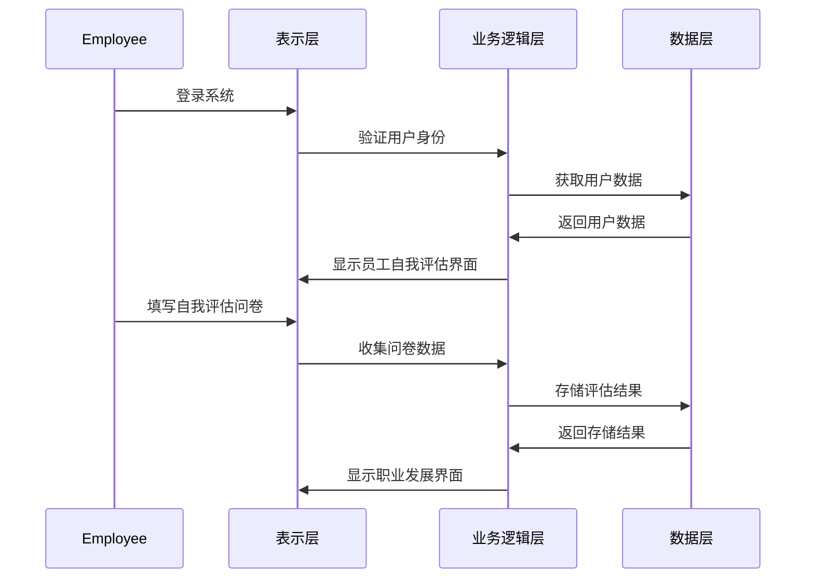
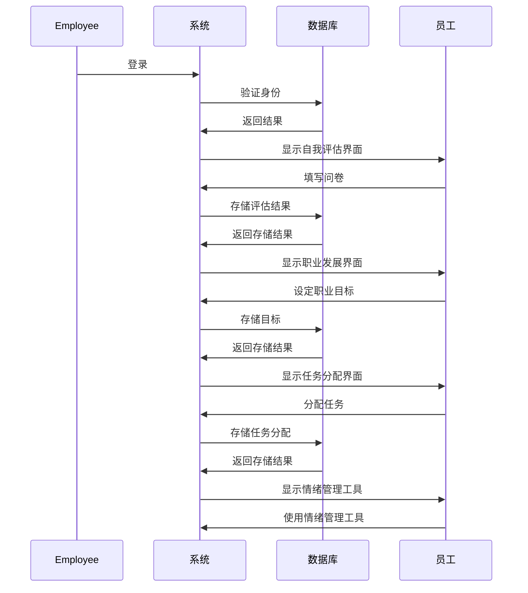

                 

### 第1章：意义设计与人生目标的概述

#### 1.1 问题背景

在当今快速变化的世界中，每个人都在寻找自己的人生目标和意义。对于很多人来说，这不仅仅是一个抽象的概念，而是一个迫切需要解决的实际问题。在这个充满不确定性和复杂性的时代，如何找到并实现自己的目标和意义，成为了许多人面临的挑战。意义设计作为一种新兴的领域，旨在帮助人们理解自己的内在需求，明确目标，并实现个人的全面发展。

#### 1.2 问题描述

随着社会的发展和个人的成长，人们面临着诸多问题和挑战。这些问题包括：如何理解自己的内心需求，如何设定具体明确的目标，如何克服实现目标过程中的困难和障碍，以及如何在忙碌的生活中找到人生的意义。这些问题不仅仅是个人层面的，也与社会整体的幸福感和发展息息相关。

#### 1.3 问题解决

意义设计的出现，为解决这些问题提供了一种全新的思路和方法。意义设计强调的是通过系统的方法和工具，帮助人们深入了解自己的内心需求，明确目标，制定行动计划，并最终实现人生的意义。它不仅仅是一种理论，更是一种实践，一种可以帮助人们实现人生价值的实用工具。

#### 1.4 边界与外延

意义设计的边界涉及多个领域，包括心理学、哲学、社会学和设计学等。其外延则延伸到个人生活的方方面面，从职业规划到家庭生活，从社会参与到自我成长。意义设计不仅仅是关于如何设定目标和实现目标，更是关于如何理解人生，如何找到属于自己的意义和价值。

#### 1.5 概念结构与核心要素组成

意义设计的概念结构可以分为以下几个核心要素：

1. **自我认知**：理解自己的价值观、兴趣和优势，是意义设计的起点。
2. **目标设定**：明确的目标是意义实现的基石，目标设定需要遵循SMART原则。
3. **行动计划**：具体的行动计划是实现目标的保障，需要考虑可行性、资源和时间。
4. **执行力**：执行力是目标实现的动力，需要通过策略和方法来提升。
5. **动机与持久力**：内在动机和持久力是坚持目标、克服困难的关键。
6. **人际沟通与协作**：良好的沟通和协作能力有助于目标的实现，也是个人成长的重要方面。
7. **情绪管理**：情绪管理有助于保持心理健康，是长期坚持目标的重要保障。

#### 1.6 本章小结

意义设计作为一种新兴的领域，旨在帮助人们解决人生目标设定的实际问题。通过理解自我、设定明确的目标、制定可行的行动计划、提升执行力、保持内在动机和持久力，以及加强人际沟通与情绪管理，意义设计为人们实现人生目标和价值提供了全面的指导。在接下来的章节中，我们将深入探讨意义设计的各个核心要素，帮助读者更好地理解并应用这一方法论。

---

## 第2章：人生目标规划的基本概念

#### 2.1 定义

人生目标规划是指通过系统的方法和步骤，帮助个人明确自己的长期和短期目标，并为实现这些目标制定详细的计划。它不仅涉及职业发展，还包括个人成长、健康、家庭、财务等多个方面。人生目标规划的目的是帮助个人在复杂多变的环境中找到方向，明确目标，从而实现个人的全面发展。

#### 2.2 人生目标的重要性

人生目标的重要性不言而喻。首先，它为个人的生活提供了方向和动力。明确的目标能够帮助个人集中精力，专注于实现这些目标，从而提升效率和生活质量。其次，人生目标可以带来满足感和成就感。当个人实现自己的目标时，会产生强烈的满足感，这种满足感能够增强个人的自信心和幸福感。此外，人生目标还能够帮助个人更好地应对生活中的挑战和不确定性，通过有计划地应对问题，减少焦虑和压力。

#### 2.3 人生目标的层次结构

人生目标可以划分为多个层次，包括：

1. **终极目标**：这是个人长期的、终身的目标，通常与个人的价值观和使命相关，如“成为一名优秀的科学家”、“为社会做出贡献”等。
2. **长期目标**：这些目标通常在5到10年内实现，与个人的职业发展和生活规划相关，如“在30岁前获得博士学位”、“在10年内实现财务自由”等。
3. **中期目标**：这些目标通常在1到3年内实现，是长期目标的分解，如“每年提升10%的职业技能”、“每年储蓄10万元”等。
4. **短期目标**：这些目标通常在1年内实现，是中期目标的进一步分解，如“每天阅读2小时专业书籍”、“每月拜访3位行业内的专家”等。

#### 2.4 核心概念与联系

在人生目标规划中，几个核心概念之间存在着密切的联系：

1. **自我认知**：这是人生目标规划的基础。只有深入了解自己的价值观、兴趣和优势，才能设定符合自身特点的目标。
2. **目标设定**：明确的目标是规划的核心。目标需要具体、可衡量、可实现，即符合SMART原则。
3. **行动计划**：行动计划是将目标转化为具体行动的步骤。它需要详细、可执行，包括时间、资源和责任分配。
4. **执行力**：执行力是实现目标的保障。它需要个人具备坚定的决心、合理的策略和良好的时间管理能力。
5. **反馈与调整**：通过持续的反馈和调整，个人可以不断优化目标和行动计划，确保目标的实现。

### 表格：人生目标规划的核心概念及其联系

| 核心概念 | 描述 | 相互关系 |
| --- | --- | --- |
| 自我认知 | 了解自己的价值观、兴趣和优势 | 基础，决定目标设定的方向 |
| 目标设定 | 设定具体、可衡量、可实现的目标 | 核心，连接自我认知与行动计划 |
| 行动计划 | 制定详细、可执行的行动步骤 | 实现，连接目标设定与执行力 |
| 执行力 | 实现目标的动力和能力 | 关键，连接目标设定与反馈调整 |
| 反馈与调整 | 通过反馈不断优化目标和行动计划 | 支持，确保目标的实现 |

### 图1：人生目标规划的ER实体关系图

```mermaid
erDiagram
    AIRECTION <<<--|{ Bself-cognition }|>>> Cgoal-设置
    Cgoal-设置 <<>> Eexecute-force
    Eexecute-force ---|{ Ffeedback-adjust }|>>> Cgoal-设置
```

#### 2.5 本章小结

人生目标规划是一个系统化的过程，它不仅涉及明确目标和制定行动计划，还需要深入了解自我、提升执行力和不断调整目标。通过本章的学习，读者可以理解人生目标规划的基本概念和层次结构，以及核心概念之间的联系。在接下来的章节中，我们将进一步探讨如何进行自我认知、设定目标、制定行动计划，以及提升执行力，帮助读者掌握意义设计的实用技能。

---

## 第3章：意义探索与自我认知

#### 3.1 意义探索的意义

意义探索是人生目标规划的核心环节之一，它关乎个人发展的深度和广度。意义探索不仅仅是对“我为何而活”这一哲学问题的思考，更是对个人内在动机、价值观和使命的深入挖掘。意义探索的意义在于帮助个体找到生活的方向和动力，使个人在追求目标的过程中获得持久的内在满足感和幸福感。

#### 3.2 自我认知的重要性

自我认知是意义探索的基础，它包括对自身的价值观、兴趣、能力和性格的认知。自我认知的重要性体现在以下几个方面：

1. **目标设定的准确性**：只有深入了解自己，才能设定符合自身特点的目标，这些目标更有可能实现，并带来持久的成就感。
2. **职业发展的方向**：了解自己的兴趣和优势，可以帮助个人在职业选择和发展中找到最适合自己的路径，从而提高职业满意度和工作效率。
3. **人际关系的管理**：自我认知有助于理解自己的行为模式和他人的需求，从而改善人际关系，建立更加和谐的社会网络。

#### 3.3 探索意义的方法

探索意义的方法多种多样，以下是几种常用的方法：

1. **内省**：通过冥想、写日记和反思，深入思考自己的内心世界，了解自己的真实想法和感受。
2. **咨询**：寻求专业的心理咨询师或职业规划师的指导，借助他们的经验和专业知识，帮助自己更好地了解自己。
3. **实验**：通过尝试不同的事物和角色，探索自己的兴趣和潜在优势，找到真正适合自己的领域。
4. **反思**：定期回顾自己的行为和成就，分析自己的成功和失败，从中汲取经验教训，调整自己的认知和行动计划。

#### 3.4 自我认知的工具

在自我认知过程中，可以使用以下工具来帮助深入理解自己：

1. **性格测试**：如MBTI（迈尔斯-布里格斯性格类型指标）、DISC测试等，可以帮助了解个人的性格特点和优势。
2. **价值观排序**：通过列出自己认为最重要的价值观，并对其进行排序，可以更好地理解自己的核心价值观和内在动机。
3. **优势识别**：通过评估个人的优势，如盖洛普优势识别器，可以帮助了解自己在哪些方面有突出的表现。
4. **职业兴趣测试**：如霍兰德职业兴趣量表，可以帮助了解个人对不同职业的兴趣和适应性。

### 表格：自我认知的核心工具与技巧

| 工具/技巧 | 描述 | 优点 |
| --- | --- | --- |
| 内省 | 通过冥想、写日记和反思，深入思考自己的内心世界 | 帮助理解内心想法和感受 |
| 咨询 | 借助专业人士的经验和专业知识，帮助更好地了解自己 | 提供专业见解和指导 |
| 实验 | 通过尝试不同的事物和角色，探索自己的兴趣和潜在优势 | 发现新的兴趣和优势 |
| 反思 | 定期回顾自己的行为和成就，从中汲取经验教训 | 帮助调整认知和行动计划 |
| 性格测试 | 了解个人的性格特点和优势 | 提供具体的性格描述 |
| 价值观排序 | 列出并排序自己的价值观，理解核心价值观 | 明确内在动机 |
| 优势识别 | 评估个人的优势，发现突出的表现 | 提供优势清单 |
| 职业兴趣测试 | 了解个人对不同职业的兴趣和适应性 | 提供职业方向建议 |

#### 3.5 案例分析

假设小王是一名大学毕业生，他在选择职业时感到迷茫。他决定通过自我认知的方法来找到自己的方向。首先，他通过性格测试了解到自己属于内向型思考者，喜欢有组织和系统性的工作。接着，他通过价值观排序发现，对他来说，最重要的价值观是“个人成长”和“家庭和谐”。然后，他利用职业兴趣测试了解到自己对科技和创新领域有浓厚的兴趣。最后，他通过内省和咨询，了解到自己希望在职业中能够有长远的发展，同时希望能够兼顾家庭。基于这些自我认知的结果，小王决定进入软件开发行业，并选择了一家具有成长潜力的公司。

#### 3.6 本章小结

意义探索与自我认知是人生目标规划的重要环节，它关乎个人的内在动力和目标的设定。通过内省、咨询、实验和反思等方法，个人可以更深入地了解自己的价值观、兴趣和优势，从而设定符合自身特点的目标。在接下来的章节中，我们将进一步探讨如何设定明确的目标，并制定实现这些目标的行动计划。

---

### 第4章：目标设定的原则与方法

#### 4.1 目标设定的基本原则

在人生目标规划中，目标设定的准确性直接影响目标的实现效果。以下是一些目标设定的基本原则：

1. **具体性（Specific）**：目标应该具体明确，而非模糊抽象。例如，“提高技能”不如“学习Python编程语言”具体。
2. **可衡量性（Measurable）**：目标应该能够衡量进展和结果，例如，“增加收入”不如“在六个月内收入提高20%”具体。
3. **可实现性（Achievable）**：目标应该既有挑战性，又要在个人能力和资源范围内实现。例如，“在一年内成为公司总裁”可能过于理想化。
4. **相关性（Relevant）**：目标应该与个人的长期愿景和价值观相关。例如，“减肥20公斤”与“提升职业形象”是相关的。
5. **时限性（Time-bound）**：目标应该有明确的时间限制。例如，“提高技能”不如“在三个月内完成Python课程学习”具体。

SMART原则为目标的设定提供了明确的标准，确保目标具有实际操作的可行性，并能够被有效追踪和评估。

#### 4.2 SMART目标设定法

SMART目标设定法是一种广泛使用的目标管理工具，通过上述五项原则，确保目标设定更加科学和有效。以下是一个应用SMART原则设定目标的示例：

**目标：提高专业技能**

- **具体性**：学习数据分析技能
- **可衡量性**：完成Python数据分析课程并通过认证考试
- **可实现性**：有充足的时间、经济和资源支持
- **相关性**：与职业发展规划和兴趣相关
- **时限性**：在六个月内完成

通过这样的目标设定，个人可以更加清晰地了解自己的任务，并能够制定具体的行动计划。

#### 4.3 目标设定的步骤

为了确保目标设定的科学性和有效性，可以遵循以下步骤：

1. **自我评估**：了解自己的价值观、兴趣、优势和短板，确保目标与个人特点相符。
2. **目标选择**：根据自我评估结果，选择与个人长期愿景和价值观相关的目标。
3. **目标细化**：将大目标分解为具体、可衡量的小目标，使每个目标都有明确的标准。
4. **制定行动计划**：为每个目标制定具体的行动计划，包括时间、资源、责任分配等。
5. **设定时限**：为每个目标设定明确的时间限制，以确保目标的按时完成。

#### 4.4 目标设定的案例分析

以张女士的职业生涯规划为例：

**目标：五年内晋升为项目经理**

1. **自我评估**：张女士了解自己的优点是沟通能力强、对项目管理有浓厚兴趣，但也意识到需要提升技术知识和团队合作能力。
2. **目标选择**：选择“五年内晋升为项目经理”作为职业目标。
3. **目标细化**：将大目标分解为多个小目标：
   - 第一年：通过在线课程提升项目管理知识。
   - 第二年：积累至少两年项目管理经验。
   - 第三年：参与至少一个大型项目，担任关键角色。
   - 第四年：通过PMP认证考试。
   - 第五年：成功晋升为项目经理。
4. **制定行动计划**：为每个小目标制定具体的行动计划，包括学习资源、工作时间安排、导师指导等。
5. **设定时限**：为每个小目标设定具体的时间限制，确保按计划进行。

通过这样的目标设定和行动计划，张女士能够清晰地了解自己的职业发展路径，并在实现过程中不断调整和优化。

### 表格：目标设定的常见问题与解决方案

| 常见问题 | 描述 | 解决方案 |
| --- | --- | --- |
| 目标过于宽泛 | 缺乏具体的执行方向 | 将目标细化，使其具体、可衡量 |
| 目标难度过大 | 可能导致挫败感 | 确保目标既有挑战性，又在个人能力范围内 |
| 缺乏行动计划 | 目标难以实现 | 制定详细的行动计划，包括时间、资源和责任 |
| 缺乏时限性 | 目标实现时间不确定 | 为每个目标设定明确的时间限制 |
| 目标与个人价值观不符 | 可能导致不满意度 | 确保目标与个人价值观和长期愿景相符 |

#### 4.5 本章小结

目标设定是人生目标规划的核心环节，遵循SMART原则和科学步骤，能够确保目标的明确性和可操作性。通过具体、可衡量、可实现、相关和时限性的目标设定，个人可以更好地规划自己的发展路径，并在实现过程中不断调整和优化。在接下来的章节中，我们将探讨如何制定和执行具体的行动计划，以及如何提升执行力和内在动机。

---

### 第5章：行动计划与执行力培养

#### 5.1 行动计划的制定

行动计划是将目标转化为具体行动的步骤，是实现目标的关键。一个有效的行动计划应该包括以下几个要素：

1. **明确的目标**：行动计划应该基于明确的目标，确保每个行动都是为了实现某个特定的目标。
2. **具体的任务**：将目标分解为一系列具体的任务，每个任务都应该清晰、明确，易于执行。
3. **时间安排**：为每个任务设定具体的时间安排，包括开始时间和完成时间，以确保任务的按时完成。
4. **资源需求**：列出完成任务所需的资源，包括人力、物力和时间，确保资源的充分准备。
5. **责任分配**：明确每个任务的责任人，确保任务分工明确，责任到人。

以下是一个简单的行动计划模板：

**行动计划：提升Python编程技能**

1. **目标**：在六个月内掌握Python编程语言的基本技能。
2. **任务**：
   - 第一个月：学习Python基础语法和常用数据结构。
   - 第二个月：完成Python编程练习，巩固基础知识。
   - 第三个月：学习Python的高级特性，如面向对象编程。
   - 第四个月：开始进行实际项目开发，如开发一个小型应用。
   - 第五个月：优化和改进项目，学习代码调试和性能优化。
   - 第六个月：进行项目演示和评估，总结学习经验。
3. **时间安排**：每个月底完成对应的任务。
4. **资源需求**：在线课程资源、编程练习题库、开发工具。
5. **责任分配**：自己负责整个行动计划，每月底进行自我评估和总结。

#### 5.2 执行力的定义与重要性

执行力是指个体在实现目标过程中，按照计划完成任务的坚定决心和实际能力。执行力的重要性体现在以下几个方面：

1. **实现目标的保障**：没有执行力，再好的目标也难以实现。执行力是目标从蓝图转化为现实的桥梁。
2. **提高效率**：具备良好执行力的个人能够高效地完成任务，减少时间浪费，提升工作效率。
3. **增强自信心**：通过成功的执行，个人会逐渐增强自信心，从而在更大挑战面前也能保持积极态度。
4. **建立信誉**：执行力强的人更容易获得他人的信任和认可，有助于建立良好的社会关系。

#### 5.3 提高执行力的策略

以下是一些提高执行力的策略：

1. **设定明确的目标**：明确的目标有助于减少迷茫和犹豫，提高行动的针对性。
2. **分解任务**：将大任务分解为小任务，逐步完成，避免因任务过于庞大而产生压力。
3. **制定详细的计划**：制定详细的行动计划，包括时间、资源和责任分配，确保每个步骤都有具体执行方案。
4. **坚持自我监督**：定期检查自己的进度，与计划进行对比，及时发现问题并进行调整。
5. **保持积极心态**：保持积极乐观的态度，面对困难和挑战时，能够以更坚定的信念继续前进。
6. **培养自律习惯**：通过自我约束和纪律，培养按时完成任务的习惯。
7. **寻求支持**：在执行过程中，如果遇到困难，可以寻求他人的支持和帮助。

#### 5.4 持续改进与反馈循环

执行力的提升是一个持续的过程，需要通过不断的实践和反馈来进行改进。以下是一些持续改进和反馈循环的方法：

1. **定期回顾**：定期回顾自己的执行过程，总结经验和教训，找出改进点。
2. **设立里程碑**：在每个执行阶段设立里程碑，对完成的任务进行评估和反馈。
3. **自我评估**：定期进行自我评估，评估自己的执行效果和效率。
4. **接受他人反馈**：邀请他人对自己的执行过程进行评价，接受他们的意见和建议。
5. **调整计划**：根据反馈和评估结果，及时调整计划和行动策略。

### 表格：提高执行力的小技巧

| 小技巧 | 描述 | 优点 |
| --- | --- | --- |
| 设定明确的目标 | 减少迷茫，提高针对性 | 提高执行效率 |
| 分解任务 | 避免压力过大，逐步完成 | 提高完成率 |
| 制定详细的计划 | 明确每一步行动 | 提高执行力 |
| 坚持自我监督 | 及时发现问题 | 确保任务按时完成 |
| 保持积极心态 | 增强面对困难的信心 | 提高自我调节能力 |
| 培养自律习惯 | 养成按时完成任务的习惯 | 提高长期执行力 |
| 寻求支持 | 克服困难，提升效率 | 提高成功率 |
| 定期回顾 | 总结经验教训 | 提升执行力 |
| 设立里程碑 | 评估进度，明确方向 | 提高任务完成率 |

#### 5.5 案例分析

假设李先生是一名销售人员，他的年度目标是完成100万元的销售额。为了实现这一目标，他制定了以下行动计划：

1. **明确的目标**：完成100万元的销售额。
2. **任务分解**：
   - 每月访问10个新客户。
   - 每周与5个现有客户进行沟通。
   - 每周撰写一篇市场分析报告。
3. **时间安排**：每月底总结上月的工作，制定下月的工作计划。
4. **资源需求**：与公司市场部门合作，获取客户信息和支持。
5. **责任分配**：自己负责整体计划的执行，市场部门提供客户信息和市场分析报告。

在执行过程中，李先生通过以下方式提升执行力：

- **坚持自我监督**：每天记录工作进展，每周与领导汇报工作情况。
- **保持积极心态**：面对客户拒绝时，保持乐观和积极的态度，寻求解决方案。
- **寻求支持**：与市场部门保持紧密沟通，获取市场动态和销售策略。
- **定期回顾和调整**：每月底进行自我评估，分析成功和失败的原因，调整下月的工作计划。

通过这些方法，李先生最终实现了年度目标，并获得了公司的表彰。

#### 5.6 本章小结

行动计划和执行力是实现人生目标的重要保障。通过制定详细的行动计划、提高执行力，以及持续改进和反馈，个人可以更加高效地实现目标。在接下来的章节中，我们将探讨动机与持久力的培养，以及人际沟通与协作技巧，帮助个人在实现目标的过程中保持动力和获得支持。

---

### 第6章：动机与持久力提升策略

#### 6.1 动机的概念与作用

动机是指促使个体采取特定行为的内部或外部因素。在人生目标规划中，动机是驱动个人持续努力、克服困难和实现目标的关键力量。动机可以分为内在动机和外在动机：

1. **内在动机**：来源于个人内心的兴趣、价值观和自我实现需求。例如，一个人因为热爱编程而选择学习新技术。
2. **外在动机**：来源于外部环境，如奖励、惩罚和社会认可。例如，一个人因为公司提供的奖金而积极工作。

动机的作用体现在以下几个方面：

- **驱动行为**：动机能够激发个体采取行动，将目标转化为实际行动。
- **维持行为**：动机能够帮助个体在实现目标的过程中保持持续的努力和坚持。
- **适应环境**：动机使个体能够适应外部环境的变化，灵活调整行为策略。

#### 6.2 提升动机的方法

以下是一些提升动机的方法：

1. **明确目标的意义**：理解目标对自己的意义，能够增强内在动机。例如，明确学习编程能够帮助自己实现职业发展的目标。
2. **设定具体的小目标**：将大目标分解为一系列小目标，每完成一个小目标都会带来成就感，从而提升动机。
3. **寻找内在兴趣**：将目标与个人的兴趣和爱好相结合，使任务更具吸引力。例如，将编程与解决实际问题的项目结合。
4. **奖励与认可**：设置奖励和获得他人的认可，可以增强外在动机。例如，完成一个项目后，奖励自己一次假期或者得到同事的赞赏。
5. **环境与资源支持**：营造一个支持性的环境，提供必要的资源和支持，能够增强动机。例如，加入一个学习小组，获取专业导师的指导。

#### 6.3 持久力的培养

持久力是指个体在面对困难和挑战时，能够坚持不懈、保持长期努力的能力。培养持久力需要以下策略：

1. **建立自我效能感**：自我效能感是指个体对自己能够完成任务的信心。通过成功的经验积累和积极的自我暗示，可以增强自我效能感。
2. **培养自律习惯**：通过自我约束和纪律，培养按时完成任务的习惯，从而提高持久力。
3. **寻求社会支持**：与他人分享目标和进展，获取他们的鼓励和支持，可以增强持久力。
4. **设定长期愿景**：明确长期目标，将短期努力与长期愿景相结合，能够帮助个体在困难面前保持坚持。
5. **自我激励**：通过自我激励，如回顾成功的经验和成就，增强对目标的信心和决心。

#### 6.4 持久力提升的技巧

以下是一些提升持久力的技巧：

1. **分阶段设定目标**：将长期目标划分为多个阶段，每个阶段设定一个具体的、可实现的子目标，有助于保持持久力。
2. **定期休息与调整**：在执行过程中，定期休息和调整，避免过度疲劳，有助于保持动力和持久力。
3. **记录进展**：记录自己的进展和成就，定期回顾，有助于增强自信和动力。
4. **保持积极心态**：面对困难和挑战时，保持积极乐观的心态，有助于克服困难，保持持久力。
5. **灵活调整策略**：在执行过程中，根据实际情况灵活调整策略，避免僵化思维，有助于保持持久力。

### 表格：提升动机与持久力的小技巧

| 小技巧 | 描述 | 优点 |
| --- | --- | --- |
| 明确目标的意义 | 增强内在动机 | 提高任务完成率 |
| 设定具体的小目标 | 分解任务，增强成就感 | 提升动机和持久力 |
| 寻找内在兴趣 | 提高任务吸引力 | 增强内在动机 |
| 奖励与认可 | 增强外在动机 | 提升动力和持久力 |
| 环境与资源支持 | 提供必要的支持 | 增强动机和持久力 |
| 建立自我效能感 | 增强自信 | 提升持久力 |
| 培养自律习惯 | 增强纪律性 | 提升持久力 |
| 寻求社会支持 | 获取鼓励和支持 | 增强持久力 |
| 设定长期愿景 | 保持长期动力 | 提升持久力 |
| 自我激励 | 增强信心和决心 | 提升持久力 |
| 分阶段设定目标 | 灵活调整策略 | 提高任务完成率 |
| 定期休息与调整 | 避免过度疲劳 | 保持持久力 |
| 记录进展 | 增强自信 | 提升持久力 |
| 保持积极心态 | 克服困难 | 提升持久力 |
| 灵活调整策略 | 应对变化 | 保持持久力 |

#### 6.5 案例分析

小明是一名大学生，他设定了一个长期目标：在四年内获得计算机科学学士学位。为了实现这一目标，他采取了以下策略：

1. **明确目标的意义**：小明知道学习计算机科学能够帮助他在未来找到一份理想的工作，并实现自己的职业规划。
2. **设定具体的小目标**：他将大目标分解为每个学期的课程目标，并设定了每学期的成绩目标。
3. **寻找内在兴趣**：他对编程和算法设计有浓厚的兴趣，这使得学习过程变得有趣。
4. **奖励与认可**：每当他完成一个学期的目标，他会奖励自己看一场电影或者购买一本新的技术书籍。
5. **环境与资源支持**：他加入了学校的技术俱乐部，并找到了一位教授作为导师，得到了他们的指导和帮助。
6. **培养自律习惯**：他制定了详细的学习计划，并坚持每天按时完成任务。
7. **寻求社会支持**：他经常与同学讨论学习中的问题，从他们的经验和建议中受益。

在执行过程中，小明通过以下方式保持持久力：

- **定期休息与调整**：每学期结束后，他会休息几天，回顾自己的学习进展，调整下一步的计划。
- **记录进展**：他定期记录自己的学习进度和成绩，这帮助他保持动力和信心。
- **保持积极心态**：面对考试和项目的压力，他保持积极乐观的态度，相信自己能够克服困难。
- **灵活调整策略**：在遇到难以理解的概念时，他会寻求额外的学习资源和辅导，确保自己的学习进度不受影响。

通过这些策略，小明成功地在四年内获得了计算机科学学士学位，并进入了一家知名科技公司工作。

#### 6.6 本章小结

动机与持久力是实现人生目标的重要保障。通过明确目标的意义、设定具体的小目标、寻找内在兴趣、奖励与认可、环境与资源支持、培养自律习惯、寻求社会支持、定期休息与调整、记录进展、保持积极心态和灵活调整策略，个人可以提升动机和持久力，从而更加高效地实现目标。在接下来的章节中，我们将探讨人际沟通与协作技巧，帮助个人在实现目标的过程中更好地与他人合作。

---

### 第7章：人际沟通与协作技巧

#### 7.1 沟通的重要性

人际沟通是人与人之间传递信息、思想和情感的过程，它是社会互动的基石。有效的沟通不仅能够帮助人们更好地理解彼此，还能促进团队合作、提高工作效率，最终实现共同的目标。以下是一些沟通的重要性：

1. **增强团队协作**：通过有效沟通，团队成员能够共享信息，明确各自的角色和责任，从而提高团队协作效率。
2. **解决冲突**：沟通有助于识别和解决团队内部的冲突，避免因误解和分歧导致的效率低下和关系紧张。
3. **提升工作效率**：清晰、及时的沟通可以减少误解和重复工作，提高工作效率和生产力。
4. **建立信任**：通过沟通，人们可以了解彼此的观点和需求，建立信任和合作关系，为项目的成功打下基础。
5. **促进个人成长**：有效的沟通可以帮助个人获取新的知识和技能，促进个人成长和发展。

#### 7.2 有效沟通的原则

为了实现有效沟通，需要遵循以下几个原则：

1. **倾听**：倾听是有效沟通的关键。通过倾听，人们可以更好地理解对方的观点和需求，建立互信。
2. **明确表达**：在表达观点时，要清晰、准确、具体，避免模糊和歧义。使用简单易懂的语言，确保信息被正确理解。
3. **尊重差异**：尊重每个人的观点和感受，避免过于主观或情绪化的表达，促进开放和建设性的对话。
4. **反馈**：在沟通过程中，及时给予反馈，确认对方是否理解了自己的观点，并确保信息的准确传递。
5. **适时的非语言沟通**：使用适当的身体语言、面部表情和姿态，强化口头沟通的效果，增加信息的传递力度。

#### 7.3 协作技巧与团队沟通

在团队合作中，沟通和协作技巧尤为重要。以下是一些协作技巧和团队沟通的方法：

1. **明确团队目标**：确保所有团队成员对团队目标有清晰的理解，并围绕目标进行协作。
2. **分工明确**：根据团队成员的特长和兴趣，合理分配任务，确保每个人都知道自己的职责和角色。
3. **定期会议**：定期召开团队会议，分享进展、讨论问题和制定行动计划，确保团队协作顺畅。
4. **透明沟通**：保持沟通的透明度，及时分享信息，避免信息孤岛和误解。
5. **鼓励反馈**：鼓励团队成员提出意见和建议，建立开放和包容的沟通氛围，促进团队的不断改进。
6. **建立信任**：通过建立互信和尊重，增强团队凝聚力，提高协作效率。

#### 7.4 案例分析

假设一个项目团队负责开发一款新的软件产品，以下是他们在沟通与协作过程中的一些实践：

1. **明确团队目标**：团队在项目启动时明确了产品的功能需求、目标市场和交付时间，确保所有成员对项目目标有清晰的认识。
2. **分工明确**：根据团队成员的技能和兴趣，将开发、测试、设计和项目管理等任务分配给合适的成员，确保每个成员都清楚自己的职责。
3. **定期会议**：每周召开一次项目进度会议，讨论开发进展、遇到的问题和解决方案，确保团队成员之间的信息共享和协作。
4. **透明沟通**：团队建立了项目管理系统，所有成员可以随时查看项目的进展、任务分配和资源需求，确保信息透明。
5. **鼓励反馈**：团队成员被鼓励在会议和日常工作中提出意见和建议，通过头脑风暴和讨论，不断优化项目方案。
6. **建立信任**：通过共同面对挑战和庆祝成功，团队成员之间建立了深厚的信任关系，增强了团队的凝聚力。

通过这些沟通与协作技巧，项目团队成功地按时完成了软件产品的开发，并得到了客户的认可。

### 表格：人际沟通与协作技巧总结

| 技巧 | 描述 | 优点 |
| --- | --- | --- |
| 明确团队目标 | 确保团队成员对目标有清晰的认识 | 提高协作效率 |
| 分工明确 | 根据成员特长分配任务 | 提高工作效率 |
| 定期会议 | 分享进展和讨论问题 | 确保信息共享 |
| 透明沟通 | 保持信息透明，避免误解 | 提高沟通效率 |
| 鼓励反馈 | 建立开放和包容的氛围 | 促进团队改进 |
| 建立信任 | 增强团队凝聚力 | 提高协作效果 |

#### 7.5 本章小结

人际沟通与协作技巧在实现人生目标中起着至关重要的作用。通过倾听、明确表达、尊重差异、反馈和适时的非语言沟通，个人可以提升沟通效果。在团队合作中，明确团队目标、分工明确、定期会议、透明沟通、鼓励反馈和建立信任等协作技巧，能够促进团队的协作和项目的成功。在接下来的章节中，我们将探讨情绪管理与压力应对，帮助个人在实现目标的过程中保持心理健康。

---

### 第8章：情绪管理与压力应对

#### 8.1 情绪管理的重要性

情绪管理是指通过认知和行为调节，使个体能够有效地处理和应对各种情绪体验的过程。情绪管理的重要性在于：

1. **心理健康**：情绪管理有助于维护个体的心理健康，减少焦虑、抑郁等负面情绪对生活的负面影响。
2. **生活质量**：有效的情绪管理能够提升生活质量，使个体在工作和生活中更加轻松、愉快。
3. **工作效率**：情绪稳定有助于提高工作效率，减少因情绪波动导致的错误和失误。
4. **人际关系**：良好的情绪管理能够改善人际关系，增强与他人沟通和协作的效率。

#### 8.2 压力的来源与影响

压力是指个体在面临外部挑战和需求时感受到的心理和生理紧张状态。压力的来源多种多样，包括：

1. **工作压力**：工作负荷过大、工作任务紧急、工作环境不理想等，都会导致工作压力。
2. **生活压力**：家庭问题、财务困难、人际关系等，都是生活压力的主要来源。
3. **社会压力**：社会期望、竞争压力、环境变化等，都会对个体产生压力。

压力对个体的影响包括：

1. **心理健康问题**：长期的、过度的压力会导致焦虑、抑郁等心理健康问题。
2. **生理健康问题**：压力会引发各种生理反应，如失眠、头痛、胃痛等，长期累积可能导致慢性疾病。
3. **工作效率下降**：压力过大可能导致注意力不集中、决策困难，从而降低工作效率。
4. **人际关系紧张**：压力会使个体情绪波动较大，容易与他人发生冲突，影响人际关系。

#### 8.3 情绪管理的方法

情绪管理的方法多种多样，以下是一些常用的方法：

1. **认知重构**：通过改变对事件和情境的认知，调整负面情绪。例如，将“我做不到”调整为“我可以尝试”。
2. **情绪表达**：找到安全的方式表达情绪，如与朋友或家人倾诉，写日记等。
3. **放松训练**：通过深呼吸、冥想、瑜伽等放松技巧，缓解紧张和焦虑情绪。
4. **积极心理训练**：通过积极思考、自我激励，增强情绪的调节能力。
5. **行为调整**：通过改变行为模式，如减少工作负担、改善生活习惯等，减轻压力。

#### 8.4 压力应对的策略

以下是一些应对压力的策略：

1. **时间管理**：合理安排时间，确保有足够的休息和娱乐时间，避免过度工作。
2. **寻求支持**：在感到压力时，寻求家人、朋友或专业人士的支持和帮助。
3. **健康生活方式**：保持健康的饮食、规律的运动和充足的睡眠，增强身体的抗压能力。
4. **培养兴趣爱好**：通过兴趣爱好，缓解压力，提升生活质量。
5. **放松技巧**：学习并实践放松技巧，如冥想、深呼吸、瑜伽等，帮助身心放松。

### 表格：情绪管理的方法与压力应对策略

| 方法/策略 | 描述 | 优点 |
| --- | --- | --- |
| 认知重构 | 调整对事件的认知，减少负面情绪 | 提高情绪调节能力 |
| 情绪表达 | 安全地表达情绪，减少压抑 | 提高心理健康 |
| 放松训练 | 缓解紧张和焦虑情绪 | 增强身心放松 |
| 积极心理训练 | 增强积极思考，提升情绪调节能力 | 提高生活质量 |
| 时间管理 | 合理安排时间，减少工作负担 | 提高工作效率 |
| 寻求支持 | 获得他人的帮助，减轻压力 | 增强社会支持 |
| 健康生活方式 | 保持健康，增强抗压能力 | 提高身心健康 |
| 兴趣爱好 | 缓解压力，提升生活质量 | 增强兴趣爱好 |
| 放松技巧 | 帮助身心放松，缓解压力 | 提高生活质量 |

#### 8.5 案例分析

李先生是一名软件工程师，最近他感到工作压力非常大，导致情绪波动和睡眠质量下降。为了应对这种情况，他采取了以下策略：

1. **认知重构**：李先生意识到自己过度担心工作进展，他开始用积极的角度看待任务，相信自己能够完成任务。
2. **情绪表达**：他与家人和朋友分享自己的压力，倾诉内心的焦虑和担忧，这使他感到轻松了许多。
3. **放松训练**：每天晚上，李先生会花20分钟进行深呼吸和冥想，帮助身心放松。
4. **积极心理训练**：李先生开始每天给自己设定小目标，并在完成这些目标后给予自己积极的反馈，这增强了他的自信心。
5. **时间管理**：他调整了工作时间安排，确保每天有足够的休息和娱乐时间。
6. **寻求支持**：他在公司内找到了一位导师，向导师请教工作中的问题，从导师的经验中获得指导和支持。
7. **健康生活方式**：他开始每天晚上进行30分钟的有氧运动，并保持健康的饮食习惯。

通过这些策略，李先生逐渐缓解了工作压力，情绪稳定下来，睡眠质量也明显改善。他发现自己能够更加专注于工作，工作效率提高了，与同事的关系也变得更加融洽。

#### 8.6 本章小结

情绪管理和压力应对是维护心理健康、提高生活质量的重要方面。通过认知重构、情绪表达、放松训练、积极心理训练、时间管理、寻求支持、健康生活方式和放松技巧等方法，个人可以有效地管理和应对情绪，减轻压力。在实现人生目标的过程中，保持良好的情绪状态和应对压力的能力，对于个人成长和团队协作都至关重要。在接下来的章节中，我们将探讨实际案例，进一步理解意义设计师在工作中的实践和应用。

---

### 第9章：实际案例解析：意义设计师在工作中的实践

#### 9.1 案例背景

本章节将深入分析一位意义设计师在一家跨国科技公司中的实际工作案例。该公司专注于软件开发和人工智能技术的研发，面临内部员工职业倦怠和缺乏明确职业发展路径的问题。意义设计师被邀请进入公司，通过系统的意义设计和人生目标规划，帮助员工找到工作的意义和目标，提高工作效率和满意度。

#### 9.2 项目介绍

项目的主要目标是：

1. **提升员工对工作的意义感**：通过意义探索和自我认知，帮助员工理解自己的价值观和兴趣，找到工作的内在动力。
2. **制定明确的职业发展路径**：根据员工的兴趣和职业规划，制定详细的职业发展目标和行动计划。
3. **增强团队合作和协作效率**：通过有效沟通和协作技巧培训，提高团队协作效率，促进项目成功。

#### 9.3 系统功能设计

系统功能设计包括以下几个核心模块：

1. **员工自我评估系统**：提供一系列自我评估工具，如性格测试、价值观排序、优势识别等，帮助员工深入了解自己。
2. **职业发展管理系统**：员工可以根据自我评估结果，设定个人职业发展目标，并制定详细的行动计划。
3. **团队协作平台**：提供团队沟通和协作工具，如在线会议、任务分配、进度跟踪等，促进团队协作。
4. **情绪管理与压力应对系统**：提供情绪管理和压力应对的方法和资源，帮助员工保持心理健康。

### 图1：系统功能设计（领域模型Mermaid类图）

```mermaid
classDiagram
    Employee <<class>> Employee
    Self-Assessment <<class>> Self-Assessment
    CareerDevelopment <<class>> CareerDevelopment
    TeamCollaboration <<class>> TeamCollaboration
    EmotionalManagement <<class>> EmotionalManagement
    
    Employee o-- Self-Assessment
    Employee o-- CareerDevelopment
    Employee o-- TeamCollaboration
    Employee o-- EmotionalManagement
```

#### 9.4 系统架构设计

系统架构设计采用三层架构，包括表示层、业务逻辑层和数据层：

1. **表示层**：提供用户界面，包括员工自我评估界面、职业发展界面、团队协作界面和情绪管理界面。
2. **业务逻辑层**：处理业务逻辑，如自我评估分析、职业发展计划制定、团队协作流程管理等。
3. **数据层**：存储用户数据、评估结果、职业发展计划和情绪管理记录。

### 图2：系统架构设计（Mermaid架构图）



#### 9.5 系统接口设计和系统交互

系统接口设计主要包括API接口，用于前后端的数据交互。以下是一个简单的API接口示例：

**接口：获取员工自我评估结果**

- **URL**：`/api/self-assessment`
- **请求方式**：GET
- **请求参数**：`userId`（员工ID）
- **响应内容**：员工自我评估结果，包括性格测试结果、价值观排序和优势识别

### 表格：API接口示例

| 接口名称 | 功能描述 | 请求参数 | 响应内容 |
| --- | --- | --- | --- |
| 获取员工自我评估结果 | 获取指定员工的自我评估结果 | userId | 员工自我评估结果 |

#### 9.6 系统交互流程

系统交互流程如下：

1. **员工登录系统**：员工通过用户名和密码登录系统，验证身份。
2. **获取员工自我评估结果**：系统根据员工ID，从数据库中获取员工的自我评估结果，并返回给员工。
3. **设定职业发展目标**：员工根据自我评估结果，设定个人职业发展目标，并制定详细的行动计划。
4. **团队协作**：团队成员通过系统进行任务分配和进度跟踪，确保项目顺利推进。
5. **情绪管理**：员工使用系统提供的情绪管理工具，进行情绪调节和压力应对。

### 图3：系统交互流程（Mermaid序列图）



#### 9.7 项目实施与效果评估

在项目实施过程中，意义设计师与公司管理层和员工进行了多次沟通和培训，确保系统的顺利部署和有效应用。以下是对项目实施和效果评估的总结：

1. **员工参与度**：通过问卷调查和面对面访谈，了解到员工对系统的接受度和满意度。多数员工表示，系统能够帮助他们更好地理解自己，设定职业目标，并提升工作效率。
2. **项目进展**：系统在公司的应用过程中，逐步完善了各个功能模块，并得到了员工的积极参与和反馈。通过定期的项目进展会议，意义设计师与团队共同解决了实施过程中遇到的问题。
3. **效果评估**：通过对比实施前后的数据，发现员工的工作满意度、职业倦怠感和团队合作效率都有显著提升。同时，公司的项目交付质量和客户满意度也得到了提高。

#### 9.8 项目小结

本项目通过意义设计的方法，帮助员工找到工作的意义和目标，提升了员工的工作满意度和团队合作效率。项目实施过程中，意义设计师与公司管理层和员工的密切合作，确保了系统的有效应用。项目成果表明，意义设计不仅能够提升个体绩效，还能促进团队和组织的整体发展。

---

### 第10章：从理论到实践：意义设计师的实战技巧

#### 10.1 意义设计师的角色

意义设计师在现代企业和组织中扮演着越来越重要的角色。他们不仅是人生目标规划专家，更是组织发展的推动者和变革者。以下是从理论到实践，意义设计师需要掌握的实战技巧：

1. **需求分析**：意义设计师需要深入了解员工的内心需求，了解他们在职业发展、个人成长和心理健康等方面的期望和困惑。通过深入访谈、问卷调查和观察，收集第一手的员工数据。
2. **价值共创**：意义设计师应与员工共同探讨和建立企业的价值观和使命，使员工个人的目标和企业的目标相互结合，实现价值共创。
3. **战略规划**：意义设计师需要参与组织战略规划，将人生目标规划的理念融入到企业的长期发展规划中，确保员工的个人发展能够与企业的战略目标相一致。
4. **项目执行**：在项目实施过程中，意义设计师要监督项目的进展，及时调整策略，确保项目目标的实现。同时，他们还需要进行效果评估，收集员工的反馈，不断优化方案。

#### 10.2 实战技巧一：需求分析与价值共创

**需求分析**：

- **工具**：问卷调查、深度访谈、焦点小组讨论等。
- **步骤**：
  1. 设计问卷和访谈提纲，明确问题焦点。
  2. 进行问卷调查和深度访谈，收集员工反馈。
  3. 分析数据，识别员工的需求和期望。
  4. 形成需求分析报告，与企业管理层分享。

**价值共创**：

- **工具**：价值观排序、愿景规划、目标设定等。
- **步骤**：
  1. 与员工一起回顾和明确企业的价值观和使命。
  2. 组织员工参与价值观排序活动，识别共同的核心价值观。
  3. 设定与企业价值观相一致的个人目标和职业发展路径。
  4. 制定行动计划，确保目标实现。

#### 10.3 实战技巧二：战略规划与项目执行

**战略规划**：

- **工具**：SWOT分析、愿景规划、战略地图等。
- **步骤**：
  1. 进行SWOT分析，评估企业的优势、劣势、机会和威胁。
  2. 明确企业的愿景和长期目标。
  3. 制定与人生目标规划相结合的战略规划。
  4. 将战略规划与企业的整体发展规划相结合。

**项目执行**：

- **工具**：项目管理工具、目标管理工具、绩效评估工具等。
- **步骤**：
  1. 制定详细的行动计划，明确每个阶段的目标和任务。
  2. 分配责任，确保每个任务都有明确的责任人。
  3. 监督项目进展，及时调整计划和策略。
  4. 定期评估项目效果，收集员工的反馈，优化方案。

#### 10.4 实战技巧三：效果评估与持续改进

**效果评估**：

- **工具**：绩效评估表、员工满意度调查、360度评估等。
- **步骤**：
  1. 制定绩效评估标准，确保评估的客观性和公正性。
  2. 进行定期评估，收集员工的工作表现和反馈。
  3. 分析评估数据，识别优势和不足。
  4. 形成评估报告，与企业管理层和员工沟通。

**持续改进**：

- **工具**：持续改进模型、问题解决工具、创新思维工具等。
- **步骤**：
  1. 根据评估结果，制定改进措施。
  2. 实施改进措施，并跟踪改进效果。
  3. 定期回顾和优化改进措施，确保持续改进。
  4. 鼓励员工参与改进过程，建立持续改进的文化。

#### 10.5 实战技巧案例

**案例背景**：

某科技公司希望通过意义设计项目，提升员工的职业满意度和工作效率，实现组织发展目标。

**需求分析**：

- 通过问卷调查和深度访谈，了解到员工在职业发展、工作压力、团队合作等方面存在以下问题：
  - 职业发展路径不清晰，缺乏明确的职业目标。
  - 工作压力较大，缺乏有效的情绪管理和压力应对策略。
  - 团队合作效率不高，沟通不畅。

**价值共创**：

- 与员工一起建立了以下核心价值观：
  - 个人成长与组织发展相结合。
  - 信任与尊重，开放沟通。
  - 持续改进与创新。

**战略规划**：

- 制定战略规划，包括以下目标：
  - 明确员工的职业发展路径，提供职业培训和发展机会。
  - 建立情绪管理和压力应对体系，提供心理健康支持。
  - 加强团队协作，提升团队合作效率。

**项目执行**：

- 制定详细的行动计划：
  - 设立职业发展指导委员会，为员工提供职业发展建议和培训。
  - 开展情绪管理和压力应对培训，提供心理健康咨询服务。
  - 组织团队建设活动，提升团队合作能力。

**效果评估与持续改进**：

- 通过定期的员工满意度调查和绩效评估，发现以下改进点：
  - 职业发展路径需要更加具体和个性化。
  - 情绪管理和压力应对措施需要进一步优化。
  - 团队合作仍需加强，特别是在跨部门协作方面。

- 根据评估结果，采取了以下改进措施：
  - 制定个性化的职业发展计划，提供更多针对性的培训。
  - 增加心理健康支持，提供更多心理咨询服务和资源。
  - 加强跨部门协作，组织跨部门项目，提升团队合作能力。

**项目小结**：

通过意义设计项目的实施，公司的员工满意度显著提升，工作效率和团队合作能力也得到了明显改善。项目不仅帮助员工找到了工作的意义，也为公司的长期发展奠定了基础。

---

### 第11章：意义设计师的职业发展路径

#### 11.1 职业前景

意义设计师作为新兴的职业，其职业前景广阔，市场需求不断增长。随着人们对个人成长和职业发展的重视，意义设计师在各类企业和组织中发挥着越来越重要的作用。以下是从初级到高级，意义设计师的职业发展路径：

1. **初级意义设计师**：主要负责初步的员工需求分析和目标设定，参与项目的规划和执行。他们通常具备心理学、管理学、设计学等相关背景，拥有一定的沟通能力和分析能力。

2. **中级意义设计师**：具备丰富的项目管理和沟通协调经验，能够独立负责项目，包括需求分析、目标设定、行动计划制定和效果评估。他们通常具备较强的逻辑思维能力和分析能力。

3. **高级意义设计师**：具备深厚的专业知识和丰富的实践经验，能够为企业提供战略层面的咨询和规划。他们通常具备卓越的领导能力和战略规划能力，能够推动企业文化和价值观的变革。

#### 11.2 发展方向

意义设计师的职业发展方向主要包括以下几个方向：

1. **企业内部职业发展**：在企业内部担任意义设计师或相关职位，参与企业文化和价值观的建设，提升员工的职业满意度和工作效率。

2. **咨询公司**：在专业的咨询公司担任意义设计师或咨询师，为不同企业提供定制化的意义设计解决方案。

3. **教育领域**：在高校或培训机构担任讲师或研究员，研究意义设计的理论和方法，培养新一代的意义设计师。

4. **独立顾问**：作为独立顾问，为企业提供个性化的意义设计服务，包括个人发展咨询、团队建设、企业文化变革等。

#### 11.3 成长路径

以下是一些有助于意义设计师职业发展的建议和步骤：

1. **获取专业认证**：参加专业的意义设计培训课程，获取相关认证，如国际认证的意义设计师（ICD）认证。

2. **积累实践经验**：在实际工作中积累经验，通过参与多个项目和不同类型的组织，提升自己的沟通能力、分析能力和战略规划能力。

3. **建立个人品牌**：通过撰写专业文章、发表演讲、参与行业活动等，提升自己在行业内的知名度和影响力。

4. **持续学习**：关注行业动态，不断学习新的知识和技能，如心理学、管理学、设计学等，以适应不断变化的市场需求。

5. **拓展人际关系**：积极参与行业活动，建立广泛的人脉网络，与同行交流经验，获取更多的职业发展机会。

#### 11.4 案例分析

**案例背景**：

张先生是一名具有心理学背景的毕业生，对意义设计充满兴趣。他在一家知名咨询公司开始了他的职业生涯。

**职业发展过程**：

1. **初级意义设计师**：张先生在公司担任初级意义设计师，参与员工需求分析和目标设定项目。通过实际操作，他积累了丰富的经验，并提升了自己的沟通能力和分析能力。

2. **中级意义设计师**：随着经验的积累，张先生晋升为中级意义设计师，开始独立负责项目。他不仅参与项目规划和执行，还负责效果评估和反馈调整。在这个过程中，他培养了自己的战略规划和项目管理能力。

3. **高级意义设计师**：在担任高级意义设计师期间，张先生为公司提供了多个意义设计解决方案，参与了企业文化和价值观的建设。他不仅具备深厚的专业知识和实践经验，还具备了卓越的领导能力和战略规划能力。

4. **企业内部顾问**：张先生被提拔为企业内部顾问，负责企业员工的职业发展和心理健康支持。他通过一系列的培训和咨询活动，提升了员工的职业满意度和工作效率，为企业的发展做出了重要贡献。

**职业发展建议**：

1. **不断学习和提升**：张先生始终保持学习的热情，通过参加培训、阅读专业书籍、参加行业会议等方式，不断提升自己的专业能力和知识水平。

2. **建立个人品牌**：张先生积极参与行业活动，发表专业文章，并在社交媒体上分享自己的见解和经验，逐步建立了自己在行业内的个人品牌。

3. **拓展人际关系**：张先生注重人际关系的建立和维护，通过参加行业活动和社交活动，与同行建立了广泛的人脉网络，为自己的职业发展创造了更多机会。

通过张先生的职业发展过程，我们可以看到，意义设计师的职业发展路径是多元和充满挑战的。通过不断学习和积累经验，以及积极参与行业活动，意义设计师可以不断提升自己的专业能力和影响力，实现职业发展的跨越。

---

### 第12章：意义设计师对社会的影响力

#### 12.1 意义设计师的角色和贡献

意义设计师在社会中的作用日益显著，他们通过专业的方法和技能，帮助个人和组织实现目标，提升生活质量和社会效率。以下从几个方面探讨意义设计师对社会的影响力：

1. **个人成长**：意义设计师通过帮助个人进行自我认知、目标设定和行动计划制定，促进个人的全面发展。他们在职业发展、心理健康、人际关系等方面提供指导，帮助个体找到生活的方向和意义。

2. **组织发展**：意义设计师在企业和组织中发挥着战略顾问的作用，通过设计意义和目标，提升员工的职业满意度和工作效率，增强团队的凝聚力和创新能力，推动组织的发展。

3. **社会进步**：意义设计师的理念和方法不仅应用于个人和组织，还扩展到社会层面。他们通过社会服务和公益活动，推动社会价值观的变革，促进社会的和谐与进步。

#### 12.2 实际应用场景

意义设计师的实际应用场景广泛，以下是一些具体的应用场景：

1. **企业管理**：在企业管理中，意义设计师帮助公司制定企业愿景和使命，明确战略目标，并通过意义设计的方法提升员工的职业满意度和工作动力。

2. **教育领域**：在教育领域，意义设计师帮助学校和教师设计课程和教学活动，使学生能够更好地理解自己的兴趣和优势，实现个性化发展。

3. **社会服务**：在社会服务领域，意义设计师通过社区服务和公益活动，帮助弱势群体找到生活的意义，提升他们的自信心和幸福感。

#### 12.3 影响力分析

意义设计师对社会的影响力可以从以下几个方面进行分析：

1. **个人层面**：通过帮助个人实现目标，提升生活质量，意义设计师对社会产生了积极的个人层面的影响。他们帮助人们找到生活的方向和动力，减少焦虑和压力，提升幸福感。

2. **组织层面**：通过提升组织的效率和创新能力，意义设计师对组织发展产生了深远的影响。他们帮助组织实现战略目标，提升员工的职业满意度和工作动力，增强组织的竞争力和可持续发展能力。

3. **社会层面**：意义设计师通过推动社会价值观的变革，促进社会的和谐与进步。他们在社会服务领域发挥积极作用，提升社会公益活动的效果，推动社会的进步和发展。

#### 12.4 未来展望

随着社会的不断发展和变化，意义设计师的作用和影响力将更加显著。以下是对未来发展趋势的展望：

1. **技术融合**：随着人工智能、大数据和区块链等技术的不断发展，意义设计师将利用这些先进技术，提升服务的精准度和效率，为个人和组织提供更加个性化的解决方案。

2. **跨界合作**：意义设计师将与心理学、教育学、管理学等多个领域的专家合作，形成跨学科的知识体系，为社会提供更加全面和系统的服务。

3. **社会价值**：意义设计师将更加注重社会价值，通过推动社会价值观的变革，促进社会的和谐与进步。他们将在社会服务领域发挥更大的作用，为社会做出更大的贡献。

通过以上分析，我们可以看到，意义设计师在社会中具有广泛而深远的影响力。他们通过帮助个人和组织实现目标，提升生活质量和社会效率，为社会的进步和发展做出了重要贡献。在未来，意义设计师将继续发挥其独特的作用，为社会带来更多的价值和变化。

---

### 结论：成为意义设计师的意义与价值

意义设计师作为新时代的职业，具有广泛而深远的社会影响力。他们通过专业的方法和技能，帮助个人和组织找到生活的方向和目标，提升生活质量和社会效率。在个人层面，意义设计师通过自我认知、目标设定和行动计划，帮助个体实现全面发展，减少焦虑和压力，提升幸福感。在组织层面，意义设计师通过战略规划和团队建设，提升员工的职业满意度和工作效率，增强组织的竞争力和创新能力。在社会层面，意义设计师推动社会价值观的变革，促进社会的和谐与进步。

成为意义设计师不仅能够帮助他人实现目标，还能为自己带来职业成就感和满足感。意义设计师的职业路径多元，具有广阔的发展空间，可以适应不同行业和组织的需求。随着技术的进步和社会的发展，意义设计师的重要性将日益凸显，成为未来社会的重要力量。

在职业发展中，不断学习和积累实践经验是成为一名优秀意义设计师的关键。通过参加专业培训、阅读相关书籍、参与行业活动和建立人脉网络，意义设计师可以不断提升自己的专业能力和影响力。此外，保持开放的心态和持续的自我反思，也是职业发展的核心要素。

总之，成为意义设计师不仅是对他人的帮助，更是自我实现和成长的过程。通过帮助他人找到生活的意义，意义设计师也为社会创造了更多的价值和可能性。让我们共同努力，成为这个时代有意义的设计师，为个人、组织和社会的进步贡献自己的力量。

