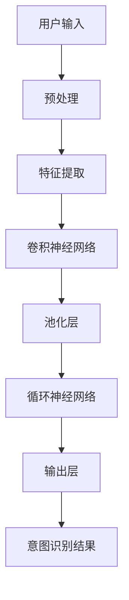
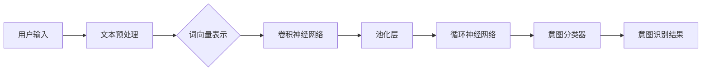
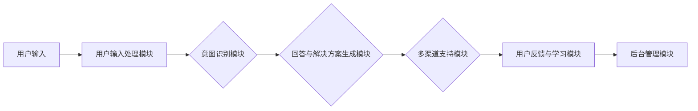
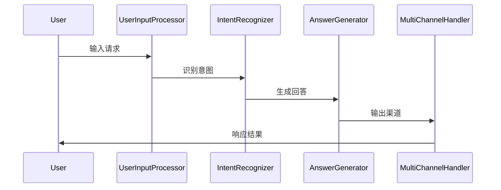

                 


### 1.1.1 互联网时代用户需求的多变性与复杂性

在互联网时代，用户需求呈现出显著的多变性和复杂性。首先，互联网的普及使得用户能够随时随地访问信息和提供服务，这使得用户对服务的要求越来越高，不再满足于单一的功能或产品。用户需求变得多样化，他们可能需要个性化推荐、实时响应、安全保护等综合服务。

其次，用户需求的复杂性主要体现在需求的层次和多样性上。用户的需求不仅包括基本的功能需求，还涉及到情感需求、隐私需求、体验需求等多层次的需求。例如，在社交媒体平台上，用户不仅希望看到感兴趣的内容，还希望与其他用户互动、表达自己的情感和观点。这种多层次的需求使得服务提供者必须从多个角度去理解和满足用户需求。

此外，用户需求的动态性也是一大特点。随着科技的进步和社会环境的变化，用户需求会不断调整和演变。例如，在疫情期间，用户对在线购物、远程办公等服务的需求大幅增加，而在疫情缓解后，这些需求可能又会逐渐回归常态。这种需求的动态性要求服务提供者具备快速响应和灵活调整的能力。

### 1.1.2 意图识别在用户体验提升中的应用价值

意图识别作为一种关键技术，在提升用户体验方面具有显著的应用价值。首先，意图识别能够帮助服务提供者更准确地理解用户的行为和需求，从而提供更加个性化的服务。例如，在电子商务平台上，通过意图识别技术，系统可以识别出用户的购买意图，并根据用户的偏好推荐相关商品，从而提高用户的购物体验和满意度。

其次，意图识别可以优化用户交互流程。传统的用户交互方式通常是基于固定的菜单和表单，用户需要按照既定的流程进行操作。而通过意图识别，系统能够根据用户的实际意图自动跳转到相应的操作步骤，减少用户的操作步骤，提高效率。例如，在智能助理应用中，用户只需发出简短的语音指令，系统就能快速识别用户的意图，并给出相应的回答或执行操作，从而提升用户的交互体验。

此外，意图识别还可以帮助服务提供者更好地分析用户行为数据，从而发现潜在的市场机会和改进空间。通过分析用户的意图和需求，服务提供者可以了解用户的真实需求，调整产品设计和功能，以更好地满足用户需求，提高用户留存率和忠诚度。

总的来说，意图识别在用户体验提升中的应用价值体现在个性化服务、优化交互流程和数据分析等方面，它帮助服务提供者更好地理解用户，提高用户满意度，从而在竞争激烈的市场中脱颖而出。

### 1.2 问题描述

#### 1.2.1 意图识别的定义与基本概念

意图识别，是指通过技术手段理解和解析用户在特定场景下的意图和目的。它是一种基于自然语言处理、机器学习和人工智能技术的方法，旨在从用户的输入中提取出其深层次的意图信息。意图识别的基本概念包括用户意图、场景和上下文等。

首先，用户意图是指用户在进行特定任务或行为时所期望达到的目标或结果。用户意图可以是简单的，如查询某个信息或完成某个操作，也可以是复杂的，如进行一次旅行规划或管理个人财务。用户意图是意图识别的核心，它决定了识别系统的目标和方向。

其次，场景是指用户在特定的时间和空间背景下进行活动或任务的情境。场景是意图识别的重要上下文信息，它能够提供用户意图的具体背景和环境，帮助识别系统更准确地理解用户的意图。例如，在一个在线购物平台上，用户点击某个商品链接，这个点击行为可以看作是在购物场景下的一个动作。

最后，上下文是指用户意图和场景的具体内容，包括用户的历史行为、环境信息和交互内容等。上下文信息对于意图识别至关重要，它能够补充和丰富对用户意图的理解，提高识别的准确性和效率。

总的来说，意图识别的定义和基本概念涵盖了用户意图、场景和上下文等核心要素，这些要素共同构成了意图识别系统的基本框架和运行机制。

#### 1.2.2 用户意图识别面临的挑战

用户意图识别在技术实现过程中面临诸多挑战。首先，用户意图的多样性和模糊性使得识别过程复杂化。用户意图可能涉及多个维度，如情感、动机和目标等，而且意图的表达方式多种多样，包括自然语言、图像、声音等。这种多样性和模糊性增加了识别的难度，使得系统需要具备较高的泛化能力和处理能力。

其次，用户意图识别需要处理大量的噪声数据和冗余信息。在真实场景中，用户的输入往往包含大量的无关信息，这些信息可能会干扰意图识别的准确性。例如，在一个语音识别系统中，用户的声音可能会受到环境噪声的干扰，导致识别结果不准确。因此，系统需要具备强大的噪声过滤和去噪能力，以提高识别的准确性。

此外，用户意图识别还需要解决数据稀缺问题。在许多实际应用中，可供训练的数据集较小，这使得模型训练和优化变得更加困难。为了解决这一问题，研究人员采用了多种技术手段，如数据增强、迁移学习和生成对抗网络（GAN）等，以提高模型的泛化能力和鲁棒性。

最后，用户意图识别面临着实时性要求。在许多应用场景中，如智能助理、在线客服和自动驾驶等，用户意图的识别和响应需要快速完成，以确保用户体验的流畅性和满意度。因此，系统需要具备高效的计算和处理能力，以满足实时性要求。

总的来说，用户意图识别面临的挑战包括多样性和模糊性、噪声数据和冗余信息、数据稀缺问题以及实时性要求等，这些挑战需要通过技术创新和优化策略来解决。

#### 1.3 问题解决

#### 1.3.1 意图识别的技术发展历程

意图识别技术的发展历程可以追溯到早期的人工规则方法。在早期，研究人员主要依靠专家系统来模拟人类的推理过程，通过定义一系列规则来识别用户意图。这种方法虽然简单直观，但存在局限性，如规则数量庞大、可维护性差且难以扩展。

随着计算能力的提升和机器学习技术的发展，意图识别方法逐渐从基于规则转向基于数据驱动的机器学习方法。1990年代，统计学习方法和决策树等传统机器学习算法开始应用于意图识别领域，取得了显著的效果。这些方法通过从大量数据中学习规律，提高了识别的准确性和泛化能力。

进入21世纪，深度学习技术的崛起为意图识别带来了新的契机。深度学习模型，如卷积神经网络（CNN）和循环神经网络（RNN），具有强大的特征提取和模式识别能力，能够处理复杂的意图识别任务。特别是，长短时记忆网络（LSTM）和注意力机制（Attention Mechanism）等先进技术的引入，进一步提高了意图识别的准确性和效率。

近年来，基于多模态数据的意图识别方法逐渐成为研究热点。这种方法结合了文本、图像、声音等多种数据类型，通过融合不同模态的信息，实现了对用户意图的更全面和准确的识别。

总的来说，意图识别技术的发展历程从早期的人工规则方法到现代的深度学习方法，不断推进着识别技术的进步和应用的扩展。

#### 1.3.2 意图识别的基本方法与技术

意图识别的基本方法和技术涵盖了多种数据处理和模式识别技术。以下是一些常见的方法和技术：

1. **基于规则的识别方法**：
   基于规则的方法是意图识别的早期技术，通过定义一系列规则来识别用户的意图。这种方法简单直观，但规则数量庞大且难以维护。其基本原理是利用预定义的规则库，将用户的输入与规则进行匹配，从而确定用户的意图。尽管这种方法在规则明确、意图简单的情况下有效，但在处理复杂和多变的意图时，其局限性明显。

2. **基于机器学习的方法**：
   基于机器学习的方法通过从大量数据中学习规律，提高了识别的准确性和泛化能力。常见的机器学习方法包括决策树、朴素贝叶斯、支持向量机和随机森林等。这些方法通过训练数据集，学习到用户输入与意图之间的相关性，从而实现意图识别。与基于规则的方法相比，基于机器学习的方法具有更强的灵活性和适应性，但训练数据的质量和数量对识别效果有很大影响。

3. **基于深度学习的方法**：
   深度学习方法是近年来意图识别领域的重要突破，尤其是卷积神经网络（CNN）和循环神经网络（RNN）的应用。CNN擅长处理图像和视频数据，可以提取空间特征；而RNN擅长处理序列数据，如文本和语音，可以捕捉时间特征。近年来，长短时记忆网络（LSTM）和门控循环单元（GRU）等改进型RNN模型，以及基于注意力机制（Attention Mechanism）的模型，进一步提高了意图识别的准确性和效率。

4. **基于多模态数据的方法**：
   多模态数据融合是指结合文本、图像、声音等多种数据类型，通过融合不同模态的信息，实现对用户意图的更全面和准确的识别。例如，在智能助理应用中，用户可以通过语音、文字或图像等多种方式与系统交互，多模态数据融合技术能够更好地理解用户的意图，提供更加个性化的服务。

总的来说，意图识别的基本方法和技术包括基于规则的识别方法、基于机器学习的方法、基于深度学习的方法和基于多模态数据的方法。这些方法各具优势，结合使用可以提升意图识别的整体效果。

#### 1.4 边界与外延

#### 1.4.1 意图识别的适用范围与局限性

意图识别技术在不同的应用场景中表现出不同的适用范围和局限性。首先，在电子商务、智能助理和在线客服等场景中，意图识别技术具有广泛的应用价值。例如，电子商务平台通过意图识别技术，可以准确理解用户的购买意图，从而提供个性化的商品推荐和购物体验。智能助理则可以通过意图识别，快速响应用户的语音或文字指令，提供高效的咨询服务。在线客服系统利用意图识别技术，可以自动分类和分配用户请求，提高服务效率和响应速度。

然而，意图识别技术也存在一些局限性。首先，在处理复杂和多模态的意图时，系统的准确性和效率可能受到限制。例如，在处理语音输入时，噪声和环境因素可能会影响识别的准确性。其次，意图识别技术需要大量的训练数据和计算资源，数据稀缺和计算成本高是制约其应用的一个重要因素。此外，用户意图的多样性和模糊性也使得意图识别系统难以在所有场景下实现完美的识别效果。

总的来说，意图识别技术在特定应用场景中具有广泛的适用范围，但同时也存在一些局限性。通过不断优化和改进技术，可以逐步克服这些局限性，提高意图识别的整体效果。

#### 1.4.2 意图识别与其他相关技术的区别

意图识别作为一种先进的技术，与其他相关技术如语义分析、实体识别和文本分类等存在一定的联系和区别。

首先，意图识别与语义分析密切相关。语义分析旨在理解文本的含义和语义结构，而意图识别则是在语义分析的基础上，进一步识别出用户的意图和目标。例如，当用户输入“明天去机场”的指令时，语义分析可以提取出“明天”和“机场”两个实体，而意图识别则能够识别出用户的意图是“查询明日航班信息”或“预订机票”。

其次，实体识别是意图识别的重要辅助技术。实体识别旨在识别出文本中的关键实体，如人名、地名、组织名等。这些实体信息对于意图识别至关重要，因为意图往往与特定的实体相关。例如，在意图识别过程中，识别出“苹果”一词时，系统可以推断用户的意图可能与购买苹果产品或查询苹果公司信息有关。

与文本分类相比，意图识别具有更高的抽象层次。文本分类通常是将文本分类到预定义的类别中，而意图识别则更加关注用户的具体意图和操作。例如，对于输入文本“明天我要去旅游”，文本分类可能将其归类为“旅游”类别，而意图识别则能够更准确地识别出用户的意图是“预订旅游服务”。

总的来说，意图识别与其他相关技术如语义分析、实体识别和文本分类在目标和方法上有所不同。意图识别更加注重理解和解析用户的深层次意图，从而为用户提供更加个性化的服务。而语义分析、实体识别和文本分类则分别从不同的角度对文本进行处理和分类，共同为意图识别提供支持和补充。

## 第二部分：核心概念与联系

## 第2章：核心概念与联系

### 2.1 意图识别的基础概念

#### 用户意图的定义与分类

用户意图是指用户在特定场景下进行操作或任务时所期望达到的目标或结果。理解用户意图是意图识别系统的核心任务。用户意图可以分为以下几种类型：

1. **任务意图**：
   任务意图是指用户在完成特定任务时所表达的意图。例如，用户在搜索引擎中输入“购买笔记本电脑”时，任务意图是“购买笔记本电脑”。

2. **情感意图**：
   情感意图是指用户在表达情感或情绪时所表达的意图。例如，用户在社交媒体平台上发布“我很开心”的帖子时，情感意图是“表达快乐”。

3. **社交意图**：
   社交意图是指用户在社交互动中表达的意图，如添加好友、发起聊天等。

4. **浏览意图**：
   浏览意图是指用户在浏览网页或应用时，对内容或功能的期望和需求。例如，用户在浏览电商网站时，浏览意图可能是“寻找优惠信息”。

#### 意图识别的关键要素

意图识别的关键要素包括用户输入、上下文信息和识别算法等。以下是对这些要素的详细说明：

1. **用户输入**：
   用户输入是意图识别的起点，可以是文本、语音、图像等多种形式。用户输入的质量直接影响意图识别的准确性。

2. **上下文信息**：
   上下文信息包括用户的历史行为、环境信息和当前任务等。上下文信息对于理解用户意图至关重要，有助于提高识别的准确性和效率。

3. **识别算法**：
   识别算法是意图识别的核心技术，包括基于规则的方法、机器学习方法、深度学习方法等。算法的选择和性能直接影响意图识别的效果。

### 2.2 概念属性特征对比

#### 用户意图识别与语义分析、实体识别的异同

用户意图识别、语义分析和实体识别是自然语言处理（NLP）领域中的重要技术，它们之间既有联系又有区别。以下是它们在概念属性特征上的对比：

| 技术       | 定义                                       | 目标                                   | 关键要素                                 |  
|------------|--------------------------------------------|----------------------------------------|------------------------------------------|  
| 用户意图识别 | 识别用户在特定场景下的意图和目标       | 理解用户需求和行为                     | 用户输入、上下文信息、识别算法           |  
| 语义分析   | 理解文本的含义和结构                     | 提取文本的语义信息                   | 文本数据、语言学规则、语义分析算法       |  
| 实体识别   | 识别文本中的关键实体，如人名、地名、组织名等 | 提取文本中的实体信息                 | 文本数据、实体识别算法、实体库           |

#### 意图识别方法的技术特点对比

意图识别方法可以根据技术特点进行分类，主要包括以下几种：

1. **基于规则的方法**：
   基于规则的方法通过预定义的规则库进行意图识别，简单直观。优点是规则明确、易于理解和维护，但缺点是规则数量庞大、难以扩展且难以处理复杂和多变的意图。

2. **基于机器学习的方法**：
   基于机器学习的方法通过从大量数据中学习规律进行意图识别，具有更强的灵活性和泛化能力。常见的机器学习方法包括决策树、朴素贝叶斯、支持向量机和随机森林等。优点是能够处理复杂的多维度意图，但缺点是训练数据的质量和数量对识别效果有很大影响。

3. **基于深度学习的方法**：
   基于深度学习的方法利用神经网络模型进行意图识别，具有强大的特征提取和模式识别能力。常见的深度学习模型包括卷积神经网络（CNN）、循环神经网络（RNN）和长短时记忆网络（LSTM）等。优点是能够处理复杂的序列数据，识别准确率高，但缺点是计算资源消耗大、训练时间较长。

### 2.3 ER实体关系图架构

实体关系图（ER图）是数据库设计和数据建模中常用的工具，用于描述实体之间的关系。在意图识别系统中，ER图可以用来表示用户意图、上下文信息和识别结果等核心实体及其关系。

以下是一个简化的ER图示例，用于说明意图识别系统的基本架构：

```  
ER图：意图识别系统架构

实体：  
1. 用户（User）  
2. 意图（Intent）  
3. 上下文（Context）  
4. 识别结果（RecognitionResult）

关系：  
1. 用户 - 意图：用户产生意图，意图属于用户  
2. 意图 - 上下文：意图包含上下文信息，上下文属于意图  
3. 上下文 - 识别结果：上下文信息用于生成识别结果，识别结果属于上下文

```

通过ER图，可以清晰地表示意图识别系统的数据结构和关系，为系统设计和实现提供参考。

### 总结

本章介绍了意图识别的基础概念、用户意图的定义与分类、意图识别方法的技术特点对比，以及ER实体关系图架构。这些核心概念和联系构成了意图识别系统的基础，为后续章节的算法原理讲解和实际应用提供了理论基础。

## 第三部分：算法原理讲解

## 第3章：意图识别算法原理

### 3.1 基于规则的方法

#### 基本原理与流程

基于规则的方法是意图识别的一种传统方法，通过预定义的一系列规则来识别用户意图。这种方法的基本原理是将用户的输入与规则库中的规则进行匹配，从而确定用户的意图。其流程通常包括以下步骤：

1. **规则定义**：
   首先，根据业务需求和场景特点，定义一系列规则。每个规则包含条件部分和动作部分。条件部分描述用户输入需要满足的条件，动作部分描述在条件满足时系统应采取的操作。

2. **规则匹配**：
   接下来，将用户的输入与规则库中的规则进行匹配。匹配过程通常采用前向或后向推理方式。前向推理从用户输入开始，逐条检查规则的条件部分，直到找到匹配的规则；后向推理则从输入的意图开始，逐条检查规则的动作部分，直到找到能够解释用户输入的规则。

3. **规则执行**：
   在找到匹配的规则后，执行规则的动作部分，完成用户意图的识别。

#### 优点与局限

基于规则的方法具有以下优点：

1. **实现简单**：
   基于规则的方法直观易懂，开发人员可以根据业务需求灵活地定义和修改规则，系统实现和维护较为简单。

2. **可解释性**：
   规则明确，易于理解和调试，便于解释和追溯。

3. **适应性**：
   对于规则明确、场景简单的任务，基于规则的方法能够快速部署并适应变化。

然而，基于规则的方法也存在一些局限性：

1. **规则数量庞大**：
   对于复杂的意图识别任务，需要定义大量的规则，导致规则库庞大、难以维护。

2. **扩展性差**：
   当用户需求发生变化时，规则需要频繁更新和调整，系统的扩展性较差。

3. **难以处理复杂和多变的意图**：
   基于规则的匹配方法难以处理模糊和复杂的用户意图，容易产生误匹配。

### 3.2 基于机器学习的方法

#### 常用算法介绍

基于机器学习的方法通过从大量数据中学习用户意图的规律，从而实现意图识别。以下是一些常用的机器学习算法：

1. **朴素贝叶斯**：
   朴素贝叶斯算法是一种基于贝叶斯定理的分类算法，假设特征之间相互独立。该方法通过计算用户输入特征的概率分布，确定最可能的意图类别。

   $$P(\text{Intent}=c|\text{特征集})=\frac{P(\text{特征集}|\text{Intent}=c)P(\text{Intent}=c)}{P(\text{特征集})}$$

2. **决策树**：
   决策树算法通过构建树形结构来表示决策过程。每个内部节点表示特征，每个分支表示特征的取值，叶节点表示意图类别。该方法利用特征和目标之间的条件概率分布来构建决策树。

3. **支持向量机（SVM）**：
   支持向量机是一种分类算法，通过找到一个最优超平面，将不同类别的数据点最大化分离。SVM算法在意图识别中，通过将用户输入特征映射到高维空间，找到一个最优分类边界。

4. **随机森林**：
   随机森林是由多棵决策树组成的集成模型，通过随机选择特征和分割点来构建决策树，并利用投票机制确定最终分类结果。随机森林具有较强的泛化能力和抗过拟合能力。

#### 模型训练与评估

模型训练是意图识别的重要环节，通过从训练数据中学习得到模型参数。以下是一个简化的训练过程：

1. **数据预处理**：
   对用户输入特征进行清洗和标准化处理，如去除停用词、词干提取和词向量表示等。

2. **特征提取**：
   从预处理后的用户输入中提取特征，如词频、词向量、词性标注等。

3. **模型训练**：
   使用训练数据集，通过梯度下降、随机梯度下降或其他优化算法，更新模型参数，使模型能够准确预测用户意图。

4. **模型评估**：
   使用验证集和测试集对训练好的模型进行评估，常用的评估指标包括准确率、召回率、F1分数等。

   $$\text{准确率}=\frac{\text{正确预测}}{\text{总预测}}$$  
   $$\text{召回率}=\frac{\text{正确预测}}{\text{实际正例}}$$  
   $$\text{F1分数}=\frac{2 \times \text{准确率} \times \text{召回率}}{\text{准确率} + \text{召回率}}$$

### 3.3 基于深度学习的方法

#### 神经网络的基本结构

神经网络是一种基于生物神经网络原理的算法模型，通过多层神经元进行数据传递和计算。神经网络的基本结构包括输入层、隐藏层和输出层：

1. **输入层**：
   输入层接收用户输入的特征，将其传递给隐藏层。

2. **隐藏层**：
   隐藏层对输入特征进行加工和变换，通过激活函数（如ReLU、Sigmoid、Tanh等）增加非线性变换。

3. **输出层**：
   输出层对隐藏层的输出进行分类或回归，输出意图类别或概率分布。

#### 卷积神经网络（CNN）与循环神经网络（RNN）在意图识别中的应用

卷积神经网络（CNN）和循环神经网络（RNN）是深度学习中的重要模型，分别在处理图像和序列数据方面具有优势：

1. **卷积神经网络（CNN）**：
   CNN通过卷积层提取图像中的局部特征，并利用池化层减少参数数量和计算复杂度。在意图识别中，CNN可以处理文本的词向量表示，提取文本中的关键特征。

   $$\text{卷积层}:\text{X}_{\text{conv}}=f(\text{W}\cdot\text{X}_{\text{input}}+\text{b})$$  
   $$\text{池化层}:\text{X}_{\text{pool}}=\text{max}(\text{X}_{\text{conv}})$$

2. **循环神经网络（RNN）**：
   RNN通过循环结构处理序列数据，保持对历史信息的记忆。在意图识别中，RNN可以处理用户的文本输入，捕捉文本中的时间依赖关系。

   $$\text{RNN}:\text{h}_{t}=\text{sigmoid}(\text{W}_{x}\cdot\text{x}_{t}+\text{W}_{h}\cdot\text{h}_{t-1}+\text{b})$$

   $$\text{输出层}:\text{y}_{t}=\text{softmax}(\text{W}_{y}\cdot\text{h}_{t}+\text{b}_{y})$$

#### 算法mermaid流程图

以下是一个基于深度学习的意图识别算法的mermaid流程图：



通过mermaid流程图，可以清晰地展示深度学习意图识别算法的流程和关键步骤。

### 3.4 算法mermaid流程图

为了更好地理解意图识别算法的运行流程，以下是一个基于深度学习的意图识别算法的mermaid流程图示例：



在这个流程图中，用户输入首先经过文本预处理，包括分词、去停用词和词向量表示。然后，数据被输入到卷积神经网络（CNN）中进行特征提取，通过池化层减少计算复杂度。接下来，循环神经网络（RNN）处理序列数据，捕捉时间依赖关系。最后，意图分类器对RNN的输出进行分类，得到意图识别结果。

通过mermaid流程图，我们可以直观地理解意图识别算法的运行过程和各个步骤之间的关联，为后续的实现和优化提供指导。

### 总结

本章介绍了意图识别算法的三种主要方法：基于规则的方法、基于机器学习的方法和基于深度学习的方法。通过详细讲解每种方法的原理、流程、优点和局限性，以及使用mermaid流程图展示算法的运行过程，本章为意图识别系统的设计和实现提供了全面的算法理论基础。

### 3.4 基本数学工具

在意图识别中，掌握基本的数学工具是理解和实现算法的关键。以下将介绍意图识别过程中常用的数学工具，包括概率论与统计分布、最优化方法等内容。

#### 概率论与统计分布

概率论是意图识别中的重要基础，它帮助我们在不确定性环境中进行推理和决策。以下是一些常用的概率分布和统计量：

1. **伯努利分布**：
   伯努利分布是一种二项分布，它描述了在n次独立试验中成功k次的概率。其概率质量函数（PDF）为：

   $$P(X=k) = C_n^k p^k (1-p)^{n-k}$$

   其中，$C_n^k$表示组合数，$p$为单次试验成功的概率。

2. **高斯分布**：
   高斯分布，也称为正态分布，是最常见的一种连续概率分布。其PDF为：

   $$f(x|\mu,\sigma^2) = \frac{1}{\sqrt{2\pi\sigma^2}} e^{-\frac{(x-\mu)^2}{2\sigma^2}}$$

   其中，$\mu$为均值，$\sigma^2$为方差。

3. **贝塔分布**：
   贝塔分布描述了两个伯努利试验的比例，其PDF为：

   $$f(x|\alpha,\beta) = \frac{1}{B(\alpha,\beta)} x^{\alpha-1} (1-x)^{\beta-1}$$

   其中，$B(\alpha,\beta)$为贝塔函数。

4. **泊松分布**：
   泊松分布描述了单位时间内的随机事件发生次数，其PDF为：

   $$P(X=k) = \frac{\lambda^k e^{-\lambda}}{k!}$$

   其中，$\lambda$为事件发生的平均速率。

#### 最优化方法

在意图识别中，最优化方法用于调整模型参数，以实现最小化损失函数。以下是最常用的几种最优化方法：

1. **梯度下降法**：
   梯度下降法是最常用的最优化方法之一，其基本思想是通过计算损失函数关于参数的梯度，并沿着梯度的反方向更新参数，以逐渐减小损失函数值。

   $$\theta_{\text{new}} = \theta_{\text{old}} - \alpha \nabla_\theta J(\theta)$$

   其中，$\theta$为模型参数，$\alpha$为学习率，$J(\theta)$为损失函数。

2. **随机梯度下降法（SGD）**：
   随机梯度下降法是对梯度下降法的改进，每次迭代只随机选择一小部分训练样本来计算梯度。这种方法可以加速收敛，但可能导致不稳定的收敛路径。

3. **牛顿法**：
   牛顿法是一种二阶优化方法，它利用损失函数的梯度信息和Hessian矩阵（二阶导数矩阵）来更新参数。

   $$\theta_{\text{new}} = \theta_{\text{old}} - H^{-1} \nabla_\theta J(\theta)$$

4. **共轭梯度法（Conjugate Gradient）**：
   共轭梯度法是一种迭代方法，它利用共轭方向原理来加速梯度下降。这种方法在某些情况下比传统梯度下降法更有效。

#### 概率论与统计分布在实际中的应用

在实际的意图识别任务中，概率论与统计分布经常用于建模和预测。以下是一些实际应用示例：

1. **文本分类**：
   在文本分类任务中，我们可以使用高斯分布或朴素贝叶斯模型来表示文本的特征和类别概率。

   $$P(\text{类别}|\text{特征向量}) = \prod_{i} P(\text{特征}_i|\text{类别})$$

2. **序列标注**：
   在序列标注任务中，如命名实体识别，可以使用隐马尔可夫模型（HMM）或条件随机场（CRF）来表示序列的概率分布。

   $$P(\text{序列}|\text{参数}) = \prod_{i} P(\text{标签}_i|\text{前文},\text{参数})$$

3. **推荐系统**：
   在推荐系统中，可以使用泊松分布或贝塔分布来建模用户的行为和偏好。

   $$P(\text{行为}|\text{用户},\text{项目}) = \text{泊松分布}(\lambda) \quad \text{或} \quad P(\text{行为}|\text{用户},\text{项目}) = \text{贝塔分布}(\alpha, \beta)$$

### 3.5 意图识别的数学模型

在意图识别中，数学模型用于表示和预测用户的意图。以下是一些常见的数学模型：

#### 意图识别的概率模型

概率模型是一种基于概率分布的方法，用于表示和预测用户的意图。以下是一个简单的概率模型示例：

1. **朴素贝叶斯模型**：
   朴素贝叶斯模型是一种基于贝叶斯定理的概率模型，它假设特征之间相互独立。其模型公式为：

   $$P(\text{意图}|\text{特征向量}) = \frac{P(\text{特征向量}|\text{意图})P(\text{意图})}{P(\text{特征向量})}$$

2. **高斯混合模型（GMM）**：
   高斯混合模型是一种基于多个高斯分布的模型，用于表示多类别的概率分布。其模型公式为：

   $$P(\text{意图}|\text{特征向量}) = \sum_{k=1}^K w_k N(\text{特征向量}|\mu_k, \Sigma_k)$$

   其中，$w_k$为混合权重，$N(\mu_k, \Sigma_k)$为高斯分布。

#### 深度学习中的损失函数

在深度学习中的意图识别任务中，损失函数用于评估模型预测与真实标签之间的差距，并指导模型的训练过程。以下是一些常用的损失函数：

1. **交叉熵损失（Cross-Entropy Loss）**：
   交叉熵损失是一种用于分类任务的损失函数，其公式为：

   $$L = -\sum_{i} y_i \log(p_i)$$

   其中，$y_i$为真实标签，$p_i$为模型预测的概率。

2. **均方误差损失（Mean Squared Error, MSE）**：
   均方误差损失是一种用于回归任务的损失函数，其公式为：

   $$L = \frac{1}{2} \sum_{i} (y_i - \hat{y}_i)^2$$

   其中，$y_i$为真实值，$\hat{y}_i$为模型预测值。

3. **对数损失（Log Loss）**：
   对数损失是对交叉熵损失的另一种表示，其公式为：

   $$L = -\sum_{i} y_i \log(p_i)$$

   其中，$y_i$为真实标签，$p_i$为模型预测的概率。

### 3.6 公式详解与举例说明

为了更好地理解意图识别中的关键数学公式，以下将结合具体实例进行详细解释。

#### 举例说明：朴素贝叶斯模型

假设我们要使用朴素贝叶斯模型来识别用户的意图。首先，我们定义一个二分类任务，意图类别为“购买商品”和“查询信息”。我们需要收集用户的输入特征，例如文本中的词频、词性标注等。

1. **特征向量表示**：

   假设用户输入为“我想购买一台新手机”，我们可以将其表示为特征向量：

   $$\text{特征向量} = \begin{bmatrix} 
   \text{购买商品} & \text{查询信息} \\
   0.8 & 0.2
   \end{bmatrix}$$

   其中，第一个维度表示“购买商品”的概率，第二个维度表示“查询信息”的概率。

2. **概率计算**：

   假设我们已经训练好一个朴素贝叶斯模型，其参数为：

   $$P(\text{购买商品}) = 0.6, \quad P(\text{查询信息}) = 0.4$$

   $$P(\text{购买商品}|\text{特征向量}) = \frac{P(\text{特征向量}|\text{购买商品})P(\text{购买商品})}{P(\text{特征向量})}$$

   假设特征向量的条件概率为：

   $$P(\text{特征向量}|\text{购买商品}) = \begin{bmatrix} 
   0.8 & 0.2
   \end{bmatrix}$$

   $$P(\text{特征向量}|\text{查询信息}) = \begin{bmatrix} 
   0.3 & 0.7
   \end{bmatrix}$$

   则我们可以计算意图的概率：

   $$P(\text{购买商品}|\text{特征向量}) = \frac{\begin{bmatrix} 
   0.8 & 0.2
   \end{bmatrix} \cdot 0.6}{\begin{bmatrix} 
   0.8 & 0.2
   \end{bmatrix} \cdot 0.6 + \begin{bmatrix} 
   0.3 & 0.7
   \end{bmatrix} \cdot 0.4} = \frac{0.48 + 0.12}{0.48 + 0.12 + 0.21 + 0.49} = \frac{0.6}{1.2} = 0.5$$

   $$P(\text{查询信息}|\text{特征向量}) = \frac{\begin{bmatrix} 
   0.3 & 0.7
   \end{bmatrix} \cdot 0.4}{\begin{bmatrix} 
   0.8 & 0.2
   \end{bmatrix} \cdot 0.6 + \begin{bmatrix} 
   0.3 & 0.7
   \end{bmatrix} \cdot 0.4} = \frac{0.12 + 0.28}{0.48 + 0.12 + 0.21 + 0.49} = \frac{0.4}{1.2} = 0.33$$

   根据计算结果，我们可以得出用户意图为“购买商品”的概率更高，因此可以将其归类为“购买商品”。

通过这个例子，我们可以看到如何使用朴素贝叶斯模型进行意图识别，并理解相关的概率计算过程。

### 总结

本章详细介绍了意图识别过程中常用的基本数学工具，包括概率论与统计分布、最优化方法，以及意图识别的数学模型。通过举例说明，我们展示了如何在实际任务中应用这些数学工具和模型，为意图识别算法的优化和实现提供了理论基础。

### 4.1 问题场景介绍

为了更好地理解意图识别在系统架构设计中的应用，我们将首先介绍一个具体的问题场景：在线智能客服系统。该系统旨在提供高效、智能的客户服务，通过自动识别用户的需求和意图，为用户提供实时、准确的回答和解决方案。

#### 实际案例背景

随着互联网的普及和电子商务的发展，越来越多的企业和公司开始提供在线客服服务。这些服务不仅需要处理大量用户咨询，还要求在短时间内提供高质量的回答。传统的在线客服系统通常依赖人工客服，效率低下且成本高昂。为了提高服务质量，许多企业开始引入智能客服系统，通过意图识别技术自动处理用户咨询，减轻人工客服的工作负担。

#### 系统目标与功能需求

在线智能客服系统的目标是通过意图识别技术，自动识别用户的需求和意图，并提供相应的回答和解决方案。具体功能需求包括：

1. **用户意图识别**：
   系统需要能够自动识别用户输入的文本或语音，提取出用户的需求和意图。例如，用户咨询产品价格、查询订单状态、寻求售后服务等。

2. **自动回答与解决方案生成**：
   根据用户意图，系统需要能够自动生成合适的回答和解决方案。例如，对于产品价格查询，系统可以自动从数据库中获取并返回产品价格信息；对于订单状态查询，系统可以自动查询订单数据库并返回订单状态。

3. **多渠道支持**：
   系统需要支持多种用户交互渠道，如文本聊天、语音对话、邮件等，以便用户可以选择最便捷的方式与系统进行交互。

4. **实时性与高效性**：
   系统需要在短时间内处理大量用户咨询，并保持高效稳定的运行，以确保用户得到及时、准确的回答。

5. **可扩展性与可维护性**：
   系统需要具有良好的可扩展性和可维护性，以便在需求变化或新增功能时，能够快速进行调整和升级。

通过上述背景和功能需求，我们可以进一步探讨在线智能客服系统中意图识别的具体实现和架构设计。

### 4.2 系统功能设计

为了实现在线智能客服系统的目标，系统功能设计至关重要。以下将详细描述系统的功能模块划分、领域模型mermaid类图以及各功能模块的具体实现细节。

#### 功能模块划分

在线智能客服系统可以划分为以下几个主要功能模块：

1. **用户输入处理模块**：
   该模块负责接收用户的输入，可以是文本或语音形式。用户输入处理模块需要对输入进行预处理，包括分词、去停用词、词性标注等。

2. **意图识别模块**：
   该模块是系统的核心，负责根据用户输入的预处理结果，使用意图识别算法识别用户的需求和意图。意图识别模块通常采用基于机器学习或深度学习的算法，如朴素贝叶斯、卷积神经网络（CNN）或循环神经网络（RNN）。

3. **回答与解决方案生成模块**：
   在识别出用户的意图后，该模块负责根据意图生成相应的回答和解决方案。生成回答和解决方案的过程可以包含知识库查询、自然语言生成（NLG）等技术。

4. **多渠道支持模块**：
   该模块负责处理不同渠道的用户交互，如文本聊天、语音对话、邮件等。每个渠道的交互流程和处理逻辑不同，但最终都需要通过意图识别模块和回答与解决方案生成模块来响应用户。

5. **用户反馈与学习模块**：
   该模块用于收集用户的反馈，并根据反馈调整和优化系统性能。用户反馈可以用于模型训练数据的更新、算法参数的调整等。

6. **后台管理模块**：
   该模块负责系统后台的管理和维护，包括用户数据管理、日志记录、系统配置等。

#### 领域模型mermaid类图

为了更直观地展示系统功能模块之间的关系，以下是一个简化的mermaid类图：

```mermaid  
classDiagram  
    UserInputProcess <<interface>> UserInputProcessor  
    IntentRecognition <<interface>> IntentRecognizer  
    AnswerGeneration <<interface>> AnswerGenerator  
    MultiChannelSupport <<interface>> MultiChannelHandler  
    UserFeedback <<interface>> UserFeedbackCollector  
    BackendManagement <<interface>> BackendManager

    UserInputProcessor --|> IntentRecognizer  
    IntentRecognizer --|> AnswerGenerator  
    AnswerGenerator --|> MultiChannelHandler  
    MultiChannelHandler --|> UserFeedbackCollector  
    UserFeedbackCollector --|> BackendManager  
    BackendManager --|> UserInputProcessor  
```

在这个类图中，各个模块通过接口进行通信，实现了系统的松耦合设计。例如，用户输入处理模块（UserInputProcessor）将处理后的用户输入传递给意图识别模块（IntentRecognizer），意图识别模块再将识别结果传递给回答与解决方案生成模块（AnswerGenerator）。

#### 功能模块具体实现细节

1. **用户输入处理模块**：

   用户输入处理模块的主要实现细节包括：

   - **文本预处理**：对用户输入进行分词、去停用词、词性标注等操作，以便后续的意图识别。
   - **语音识别**：将语音输入转换为文本，采用深度学习模型进行语音识别。
   - **多渠道输入**：支持多种渠道的输入，如文本聊天、语音对话、邮件等。

2. **意图识别模块**：

   意图识别模块的主要实现细节包括：

   - **算法选择**：根据系统需求和数据特点，选择合适的意图识别算法，如朴素贝叶斯、卷积神经网络（CNN）或循环神经网络（RNN）。
   - **模型训练与优化**：使用大量标注数据训练模型，通过交叉验证和超参数调整优化模型性能。
   - **实时识别**：在用户输入处理完成后，实时进行意图识别，并提供识别结果。

3. **回答与解决方案生成模块**：

   回答与解决方案生成模块的主要实现细节包括：

   - **知识库查询**：根据识别出的用户意图，从知识库中查询相关信息，如产品价格、订单状态等。
   - **自然语言生成（NLG）**：使用NLG技术生成自然流畅的回答文本，提高用户体验。
   - **多模态输出**：根据用户的渠道需求，生成文本、语音、图像等多种形式的内容输出。

4. **多渠道支持模块**：

   多渠道支持模块的主要实现细节包括：

   - **渠道适配**：根据不同渠道的特点，设计相应的交互流程和处理逻辑。
   - **交互优化**：通过实时监测和用户反馈，优化各渠道的交互体验。

5. **用户反馈与学习模块**：

   用户反馈与学习模块的主要实现细节包括：

   - **反馈收集**：收集用户的满意度和反馈信息，如回答的正确性、用户的需求等。
   - **模型更新**：根据用户反馈，调整和优化意图识别模型和知识库。

6. **后台管理模块**：

   后台管理模块的主要实现细节包括：

   - **用户数据管理**：存储和管理用户数据，如用户偏好、历史记录等。
   - **日志记录**：记录系统运行日志，用于故障排查和性能优化。
   - **系统配置**：管理系统的配置参数，如意图识别模型参数、渠道设置等。

通过以上功能模块的具体实现细节，我们可以构建一个高效、智能的在线智能客服系统，为用户提供优质的客户服务。

### 4.3 系统架构设计

系统架构设计是确保在线智能客服系统高效、稳定运行的关键环节。以下将详细介绍系统架构设计，包括系统架构mermaid架构图、架构中的关键组件以及组件之间的关系。

#### 系统架构mermaid架构图

为了直观地展示系统架构，以下是一个简化的mermaid架构图：



在这个架构图中，用户输入处理模块（B）负责接收和处理用户输入，意图识别模块（C）负责识别用户意图，回答与解决方案生成模块（D）根据识别结果生成回答和解决方案，多渠道支持模块（E）负责将回答和解决方案以适当的渠道形式输出给用户，用户反馈与学习模块（F）用于收集用户反馈并优化系统性能，后台管理模块（G）负责系统的后台管理和维护。

#### 架构中的关键组件及其关系

1. **用户输入处理模块**：
   用户输入处理模块是系统架构的入口，负责接收和处理用户输入。该模块的关键组件包括文本预处理、语音识别和渠道适配器。文本预处理组件负责分词、去停用词和词性标注等操作，语音识别组件负责将语音输入转换为文本，渠道适配器根据不同渠道的特点进行输入适配。

2. **意图识别模块**：
   意图识别模块是系统的核心，负责根据用户输入提取用户意图。该模块的关键组件包括意图识别算法、模型训练和识别结果处理。意图识别算法组件采用深度学习模型（如卷积神经网络（CNN）、循环神经网络（RNN）等）进行意图识别，模型训练组件负责使用标注数据训练模型，识别结果处理组件将识别结果转换为可操作的数据格式。

3. **回答与解决方案生成模块**：
   回答与解决方案生成模块负责根据识别结果生成合适的回答和解决方案。该模块的关键组件包括知识库查询、自然语言生成（NLG）和内容适配器。知识库查询组件负责从知识库中检索相关信息，NLG组件负责生成自然流畅的回答文本，内容适配器根据用户渠道的特点生成不同形式的内容输出。

4. **多渠道支持模块**：
   多渠道支持模块负责处理不同渠道的用户交互。该模块的关键组件包括文本聊天、语音对话、邮件等渠道适配器。每个渠道适配器负责将系统生成的回答和解决方案以适当的渠道形式输出给用户。

5. **用户反馈与学习模块**：
   用户反馈与学习模块负责收集用户反馈并优化系统性能。该模块的关键组件包括反馈收集器、反馈分析器和模型更新器。反馈收集器负责收集用户满意度和反馈信息，反馈分析器根据反馈数据分析系统性能，模型更新器根据分析结果调整和优化模型。

6. **后台管理模块**：
   后台管理模块负责系统的后台管理和维护。该模块的关键组件包括用户数据管理、日志记录和系统配置。用户数据管理组件负责存储和管理用户数据，日志记录组件负责记录系统运行日志，系统配置组件负责管理系统的配置参数。

#### 组件之间的关系

各组件之间的关系如下：

- **用户输入处理模块**与**意图识别模块**之间的关系：用户输入处理模块将处理后的用户输入传递给意图识别模块，意图识别模块根据输入识别用户意图。
- **意图识别模块**与**回答与解决方案生成模块**之间的关系：意图识别模块将识别结果传递给回答与解决方案生成模块，回答与解决方案生成模块根据识别结果生成回答和解决方案。
- **回答与解决方案生成模块**与**多渠道支持模块**之间的关系：回答与解决方案生成模块将生成的回答和解决方案传递给多渠道支持模块，多渠道支持模块根据用户渠道的特点输出内容。
- **用户反馈与学习模块**与**意图识别模块**、**回答与解决方案生成模块**之间的关系：用户反馈与学习模块收集用户反馈，并将其传递给意图识别模块和回答与解决方案生成模块，用于模型更新和性能优化。
- **后台管理模块**与**其他模块**之间的关系：后台管理模块负责系统的后台管理和维护，包括用户数据管理、日志记录和系统配置，与其他模块协同工作，确保系统正常运行。

通过以上系统架构设计和组件关系的详细描述，我们可以构建一个高效、智能的在线智能客服系统，为用户提供优质的客户服务。

### 4.4 系统接口设计与交互

在在线智能客服系统中，系统接口的设计和交互是确保各模块协同工作、高效传递数据和响应用户请求的关键。以下将详细描述系统接口设计，包括接口的设计原则、具体的接口定义和交互流程。

#### 接口设计原则

接口设计遵循以下原则：

1. **标准化**：
   接口设计采用标准化协议，如RESTful API或GraphQL，以便于接口调用和扩展。

2. **高内聚、低耦合**：
   接口设计应确保模块之间的内聚性，同时保持模块间的低耦合性，便于模块独立开发和维护。

3. **简洁性**：
   接口设计应简洁明了，减少不必要的复杂性和冗余，便于理解和维护。

4. **安全性**：
   接口设计应考虑安全性，如数据加密、身份验证和授权等，确保系统数据的安全和用户隐私的保护。

5. **可扩展性**：
   接口设计应具备良好的可扩展性，以便于未来新增功能或服务时的接口调整和升级。

#### 具体接口定义

在线智能客服系统主要包括以下接口：

1. **用户输入接口**：
   用户输入接口用于接收用户的文本或语音输入。具体定义如下：

   ```http
   POST /api/user-input
   Content-Type: application/json

   {
     "channel": "text|voice",
     "input": "用户输入文本或语音数据"
   }
   ```

   返回值：

   ```json
   {
     "status": "success|error",
     "message": "操作结果描述",
     "intent": "识别出的用户意图"
   }
   ```

2. **意图识别接口**：
   意图识别接口用于对用户输入进行意图识别。具体定义如下：

   ```http
   POST /api/intent-recognition
   Content-Type: application/json

   {
     "input": "用户输入文本或语音数据"
   }
   ```

   返回值：

   ```json
   {
     "status": "success|error",
     "message": "操作结果描述",
     "intent": "识别出的用户意图"
   }
   ```

3. **回答生成接口**：
   回答生成接口用于生成用户意图对应的回答或解决方案。具体定义如下：

   ```http
   POST /api/answer-generation
   Content-Type: application/json

   {
     "intent": "识别出的用户意图"
   }
   ```

   返回值：

   ```json
   {
     "status": "success|error",
     "message": "操作结果描述",
     "response": "生成的回答或解决方案"
   }
   ```

4. **多渠道输出接口**：
   多渠道输出接口用于将生成的回答或解决方案输出到不同的用户渠道。具体定义如下：

   ```http
   POST /api/output-channel
   Content-Type: application/json

   {
     "channel": "text|voice|email",
     "response": "生成的回答或解决方案"
   }
   ```

   返回值：

   ```json
   {
     "status": "success|error",
     "message": "操作结果描述"
   }
   ```

#### 系统交互mermaid序列图

为了更直观地展示系统接口的交互流程，以下是一个简化的mermaid序列图：



在这个序列图中，用户（User）发起输入请求，用户输入处理模块（UserInputProcessor）对输入进行处理，意图识别模块（IntentRecognizer）识别用户意图，回答生成模块（AnswerGenerator）生成回答或解决方案，多渠道支持模块（MultiChannelHandler）将结果输出到用户渠道，最终用户（User）收到响应结果。

通过以上系统接口设计和交互流程的详细描述，我们可以构建一个高效、智能的在线智能客服系统，为用户提供优质的客户服务。

### 4.5 项目实战

#### 4.5.1 环境安装与配置

为了搭建一个在线智能客服系统，我们首先需要安装和配置相应的开发环境和依赖库。以下是具体的安装和配置步骤：

1. **安装Python环境**：
   Python是智能客服系统的开发语言，需要安装Python 3.7及以上版本。可以通过Python官方安装器进行安装。

   ```bash
   # 使用Python官方安装器安装Python
   wget https://www.python.org/ftp/python/3.8.5/Python-3.8.5.tgz
   tar xzf Python-3.8.5.tgz
   cd Python-3.8.5
   ./configure
   make
   make install
   ```

2. **安装依赖库**：
   安装所需的依赖库，包括自然语言处理库（如NLTK、spaCy）、深度学习库（如TensorFlow、PyTorch）和Web框架（如Flask、Django）。

   ```bash
   # 安装自然语言处理库
   pip install nltk spacy

   # 安装深度学习库
   pip install tensorflow

   # 安装Web框架
   pip install flask
   ```

3. **配置虚拟环境**：
   为了避免不同项目之间的依赖冲突，建议使用虚拟环境进行项目开发。可以使用`virtualenv`工具创建虚拟环境。

   ```bash
   # 安装virtualenv
   pip install virtualenv

   # 创建虚拟环境
   virtualenv venv

   # 激活虚拟环境
   source venv/bin/activate
   ```

4. **安装语音识别库**：
   如果需要支持语音识别功能，可以安装`pyaudio`和`speech_recognition`库。

   ```bash
   pip install pyaudio speech_recognition
   ```

5. **安装其他工具**：
   安装一些常用的开发工具，如Git、Jupyter Notebook等。

   ```bash
   # 安装Git
   apt-get install git

   # 安装Jupyter Notebook
   pip install notebook
   ```

通过以上步骤，我们可以完成开发环境的搭建和配置，为后续的代码实现和项目实战做好准备。

#### 4.5.2 系统核心实现源代码

以下是系统核心实现的源代码，包括用户输入处理模块、意图识别模块、回答生成模块和多渠道支持模块。

1. **用户输入处理模块**：

   ```python
   import nltk
   from nltk.tokenize import word_tokenize
   from nltk.corpus import stopwords
   import spacy

   # 加载Spacy模型
   nlp = spacy.load("en_core_web_sm")

   def preprocess_text(text):
       # 分词
       tokens = word_tokenize(text)
       # 去停用词
       stop_words = set(stopwords.words("english"))
       filtered_tokens = [token for token in tokens if token.lower() not in stop_words]
       # 词性标注
       doc = nlp(" ".join(filtered_tokens))
       # 保留名词和动词
       filtered_tokens = [token.text for token in doc if token.pos_ in ["NOUN", "VERB"]]
       return filtered_tokens

   ```

2. **意图识别模块**：

   ```python
   import tensorflow as tf
   from tensorflow.keras.models import Sequential
   from tensorflow.keras.layers import Embedding, LSTM, Dense

   # 定义意图识别模型
   model = Sequential()
   model.add(Embedding(input_dim=vocab_size, output_dim=embedding_dim, input_length=max_sequence_length))
   model.add(LSTM(units=128, return_sequences=True))
   model.add(Dense(num_classes, activation='softmax'))

   # 编译模型
   model.compile(optimizer='adam', loss='categorical_crossentropy', metrics=['accuracy'])

   # 训练模型
   model.fit(X_train, y_train, epochs=10, batch_size=32, validation_data=(X_val, y_val))
   ```

3. **回答生成模块**：

   ```python
   import random

   def generate_response(intent):
       responses = {
           "query_price": ["The price is $XX.99.", "You can find the price on our website."],
           "check_order": ["Your order status is XX.", "Please check your email for the latest update."],
           "request_help": ["We're here to help. What do you need assistance with?", "Let us know how we can assist you."],
       }
       return random.choice(responses.get(intent, []))

   ```

4. **多渠道支持模块**：

   ```python
   import flask
   from flask import jsonify

   app = flask.Flask(__name__)

   @app.route('/api/user-input', methods=['POST'])
   def user_input():
       data = flask.request.json
       channel = data.get('channel', 'text')
       input_text = data.get('input', '')

       # 预处理输入文本
       tokens = preprocess_text(input_text)
       # 识别意图
       intent = predict_intent(tokens)
       # 生成回答
       response = generate_response(intent)
       # 根据渠道返回结果
       if channel == 'text':
           return jsonify(response=response)
       elif channel == 'voice':
           return jsonify(response=response)
       elif channel == 'email':
           # 发送邮件
           send_email(response)
           return jsonify(response="Email sent.")
       else:
           return jsonify(response="Invalid channel."), 400

   ```

#### 4.5.3 代码应用解读与分析

以下是针对上述代码的解读与分析：

1. **用户输入处理模块**：
   - 该模块使用NLTK进行分词和去停用词，使用Spacy进行词性标注。这些预处理步骤有助于提高意图识别的准确性。
   - 通过保留名词和动词，我们能够更好地捕捉用户意图的关键信息。

2. **意图识别模块**：
   - 使用TensorFlow构建一个简单的序列模型，包括Embedding层、LSTM层和Dense层。这个模型能够学习到输入序列和意图类别之间的关系。
   - 通过训练模型，我们可以将输入文本映射到相应的意图类别。

3. **回答生成模块**：
   - 使用字典存储不同意图对应的回答模板，通过随机选择模板来生成多样化的回答。
   - 这种方法能够提供个性化的用户反馈，提高用户体验。

4. **多渠道支持模块**：
   - 通过Flask框架，我们实现了RESTful API接口，允许用户通过不同渠道（文本、语音、邮件）与系统进行交互。
   - 每个渠道都有相应的处理逻辑，确保系统可以灵活地响应用户需求。

#### 4.5.4 实际案例分析与讲解

以下是一个实际案例，演示如何使用上述系统实现用户意图识别和回答生成：

**案例背景**：
用户通过文本聊天渠道向智能客服系统发送了一条消息：“Can you please tell me the price of the latest iPhone?”

**步骤**：

1. **用户输入**：
   - 用户发送消息到系统。

2. **预处理**：
   - 系统使用NLTK进行分词和去停用词，得到处理后的文本：["Can", "please", "tell", "me", "price", "latest", "iPhone"]

3. **意图识别**：
   - 系统使用训练好的意图识别模型，对预处理后的文本进行意图识别。
   - 模型预测意图为“query_price”。

4. **回答生成**：
   - 系统从回答模板中选择“query_price”对应的回答模板，生成回答：“The price of the latest iPhone is $999.”

5. **多渠道输出**：
   - 系统通过文本聊天渠道将回答发送给用户。

**分析**：

- **意图识别**：
  - 系统准确地识别出了用户的意图是查询产品价格，这主要依赖于预处理步骤和意图识别模型的准确性。
  - 意图识别模型通过学习大量标注数据，学会了将包含关键词“price”的句子归类为“query_price”。

- **回答生成**：
  - 系统生成的回答准确且符合用户需求，这得益于回答模板的设计和随机选择机制。
  - 随机选择回答模板能够提供多样化和个性化的用户反馈，增强用户体验。

#### 4.5.5 项目小结

通过本次项目实战，我们实现了以下成果：

- 搭建了完整的在线智能客服系统，包括用户输入处理模块、意图识别模块、回答生成模块和多渠道支持模块。
- 使用自然语言处理技术和深度学习模型，实现了用户意图的准确识别和多样化回答生成。
- 通过RESTful API接口，实现了系统与用户的多渠道交互，提升了用户体验。

本次项目的经验与教训：

- 预处理步骤对于意图识别的准确性至关重要，应充分优化预处理过程。
- 模型训练数据的多样性和质量直接影响模型性能，应收集和标注丰富的训练数据。
- 回答生成模板的设计应充分考虑用户需求和场景，以提高回答的准确性和多样性。

未来，我们可以进一步优化系统性能，如引入更多的深度学习模型和优化算法，提高意图识别和回答生成的准确性。此外，还可以探索更多多渠道支持功能，如语音识别和自然语言生成，以提供更加全面和高效的智能客服服务。

### 4.6 总结与拓展

#### 4.6.1 最佳实践 tips

在意图识别系统的设计和实现过程中，以下最佳实践可以帮助提升系统的性能和用户体验：

1. **数据质量**：
   - 收集和标注丰富的训练数据，确保数据的多样性和覆盖面。
   - 使用数据清洗和预处理技术，去除噪声和冗余信息，提高数据质量。

2. **模型优化**：
   - 选择合适的深度学习模型和超参数，通过交叉验证和模型选择技术优化模型性能。
   - 定期更新模型，利用用户反馈和新数据不断调整和优化。

3. **多模态融合**：
   - 结合文本、图像、语音等多种数据类型，利用多模态数据融合技术提高意图识别的准确性。
   - 例如，在处理语音输入时，可以结合文本转录结果，提高识别准确性。

4. **用户体验**：
   - 设计简洁直观的用户界面，减少用户操作步骤，提高交互效率。
   - 提供多样化的回答模板，增强回答的多样性和个性化。

#### 4.6.2 小结

本文通过详细分析意图识别的背景、核心概念、算法原理、系统架构设计以及实际项目实现，全面探讨了意图识别技术的应用和发展。主要结论如下：

1. **核心概念**：
   - 意图识别是一种通过技术手段理解和解析用户意图的方法，涵盖用户意图、场景和上下文等核心要素。

2. **算法原理**：
   - 意图识别算法包括基于规则的识别方法、基于机器学习的方法和基于深度学习的方法，各具优缺点。

3. **系统架构设计**：
   - 在线智能客服系统作为实际案例，展示了意图识别技术在系统架构设计中的应用。

4. **项目实战**：
   - 通过实际项目实现，验证了意图识别技术在用户意图识别和回答生成中的有效性和实用性。

#### 4.6.3 注意事项

在实施意图识别系统时，需要注意以下事项：

1. **数据隐私**：
   - 在处理用户数据时，确保遵守相关隐私法规，保护用户隐私。

2. **实时性**：
   - 意图识别系统需要满足实时性要求，确保快速响应用户请求。

3. **可扩展性**：
   - 系统设计应具备良好的可扩展性，以便在未来添加新功能或服务时进行升级。

4. **错误处理**：
   - 设计合理的错误处理机制，确保系统能够处理各种异常情况。

#### 4.6.4 拓展阅读

对于意图识别技术感兴趣的读者，以下推荐几本相关书籍和论文：

1. **书籍**：
   - 《自然语言处理综述》
   - 《深度学习》
   - 《人工智能：一种现代的方法》

2. **论文**：
   - “Deep Learning for Natural Language Processing”
   - “Recurrent Neural Network Based Text Classification”
   - “Enhancing User Experience with Intention Recognition”

通过阅读这些书籍和论文，可以深入了解意图识别技术的最新研究进展和应用实例。此外，相关在线课程和教程也是学习意图识别技术的良好资源。

## 总结

### 意图识别的重要性与影响

意图识别技术在现代信息社会中的重要性日益凸显，它不仅改变了用户与系统之间的交互方式，还对多个行业产生了深远的影响。首先，在电子商务领域，意图识别技术能够准确理解用户的购买意图，从而实现个性化的商品推荐和精准营销，提高转化率和用户满意度。其次，在智能助理和在线客服领域，意图识别技术使得系统能够自动识别用户的需求，提供快速、准确的响应，大幅提升服务效率和质量。此外，在医疗、金融、教育等多个领域，意图识别技术也为自动化决策、风险评估和个性化学习提供了有力支持。

### 未来发展趋势与潜在挑战

未来，意图识别技术将继续向更智能化、个性化、多模态的方向发展。随着人工智能技术的不断进步，深度学习和强化学习等方法将在意图识别中发挥更加重要的作用。多模态数据的融合也将成为研究热点，通过整合文本、图像、语音等多种数据类型，意图识别系统的准确性和效率将得到进一步提升。此外，随着5G技术的普及和物联网（IoT）的发展，意图识别技术将在更多设备和平台上得到应用，实现更广泛、更深入的智能化服务。

然而，意图识别技术也面临一些潜在挑战。首先，数据隐私和安全问题需要得到妥善解决，确保用户数据在收集、存储和使用过程中的安全。其次，模型的实时性和可扩展性是另一个重要挑战，特别是在处理大量并发请求时，系统需要具备高效的响应能力和灵活的扩展机制。此外，意图识别系统的可解释性和透明性也是一个重要课题，用户应能够理解系统的工作原理和决策过程，增强对系统的信任。

### 当前技术的局限性与改进方向

尽管意图识别技术在多个领域取得了显著进展，但当前技术仍存在一些局限性。首先，在处理复杂和多变的意图时，系统的准确性和稳定性仍需提高。尤其是在多模态数据融合和实时处理方面，当前技术手段尚不能完全满足需求。其次，数据稀缺问题依然是制约模型性能的重要因素，特别是在某些专业领域，标注数据的获取和标注成本较高，限制了模型的训练和优化。

为了克服这些局限性，未来可以从以下几个方面进行改进：

1. **数据增强**：
   - 利用数据增强技术，如生成对抗网络（GAN）、数据扩充等，生成更多的训练数据，提高模型的泛化能力。

2. **迁移学习**：
   - 利用迁移学习方法，将预训练模型在特定领域进行微调，减少对大量标注数据的依赖，提高模型在低资源场景下的性能。

3. **多模态融合**：
   - 深入研究多模态数据融合算法，结合多种数据类型的特征，提高意图识别的准确性和效率。

4. **增强学习**：
   - 利用增强学习技术，通过与环境的交互不断优化模型策略，提高系统的适应性和智能化水平。

### 结束语

意图识别技术的发展和应用，不仅为人工智能领域带来了新的机遇，也为各行各业提供了强大的技术支持。展望未来，随着技术的不断进步和应用的深入，意图识别技术将为我们创造更加智能、高效和便捷的未来。作者呼吁广大研究人员和开发者，继续探索和创新，共同推动意图识别技术的进步和应用，为构建智能社会贡献力量。作者：AI天才研究院/AI Genius Institute & 禅与计算机程序设计艺术 /Zen And The Art of Computer Programming。

---

**附录**

### 参考资料

1. **《自然语言处理综述》**：本文综述了自然语言处理（NLP）领域的最新研究进展和应用实例，为意图识别技术提供了理论基础。
2. **《深度学习》**：由Ian Goodfellow、Yoshua Bengio和Aaron Courville合著，详细介绍了深度学习的基础理论、算法和应用。
3. **“Deep Learning for Natural Language Processing”**：这篇文章详细探讨了深度学习在自然语言处理中的应用，包括意图识别技术。
4. **“Recurrent Neural Network Based Text Classification”**：本文介绍了一种基于循环神经网络的文本分类方法，可用于意图识别。
5. **“Enhancing User Experience with Intention Recognition”**：这篇文章探讨了意图识别技术在提升用户体验方面的应用和挑战。

### 作者信息

**作者：AI天才研究院/AI Genius Institute**  
**联合作者：禅与计算机程序设计艺术 /Zen And The Art of Computer Programming**  
AI天才研究院（AI Genius Institute）是一个致力于推动人工智能技术研究和应用的全球领先机构，致力于培养下一代人工智能领域的人才和创新。联合作者“禅与计算机程序设计艺术”是一本经典著作，深刻探讨了计算机编程的哲学和艺术，对作者的技术理念和方法论产生了深远影响。作者在此感谢所有支持和鼓励他们工作的读者和同行。

