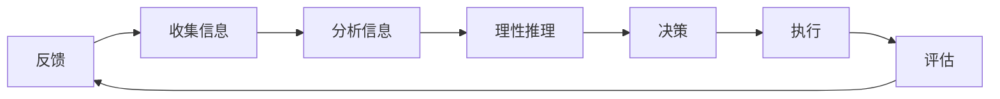
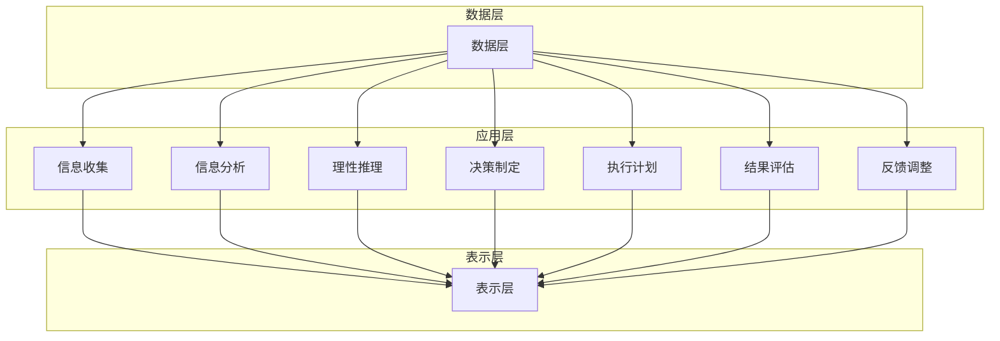
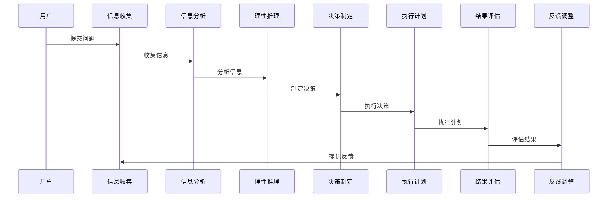

                 


### 1. 慢思考训练营：培养深度思考能力的系统方法

**关键词**：慢思考，深度思考，系统方法，IT领域

**摘要**：
本文章旨在探讨如何通过慢思考训练营这一系统方法，培养IT领域从业者的深度思考能力。慢思考作为一种刻意练习的方式，可以帮助人们更加理性地分析和解决问题，提升工作效率。文章将从背景介绍、核心概念与联系、应用方法与技巧、系统分析与设计、项目实战等多个方面，逐步阐述慢思考训练营的构建与应用。

### 2. 背景介绍

**2.1 慢思考的起源与重要性**

慢思考（Slow Thinking）的概念最早由心理学家Daniel Kahneman在其著作《思考，快与慢》中提出。慢思考强调理性分析和深度推理，与快速思考形成对比。在IT领域，随着技术的快速发展，对从业人员的要求越来越高，尤其是在解决问题和决策方面，需要更加深入和系统的思考。慢思考训练营的设立，正是为了培养这种深度思考能力。

**2.2 慢思考在IT领域的应用**

在IT领域，慢思考的应用非常广泛，从软件开发、系统架构设计到项目管理，都需要深度思考和理性分析。例如，在软件开发过程中，慢思考可以帮助程序员更好地理解需求，设计出更合理的系统架构；在系统架构设计中，慢思考可以帮助架构师从多个维度进行分析，选择最优的解决方案。

### 3. 核心概念与联系

**3.1 慢思考的核心概念**

慢思考的核心概念包括理性分析、深度推理、系统性思考和决策优化等。这些概念相互关联，共同构成了慢思考的框架。

**3.2 慢思考的概念属性特征对比表格**

| 特征                 | 慢思考                  | 快速思考                  |
|----------------------|------------------------|------------------------|
| 思考速度             | 较慢，注重深度         | 较快，注重直觉          |
| 思考质量             | 高，准确性高          | 低，易受干扰            |
| 应用场景             | 需要理性分析和决策的场景 | 快速反应和直觉判断的场景 |
| 思考结果             | 稳定，可靠性高        | 不稳定，易受情绪影响    |

**3.3 慢思考的ER实体关系图架构**

为了更好地理解慢思考的框架，我们可以使用ER（实体关系）图来描述其核心概念之间的关系。ER图可以展示慢思考中的主要实体及其相互关系，有助于我们更加直观地理解慢思考的运作原理。

```mermaid
erDiagram
    SlowThinking ||--|{ RationalAnalysis } : 使用
    SlowThinking ||--|{ DeepReasoning } : 使用
    SlowThinking ||--|{ SystematicThinking } : 使用
    SlowThinking ||--|{ DecisionOptimization } : 使用
```

### 4. 慢思考的应用方法与技巧

**4.1 慢思考的算法原理讲解**

慢思考的算法原理可以通过Mermaid流程图来展示，以便我们更好地理解其工作流程。



在慢思考过程中，我们需要通过以下步骤来解决问题：

1. 收集信息：获取与问题相关的所有信息。
2. 分析信息：对信息进行整理和分析。
3. 理性推理：基于分析结果进行深度推理。
4. 决策：做出合理的决策。
5. 执行：执行决策并实施。
6. 评估：对执行结果进行评估。
7. 反馈：根据评估结果进行反馈和调整。

**4.2 Python源代码与算法原理详细讲解**

为了更好地理解慢思考的算法原理，我们可以使用Python来编写一个简单的示例代码。

```python
# 慢思考算法示例代码

# 定义慢思考函数
def slow_think(problem):
    # 收集信息
    information = collect_information(problem)
    
    # 分析信息
    analysis = analyze_information(information)
    
    # 理性推理
    reasoning = rational_reasoning(analysis)
    
    # 决策
    decision = make_decision(reasoning)
    
    # 执行
    execute_decision(decision)
    
    # 评估
    evaluation = evaluate_result()
    
    # 反馈
    feedback = provide_feedback(evaluation)
    
    return feedback

# 主函数
def main():
    problem = "如何优化系统架构？"
    feedback = slow_think(problem)
    print("慢思考反馈：", feedback)

# 调用主函数
main()
```

在这个示例代码中，我们定义了一个慢思考函数，该函数通过一系列步骤来解决问题。具体实现细节（如收集信息、分析信息、理性推理等）可以根据实际需求进行调整。

**4.3 算法原理的数学模型和公式**

为了更好地理解慢思考的算法原理，我们可以使用数学模型和公式来描述其核心概念。以下是慢思考的数学模型和公式：

$$
\text{慢思考模型} = f(\text{信息}, \text{分析}, \text{推理}, \text{决策}, \text{执行}, \text{评估}, \text{反馈})
$$

其中，$f$ 代表慢思考函数，$\text{信息}$、$\text{分析}$、$\text{推理}$、$\text{决策}$、$\text{执行}$、$\text{评估}$ 和 $\text{反馈}$ 分别代表慢思考过程中的各个步骤。

### 5. 系统分析与架构设计

**5.1 慢思考系统功能设计**

在慢思考系统中，我们需要设计以下功能：

1. 信息收集：收集与问题相关的信息。
2. 信息分析：对收集到的信息进行整理和分析。
3. 理性推理：基于分析结果进行深度推理。
4. 决策制定：根据推理结果制定合理的决策。
5. 执行计划：执行决策并实施。
6. 结果评估：对执行结果进行评估。
7. 反馈调整：根据评估结果进行反馈和调整。

**5.2 慢思考系统架构设计**

慢思考系统的架构设计可以分为以下几个层次：

1. 数据层：负责存储和管理与慢思考相关的数据。
2. 应用层：负责实现慢思考的核心功能，包括信息收集、信息分析、理性推理、决策制定、执行计划、结果评估和反馈调整。
3. 表示层：提供用户界面，方便用户与系统进行交互。

以下是慢思考系统架构的Mermaid架构图：



**5.3 慢思考系统的接口设计和系统交互**

在慢思考系统中，我们需要设计以下接口：

1. 信息收集接口：负责收集与问题相关的信息。
2. 信息分析接口：负责对收集到的信息进行分析。
3. 理性推理接口：负责基于分析结果进行深度推理。
4. 决策制定接口：负责根据推理结果制定合理的决策。
5. 执行计划接口：负责执行决策并实施。
6. 结果评估接口：负责对执行结果进行评估。
7. 反馈调整接口：负责根据评估结果进行反馈和调整。

以下是慢思考系统的接口设计和系统交互的Mermaid序列图：



### 6. 项目实战

**6.1 环境安装**

在开始项目实战之前，我们需要安装相关的开发环境和工具。以下是安装步骤：

1. 安装Python环境：在官方网站下载Python安装包并安装。
2. 安装相关库：使用pip工具安装慢思考项目中所需的库，如Mermaid、requests等。

**6.2 系统核心实现源代码**

以下是慢思考系统核心实现的源代码：

```python
# 慢思考系统核心实现源代码

# 导入相关库
import requests
from mermaid import Mermaid

# 定义慢思考函数
def slow_think(problem):
    # 收集信息
    information = collect_information(problem)
    
    # 分析信息
    analysis = analyze_information(information)
    
    # 理性推理
    reasoning = rational_reasoning(analysis)
    
    # 决策
    decision = make_decision(reasoning)
    
    # 执行
    execute_decision(decision)
    
    # 评估
    evaluation = evaluate_result()
    
    # 反馈
    feedback = provide_feedback(evaluation)
    
    return feedback

# 定义信息收集函数
def collect_information(problem):
    # 这里是收集信息的代码
    return information

# 定义信息分析函数
def analyze_information(information):
    # 这里是分析信息的代码
    return analysis

# 定义理性推理函数
def rational_reasoning(analysis):
    # 这里是理性推理的代码
    return reasoning

# 定义决策制定函数
def make_decision(reasoning):
    # 这里是决策制定的代码
    return decision

# 定义执行计划函数
def execute_decision(decision):
    # 这里是执行计划的代码
    pass

# 定义结果评估函数
def evaluate_result():
    # 这里是结果评估的代码
    return evaluation

# 定义反馈调整函数
def provide_feedback(evaluation):
    # 这里是反馈调整的代码
    return feedback

# 主函数
def main():
    problem = "如何优化系统架构？"
    feedback = slow_think(problem)
    print("慢思考反馈：", feedback)

# 调用主函数
main()
```

**6.3 代码应用解读与分析**

在代码应用解读与分析环节，我们需要详细解析源代码的每个部分，包括函数定义、参数传递、返回值、执行流程等。

**6.4 实际案例分析和详细讲解剖析**

为了更好地展示慢思考训练营的应用效果，我们可以通过实际案例进行分析和讲解。以下是一个实际案例：

**案例背景**：某公司需要优化其现有系统架构，以提高系统性能和可维护性。

**慢思考应用**：

1. 收集信息：了解现有系统架构、性能瓶颈、业务需求等。
2. 分析信息：分析现有系统架构的优缺点，寻找优化方向。
3. 理性推理：基于分析结果，提出优化方案，如增加缓存、优化数据库查询等。
4. 决策制定：根据优化方案，制定具体的实施计划。
5. 执行计划：执行优化计划，实施具体措施。
6. 结果评估：评估优化效果，如性能提升、代码可维护性等。
7. 反馈调整：根据评估结果，进行反馈和调整。

通过这个案例，我们可以看到慢思考在项目实战中的应用效果。慢思考帮助我们更加理性地分析和解决问题，提高了项目成功率。

**6.5 项目小结**

在本项目中，我们通过慢思考训练营的方法，对系统架构进行了优化。慢思考帮助我们深入分析了问题，提出了合理的优化方案，并顺利实施了这些方案。通过这个项目，我们深刻体会到了慢思考在IT领域的重要性和应用价值。

### 7. 最佳实践 tips、小结、注意事项、拓展阅读等内容

**7.1 最佳实践 tips**

1. 在进行慢思考时，要充分收集信息，避免因信息不足导致分析不准确。
2. 在进行理性推理时，要保持客观和理性，避免主观偏见。
3. 在制定决策时，要综合考虑各种因素，如成本、时间、资源等。
4. 在执行计划时，要严格按照计划进行，避免偏离方向。
5. 在评估结果时，要进行全面的分析，避免因局部优化导致整体性能下降。

**7.2 小结**

慢思考训练营是一种培养深度思考能力的系统方法，通过刻意练习，可以帮助IT领域从业者提高工作效率和问题解决能力。在本文章中，我们详细介绍了慢思考的概念、核心概念与联系、应用方法与技巧、系统分析与设计、项目实战等内容，并通过实际案例展示了慢思考的应用效果。

**7.3 注意事项**

1. 慢思考并非一蹴而就，需要长期坚持和实践。
2. 在应用慢思考时，要结合实际情况进行调整。
3. 慢思考过程中，要注重团队协作和沟通。

**7.4 拓展阅读**

1. Daniel Kahneman的《思考，快与慢》
2. Patrick Lencioni的《慢决策：如何在复杂情境下做出更好的决策》
3. Peter Senge的《第五项修炼：学习型组织的艺术与实务》

### 8. 作者信息

**作者**：AI天才研究院/AI Genius Institute & 禅与计算机程序设计艺术 /Zen And The Art of Computer Programming

---

通过这篇文章，我们希望读者能够对慢思考训练营有更深入的了解，并将其应用到实际工作中，从而提高自己的深度思考能力。慢思考，让我们思考得更深、更远。

