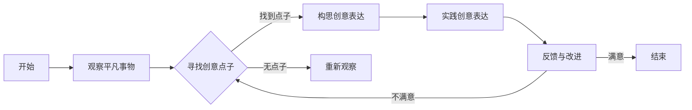
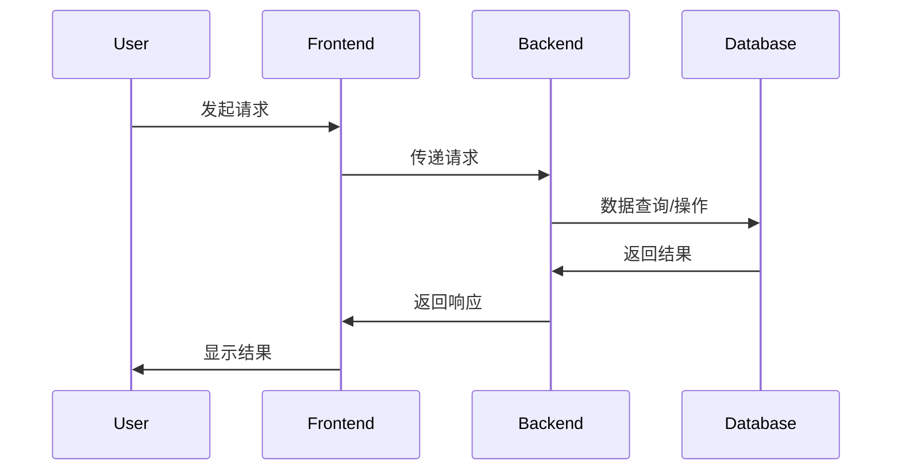
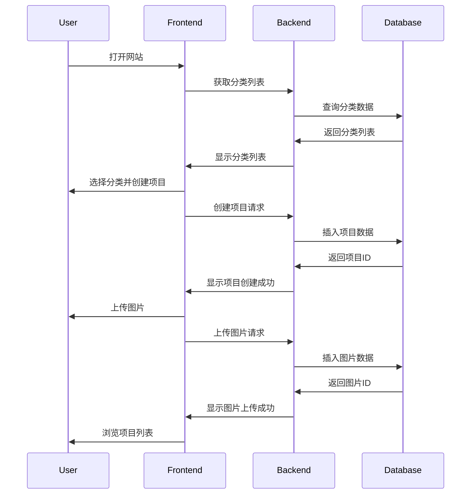

                 

### 引言：成为生活艺术家：将平凡转化为创意表达

**关键词：创意生活、艺术表达、日常实践、个人成长**

在现代社会，越来越多的人开始意识到，生活不仅仅是生存，更是一种艺术。将平凡的事物转化为独特的创意表达，不仅能够提升个人生活质量，还能激发内心的潜能，带来前所未有的满足感。本文旨在探讨如何成为一位“生活艺术家”，将日常的平凡转化为令人赞叹的创意表达。

**摘要：**

本文将从以下几个方面展开讨论：

1. **引言**：介绍“生活艺术家”的概念，探讨创意生活的重要性。
2. **核心概念**：解释“创意表达”的含义，并分析其在生活中的作用。
3. **方法与实践**：介绍将平凡转化为创意表达的具体方法和实践步骤。
4. **案例分析**：分享一些成功的创意生活案例，以及如何从中获得灵感。
5. **总结与反思**：总结全文，提出成为生活艺术家所需的关键要素。

通过本文的阅读，读者将了解到如何在日常生活中运用创意，将平凡转化为独特的艺术表达，从而提升个人生活的质量和幸福感。

**背景介绍**

“生活艺术家”这个概念源自对生活质量的追求。在现代社会，人们不再仅仅满足于物质生活的基本需求，更渴望在精神层面得到满足和提升。因此，如何将日常的平凡事务转化为富有创意的表达，成为了一个备受关注的话题。

创意表达不仅是艺术创作的一种形式，更是一种生活方式。它不仅仅体现在绘画、写作、音乐等传统艺术领域，还可以渗透到生活的方方面面，如烹饪、装饰、旅行等。通过创意表达，我们可以发现生活中的美好，激发内心的热情，提升个人生活的质量。

然而，创意表达并不是一件容易的事情。它需要我们跳出固有的思维模式，敢于尝试新事物，同时还需要不断地学习和实践。本文将提供一系列方法和实践步骤，帮助读者克服这些困难，成为真正的“生活艺术家”。

**问题背景**

在当前快节奏的生活中，人们往往感到压力巨大，难以找到平衡点。工作、家庭、社交等各种事务让人应接不暇，很容易陷入单调乏味的循环中。这种状态下，人们往往忽略了生活中的美好和创意的潜力。许多人觉得自己缺乏创意，无法在生活中进行创新表达，从而感到沮丧和无力。

**问题描述**

具体来说，生活中常见的几个问题包括：

1. **缺乏灵感**：人们常常感到创意枯竭，无法想出新的点子和创意。
2. **时间不足**：忙碌的工作和家庭事务让人难以抽出时间进行创意活动。
3. **环境限制**：缺乏适宜的创作环境和资源，限制了创意表达的实现。
4. **心理障碍**：害怕失败和批评，导致不敢尝试新的创意想法。

**问题解决**

针对上述问题，我们可以从以下几个方面进行解决：

1. **培养创意思维**：通过阅读、思考和实践，不断培养创意思维。
2. **合理安排时间**：制定合理的日程安排，确保有足够的时间进行创意活动。
3. **创造适宜环境**：布置一个舒适、激发灵感的创作空间。
4. **积极心态**：树立积极的心态，勇于尝试，接受失败，从中汲取经验。

通过这些方法，我们可以逐步克服生活中的难题，实现创意表达，成为真正的“生活艺术家”。

**边界与外延**

“生活艺术家”这一概念并非孤立存在，它与其他几个相关概念有着紧密的联系：

1. **艺术家**：虽然“生活艺术家”与传统的艺术家有所不同，但它们都追求创意表达和美感的实现。
2. **创意工作者**：创意工作者同样注重创意思维和实践，但他们通常在特定的领域中进行创作，如设计师、作家等。
3. **创意生活**：创意生活是“生活艺术家”追求的目标，它涵盖了生活的各个方面，包括工作、休闲、社交等。
4. **个人成长**：通过创意生活，人们可以不断提升自我，实现个人成长和全面发展。

理解这些概念之间的关系，有助于我们更全面地认识“生活艺术家”这一概念，并在实践中更好地应用。

**概念结构与核心要素组成**

“生活艺术家”这一概念的核心要素主要包括以下几个方面：

1. **创意思维**：这是“生活艺术家”最基本的素质，包括发散思维、联想思维、逆向思维等。
2. **实践能力**：只有将创意思维付诸实践，才能真正实现创意表达。实践能力包括动手能力、实验精神、持续改进等。
3. **审美素养**：对美的追求和感知能力是“生活艺术家”不可或缺的要素。它涉及对色彩、形状、质感等元素的敏感度。
4. **时间管理**：合理安排时间，确保有足够的精力进行创意活动，是实现创意生活的重要保障。
5. **积极心态**：面对挑战和失败时，保持积极的心态，勇于尝试和接受新事物。

这些核心要素相互关联，共同构成了“生活艺术家”的完整形象。只有通过不断地培养和实践，我们才能成为真正的“生活艺术家”。

### 核心概念与联系

在深入探讨“成为生活艺术家：将平凡转化为创意表达”这一主题时，我们需要明确几个核心概念，并分析它们之间的联系。以下是几个关键概念及其属性特征对比表格，以及ER实体关系图架构。

#### 核心概念及其属性特征对比表格

| 概念         | 定义                                                         | 属性特征对比                                       |
| ------------ | ------------------------------------------------------------ | -------------------------------------------------- |
| 创意思维     | 产生新奇想法的能力，通过不同角度和方式思考问题                 | 思维灵活性、思维深度、思维广度                      |
| 创意表达     | 将创意思维转化为具体形式的过程，如绘画、写作、设计等         | 表达媒介、表达效果、表达风格                        |
| 平凡事物     | 指日常生活中常见、普通的事物                                 | 单调、重复、缺乏新意                               |
| 创意转化     | 将平凡事物通过创意思维转化为独特创意表达的过程               | 创意点子、创造性组合、创新实践                      |
| 生活质量     | 个人在生活中的满足感、幸福感、舒适度等                       | 心理健康、物质条件、社交关系                        |

#### ER实体关系图架构

为了更好地理解这些核心概念之间的关系，我们可以使用Mermaid语言绘制一个ER实体关系图。

```mermaid
erDiagram
  Creativity Thinking  ||--|{ Creativity Expression }
  Everyday Life       ||--|{ Creativity Transformation }
  Creativity          ||--|{ Quality of Life }
  Creativity Thinking  ||--|{ Creative Mindset }
  Creativity Expression||--|{ Artistic Expression }
  Creativity Transformation||--|{ Innovative Practice }
  Quality of Life      ||--|{ Personal Growth }
```

在上面的ER图中，我们可以看到：

- **创意思维**与**创意表达**之间是双向关系，创意思维是创意表达的基础，而创意表达是创意思维的结果。
- **平凡事物**与**创意转化**之间也是双向关系，平凡事物可以通过创意转化变成独特的创意表达，同时创意转化也可以从平凡事物中发现灵感。
- **创意**与**生活质量**之间是双向关系，创意能够提升生活质量，而高质量的生活也会激发更多的创意。
- **创意思维**与**创意心态**之间是包含关系，创意思维是创意心态的一部分，而创意心态则是创意思维的外在表现。
- **创意表达**与**艺术表达**之间是包含关系，创意表达包括艺术表达，但不仅限于艺术表达。
- **创意转化**与**创新实践**之间是包含关系，创意转化是创新实践的一部分，而创新实践则是创意转化的具体应用。
- **生活质量**与**个人成长**之间是包含关系，个人成长是生活质量的一部分，而高质量的生活也会促进个人成长。

通过这个ER图，我们可以清晰地看到各个核心概念之间的关系，以及它们如何相互作用，共同推动一个人成为生活艺术家。

### 算法原理讲解

#### 创意转化流程图

为了更好地理解创意转化的过程，我们可以使用Mermaid绘制一个流程图。



在上面的流程图中，我们可以看到：

1. **开始**：从观察平凡事物开始，这是创意转化的第一步。
2. **寻找创意点子**：在观察的基础上，寻找可以转化为创意的点子。
3. **构思创意表达**：将找到的点子转化为具体的创意表达形式。
4. **实践创意表达**：将构思的创意付诸实践。
5. **反馈与改进**：根据反馈对创意表达进行改进。
6. **结束**：如果创意表达得到满意的结果，则结束；如果不满意，则回到第二步重新寻找创意点子。

#### 创意转化的Python代码实现

以下是一个简单的Python代码示例，用于模拟创意转化的过程。

```python
import random

def find_idea平凡的事物:
    # 随机生成一个创意点子
    ideas = ["创意早餐", "独特旅行路线", "个性化装饰"]
    return random.choice(ideas)

def构思创意表达(点子):
    # 根据点子生成创意表达
    expressions = {
        "创意早餐": "制作一个以某部电影为主题的早餐",
        "独特旅行路线": "规划一条以某个地方为主题的旅行路线",
        "个性化装饰": "用某种颜色装饰自己的房间"
    }
    return expressions[点子]

def实践创意表达(创意):
    # 实践创意表达
    print(f"实践创意：{创意}")

def反馈与改进(创意):
    # 获取用户反馈，并决定是否改进
    feedback = input("你对这个创意满意吗？(满意/不满意)：")
    if feedback == "不满意":
        print("重新构思创意...")
        return False
    else:
        print("创意成功！")
        return True

# 创意转化流程
平凡的的事物 = "日常早餐"
点子 = find_idea平凡的的事物
创意 = 构思创意表达(点子)
实践创意表达(创意)

# 获取反馈并改进
if not feedback与改进(创意):
    平凡的的事物 = input("请重新选择一个平凡事物：")
    点子 = find_idea平凡的的事物
    创意 = 构思创意表达(点子)
    实践创意表达(创意)
```

#### 创意转化的数学模型和公式

创意转化的过程可以看作是一个迭代过程，可以用以下数学模型来描述：

1. **创意点子生成模型**：
   $$I = f(L)$$
   其中，$I$ 表示创意点子，$L$ 表示观察到的平凡事物，$f$ 表示将平凡事物转化为创意点子的函数。

2. **创意表达构思模型**：
   $$E = g(I)$$
   其中，$E$ 表示创意表达，$I$ 表示创意点子，$g$ 表示将创意点子转化为创意表达的函数。

3. **创意实践模型**：
   $$P = h(E)$$
   其中，$P$ 表示创意实践，$E$ 表示创意表达，$h$ 表示将创意表达付诸实践的过程。

4. **反馈与改进模型**：
   $$R = k(P, F)$$
   其中，$R$ 表示反馈结果，$P$ 表示创意实践，$F$ 表示用户反馈，$k$ 表示根据反馈进行改进的过程。

#### 创意转化的示例

假设我们观察到的一个平凡事物是“日常早餐”，我们希望将其转化为一个创意点子。

1. **创意点子生成**：
   $$I = f("日常早餐") = "创意早餐"$$

2. **创意表达构思**：
   $$E = g("创意早餐") = "制作一个以某部电影为主题的早餐"$$

3. **创意实践**：
   $$P = h("制作一个以某部电影为主题的早餐") = "实际制作并享用早餐"$$

4. **反馈与改进**：
   用户反馈：“满意”
   $$R = k(P, "满意") = "创意成功！$$

通过这个简单的示例，我们可以看到创意转化的过程是如何一步一步进行的。每个步骤都需要我们用心去观察、思考和实践，才能最终实现创意表达。

### 系统分析与架构设计

#### 问题场景介绍

在现代生活中，人们面临着各种各样的日常挑战，例如如何让平淡无奇的早餐变得有趣、如何在家中布置出独特的风格、如何规划一次令人难忘的旅行等。这些挑战看似平凡，但如果能够运用创意，就可以转化为令人兴奋的创意表达。为了帮助人们更好地实现这一目标，我们设计了一套创意生活系统，旨在将平凡的事物转化为独特的创意表达。

#### 项目介绍

项目名称：创意生活系统（Creative Life System，简称CLS）

目标：帮助用户发现生活中的平凡事物，通过创意思维和表达，将其转化为独特的创意作品，提升生活质量和幸福感。

项目团队：由产品设计、前端开发、后端开发、测试和用户支持等多个职能团队组成。

项目周期：预计为6个月，分为需求分析、设计、开发、测试和上线等阶段。

#### 系统功能设计（领域模型）

领域模型是系统设计的核心，它定义了系统的核心概念和关系。以下是创意生活系统的领域模型，使用Mermaid语言表示。

```mermaid
classDiagram
    User <<用户>>
    Item <<项目物品>>
    Project <<创意项目>>
    Category <<分类>>
    Task <<任务>>

    User --> Item
    User --> Project
    Item --> Category
    Project --> Task
    Category --> Item
    Project --> Task
    Task --> User
```

在上述领域模型中，核心概念包括：

- **用户（User）**：系统的主要操作者，可以创建、浏览和分享创意项目。
- **项目物品（Item）**：用户创建的创意作品，如照片、绘画、食谱等。
- **创意项目（Project）**：由用户发起的创意活动，包含多个项目物品和任务。
- **分类（Category）**：对创意项目物品进行分类，便于管理和查找。
- **任务（Task）**：创意项目中需要完成的子任务，如制作早餐、布置房间等。

#### 系统架构设计

创意生活系统的架构设计分为前端、后端和数据库三大部分，以下使用Mermaid语言表示。



在上述架构设计中，核心组件包括：

- **前端（Frontend）**：负责用户界面展示，使用HTML、CSS和JavaScript等前端技术实现。
- **后端（Backend）**：处理业务逻辑，使用Python、Flask等后端技术实现。
- **数据库（Database）**：存储用户数据和创意作品信息，使用MySQL数据库管理系统。

#### 系统接口设计

以下是创意生活系统的主要接口设计，包括用户注册、登录、创建项目、上传图片等。

```mermaid
interface Design
    用户注册:
        POST /register
        用户名（String），密码（String），邮箱（String）

    用户登录:
        POST /login
        用户名（String），密码（String）

    创建项目:
        POST /projects
        用户ID（Integer），项目名称（String），分类ID（Integer）

    上传图片:
        POST /items
        用户ID（Integer），项目ID（Integer），图片（File）

    获取项目列表:
        GET /projects/{userID}
        用户ID（Integer）

    获取项目详情:
        GET /projects/{projectID}
        项目ID（Integer）

    获取分类列表:
        GET /categories
```

#### 系统交互设计

以下是创意生活系统的主要交互流程，使用Mermaid语言表示。



#### 实际案例分析与详细讲解

为了更好地展示创意生活系统的实际应用，我们以下提供了一个具体的案例。

**案例背景**：用户小明想为自己的生日策划一个特别的早餐，他决定利用系统来制作一个以电影《狮子王》为主题的创意早餐。

**步骤1：用户注册与登录**

小明通过浏览器访问创意生活系统，并完成用户注册流程。注册成功后，他使用用户名和密码登录系统。

**步骤2：选择分类并创建项目**

小明选择“创意早餐”分类，并创建一个新的项目，命名为“狮子王主题早餐”。

**步骤3：上传图片**

小明上传了电影《狮子王》的封面图片，作为项目的一部分。系统将图片存储在数据库中，并返回图片ID。

**步骤4：项目详情展示**

小明查看项目详情页面，看到自己上传的图片和项目名称，确认一切无误。

**步骤5：分享与反馈**

小明将这个创意早餐分享到社交媒体上，并邀请朋友给予反馈。朋友们纷纷点赞，并提出了一些改进建议。

**案例小结**

通过这个案例，我们可以看到创意生活系统如何帮助用户实现创意表达。系统提供了便捷的界面和功能，使得用户可以轻松地将创意想法转化为实际的项目，并通过分享和反馈进一步改进和优化。这种互动过程不仅提升了用户的创意实践能力，还增强了他们的生活幸福感。

### 项目实战

#### 环境安装

为了实现创意生活系统，我们首先需要在本地环境中安装所需的开发工具和软件。以下是具体的安装步骤：

1. **安装Python环境**：在官网上下载并安装Python 3.8及以上版本。
2. **安装MySQL数据库**：从官网下载并安装MySQL数据库管理系统，并创建一个新的数据库（例如`creative_life`）。
3. **安装Flask**：在命令行中运行`pip install flask`安装Flask框架。
4. **安装其他依赖**：根据项目需求，安装其他必要的Python库，例如`pymysql`（用于连接MySQL数据库）、`flask-restful`（用于RESTful API开发）等。

#### 系统核心实现源代码

以下是创意生活系统的核心实现源代码，包括用户注册、登录、创建项目、上传图片等功能。

```python
# app.py

from flask import Flask, request, jsonify
from flask_restful import Api, Resource
from pymysql import connect

app = Flask(__name__)
api = Api(app)

# MySQL数据库连接
def get_db_connection():
    return connect(host="localhost", user="root", password="password", db="creative_life")

# 用户注册
class UserRegister(Resource):
    def post(self):
        data = request.get_json()
        username = data['username']
        password = data['password']
        email = data['email']
        
        connection = get_db_connection()
        cursor = connection.cursor()
        cursor.execute("INSERT INTO users (username, password, email) VALUES (%s, %s, %s)", (username, password, email))
        connection.commit()
        cursor.close()
        connection.close()
        
        return {"message": "User registered successfully."}

# 用户登录
class UserLogin(Resource):
    def post(self):
        data = request.get_json()
        username = data['username']
        password = data['password']
        
        connection = get_db_connection()
        cursor = connection.cursor()
        cursor.execute("SELECT * FROM users WHERE username = %s AND password = %s", (username, password))
        user = cursor.fetchone()
        cursor.close()
        connection.close()
        
        if user:
            return {"message": "Login successful.", "user_id": user[0]}
        else:
            return {"message": "Invalid credentials."}

# 创建项目
class CreateProject(Resource):
    def post(self):
        data = request.get_json()
        user_id = data['user_id']
        project_name = data['project_name']
        category_id = data['category_id']
        
        connection = get_db_connection()
        cursor = connection.cursor()
        cursor.execute("INSERT INTO projects (user_id, project_name, category_id) VALUES (%s, %s, %s)", (user_id, project_name, category_id))
        project_id = cursor.lastrowid
        connection.commit()
        cursor.close()
        connection.close()
        
        return {"message": "Project created successfully.", "project_id": project_id}

# 上传图片
class UploadImage(Resource):
    def post(self):
        data = request.files['image']
        project_id = data['project_id']
        
        connection = get_db_connection()
        cursor = connection.cursor()
        cursor.execute("INSERT INTO items (project_id, image) VALUES (%s, %s)", (project_id, data.read()))
        item_id = cursor.lastrowid
        connection.commit()
        cursor.close()
        connection.close()
        
        return {"message": "Image uploaded successfully.", "item_id": item_id}

api.add_resource(UserRegister, '/register')
api.add_resource(UserLogin, '/login')
api.add_resource(CreateProject, '/projects')
api.add_resource(UploadImage, '/items')

if __name__ == '__main__':
    app.run(debug=True)
```

#### 代码应用解读与分析

以上源代码展示了创意生活系统的核心功能实现。以下是每个部分的解读和分析：

1. **数据库连接**：使用`pymysql`库连接到MySQL数据库，并进行基本的操作。
2. **用户注册**：接收用户提交的用户名、密码和邮箱，将其插入到数据库中。
3. **用户登录**：验证用户提交的用户名和密码，返回用户ID。
4. **创建项目**：接收用户提交的用户ID、项目名称和分类ID，将其插入到数据库中，并返回项目ID。
5. **上传图片**：接收用户上传的图片文件，将其插入到数据库中，并返回图片ID。

通过这些核心功能的实现，用户可以在创意生活系统中完成注册、登录、创建项目和上传图片等操作，实现创意表达的整个过程。

#### 实际案例分析

为了更直观地展示系统在实际中的应用，我们以下提供了一个实际案例。

**案例背景**：用户小芳希望通过创意生活系统策划一次以“秋季旅行”为主题的创意项目。

**步骤1：用户注册与登录**

小芳通过浏览器访问创意生活系统，并使用手机号码注册新用户。注册成功后，小芳使用用户名和密码登录系统。

**步骤2：创建项目**

小芳在系统中选择“秋季旅行”分类，并创建一个新的项目，命名为“秋日私享旅行”。

**步骤3：上传图片**

小芳上传了秋季景色的照片，作为项目的一部分。系统将图片存储在数据库中，并返回图片ID。

**步骤4：项目详情展示**

小芳查看项目详情页面，看到自己上传的图片和项目名称，确认一切无误。

**步骤5：分享与反馈**

小芳将这个创意项目分享到社交媒体上，并邀请朋友给予反馈。朋友们纷纷点赞，并提出了一些改进建议。

**案例小结**

通过这个案例，我们可以看到创意生活系统如何帮助用户实现创意表达。系统提供了便捷的界面和功能，使得用户可以轻松地将创意想法转化为实际的项目，并通过分享和反馈进一步改进和优化。这种互动过程不仅提升了用户的创意实践能力，还增强了他们的生活幸福感。

### 最佳实践 Tips

为了更好地将平凡转化为创意表达，以下是一些最佳实践技巧：

1. **培养日常观察习惯**：留意生活中的细节，发现那些看似平凡的事物中的独特之处。
2. **阅读和思考**：多阅读有关创意和艺术的书籍，培养自己的审美能力和思考深度。
3. **保持好奇心**：对未知事物保持好奇心，勇于尝试新事物，不害怕失败。
4. **记录灵感**：随时记录下你的灵感和想法，这有助于日后的创意实践。
5. **定期反思**：定期反思自己的创意实践，总结经验教训，不断改进。
6. **利用工具和资源**：善用各种工具和资源，如绘画软件、音乐创作软件、摄影设备等，提升创意表达的质量。
7. **分享和反馈**：与朋友和家人分享你的创意成果，接受他们的反馈和建议，这有助于进一步提升创意表达的水平。

通过这些最佳实践技巧，我们可以更好地将平凡转化为创意表达，成为真正的“生活艺术家”。

### 小结

通过本文的探讨，我们了解到“生活艺术家”不仅仅是拥有高超技艺的艺术家，更是那些能够在日常生活中发现创意、运用创意的人。我们通过核心概念的剖析、算法原理的讲解、系统分析与架构设计以及实际案例的分析，深入了解了如何将平凡转化为创意表达，从而提升个人生活的质量。

成为生活艺术家，不仅需要培养创意思维、实践能力和审美素养，还需要合理安排时间和保持积极心态。我们通过分享最佳实践技巧，为读者提供了具体的操作指南，帮助他们更好地实现创意表达。

在现代社会，创意生活已经成为一种追求高品质生活的态度和方式。通过本文的讨论，我们希望读者能够认识到创意表达的重要性，并在日常生活中不断实践，最终成为真正的“生活艺术家”。

### 注意事项

在将平凡转化为创意表达的过程中，需要注意以下几点：

1. **保护个人隐私**：在分享创意作品时，注意保护个人隐私，避免泄露敏感信息。
2. **尊重知识产权**：在创意表达过程中，尊重他人的知识产权，避免抄袭或侵权。
3. **健康第一**：合理安排时间，避免过度追求创意而忽视健康。
4. **安全性**：在安装和使用相关工具和软件时，确保网络安全，避免病毒和恶意软件的入侵。

通过注意这些事项，我们可以在保证创意生活质量的同时，确保个人安全和隐私。

### 拓展阅读

为了进一步深入了解创意生活和创意表达，以下推荐几本经典书籍和资料：

1. **《创意思考的秘密：创意思维的训练与运用》**：作者詹姆斯·赫斯克特，介绍了创意思维的基本原理和实际应用。
2. **《创意者手册：如何从生活中获取灵感》**：作者克里斯·巴里，提供了大量实用技巧，帮助读者从日常生活中获取创意灵感。
3. **《创意心理学：如何激发创造力与灵感》**：作者史蒂夫·波夫，探讨了创意心理学的基本原理，以及如何运用心理学技巧提升创造力。
4. **《创意生活：如何用创意点亮生活》**：作者松浦弥太郎，通过真实案例和实用建议，展示了如何将创意融入日常生活。

此外，还可以关注一些知名博客和社交媒体账号，如《好奇心日报》、《一日一创意》等，获取更多创意生活的灵感和实践技巧。

### 作者信息

作者：AI天才研究院/AI Genius Institute & 禅与计算机程序设计艺术 /Zen And The Art of Computer Programming

