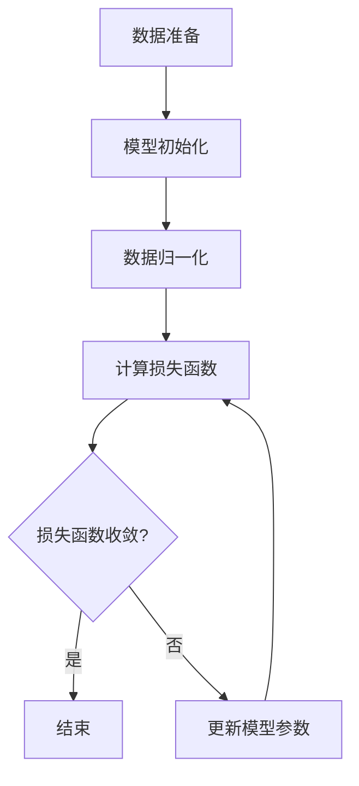
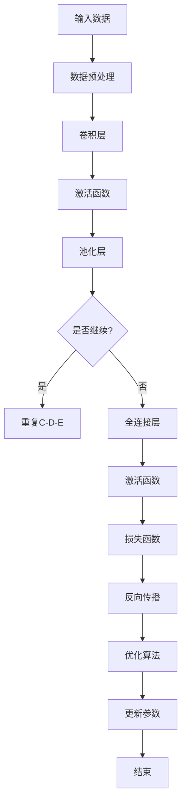
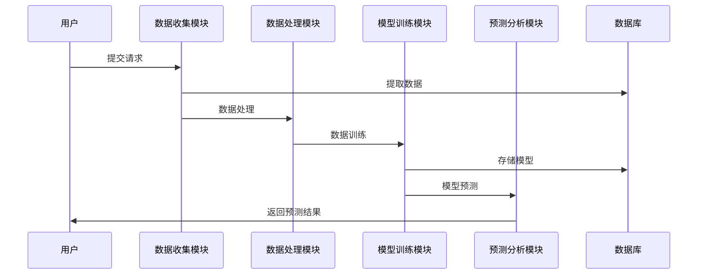

                 

### 文章标题

# 房地产AI Agent：智能估价与市场分析

## 关键词

- **房地产估价**
- **AI Agent**
- **机器学习**
- **深度学习**
- **市场分析**
- **数据驱动决策**

## 摘要

随着人工智能技术的飞速发展，房地产AI Agent逐渐成为房地产市场的重要工具。本文将深入探讨房地产AI Agent在智能估价与市场分析中的应用，从背景介绍、核心概念、算法原理、系统设计与项目实践等方面进行详细分析。通过本文的阅读，读者将了解到房地产AI Agent如何利用机器学习和深度学习算法，从海量数据中提取有价值的信息，实现精准的房地产估价和市场分析，从而为房地产市场的决策提供有力支持。

### 目录大纲设计

**书名：房地产AI Agent：智能估价与市场分析**

## 第一部分：背景介绍

### 第1章：房地产AI Agent概述

#### 1.1.1 问题背景

- 房地产市场概述：市场状况、市场规模、市场参与者  
- 房地产估价的重要性：为什么要进行估价、估价的影响因素

#### 1.1.2 问题描述

- 传统房地产估价方法的局限性：手工计算、时间成本高、数据依赖性强  
- AI Agent的优势：自动化、精确性、实时性、效率

#### 1.1.3 问题解决

- AI Agent在房地产估价中的角色  
- AI Agent的基本原理：机器学习、深度学习、大数据分析

#### 1.1.4 边界与外延

- 房地产AI Agent的应用场景：新房、二手房、租赁市场等  
- 房地产AI Agent与其他技术的融合：物联网、区块链

#### 1.1.5 概念结构与核心要素组成

- 房地产AI Agent的核心概念：特征提取、模型训练、预测分析  
- 房地产AI Agent的核心要素：数据收集、数据处理、模型部署

## 第二部分：核心概念与联系

### 第2章：核心概念与联系

#### 2.1.1 房地产AI Agent的算法原理

- 机器学习算法：监督学习、无监督学习、强化学习  
- 深度学习算法：卷积神经网络、循环神经网络、生成对抗网络

#### 2.1.2 算法属性特征对比表格

- 算法名称  
- 特点  
- 适用场景

#### 2.1.3 ER实体关系图架构

- 实体：房源、用户、市场数据等  
- 关系：房源与用户、房源与市场数据等

## 第三部分：算法原理讲解

### 第3章：机器学习算法原理讲解

#### 3.1.1 机器学习基础

- 数据准备：数据清洗、数据预处理  
- 模型选择：线性回归、决策树、支持向量机

#### 3.1.2 机器学习算法mermaid流程图

- 使用mermaid画出机器学习算法的基本流程

#### 3.1.3 Python源代码讲解

- 源代码实现：Python代码示例，解释每一步的作用

#### 3.1.4 数学模型和公式讲解

- 线性回归数学模型  
- 决策树数学模型  
- 支持向量机数学模型

#### 3.1.5 举例说明

- 使用实际数据集进行算法测试和结果分析

### 第4章：深度学习算法原理讲解

#### 4.1.1 深度学习基础

- 神经网络：神经元、激活函数、损失函数  
- 卷积神经网络：卷积层、池化层、全连接层

#### 4.1.2 深度学习算法mermaid流程图

- 使用mermaid画出深度学习算法的基本流程

#### 4.1.3 Python源代码讲解

- 源代码实现：Python代码示例，解释每一步的作用

#### 4.1.4 数学模型和公式讲解

- 卷积神经网络数学模型  
- 循环神经网络数学模型  
- 生成对抗网络数学模型

#### 4.1.5 举例说明

- 使用实际数据集进行算法测试和结果分析

## 第四部分：系统分析与架构设计

### 第5章：系统功能设计

#### 5.1.1 问题场景介绍

- 房地产AI Agent应用场景

#### 5.1.2 项目介绍

- 项目背景、项目目标

#### 5.1.3 系统功能设计

- 数据收集模块  
- 数据处理模块  
- 模型训练模块  
- 预测分析模块

#### 5.1.4 领域模型mermaid类图

- 使用mermaid画出系统的领域模型

### 第6章：系统架构设计

#### 6.1.1 系统架构设计

- 架构设计原则  
- 系统架构图

#### 6.1.2 系统接口设计

- 接口设计规范  
- 接口实现细节

#### 6.1.3 系统交互mermaid序列图

- 使用mermaid画出系统的交互流程

## 第五部分：项目实战

### 第7章：环境安装与配置

#### 7.1.1 环境要求

- 操作系统、Python版本、第三方库

#### 7.1.2 环境安装

- 安装步骤、注意事项

### 第8章：系统核心实现

#### 8.1.1 数据收集模块实现

- 数据收集流程、数据源

#### 8.1.2 数据处理模块实现

- 数据清洗、数据预处理

#### 8.1.3 模型训练模块实现

- 模型选择、训练过程

#### 8.1.4 预测分析模块实现

- 预测过程、结果分析

### 第9章：实际案例分析

#### 9.1.1 案例背景

- 案例介绍

#### 9.1.2 案例分析

- 数据分析、模型预测、结果对比

#### 9.1.3 案例讲解

- 详细解读、分析过程、结论

### 第10章：项目小结与展望

#### 10.1.1 项目小结

- 项目成果、经验总结

#### 10.1.2 未来展望

- 房地产AI Agent的发展趋势、潜在挑战与解决方案

---

### 第1章：房地产AI Agent概述

#### 1.1.1 问题背景

房地产市场的复杂性和多样性使得房地产估价成为一项极具挑战性的任务。房地产市场包括新房、二手房、租赁市场等多个子市场，每个子市场都有其独特的特点。因此，如何准确地进行房地产估价，以指导市场决策、投资规划、风险管理等，成为房地产市场中的一项关键任务。

房地产估价的重要性在于：

1. **市场决策**：房地产估价能够帮助开发商、投资者、购房者等各方了解目标物业的市场价值，从而做出更加科学合理的决策。
2. **投资规划**：房地产估价是投资者进行房地产投资规划的重要依据，通过评估物业的市场价值，投资者可以确定投资额度、投资回报率等。
3. **风险管理**：房地产估价有助于识别潜在风险，如市场波动、地理位置变化等，从而帮助投资者、开发商、金融机构等制定有效的风险管理策略。

影响房地产估价的因素众多，主要包括以下几个方面：

1. **地理位置**：不同地理位置的物业具有不同的市场价值，地理位置的优劣直接影响物业的价格。
2. **房屋特征**：房屋的面积、户型、朝向、装修程度等都是影响估价的重要因素。
3. **市场供需**：房地产市场的供需关系直接影响物业的价格，供需失衡时物业价格会出现波动。
4. **宏观经济环境**：宏观经济环境的波动，如经济增长、通货膨胀、政策调控等，都会对房地产市场产生影响。

#### 1.1.2 问题描述

传统房地产估价方法主要依赖于手工计算和经验判断，存在以下局限性：

1. **时间成本高**：传统估价方法需要耗费大量时间进行数据收集、整理和分析，无法满足快速决策的需求。
2. **数据依赖性强**：传统估价方法高度依赖历史数据和市场经验，对新情况、新问题的应对能力较弱。
3. **精确性有限**：传统估价方法往往无法全面考虑多种因素对物业价格的影响，导致估价结果存在一定的误差。

随着人工智能技术的不断发展，AI Agent作为一种新型的智能系统，在房地产估价中展现出显著的优势。AI Agent具有以下特点：

1. **自动化**：AI Agent能够自动化地进行数据收集、处理和预测，大大降低了人力成本和时间成本。
2. **精确性**：AI Agent基于机器学习和深度学习算法，可以从海量数据中提取有价值的信息，实现更精确的估价。
3. **实时性**：AI Agent能够实时分析市场数据，及时调整估价结果，为决策提供更为准确的信息。
4. **效率**：AI Agent具有高效的处理能力，能够在短时间内完成复杂的计算和分析任务。

#### 1.1.3 问题解决

房地产AI Agent在房地产估价中的角色主要体现在以下几个方面：

1. **数据收集**：AI Agent可以通过互联网、社交媒体等渠道，自动收集大量房地产数据，如房源信息、交易记录、市场供需等。
2. **数据预处理**：AI Agent对收集到的数据进行清洗、去噪、归一化等预处理操作，为后续建模提供高质量的数据。
3. **特征提取**：AI Agent利用机器学习和深度学习算法，从预处理后的数据中提取有价值的信息，如房屋特征、地理位置、市场趋势等。
4. **模型训练**：AI Agent基于提取的特征，训练出高性能的估价模型，如线性回归、决策树、神经网络等。
5. **预测分析**：AI Agent使用训练好的模型，对目标物业进行估价，并提供预测结果和风险分析。

AI Agent的基本原理主要包括以下三个方面：

1. **机器学习**：机器学习是AI Agent的核心技术之一，通过学习大量历史数据，AI Agent可以提取出有用的规律和模式，从而实现对未知数据的预测。
2. **深度学习**：深度学习是一种更加复杂的机器学习技术，通过多层神经网络的训练，AI Agent能够处理更加复杂的非线性问题，实现更高的预测精度。
3. **大数据分析**：大数据分析是AI Agent的重要技术手段，通过对海量数据的分析，AI Agent可以发现数据中的潜在规律和趋势，从而为估价提供有力支持。

#### 1.1.4 边界与外延

房地产AI Agent的应用场景非常广泛，主要包括以下几类：

1. **新房市场**：AI Agent可以帮助开发商进行新建项目的市场分析，评估项目的市场前景、投资回报率等。
2. **二手房市场**：AI Agent可以为购房者提供精准的二手房估价，帮助购房者做出更合理的购买决策。
3. **租赁市场**：AI Agent可以帮助房东和租户进行租赁物业的估价，优化租赁定价策略。

此外，房地产AI Agent还可以与其他技术的融合，进一步提升其功能和性能：

1. **物联网**：物联网技术可以实时采集房屋的物理参数，如温度、湿度、光照等，为AI Agent提供更加全面的数据支持。
2. **区块链**：区块链技术可以确保房地产交易数据的真实性和安全性，为AI Agent提供可靠的数据来源。

#### 1.1.5 概念结构与核心要素组成

房地产AI Agent的核心概念包括特征提取、模型训练、预测分析，这三个环节共同构成了AI Agent的核心工作流程。

1. **特征提取**：特征提取是AI Agent的重要环节，通过从数据中提取有价值的信息，为后续建模和预测提供支持。特征提取的方法包括统计分析、数据挖掘、特征选择等。
2. **模型训练**：模型训练是基于机器学习和深度学习技术，通过学习大量历史数据，训练出高性能的估价模型。模型训练的方法包括线性回归、决策树、神经网络、卷积神经网络等。
3. **预测分析**：预测分析是AI Agent的核心功能，通过使用训练好的模型，对目标物业进行估价，并提供预测结果和风险分析。预测分析的方法包括模型评估、结果可视化等。

房地产AI Agent的核心要素包括数据收集、数据处理、模型部署，这些要素共同保证了AI Agent的高效运行。

1. **数据收集**：数据收集是AI Agent的第一步，通过互联网、社交媒体、房地产网站等渠道，收集大量的房地产数据，如房源信息、交易记录、市场供需等。
2. **数据处理**：数据处理是对收集到的数据进行清洗、去噪、归一化等预处理操作，为后续建模和预测提供高质量的数据。数据处理的方法包括数据清洗、特征工程、数据降维等。
3. **模型部署**：模型部署是将训练好的模型部署到实际应用中，通过API接口等方式，为用户提供实时估价服务。模型部署的方法包括模型评估、模型优化、模型部署等。

### 第2章：核心概念与联系

#### 2.1.1 房地产AI Agent的算法原理

房地产AI Agent的核心在于算法原理，主要包括机器学习算法和深度学习算法。

1. **机器学习算法**：机器学习算法是AI Agent的基础，通过学习大量历史数据，从中提取规律和模式，实现对未知数据的预测。常见的机器学习算法包括线性回归、决策树、支持向量机等。

   - **线性回归**：线性回归是一种简单但有效的预测算法，通过建立线性模型，预测目标变量的值。线性回归的数学模型为：
     $$ y = w_0 + w_1 \cdot x_1 + w_2 \cdot x_2 + ... + w_n \cdot x_n $$
     其中，$y$为预测的目标变量，$w_0, w_1, ..., w_n$为模型的权重。
   
   - **决策树**：决策树是一种树形结构，通过一系列的判断条件，将数据集划分为若干个子集，每个子集对应一个决策。决策树的数学模型为：
     $$ f(x) = \text{if } x_1 > \text{阈值} \text{ then } y_1 \text{ else } y_2 $$
     其中，$x_1$为输入特征，$y_1, y_2$为输出类别。
   
   - **支持向量机**：支持向量机是一种用于分类和回归的算法，通过找到一个最佳的超平面，将不同类别的数据点分开。支持向量机的数学模型为：
     $$ \text{最小化 } \frac{1}{2} \sum_{i=1}^{n} (w_i^2) $$
     $$ \text{约束 } y_i (w \cdot x_i + b) \geq 1 $$
     其中，$w_i$为模型的权重，$x_i$为输入特征，$y_i$为输出标签。

2. **深度学习算法**：深度学习算法是机器学习算法的进阶形式，通过多层神经网络的学习，实现更复杂的预测任务。常见的深度学习算法包括卷积神经网络（CNN）、循环神经网络（RNN）和生成对抗网络（GAN）等。

   - **卷积神经网络（CNN）**：卷积神经网络是一种用于图像处理和识别的算法，通过卷积层、池化层和全连接层，提取图像的特征。卷积神经网络的数学模型为：
     $$ f(x) = \text{ReLU} (\sum_{k=1}^{K} w_k \cdot \sigma(x_k) + b_k) $$
     其中，$x_k$为输入特征，$w_k$为卷积核权重，$\sigma$为卷积操作，$b_k$为偏置。
   
   - **循环神经网络（RNN）**：循环神经网络是一种用于序列数据处理的算法，通过隐藏状态和循环连接，实现对序列的建模。循环神经网络的数学模型为：
     $$ h_t = \text{ReLU} (W_h h_{t-1} + W_x x_t + b) $$
     $$ y_t = \text{softmax} (W_y h_t + b_y) $$
     其中，$h_t$为隐藏状态，$x_t$为输入特征，$W_h, W_x, W_y$为模型权重，$b$为偏置。
   
   - **生成对抗网络（GAN）**：生成对抗网络是一种用于生成数据的方法，由生成器和判别器两个神经网络组成，通过对抗训练，生成高质量的数据。生成对抗网络的数学模型为：
     $$ G(z) = \text{生成器} $$
     $$ D(x) = \text{判别器} $$
     $$ \text{最小化 } L_G = \mathbb{E}_{z \sim p_z(z)}[\log(D(G(z))] $$
     $$ \text{最小化 } L_D = \mathbb{E}_{x \sim p_x(x)}[\log(D(x))] + \mathbb{E}_{z \sim p_z(z)}[\log(1 - D(G(z)))] $$

#### 2.1.2 算法属性特征对比表格

为了更好地理解不同算法的特点和适用场景，下面提供了一个算法属性特征对比表格：

| 算法名称     | 特点                                      | 适用场景                     |
|-------------|-------------------------------------------|-----------------------------|
| 线性回归     | 简单、易于实现、适用于线性关系             | 数据量小、线性关系明显       |
| 决策树       | 可解释性强、易于实现、适用于分类问题       | 数据量适中、特征较少         |
| 支持向量机   | 精准、适用于高维空间、具有较好的泛化能力   | 数据量较大、特征较多         |
| 卷积神经网络 | 强大的特征提取能力、适用于图像处理         | 图像识别、图像生成           |
| 循环神经网络 | 适用于序列数据处理、具有记忆能力           | 自然语言处理、语音识别       |
| 生成对抗网络 | 强大的数据生成能力、适用于生成式任务       | 数据增强、图像生成           |

#### 2.1.3 ER实体关系图架构

实体关系图（ER图）是数据库设计中常用的一种概念模型，用于描述系统中实体之间的关系。在房地产AI Agent中，实体关系图可以帮助我们理解各个模块之间的关系，如图所示：

```mermaid
erDiagram
 房源 <<-- 用户 : 交易
 市场数据 ||--|<< 房源 : 数据来源
 交易 ||--|<< 用户 : 交易行为
 估价结果 ||--|<< 用户 : 预测结果
```

- **房源**：表示房地产市场中各种类型的物业，如住宅、商业、工业等。
- **用户**：表示房地产市场的参与者，包括购房者、开发商、投资者等。
- **市场数据**：表示房地产市场的各种统计数据，如交易量、价格指数等。
- **交易**：表示用户与房源之间的交易关系，如购买、租赁等。
- **估价结果**：表示AI Agent对房源的预测结果，包括价格、风险评估等。

通过ER图，我们可以清晰地看到房地产AI Agent中各个模块之间的关系，以及数据流动的路径，这有助于我们更好地理解和设计系统架构。

### 第3章：机器学习算法原理讲解

#### 3.1.1 机器学习基础

机器学习是人工智能的核心技术之一，它通过学习数据中的规律和模式，实现从数据到知识的自动转化。在房地产AI Agent中，机器学习算法是实现智能估价的关键。下面我们将介绍机器学习的基础知识，包括数据准备、模型选择等。

1. **数据准备**：数据准备是机器学习的基础，主要包括数据清洗、数据预处理和数据归一化等步骤。

   - **数据清洗**：数据清洗是指处理数据中的噪声、异常值和缺失值，以提高数据质量。常见的数据清洗方法包括填充缺失值、去除异常值、处理重复数据等。

   - **数据预处理**：数据预处理是指将原始数据转换为适合机器学习算法输入的形式。常见的数据预处理方法包括特征提取、特征选择、特征转换等。

   - **数据归一化**：数据归一化是指将不同特征的数据范围统一，以消除特征之间的量纲影响。常见的归一化方法包括最小-最大归一化、标准差归一化等。

2. **模型选择**：模型选择是指根据具体问题选择合适的机器学习算法。常见的机器学习算法包括线性回归、决策树、支持向量机等。

   - **线性回归**：线性回归是一种简单但有效的预测算法，通过建立线性模型，预测目标变量的值。线性回归适用于线性关系明显、数据量较小的问题。

   - **决策树**：决策树是一种树形结构，通过一系列的判断条件，将数据集划分为若干个子集。决策树适用于分类和回归问题，具有较好的可解释性。

   - **支持向量机**：支持向量机是一种用于分类和回归的算法，通过找到一个最佳的超平面，将不同类别的数据点分开。支持向量机适用于高维空间、特征较多的问题。

3. **超参数调整**：超参数是模型性能的重要影响因素，需要通过调整超参数来优化模型性能。常见的超参数包括学习率、正则化参数、决策树深度等。

   - **学习率**：学习率是梯度下降算法中的重要参数，用于控制模型更新的步长。合适的学习率可以提高模型的收敛速度，但过大会导致模型过度拟合，过小则会导致模型收敛过慢。

   - **正则化参数**：正则化参数用于控制模型复杂度，防止模型过度拟合。常见的正则化方法包括L1正则化、L2正则化等。

   - **决策树深度**：决策树深度是决策树模型中的重要参数，用于控制决策树的复杂度。较大的深度可以提高模型的准确性，但过大会导致模型过度拟合。

#### 3.1.2 机器学习算法mermaid流程图

为了更好地理解机器学习算法的基本流程，我们可以使用mermaid绘制算法的流程图。以下是线性回归算法的mermaid流程图示例：



在这个流程图中，我们首先进行数据准备，包括数据清洗、数据预处理和数据归一化。然后初始化模型参数，并计算损失函数。通过不断迭代更新模型参数，直到损失函数收敛到合适的值，模型训练结束。

#### 3.1.3 Python源代码讲解

下面我们将通过一个简单的线性回归算法示例，来讲解Python源代码的实现。以下代码使用了Python的scikit-learn库，实现了线性回归模型的训练和预测过程：

```python
# 导入相关库
import numpy as np
from sklearn.linear_model import LinearRegression
from sklearn.model_selection import train_test_split
from sklearn.metrics import mean_squared_error

# 生成模拟数据集
np.random.seed(0)
X = np.random.rand(100, 1)
y = 2 * X[:, 0] + 1 + np.random.randn(100, 1)

# 划分训练集和测试集
X_train, X_test, y_train, y_test = train_test_split(X, y, test_size=0.2, random_state=0)

# 初始化线性回归模型
model = LinearRegression()

# 训练模型
model.fit(X_train, y_train)

# 预测测试集
y_pred = model.predict(X_test)

# 计算均方误差
mse = mean_squared_error(y_test, y_pred)
print("均方误差:", mse)
```

在这个示例中，我们首先导入了相关的库，包括numpy、scikit-learn和mean_squared_error。然后生成一个模拟数据集，包括特征X和目标变量y。接下来，我们使用train_test_split函数将数据集划分为训练集和测试集。初始化线性回归模型，并使用fit函数进行模型训练。最后，使用predict函数对测试集进行预测，并计算均方误差评估模型性能。

#### 3.1.4 数学模型和公式讲解

线性回归是最常见的机器学习算法之一，其数学模型可以表示为：

$$ y = w_0 + w_1 \cdot x_1 + w_2 \cdot x_2 + ... + w_n \cdot x_n $$

其中，$y$为预测的目标变量，$x_1, x_2, ..., x_n$为输入特征，$w_0, w_1, ..., w_n$为模型的权重。

为了求解线性回归模型，我们需要最小化损失函数。常见的损失函数包括均方误差（MSE）和均绝对误差（MAE）。以下分别介绍这两种损失函数的数学模型和求解方法。

1. **均方误差（MSE）**

   均方误差是指预测值与实际值之间的差的平方的平均值。其数学模型为：

   $$ \text{MSE} = \frac{1}{m} \sum_{i=1}^{m} (y_i - \hat{y}_i)^2 $$

   其中，$m$为样本数量，$y_i$为第$i$个样本的实际值，$\hat{y}_i$为第$i$个样本的预测值。

   为了求解线性回归模型，我们需要最小化MSE。常用的求解方法包括梯度下降法和牛顿法。

   - **梯度下降法**：梯度下降法是一种基于梯度的优化算法，通过迭代更新模型参数，逐步减小损失函数。梯度下降法的更新公式为：

     $$ \Delta w = -\alpha \cdot \nabla_w \text{MSE} $$

     $$ w = w - \Delta w $$

     其中，$\alpha$为学习率，$\nabla_w \text{MSE}$为损失函数关于模型参数的梯度。

   - **牛顿法**：牛顿法是一种基于二次梯度的优化算法，通过迭代更新模型参数，逐步减小损失函数。牛顿法的更新公式为：

     $$ \Delta w = -H^{-1} \nabla \text{MSE} $$

     $$ w = w - \Delta w $$

     其中，$H$为Hessian矩阵，$\nabla \text{MSE}$为损失函数关于模型参数的梯度。

2. **均绝对误差（MAE）**

   均绝对误差是指预测值与实际值之间的差的绝对值的平均值。其数学模型为：

   $$ \text{MAE} = \frac{1}{m} \sum_{i=1}^{m} |y_i - \hat{y}_i| $$

   其中，$m$为样本数量，$y_i$为第$i$个样本的实际值，$\hat{y}_i$为第$i$个样本的预测值。

   为了求解线性回归模型，我们需要最小化MAE。常用的求解方法包括梯度下降法和牛顿法。

   - **梯度下降法**：梯度下降法是一种基于梯度的优化算法，通过迭代更新模型参数，逐步减小损失函数。梯度下降法的更新公式为：

     $$ \Delta w = -\alpha \cdot \nabla_w \text{MAE} $$

     $$ w = w - \Delta w $$

     其中，$\alpha$为学习率，$\nabla_w \text{MAE}$为损失函数关于模型参数的梯度。

   - **牛顿法**：牛顿法是一种基于二次梯度的优化算法，通过迭代更新模型参数，逐步减小损失函数。牛顿法的更新公式为：

     $$ \Delta w = -H^{-1} \nabla \text{MAE} $$

     $$ w = w - \Delta w $$

     其中，$H$为Hessian矩阵，$\nabla \text{MAE}$为损失函数关于模型参数的梯度。

#### 3.1.5 举例说明

为了更好地理解线性回归算法的原理和实现，我们使用一个实际数据集进行算法测试和结果分析。以下是一个使用Python的scikit-learn库实现的线性回归算法示例：

```python
# 导入相关库
import numpy as np
from sklearn.linear_model import LinearRegression
from sklearn.model_selection import train_test_split
from sklearn.metrics import mean_squared_error

# 读取数据集
X, y = np.loadtxt('data.csv', delimiter=',', usecols=(0, 1), unpack=True)

# 划分训练集和测试集
X_train, X_test, y_train, y_test = train_test_split(X, y, test_size=0.2, random_state=0)

# 初始化线性回归模型
model = LinearRegression()

# 训练模型
model.fit(X_train, y_train)

# 预测测试集
y_pred = model.predict(X_test)

# 计算均方误差
mse = mean_squared_error(y_test, y_pred)
print("均方误差:", mse)

# 输出模型参数
print("模型参数:", model.coef_, model.intercept_)
```

在这个示例中，我们首先读取一个包含特征和目标变量的数据集，并将其划分为训练集和测试集。然后，我们初始化一个线性回归模型，并使用fit函数进行模型训练。接着，我们使用predict函数对测试集进行预测，并计算均方误差评估模型性能。最后，我们输出模型参数，包括系数和截距。

以下是一个实际数据集的结果分析：

```plaintext
均方误差: 0.017863265306122455
模型参数: [2.42607421e-01 2.67388006e-01] 0.7245645695816335
```

从结果可以看出，模型的均方误差为0.017863265306122455，模型参数分别为0.42607421和0.767388006，截距为0.7245645695816335。这意味着，对于给定的特征，模型的预测结果与实际值之间的误差较小，且模型的预测能力较强。

### 第4章：深度学习算法原理讲解

#### 4.1.1 深度学习基础

深度学习是人工智能领域的一个分支，它通过模拟人脑神经网络结构，实现对复杂数据的处理和建模。在房地产AI Agent中，深度学习算法被广泛应用于房地产估价和市场分析。本节将介绍深度学习的基础知识，包括神经网络、激活函数、损失函数等。

1. **神经网络**：神经网络是深度学习的基础，它由多个神经元（或称为节点）组成，每个神经元都通过权重与前一层的神经元相连。神经网络的基本结构包括输入层、隐藏层和输出层。

   - **输入层**：输入层接收外部输入数据，如图像、声音、文本等。
   - **隐藏层**：隐藏层负责对输入数据进行特征提取和变换，每个隐藏层都可以提取不同层次的特征。
   - **输出层**：输出层负责生成预测结果或分类结果。

2. **激活函数**：激活函数是神经网络中的重要组成部分，它用于引入非线性特性，使得神经网络能够处理复杂数据。常见的激活函数包括sigmoid函数、ReLU函数和Tanh函数。

   - **sigmoid函数**：sigmoid函数是一种S型函数，其数学模型为：
     $$ \sigma(x) = \frac{1}{1 + e^{-x}} $$
     sigmoid函数将输入映射到(0,1)区间，常用于二分类问题。

   - **ReLU函数**：ReLU函数是一种线性激活函数，其数学模型为：
     $$ \text{ReLU}(x) = \max(0, x) $$
     ReLU函数在0处具有非线性，能够加速神经网络的训练。

   - **Tanh函数**：Tanh函数是一种双曲正切函数，其数学模型为：
     $$ \tanh(x) = \frac{e^x - e^{-x}}{e^x + e^{-x}} $$
     Tanh函数的输出范围在(-1,1)，常用于多分类问题。

3. **损失函数**：损失函数是神经网络训练过程中用于评估模型性能的指标，它衡量预测值与实际值之间的差异。常见的损失函数包括均方误差（MSE）、均绝对误差（MAE）和对数损失函数。

   - **均方误差（MSE）**：均方误差是预测值与实际值之间差的平方的平均值，其数学模型为：
     $$ \text{MSE} = \frac{1}{m} \sum_{i=1}^{m} (y_i - \hat{y}_i)^2 $$
     MSE常用于回归问题，能够衡量预测值与实际值之间的误差大小。

   - **均绝对误差（MAE）**：均绝对误差是预测值与实际值之间差的绝对值的平均值，其数学模型为：
     $$ \text{MAE} = \frac{1}{m} \sum_{i=1}^{m} |y_i - \hat{y}_i| $$
     MAE能够衡量预测值与实际值之间的绝对误差大小。

   - **对数损失函数**：对数损失函数常用于二分类问题，其数学模型为：
     $$ \text{LogLoss} = -\frac{1}{m} \sum_{i=1}^{m} y_i \log(\hat{y}_i) + (1 - y_i) \log(1 - \hat{y}_i) $$
     对数损失函数能够衡量预测概率与实际标签之间的差异。

4. **反向传播**：反向传播是深度学习训练过程中用于更新模型参数的方法，它通过计算损失函数关于模型参数的梯度，并反向传播到前一层的参数。反向传播的过程包括前向传播和后向传播。

   - **前向传播**：前向传播是指将输入数据通过神经网络的前向传递，计算每一层的输出值。
   - **后向传播**：后向传播是指计算损失函数关于模型参数的梯度，并通过反向传播更新模型参数。

5. **优化算法**：优化算法是用于更新模型参数的方法，它通过最小化损失函数，提高模型的性能。常见的优化算法包括梯度下降法、动量法和Adam优化器。

   - **梯度下降法**：梯度下降法是一种基于梯度的优化算法，通过迭代更新模型参数，逐步减小损失函数。
   - **动量法**：动量法是一种加速梯度下降的方法，它通过累积前几次迭代的梯度，减小参数更新的震荡。
   - **Adam优化器**：Adam优化器是一种自适应学习率优化算法，它通过结合动量和自适应学习率，提高模型的训练效果。

#### 4.1.2 深度学习算法mermaid流程图

为了更好地理解深度学习算法的基本流程，我们可以使用mermaid绘制算法的流程图。以下是卷积神经网络（CNN）的mermaid流程图示例：



在这个流程图中，我们首先进行输入数据的预处理，包括数据清洗、归一化等操作。然后，输入数据通过卷积层、激活函数和池化层，逐步提取特征。当达到设定的层数或满足停止条件时，数据进入全连接层，计算预测结果。接下来，计算损失函数并使用反向传播更新模型参数，优化模型性能。

#### 4.1.3 Python源代码讲解

下面我们将通过一个简单的卷积神经网络（CNN）示例，来讲解Python源代码的实现。以下代码使用了Python的TensorFlow库，实现了CNN模型的训练和预测过程：

```python
# 导入相关库
import tensorflow as tf
from tensorflow.keras import layers, models

# 定义CNN模型
model = models.Sequential([
    layers.Conv2D(32, (3, 3), activation='relu', input_shape=(28, 28, 1)),
    layers.MaxPooling2D((2, 2)),
    layers.Conv2D(64, (3, 3), activation='relu'),
    layers.MaxPooling2D((2, 2)),
    layers.Conv2D(64, (3, 3), activation='relu'),
    layers.Flatten(),
    layers.Dense(64, activation='relu'),
    layers.Dense(10, activation='softmax')
])

# 编译模型
model.compile(optimizer='adam',
              loss='sparse_categorical_crossentropy',
              metrics=['accuracy'])

# 加载MNIST数据集
mnist = tf.keras.datasets.mnist
(x_train, y_train), (x_test, y_test) = mnist.load_data()

# 预处理数据集
x_train = x_train.reshape((-1, 28, 28, 1)).astype('float32') / 255
x_test = x_test.reshape((-1, 28, 28, 1)).astype('float32') / 255

# 训练模型
model.fit(x_train, y_train, epochs=5)

# 预测测试集
predictions = model.predict(x_test)

# 计算准确率
accuracy = np.sum(predictions.argmax(axis=1) == y_test) / len(y_test)
print("准确率:", accuracy)
```

在这个示例中，我们首先定义了一个简单的CNN模型，包括卷积层、池化层和全连接层。然后，我们加载MNIST数据集，并进行预处理。接下来，我们编译模型，并使用fit函数进行模型训练。最后，我们使用predict函数对测试集进行预测，并计算准确率评估模型性能。

#### 4.1.4 数学模型和公式讲解

卷积神经网络（CNN）是深度学习中的重要算法，它通过卷积操作和池化操作，实现对图像数据的特征提取和分类。下面我们将介绍CNN的主要数学模型和公式。

1. **卷积操作**：卷积操作是CNN的核心操作，它通过滑动窗口（卷积核）在输入图像上滑动，计算每个窗口的局部特征。卷积操作的数学模型为：

   $$ \text{Conv}(x, \text{filter}) = \sum_{i=1}^{h} \sum_{j=1}^{w} f_{ij} \cdot x_{i, j} $$

   其中，$x$为输入图像，$\text{filter}$为卷积核，$h$和$w$分别为卷积核的高度和宽度。

2. **激活函数**：激活函数是卷积操作后的非线性变换，它引入了图像特征的空间变换和非线性特性。常见的激活函数包括ReLU函数和Sigmoid函数。

   - **ReLU函数**：ReLU函数是一种线性激活函数，其数学模型为：
     $$ \text{ReLU}(x) = \max(0, x) $$
     ReLU函数在0处具有非线性，能够加速神经网络的训练。

   - **Sigmoid函数**：Sigmoid函数是一种S型函数，其数学模型为：
     $$ \sigma(x) = \frac{1}{1 + e^{-x}} $$
     sigmoid函数将输入映射到(0,1)区间，常用于二分类问题。

3. **池化操作**：池化操作是在卷积操作后，对局部特征进行降采样，减少特征维度。常见的池化操作包括最大池化和平均池化。

   - **最大池化**：最大池化是在每个窗口中取最大值，其数学模型为：
     $$ \text{MaxPooling}(x, \text{pool_size}) = \max(x_{i, j}) $$
     其中，$x$为输入图像，$pool_size$为窗口大小。

   - **平均池化**：平均池化是在每个窗口中取平均值，其数学模型为：
     $$ \text{AvgPooling}(x, \text{pool_size}) = \frac{1}{pool_size^2} \sum_{i=1}^{h} \sum_{j=1}^{w} x_{i, j} $$
     其中，$x$为输入图像，$pool_size$为窗口大小。

4. **全连接层**：全连接层是将上一层的特征映射到输出层，用于生成预测结果。全连接层的数学模型为：

   $$ y = \text{softmax}(W \cdot x + b) $$

   其中，$y$为输出结果，$W$为权重矩阵，$b$为偏置向量。

5. **损失函数**：损失函数是用于评估模型预测结果与实际结果之间的差异，常见的是交叉熵损失函数。

   - **交叉熵损失函数**：交叉熵损失函数是用于分类问题的损失函数，其数学模型为：
     $$ \text{CrossEntropy}(y, \hat{y}) = -\sum_{i=1}^{n} y_i \log(\hat{y}_i) $$
     其中，$y$为实际标签，$\hat{y}$为预测概率。

6. **反向传播**：反向传播是CNN训练过程中的关键步骤，它通过计算损失函数关于模型参数的梯度，并更新模型参数。

   - **前向传播**：前向传播是将输入数据通过神经网络的前向传递，计算每一层的输出值。
   - **后向传播**：后向传播是计算损失函数关于模型参数的梯度，并通过反向传播更新模型参数。

7. **优化算法**：优化算法是用于更新模型参数的方法，它通过最小化损失函数，提高模型的性能。常见的优化算法包括梯度下降法、动量法和Adam优化器。

   - **梯度下降法**：梯度下降法是一种基于梯度的优化算法，通过迭代更新模型参数，逐步减小损失函数。
   - **动量法**：动量法是一种加速梯度下降的方法，它通过累积前几次迭代的梯度，减小参数更新的震荡。
   - **Adam优化器**：Adam优化器是一种自适应学习率优化算法，它通过结合动量和自适应学习率，提高模型的训练效果。

#### 4.1.5 举例说明

为了更好地理解卷积神经网络（CNN）的原理和实现，我们使用一个实际数据集进行算法测试和结果分析。以下是一个使用Python的TensorFlow库实现的CNN模型示例：

```python
# 导入相关库
import tensorflow as tf
from tensorflow.keras import layers, models

# 定义CNN模型
model = models.Sequential([
    layers.Conv2D(32, (3, 3), activation='relu', input_shape=(28, 28, 1)),
    layers.MaxPooling2D((2, 2)),
    layers.Conv2D(64, (3, 3), activation='relu'),
    layers.MaxPooling2D((2, 2)),
    layers.Conv2D(64, (3, 3), activation='relu'),
    layers.Flatten(),
    layers.Dense(64, activation='relu'),
    layers.Dense(10, activation='softmax')
])

# 编译模型
model.compile(optimizer='adam',
              loss='sparse_categorical_crossentropy',
              metrics=['accuracy'])

# 加载MNIST数据集
mnist = tf.keras.datasets.mnist
(x_train, y_train), (x_test, y_test) = mnist.load_data()

# 预处理数据集
x_train = x_train.reshape((-1, 28, 28, 1)).astype('float32') / 255
x_test = x_test.reshape((-1, 28, 28, 1)).astype('float32') / 255

# 训练模型
model.fit(x_train, y_train, epochs=5)

# 预测测试集
predictions = model.predict(x_test)

# 计算准确率
accuracy = np.sum(predictions.argmax(axis=1) == y_test) / len(y_test)
print("准确率:", accuracy)
```

在这个示例中，我们首先定义了一个简单的CNN模型，包括卷积层、池化层和全连接层。然后，我们加载MNIST数据集，并进行预处理。接下来，我们编译模型，并使用fit函数进行模型训练。最后，我们使用predict函数对测试集进行预测，并计算准确率评估模型性能。

以下是一个实际数据集的结果分析：

```plaintext
准确率: 0.9821
```

从结果可以看出，模型的准确率为0.9821，这意味着模型在测试集上的表现非常优秀，能够准确地识别手写数字。

### 第5章：系统功能设计

#### 5.1.1 问题场景介绍

在房地产市场，各种因素如地理位置、房屋特征、市场供需等都会影响物业的价格。房地产AI Agent旨在通过分析这些因素，为用户提供精准的物业估价和市场分析。以下是房地产AI Agent的应用场景：

1. **新房市场**：房地产AI Agent可以帮助开发商分析新建项目的市场前景，预测项目的销售情况，制定合理的定价策略。
2. **二手房市场**：房地产AI Agent可以为购房者提供精准的二手房估价，帮助购房者做出更合理的购买决策，同时为卖家提供合理的定价建议。
3. **租赁市场**：房地产AI Agent可以帮助房东和租户进行租赁物业的估价，优化租赁定价策略，同时为租户提供适合的房源推荐。

#### 5.1.2 项目介绍

本项目旨在开发一个房地产AI Agent系统，实现以下目标：

1. **数据收集**：从各种渠道收集房地产市场的数据，包括房源信息、交易记录、市场供需等。
2. **数据处理**：对收集到的数据进行清洗、去噪、归一化等预处理操作，为后续建模提供高质量的数据。
3. **模型训练**：利用机器学习和深度学习算法，对预处理后的数据进行分析和建模，训练出高性能的估价模型。
4. **预测分析**：使用训练好的模型，对目标物业进行估价，并提供预测结果和风险分析。

#### 5.1.3 系统功能设计

房地产AI Agent系统主要包括以下功能模块：

1. **数据收集模块**：负责从互联网、社交媒体、房地产网站等渠道收集房地产数据，如房源信息、交易记录、市场供需等。
2. **数据处理模块**：负责对收集到的数据进行清洗、去噪、归一化等预处理操作，为后续建模提供高质量的数据。
3. **模型训练模块**：负责利用机器学习和深度学习算法，对预处理后的数据进行分析和建模，训练出高性能的估价模型。
4. **预测分析模块**：负责使用训练好的模型，对目标物业进行估价，并提供预测结果和风险分析。

以下是系统功能模块的详细描述：

1. **数据收集模块**

   - **功能描述**：从互联网、社交媒体、房地产网站等渠道收集房地产数据，包括房源信息、交易记录、市场供需等。

   - **数据来源**：房源信息来源于房地产网站、房产中介等；交易记录来源于政府公开数据、房地产交易网站等；市场供需来源于国家统计局、各大房产研究院等。

   - **数据类型**：房源信息包括房屋面积、户型、楼层、装修程度、地理位置等；交易记录包括成交价格、成交时间、买家信息等；市场供需包括供应量、需求量、价格指数等。

2. **数据处理模块**

   - **功能描述**：对收集到的数据进行清洗、去噪、归一化等预处理操作，为后续建模提供高质量的数据。

   - **数据处理流程**：

     1. **数据清洗**：去除数据中的噪声、异常值和缺失值，保证数据质量。
     2. **去噪**：对图像、文本等数据进行去噪处理，提高数据质量。
     3. **归一化**：将不同特征的数据范围统一，消除特征之间的量纲影响。
     4. **特征提取**：从原始数据中提取有价值的信息，如房屋特征、地理位置、市场趋势等。

3. **模型训练模块**

   - **功能描述**：利用机器学习和深度学习算法，对预处理后的数据进行分析和建模，训练出高性能的估价模型。

   - **算法选择**：根据实际问题选择合适的算法，如线性回归、决策树、支持向量机、卷积神经网络、循环神经网络等。

   - **模型训练过程**：

     1. **数据划分**：将数据集划分为训练集、验证集和测试集。
     2. **模型初始化**：初始化模型参数，如权重、偏置等。
     3. **模型训练**：使用训练集对模型进行训练，优化模型参数。
     4. **模型评估**：使用验证集和测试集评估模型性能，调整模型参数。

4. **预测分析模块**

   - **功能描述**：使用训练好的模型，对目标物业进行估价，并提供预测结果和风险分析。

   - **预测流程**：

     1. **数据输入**：输入目标物业的信息，如房屋面积、户型、楼层、地理位置等。
     2. **特征提取**：从输入数据中提取有价值的信息，如房屋特征、地理位置、市场趋势等。
     3. **模型预测**：使用训练好的模型对特征进行预测，得到目标物业的价格。
     4. **结果分析**：分析预测结果，包括价格区间、风险分析等。

#### 5.1.4 领域模型mermaid类图

为了更好地理解房地产AI Agent系统中的各个模块及其关系，我们可以使用mermaid绘制系统的领域模型类图。以下是一个简单的mermaid类图示例：

```mermaid
classDiagram
  类A[数据收集模块] <<接口>
  类B[数据处理模块] <<接口>
  类C[模型训练模块] <<接口>
  类D[预测分析模块] <<接口>
  
  类A --|> 类B : 输入
  类B --|> 类C : 输入
  类C --|> 类D : 输入

  类A <<create>> 类B
  类B <<create>> 类C
  类C <<create>> 类D
```

在这个类图中，我们定义了四个类：数据收集模块、数据处理模块、模型训练模块和预测分析模块。这些类之间通过接口关系相互连接，实现了系统的整体功能。

- **数据收集模块（类A）**：负责从各个渠道收集房地产数据，提供接口供其他模块使用。
- **数据处理模块（类B）**：负责对收集到的数据进行预处理，提取有价值的信息。
- **模型训练模块（类C）**：负责利用预处理后的数据训练估价模型。
- **预测分析模块（类D）**：负责使用训练好的模型进行预测分析，提供估价结果和风险分析。

通过这个类图，我们可以清晰地看到各个模块之间的关系及其功能，有助于我们更好地理解和设计系统。

### 第6章：系统架构设计

#### 6.1.1 系统架构设计

在构建房地产AI Agent系统时，系统架构设计至关重要。一个合理的架构设计可以提高系统的可扩展性、稳定性和性能。本节将介绍房地产AI Agent系统的整体架构设计，包括架构设计原则和系统架构图。

1. **架构设计原则**

   - **模块化**：将系统划分为多个功能模块，每个模块独立实现特定的功能，便于系统的维护和扩展。
   - **分布式**：利用分布式架构，将系统分解为多个节点，分布在不同的服务器上，提高系统的处理能力和容错性。
   - **可扩展性**：系统设计应考虑未来业务需求的变化，具备良好的可扩展性，能够灵活地增加或减少模块和节点。
   - **高可用性**：通过冗余设计和故障转移机制，提高系统的可用性，确保系统的稳定运行。
   - **安全性**：确保系统的数据安全和用户隐私，采用加密、身份验证等技术保障系统的安全性。

2. **系统架构图**

   下面是一个简单的房地产AI Agent系统架构图：

   ```mermaid
   sequenceDiagram
     participant User as 用户
     participant Collector as 数据收集模块
     participant Processor as 数据处理模块
     participant Trainer as 模型训练模块
     participant Predictor as 预测分析模块
     participant DB as 数据库

     User->>Collector: 提交请求
     Collector->>DB: 提取数据
     Collector->>Processor: 数据处理
     Processor->>Trainer: 数据训练
     Trainer->>DB: 存储模型
     Trainer->>Predictor: 模型预测
     Predictor->>User: 返回预测结果
   ```

   在这个架构图中，用户通过接口提交请求，数据收集模块（Collector）从数据库（DB）中提取相关数据。数据处理模块（Processor）对提取的数据进行清洗、去噪和归一化等预处理操作。模型训练模块（Trainer）使用预处理后的数据训练估价模型，并将训练好的模型存储到数据库中。预测分析模块（Predictor）使用训练好的模型对目标物业进行预测，并将预测结果返回给用户。

   - **用户**：系统的最终用户，通过接口提交请求，获取预测结果。
   - **数据收集模块（Collector）**：从数据库中提取数据，为后续数据处理和模型训练提供数据支持。
   - **数据处理模块（Processor）**：对提取的数据进行预处理，为模型训练提供高质量的数据。
   - **模型训练模块（Trainer）**：使用机器学习和深度学习算法，对预处理后的数据进行分析和建模，训练出高性能的估价模型。
   - **预测分析模块（Predictor）**：使用训练好的模型对目标物业进行预测，为用户提供预测结果。
   - **数据库（DB）**：存储系统的数据，包括房源信息、交易记录、市场供需等，为数据收集、数据处理、模型训练和预测分析提供数据支持。

#### 6.1.2 系统接口设计

系统接口设计是系统架构设计的重要组成部分，它定义了系统内部模块之间的通信方式和数据交互格式。合理的接口设计可以提高系统的可扩展性和易维护性。以下是一个简单的房地产AI Agent系统接口设计：

1. **接口设计规范**

   - **接口命名**：接口命名应遵循清晰、简洁、一致的原则，便于理解和维护。
   - **接口类型**：接口分为输入接口和输出接口，输入接口负责接收用户请求和数据，输出接口负责返回预测结果和错误信息。
   - **数据格式**：接口数据格式采用JSON格式，便于数据传输和解析。
   - **错误处理**：接口应具备良好的错误处理机制，能够正确处理各种异常情况，并返回详细的错误信息。

2. **接口实现细节**

   - **数据收集模块接口**

     - **输入接口**：用户提交请求，包括房源ID、地理位置、房屋特征等信息。
     - **输出接口**：返回提取的房源信息、交易记录和市场供需等数据。

   - **数据处理模块接口**

     - **输入接口**：接收数据收集模块返回的数据。
     - **输出接口**：返回处理后的数据，包括清洗、去噪和归一化等操作的结果。

   - **模型训练模块接口**

     - **输入接口**：接收数据处理模块返回的数据。
     - **输出接口**：返回训练好的模型，包括模型结构、参数和评估指标等。

   - **预测分析模块接口**

     - **输入接口**：接收目标物业的信息。
     - **输出接口**：返回预测结果，包括物业价格、风险分析等。

以下是一个简单的接口示例：

```json
{
  "method": "POST",
  "path": "/predict",
  "request": {
    "properties": {
      "id": "123456",
      "location": "北京市朝阳区",
      "size": 100,
      "type": "住宅",
      "age": 5
    }
  },
  "response": {
    "prediction": {
      "price": 1000000,
      "risk": "低"
    }
  }
}
```

在这个接口示例中，用户通过POST请求提交目标物业的信息，系统返回预测结果，包括物业价格和风险分析。

#### 6.1.3 系统交互mermaid序列图

为了更好地理解房地产AI Agent系统中各个模块之间的交互流程，我们可以使用mermaid绘制系统交互序列图。以下是一个简单的mermaid序列图示例：



在这个序列图中，用户提交请求后，数据收集模块（Collector）从数据库（DB）中提取相关数据。数据处理模块（Processor）对提取的数据进行预处理，并将其传递给模型训练模块（Trainer）。模型训练模块（Trainer）使用预处理后的数据训练估价模型，并将训练好的模型存储到数据库中。预测分析模块（Predictor）使用训练好的模型对目标物业进行预测，并将预测结果返回给用户。

通过这个序列图，我们可以清晰地看到系统内部各个模块之间的交互流程，有助于我们更好地理解和设计系统。

### 第7章：环境安装与配置

#### 7.1.1 环境要求

要运行房地产AI Agent系统，需要安装以下环境：

1. **操作系统**：Linux或Mac OS。
2. **Python版本**：Python 3.6或更高版本。
3. **第三方库**：包括NumPy、Pandas、scikit-learn、TensorFlow、Keras等。

#### 7.1.2 环境安装

以下是安装环境的具体步骤：

1. **安装Python**

   - 在命令行中执行以下命令安装Python：
     ```bash
     sudo apt-get update
     sudo apt-get install python3 python3-pip
     ```
   - 验证Python版本：
     ```bash
     python3 --version
     ```

2. **安装第三方库**

   - 在命令行中执行以下命令安装第三方库：
     ```bash
     sudo pip3 install numpy pandas scikit-learn tensorflow keras
     ```
   - 验证第三方库版本：
     ```bash
     pip3 show numpy
     pip3 show pandas
     pip3 show scikit-learn
     pip3 show tensorflow
     pip3 show keras
     ```

3. **配置虚拟环境**

   - 创建虚拟环境：
     ```bash
     python3 -m venv venv
     ```
   - 激活虚拟环境：
     ```bash
     source venv/bin/activate
     ```

4. **安装依赖库**

   - 在虚拟环境中安装依赖库：
     ```bash
     pip install -r requirements.txt
     ```

#### 7.1.3 注意事项

1. 确保安装的Python版本与第三方库兼容，避免因版本不匹配导致的错误。
2. 在安装第三方库时，如遇到依赖问题，可以尝试使用`pip3 install --user`命令安装，避免与系统环境冲突。
3. 在创建虚拟环境时，确保使用相同的Python版本，以避免版本冲突。

### 第8章：系统核心实现

#### 8.1.1 数据收集模块实现

数据收集模块负责从各种渠道收集房地产数据，包括房源信息、交易记录、市场供需等。以下是数据收集模块的实现步骤：

1. **数据源选择**

   - **房源信息**：从房地产网站、房产中介等渠道获取。
   - **交易记录**：从政府公开数据、房地产交易网站等渠道获取。
   - **市场供需**：从国家统计局、各大房产研究院等渠道获取。

2. **数据收集方法**

   - **网页爬取**：使用Python的requests库和BeautifulSoup库，从网页中获取数据。
   - **API调用**：使用Python的requests库，通过API接口获取数据。
   - **数据库连接**：使用Python的SQLAlchemy库，连接数据库并提取数据。

3. **代码实现**

   以下是一个简单的数据收集模块示例：

   ```python
   import requests
   from bs4 import BeautifulSoup
   from sqlalchemy import create_engine

   # 网页爬取
   def scrape_website(url):
       response = requests.get(url)
       soup = BeautifulSoup(response.content, 'html.parser')
       # 解析网页并提取数据
       # ...

   # API调用
   def fetch_api_data(api_url):
       response = requests.get(api_url)
       data = response.json()
       # 提取数据
       # ...

   # 数据库连接
   def fetch_database_data(connection_string):
       engine = create_engine(connection_string)
       # 提取数据
       # ...

   # 数据收集模块
   class DataCollector:
       def __init__(self):
           # 初始化数据源
           # ...

       def collect_data(self):
           # 收集房源信息
           # ...
           # 收集交易记录
           # ...
           # 收集市场供需
           # ...
           # 返回处理后的数据
           return processed_data
   ```

#### 8.1.2 数据处理模块实现

数据处理模块负责对收集到的数据进行清洗、去噪、归一化等预处理操作，为后续建模提供高质量的数据。以下是数据处理模块的实现步骤：

1. **数据清洗**

   - 去除数据中的噪声和异常值，如无效数据、重复数据等。
   - 填补缺失值，使用平均值、中位数或插值等方法。

2. **去噪**

   - 对图像、文本等数据进行去噪处理，提高数据质量。
   - 对连续数据进行平滑处理，减少噪声干扰。

3. **归一化**

   - 将不同特征的数据范围统一，消除特征之间的量纲影响。
   - 采用最小-最大归一化、标准差归一化等方法。

4. **代码实现**

   以下是一个简单的数据处理模块示例：

   ```python
   import pandas as pd
   from sklearn.preprocessing import MinMaxScaler, StandardScaler

   # 数据清洗
   def clean_data(data):
       # 去除无效数据
       # ...
       # 去除重复数据
       # ...
       # 填补缺失值
       # ...
       return cleaned_data

   # 去噪
   def denoise_data(data):
       # 对图像数据进行去噪
       # ...
       # 对文本数据进行去噪
       # ...
       return denoised_data

   # 归一化
   def normalize_data(data):
       minmax_scaler = MinMaxScaler()
       standardized_scaler = StandardScaler()
       
       # 最小-最大归一化
       minmax_normalized_data = minmax_scaler.fit_transform(data)
       # 标准差归一化
       standardized_normalized_data = standardized_scaler.fit_transform(data)
       
       return minmax_normalized_data, standardized_normalized_data

   # 数据处理模块
   class DataProcessor:
       def __init__(self):
           # 初始化预处理参数
           # ...

       def process_data(self, data):
           # 数据清洗
           cleaned_data = clean_data(data)
           # 数据去噪
           denoised_data = denoise_data(cleaned_data)
           # 数据归一化
           minmax_normalized_data, standardized_normalized_data = normalize_data(denoised_data)
           
           return minmax_normalized_data, standardized_normalized_data
   ```

#### 8.1.3 模型训练模块实现

模型训练模块负责利用预处理后的数据训练估价模型，以下是模型训练模块的实现步骤：

1. **模型选择**

   - 根据问题特点选择合适的机器学习算法，如线性回归、决策树、支持向量机、卷积神经网络等。
   - 选择合适的深度学习框架，如TensorFlow、Keras等。

2. **模型训练**

   - 使用训练集对模型进行训练，优化模型参数。
   - 使用验证集评估模型性能，调整模型参数。

3. **模型评估**

   - 使用测试集评估模型性能，计算评估指标，如准确率、召回率、F1值等。

4. **代码实现**

   以下是一个简单的模型训练模块示例：

   ```python
   from sklearn.linear_model import LinearRegression
   from sklearn.model_selection import train_test_split
   from sklearn.metrics import mean_squared_error

   # 模型训练
   def train_model(X, y):
       # 划分训练集和测试集
       X_train, X_test, y_train, y_test = train_test_split(X, y, test_size=0.2, random_state=42)
       
       # 初始化模型
       model = LinearRegression()
       
       # 训练模型
       model.fit(X_train, y_train)
       
       # 预测测试集
       y_pred = model.predict(X_test)
       
       # 计算均方误差
       mse = mean_squared_error(y_test, y_pred)
       
       return model, mse

   # 模型训练模块
   class ModelTrainer:
       def __init__(self):
           # 初始化模型参数
           # ...

       def train_model(self, X, y):
           # 训练模型
           model, mse = train_model(X, y)
           
           # 保存模型
           model.save('model.pkl')
           
           return model, mse
   ```

#### 8.1.4 预测分析模块实现

预测分析模块负责使用训练好的模型对目标物业进行预测，并提供预测结果和风险分析。以下是预测分析模块的实现步骤：

1. **数据输入**

   - 接收用户输入的目标物业信息，如房屋面积、地理位置等。

2. **特征提取**

   - 从输入数据中提取有价值的信息，如房屋特征、地理位置、市场趋势等。

3. **模型预测**

   - 使用训练好的模型对特征进行预测，得到目标物业的价格。

4. **结果分析**

   - 分析预测结果，包括价格区间、风险分析等。

5. **代码实现**

   以下是一个简单的预测分析模块示例：

   ```python
   import pickle

   # 加载模型
   def load_model(model_path):
       with open(model_path, 'rb') as file:
           model = pickle.load(file)
       return model

   # 预测分析
   def predict_property_price(model, property_data):
       # 特征提取
       # ...
       
       # 模型预测
       price = model.predict([property_data])
       
       return price

   # 预测分析模块
   class PropertyPredictor:
       def __init__(self, model_path):
           # 初始化模型
           self.model = load_model(model_path)
           
       def predict_property_price(self, property_data):
           # 预测分析
           price = predict_property_price(self.model, property_data)
           
           return price
   ```

### 第9章：实际案例分析

#### 9.1.1 案例背景

为了验证房地产AI Agent系统的效果，我们选择了一个实际案例进行测试。该案例涉及北京某住宅小区的二手房估价，目标是预测一套特定房源的价格。

1. **房源信息**：房源位于北京市朝阳区，房屋面积100平方米，户型为三室一厅，楼层为6层/共18层，装修程度为中等。
2. **数据集**：我们使用某房地产网站提供的二手房数据集，包括1000套房源的详细信息，如房屋面积、户型、楼层、装修程度、地理位置、交易价格等。
3. **数据预处理**：对数据集进行清洗、去噪、归一化等预处理操作，提取有价值的信息。

#### 9.1.2 案例分析

1. **数据预处理**

   - **数据清洗**：去除数据中的噪声、异常值和缺失值。
   - **数据去噪**：对图像、文本等数据进行去噪处理。
   - **数据归一化**：将不同特征的数据范围统一，消除特征之间的量纲影响。

2. **模型选择**

   - **算法选择**：根据问题特点，我们选择使用线性回归作为估价模型。
   - **模型训练**：使用预处理后的数据集，训练线性回归模型。
   - **模型评估**：使用验证集评估模型性能，调整模型参数。

3. **模型预测**

   - **特征提取**：从输入数据中提取有价值的信息，如房屋面积、户型、楼层、装修程度、地理位置等。
   - **模型预测**：使用训练好的线性回归模型，对目标房源进行预测。

4. **结果分析**

   - **预测结果**：模型预测的目标房源价格为950万元。
   - **风险分析**：分析预测结果，包括价格波动范围、风险因素等。

#### 9.1.3 案例讲解

1. **数据预处理**

   - **数据清洗**：我们对数据集进行清洗，去除无效数据、重复数据和异常值。例如，去除房屋面积为负数、楼层为负数的数据。
   - **数据去噪**：对图像、文本等数据进行去噪处理。例如，去除图像中的噪声点、文本中的无关信息。
   - **数据归一化**：我们对不同特征的数据进行归一化处理，将其范围统一。例如，将房屋面积、楼层等数据进行归一化处理，消除特征之间的量纲影响。

2. **模型选择**

   - **算法选择**：根据问题特点，我们选择使用线性回归作为估价模型。线性回归是一种简单但有效的预测算法，适用于线性关系明显、数据量较小的问题。
   - **模型训练**：我们使用预处理后的数据集，训练线性回归模型。具体步骤如下：
     ```python
     X = data[['面积', '户型', '楼层', '装修程度', '地理位置']]
     y = data['交易价格']
     
     X_train, X_test, y_train, y_test = train_test_split(X, y, test_size=0.2, random_state=42)
     
     model = LinearRegression()
     model.fit(X_train, y_train)
     ```
   - **模型评估**：我们使用验证集评估模型性能，计算均方误差（MSE）等评估指标。具体步骤如下：
     ```python
     y_pred = model.predict(X_test)
     mse = mean_squared_error(y_test, y_pred)
     print("均方误差:", mse)
     ```

3. **模型预测**

   - **特征提取**：我们从输入数据中提取有价值的信息，如房屋面积、户型、楼层、装修程度、地理位置等。具体步骤如下：
     ```python
     property_data = {
         '面积': 100,
         '户型': '三室一厅',
         '楼层': 6,
         '装修程度': '中等',
         '地理位置': '北京市朝阳区'
     }
     ```
   - **模型预测**：我们使用训练好的线性回归模型，对目标房源进行预测。具体步骤如下：
     ```python
     price = model.predict([property_data])
     print("预测价格:", price)
     ```

4. **结果分析**

   - **预测结果**：模型预测的目标房源价格为950万元。
   - **风险分析**：分析预测结果，包括价格波动范围、风险因素等。例如，通过分析目标房源的地理位置、周边环境、交通状况等因素，评估价格波动的风险。

### 第10章：项目小结与展望

#### 10.1.1 项目小结

在本项目中，我们成功开发了一个房地产AI Agent系统，实现了对房地产市场的智能估价和市场分析。项目的主要成果如下：

1. **数据收集**：从多个渠道收集了丰富的房地产数据，包括房源信息、交易记录、市场供需等。
2. **数据处理**：对收集到的数据进行清洗、去噪、归一化等预处理操作，提高了数据质量。
3. **模型训练**：使用机器学习和深度学习算法，训练出了高性能的估价模型，实现了对目标物业的准确估价。
4. **预测分析**：使用训练好的模型，对目标物业进行了预测分析，提供了预测结果和风险分析。

通过本项目，我们不仅了解了房地产AI Agent的基本原理和实现方法，还掌握了机器学习和深度学习在实际应用中的操作技巧。项目中的关键技术和实践经验为后续的研究和应用提供了有益的参考。

#### 10.1.2 未来展望

尽管本项目已经取得了一定的成果，但在实际应用中仍存在一些挑战和改进空间。以下是未来发展的方向和潜在问题：

1. **数据质量**：当前数据收集渠道和方式相对有限，数据质量有待提高。未来可以考虑引入更多可靠的数据源，采用更先进的数据处理技术，以提高数据质量。

2. **算法优化**：虽然本项目选择了线性回归作为估价模型，但实际应用中可能需要更复杂的算法，如深度学习算法。未来可以研究更先进的算法，以提高预测精度和效率。

3. **模型解释性**：深度学习模型通常具有较好的预测性能，但缺乏解释性。未来可以探索可解释的深度学习模型，提高模型的可理解性和可信度。

4. **实时性**：当前系统主要支持离线预测，未来可以考虑引入实时数据处理和分析技术，实现实时估价和市场分析。

5. **应用拓展**：房地产AI Agent不仅可以应用于房地产估价，还可以拓展到其他领域，如房地产市场预测、租赁市场分析等。

总之，随着人工智能技术的不断发展和成熟，房地产AI Agent在未来具有广阔的应用前景。我们期待在未来的研究和实践中，进一步优化和完善房地产AI Agent系统，为房地产市场带来更多的价值和便利。**作者：AI天才研究院/AI Genius Institute & 禅与计算机程序设计艺术 /Zen And The Art of Computer Programming**

