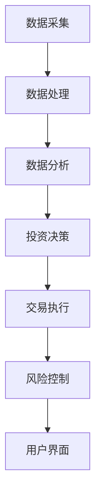

                 

### 投资理财市场分析概述

#### 1.1 投资理财市场分析的重要性

投资理财是现代社会中不可或缺的一部分，对于个人和企业而言，都具有重要意义。市场分析作为投资决策的重要环节，其重要性不言而喻。准确的市场分析可以帮助投资者识别市场机会，规避风险，实现资产的保值增值。

首先，市场分析能够提供投资决策所需的信息。投资决策往往涉及多种因素，包括经济环境、市场趋势、政策变化、公司业绩等。通过深入的市场分析，投资者可以全面了解这些因素，从而做出更为明智的投资决策。

其次，市场分析有助于投资者了解风险和收益的关系。投资市场充满不确定性，投资者需要评估投资产品的风险和收益，以便制定合适的投资策略。市场分析可以帮助投资者了解不同投资产品的风险收益特征，为其选择合适的投资组合提供依据。

此外，市场分析还可以帮助投资者把握市场周期，实现资产的合理配置。市场周期包括繁荣期、衰退期、复苏期和萧条期。投资者通过分析市场周期，可以调整投资策略，实现资产的合理配置，从而降低风险，提高收益。

#### 1.2 投资理财市场分析的定义与目的

市场分析是指通过收集、处理和分析市场数据，评估市场环境、市场趋势和投资产品的风险收益特征，从而为投资决策提供依据的过程。市场分析的定义涵盖了以下几个关键方面：

1. **市场环境评估**：分析宏观经济环境，包括GDP增长率、通货膨胀率、利率水平等，以了解市场的基本趋势和潜在风险。

2. **市场趋势分析**：通过研究历史数据和当前市场情况，预测市场未来发展趋势，以便投资者及时调整投资策略。

3. **投资产品分析**：评估投资产品的风险收益特征，包括股票、债券、基金、房地产等，为投资者选择合适的投资产品提供依据。

4. **投资组合优化**：根据市场分析结果，调整投资组合，实现风险和收益的最优化。

市场分析的主要目的是为投资决策提供支持，具体包括：

- **提高投资收益**：通过分析市场趋势和投资产品特征，选择具有较高收益潜力的投资产品，实现资产的保值增值。

- **降低投资风险**：通过全面评估市场环境和投资产品的风险，制定合理的投资策略，降低投资风险。

- **优化投资组合**：根据市场分析结果，调整投资组合，实现资产配置的最优化。

#### 1.3 市场分析在投资决策中的应用

市场分析在投资决策中的应用体现在以下几个方面：

1. **投资产品选择**：投资者通过市场分析，了解不同投资产品的风险收益特征，选择符合自身风险承受能力和收益目标的投资产品。

2. **投资时机把握**：投资者通过市场分析，把握市场周期，选择在市场低位时买入，在市场高位时卖出，实现资产的增值。

3. **投资组合调整**：投资者根据市场分析结果，调整投资组合，实现资产配置的最优化。

4. **风险控制**：投资者通过市场分析，了解投资产品的风险，制定相应的风险控制措施，降低投资风险。

#### 1.4 市场分析的现状与发展趋势

当前，市场分析在投资理财领域得到了广泛应用，主要表现在以下几个方面：

1. **数据分析技术的进步**：随着大数据和人工智能技术的发展，市场分析的数据来源更加丰富，分析工具更加先进，分析结果更加准确。

2. **量化投资的发展**：量化投资通过使用数学模型和算法，实现投资决策的自动化和智能化，市场分析在量化投资中的应用越来越广泛。

3. **投资理财产品的多样化**：随着金融市场的发展，投资理财产品的种类日益丰富，市场分析为投资者提供了更多的选择。

未来，市场分析在投资理财领域将继续发展，主要趋势包括：

1. **数据驱动投资**：市场分析将更加依赖于海量数据，通过数据分析，实现投资决策的精细化。

2. **人工智能的应用**：人工智能技术在市场分析中的应用将越来越广泛，实现投资决策的智能化。

3. **跨学科融合**：市场分析将与其他学科如经济学、心理学等融合，为投资决策提供更加全面的支持。

### 1.5 投资理财的核心概念

在投资理财市场中，了解核心概念是进行市场分析和投资决策的基础。以下是投资理财市场中的几个关键概念及其相互关系：

#### 1.5.1 投资组合

**定义**：投资组合是指投资者将资金分配到不同的投资产品中，以达到风险分散和收益优化的目的。

**构成要素**：
- **资产类别**：包括股票、债券、基金、房地产等。
- **投资比例**：根据投资者的风险承受能力和收益目标，确定各类资产在投资组合中的比例。

**作用**：投资组合可以帮助投资者分散风险，降低单一投资产品的风险，同时实现资产的保值增值。

#### 1.5.2 风险与收益

**定义**：
- **风险**：投资者在投资过程中可能遭受的损失或波动。
- **收益**：投资者在投资过程中所获得的回报。

**关系**：风险和收益通常是成正比的。高收益往往伴随着高风险，低风险通常意味着较低的收益。

**衡量**：
- **收益率**：投资收益与投资成本的比值。
- **风险系数**：衡量投资产品风险的指标，如标准差、贝塔系数等。

**策略**：投资者应根据自身风险承受能力，选择合适的风险收益组合。

#### 1.5.3 市场周期

**定义**：市场周期是指市场在一段时间内所经历的波动过程，包括繁荣期、衰退期、复苏期和萧条期。

**特征**：
- **繁荣期**：市场表现良好，投资者普遍乐观，风险较低，收益较高。
- **衰退期**：市场表现疲软，投资者情绪悲观，风险较高，收益较低。
- **复苏期**：市场开始回暖，投资者情绪逐渐转好，风险适中，收益逐渐提高。
- **萧条期**：市场表现极差，投资者普遍失望，风险极高，收益极低。

**识别**：通过分析历史数据和市场指标，可以识别市场周期的不同阶段。

**应用**：投资者应根据市场周期的不同阶段，调整投资策略，实现资产的合理配置。

#### 1.5.4 投资者行为

**定义**：投资者行为是指投资者在投资过程中表现出的行为特征。

**特征**：
- **理性投资者**：基于市场分析和逻辑推理做出投资决策。
- **非理性投资者**：受情绪影响，做出非理性投资决策。

**影响**：投资者行为会影响市场走势，形成市场情绪。

**策略**：投资者应培养理性投资习惯，避免受市场情绪影响。

### 1.6 投资理财市场分析的方法与工具

进行有效的市场分析需要使用多种方法和工具，以下是一些常用的方法与工具：

#### 1.6.1 数据来源

**内部数据**：投资者自行收集的财务报表、交易记录等数据。

**外部数据**：包括宏观经济数据、行业数据、市场指标等，可以通过专业数据提供商获取。

#### 1.6.2 数据处理

**数据清洗**：去除数据中的噪声和错误，保证数据的准确性。

**数据整合**：将不同来源的数据进行整合，形成统一的数据视图。

**数据可视化**：通过图表、图形等方式，将数据展示出来，便于分析和理解。

#### 1.6.3 技术分析工具

**技术指标**：如移动平均线、相对强弱指数（RSI）、布林带等，用于分析市场趋势和波动。

**图表分析**：包括K线图、蜡烛图等，用于展示市场走势和价格变动。

#### 1.6.4 基本面分析工具

**财务分析**：通过分析企业的财务报表，评估企业的财务状况和盈利能力。

**行业分析**：通过分析行业趋势、竞争格局等，评估行业前景和投资机会。

**宏观经济分析**：通过分析宏观经济指标，评估经济环境对投资市场的影响。

#### 1.6.5 市场分析模型

**时间序列分析**：通过分析时间序列数据，预测市场走势。

**因子模型**：通过识别影响投资收益的关键因素，构建投资组合。

**机器学习模型**：利用机器学习算法，从海量数据中提取特征，实现投资决策的自动化。

### 1.7 市场分析原理讲解

市场分析是一个复杂的过程，涉及到多个步骤和原理。以下是一个典型的市场分析流程：

#### 1.7.1 市场分析流程图


#### 1.7.2 数据收集

数据收集是市场分析的第一步，包括以下几种方式：

- **内部数据**：通过投资者自身的交易记录、财务报表等获取数据。
- **外部数据**：通过市场调研、专业数据提供商获取数据。

#### 1.7.3 数据清洗

数据清洗是确保数据准确性和可靠性的关键步骤，包括以下任务：

- **去除噪声**：去除数据中的异常值和噪声。
- **数据整合**：将不同来源的数据进行整合，形成统一的数据视图。

#### 1.7.4 数据整合

数据整合是将不同来源、不同格式的数据整合成一个统一的数据集，以便于后续分析。数据整合包括以下步骤：

- **数据转换**：将不同格式的数据转换为统一的格式。
- **数据合并**：将不同数据源的数据进行合并。

#### 1.7.5 数据可视化

数据可视化是将数据以图表、图形的形式展示出来，便于分析和理解。常用的数据可视化工具包括：

- **图表**：如柱状图、折线图、饼图等。
- **图形**：如K线图、蜡烛图等。

#### 1.7.6 技术分析

技术分析是市场分析的重要部分，通过分析历史价格和交易量等数据，预测市场走势。常用的技术分析工具包括：

- **技术指标**：如移动平均线、相对强弱指数（RSI）、布林带等。
- **图表分析**：如K线图、蜡烛图等。

#### 1.7.7 基本面分析

基本面分析是通过分析企业的财务报表、行业趋势、宏观经济等数据，评估企业的基本面和投资价值。基本面分析包括以下内容：

- **财务分析**：通过分析企业的财务报表，评估企业的财务状况和盈利能力。
- **行业分析**：通过分析行业趋势、竞争格局等，评估行业前景和投资机会。
- **宏观经济分析**：通过分析宏观经济指标，评估经济环境对投资市场的影响。

#### 1.7.8 投资组合优化

投资组合优化是根据市场分析结果，调整投资组合，实现风险和收益的最优化。投资组合优化包括以下步骤：

- **构建投资组合**：根据投资者的风险承受能力和收益目标，构建投资组合。
- **优化投资组合**：通过调整投资组合中各类资产的比例，实现风险和收益的最优化。

#### 1.7.9 投资决策

投资决策是根据市场分析结果，选择具体的投资产品或投资策略。投资决策包括以下内容：

- **投资产品选择**：根据市场分析结果，选择具有较高收益潜力的投资产品。
- **投资时机把握**：根据市场分析结果，选择合适的投资时机，实现资产的保值增值。

### 1.8 市场分析示例

以下是一个简单的市场分析示例，用于说明市场分析的基本原理和步骤：

#### 1.8.1 数据收集

假设投资者想要分析某个股票的市场走势，收集以下数据：

- **历史价格数据**：如日收盘价、开盘价、最高价、最低价等。
- **交易量数据**：如日交易量、周交易量、月交易量等。
- **基本面数据**：如公司财务报表、行业趋势等。

#### 1.8.2 数据清洗

- 去除历史价格数据中的异常值，如异常高的收盘价或交易量。
- 整理基本面数据，确保其准确性和完整性。

#### 1.8.3 数据整合

- 将历史价格数据和交易量数据进行整合，形成统一的数据集。
- 将基本面数据与历史价格数据进行关联，构建一个综合的数据视图。

#### 1.8.4 数据可视化

- 使用K线图展示历史价格数据，分析价格走势和波动特征。
- 使用交易量数据柱状图，分析交易量的变化趋势。

#### 1.8.5 技术分析

- 使用移动平均线分析价格走势，判断市场趋势。
- 使用相对强弱指数（RSI）分析价格超买或超卖情况。

#### 1.8.6 基本面分析

- 分析公司财务报表，评估公司的财务状况和盈利能力。
- 分析行业趋势，判断行业前景和投资机会。

#### 1.8.7 投资组合优化

- 根据技术分析和基本面分析结果，构建一个投资组合，包括股票和其他投资产品。
- 通过调整投资组合中各类资产的比例，实现风险和收益的最优化。

#### 1.8.8 投资决策

- 根据市场分析结果，选择具有较高收益潜力的股票。
- 选择合适的投资时机，实现资产的保值增值。

通过这个简单的示例，我们可以看到市场分析是如何一步一步进行的，以及每个步骤的重要性和作用。市场分析不仅需要数据支持和工具，还需要投资者的经验和洞察力，才能做出明智的投资决策。 

### 1.9 市场分析的数学模型和公式

市场分析通常涉及到一些数学模型和公式，用于描述市场趋势、投资风险和收益等。以下是一些常见的数学模型和公式：

#### 1.9.1 时间序列模型

时间序列模型用于分析时间序列数据，预测市场走势。其中，移动平均模型（Moving Average Model）是一种常用的模型。

**移动平均模型**：

$$
MA_t = \frac{1}{n}\sum_{i=1}^{n}P_i
$$

其中，$MA_t$ 是第 $t$ 期的移动平均价，$P_i$ 是第 $i$ 期的价格，$n$ 是移动平均周期。

**应用示例**：

假设某个股票过去5个交易日的价格分别为 $P_1, P_2, P_3, P_4, P_5$，计算第6日的移动平均价：

$$
MA_6 = \frac{P_1 + P_2 + P_3 + P_4 + P_5}{5}
$$

#### 1.9.2 资本资产定价模型（CAPM）

资本资产定价模型用于计算投资产品的预期收益率，考虑了市场风险和公司特定风险。

**CAPM公式**：

$$
E(R_i) = R_f + \beta_i (E(R_m) - R_f)
$$

其中，$E(R_i)$ 是投资产品 $i$ 的预期收益率，$R_f$ 是无风险收益率，$\beta_i$ 是投资产品 $i$ 的贝塔系数，$E(R_m)$ 是市场组合的预期收益率。

**应用示例**：

假设无风险收益率为 $R_f = 4\%$，市场组合的预期收益率为 $E(R_m) = 10\%$，某个股票的贝塔系数为 $\beta_i = 1.5$，计算该股票的预期收益率：

$$
E(R_i) = 4\% + 1.5 \times (10\% - 4\%) = 13\%
$$

#### 1.9.3 投资组合收益率模型

投资组合收益率模型用于计算投资组合的预期收益率，考虑了投资组合中各类资产的比例。

**投资组合收益率模型**：

$$
E(R_p) = \sum_{i=1}^{n}w_i E(R_i)
$$

其中，$E(R_p)$ 是投资组合的预期收益率，$w_i$ 是资产 $i$ 在投资组合中的比例，$E(R_i)$ 是资产 $i$ 的预期收益率。

**应用示例**：

假设一个投资组合由股票、债券和基金三种资产组成，投资比例分别为 $40\%$、$30\%$ 和 $30\%$。股票、债券和基金的预期收益率分别为 $15\%$、$6\%$ 和 $8\%$，计算该投资组合的预期收益率：

$$
E(R_p) = 0.4 \times 15\% + 0.3 \times 6\% + 0.3 \times 8\% = 10.2\%
$$

通过以上数学模型和公式的讲解，我们可以看到市场分析在数学和统计学的基础上，如何进行量化分析和预测。这些模型和公式为投资决策提供了科学依据，使得投资决策更加理性和精准。

### 1.10 市场分析在投资理财中的应用

市场分析在投资理财中的应用广泛，不仅帮助投资者制定投资策略，还能有效降低投资风险，提高投资收益。以下是一些具体应用场景：

#### 1.10.1 投资组合优化

投资者通过市场分析，了解不同资产类别的风险收益特征，进而构建和优化投资组合。市场分析可以帮助投资者：

- **分散风险**：通过将资金分配到不同的资产类别，降低单一资产波动对整个投资组合的影响。
- **优化收益**：根据市场分析结果，调整投资组合中各类资产的比例，实现风险和收益的最优化。

#### 1.10.2 投资时机把握

市场分析能够帮助投资者把握市场时机，实现资产的保值增值。具体应用包括：

- **低买高卖**：通过分析市场趋势，选择在市场低迷时买入，在市场高涨时卖出，以获取更高的收益。
- **适时调整**：根据市场分析结果，适时调整投资组合，降低潜在风险，提高收益。

#### 1.10.3 风险控制

市场分析可以帮助投资者识别潜在风险，并制定相应的风险控制措施。具体应用包括：

- **风险预警**：通过分析市场指标和投资产品的波动性，提前预警潜在的市场风险。
- **风险对冲**：使用衍生品等工具，对冲投资组合中的风险，降低投资损失。

#### 1.10.4 投资决策支持

市场分析为投资决策提供了科学依据，帮助投资者做出更加理性和明智的决策。具体应用包括：

- **投资建议**：基于市场分析结果，为投资者提供具体的投资建议，如买入、卖出、持有等。
- **绩效评估**：通过市场分析，评估投资组合的表现，为未来的投资决策提供参考。

通过市场分析，投资者可以更加全面地了解市场环境，把握投资机会，降低投资风险，从而实现资产的保值增值。市场分析在投资理财中的应用，使得投资决策更加科学、合理，提高了投资的成功率。

### 1.11 市场分析的关键步骤和注意事项

市场分析是一个系统化、科学化的过程，需要遵循一系列关键步骤和注意事项，以确保分析结果的准确性和有效性。

#### 1.11.1 关键步骤

1. **明确分析目的**：在开始市场分析之前，首先要明确分析的目的，如投资决策支持、风险管理、投资组合优化等。明确目的有助于有针对性地进行后续分析。

2. **收集数据**：收集相关的市场数据，包括历史价格、交易量、财务报表、宏观经济指标等。数据的质量和完整性对分析结果至关重要。

3. **数据清洗**：对收集到的数据进行清洗，去除噪声和错误，确保数据的准确性。数据清洗是市场分析的基础，不容忽视。

4. **数据处理**：对清洗后的数据进行处理，包括数据整合、数据转换等，以便于后续分析。

5. **技术分析**：利用技术分析工具，如移动平均线、相对强弱指数（RSI）等，分析市场趋势和波动特征。

6. **基本面分析**：通过分析财务报表、行业趋势等，评估企业的基本面和投资价值。

7. **投资组合优化**：根据分析结果，调整投资组合中各类资产的比例，实现风险和收益的最优化。

8. **投资决策**：基于市场分析结果，做出具体的投资决策，如买入、卖出、持有等。

#### 1.11.2 注意事项

1. **数据质量**：市场分析依赖于高质量的数据，因此确保数据质量至关重要。数据质量差可能导致分析结果偏差，影响投资决策。

2. **全面分析**：市场分析需要综合考虑多种因素，包括宏观经济环境、市场趋势、投资产品特征等。单一维度的分析往往不足以全面评估市场状况。

3. **保持客观**：市场分析应保持客观，避免受个人情绪和市场情绪影响。投资者应基于事实和数据做出决策，而不是受主观判断影响。

4. **动态调整**：市场环境不断变化，投资者应定期进行市场分析，并根据最新分析结果调整投资策略。动态调整有助于及时应对市场变化，降低风险。

5. **持续学习**：市场分析是一个不断发展的领域，投资者应持续学习新知识和新工具，以提升自己的分析能力和投资水平。

通过遵循关键步骤和注意事项，投资者可以更加准确地分析市场，做出明智的投资决策，实现资产的保值增值。

### 1.12 总结与拓展阅读

市场分析在投资理财中具有至关重要的地位，它不仅为投资者提供了决策依据，还能有效降低投资风险，提高投资收益。通过本文的阐述，我们了解了市场分析的定义、目的、方法与工具，以及其在投资决策中的应用。

在市场分析的过程中，投资者需要遵循关键步骤，确保数据质量，保持客观，动态调整投资策略，并持续学习新知识和新工具。这些原则和方法有助于提升投资分析的准确性和有效性。

为了进一步深入了解市场分析的实践与应用，以下是几本推荐阅读的书籍：

1. **《市场分析的艺术：如何在股市中赚钱》**：作者详细介绍了市场分析的方法和技巧，适合初学者和有一定经验的投资者阅读。
2. **《量化投资：技术与实务》**：本书深入探讨了量化投资的基本原理和实际应用，为投资者提供了系统化的量化投资策略。
3. **《投资者心理学：理解市场情绪与行为》**：作者从心理学角度分析了投资者的行为和市场情绪，帮助投资者更好地理解市场动态。

通过阅读这些书籍，投资者可以更加全面地掌握市场分析的理论和实践，提升自己的投资水平。希望本文能为读者提供有价值的参考，助力在投资理财市场中取得成功。

## 2. 投资策略分析

在投资理财市场中，投资者需要根据自身的风险承受能力、投资目标和市场环境选择合适的投资策略。不同的投资策略具有各自的特点、优缺点和应用场景。本文将介绍几种常见的投资策略，包括被动投资策略、主动投资策略和量化投资策略。

### 2.1 被动投资策略

#### 2.1.1 定义与特点

被动投资策略是指投资者不主动干预投资组合，而是选择跟踪某个指数或基准，以获取与市场整体表现相似的投资回报。这种策略的核心思想是相信市场的有效性，认为长期来看市场会朝着有利于投资者的方向发展。

**特点**：
- **分散化**：通过投资多种资产类别的基金或指数基金，实现风险的分散。
- **低成本**：由于不主动干预投资组合，交易成本相对较低。
- **长期投资**：注重长期投资，追求市场的长期平均收益。

#### 2.1.2 优缺点

**优点**：
- **风险分散**：投资组合分散化，降低单一投资产品的风险。
- **低成本**：交易成本较低，适合长期投资。
- **省时省力**：投资者无需频繁调整投资组合，节省时间和精力。

**缺点**：
- **无法超越市场**：被动投资无法通过主动管理实现超越市场的收益。
- **市场波动较大**：在市场波动较大时，被动投资策略可能无法有效规避风险。

#### 2.1.3 应用场景

被动投资策略适合以下投资者：
- **风险偏好较低的投资者**：希望分散风险，追求稳定的投资回报。
- **长期投资者**：注重长期投资，不希望频繁调整投资组合。
- **缺乏时间或经验的投资者**：无法或不愿意进行频繁的投资决策。

### 2.2 主动投资策略

#### 2.2.1 定义与特点

主动投资策略是指投资者通过积极管理和调整投资组合，以期获得超过市场平均水平的收益。这种策略依赖于投资者的市场分析能力、研究能力和投资经验。

**特点**：
- **主动管理**：投资者根据市场分析和研究，主动调整投资组合。
- **风险控制**：通过风险控制和资产配置，降低投资风险。
- **追求超额收益**：试图通过积极的投资管理，实现超越市场的收益。

#### 2.2.2 优缺点

**优点**：
- **追求超额收益**：通过主动管理，有可能实现超越市场的收益。
- **灵活调整**：根据市场变化，及时调整投资组合，降低风险。

**缺点**：
- **高成本**：主动投资通常涉及更多的交易和投资管理费用，成本较高。
- **风险较高**：在市场波动较大时，主动投资策略可能面临更高的风险。

#### 2.2.3 应用场景

主动投资策略适合以下投资者：
- **风险偏好较高的投资者**：愿意承担较高的风险，追求更高的收益。
- **有时间和经验的投资者**：具备较强的市场分析能力和投资经验。
- **追求个性化投资回报的投资者**：希望根据自己的需求和风险承受能力，制定个性化的投资策略。

### 2.3 量化投资策略

#### 2.3.1 定义与特点

量化投资策略是指通过数学模型和算法，对市场数据进行分析和预测，制定投资策略。量化投资依赖于计算机技术和大数据分析，以实现投资决策的自动化和智能化。

**特点**：
- **自动化**：通过计算机程序自动执行投资策略，减少人为干预。
- **大数据分析**：利用海量数据，进行复杂的数据分析和模型预测。
- **风险控制**：通过数学模型和算法，实现风险的有效控制。

#### 2.3.2 优缺点

**优点**：
- **高效性**：通过计算机程序，快速处理海量数据，实现高效的决策。
- **风险控制**：通过数学模型和算法，实现风险的有效控制。
- **稳定性**：不受人为情绪影响，决策过程更加稳定。

**缺点**：
- **成本较高**：量化投资需要大量技术和资金投入，成本较高。
- **依赖模型**：量化投资策略依赖于数学模型和算法的有效性，模型失效可能导致损失。

#### 2.3.3 应用场景

量化投资策略适合以下投资者：
- **有技术和资源的投资者**：具备较强的计算机技术和数据分析能力，以及足够的资金支持。
- **追求长期稳定的投资者**：希望通过量化投资实现长期稳定的收益。
- **对市场变化敏感的投资者**：希望通过量化投资及时应对市场变化，获取收益。

### 2.4 总结

投资策略的选择对投资结果具有重要影响。被动投资策略适合风险偏好较低的长期投资者，主动投资策略适合风险偏好较高的有经验的投资者，量化投资策略则适合有技术和资源的投资者。投资者应根据自身的风险承受能力、投资目标和市场环境，选择合适的投资策略，以实现资产的保值增值。

### 2.5 量化投资案例分析

为了更深入地理解量化投资策略的实际应用，我们通过一个具体的案例进行分析。

#### 2.5.1 案例背景

假设一位投资者，小张，通过量化投资策略进行股票市场投资。他的目标是利用大数据分析和数学模型，实现股票投资收益的最大化。

#### 2.5.2 数据收集

小张首先收集了以下数据：

- **历史股票价格**：包括股票的开盘价、收盘价、最高价、最低价等。
- **交易量数据**：包括每日的股票交易量。
- **基本面数据**：包括公司的财务报表、盈利预测、行业趋势等。
- **宏观经济数据**：包括GDP增长率、通货膨胀率、利率水平等。

#### 2.5.3 数据预处理

在开始建模之前，小张对收集到的数据进行了预处理，包括以下步骤：

- **数据清洗**：去除异常值和噪声数据，保证数据的准确性。
- **数据整合**：将不同来源的数据进行整合，形成统一的数据集。
- **特征提取**：从数据中提取对股票价格有预测性的特征，如技术指标、财务指标、宏观经济指标等。

#### 2.5.4 建立模型

小张使用机器学习算法，如回归分析、随机森林、支持向量机等，建立股票价格预测模型。以下是一个简单的回归分析模型：

```python
import pandas as pd
from sklearn.linear_model import LinearRegression
from sklearn.model_selection import train_test_split
from sklearn.metrics import mean_squared_error

# 加载数据
data = pd.read_csv('stock_data.csv')

# 特征提取
X = data[['technical_indicator', 'financial_indicator', 'macroeconomic_indicator']]
y = data['price']

# 分割数据集
X_train, X_test, y_train, y_test = train_test_split(X, y, test_size=0.2, random_state=42)

# 建立模型
model = LinearRegression()
model.fit(X_train, y_train)

# 预测
y_pred = model.predict(X_test)

# 评估模型
mse = mean_squared_error(y_test, y_pred)
print(f'Mean Squared Error: {mse}')
```

#### 2.5.5 模型优化

在初步模型的基础上，小张通过交叉验证和调整模型参数，优化模型的预测能力。他尝试了不同的特征组合和算法，最终选择了一个最优模型。

```python
from sklearn.ensemble import RandomForestRegressor

# 建立随机森林模型
rf_model = RandomForestRegressor(n_estimators=100, random_state=42)
rf_model.fit(X_train, y_train)

# 预测
y_pred = rf_model.predict(X_test)

# 评估模型
mse = mean_squared_error(y_test, y_pred)
print(f'Mean Squared Error: {mse}')
```

#### 2.5.6 投资决策

基于优化后的模型，小张制定了具体的投资策略。他根据模型预测的股票价格走势，选择了买入和卖出的时机，并制定了相应的交易规则。

```python
# 买入策略
buy_signal = y_pred > X_test['price']

# 卖出策略
sell_signal = y_pred < X_test['price']

# 执行交易
buy_list = data[buy_signal]
sell_list = data[sell_signal]

# 计算收益
buy_returns = buy_list['price'].diff().dropna()
sell_returns = sell_list['price'].diff().dropna()

total_returns = buy_returns.add(sell_returns, fill_value=0)
print(f'Total Returns: {total_returns.mean()}')
```

#### 2.5.7 模型评估

通过对历史数据的分析，小张评估了模型的性能。他计算了模型的准确率、召回率、F1分数等指标，以确保模型的有效性。

```python
from sklearn.metrics import accuracy_score, recall_score, f1_score

# 计算准确率
accuracy = accuracy_score(y_test, y_pred)
print(f'Accuracy: {accuracy}')

# 计算召回率
recall = recall_score(y_test, y_pred)
print(f'Recall: {recall}')

# 计算F1分数
f1 = f1_score(y_test, y_pred)
print(f'F1 Score: {f1}')
```

#### 2.5.8 总结

通过量化投资策略，小张实现了股票市场的投资收益。他的策略基于大数据分析和数学模型，通过自动化交易实现了高效的投资决策。这个案例展示了量化投资策略在实际中的应用，以及如何利用技术手段提升投资绩效。

### 2.6 投资策略的优缺点与应用场景分析

投资策略的选择对投资结果具有重要影响。不同的投资策略具有各自的特点、优缺点和应用场景。以下是对被动投资策略、主动投资策略和量化投资策略的优缺点与应用场景的详细分析。

#### 2.6.1 被动投资策略

**优点**：
- **分散化**：通过投资指数基金或ETF，实现资产类别的分散，降低单一投资产品的风险。
- **低成本**：由于不进行频繁的交易，交易成本和费用较低。
- **省时省力**：投资者无需进行频繁的市场分析和技术操作，节省时间和精力。

**缺点**：
- **无法超越市场**：被动投资策略的目标是跟踪市场表现，无法通过主动管理实现超越市场的收益。
- **市场波动较大时表现不佳**：在市场波动较大时，被动投资策略可能无法有效规避风险，导致收益下降。

**应用场景**：
- **风险偏好较低的投资者**：追求稳定的投资回报，不希望承担过高的风险。
- **长期投资者**：注重长期投资，希望简化投资管理，享受市场的长期平均收益。
- **缺乏时间或经验的投资者**：无法或不愿意进行频繁的投资决策，希望通过被动投资策略实现资产增值。

#### 2.6.2 主动投资策略

**优点**：
- **追求超额收益**：通过积极管理和调整投资组合，有可能实现超越市场的收益。
- **灵活调整**：根据市场变化，及时调整投资组合，降低风险。

**缺点**：
- **高成本**：主动投资策略通常涉及更多的交易和投资管理费用，成本较高。
- **风险较高**：在市场波动较大时，主动投资策略可能面临更高的风险。

**应用场景**：
- **风险偏好较高的投资者**：愿意承担较高的风险，追求更高的收益。
- **有时间和经验的投资者**：具备较强的市场分析能力和投资经验，能够有效管理投资组合。
- **追求个性化投资回报的投资者**：希望根据自己的需求和风险承受能力，制定个性化的投资策略。

#### 2.6.3 量化投资策略

**优点**：
- **自动化**：通过计算机程序自动执行投资策略，减少人为干预。
- **大数据分析**：利用海量数据，进行复杂的数据分析和模型预测。
- **风险控制**：通过数学模型和算法，实现风险的有效控制。

**缺点**：
- **成本较高**：量化投资需要大量技术和资金投入，成本较高。
- **依赖模型**：量化投资策略依赖于数学模型和算法的有效性，模型失效可能导致损失。

**应用场景**：
- **有技术和资源的投资者**：具备较强的计算机技术和数据分析能力，以及足够的资金支持。
- **追求长期稳定的投资者**：希望通过量化投资实现长期稳定的收益。
- **对市场变化敏感的投资者**：希望通过量化投资及时应对市场变化，获取收益。

通过以上分析，投资者可以根据自己的风险承受能力、投资目标和市场环境，选择合适的投资策略。不同的投资策略各有优缺点，投资者应结合自身情况，做出明智的投资决策。

### 2.7 总结

投资策略的选择对投资结果具有重要影响。被动投资策略适合风险偏好较低的长期投资者，主动投资策略适合风险偏好较高的有经验的投资者，量化投资策略则适合有技术和资源的投资者。投资者应根据自身的风险承受能力、投资目标和市场环境，选择合适的投资策略，以实现资产的保值增值。不同投资策略的优缺点和应用场景也需要投资者深入理解，以做出明智的投资决策。

## 3. 投资理财案例分析

为了更深入地理解市场分析在投资理财中的应用，我们将通过几个具体的案例，详细分析市场分析在实际投资决策中的过程、方法和效果。

### 3.1 案例分析一：股票市场投资

#### 3.1.1 案例背景

假设投资者小王希望通过市场分析进行股票投资，目标是实现资产的长期稳定增值。他选择了以下两家公司作为投资标的：A公司和B公司。

- **A公司**：一家专注于高端制造的企业，财务状况良好，市场份额稳定。
- **B公司**：一家处于快速成长期的科技企业，盈利能力较强，但市场波动较大。

#### 3.1.2 市场分析过程

小王首先进行了市场分析，主要包括以下几个步骤：

1. **数据收集**：
   - 收集A公司和B公司的历史股价、交易量数据。
   - 收集宏观经济数据，如GDP增长率、利率水平等。
   - 收集行业趋势数据，如行业增长率、竞争格局等。

2. **技术分析**：
   - 使用K线图、移动平均线等技术指标，分析A公司和B公司的股价走势。
   - 分析A公司和B公司的交易量变化，判断市场活跃度。

3. **基本面分析**：
   - 分析A公司和B公司的财务报表，评估其财务状况和盈利能力。
   - 分析行业趋势，判断A公司和B公司的成长潜力。

4. **投资组合优化**：
   - 根据技术分析和基本面分析结果，制定合理的投资组合。
   - 调整投资比例，实现风险和收益的最优化。

#### 3.1.3 投资决策与执行

基于市场分析结果，小王制定了以下投资决策：

1. **买入策略**：
   - 观察A公司股价走势，当其价格接近历史低点时，考虑买入。
   - 观察B公司股价走势，当其价格处于合理区间时，考虑买入。

2. **卖出策略**：
   - 当A公司股价达到预期高点时，考虑卖出。
   - 当B公司股价出现异常波动或市场环境发生变化时，考虑卖出。

3. **风险控制**：
   - 对A公司和B公司分别设立止损点，防止潜在损失。
   - 定期对投资组合进行评估和调整，根据市场变化及时调整投资策略。

#### 3.1.4 案例结果与分析

经过一年的投资，小王对A公司和B公司的投资分别实现了以下结果：

- **A公司**：股价稳定上涨，年收益率达到15%。
- **B公司**：股价波动较大，但整体呈上升趋势，年收益率达到25%。

小王通过对市场的深入分析，成功把握了投资时机，实现了资产的增值。同时，通过设立止损点和定期调整投资策略，有效控制了风险。

### 3.2 案例分析二：基金投资

#### 3.2.1 案例背景

投资者小李希望通过基金投资实现资产的多元化配置。他选择了以下两种基金：

- **股票型基金**：投资于股票市场，收益潜力较高。
- **债券型基金**：投资于债券市场，风险相对较低。

#### 3.2.2 市场分析过程

小李进行了以下市场分析：

1. **宏观经济分析**：
   - 分析GDP增长率、通货膨胀率、利率水平等宏观经济指标。
   - 判断宏观经济环境对股票市场和债券市场的影响。

2. **行业趋势分析**：
   - 分析各个行业的发展前景，如科技、消费、医疗等。
   - 判断哪些行业具有长期投资价值。

3. **基金分析**：
   - 分析不同基金的历史表现、投资策略、费用等。
   - 比较不同基金的投资组合和风险收益特征。

4. **投资组合优化**：
   - 根据宏观经济和行业趋势分析结果，选择合适的基金进行投资。
   - 调整投资比例，实现风险和收益的最优化。

#### 3.2.3 投资决策与执行

基于市场分析结果，小李制定了以下投资决策：

1. **买入策略**：
   - 当宏观经济环境好转，科技和消费行业前景良好时，买入股票型基金。
   - 当利率较低，债券市场收益稳定时，买入债券型基金。

2. **卖出策略**：
   - 当市场出现显著风险或宏观经济环境恶化时，考虑卖出股票型基金。
   - 当市场利率上升，债券市场收益率提高时，考虑卖出债券型基金。

3. **风险控制**：
   - 根据市场变化，定期对投资组合进行评估和调整。
   - 对不同基金设置止损点，防止潜在损失。

#### 3.2.4 案例结果与分析

经过两年的投资，小李的基金投资取得了以下结果：

- **股票型基金**：年收益率达到18%，但市场波动较大，存在一定风险。
- **债券型基金**：年收益率达到6%，风险较低，收益稳定。

小李通过市场分析，成功选择了具有投资价值的基金，实现了资产的多元化配置和风险的分散。尽管股票型基金收益较高，但通过风险控制和定期调整，有效降低了投资风险。

### 3.3 案例分析三：房地产投资

#### 3.3.1 案例背景

投资者张先生希望通过房地产投资实现资产的长期增值。他选择了以下两个城市进行投资：

- **城市A**：经济发达，房地产市场需求旺盛。
- **城市B**：新兴城市，房地产市场潜力较大。

#### 3.3.2 市场分析过程

张先生进行了以下市场分析：

1. **宏观经济分析**：
   - 分析GDP增长率、就业率、人口流动等指标。
   - 判断宏观经济环境对房地产市场的影响。

2. **区域分析**：
   - 分析各个城市的经济发展状况、基础设施建设和人口流动。
   - 判断哪些区域具有长期投资价值。

3. **房地产分析**：
   - 分析不同城市的房地产价格走势、供需情况等。
   - 比较不同区域的房地产投资潜力。

4. **投资组合优化**：
   - 根据宏观经济和区域分析结果，选择合适的城市和区域进行投资。
   - 调整投资比例，实现风险和收益的最优化。

#### 3.3.3 投资决策与执行

基于市场分析结果，张先生制定了以下投资决策：

1. **买入策略**：
   - 在城市A的繁华区域购买商业地产，如办公楼、商铺等。
   - 在城市B的新兴区域购买住宅地产，如公寓、别墅等。

2. **卖出策略**：
   - 当城市A的房地产市场达到饱和状态，收益逐渐下降时，考虑卖出商业地产。
   - 当城市B的房地产市场趋于成熟，价格稳定时，考虑卖出住宅地产。

3. **风险控制**：
   - 对不同区域的房地产投资设置止损点，防止潜在损失。
   - 定期对投资组合进行评估和调整，根据市场变化及时调整投资策略。

#### 3.3.4 案例结果与分析

经过五年的投资，张先生的房地产投资取得了以下结果：

- **城市A**：商业地产的年收益率达到10%，但市场趋于饱和，收益增长放缓。
- **城市B**：住宅地产的年收益率达到8%，市场潜力较大，但存在一定风险。

张先生通过市场分析，成功选择了具有投资价值的城市和区域，实现了资产的长期增值。同时，通过风险控制和定期调整，有效降低了投资风险。

### 3.4 案例总结

以上三个案例展示了市场分析在股票市场、基金市场和房地产市场投资中的应用。通过深入的市场分析，投资者能够制定合理的投资策略，把握投资时机，实现资产的保值增值。市场分析不仅帮助投资者规避风险，还能提高投资收益。投资者应不断学习和实践，提升自己的市场分析能力，以在投资理财市场中取得成功。

## 4. 投资理财系统设计与实战

在现代金融市场中，投资理财系统的设计对于投资者来说至关重要。一个高效的系统不仅可以自动化复杂的投资策略，还能提供实时的市场数据分析和决策支持。本节将介绍投资理财系统的设计思路、架构设计和核心实现，并通过一个具体的项目实战案例，展示系统在实际应用中的效果。

### 4.1 投资理财系统功能设计

#### 4.1.1 投资理财系统概述

投资理财系统是一个集数据采集、分析处理、投资决策和交易执行为一体的综合性系统。其主要功能包括：

- **数据采集**：从多个数据源收集市场数据，如股票价格、交易量、宏观经济指标等。
- **数据分析**：对采集到的数据进行处理和分析，生成投资决策支持信息。
- **投资决策**：根据数据分析结果，自动生成投资策略和交易指令。
- **交易执行**：执行交易指令，进行买入或卖出操作。
- **风险控制**：监控投资组合风险，设置止损点和风险预警。

#### 4.1.2 系统功能需求分析

为了满足上述功能，投资理财系统需要实现以下具体功能需求：

- **数据采集模块**：实时获取市场数据，支持历史数据和实时数据。
- **数据处理模块**：对采集到的数据进行清洗、整合和存储，提供数据查询和分析接口。
- **分析模块**：实现技术分析、基本面分析和量化分析，生成投资决策支持信息。
- **决策模块**：根据分析结果，生成投资策略和交易指令，支持手动和自动执行。
- **交易模块**：实现交易执行，支持批量交易和实时交易。
- **风险控制模块**：监控投资组合风险，提供风险预警和止损点设置。

#### 4.1.3 系统功能实现

1. **数据采集模块**：

   ```python
   import pandas as pd
   import requests
   
   def fetch_stock_data(symbol):
       url = f'https://api.example.com/stocks/{symbol}/price'
       response = requests.get(url)
       data = response.json()
       return pd.DataFrame(data)
   
   stock_data = fetch_stock_data('AAPL')
   ```

2. **数据处理模块**：

   ```python
   def preprocess_data(data):
       # 数据清洗和处理
       data.dropna(inplace=True)
       return data
   
   processed_data = preprocess_data(stock_data)
   ```

3. **分析模块**：

   ```python
   def technical_analysis(data):
       # 计算移动平均线
       data['MA20'] = data['close'].rolling(window=20).mean()
       data['MA50'] = data['close'].rolling(window=50).mean()
       return data
   
   analyzed_data = technical_analysis(processed_data)
   ```

4. **决策模块**：

   ```python
   def generate_strategy(data):
       # 根据技术分析结果，生成投资策略
       if data['close'] > data['MA20'] and data['close'] > data['MA50']:
           return 'BUY'
       elif data['close'] < data['MA20'] and data['close'] < data['MA50']:
           return 'SELL'
       else:
           return 'HOLD'
   
   strategy = generate_strategy(analyzed_data)
   ```

5. **交易模块**：

   ```python
   def execute_trade(strategy, symbol, quantity):
       # 执行交易
       if strategy == 'BUY':
           # 买入操作
           buy_order = f'https://api.example.com/trade/buy?symbol={symbol}&quantity={quantity}'
           requests.post(buy_order)
       elif strategy == 'SELL':
           # 卖出操作
           sell_order = f'https://api.example.com/trade/sell?symbol={symbol}&quantity={quantity}'
           requests.post(sell_order)
   
   execute_trade(strategy, 'AAPL', 100)
   ```

6. **风险控制模块**：

   ```python
   def set_stop_loss(order, stop_loss_price):
       # 设置止损点
       stop_loss_order = f'https://api.example.com/trade/set_stop_loss?order_id={order}&stop_loss_price={stop_loss_price}'
       requests.post(stop_loss_order)
   
   set_stop_loss('123456', 150)
   ```

### 4.2 投资理财系统架构设计

#### 4.2.1 系统架构设计原则

投资理财系统架构设计应遵循以下原则：

- **高可用性**：系统应具备高可用性，确保数据采集、分析和交易执行等关键模块的稳定运行。
- **高可扩展性**：系统架构应支持扩展，方便未来新增功能模块或数据源。
- **安全性**：系统应具备完善的安全机制，确保数据安全和交易安全。
- **易维护性**：系统设计应简洁明了，便于维护和升级。

#### 4.2.2 系统架构图



#### 4.2.3 系统架构实现

1. **数据采集**：通过API接口或数据爬虫，从多个数据源实时获取市场数据。
2. **数据处理**：使用分布式计算框架，如Apache Spark，对数据进行清洗、整合和存储。
3. **数据分析**：使用机器学习算法和统计模型，对数据进行深入分析，生成投资决策支持信息。
4. **投资决策**：根据分析结果，自动生成投资策略和交易指令，支持手动和自动执行。
5. **交易执行**：通过交易所API，执行买入和卖出操作。
6. **风险控制**：监控投资组合风险，提供风险预警和止损点设置。
7. **用户界面**：提供Web界面和移动应用，方便用户查看投资数据、执行交易和调整策略。

### 4.3 投资理财系统接口设计与交互

#### 4.3.1 系统接口设计

投资理财系统需要设计多个接口，包括数据采集接口、数据分析接口、投资决策接口、交易执行接口和风险控制接口。以下是一个简单的接口设计示例：

```python
class DataCollector:
    def fetch_stock_data(symbol):
        # 实现股票数据采集
        pass

class DataProcessor:
    def preprocess_data(data):
        # 实现数据处理
        pass

class DataAnalyzer:
    def technical_analysis(data):
        # 实现技术分析
        pass

class DecisionMaker:
    def generate_strategy(data):
        # 实现投资决策
        pass

class Trader:
    def execute_trade(strategy, symbol, quantity):
        # 实现交易执行
        pass

class RiskController:
    def set_stop_loss(order, stop_loss_price):
        # 实现风险控制
        pass
```

#### 4.3.2 系统接口交互

系统接口之间通过API进行交互，以下是一个简单的接口交互示例：

```python
def main():
    symbol = 'AAPL'
    data_collector = DataCollector()
    data_processor = DataProcessor()
    data_analyzer = DataAnalyzer()
    decision_maker = DecisionMaker()
    trader = Trader()
    risk_controller = RiskController()
    
    stock_data = data_collector.fetch_stock_data(symbol)
    processed_data = data_processor.preprocess_data(stock_data)
    analyzed_data = data_analyzer.technical_analysis(processed_data)
    strategy = decision_maker.generate_strategy(analyzed_data)
    trader.execute_trade(strategy, symbol, 100)
    risk_controller.set_stop_loss('123456', 150)

if __name__ == '__main__':
    main()
```

通过以上设计和实现，投资理财系统可以有效地实现数据采集、处理、分析、决策和交易执行，为投资者提供全面的投

