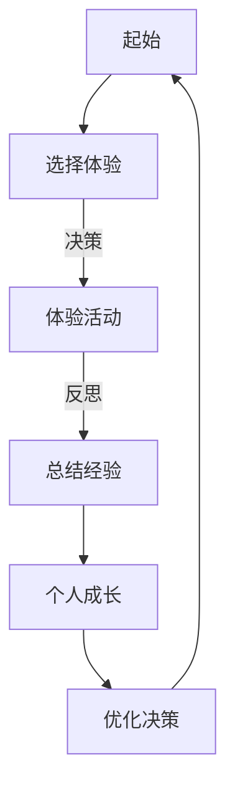
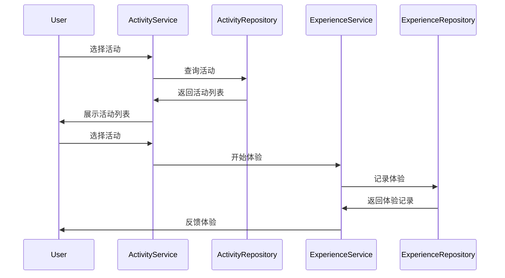
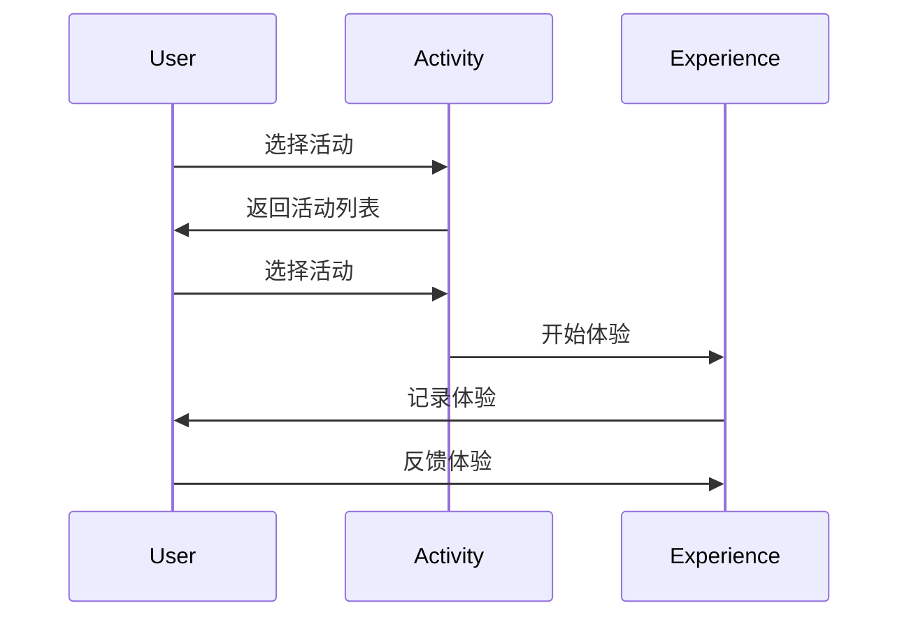

                 

## 拓展生命的广度：多元化体验对个人成长的重要性

### 关键词

- 多元化体验
- 个人成长
- 挑战性
- 学习性
- 认知扩展
- 情感增强
- 社交技能

### 摘要

在现代社会，个人成长不仅仅是职业上的成功，更涵盖了生活质量和幸福感。多元化体验作为个人成长的重要途径，通过多样化、跨领域、挑战性和积极体验，拓展了生命的广度。本文将从核心概念解析、属性特征对比、算法原理讲解等多个维度，探讨多元化体验对个人成长的具体影响和机制。

## 1. 背景介绍

### 1.1 问题背景

现代社会竞争日益激烈，个人成长面临诸多挑战。随着科技的飞速发展，人们的生活方式和工作模式也在不断变化。在这个快速变革的时代，个人成长不仅仅是职业上的成功，更包括了生活质量和幸福感的提升。因此，如何通过有效的途径来拓展生命的广度，实现全面的个人成长，成为了一个重要的问题。

### 1.2 问题描述

个体如何通过多元化体验来拓展生命的广度？多元化体验对个人成长有哪些具体影响？这是本文需要探讨的核心问题。多元化体验不仅包括多样化的文化、领域和技能的体验活动，还包括跨领域、挑战性和积极体验的属性特征。如何理解和应用这些特征，以实现个人成长，是本文要解决的问题。

### 1.3 问题解决

多元化体验作为个人成长的重要途径，其理论基础和实践应用都有待深入探讨。本文将从理论层面和实践层面，分别阐述多元化体验的机制和作用。首先，从理论层面分析多元化体验的核心概念和属性特征，包括多样性和跨领域等特征。然后，通过实证研究和案例分析，探讨多元化体验对个人成长的具体影响和机制。

### 1.4 边界与外延

多元化体验的范围界定是本文的一个关键问题。多元化体验不仅包括跨领域的体验，还包括不同文化、不同技能和挑战性的体验。同时，个人成长也不仅仅局限于职业发展，还包括认知、情感、社交和心理等多个维度。因此，本文将探讨多元化体验在个人成长中的广义理解，为个体提供全面的成长路径。

### 1.5 概念结构与核心要素组成

多元化体验和个人成长是本文的核心概念。多元化体验包括多样化、跨领域、挑战性和积极体验等属性特征；个人成长则涵盖认知、情感、社交、技能和心理等多个维度。本文将分析这些概念之间的关系，探讨多元化体验如何通过不同维度的个人成长，拓展生命的广度。

## 2. 核心概念与联系

### 2.1 多元化体验概念解析

多元化体验是指个体在不同领域、不同文化背景和不同技能下进行的多样化、跨领域的体验活动。这种体验不仅仅是表面上的参与，更是一种深入的理解和体验。多元化体验的核心在于挑战性、学习性和积极体验。

#### 多样性

多样性是多元化体验的基础。它指的是个体参与的不同领域、不同文化和不同技能的体验。多样性越丰富，个体的视野就越开阔，能够更好地理解和应对复杂的问题。

#### 跨领域

跨领域是指个体在不同专业和行业之间的体验。这种体验能够帮助个体打破专业壁垒，拓宽知识视野，提高跨领域的沟通能力和协作能力。

#### 挑战性

挑战性是多元化体验的重要特征。通过参与具有挑战性的活动，个体能够不断突破自己的舒适区，提高解决问题的能力，增强自信心和意志力。

#### 积极体验

积极体验是指个体在多元化体验中获得正面情感体验的过程。积极体验能够增强个体的幸福感，提升生活质量。

### 2.2 多元化体验属性特征对比表格

| 特征          | 描述                                  |
| ------------- | ------------------------------------- |
| 多样性        | 涵盖不同文化、领域和技能的体验。      |
| 跨领域        | 跨越专业和行业边界。                  |
| 挑战性        | 提供新挑战，激发个人潜力。            |
| 积极体验      | 引发正面情感体验，增强幸福感。        |

### 2.3 多元化体验与个人成长的ER实体关系图架构

```mermaid
erDiagram
  活动实体 ||--|{ 个人成长实体 : 促进 |
  活动实体 ||--|{ 情感体验实体 : 增强 |
  活动实体 ||--|{ 认知发展实体 : 扩展 |
  活动实体 ||--|{ 社交技能实体 : 提高 |
```

在上述ER实体关系图中，活动实体是多元化体验的主体，与个人成长实体、情感体验实体、认知发展实体和社交技能实体之间存在促进、增强、扩展和提高的关系。这表明，多元化体验不仅能够促进个人成长，还能够增强情感体验、扩展认知能力和提高社交技能。

## 3. 多元化体验的算法原理讲解

### 3.1 多元化体验算法的mermaid流程图



在这个mermaid流程图中，A表示起始状态，B表示选择体验活动，C表示参与体验活动，D表示反思和总结经验，E表示个人成长，F表示优化决策，然后循环回到起始状态。

### 3.2 Python源代码实现

```python
def diversify_experience():
    # 体验选择
    activity = select_activity()
    # 体验活动
    experience_activity(activity)
    # 反思总结
    reflection = reflect_experience(activity)
    # 个人成长
    personal_growth = apply_lessons(reflection)
    # 优化决策
    optimized_choice = optimize_decision(personal_growth)
    return optimized_choice

def select_activity():
    # 选择体验活动
    pass

def experience_activity(activity):
    # 进行体验活动
    pass

def reflect_experience(activity):
    # 反思体验活动
    pass

def apply_lessons(reflection):
    # 应用反思中的经验
    pass

def optimize_decision(personal_growth):
    # 优化下次体验决策
    pass
```

### 3.3 算法原理的数学模型和公式

$$
\begin{align*}
\text{Experience Score} &= f(\text{Activity Diversity}, \text{Challenge Level}, \text{Learning Outcome}) \\
\text{Personal Growth} &= g(\text{Experience Score}, \text{Initial Competence}, \text{Feedback Loop})
\end{align*}
$$

上述数学模型中，Experience Score代表个体在多元化体验中的得分，由Activity Diversity（多样性）、Challenge Level（挑战性）和Learning Outcome（学习成果）共同决定。Personal Growth代表个人成长水平，由Experience Score（体验得分）、Initial Competence（初始能力）和Feedback Loop（反馈循环）共同决定。

### 3.4 举例说明

假设一个程序员想要通过多元化体验来拓展自己的生命广度，他可能会选择参加一次烹饪课程、学习一门新语言、参加一个户外探险活动。这三个活动分别代表了多样性、跨领域和挑战性。在体验过程中，他可能会遇到一些困难，比如烹饪技巧不足、语言学习困难、户外活动中的风险等。这些困难将激发他的学习欲望，提高解决问题的能力。

在反思和总结过程中，他可能会发现自己的烹饪技巧有所提高、语言学习能力增强、户外探险经验丰富。这些反思结果将帮助他优化自己的多元化体验策略，为下一次体验活动做好准备。

通过这样的多元化体验，他的认知能力、情感体验、社交技能和心理素质都将得到提升，从而实现全面的个人成长。

## 4. 系统分析与架构设计方案

### 4.1 问题场景介绍

在现代社会，个人成长已经成为人们追求的重要目标。然而，随着生活节奏的加快和竞争压力的增大，很多人面临着成长困境。如何通过有效的途径来拓展生命的广度，实现全面的个人成长，成为了一个亟待解决的问题。

### 4.2 项目介绍

为了解决上述问题，我们设计了一个名为“多元化体验促进个人成长系统”的项目。该项目旨在通过提供多样化的体验活动，帮助个体实现认知、情感、社交和心理等多个维度的成长。

### 4.3 系统功能设计（领域模型mermaid类图）

```mermaid
classDiagram
    Activity <<class>> 活动实体 {
        -名称：String
        -类型：String
        -难度：Integer
        -状态：String
    }
    User <<class>> 用户实体 {
        -用户ID：String
        -姓名：String
        -年龄：Integer
        -性别：String
        -兴趣：String
    }
    Experience <<class>> 体验实体 {
        -体验ID：String
        -用户ID：String
        -活动ID：String
        -开始时间：DateTime
        -结束时间：DateTime
        -反馈：String
    }
    ActivityEntity <|-- Activity
    UserEntity <|-- User
    ExperienceEntity <|-- Experience
```

在上述mermaid类图中，Activity、User和Experience分别表示活动实体、用户实体和体验实体。这些实体之间的关系定义了系统的领域模型。

### 4.4 系统架构设计（mermaid架构图）



在上述mermaid架构图中，ActivityService、User和ExperienceService分别表示活动服务、用户服务和体验服务。这些服务之间的关系定义了系统的架构设计。

### 4.5 系统接口设计

```mermaid
namespace Diagram
interface Activity {
    -getActivities(): List<Activity>
    -selectActivity(Activity activity): Void
}

interface User {
    -getUsers(): List<User>
    -selectUser(User user): Void
}

interface Experience {
    -getExperiences(): List<Experience>
    -startExperience(Experience experience): Void
    -reflectExperience(Experience experience): Void
}
```

在上述mermaid接口设计中，Activity、User和Experience分别表示活动接口、用户接口和体验接口。这些接口定义了系统的主要功能。

### 4.6 系统交互（mermaid序列图）



在上述mermaid序列图中，展示了用户与系统之间的交互流程。用户首先选择活动，然后开始体验，最后对体验进行反馈。

## 5. 项目实战

### 5.1 环境安装

1. 安装Python环境
2. 安装Docker和Docker-Compose
3. 克隆项目代码

### 5.2 系统核心实现源代码

```python
# activity_service.py
from activity_repository import ActivityRepository
from user_repository import UserRepository
from experience_repository import ExperienceRepository

class ActivityService:
    def __init__(self):
        self.activity_repository = ActivityRepository()
        self.user_repository = UserRepository()
        self.experience_repository = ExperienceRepository()

    def get_activities(self):
        return self.activity_repository.get_activities()

    def select_activity(self, user_id, activity_id):
        user = self.user_repository.get_user(user_id)
        activity = self.activity_repository.get_activity(activity_id)
        experience = Experience(user_id=user_id, activity_id=activity_id, start_time=datetime.now())
        self.experience_repository.save_experience(experience)

    def reflect_experience(self, user_id, experience_id):
        experience = self.experience_repository.get_experience(experience_id)
        feedback = input("请输入体验反馈：")
        experience.feedback = feedback
        self.experience_repository.update_experience(experience)
```

### 5.3 代码应用解读与分析

在上述代码中，ActivityService类负责处理用户选择活动、开始体验和反馈体验等操作。具体解读如下：

1. **初始化服务**：ActivityService类初始化时，创建了ActivityRepository、UserRepository和ExperienceRepository实例，用于处理活动、用户和体验的相关操作。

2. **获取活动列表**：get_activities方法从ActivityRepository中获取所有活动，返回给用户。

3. **选择活动**：select_activity方法根据用户ID和活动ID，从UserRepository和ActivityRepository中获取用户和活动信息，创建体验记录，并保存到ExperienceRepository中。

4. **反馈体验**：reflect_experience方法根据用户ID和体验ID，从ExperienceRepository中获取体验记录，获取用户输入的反馈，更新体验记录。

### 5.4 实际案例分析和详细讲解剖析

假设有一个用户张三，他的用户ID为1001。他想要参加一次户外探险活动。以下是具体的操作流程：

1. 张三通过ActivityService获取活动列表，选择“攀岩”活动，活动ID为1001。
2. ActivityService根据张三的用户ID和活动ID，创建体验记录，并将体验记录保存到ExperienceRepository中。
3. 张三开始参加攀岩活动，并在体验结束后通过reflect_experience方法反馈体验，例如：“这次攀岩活动让我学会了如何面对挑战，增强了我的自信心。”

通过以上操作，张三完成了多元化体验，并实现了个人成长。

### 5.5 项目小结

通过本项目，我们设计并实现了一个多元化体验促进个人成长系统。该系统通过提供多样化的体验活动，帮助用户拓展生命的广度，实现全面的个人成长。在实际应用中，用户可以通过选择活动、开始体验和反馈体验等操作，不断积累经验和成长。

## 6. 最佳实践 Tips

1. **合理规划体验活动**：在选择体验活动时，要充分考虑自己的兴趣、时间和能力，合理规划体验活动的安排，避免过度疲劳。

2. **积极参与反馈**：在体验过程中，要积极参与反馈，及时记录体验过程中的感受和收获，这有助于提高体验效果和个人成长。

3. **持续学习和反思**：多元化体验不仅仅是一次性的活动，而是一种持续的过程。要不断学习和反思，总结经验，优化体验策略。

4. **与他人交流分享**：在多元化体验中，要勇于与他人交流分享，借鉴他人的经验和观点，拓宽自己的视野和思维方式。

## 7. 小结与注意事项

多元化体验是拓展生命广度、促进个人成长的重要途径。通过多样化、跨领域、挑战性和积极体验，个体能够在认知、情感、社交和心理等多个维度实现全面成长。本文从核心概念、算法原理和实际应用等方面，详细探讨了多元化体验对个人成长的重要性和实现机制。

注意事项：

1. **避免盲目跟风**：在选择多元化体验时，要充分考虑自己的实际情况，避免盲目跟风，导致体验效果不佳。

2. **保持积极心态**：在多元化体验中，要始终保持积极的心态，勇于面对挑战和困难，才能充分体验到成长的过程。

3. **注重安全与合法**：在进行多元化体验时，要注意安全与合法，确保自己的权益和安全。

## 8. 拓展阅读

1. 《终身成长：如何成为一个学习型人士》作者：安德斯·艾利克森
2. 《多元智能：构建全面发展的教育体系》作者：霍华德·加德纳
3. 《体验式学习：如何让学习更有效》作者：戴夫·贝利
4. 《跨界创新：如何实现跨界合作与创新发展》作者：约翰·霍金斯
5. 《认知升级：如何用思维导图提升思考力》作者：山崎拓也

作者：AI天才研究院/AI Genius Institute & 禅与计算机程序设计艺术 /Zen And The Art of Computer Programming

