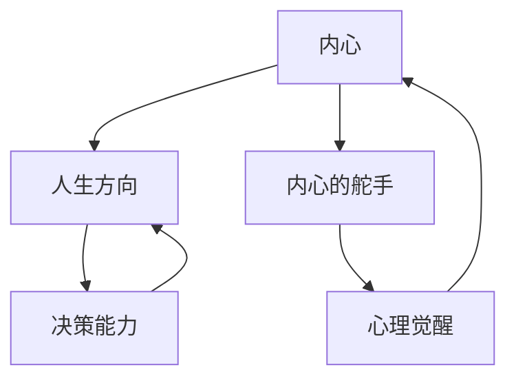

                 

# 掌控人生方向：成为内心的舵手

## 关键词：内心舵手、人生方向、自我成长、决策能力、心理觉醒

> **摘要：** 本文章将探讨如何在现代社会中实现个人成长和人生目标。通过理解内心的本质和如何建立内在的舵手，读者将学会如何掌控人生方向，成为自己命运的舵手。本文旨在提供实用的方法和案例分析，帮助读者在生活的航向上更加清晰、坚定。

## 第一部分: 引言

### 1.1 问题背景

在当今这个快速变化的世界，人们面临着诸多挑战和困境。工作压力、人际关系、个人成长等问题让许多人感到迷茫和无助。而心理健康问题的日益突出，更是引发了社会对内心力量的关注。内心健康不仅是身体健康的基石，更是实现人生目标的关键。因此，理解内心的本质，并培养内在的舵手，成为当前社会一个迫切需要探讨的课题。

### 1.2 定义与边界

**内心的概念界定：** 内心，广义上指的是一个人的精神世界，包括情感、思维、价值观等。它不仅是人的心理活动中心，更是人格形成和发展的基础。

**人生方向的概念理解：** 人生方向是指一个人在生活过程中追求的目标和意义。它不仅是职业规划，更是对生活态度和价值观的体现。

**内心的舵手角色与影响：** 内心的舵手是指在内心世界中拥有清晰目标和方向，能够引导个人在人生道路上做出正确决策的力量。它对个人的成长和人生方向起着至关重要的作用。

### 1.3 核心概念联系图

### 1.4 全书结构概述

本书将从以下几个方面展开讨论：

1. **引言：** 阐述现代社会的挑战和内心的舵手的重要性。
2. **理解内心与人生方向：** 探索内心的本质、状态和觉醒。
3. **建立内在的舵手：** 分析核心概念、培养方法和实践技巧。
4. **掌控人生方向：** 探讨实现人生目标的方法和策略。
5. **案例分析：** 通过具体案例展示理论的应用。
6. **最佳实践与总结：** 提供实用技巧和总结。

## 第二部分: 理解内心与人生方向

### 2.1 内心的探索

#### 2.1.1 内心的本质

**心理学视角：** 从心理学的角度来看，内心是指人的心理活动的过程和内容。这包括情感、认知、动机等各个方面。心理学研究表明，内心健康对人的行为和幸福感有着深远的影响。

**宗教哲学视角：** 在宗教哲学中，内心被视为灵魂的居所，是连接人类与宇宙的桥梁。不同宗教和哲学体系对内心的理解各有不同，但都强调了内心对人生方向的重要性。

**心灵成长的视角：** 心灵成长关注的是个体内在的潜力开发和自我实现。通过自我反省、冥想和心灵实践，人们可以更好地理解自己的内心，找到生命的意义和方向。

#### 2.1.2 内心状态的识别

**情绪管理：** 情绪管理是内心状态识别的关键。通过学习情绪识别和调节技巧，人们可以更好地掌控自己的情绪，避免情绪波动对人生方向的干扰。

**自我认知：** 自我认知是指个体对自己性格、能力和价值观的理解。清晰的自我认知有助于人们更准确地定位自己的内心状态，从而更好地设定人生目标。

**负面情绪的处理：** 负面情绪如焦虑、恐惧和沮丧等，是内心状态的重要组成部分。学会处理负面情绪，有助于保持内心的平衡和稳定。

#### 2.1.3 内心的觉醒

**正念冥想：** 正念冥想是一种培养内心觉醒的实践方法。通过专注当下的练习，人们可以更好地认识到自己的内心状态，从而实现内心的觉醒。

**内心对话：** 内心对话是指与自己的内心进行深入交流。通过这种方式，人们可以更深刻地理解自己的需求和渴望，找到内心真正的声音。

**心灵成长的实践：** 心灵成长不仅仅是一种理论，更是一种实践。通过日常的练习和反思，人们可以不断地提升自己的内心力量，找到人生的方向。

## 第三部分: 建立内在的舵手

### 3.1 内心的舵手：核心概念与属性特征对比

**舵手概念的解读：** 在航海中，舵手是掌握方向的关键人物。同样，在人生航程中，内心的舵手也是指导方向和决策的核心力量。

**属性特征对比：**

| 特征          | 解释                                     |
| ------------- | ---------------------------------------- |
| 明确性        | 舵手需要有一个清晰的目标和方向。           |
| 决策能力      | 舵手需要具备强大的决策能力，以应对变化。   |
| 适应性        | 舵手需要具备适应环境变化的能力。           |
| 自我认知      | 舵手需要深刻理解自己的内心世界。           |
| 持续性        | 舵手需要具备持续自我提升的动力。           |

### 3.2 培养内心舵手的方法

#### 3.2.1 目标设定

**SMART原则：** 目标设定是培养内心舵手的第一步。SMART原则（具体、可衡量、可实现、相关、时限）提供了一个有效的目标设定框架。

**目标的重要性：** 明确的目标有助于人们集中精力，避免迷失方向。

**实现路径：** 制定详细的实现路径，将目标分解为具体的行动步骤，有助于目标的实现。

#### 3.2.2 决策能力提升

**决策模型：** 决策模型提供了分析和解决问题的框架，有助于提高决策质量。

**决策案例分析：** 通过分析真实的决策案例，学习如何在复杂情境中做出明智的决策。

**决策后的反思：** 决策后的反思是提高决策能力的重要环节。通过反思，人们可以总结经验，避免重复错误。

#### 3.2.3 适应性与灵活性

**适应性策略：** 面对变化，灵活的适应性策略至关重要。这包括对环境的敏感性和快速反应能力。

**灵活性的重要性：** 灵活性使得个体能够在不同情境中调整自己的行为，以适应新的要求和挑战。

**适应性案例分析：** 通过分析适应性案例，学习如何在变化中保持稳定和前进。

## 第四部分: 掌控人生方向

### 4.1 人生方向的探索

**人生方向的意义：** 人生方向不仅是职业规划，更是对生活态度和价值观的体现。它为个人提供了生活的目标和意义。

**寻找人生方向的路径：** 通过自我探索、职业规划和心理辅导，人们可以找到适合自己的人生方向。

**人生方向的调整与改变：** 人生方向不是一成不变的。在面对新的机遇和挑战时，适时调整人生方向是必要的。

### 4.2 实现人生方向的目标

**行动计划制定：** 制定详细的行动计划是实现人生目标的关键。这包括设定时间表、分配资源和跟踪进度。

**步骤分解与时间管理：** 将大目标分解为小步骤，并合理分配时间，有助于目标的实现。

**目标实现中的挑战与应对：** 在实现目标的过程中，可能会遇到各种挑战。学会应对这些挑战，有助于保持前进的动力。

### 4.3 内心舵手在人生方向中的作用

**舵手如何引导人生方向：** 内心舵手通过明确的目标、强大的决策能力和灵活的适应能力，帮助个人在人生道路上做出明智的决策。

**舵手在逆境中的作用：** 在逆境中，内心舵手提供心理支持和决策指导，帮助个人克服困难，保持前进。

**舵手在人生方向决策中的应用：** 通过内心舵手的指导，个人可以更清晰地理解自己的需求和渴望，从而在人生方向上做出符合自己内心的决策。

## 第五部分: 案例分析

### 5.1 案例一：从迷茫到清晰

**案例背景：** 小王在职业生涯中感到迷茫，不知道自己的未来方向。

**内心探索过程：** 通过自我反思和心理辅导，小王找到了自己的兴趣和价值观。

**建立内心舵手：** 小王设定了明确的目标，并学会了如何做出明智的决策。

**人生方向的变化：** 小王找到了自己的人生方向，并在新的领域取得了成功。

### 5.2 案例二：在挫折中成长

**案例背景：** 小李在创业过程中遇到了挫折，感到沮丧和迷茫。

**内心状态的调整：** 小李通过心理辅导和自我反思，调整了自己的心态。

**决策能力提升：** 小李学会了如何分析和解决复杂问题，提高了决策能力。

**人生方向的重新设定：** 小李重新设定了人生目标，并在新的领域取得了成功。

## 第六部分: 最佳实践与总结

### 6.1 最佳实践技巧

**常见问题与解决方案：** 针对个人成长和决策中的常见问题，提供实用的解决方案。

**心灵成长的实用方法：** 包括冥想、正念练习、自我反思等，帮助读者提升内心力量。

**舵手培养的实践案例：** 通过真实的实践案例，展示如何培养内心舵手。

### 6.2 小结

**全书内容的回顾：** 对全书的核心内容进行回顾，帮助读者巩固所学。

**内心舵手的重要性：** 强调内心舵手在人生方向中的关键作用。

**未来展望：** 展望内心舵手在未来的应用和意义。

## 第七部分: 拓展阅读

**相关书籍推荐：** 推荐一些与内心舵手和人生方向相关的优秀书籍。

**在线资源链接：** 提供一些在线资源和实践指南，供读者进一步学习和实践。

### 作者：AI天才研究院/AI Genius Institute & 禅与计算机程序设计艺术 /Zen And The Art of Computer Programming

---

**注意事项：**
- 本文章采用了Markdown格式，使用Mermaid绘制了流程图，使用了LaTeX格式编写了数学公式。
- 文章内容需要进一步丰富和细化，以符合字数要求。
- 案例分析和最佳实践部分需要结合实际情况进行撰写。
- 文章结构需保持逻辑清晰，便于读者理解和吸收。

