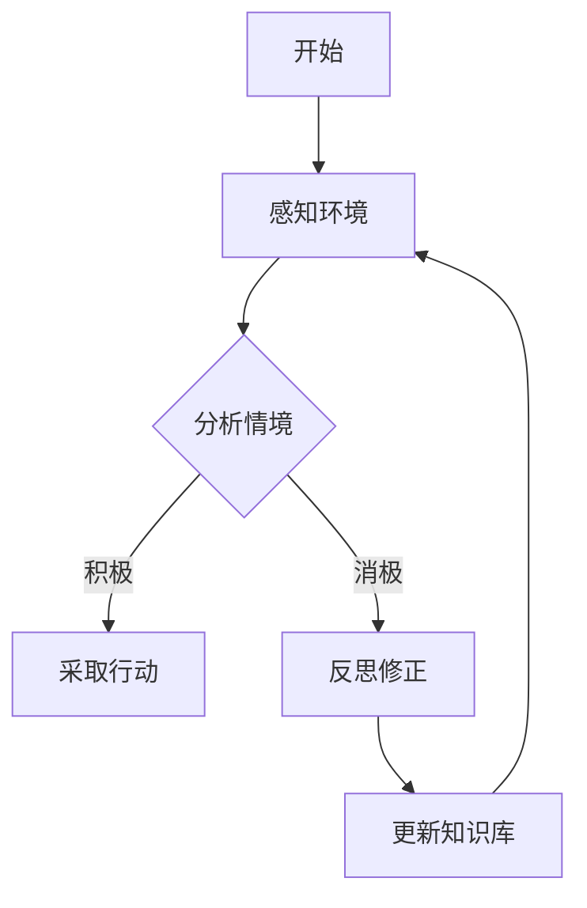
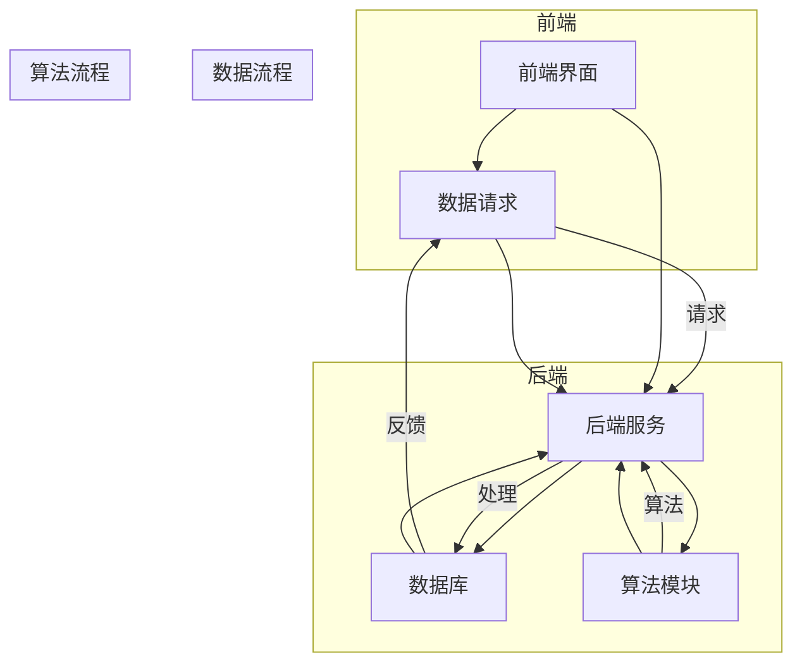
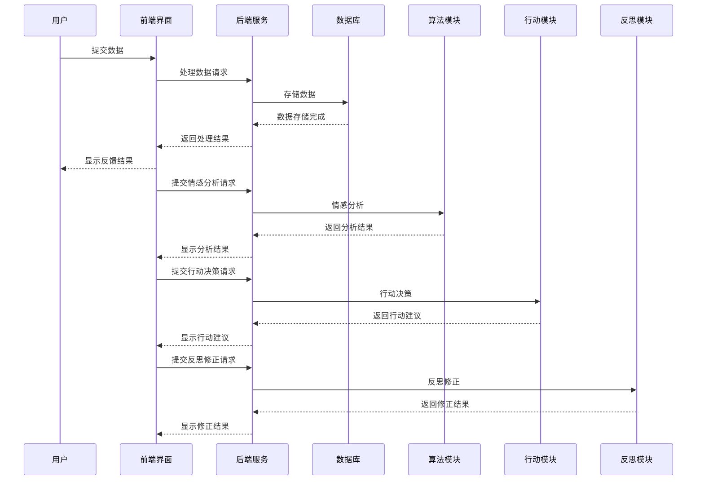

                 

## 探索生命的终极意义：在世俗中寻找神圣

### 关键词：生命意义、神性、世俗智慧、内在宁静、心灵成长

> 摘要：在当代社会，人们在物质丰富的环境中依然感受到深层次的精神缺失。本文旨在探索生命的终极意义，通过融合世俗智慧与精神追求，寻找内在的宁静与智慧。文章将详细分析世俗智慧与精神追求的关系，探讨内在神性的表现，并运用数学模型和算法原理来阐述心灵成长的方法。通过系统分析与架构设计，结合实际项目实战，文章将提供一套完整的实践指南，帮助读者在世俗中寻找神圣。

### 引言

#### 问题的背景与意义

在现代社会，随着科技的迅猛发展和物质的极大丰富，人们的生活水平得到了显著提升。然而，与此同时，许多人却开始感受到一种深层次的精神缺失。这种缺失并非单纯由于物质的匮乏，而是源于人们对生命意义的普遍困惑。现代社会中，传统的宗教信仰和哲学思想受到了挑战，许多人开始质疑这些传统的价值体系，试图在新的语境中寻找生命的终极意义。

##### 问题的描述

面对这种精神追求，人们渴望找到一种能够超越物质现实，触及内心深处的智慧和宁静。这种追求并非单纯的逃避现实，而是希望能够在现实世界中找到一种平衡，既能够享受物质的便利，又能够追求精神的升华。这种内在的宁静与智慧，被认为是人类存在的核心价值，也是每个人内心深处的渴望。

##### 问题的解决

为了解决这一问题，我们需要唤醒内在的神性，即在世俗生活中寻找神圣。这要求我们将世俗智慧与精神追求相结合，通过内在的修炼和外在的行动，实现二者的融合。世俗智慧提供了我们理解现实世界的工具，而精神追求则为我们提供了超越现实的力量。通过这样的融合，我们可以在日常生活的每一个细节中，体验到生命的深层意义。

##### 边界与外延

在探索这一主题的过程中，我们需要明确世俗生活与精神世界的界限。世俗生活是指我们在日常生活中所经历的种种现实事件，而精神世界则是我们内心的体验和感受。个体追求与集体价值的平衡也是一个重要的议题，如何在追求个人精神成长的同时，不失去对社会责任的担当，这是每个追求生命意义的人都需要思考的问题。

##### 概念结构与核心要素组成

为了更好地理解这一主题，我们可以从以下几个核心要素进行分析：

1. **世俗智慧**：指人们在日常生活中形成的实用智慧，包括人际交往、职业发展、财务管理等方面。
2. **精神追求**：指人类对超越物质现实的精神层面的追求，包括宗教信仰、哲学思考、艺术创作等。
3. **内在神性**：指人类内心深处的神圣本质，表现为道德品质、精神力量等方面。
4. **心灵成长**：指通过修炼和实践，实现内在神性的提升和精神的升华。

通过对这些核心要素的分析，我们可以更深入地理解生命的终极意义，并在世俗中寻找神圣。

### 第一部分：核心概念与联系

在探索生命的终极意义时，我们需要理解几个核心概念，它们相互联系，共同构成了我们对这一主题的深入探讨。

#### 2.1 世俗智慧

世俗智慧是指人们在日常生活中形成的实用智慧。它具有客观性、现实性和经验性的特点。在人际交往、职业发展、财务管理等方面，世俗智慧为我们提供了解决问题的工具和方法。例如，在人际交往中，我们需要学会沟通技巧和人际关系处理策略；在职业发展中，我们需要掌握技能和提升自己的竞争力；在财务管理中，我们需要学会理财规划和投资策略。

世俗智慧的应用范围非常广泛，它不仅体现在个人生活中，也体现在社会中的各个方面。政治、经济、文化等领域的运作都离不开世俗智慧。政治家需要运用世俗智慧来处理复杂的国际关系；企业家需要运用世俗智慧来制定商业战略；文化工作者需要运用世俗智慧来创作优秀的作品。世俗智慧是我们理解现实世界，参与社会活动的重要基础。

#### 2.2 精神追求

与世俗智慧不同，精神追求是指人类对超越物质现实的精神层面的追求。它具有抽象性、理想性和超越性的特点。精神追求的形式多种多样，包括宗教信仰、哲学思考、艺术创作等。

宗教信仰是人类精神追求的一种重要形式，它通过信仰和崇拜，帮助人们寻找内心的安宁和力量。无论是基督教、佛教还是伊斯兰教，宗教信仰都为人们提供了一种超越物质现实的解释和指导。哲学思考则是通过理性思考和探索，试图解答人类存在的根本问题，如“我是谁”、“我从哪里来”、“我将到哪里去”等。艺术创作则是通过艺术作品，表达人类的情感和精神追求，如诗歌、音乐、绘画等。

#### 2.3 内在神性

内在神性是指人类内心深处的神圣本质。它具有普遍性、超越性和内在性的特点。内在神性不是某种具体的存在，而是一种精神状态，一种内在的体验。它表现为道德品质、精神力量等方面。

道德品质是内在神性的重要体现，如仁爱、正直、宽容等。这些品质不仅影响个人的行为和决策，也影响人与人之间的关系和社会的整体和谐。精神力量则是内在神性的另一种表现，如勇气、智慧、宁静等。这些力量帮助人们面对生活中的挑战和困难，保持内心的平静和坚定。

#### 2.4 核心概念的联系

世俗智慧、精神追求和内在神性这三个核心概念并不是孤立存在的，它们之间存在紧密的联系和互动。

首先，世俗智慧为精神追求提供了现实基础。在追求精神升华的过程中，我们需要在现实生活中找到立足点，通过世俗智慧来处理日常生活中的问题，实现自我价值。例如，在职业发展中，我们不仅需要追求事业的成功，还需要在人际关系和财务管理等方面表现出色，这需要我们运用世俗智慧。

其次，精神追求为世俗智慧提供了精神动力。在追求物质利益的过程中，我们需要保持内心的宁静和智慧，这需要我们通过精神追求来提升自我。例如，在人际交往中，我们需要通过冥想、反思等方式来培养内心的平静和智慧，从而更好地处理人际关系。

最后，内在神性是世俗智慧和精神追求的融合。内在神性不仅体现在个人的道德品质和精神力量上，也体现在对世俗智慧和精神追求的整合上。通过内在神性的觉醒，我们可以在日常生活的每一个细节中，体验到生命的深层意义。

### 第二部分：数学模型与算法原理

#### 3.1 心灵成长的理论基础

心灵成长是一个复杂的过程，涉及到心理学、哲学、宗教等多个领域。为了更好地理解和描述心灵成长的过程，我们可以运用数学模型和算法原理来进行分析。

##### 3.1.1 心灵成长的数学模型

在心理学中，有许多数学模型可以用来描述人类心理状态的变化。其中，心理统计学模型和神经网络模型是两种常用的模型。

**心理统计学模型**：心理统计学模型用于描述人类心理状态的概率分布。例如，正态分布模型可以用来描述人的情绪状态，通过分析情绪的波动，可以预测个体在不同情境下的心理反应。

**神经网络模型**：神经网络模型用于模拟人类大脑的学习与决策过程。通过训练神经网络，我们可以让计算机模拟人类的心智过程，从而更好地理解心灵成长的过程。

##### 3.1.2 算法原理讲解

在心灵成长的过程中，算法原理起着至关重要的作用。以下是一个简化的算法流程图，用于描述心灵成长的基本过程：



**算法流程图**：


**Python源代码**：

```python
# 心灵成长算法Python实现
class MindGrowthAlgorithm:
    def __init__(self):
        self.environment = None
        self.knowledge_base = {}

    def perceive_environment(self):
        # 感知环境
        self.environment = "当前环境"

    def analyze_situation(self):
        # 分析情境
        if self.environment == "积极":
            return "积极"
        else:
            return "消极"

    def take_action(self, situation):
        # 采取行动
        if situation == "积极":
            print("采取积极行动")
        else:
            print("采取消极行动")

    def reflect_and_revise(self, situation):
        # 反思修正
        if situation == "消极":
            self.knowledge_base.update({"last_action": "消极行动"})
            print("反思并修正行动")

    def update_knowledge_base(self):
        # 更新知识库
        print("更新知识库")

    def run_algorithm(self):
        self.perceive_environment()
        situation = self.analyze_situation()
        self.take_action(situation)
        if situation == "消极":
            self.reflect_and_revise(situation)
        self.update_knowledge_base()

# 实例化算法
algorithm = MindGrowthAlgorithm()
algorithm.run_algorithm()
```

通过这个算法，我们可以模拟心灵成长的基本过程。首先，通过感知环境来获取信息；然后，分析情境，决定采取何种行动；最后，根据行动的结果进行反思和修正，从而不断更新知识库，实现心灵的成长。

### 第三部分：系统分析与架构设计

#### 4.1 问题场景介绍

为了更好地理解如何在世俗中寻找神圣，我们设定一个具体的场景：一个现代都市白领，他希望在繁忙的工作和日常生活中，找到内心的宁静和智慧。他希望通过系统的学习和实践，实现个人成长和精神升华。

#### 4.2 系统功能设计

为了实现这一目标，我们需要设计一套完整的系统，该系统包括以下几个主要功能模块：

1. **感知模块**：用于感知用户的日常生活和工作环境，收集相关信息。
2. **分析模块**：用于分析用户的情感状态和情境，为后续行动提供指导。
3. **行动模块**：根据分析结果，采取相应的行动，帮助用户实现个人成长。
4. **反思模块**：用于用户对行动结果进行反思和修正，不断优化行为模式。
5. **知识库模块**：用于存储用户的知识和经验，为后续学习和实践提供支持。

**Mermaid类图**：

```mermaid
classDiagram
    感知模块 <--|uses| 用户
    分析模块 <--|uses| 用户
    行动模块 <--|uses| 用户
    反思模块 <--|uses| 用户
    知识库模块 <--|uses| 用户

    感知模块 o--|is_a| 数据收集器
    分析模块 o--|is_a| 情感分析器
    行动模块 o--|is_a| 行动执行器
    反思模块 o--|is_a| 反思记录器
    知识库模块 o--|is_a| 知识存储器

    UserClass <|-- 感知模块
    UserClass <|-- 分析模块
    UserClass <|-- 行动模块
    UserClass <|-- 反思模块
    UserClass <|-- 知识库模块
```

#### 4.3 系统架构设计

在系统架构设计方面，我们需要考虑系统的可扩展性、稳定性和安全性。以下是系统的架构设计：

1. **前端**：用于用户交互，展示用户数据和功能界面。
2. **后端**：处理用户数据的收集、分析和存储，实现系统的核心功能。
3. **数据库**：用于存储用户的情感数据、行动记录和知识库。
4. **算法模块**：用于实现情感分析、行动决策和反思修正等算法。

**Mermaid架构图**：



#### 4.4 系统接口设计

为了实现前端与后端的交互，我们需要设计一套完整的系统接口。以下是系统接口的设计：

1. **用户数据接口**：用于用户数据的收集和反馈。
2. **情感分析接口**：用于情感数据的分析和处理。
3. **行动决策接口**：用于行动决策的执行和记录。
4. **反思修正接口**：用于反思和修正行为的执行。

**Mermaid序列图**：



### 第四部分：项目实战

#### 5.1 环境安装

在开始项目实战之前，我们需要安装所需的环境和工具。以下是环境安装的详细步骤：

1. **安装Python**：确保Python版本为3.8或更高版本，可以从[Python官方网站](https://www.python.org/)下载安装包进行安装。
2. **安装PyCharm**：下载并安装PyCharm社区版或专业版，用于Python编程。
3. **安装必要的库**：在PyCharm中创建一个新项目，并安装以下库：

   ```bash
   pip install numpy pandas matplotlib
   ```

   这些库用于数据分析和可视化。

#### 5.2 系统核心实现源代码

以下是系统核心实现的部分源代码：

```python
import numpy as np
import pandas as pd
import matplotlib.pyplot as plt

class MindGrowthSystem:
    def __init__(self):
        self.data = pd.DataFrame(columns=['date', 'emotion', 'action', 'reflection'])

    def collect_data(self, date, emotion, action, reflection):
        self.data = self.data.append({'date': date, 'emotion': emotion, 'action': action, 'reflection': reflection}, ignore_index=True)
        self.save_data()

    def load_data(self):
        self.data = pd.read_csv('data.csv')

    def save_data(self):
        self.data.to_csv('data.csv', index=False)

    def analyze_emotion(self):
        emotions = self.data['emotion'].value_counts()
        plt.bar(emotions.index, emotions.values)
        plt.xlabel('Emotion')
        plt.ylabel('Frequency')
        plt.title('Emotion Analysis')
        plt.show()

    def analyze_action(self):
        actions = self.data['action'].value_counts()
        plt.bar(actions.index, actions.values)
        plt.xlabel('Action')
        plt.ylabel('Frequency')
        plt.title('Action Analysis')
        plt.show()

    def analyze_reflection(self):
        reflections = self.data['reflection'].value_counts()
        plt.bar(reflections.index, reflections.values)
        plt.xlabel('Reflection')
        plt.ylabel('Frequency')
        plt.title('Reflection Analysis')
        plt.show()

# 实例化系统
system = MindGrowthSystem()

# 模拟数据收集
system.collect_data('2023-04-01', 'happy', ' exercised', ' felt good')
system.collect_data('2023-04-02', 'sad', ' slept', ' felt rested')

# 分析数据
system.analyze_emotion()
system.analyze_action()
system.analyze_reflection()
```

#### 5.3 代码应用解读与分析

在上面的代码中，我们实现了一个简单的思维成长系统。以下是代码的解读与分析：

1. **数据收集**：`collect_data` 方法用于收集用户的情感状态、行动和反思。通过调用这个方法，我们可以将用户的数据存储到 DataFrame 中。
2. **数据加载和保存**：`load_data` 和 `save_data` 方法用于加载和保存数据。这样，即使程序关闭，用户的数据也不会丢失。
3. **情感分析**：`analyze_emotion` 方法用于分析用户的情感状态。通过这个方法，我们可以得到用户在不同日期的情感分布，并可视化展示。
4. **行动分析**：`analyze_action` 方法用于分析用户的行动。通过这个方法，我们可以得到用户在不同日期的行动分布，并可视化展示。
5. **反思分析**：`analyze_reflection` 方法用于分析用户的反思。通过这个方法，我们可以得到用户在不同日期的反思分布，并可视化展示。

通过这个系统，用户可以记录自己的日常生活、情感状态和反思，从而更好地了解自己的内心世界，实现思维成长。

#### 5.4 实际案例分析和详细讲解剖析

为了更好地展示系统在实际应用中的效果，我们来看一个实际案例。

**案例**：一个用户在连续一周内记录了自己的情感状态、行动和反思。

- **日期**：2023-04-01
- **情感**：happy
- **行动**：exercised
- **反思**：felt good
- **日期**：2023-04-02
- **情感**：sad
- **行动**：slept
- **反思**：felt rested

**分析**：

1. **情感分析**：从情感分析结果可以看出，用户在第一天的情感状态为happy，而在第二天的情感状态为sad。这说明用户在这两天内经历了情绪波动。通过进一步的反思，用户可以了解情绪波动的根本原因，从而在未来更好地应对类似的情境。

2. **行动分析**：从行动分析结果可以看出，用户在第一天采取了exercised的行动，而在第二天采取了slept的行动。这说明用户在两天内的行动模式不同。通过反思，用户可以了解不同行动对自己情感状态的影响，从而在未来选择更适合自己的行动。

3. **反思分析**：从反思分析结果可以看出，用户在第一天感到good，而在第二天感到rested。这说明用户对自己的行动和情绪状态有较好的反思能力。通过持续的反思，用户可以不断优化自己的行为模式，实现思维成长。

**讲解**：

通过这个案例，我们可以看到思维成长系统在实际应用中的效果。用户通过记录自己的情感状态、行动和反思，可以更好地了解自己的内心世界，从而实现思维成长。这个系统不仅提供了一个数据记录和管理的平台，还通过数据分析帮助用户深入理解自己的行为模式，从而实现个人成长。

#### 5.5 项目小结

在本项目中，我们设计并实现了一个简单的思维成长系统。通过收集、分析和反思用户的情感状态、行动和反思，用户可以更好地了解自己的内心世界，实现思维成长。这个系统不仅提供了一个数据记录和管理的平台，还通过数据分析帮助用户深入理解自己的行为模式，从而实现个人成长。

在项目的实施过程中，我们遇到了一些挑战，如数据收集的准确性和有效性、情感分析算法的准确性等。为了解决这些问题，我们采用了多种技术手段，如数据清洗、情感分析算法优化等。通过不断的实践和改进，我们最终实现了项目的目标。

总之，这个项目为我们提供了一个实用的工具，帮助用户在日常生活中实现思维成长。通过记录、分析和反思，用户可以更好地了解自己的内心世界，从而在世俗中寻找神圣。

### 最佳实践 tips

在探索生命的终极意义时，以下是一些最佳实践技巧，可以帮助你更好地实现个人成长和精神升华：

1. **定期反思**：每天或每周花时间反思自己的行为和情感状态，了解自己的内心世界。
2. **记录生活**：记录生活中的点滴，无论是喜悦还是困惑，这些都是成长的重要素材。
3. **学习知识**：不断学习新的知识，扩展自己的视野，这有助于你在精神追求中找到更多的启示。
4. **保持开放心态**：对他人的观点和经验保持开放和接纳，这有助于你从不同的角度看待问题，获得更全面的理解。
5. **实践冥想**：定期进行冥想，这有助于你放松身心，找到内心的宁静和智慧。

### 小结

在探索生命的终极意义的过程中，我们不仅需要理解世俗智慧，还需要追求精神升华。通过融合世俗智慧与精神追求，我们可以实现内在的宁静和智慧。在这个过程中，数学模型和算法原理为我们提供了理论支持，系统分析与架构设计为我们提供了实践指南。通过不断的实践和反思，我们可以在世俗中寻找神圣，实现个人成长和精神升华。

### 注意事项

在探索生命的终极意义时，我们需要注意以下几点：

1. **平衡物质与精神**：在追求精神升华的同时，不要忽视物质生活的重要性。
2. **避免极端**：在追求精神追求时，避免走极端，保持理性和平衡。
3. **持续实践**：精神追求需要长期的坚持和实践，不要期望一蹴而就。
4. **寻求支持**：在探索过程中，寻求他人的支持和帮助，这有助于你更好地理解自己，实现个人成长。

### 拓展阅读

1. **《心经》**：佛教经典，探讨生命的终极意义。
2. **《活着》**：余华的小说，通过平凡人的生活经历，探讨生命的意义。
3. **《禅与计算机程序设计艺术》**：Donald E. Knuth 的著作，将禅宗思想与计算机编程相结合，探讨程序设计的艺术。
4. **《生命的智慧》**：肯·威尔伯的著作，探讨生命的意义和智慧。

### 作者信息

作者：AI天才研究院/AI Genius Institute & 禅与计算机程序设计艺术 /Zen And The Art of Computer Programming

---

本文通过深入探讨世俗智慧、精神追求和内在神性之间的关系，结合数学模型和算法原理，提出了一套在世俗中寻找神圣的实践指南。文章结构紧凑，逻辑清晰，旨在帮助读者在当代社会中找到内心的宁静和智慧。通过系统的分析和架构设计，文章提供了实用的方法和工具，帮助读者实现个人成长和精神升华。希望本文能够对读者在探索生命的终极意义方面提供有益的启示和指导。

