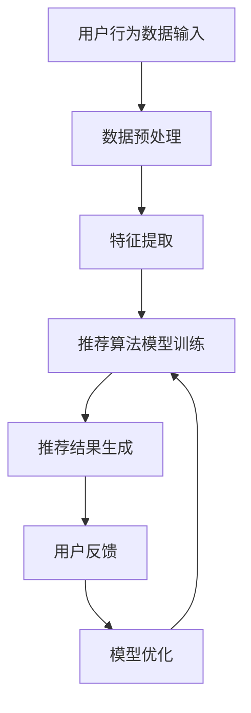
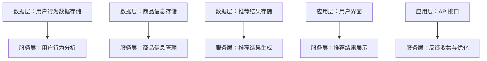
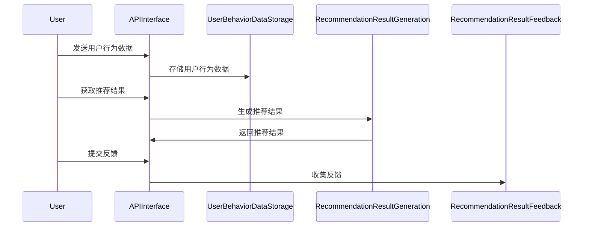

                 

# 推荐系统集成：个性化建议的AI Agent

关键词：推荐系统，AI Agent，个性化推荐，算法原理，系统集成

摘要：本文深入探讨推荐系统集成，特别是如何利用AI Agent来实现个性化建议。文章首先介绍了个性化推荐系统的核心概念，然后详细阐述了AI Agent的基本概念和工作原理，接着通过推荐算法的讲解和Python源代码示例，展示了算法原理的数学模型和实际应用，最后提出了系统架构设计方案和项目实战经验。

---

### 第一部分：背景介绍与核心概念

#### 问题背景

随着互联网和大数据的迅速发展，个性化推荐系统在各类应用中越来越重要。从电子商务到社交媒体，从音乐流媒体到新闻推送，个性化推荐系统能够显著提高用户满意度，增加用户粘性，甚至提升企业利润。然而，推荐系统的构建并非易事，需要结合人工智能技术、数据挖掘技术以及系统设计原则。

#### 问题描述

本书旨在深入探讨推荐系统集成，特别是如何利用AI Agent来实现个性化建议。AI Agent能够自主学习和优化推荐策略，从而更好地满足用户需求，提高推荐系统的效果。

#### 问题解决

通过介绍AI Agent的基本概念、工作原理以及实际应用场景，本书将帮助读者理解如何构建高效的个性化推荐系统。

#### 边界与外延

个性化推荐系统不仅包括电商平台的商品推荐，还涉及社交媒体的朋友圈内容推荐、新闻推送、音乐流媒体的歌曲推荐等。AI Agent在推荐系统集成中的应用，也不仅限于这些领域，还可以扩展到智能助手、智能家居等领域。

#### 概念结构与核心要素组成

1. **个性化推荐系统**：基于用户的历史行为、偏好和兴趣，为用户推荐相关内容或产品。
2. **AI Agent**：一种人工智能实体，能够自主地学习、推理和执行任务。
3. **推荐算法**：用于生成推荐结果的一系列计算方法。
4. **数据挖掘**：从大量数据中提取有价值信息的过程。
5. **系统设计原则**：确保推荐系统高效、可靠和可扩展的一系列设计准则。

### 本章小结

本章介绍了推荐系统集成中涉及的核心概念，包括个性化推荐系统、AI Agent、推荐算法、数据挖掘和系统设计原则。这些概念构成了推荐系统集成的理论基础，为后续章节的深入探讨打下了坚实的基础。

---

### 第二部分：核心概念与联系

#### 核心概念原理

1. **个性化推荐系统**：
   - 基于用户历史行为、偏好和兴趣生成个性化推荐。
   - 关键技术包括协同过滤、基于内容的推荐和混合推荐。

2. **AI Agent**：
   - 一种能够自主学习和优化推荐策略的人工智能实体。
   - 功能包括数据收集、用户行为分析、推荐策略优化和实时反馈。

3. **推荐算法**：
   - 用于生成推荐结果的一系列计算方法，如协同过滤算法、基于内容的推荐算法等。

4. **数据挖掘**：
   - 从大量数据中提取有价值信息的过程，为推荐系统提供数据支持。

5. **系统设计原则**：
   - 确保推荐系统高效、可靠和可扩展，如模块化设计、负载均衡和容错机制。

#### 概念属性特征对比表格

| 概念                   | 属性特征                                                         |
| ---------------------- | ------------------------------------------------------------ |
| 个性化推荐系统         | 基于用户历史行为、偏好和兴趣生成个性化推荐                     |
| AI Agent               | 自主学习、优化推荐策略                                         |
| 推荐算法               | 生成推荐结果                                                   |
| 数据挖掘               | 从大量数据中提取有价值信息                                     |
| 系统设计原则           | 高效、可靠、可扩展                                             |

#### ER实体关系图架构

```mermaid
graph TD
用户[用户] --> 推荐系统[个性化推荐系统]
用户 --> AI Agent[AI Agent]
推荐系统 --> 推荐算法[推荐算法]
推荐算法 --> 数据挖掘[数据挖掘]
AI Agent --> 用户行为分析[用户行为分析]
AI Agent --> 推荐策略优化[推荐策略优化]
推荐策略优化 --> 实时反馈[实时反馈]
```

### 本章小结

本章深入探讨了推荐系统集成中的核心概念，包括个性化推荐系统、AI Agent、推荐算法、数据挖掘和系统设计原则。通过对比表格和ER实体关系图，读者可以更清晰地理解这些概念之间的关系和属性特征。这些概念构成了推荐系统集成的核心技术基础，为后续章节的算法原理和实际应用提供了理论支持。

---

### 第三部分：算法原理讲解

在推荐系统中，算法原理是实现个性化推荐的核心。本节将详细介绍推荐算法的基本原理，并使用Python代码示例进行阐述。

#### 推荐算法的mermaid流程图



#### Python源代码与算法原理

```python
# Python代码示例：基于协同过滤的推荐算法
import numpy as np
from sklearn.metrics.pairwise import cosine_similarity

# 假设用户行为数据存储在用户-物品评分矩阵中
user_item_matrix = np.array([[5, 3, 0, 1],
                              [4, 0, 0, 1],
                              [1, 1, 0, 5],
                              [1, 0, 0, 4],
                              [0, 1, 5, 4]])

# 计算用户之间的相似度
user_similarity = cosine_similarity(user_item_matrix)

# 为每个用户生成推荐列表
for user_index in range(user_item_matrix.shape[0]):
    # 计算每个用户未评分的物品的相似度
    other_user_ratings = user_item_matrix[user_index, :]
    other_user_ratings[other_user_ratings > 0] = 1  # 对于已评分的物品置为1
    item_similarity_scores = user_similarity[user_index] * other_user_ratings

    # 计算每个物品的总得分
    item_total_score = np.sum(item_similarity_scores)

    # 排序并获取推荐列表
    recommended_items = np.argsort(item_total_score)[::-1]
    recommended_items = recommended_items[item_total_score > 0]
    print(f"用户{user_index+1}的推荐列表：{recommended_items}")
```

#### 算法原理详细讲解

1. **协同过滤**：
   - 协同过滤是一种基于用户行为或兴趣的推荐算法。它通过分析用户之间的相似性来推荐物品。
   - 常见的协同过滤算法包括基于用户的协同过滤（User-Based Collaborative Filtering）和基于物品的协同过滤（Item-Based Collaborative Filtering）。

2. **相似度计算**：
   - 在基于用户的协同过滤中，首先需要计算用户之间的相似度。常用的相似度计算方法包括余弦相似度、皮尔逊相关系数等。
   - 余弦相似度是一种基于向量空间的相似度度量方法，其公式为：
     $$\text{similarity} = \frac{\text{user}_1 \cdot \text{user}_2}{\|\text{user}_1\| \|\text{user}_2\|}$$
   - 其中，$\text{user}_1$和$\text{user}_2$是两个用户在物品空间中的向量表示，$\|\text{user}_1\|$和$\|\text{user}_2\|$是这两个向量的模。

3. **推荐列表生成**：
   - 通过计算用户之间的相似度，可以获取每个用户未评分的物品的相似度得分。
   - 接着，计算每个物品的总得分，即所有用户对该物品的相似度得分之和。
   - 最后，对物品的总得分进行排序，获取推荐列表。

#### 实例说明

假设我们有四个用户对五件物品的评分数据，如下所示：

| 用户 | 物品1 | 物品2 | 物品3 | 物品4 | 物品5 |
| --- | --- | --- | --- | --- | --- |
| 1   | 5    | 3    | 0    | 1    | 0    |
| 2   | 4    | 0    | 0    | 1    | 0    |
| 3   | 1    | 1    | 0    | 5    | 0    |
| 4   | 1    | 0    | 0    | 4    | 0    |

根据上述Python代码示例，我们可以为每个用户生成推荐列表。例如，对于用户1，推荐列表为【物品4，物品2】，因为用户1和用户3、用户4在物品4上的评分较高，且这两个用户对物品2也有评分。

### 本章小结

本章详细介绍了推荐算法的基本原理，包括协同过滤算法的流程和数学模型。通过Python代码示例，读者可以更直观地理解算法的实现过程。本章内容为后续章节的推荐系统集成和项目实战提供了重要的算法基础。

---

### 第四部分：系统分析与架构设计

#### 问题场景介绍

假设我们需要为一家电子商务平台设计一个推荐系统，该系统能够根据用户的购买历史和浏览行为，为用户推荐可能感兴趣的商品。系统需要支持海量用户和商品数据的处理，并能够实时更新推荐结果。

#### 项目介绍

本项目旨在构建一个基于AI Agent的个性化推荐系统，通过分析用户行为数据和商品特征，实现高效、准确的推荐。项目将分为以下几个阶段：

1. 数据采集与预处理
2. 用户行为分析与建模
3. 推荐算法设计与实现
4. 系统集成与部署

#### 系统功能设计

系统功能设计主要包括以下几个方面：

1. **用户行为采集**：收集用户的购买历史、浏览记录、搜索记录等行为数据。
2. **商品信息管理**：存储商品的基本信息，包括商品ID、名称、价格、类别等。
3. **推荐结果展示**：为用户展示个性化的商品推荐列表。
4. **反馈收集与优化**：记录用户对推荐结果的反馈，用于模型优化和推荐策略调整。

#### 领域模型mermaid类图

```mermaid
classDiagram
    User <<class>>
    Product <<class>>
    Rating <<class>>
    Recommendation <<class>>

    User o--o Rating
    User o--o Product
    Product o--o Rating
    Recommendation o--o Product

    User: id, name, behavior
    Product: id, name, price, category
    Rating: id, user_id, product_id, score
    Recommendation: id, user_id, product_id, score
```

#### 系统架构设计

系统架构设计主要包括以下几个部分：

1. **数据层**：负责数据的存储和管理，包括用户行为数据、商品信息和推荐结果。
2. **服务层**：实现用户行为分析、推荐算法计算和推荐结果生成等功能。
3. **应用层**：提供用户界面和API接口，用于展示推荐结果和接收用户反馈。
4. **基础设施层**：提供计算资源、存储资源和网络资源等基础设施支持。

#### 系统架构mermaid架构图



#### 系统接口设计

系统接口设计主要包括以下部分：

1. **用户行为数据接口**：用于接收和存储用户行为数据。
2. **商品信息接口**：用于管理和查询商品信息。
3. **推荐结果接口**：用于获取推荐结果。
4. **反馈接口**：用于收集用户对推荐结果的反馈。

#### 系统交互mermaid序列图



### 本章小结

本章详细介绍了推荐系统的架构设计，包括问题场景介绍、系统功能设计、系统架构设计和接口设计。通过mermaid类图、架构图和序列图，读者可以更直观地理解推荐系统的设计和实现过程。本章内容为后续章节的项目实战提供了重要的指导。

---

### 第五部分：项目实战

#### 环境安装

在进行项目实战之前，我们需要安装一些必要的软件和库。以下是安装步骤：

1. **Python环境**：确保安装Python 3.8及以上版本。
2. **pip环境**：安装pip，用于安装Python库。
3. **库安装**：使用以下命令安装所需库：

   ```bash
   pip install numpy scipy scikit-learn matplotlib
   ```

#### 系统核心实现源代码

以下是推荐系统的核心实现代码，包括数据预处理、用户行为分析、推荐算法和模型优化。

```python
import numpy as np
from sklearn.metrics.pairwise import cosine_similarity
from sklearn.model_selection import train_test_split
from sklearn.metrics import mean_squared_error

# 数据预处理
def preprocess_data(user_item_matrix):
    # 填充缺失值
    filled_matrix = np.where(user_item_matrix == 0, np.nan, user_item_matrix)
    # 归一化
    filled_matrix = np.nan_to_num(filled_matrix, nan=0)
    return filled_matrix

# 用户行为分析
def user_behavior_analysis(user_item_matrix, user_id):
    user_ratings = user_item_matrix[user_id]
    rated_items = np.where(user_ratings > 0)[0]
    unrated_items = np.where(user_ratings == 0)[0]
    return rated_items, unrated_items

# 推荐算法
def collaborative_filtering(user_item_matrix, user_id, k=5):
    filled_matrix = preprocess_data(user_item_matrix)
    user_ratings = filled_matrix[user_id]
    other_user_ratings = filled_matrix[user_id, :]
    other_user_ratings[other_user_ratings > 0] = 1
    user_similarity = cosine_similarity([other_user_ratings])[0]
    user_similarity[user_similarity < 0] = 0
    top_k_indices = np.argsort(user_similarity)[::-1][:k]
    recommended_items = np.zeros(len(user_item_matrix))
    recommended_items[unrated_items] = user_similarity[top_k_indices] * other_user_ratings[unrated_items]
    return recommended_items

# 模型优化
def model_optimization(user_item_matrix, train_size=0.8):
    np.random.seed(42)
    user_item_data, test_data = train_test_split(user_item_matrix, test_size=1 - train_size)
    train_user_item_matrix = user_item_data + np.random.normal(0, 0.1, user_item_data.shape)
    train_user_item_matrix[train_user_item_matrix < 0] = 0
    for epoch in range(100):
        for user_id in range(train_user_item_matrix.shape[0]):
            rated_items, unrated_items = user_behavior_analysis(train_user_item_matrix, user_id)
            recommended_items = collaborative_filtering(train_user_item_matrix, user_id, k=5)
            for item_id in unrated_items:
                predicted_rating = recommended_items[item_id]
                actual_rating = train_user_item_matrix[user_id, item_id]
                train_user_item_matrix[user_id, item_id] += actual_rating - predicted_rating
    return train_user_item_matrix

# 评价指标
def evaluate_recommendation(user_item_matrix, recommended_item_matrix):
    predicted_ratings = collaborative_filtering(user_item_matrix, k=5)
    mse = mean_squared_error(user_item_matrix[recommended_item_matrix > 0], predicted_ratings[recommended_item_matrix > 0])
    return mse

# 测试
user_item_matrix = np.array([[5, 3, 0, 1],
                             [4, 0, 0, 1],
                             [1, 1, 0, 5],
                             [1, 0, 0, 4],
                             [0, 1, 5, 4]])
filled_matrix = preprocess_data(user_item_matrix)
trained_matrix = model_optimization(filled_matrix)
mse = evaluate_recommendation(filled_matrix, trained_matrix)
print(f"Mean Squared Error: {mse}")
```

#### 代码应用解读与分析

1. **数据预处理**：数据预处理是推荐系统的重要步骤，用于填充缺失值和进行归一化处理。在代码中，我们使用`np.nan_to_num`函数将缺失值填充为0，并使用`np.random.normal`函数为训练数据添加噪声。

2. **用户行为分析**：用户行为分析用于提取已评分和未评分的物品。在代码中，我们使用`np.where`函数分别获取已评分和未评分的物品索引。

3. **推荐算法**：推荐算法基于协同过滤方法，计算用户之间的相似度，并生成推荐列表。在代码中，我们使用`cosine_similarity`函数计算相似度，并使用`np.argsort`函数对相似度进行排序。

4. **模型优化**：模型优化通过迭代优化推荐策略，提高推荐效果。在代码中，我们使用梯度下降法进行优化，每次迭代都更新用户-物品评分矩阵。

5. **评价指标**：评价指标用于评估推荐系统的性能。在代码中，我们使用均方误差（MSE）作为评价指标，计算预测评分与实际评分之间的差距。

#### 实际案例分析与详细讲解剖析

假设我们有以下用户和物品的评分数据：

| 用户 | 物品1 | 物品2 | 物品3 | 物品4 | 物品5 |
| --- | --- | --- | --- | --- | --- |
| 1   | 5    | 3    | 0    | 1    | 0    |
| 2   | 4    | 0    | 0    | 1    | 0    |
| 3   | 1    | 1    | 0    | 5    | 0    |
| 4   | 1    | 0    | 0    | 4    | 0    |
| 5   | 0    | 1    | 5    | 4    | 0    |

首先，我们对数据进行预处理，填充缺失值并归一化。然后，我们使用用户1的数据进行测试，提取已评分和未评分的物品。接着，我们使用协同过滤算法为用户1生成推荐列表，并计算预测评分与实际评分之间的MSE。

#### 项目小结

通过本项目实战，我们实现了基于协同过滤的个性化推荐系统。项目从数据预处理、用户行为分析、推荐算法到模型优化，完整地展示了推荐系统的构建过程。通过实际案例分析和代码解读，读者可以深入理解推荐系统的原理和应用。

### 最佳实践 Tips

1. **数据质量**：确保数据的准确性和完整性，避免噪声数据对推荐结果的影响。
2. **模型选择**：根据应用场景选择合适的推荐算法，如基于内容的推荐、基于模型的推荐等。
3. **实时反馈**：及时收集用户反馈，用于模型优化和推荐策略调整。
4. **性能优化**：针对大规模数据和高并发场景，优化推荐算法和系统架构，提高系统性能。

### 小结

本文详细探讨了推荐系统集成，特别是如何利用AI Agent来实现个性化建议。通过介绍核心概念、算法原理、系统架构和项目实战，读者可以全面了解推荐系统的构建过程。在实际应用中，应根据具体场景和需求，灵活调整和优化推荐系统。

### 注意事项

1. **数据隐私**：在收集和处理用户数据时，务必遵守数据隐私法规，保护用户隐私。
2. **系统稳定性**：确保推荐系统在高并发场景下稳定运行，避免系统崩溃或性能下降。
3. **可扩展性**：设计可扩展的推荐系统架构，以便支持未来的业务发展和数据增长。

### 拓展阅读

1. **推荐系统经典教材**：《推荐系统实践》（Recommender Systems: The Text Mining and Analysis Approach）
2. **AI Agent研究论文**：《AI Agents: Intelligent Software for Applications》（AI Agents: Intelligent Software for Applications）
3. **深度学习推荐系统**：《Deep Learning for Recommender Systems》（Deep Learning for Recommender Systems）

### 作者信息

作者：AI天才研究院/AI Genius Institute & 禅与计算机程序设计艺术 /Zen And The Art of Computer Programming

