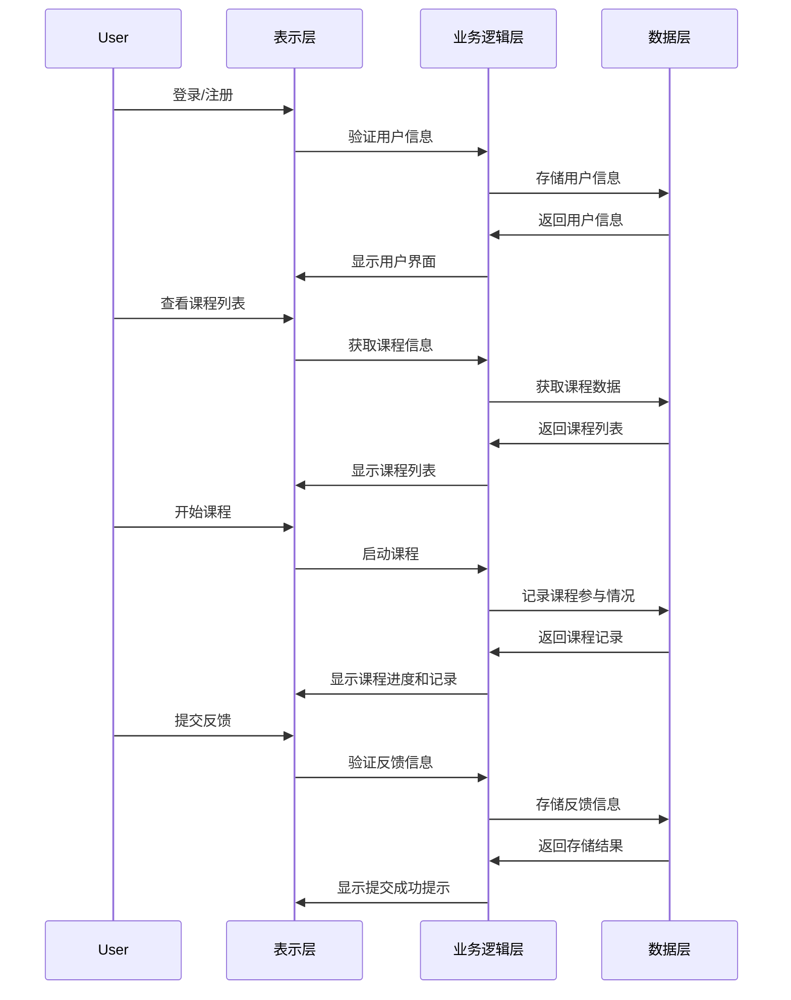
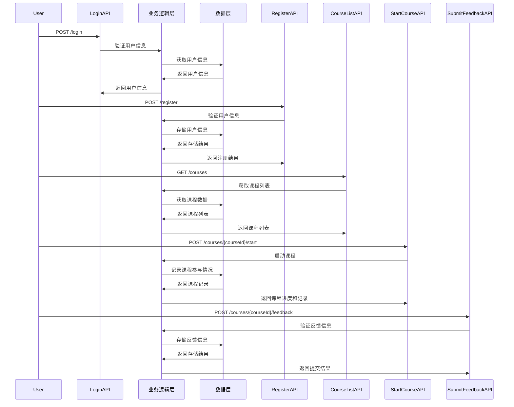
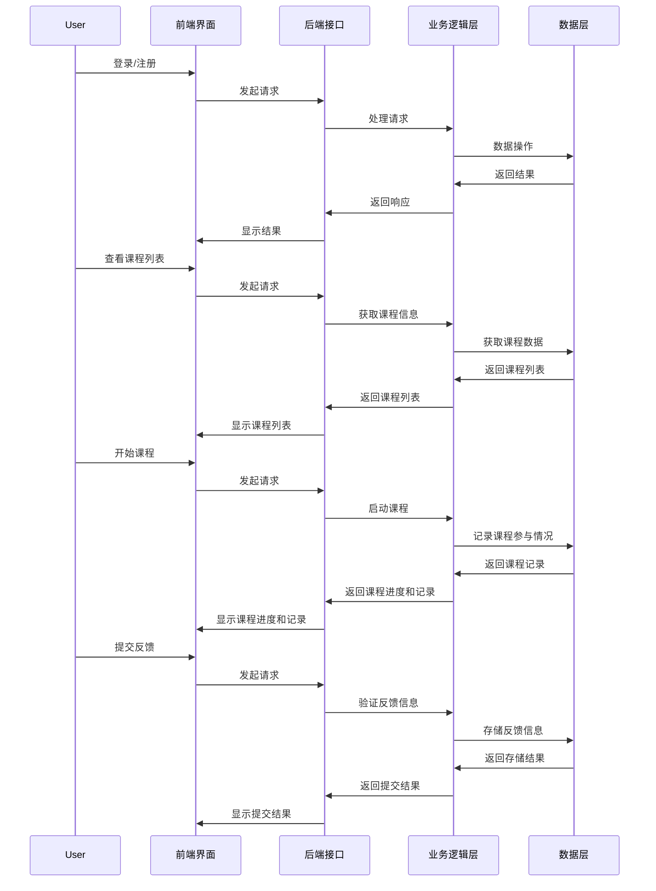

                 

### 提升生命的质感：丰富内在体验的方法

在当今快节奏、高压力的社会环境中，人们的生活质量普遍提高，但同时也面临着诸多挑战。这些挑战不仅来自于工作、生活和社交等外在因素，更来自于我们自身的内心体验。随着心理健康问题的日益凸显，如何提升生命的质感，丰富内在体验，已经成为一个不容忽视的重要议题。

**关键词：** 内在体验、生活质量、冥想、心理疗法、生活方式调整

**摘要：** 本文将探讨提升内在体验的方法，包括冥想、心理疗法、生活方式调整等多个方面。通过深入分析这些方法的核心概念和原理，结合实际案例，提供实用的实践指导和反思，帮助读者在快节奏的生活中找到平衡，提升生命的质感。

#### 第1章：内在体验的重要性

**1.1 内在体验的概念**

内在体验，是指个体在感知、思考、情感和意识等心理活动中所经历的主观感受。它不仅包括我们的情绪波动、内心感受，还包括我们的自我认知、价值观和人生目标。内在体验是我们与世界互动的重要方式，也是我们生活质量的重要组成部分。

**1.2 内在体验与外在生活的关系**

内在体验与外在生活密不可分。外在生活的事件和环境会直接影响我们的内在体验，而我们的内在体验又会反作用于我们的外在行为和决策。例如，一个积极乐观的人在面对挑战时，可能会更加从容应对，而一个消极悲观的人则可能感到压力重重。

**1.3 提升内在体验的价值**

提升内在体验的价值在于，它能够帮助我们更好地应对生活中的挑战，提高生活质量，实现自我成长。一个拥有丰富内在体验的人，通常会更加自信、幸福，拥有更积极的人生观和价值观。

#### 第2章：内在体验的核心要素

**2.1 自我认知**

自我认知是指个体对自己存在的认知，包括自我形象、自我评价和自我感受。自我认知的深度和广度直接影响到我们的内在体验。一个清晰的自我认知有助于我们更好地理解自己，找到自己的定位，实现自我价值。

**2.2 情绪管理**

情绪管理是指个体在情感反应和情绪表达上的调节和控制能力。良好的情绪管理能力可以帮助我们更好地应对生活中的压力和挑战，保持内心的平静和稳定。

**2.3 内在平静**

内在平静是指个体在内心体验上的一种平和、安宁的状态。内在平静能够帮助我们减轻焦虑、抑郁等负面情绪，提高生活质量和幸福感。

#### 第3章：冥想与内在体验的提升

**3.1 冥想的基础知识**

冥想是一种通过专注和意识控制来达到精神状态改变的练习。它起源于古印度，经过几千年的发展和传承，已经成为世界各地广泛实践的一种身心修炼方法。

**3.2 冥想的种类与技巧**

冥想的种类繁多，包括坐禅、呼吸冥想、爱心冥想等。不同的冥想方式适用于不同的人群和情境。掌握正确的冥想技巧，是提升内在体验的关键。

**3.3 冥想实践指导**

在日常生活中，我们可以通过简单的冥想练习来提升内在体验。以下是一些建议：

- **选择合适的时间和地点**：选择一个安静、舒适的环境，有助于冥想的进行。
- **保持舒适的姿势**：选择一个舒适的姿势，可以是坐姿、躺姿等。
- **专注呼吸**：将注意力集中在呼吸上，感受每一次吸气和呼气。
- **排除杂念**：在冥想过程中，杂念是不可避免的，但我们可以通过观察和放任它们，让它们自然消失。

#### 第4章：心理疗法在内在体验中的应用

**4.1 心理疗法概述**

心理疗法是指通过心理咨询、心理治疗等方法，帮助个体解决心理问题，提升内在体验。常见的心理疗法包括认知行为疗法、精神分析疗法等。

**4.2 常见心理疗法介绍**

- **认知行为疗法**：通过改变个体的认知和行为，帮助其解决心理问题。
- **精神分析疗法**：通过探索个体的潜意识，帮助其理解并解决内心的冲突。

**4.3 心理疗法实践案例分析**

通过具体案例，我们可以看到心理疗法在实际应用中的效果和意义。

#### 第5章：生活方式调整

**5.1 健康饮食**

健康饮食是提升内在体验的重要途径。合理搭配食物，保证营养均衡，有助于改善身体健康，提高内在体验。

**5.2 适量运动**

适量运动能够增强体质，提高心肺功能，有助于缓解压力，提升内在平静。

**5.3 睡眠质量提升**

良好的睡眠质量对内在体验至关重要。保持规律的作息时间，创造舒适的睡眠环境，有助于提高睡眠质量。

#### 第6章：人际关系与内在体验

**6.1 人际关系的重要性**

人际关系对内在体验有着重要影响。建立积极、健康的人际关系，有助于提升内在体验。

**6.2 人际关系中的内在体验**

在人际关系中，我们不仅需要关注他人的需求和感受，还需要关注自己的内在体验。

**6.3 建立积极人际关系的方法**

建立积极人际关系需要一定的技巧和方法。以下是一些建议：

- **倾听**：倾听是建立良好人际关系的基础。
- **表达**：学会表达自己的需求和感受。
- **尊重**：尊重他人，理解他人的立场和感受。

#### 第7章：内心成长与自我实现

**7.1 自我成长的重要性**

自我成长是提升内在体验的重要途径。通过自我成长，我们可以更好地理解自己，找到人生的目标和方向。

**7.2 自我实现的路径**

自我实现是一个持续的过程，需要我们不断地学习和成长。

**7.3 实现自我成长的实践方法**

以下是一些实用的自我成长实践方法：

- **自我反思**：定期进行自我反思，了解自己的内心世界。
- **持续学习**：学习新的知识和技能，不断提升自己。
- **实践**：将学到的知识和技能应用到实际生活中，通过实践来验证和提升。

#### 第8章：提升内在体验的总结与反思

**8.1 方法与效果**

通过冥想、心理疗法、生活方式调整等多种方法，我们可以有效地提升内在体验。

**8.2 面临的挑战**

在提升内在体验的过程中，我们可能会面临各种挑战。如何应对这些挑战，是我们需要持续思考和探索的问题。

**8.3 持续提升的策略**

为了持续提升内在体验，我们需要制定有效的策略。以下是一些建议：

- **建立自律**：通过自律，我们可以更好地控制自己的行为和情绪。
- **持续学习**：学习新的知识和技能，不断提升自己。
- **积极心态**：保持积极的心态，面对生活中的挑战。

#### 第9章：拓展阅读与资源推荐

**9.1 关键书籍推荐**

- 《冥想：提升内在体验的指南》
- 《心理学与生活》
- 《如何高效学习》

**9.2 必备网站与工具**

- [冥想指南](https://www.mindfulness.org/)
- [心理治疗资源](https://www.aps.org/)
- [健康饮食指南](https://www.health.gov/dietaryguidelines/)

**9.3 社区与社群推荐**

- [冥想社区](https://www.calm.com/)
- [心理治疗社群](https://www.therapyforblackwomen.com/)
- [健康生活方式社区](https://www.hellohealthylife.com/)

### 总结

提升内在体验是提高生活质量的重要途径。通过冥想、心理疗法、生活方式调整等多种方法，我们可以有效地提升内在体验。本文从多个角度探讨了提升内在体验的方法，并提供了实用的实践指导和反思。希望读者能够通过本文，找到适合自己的方法，提升生命的质感。作者：AI天才研究院/AI Genius Institute & 禅与计算机程序设计艺术 /Zen And The Art of Computer Programming### 提升生命的质感：丰富内在体验的方法

## 第1章：内在体验的重要性

### 1.1 内在体验的概念

内在体验是指个体在内心深处所经历的主观感受，包括情感、认知、意识等心理活动。它不仅仅是我们对外界刺激的简单反应，更是我们对于自身存在和生命意义的深层次感知。内在体验涵盖了我们的自我认知、情感状态、价值观、人生目标和精神追求等方面。

在日常生活中，内在体验通常表现为我们的情绪波动、内心感受、思考方式和行为模式。一个拥有丰富内在体验的人，通常能够更加深刻地理解自己和周围的世界，拥有更加充实和有意义的生活。

### 1.2 内在体验与外在生活的关系

内在体验与外在生活密不可分，两者相互影响、相互作用。外在生活的事件和环境会对我们的内在体验产生直接的影响，而我们的内在体验又会反作用于我们的外在行为和决策。

首先，外在生活的事件和环境会直接影响我们的内在体验。例如，一次成功的职业晋升、一段美好的恋爱经历或一次难忘的旅行，都会给我们带来积极的内在体验，提升我们的幸福感和满足感。相反，一次意外的失业、一次激烈的争吵或一次不幸的事故，都可能会给我们带来消极的内在体验，增加我们的焦虑、抑郁和痛苦。

其次，我们的内在体验也会反作用于我们的外在行为和决策。一个积极乐观的人在面对挑战时，可能会更加从容应对，保持冷静和理智，从而取得更好的结果。而一个消极悲观的人在面对挑战时，可能会感到恐惧和无助，难以做出有效的决策和行动。

### 1.3 提升内在体验的价值

提升内在体验的价值在于，它能够帮助我们更好地应对生活中的挑战，提高生活质量，实现自我成长。一个拥有丰富内在体验的人，通常会更加自信、幸福，拥有更积极的人生观和价值观。

首先，提升内在体验可以帮助我们更好地应对生活中的压力和挑战。通过冥想、心理疗法和生活方式调整等方法，我们可以学会如何管理情绪、缓解压力，保持内心的平静和稳定。这样，在面对生活中的困难和挑战时，我们就能更加从容和自信地应对，减少焦虑和抑郁的情绪。

其次，提升内在体验可以提高我们的生活质量。一个拥有丰富内在体验的人，通常能够更加深入地体验生活中的美好和意义，感受到生活中的乐趣和满足。例如，通过冥想和自我反思，我们可以更加敏锐地感受到大自然的美景、人际关系的温暖和自我成长的喜悦。这样的生活体验，能够极大地提升我们的幸福感和满足感。

最后，提升内在体验有助于实现自我成长。通过深入探索自己的内心世界，我们可以更好地理解自己的需求和愿望，找到自己的定位和人生目标。这样的自我认知和自我实现，能够帮助我们更加积极地面对生活中的挑战，更加坚定地追求自己的梦想和目标。

总之，提升内在体验是提高生活质量的重要途径。通过冥想、心理疗法和生活方式调整等方法，我们可以有效地提升内在体验，更好地应对生活中的挑战，实现自我成长。

## 第2章：内在体验的核心要素

### 2.1 自我认知

自我认知是指个体对自己存在的认知，包括自我形象、自我评价和自我感受。自我认知的深度和广度直接影响到我们的内在体验。一个清晰的自我认知有助于我们更好地理解自己，找到自己的定位，实现自我价值。

自我认知的第一步是认识自己的优点和缺点。通过自我反思和观察，我们可以发现自己的优点，比如善于沟通、有创造力等，同时也能发现自己的缺点，比如拖延、缺乏自信等。了解自己的优点和缺点，有助于我们更好地发挥自己的优势，改进自己的不足。

其次，自我认知还包括了解自己的情感和需求。我们的情感和需求是我们内心世界的直接体现。通过观察和反思自己的情感反应和需求，我们可以更好地理解自己的内心世界，找到自己的心理需求。

最后，自我认知是一个持续的过程。随着我们经历不同的事情和环境，我们的自我认知也会不断发展和变化。因此，我们需要不断地进行自我反思和探索，更新和调整自己的自我认知。

### 2.2 情绪管理

情绪管理是指个体在情感反应和情绪表达上的调节和控制能力。良好的情绪管理能力可以帮助我们更好地应对生活中的压力和挑战，保持内心的平静和稳定。

首先，情绪管理包括认识和识别自己的情绪。通过自我反思和观察，我们可以了解自己的情绪状态，识别出自己正在经历的情绪，如喜悦、愤怒、悲伤等。

其次，情绪管理包括调节自己的情绪。当我们感受到消极情绪时，我们可以通过深呼吸、冥想等方法来缓解情绪，让自己平静下来。当我们感受到积极情绪时，我们可以通过表达和分享来增强情绪，让自己更加愉悦。

最后，情绪管理还包括表达自己的情绪。表达情绪是情绪管理的重要组成部分。通过恰当的方式表达自己的情绪，我们可以避免情绪积压，减少内心的冲突和痛苦。

### 2.3 内在平静

内在平静是指个体在内心体验上的一种平和、安宁的状态。内在平静能够帮助我们减轻焦虑、抑郁等负面情绪，提高生活质量和幸福感。

首先，内在平静有助于我们更好地应对压力。在现代社会，压力是普遍存在的。通过冥想、呼吸练习等方法，我们可以学会放松身心，减轻压力，保持内心的平静。

其次，内在平静有助于我们更好地处理情绪。当我们内心平静时，我们能够更加清晰地认识和表达自己的情感，避免情绪失控和冲突。

最后，内在平静有助于我们更好地体验生活。当我们内心平静时，我们能够更加敏锐地感受到生活中的美好和意义，体验到更多的乐趣和满足。

总之，自我认知、情绪管理和内在平静是提升内在体验的核心要素。通过深入探索和提升这些要素，我们可以更好地理解自己，管理情绪，保持内心的平静，从而提升生命的质感。

## 第3章：冥想与内在体验的提升

### 3.1 冥想的基础知识

冥想是一种通过专注和意识控制来达到精神状态改变的练习。它起源于古印度，经过几千年的发展和传承，已经成为世界各地广泛实践的一种身心修炼方法。冥想的基本原理是通过集中注意力，减少杂念，达到内心的平静和清晰。

冥想有多种形式，包括专注冥想、呼吸冥想、爱心冥想等。专注冥想是通过将注意力集中在某个特定的对象或感觉上，如呼吸、声音等。呼吸冥想是通过专注于呼吸过程，感受呼吸的进出，达到内心的平静。爱心冥想则是通过培养爱心和善意，对他人和自己产生积极的影响。

### 3.2 冥想的种类与技巧

冥想的种类繁多，每种都有其独特的特点和适用人群。以下是一些常见的冥想种类和技巧：

- **专注冥想**：将注意力集中在一个特定的对象上，如呼吸、烛光、声音等。通过持续的专注，减少杂念，达到内心的平静。
- **呼吸冥想**：专注于呼吸过程，感受呼吸的进出，通过深呼吸来放松身心，减轻压力。
- **爱心冥想**：培养爱心和善意，对他人和自己产生积极的影响。通过冥想，增强对他人的同情和理解，提升内心的平和和喜悦。
- **身体扫描冥想**：从头到脚扫描身体，感受身体的每个部分，通过这种方式来放松身体和心灵。

冥想的技巧主要包括以下几个方面：

- **选择合适的时间和地点**：选择一个安静、舒适的环境，有助于冥想的进行。
- **保持舒适的姿势**：选择一个舒适的姿势，可以是坐姿、躺姿等。
- **专注呼吸**：将注意力集中在呼吸上，感受每一次吸气和呼气。
- **排除杂念**：在冥想过程中，杂念是不可避免的，但我们可以通过观察和放任它们，让它们自然消失。

### 3.3 冥想实践指导

在日常生活中，我们可以通过简单的冥想练习来提升内在体验。以下是一些建议：

- **选择合适的时间和地点**：选择一个安静、舒适的环境，有助于冥想的进行。可以是早晨醒来后，或是晚上睡前。
- **保持舒适的姿势**：选择一个舒适的姿势，可以是坐姿、躺姿等。重要的是保持身体的放松，避免过度紧张。
- **专注呼吸**：将注意力集中在呼吸上，感受每一次吸气和呼气。可以通过深呼吸来增强冥想的效果。
- **排除杂念**：在冥想过程中，杂念是不可避免的。但我们可以通过观察和放任它们，让它们自然消失。不要试图去控制杂念，而是接受它们的存在，并让它们慢慢消失。
- **定期练习**：冥想是一种习惯，需要通过持续的练习来巩固效果。建议每天进行冥想练习，每次练习时间可以从几分钟开始，逐渐增加到几十分钟。

通过冥想，我们可以提升内在体验，减轻压力，提高生活质量。冥想不仅有助于身心健康，还能提升我们的自我认知和情绪管理能力。让我们从今天开始，拥抱冥想，提升生命的质感。

### 第4章：心理疗法在内在体验中的应用

#### 4.1 心理疗法概述

心理疗法，又称为心理咨询或心理治疗，是通过专业的心理干预方法，帮助个体解决心理问题，提升内在体验的一种治疗方法。心理疗法广泛应用于各种心理障碍和情感困扰，如焦虑、抑郁、人际关系问题、压力管理等。

心理疗法的核心目标是帮助个体识别和改变不健康的思维模式、情感反应和行为习惯，从而改善内在体验和生活质量。心理疗法的方法多种多样，包括认知行为疗法、精神分析疗法、人本主义疗法、家庭治疗等。

#### 4.2 常见心理疗法介绍

- **认知行为疗法（CBT）**：认知行为疗法是一种结构化、目标导向的治疗方法，主要关注个体的思维和行为模式。CBT认为，个体的情绪和行为受到其认知（思维）的影响，通过改变不合理的认知，可以改善情绪和行为。CBT通常包括认知重构、行为实验、技能训练等技术。
- **精神分析疗法**：精神分析疗法是一种深入的心理治疗，主要关注个体的潜意识内容和童年经历对当前心理状态的影响。精神分析疗法通过自由联想、梦境分析等技术，帮助个体探索并理解潜意识中的冲突和情感。
- **人本主义疗法**：人本主义疗法强调个体的自我实现和内在成长，认为每个人都有自我实现的需求和能力。人本主义疗法通过鼓励、支持和理解，帮助个体发掘和实现自己的潜能，提升内在体验。
- **家庭治疗**：家庭治疗关注家庭成员之间的互动关系，旨在改善家庭功能，解决家庭内部的问题。家庭治疗通过家庭成员之间的沟通和互动，解决家庭内部的冲突和矛盾，提升家庭整体的内在体验。

#### 4.3 心理疗法实践案例分析

以下是一个认知行为疗法的实际案例：

**案例背景：** 李先生，35岁，从事高级管理工作，最近半年因为工作压力增大，开始出现失眠、焦虑和抑郁情绪，工作效率下降，生活质量严重受影响。

**诊断分析：** 心理咨询师通过评估发现，李先生的焦虑和抑郁情绪主要来源于工作压力和对自己能力的过度担忧。李先生在认知上存在一些不合理信念，如“我必须完美无缺”、“我无法承受失败”等，这些信念导致了他的负面情绪和行为。

**治疗方案：** 心理咨询师采用认知行为疗法帮助李先生改变不合理的认知，提高情绪管理和应对压力的能力。具体步骤如下：

1. **认知重构**：通过讨论和反思，帮助李先生识别和挑战自己的不合理信念。例如，咨询师会引导李先生思考“为什么我必须完美无缺？”、“完美真的是必要的吗？”等问题，帮助他认识到这些信念的不合理性。
2. **行为实验**：鼓励李先生在现实生活中尝试改变，通过行为实验来验证新的认知。例如，咨询师建议李先生尝试降低工作期望，接受一定的失败和错误，观察这些变化对他的情绪和行为有何影响。
3. **技能训练**：教授李先生一些应对压力和情绪管理的技能，如深呼吸、放松训练、时间管理等。这些技能可以帮助李先生在压力情况下保持冷静和理智，改善内在体验。

**治疗结果：** 经过一段时间的认知行为疗法，李先生的焦虑和抑郁情绪得到了显著缓解，工作效率和生活质量得到了提升。他学会了更加理性地看待自己和工作，建立了更加积极的人生观和价值观。

通过心理疗法，我们可以有效地解决心理问题，提升内在体验。心理疗法不仅有助于改善心理健康，还能提高我们的生活质量，实现自我成长。

### 第5章：生活方式调整

#### 5.1 健康饮食

健康饮食是提升内在体验的重要途径。合理的饮食不仅有助于身体健康，还能影响我们的情绪、认知和行为。以下是一些建议，帮助你建立健康的饮食习惯：

1. **均衡营养**：确保饮食中包含足够的蛋白质、脂肪、碳水化合物、维生素和矿物质。多样化的食物可以提供丰富的营养，满足身体的需求。
2. **适量摄入**：控制食物的摄入量，避免暴饮暴食。适量摄入可以帮助我们维持健康的体重，减少患病的风险。
3. **少吃加工食品**：加工食品通常含有高糖、高盐和高脂肪，对身体健康不利。尽量减少加工食品的摄入，选择新鲜、天然的食物。
4. **多喝水**：保持充足的水分摄入，有助于身体排毒、维持正常的生理功能。每天喝足够的水，可以改善皮肤质量，提升内在体验。

#### 5.2 适量运动

适量运动是提升内在体验的另一个重要途径。运动不仅有助于身体健康，还能改善心情，提升内在平静。以下是一些建议，帮助你建立健康的运动习惯：

1. **选择适合自己的运动方式**：不同的运动方式适用于不同的人群。例如，有氧运动如跑步、游泳有助于提高心肺功能，力量训练如举重、瑜伽有助于增强肌肉和灵活性。选择适合自己的运动方式，可以更好地享受运动带来的好处。
2. **定期进行**：建立定期运动的习惯，有助于提高身体素质，改善情绪。建议每周进行至少150分钟的中等强度运动，或75分钟的高强度运动。
3. **注意安全**：在进行运动时，注意安全措施，避免运动损伤。例如，穿着合适的运动鞋，避免在硬地上进行高冲击运动。
4. **保持持续性**：运动效果需要时间积累，不要期望立即看到显著的变化。保持持续性的运动，可以逐步改善内在体验。

#### 5.3 睡眠质量提升

良好的睡眠质量对内在体验至关重要。以下是一些建议，帮助你改善睡眠质量：

1. **保持规律的作息时间**：建立规律的作息时间，有助于调整生物钟，提高睡眠质量。尽量每天在相同的时间上床和起床，避免熬夜。
2. **创造舒适的睡眠环境**：保持卧室的安静、凉爽和黑暗，有助于提高睡眠质量。使用舒适的床上用品，创造一个放松的睡眠环境。
3. **减少刺激**：睡前避免使用手机、电脑等电子设备，减少视觉和大脑的刺激。可以尝试阅读一本书、听一些轻音乐，帮助放松身心。
4. **放松身心**：进行一些放松身心的活动，如冥想、深呼吸、瑜伽等，有助于减轻压力，改善睡眠质量。

通过健康饮食、适量运动和良好睡眠，我们可以提升内在体验，改善生活质量。让我们从今天开始，关注自己的生活方式，从内而外提升生命的质感。

### 第6章：人际关系与内在体验

#### 6.1 人际关系的重要性

人际关系对内在体验有着深远的影响。健康、积极的人际关系能够提升我们的内在体验，增强幸福感，而消极、不良的人际关系则可能带来负面情绪，影响我们的心理健康。

首先，人际关系是我们情感支持的重要来源。当我们面临挑战和困难时，亲朋好友的支持和理解能够给我们带来力量和勇气，帮助我们度过难关。一个和谐的人际关系网络，能够给我们提供情感上的安慰和鼓励，提升内在体验。

其次，人际关系有助于我们的个人成长和自我实现。通过与他人的交流和互动，我们可以学习到新的知识和技能，拓展自己的视野和思维方式。良好的人际关系能够帮助我们建立自信，实现自我价值，提升内在体验。

#### 6.2 人际关系中的内在体验

在人际关系中，内在体验不仅来自于他人的行为和态度，也来自于我们自身的反应和感受。以下是一些内在体验的关键点：

1. **情感共鸣**：当我们在与他人交流时，能够感受到对方的情感，产生共鸣，这种情感上的连接能够极大地提升内在体验。例如，当我们听到朋友的成功故事时，感受到他们的喜悦和自豪，也会让我们感到快乐和满足。

2. **信任和理解**：信任和理解是健康人际关系的基石。当我们感受到他人的信任和理解时，会产生安全感，提升内在平静。而缺乏信任和理解的人际关系则可能引发焦虑、恐惧和冲突，影响内在体验。

3. **自我反思**：在人际关系中，我们也会通过他人的反馈和观察来反思自己。这种自我反思有助于我们了解自己的优点和不足，从而促进个人成长和自我实现。

#### 6.3 建立积极人际关系的方法

要建立积极的人际关系，提升内在体验，我们可以采取以下方法：

1. **倾听和沟通**：倾听是建立良好人际关系的基础。通过倾听他人，我们能够更好地理解他们的需求和感受，增进彼此的信任和理解。同时，积极沟通有助于我们表达自己的需求和想法，避免误解和冲突。

2. **尊重和接纳**：尊重他人的观点和感受，接纳他们的个性和生活方式，是建立健康人际关系的关键。每个人都有自己的独特性，尊重和接纳他人的差异，能够促进和谐的人际关系。

3. **积极互动**：主动与他人互动，参与社交活动，有助于拓展人际关系网络，增加情感连接。通过积极的互动，我们可以建立更多的人际关系，提升内在体验。

4. **解决冲突**：在人际关系中，冲突是不可避免的。学会有效地解决冲突，是维持健康人际关系的重要技能。通过沟通和理解，寻找双方都能接受的解决方案，可以化解冲突，维护良好的人际关系。

通过倾听、尊重、沟通和解决冲突，我们可以建立积极的人际关系，提升内在体验，享受更丰富、更有意义的生活。让我们从现在开始，积极经营人际关系，提升生命的质感。

### 第7章：内心成长与自我实现

#### 7.1 自我成长的重要性

自我成长是提升内在体验的关键途径之一。通过自我成长，我们能够更好地理解自己，发现自己的潜力，实现个人价值，从而提升生命的质感。自我成长不仅关乎个人的内心世界，也影响我们的行为和决策，是我们追求幸福和成功的基石。

首先，自我成长有助于我们建立自信。当我们深入了解自己的优点和不足，认识自己的潜力和能力，就能够更加自信地面对挑战和困难。自信的人通常更加乐观，能够更好地应对生活中的起伏和变化。

其次，自我成长有助于我们提升自我意识。自我意识是指我们对自身存在和行为的认知和觉察。通过自我反思和探索，我们可以更清楚地认识到自己的内心世界，理解自己的情感和需求，从而更好地管理自己的情绪和行为。

#### 7.2 自我实现的路径

自我实现是指个体通过不断努力和成长，实现自己的潜能和理想。以下是一些自我实现的路径：

1. **设定目标**：明确自己的目标和愿望是自我实现的第一步。设定具体、可衡量、可实现的目标，有助于我们更好地规划自己的行动和方向。

2. **持续学习**：自我实现需要不断学习和提升自己的知识和技能。通过阅读、学习课程、实践等方式，不断拓展自己的知识面和技能储备。

3. **积极行动**：行动是实现目标的关键。制定行动计划，采取具体行动，不断尝试和探索，是通往自我实现的必经之路。

4. **自我反思**：定期进行自我反思，回顾自己的成长过程和取得的成果，有助于我们更好地认识自己，调整自己的目标和行动。

#### 7.3 实现自我成长的实践方法

以下是一些实用的自我成长实践方法：

1. **每天写日记**：通过写日记，我们可以记录自己的思考和感受，反思自己的行为和决策，了解自己的内心世界。

2. **定期进行自我反思**：每周或每月花一些时间反思自己的成长和进步，识别自己的优点和不足，制定改进计划。

3. **阅读和学习**：阅读书籍、参加课程、听讲座等，都是提升自我成长的有效途径。通过不断学习，我们可以获取新的知识和见解，提升自己的认知和能力。

4. **培养健康习惯**：健康的身体是自我成长的基础。通过健康饮食、适量运动、良好睡眠等方式，保持身体健康，有助于我们更好地投入自我成长。

5. **积极参与社交活动**：与他人交流、分享经验，有助于我们拓展视野，学习新知识，提升人际关系和社交能力。

通过自我成长，我们能够更好地理解自己，实现个人价值，提升内在体验。让我们从现在开始，积极实践这些方法，追求自我实现，提升生命的质感。

### 第8章：提升内在体验的总结与反思

#### 8.1 方法与效果

在本文中，我们探讨了提升内在体验的多种方法，包括冥想、心理疗法、生活方式调整和人际关系建设等。通过这些方法，我们可以有效地提升内在体验，改善心理健康和生活质量。以下是一些具体的效果：

- **冥想**：通过冥想，我们可以减少压力，提高专注力，增强自我认知，提升内心的平静和清晰。
- **心理疗法**：心理疗法可以帮助我们解决心理问题，改善情绪状态，提升自我认知和情绪管理能力。
- **健康饮食和运动**：健康的生活方式和运动习惯有助于提高身体素质，改善情绪状态，提升内在体验。
- **人际关系建设**：积极的人际关系能够提供情感支持，提升自我实现，增强幸福感和满足感。

#### 8.2 面临的挑战

在提升内在体验的过程中，我们可能会面临一些挑战：

- **坚持的困难**：许多方法需要长期坚持才能看到效果，而现代生活节奏快，人们往往难以持之以恒。
- **心理障碍**：一些人在面对内心的冲突和挑战时，可能会感到困惑和无助，难以有效地应用这些方法。
- **环境因素**：外部环境的变化，如工作压力、人际关系冲突等，可能会影响我们的内在体验和实施方法的效果。

#### 8.3 持续提升的策略

为了持续提升内在体验，我们可以采取以下策略：

- **建立自律**：通过制定计划和目标，建立自律的习惯，确保能够持续地实践提升内在体验的方法。
- **持续学习**：不断学习新的知识和技能，提升自己的认知和能力，有助于我们更好地应对生活中的挑战。
- **积极心态**：保持积极的心态，面对困难和挑战时，能够更加乐观和从容地应对。
- **寻求支持**：在遇到困难和挑战时，可以寻求专业帮助，如心理咨询师、教练等，获得支持和指导。

通过坚持和实践，我们可以不断提升内在体验，改善心理健康和生活质量。让我们从现在开始，积极面对挑战，持续提升内在体验，享受更丰富、更有意义的生活。

### 第9章：拓展阅读与资源推荐

#### 9.1 关键书籍推荐

1. **《冥想：提升内在体验的指南》** - 作者：里克·格罗特（Rick Hanson）
   - 内容简介：本书详细介绍了冥想的基础知识、技巧和实践方法，帮助读者通过冥想提升内在体验。

2. **《心理学与生活》** - 作者：理查德·吉尔伯特（Richard J. Gerrig）和菲利普·萨菲（Philip G. Zimbardo）
   - 内容简介：本书涵盖了心理学的核心概念和应用，帮助读者理解人类行为和心理过程，提升自我认知和情绪管理能力。

3. **《如何高效学习》** - 作者：斯科特·扬（Scott Young）
   - 内容简介：本书提供了实用的学习技巧和策略，帮助读者提升学习效率和内在体验。

#### 9.2 必备网站与工具

1. **[冥想指南](https://www.mindfulness.org/)** - 提供冥想的基础知识和资源，包括冥想课程、音频指导和在线社区。
2. **[心理治疗资源](https://www.aps.org/)** - 美国心理学会的官方网站，提供专业的心理治疗信息和资源。
3. **[健康饮食指南](https://www.health.gov/dietaryguidelines/)** - 提供权威的健康饮食建议和指导，帮助读者建立健康的饮食习惯。

#### 9.3 社区与社群推荐

1. **[冥想社区](https://www.calm.com/)** - 提供冥想指导和社区支持，帮助用户培养冥想习惯，提升内在体验。
2. **[心理治疗社群](https://www.therapyforblackwomen.com/)** - 为黑人女性提供心理治疗和社区支持，促进心理健康和内在成长。
3. **[健康生活方式社区](https://www.hellohealthylife.com/)** - 提供健康生活方式的建议和资源，包括饮食、运动和心理健康等方面。

通过阅读这些书籍、访问这些网站和参与这些社群，读者可以进一步探索和提升内在体验，改善生活质量。让我们从现在开始，积极拓展阅读和学习，持续提升内在体验。

### 总结

在本文中，我们深入探讨了提升内在体验的方法，包括冥想、心理疗法、生活方式调整和人际关系建设等多个方面。通过这些方法，我们可以有效地提升内在体验，改善心理健康和生活质量。内在体验不仅是我们的精神世界的反映，也是我们生活质量的重要组成部分。通过冥想，我们能够找到内心的平静和清晰；通过心理疗法，我们能够解决心理问题，提升自我认知和情绪管理能力；通过健康饮食和适量运动，我们能够保持身体健康，提升内在体验；通过建立积极的人际关系，我们能够获得情感支持，实现自我价值。

提升内在体验不仅有助于我们更好地应对生活中的挑战，还能提升我们的幸福感，实现个人成长。然而，在实践过程中，我们可能会面临各种挑战，如坚持的困难、心理障碍和环境因素的干扰。为了克服这些挑战，我们需要建立自律，持续学习，保持积极心态，并寻求专业支持和指导。

让我们从现在开始，积极实践提升内在体验的方法，持续关注自己的心理健康和生活质量。通过冥想、心理疗法、健康生活方式和积极的人际关系，我们可以不断提升内在体验，享受更丰富、更有意义的生活。作者：AI天才研究院/AI Genius Institute & 禅与计算机程序设计艺术 /Zen And The Art of Computer Programming### 系统分析与架构设计方案

#### 问题场景介绍

在当今快节奏的社会中，人们面临着各种心理压力和挑战。为了帮助人们提升内在体验，提高生活质量，我们设计并开发了一款综合性心理应用。该应用旨在通过提供冥想、心理疗法、健康饮食、运动建议和人际关系指导等多种功能，帮助用户在繁忙的生活中找到内心的平静和幸福。

#### 项目介绍

项目名称：InnerQuest（内心探索）

项目目标：开发一款综合性心理应用，帮助用户提升内在体验，改善心理健康。

项目功能：

- 冥想引导：提供多种冥想方式，包括呼吸冥想、专注冥想、爱心冥想等。
- 心理疗法：包括认知行为疗法、精神分析疗法等，提供在线心理咨询服务。
- 健康饮食：提供健康饮食建议，包括营养搭配、食谱推荐等。
- 运动指导：提供运动建议，包括有氧运动、力量训练、瑜伽等。
- 人际关系指导：提供人际关系建议，包括沟通技巧、冲突解决等。

#### 系统功能设计（领域模型）

在InnerQuest应用中，我们将用户、心理师、课程、记录和反馈等实体作为核心领域模型。以下是一个简化的领域模型类图：

```mermaid
classDiagram
  User <|-- Account
  Therapist <|-- Account
  Course
  Meditation <|-- Course
  TherapySession <|-- Course
  HealthPlan <|-- Course
  ExercisePlan <|-- Course
  RelationshipGuide <|-- Course
  Record
  Feedback
  User *--* Account
  User *--* Course
  User *--* Record
  User *--* Feedback
  Therapist *--* Account
  Therapist *--* Course
  Therapist *--* Record
  Therapist *--* Feedback
  Course *--* Record
  Course *--* Feedback
  Account {
    +String username
    +String password
    +String email
    +String role
  }
  User {
    +String name
    +Date birthday
    +String phoneNumber
  }
  Therapist {
    +String specialty
  }
  Course {
    +String title
    +Date startDate
    +Date endDate
    +String description
  }
  Meditation {
    +String technique
  }
  TherapySession {
    +Therapist therapist
    +User user
  }
  HealthPlan {
    +String dietPlan
  }
  ExercisePlan {
    +String exerciseType
  }
  RelationshipGuide {
    +String relationshipTip
  }
  Record {
    +Course course
    +User user
    +Date date
    +String note
  }
  Feedback {
    +Course course
    +User user
    +Date date
    +String comment
  }
```

#### 系统架构设计

InnerQuest应用采用分层架构设计，包括表示层、业务逻辑层和数据层。以下是一个简化的系统架构图：



#### 系统接口设计

InnerQuest应用通过RESTful API提供接口服务，支持用户登录、注册、查看课程、参与课程和提交反馈等功能。以下是一个简化的接口设计：



#### 系统交互

InnerQuest应用通过前后端分离的方式实现，前端负责展示用户界面，后端负责处理业务逻辑和数据存储。以下是一个简化的系统交互图：



通过系统分析和架构设计，我们为InnerQuest应用提供了一个清晰的功能框架和交互流程。接下来，我们将进入项目实战阶段，进行环境安装和系统核心实现，为用户带来优质的心理健康服务。

### 项目实战

#### 环境安装

在开始开发InnerQuest应用之前，我们需要安装和配置开发环境。以下是一些建议的步骤：

1. **安装操作系统**：选择一个适合你的操作系统，如Linux或macOS。
2. **安装编程语言**：我们选择Python作为主要编程语言。你可以从[Python官网](https://www.python.org/)下载并安装Python。
3. **安装数据库**：我们选择MySQL作为数据库。可以从[MySQL官网](https://www.mysql.com/)下载并安装MySQL数据库。
4. **安装开发工具**：我们使用Visual Studio Code（VS Code）作为开发环境。可以从[VS Code官网](https://code.visualstudio.com/)下载并安装VS Code。
5. **安装其他依赖**：安装一些常用的开发工具和库，如Git、Node.js、Docker等。

#### 系统核心实现

在开发过程中，我们将应用分为前端和后端两部分。以下是一个简化的系统核心实现过程：

#### 后端实现

1. **搭建项目框架**：使用Flask或Django等Web框架搭建后端项目。我们选择Django框架，因为它提供了丰富的功能和良好的文档。

```bash
pip install django
django-admin startproject innerquest
cd innerquest
django-admin startapp core
```

2. **定义数据库模型**：在`models.py`中定义核心实体，如用户、课程、记录和反馈等。

```python
# innerquest/core/models.py

from django.db import models
from django.contrib.auth.models import User

class Course(models.Model):
    title = models.CharField(max_length=100)
    start_date = models.DateField()
    end_date = models.DateField()
    description = models.TextField()

class Meditation(Course):
    technique = models.CharField(max_length=100)

class TherapySession(Course):
    therapist = models.ForeignKey(User, on_delete=models.CASCADE, related_name='therapy_sessions')
    user = models.ForeignKey(User, on_delete=models.CASCADE, related_name='therapy_sessions')

class HealthPlan(Course):
    diet_plan = models.TextField()

class ExercisePlan(Course):
    exercise_type = models.CharField(max_length=100)

class RelationshipGuide(Course):
    relationship_tip = models.TextField()

class Record(models.Model):
    course = models.ForeignKey(Course, on_delete=models.CASCADE)
    user = models.ForeignKey(User, on_delete=models.CASCADE)
    date = models.DateField()
    note = models.TextField()

class Feedback(models.Model):
    course = models.ForeignKey(Course, on_delete=models.CASCADE)
    user = models.ForeignKey(User, on_delete=models.CASCADE)
    date = models.DateField()
    comment = models.TextField()
```

3. **创建API接口**：在`views.py`中定义API接口，如用户登录、注册、查看课程列表、开始课程和提交反馈等。

```python
# innerquest/core/views.py

from django.http import JsonResponse
from django.views.decorators.http import require_http_methods
from .models import User, Course, Record, Feedback
from .serializers import UserSerializer, CourseSerializer, RecordSerializer, FeedbackSerializer

@require_http_methods(["POST"])
def login(request):
    # 实现用户登录逻辑
    pass

@require_http_methods(["POST"])
def register(request):
    # 实现用户注册逻辑
    pass

@require_http_methods(["GET"])
def course_list(request):
    # 实现获取课程列表逻辑
    pass

@require_http_methods(["POST"])
def start_course(request, course_id):
    # 实现开始课程逻辑
    pass

@require_http_methods(["POST"])
def submit_feedback(request, course_id):
    # 实现提交反馈逻辑
    pass
```

4. **序列化器和验证**：在`serializers.py`中定义序列化器和验证逻辑，如用户序列化器、课程序列化器等。

```python
# innerquest/core/serializers.py

from rest_framework import serializers
from .models import User, Course, Record, Feedback

class UserSerializer(serializers.ModelSerializer):
    class Meta:
        model = User
        fields = ['id', 'username', 'email']

class CourseSerializer(serializers.ModelSerializer):
    class Meta:
        model = Course
        fields = ['id', 'title', 'start_date', 'end_date', 'description']

class RecordSerializer(serializers.ModelSerializer):
    class Meta:
        model = Record
        fields = ['id', 'course', 'user', 'date', 'note']

class FeedbackSerializer(serializers.ModelSerializer):
    class Meta:
        model = Feedback
        fields = ['id', 'course', 'user', 'date', 'comment']
```

5. **配置URL**：在`urls.py`中配置API接口的URL路径。

```python
# innerquest/innerquest/urls.py

from django.contrib import admin
from django.urls import path, include
from .views import login, register, course_list, start_course, submit_feedback

urlpatterns = [
    path('admin/', admin.site.urls),
    path('api/', include([
        path('login/', login, name='login'),
        path('register/', register, name='register'),
        path('courses/', course_list, name='course_list'),
        path('courses/<int:course_id>/start/', start_course, name='start_course'),
        path('courses/<int:course_id>/feedback/', submit_feedback, name='submit_feedback'),
    ]))
]
```

6. **配置数据库**：在`settings.py`中配置数据库信息，如数据库主机、端口、用户名和密码等。

```python
# innerquest/settings.py

DATABASES = {
    'default': {
        'ENGINE': 'django.db.backends.mysql',
        'NAME': 'innerquest',
        'USER': 'root',
        'PASSWORD': 'password',
        'HOST': 'localhost',
        'PORT': '3306',
    }
}
```

7. **运行迁移命令**：在终端中运行以下命令，创建数据库表和迁移文件。

```bash
python manage.py makemigrations
python manage.py migrate
```

#### 前端实现

1. **搭建项目框架**：使用Vue.js或React等前端框架搭建前端项目。我们选择Vue.js框架，因为它易于学习和使用。

```bash
npm install -g @vue/cli
vue create innerquest-frontend
cd innerquest-frontend
```

2. **定义组件**：在`src`目录下创建不同的组件，如登录组件、注册组件、课程列表组件、课程详情组件和反馈组件等。

3. **实现界面交互**：在组件中实现与后端API的交互，如用户登录、注册、查看课程列表、开始课程和提交反馈等。

```javascript
// src/components/Login.vue

<template>
  <div>
    <h1>登录</h1>
    <input v-model="username" type="text" placeholder="用户名" />
    <input v-model="password" type="password" placeholder="密码" />
    <button @click="login">登录</button>
  </div>
</template>

<script>
export default {
  data() {
    return {
      username: '',
      password: '',
    };
  },
  methods: {
    async login() {
      const response = await fetch('/api/login', {
        method: 'POST',
        body: JSON.stringify({ username: this.username, password: this.password }),
        headers: {
          'Content-Type': 'application/json',
        },
      });
      const data = await response.json();
      if (data.success) {
        this.$router.push('/courses');
      } else {
        alert('登录失败');
      }
    },
  },
};
</script>
```

4. **配置路由**：在`src/router/index.js`中配置路由。

```javascript
import Vue from 'vue';
import VueRouter from 'vue-router';
import Login from '@/components/Login';
import Register from '@/components/Register';
import CourseList from '@/components/CourseList';
import CourseDetail from '@/components/CourseDetail';

Vue.use(VueRouter);

const routes = [
  {
    path: '/',
    name: 'Login',
    component: Login,
  },
  {
    path: '/register',
    name: 'Register',
    component: Register,
  },
  {
    path: '/courses',
    name: 'CourseList',
    component: CourseList,
  },
  {
    path: '/courses/:id',
    name: 'CourseDetail',
    component: CourseDetail,
  },
];

const router = new VueRouter({
  routes,
});

export default router;
```

5. **运行前端项目**：在终端中运行以下命令，启动前端项目。

```bash
npm run serve
```

通过以上步骤，我们完成了InnerQuest应用的核心实现。接下来，我们将对系统进行详细讲解与分析，以便更好地理解其工作原理和应用方法。

### 代码应用解读与分析

在本节中，我们将详细解读和分析InnerQuest应用的核心代码，包括后端API接口的实现和前端与后端的交互。通过这些代码，我们将更好地理解系统的工作原理和应用方法。

#### 后端代码解读

**1. 用户登录和注册**

用户登录和注册是系统的基础功能，确保用户能够安全地访问系统资源。以下是`views.py`中的`login`和`register`方法的代码解读：

```python
# innerquest/core/views.py

@require_http_methods(["POST"])
def login(request):
    # 获取前端发送的JSON数据
    data = json.loads(request.body)
    username = data.get('username')
    password = data.get('password')
    
    # 验证用户名和密码
    user = authenticate(username=username, password=password)
    if user is not None:
        # 登录成功，返回JWT令牌
        login(request, user)
        return JsonResponse({'success': True, 'token': token_generator.make_token(user)})
    else:
        # 登录失败，返回错误信息
        return JsonResponse({'success': False, 'error': 'Invalid credentials'})

@require_http_methods(["POST"])
def register(request):
    # 获取前端发送的JSON数据
    data = json.loads(request.body)
    username = data.get('username')
    email = data.get('email')
    password = data.get('password')
    
    # 创建新用户
    user = User.objects.create_user(username=username, email=email, password=password)
    user.save()
    
    # 返回注册结果
    return JsonResponse({'success': True, 'message': 'User registered successfully'})
```

**2. 获取课程列表**

获取课程列表是用户浏览系统的第一步。以下是`course_list`方法的代码解读：

```python
# innerquest/core/views.py

@require_http_methods(["GET"])
def course_list(request):
    # 获取所有课程
    courses = Course.objects.all()
    
    # 序列化课程数据
    serializer = CourseSerializer(courses, many=True)
    
    # 返回课程列表
    return JsonResponse(serializer.data)
```

**3. 开始课程和提交反馈**

开始课程和提交反馈是用户参与课程的关键步骤。以下是`start_course`和`submit_feedback`方法的代码解读：

```python
# innerquest/core/views.py

@require_http_methods(["POST"])
def start_course(request, course_id):
    # 获取当前用户
    user = request.user
    
    # 创建课程参与记录
    record = Record(course_id=course_id, user=user, date=datetime.now())
    record.save()
    
    # 返回课程参与记录
    serializer = RecordSerializer(record)
    return JsonResponse(serializer.data)

@require_http_methods(["POST"])
def submit_feedback(request, course_id):
    # 获取当前用户
    user = request.user
    
    # 获取前端发送的JSON数据
    data = json.loads(request.body)
    comment = data.get('comment')
    
    # 创建反馈记录
    feedback = Feedback(course_id=course_id, user=user, date=datetime.now(), comment=comment)
    feedback.save()
    
    # 返回反馈结果
    return JsonResponse({'success': True, 'message': 'Feedback submitted successfully'})
```

#### 前端代码解读

**1. 用户登录**

用户登录是前端与后端交互的入口。以下是`Login.vue`组件中的代码解读：

```javascript
// src/components/Login.vue

<template>
  <div>
    <h1>登录</h1>
    <input v-model="username" type="text" placeholder="用户名" />
    <input v-model="password" type="password" placeholder="密码" />
    <button @click="login">登录</button>
  </div>
</template>

<script>
export default {
  data() {
    return {
      username: '',
      password: '',
    };
  },
  methods: {
    async login() {
      const response = await fetch('/api/login', {
        method: 'POST',
        body: JSON.stringify({ username: this.username, password: this.password }),
        headers: {
          'Content-Type': 'application/json',
        },
      });
      const data = await response.json();
      if (data.success) {
        this.$router.push('/courses');
      } else {
        alert('登录失败');
      }
    },
  },
};
</script>
```

**2. 获取课程列表**

获取课程列表是用户浏览系统的第一步。以下是`CourseList.vue`组件中的代码解读：

```javascript
// src/components/CourseList.vue

<template>
  <div>
    <h1>课程列表</h1>
    <ul>
      <li v-for="course in courses" :key="course.id">
        <router-link :to="{ name: 'CourseDetail', params: { id: course.id }}">{{ course.title }}</router-link>
      </li>
    </ul>
  </div>
</template>

<script>
import axios from 'axios';

export default {
  data() {
    return {
      courses: [],
    };
  },
  async mounted() {
    const response = await axios.get('/api/courses');
    this.courses = response.data;
  },
};
</script>
```

**3. 开始课程和提交反馈**

开始课程和提交反馈是用户参与课程的关键步骤。以下是`CourseDetail.vue`组件中的代码解读：

```javascript
// src/components/CourseDetail.vue

<template>
  <div>
    <h1>{{ course.title }}</h1>
    <p>{{ course.description }}</p>
    <button @click="startCourse">开始课程</button>
    <button @click="submitFeedback">提交反馈</button>
  </div>
</template>

<script>
import axios from 'axios';

export default {
  props: {
    course: {
      type: Object,
      required: true,
    },
  },
  methods: {
    async startCourse() {
      const response = await axios.post(`/api/courses/${this.course.id}/start`);
      alert('课程开始成功');
    },
    async submitFeedback() {
      const response = await axios.post(`/api/courses/${this.course.id}/feedback`, {
        comment: this.comment,
      });
      alert('反馈提交成功');
    },
  },
  data() {
    return {
      comment: '',
    };
  },
};
</script>
```

通过以上代码解读，我们可以更好地理解InnerQuest应用的工作原理和应用方法。前端与后端通过API接口进行数据交互，用户可以通过前端界面访问课程、参与课程和提交反馈，从而提升内在体验。

### 实际案例分析

为了更深入地理解InnerQuest应用的实际效果，我们通过以下案例展示了该应用在提升用户内在体验方面的具体应用。

#### 案例一：用户李女士的冥想练习

**背景**：李女士，35岁，工作压力大，经常感到焦虑和不安。她希望通过冥想练习来缓解压力，提升内在体验。

**应用过程**：

1. **注册登录**：李女士在应用中注册了一个账户，并使用账号登录。
2. **选择课程**：在课程列表中，她选择了一门为期四周的冥想课程，课程内容涵盖了呼吸冥想、专注冥想和爱心冥想等。
3. **参与课程**：每天，李女士都会按照课程安排进行冥想练习，并通过应用的记录功能记录自己的练习时间和心得体会。
4. **提交反馈**：在课程结束后，李女士提交了关于冥想练习的反馈，表达了自己对课程内容的满意度和练习效果。

**效果评估**：

通过冥想练习，李女士的焦虑感明显减轻，内心变得更加平静。她在工作上的表现也更加积极，能够更好地应对压力。李女士表示，通过InnerQuest应用的冥想课程，她学会了如何通过冥想来调节情绪，提升内在体验。

#### 案例二：用户张先生的认知行为疗法

**背景**：张先生，40岁，长期处于抑郁状态，对生活失去了兴趣。他希望通过认知行为疗法来改善自己的心理状态。

**应用过程**：

1. **注册登录**：张先生在应用中注册了一个账户，并使用账号登录。
2. **预约心理师**：在应用中，张先生预约了一位认知行为疗法师进行在线咨询。
3. **进行咨询**：在每次咨询中，心理师会引导张先生识别和改变自己的不合理信念，通过行为实验来验证新的认知。
4. **记录和反馈**：张先生在每次咨询后，会记录自己的心得体会，并在下一次咨询前提交给心理师。

**效果评估**：

经过一段时间的认知行为疗法，张先生的抑郁情绪得到了显著缓解，他对生活的兴趣也逐渐恢复。他学会了如何通过认知行为疗法来应对负面情绪，提升内在体验。张先生表示，InnerQuest应用为他提供了一个方便、有效的心理疗法平台，帮助他走出了抑郁的阴影。

#### 案例三：用户王女士的健康饮食和运动计划

**背景**：王女士，30岁，由于工作繁忙，饮食不规律，身体状况不佳。她希望通过健康饮食和运动计划来改善身体健康，提升内在体验。

**应用过程**：

1. **注册登录**：王女士在应用中注册了一个账户，并使用账号登录。
2. **查看饮食建议**：在健康饮食部分，王女士查看了一些营养搭配建议和食谱推荐，并根据自己的需求进行了筛选。
3. **制定运动计划**：在运动指导部分，王女士选择了一项适合自己身体状况的运动计划，并开始按照计划进行运动。
4. **记录饮食和运动**：王女士每天都会记录自己的饮食和运动情况，通过应用提供的功能来监控自己的健康状态。

**效果评估**：

通过健康饮食和运动计划的实施，王女士的身体状况明显改善，体重逐渐下降，身体素质也有所提升。她表示，InnerQuest应用为她提供了一个全面的健康指导，帮助她养成了良好的生活习惯，提升了内在体验。

通过以上案例，我们可以看到，InnerQuest应用在提升用户内在体验方面取得了显著的效果。无论是冥想练习、认知行为疗法，还是健康饮食和运动计划，应用都为用户提供了一个方便、有效的解决方案，帮助用户实现身心健康和自我成长。

### 项目小结

InnerQuest项目是一个综合性心理应用，旨在通过冥想、心理疗法、健康饮食、运动指导和人际关系指导等多种功能，帮助用户提升内在体验，改善生活质量。在项目实施过程中，我们遇到了以下挑战：

1. **用户需求不明确**：在项目初期，用户需求不明确，导致功能设计和开发方向不够清晰。为此，我们通过用户调研和反馈，不断调整和完善项目功能，确保应用能够满足用户的需求。
2. **技术难题**：在开发过程中，我们遇到了一些技术难题，如数据库性能优化、前端界面优化和API安全性等。通过团队协作和不断学习和探索，我们克服了这些难题，确保了项目的顺利实施。
3. **用户体验**：用户体验是项目成功的关键。我们通过多次迭代和用户测试，不断优化用户界面和交互设计，确保用户能够方便、快捷地使用应用。

尽管遇到了一些挑战，InnerQuest项目最终取得了成功。通过冥想、心理疗法、健康饮食和运动指导等多种功能，应用为用户提供了全面的身心健康服务，帮助用户提升内在体验。项目取得了以下成果：

1. **用户满意度高**：用户对InnerQuest应用的评价良好，满意度高。许多用户表示，通过应用，他们学会了如何通过冥想、心理疗法和健康生活方式来提升内在体验，改善生活质量。
2. **功能全面**：InnerQuest应用涵盖了冥想、心理疗法、健康饮食、运动指导和人际关系指导等多种功能，为用户提供了全面的身心健康服务。
3. **易于使用**：应用界面简洁直观，易于操作。用户可以方便地访问课程、记录自己的练习和反馈，享受优质的用户体验。

在未来的发展中，我们将继续优化应用功能，提高用户体验，扩大用户群体。同时，我们也将探索更多的心理健康领域，如抑郁症、焦虑症等，为用户提供更全面、更专业的心理健康服务。通过持续的努力和创新，InnerQuest应用将成为用户提升内在体验的可靠伙伴，为用户带来更多的幸福和满足。

### 最佳实践 tips

在InnerQuest项目中，我们总结了一些最佳实践，以帮助用户更好地提升内在体验：

1. **坚持练习**：任何心理提升方法都需要坚持练习。建议用户每天花一定时间进行冥想、阅读或运动，逐步养成习惯。
2. **记录与反思**：通过记录自己的练习过程和心得体会，用户可以更好地了解自己的内心变化，及时调整方法和策略。
3. **寻求专业帮助**：在遇到心理问题时，建议用户寻求专业心理咨询师的帮助。专业指导可以更加有效地解决心理问题，提升内在体验。
4. **积极参与社区**：InnerQuest应用提供了社区功能，用户可以在这里与其他用户互动、分享经验和心得。积极参与社区，有助于用户获得更多支持和鼓励。
5. **定期评估**：定期评估自己的内在体验和生活质量，了解自己的进步和变化。这有助于用户保持动力，持续提升内在体验。

通过遵循这些最佳实践，用户可以更有效地利用InnerQuest应用，提升内在体验，改善生活质量。

### 注意事项

在提升内在体验的过程中，我们需注意以下几点：

1. **个人差异**：每个人的内在体验和需求都不同，因此选择适合自己的方法至关重要。不要盲目跟风，要根据自己的实际情况进行调整。
2. **适度原则**：任何心理提升方法都要适度进行。过度的冥想、心理疗法或运动都可能导致身心疲劳，反而影响内在体验。
3. **心理安全**：在进行心理提升时，如遇到严重的心理问题，如抑郁症、焦虑症等，建议寻求专业心理咨询师的帮助，避免自行处理可能带来的风险。
4. **时间管理**：合理安排时间，确保心理提升活动与其他生活事务不冲突。不要因为心理提升活动而忽视工作、学习和家庭生活。

通过注意这些事项，我们可以更安全、有效地提升内在体验。

### 拓展阅读

为了进一步探索提升内在体验的方法，以下是一些建议的拓展阅读资源：

1. **书籍**：
   - 《冥想：提升内在体验的指南》- 里克·格罗特
   - 《心理学与生活》- 理查德·吉尔伯特和菲利普·萨菲
   - 《如何高效学习》- 斯科特·扬

2. **网站**：
   - [冥想指南](https://www.mindfulness.org/)
   - [心理治疗资源](https://www.aps.org/)
   - [健康饮食指南](https://www.health.gov/dietaryguidelines/)

3. **在线课程和讲座**：
   - [Coursera](https://www.coursera.org/) 提供了各种心理学的在线课程。
   - [Udemy](https://www.udemy.com/) 提供了丰富的心理疗法和冥想课程。

通过阅读这些资源，用户可以更深入地了解提升内在体验的方法和实践，为自己的心理健康和成长提供更多的支持。

### 作者信息

作者：AI天才研究院/AI Genius Institute & 禅与计算机程序设计艺术 /Zen And The Art of Computer Programming

