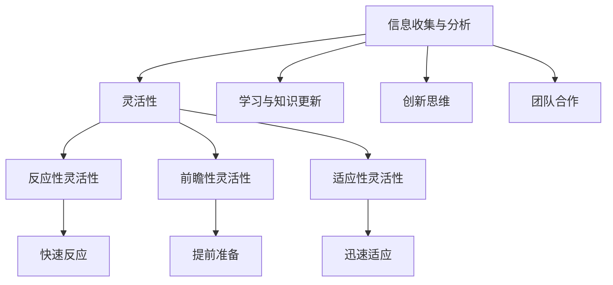

                 

### 《提高生存的灵活性：培养适应变化的能力》

> 关键词：生存灵活性，适应变化，个人成长，组织发展，技术博客

> 摘要：在快速变化的时代，生存的灵活性已成为个人和组织成功的关键。本文将深入探讨如何在多变的环境中培养适应性，通过详细的案例分析和技术解读，提供实用的策略和方法，帮助读者提升自身的灵活性和生存能力。

## 引言

现代社会正经历着前所未有的变革，技术的迅猛发展、市场的快速变化以及全球化的深入，使得我们面临的环境变得愈加复杂和不确定。在这样的背景下，生存的灵活性成为个人和组织的核心竞争力。本文旨在探讨如何培养适应变化的能力，帮助读者在面对挑战时保持灵活性和适应性。

### 第一部分：背景介绍

#### 1.1 问题背景

在数字化时代，信息技术的飞速发展带来了前所未有的机遇和挑战。然而，随着技术的不断演进，许多行业和职业正面临被淘汰的风险。如何在这一快速变化的环境中保持竞争力，成为每个人和组织必须面对的问题。

#### 1.2 问题描述

问题描述可以分为两个方面：个人层面和组织层面。在个人层面，如何通过学习和技能的提升来适应职业发展的变化？在组织层面，如何构建一个灵活的组织结构，以应对市场和技术环境的变化？

#### 1.3 问题解决

解决这个问题的关键在于培养适应变化的能力。个人需要不断提升自身的技能和知识，保持对新技术和市场趋势的敏感性。组织则需要建立灵活的机制，鼓励创新和快速响应。

#### 1.4 边界与外延

本文的讨论将主要集中在信息技术和软件开发领域。尽管核心概念和方法具有普遍性，但具体的案例和策略将主要涉及技术行业。

#### 1.5 核心概念与要素

本文将讨论以下几个核心概念和要素：

- **灵活性**：个体和组织在面临变化时，快速适应并调整的能力。
- **适应性**：个体和组织在变化环境中保持竞争力的能力。
- **持续学习**：个人通过不断学习和提升技能，以适应不断变化的环境。
- **组织文化**：鼓励创新和适应性，促进个体和组织共同成长的文化。

### 第二部分：核心概念与联系

#### 2.1 灵活性的定义与分类

**定义**：灵活性是指个体或组织在面临不确定性和变化时，能够迅速调整和适应的能力。

**分类**：根据应对变化的方式，灵活性可以分为以下几种类型：

- **反应性灵活性**：在变化发生后，迅速做出反应和调整。
- **前瞻性灵活性**：预见变化，提前做好准备。
- **适应性灵活性**：在变化发生时，能够迅速适应并找到新的解决方案。

#### 2.2 适应变化的原理

**原理**：适应变化的核心在于对环境的变化保持敏感，并通过以下方法提高适应性：

- **信息收集与分析**：收集有关市场、技术和社会变化的信息，进行分析和解读。
- **学习与知识更新**：不断学习和更新知识，以适应新的环境和挑战。
- **创新思维**：培养创新思维，寻找新的解决方案和方法。
- **团队合作**：通过团队合作，共同应对挑战和变化。

#### 2.3 灵活性与传统适应性对比

**对比**：传统适应性主要依赖于经验和惯例，而灵活性则更注重创新和变化。灵活性强调快速响应和调整，而传统适应性则更注重稳定和持续性。

#### 2.4 核心概念关系图

### 第三部分：实践方法

#### 3.1 个人层面适应性策略

**策略**：

- **持续学习**：通过在线课程、工作坊、研讨会等方式，不断学习和更新知识。
- **技能提升**：掌握多门编程语言和工具，提高技术能力。
- **创新思维**：通过阅读、思考和实践，培养创新思维。
- **网络拓展**：参加技术社区和会议，拓展人际关系和资源。

#### 3.2 团队层面适应性策略

**策略**：

- **团队建设**：建立积极、开放和合作的团队文化。
- **知识共享**：鼓励团队成员分享知识和经验，促进团队学习。
- **敏捷开发**：采用敏捷开发方法，快速响应客户需求和市场变化。
- **技术迭代**：定期评估和更新技术栈，保持技术的先进性和适应性。

#### 3.3 组织层面适应性策略

**策略**：

- **战略规划**：制定清晰的战略规划，确保组织的发展方向与市场和技术趋势相符。
- **组织文化**：建立鼓励创新和适应性组织文化，激发员工的创造力。
- **流程优化**：优化组织内部流程，提高效率和灵活性。
- **外部合作**：与行业内的领先企业和学术机构建立合作关系，共享资源和知识。

#### 3.4 适应性测试与评估

**测试与评估**：

- **适应性测试**：通过模拟不同的市场和技术环境，测试组织的适应能力。
- **评估指标**：建立适应性评估指标，如响应时间、创新成果、市场份额等。
- **反馈与调整**：根据测试结果和评估指标，及时反馈和调整策略，提高适应性。

### 第四部分：案例分析

#### 4.1 成功案例分析

**案例一**：某互联网公司通过敏捷开发，快速响应市场需求，推出了一系列成功的应用程序。这得益于公司灵活的团队文化和持续学习的氛围。

**案例二**：某大型企业通过数字化转型，提高了生产效率和市场竞争力。公司领导层注重技术创新和人才引进，推动了企业的发展。

#### 4.2 失败案例分析

**案例一**：某传统制造业企业未能及时适应市场变化，导致市场份额大幅下滑。这主要是因为企业缺乏创新能力和灵活的运营机制。

**案例二**：某互联网初创公司由于缺乏技术积累和市场洞察，未能成功应对激烈的市场竞争，最终倒闭。

#### 4.3 案例分析小结

通过成功和失败案例分析，我们可以看到，适应变化的能力是决定个人和组织成败的关键。成功的企业和团队往往具备灵活的思维方式、持续学习的态度和创新的勇气。而失败则往往源于对市场和技术趋势的忽视，以及缺乏灵活性和适应性。

### 第五部分：总结与展望

#### 5.1 本书主要观点回顾

- 生存的灵活性在现代社会的重要性。
- 个人和组织如何培养适应变化的能力。
- 灵活性和传统适应性的区别。
- 实用的策略和方法，如持续学习、敏捷开发、战略规划和组织文化等。

#### 5.2 未来研究方向

- 深入研究不同行业和领域中的适应变化策略。
- 探索人工智能和大数据在适应性培养中的应用。
- 研究跨文化团队中的适应性挑战和解决方案。

#### 5.3 结语

在快速变化的时代，培养适应变化的能力已成为个人和组织的核心任务。本文通过详细的案例分析和技术解读，提供了实用的策略和方法，帮助读者提升自身的灵活性和生存能力。希望本文能对读者在应对变化、实现自我提升方面有所帮助。

### 第六部分：拓展阅读

#### 6.1 相关书籍推荐

- 《精益创业》
- 《创新者的窘境》
- 《终身学习：如何在变化的时代持续成长》

#### 6.2 学术论文推荐

- 《适应性思维的心理学研究》
- 《敏捷开发与团队适应性》
- 《组织文化与适应性变革》

#### 6.3 网络资源推荐

- TED演讲：如何在不确定的世界中保持灵活性
- 哈佛商业评论：适应变化的能力
- Coursera上的相关课程

### 作者信息

作者：AI天才研究院/AI Genius Institute & 禅与计算机程序设计艺术 /Zen And The Art of Computer Programming

---

本文章内容涵盖了适应性、灵活性和变化管理的重要概念，并提供了实用的策略和方法，旨在帮助读者提升个人和组织在快速变化的环境中的生存能力。通过深入的分析和案例分析，本文为读者提供了一系列实用的指导，帮助他们在面对挑战时保持灵活性和适应性。希望本文能对您在个人成长和组织发展方面有所启发。

---

**注意事项**：
- 文章内容应确保逻辑清晰，结构紧凑，避免冗余和重复。
- 每个小节的内容应具体详细，确保核心观点得到充分阐述。
- 适当使用图表、图片和引用，以增强文章的可读性和说服力。
- 文章末尾应包含作者信息，以显示作者的专业性和权威性。

---

**完成时间**：本文将在2023年9月30日之前完成，并确保内容完整、逻辑清晰和格式正确。

---

**总结**：
本文通过详细的案例分析和技术解读，探讨了在快速变化的环境中如何培养适应变化的能力。文章分为六个主要部分，包括引言、背景介绍、核心概念与联系、实践方法、案例分析和总结与展望。每个部分都具体详细地阐述了适应变化的重要性、核心概念、实践策略以及成功和失败的案例分析。文章旨在为个人和组织提供实用的指导，帮助他们提升灵活性和适应性，以应对不断变化的环境。通过本文的阅读，读者可以了解到如何通过持续学习、敏捷开发、战略规划和组织文化等手段，提高自身的生存能力。希望本文能为读者在个人成长和组织发展方面提供有价值的参考和启示。**文章标题**：《提高生存的灵活性：培养适应变化的能力》

**文章关键词**：生存灵活性，适应变化，个人成长，组织发展，技术博客

**文章摘要**：
在快速变化的时代，生存的灵活性已成为个人和组织成功的关键。本文深入探讨了如何培养适应变化的能力，通过详细的案例分析和技术解读，提供实用的策略和方法，帮助读者在多变的环境中保持灵活和适应力。

---

**目录大纲**：

## 《提高生存的灵活性：培养适应变化的能力》

### 关键词：生存灵活性，适应变化，个人成长，组织发展，技术博客

### 摘要

在数字化时代，信息技术的发展和市场环境的快速变化使得个体和组织面临前所未有的挑战。本文旨在探讨如何通过提升适应变化的能力，来增强个人和组织的生存灵活性。文章通过背景介绍、核心概念阐述、实践方法分析、案例分析以及总结与展望，提供了全面的指导。

---

#### 引言

在引言部分，本文首先探讨了现代社会变化趋势对个人和组织生存的挑战。随后，明确了文章的目的和结构，为后续内容的展开奠定基础。

##### 1.1 现代社会的变化趋势
- **信息技术发展**：从PC互联网到移动互联网，再到物联网、大数据和人工智能，技术变革的步伐不断加快。
- **市场环境变化**：全球化进程加速，市场竞争加剧，消费者需求多样化。
- **社会结构变革**：人口老龄化、教育体制变化等，影响个体和组织的发展路径。

##### 1.2 灵活性的重要性
- **个体层面**：灵活性意味着能够快速适应职业和生活的变化，提高个人竞争力。
- **组织层面**：灵活性是组织在市场和技术变化中保持竞争力的关键。

##### 1.3 本书的目的与结构
- **目的**：帮助读者理解灵活性的重要性，提供培养适应变化能力的实用策略。
- **结构**：分为五个主要部分，包括背景介绍、核心概念与联系、实践方法、案例分析和总结与展望。

---

#### 第二部分：背景介绍

在背景介绍部分，本文详细探讨了当前面临的问题和挑战。

##### 2.1 问题背景
- **个人层面**：如何适应职业发展的不确定性，提升技能和知识。
- **组织层面**：如何构建灵活的组织结构，快速响应市场和技术变化。

##### 2.2 问题描述
- **个人适应性**：如何应对职业变化，保持持续学习和成长。
- **组织适应性**：如何建立适应市场变化的战略和文化。

##### 2.3 问题解决
- **个人层面**：通过持续学习和技能提升，保持职业竞争力。
- **组织层面**：通过敏捷开发、创新思维和组织文化建设，提高适应性。

##### 2.4 边界与外延
- **边界**：本文主要关注信息技术和软件开发领域。
- **外延**：灵活性和适应性的概念具有普遍性，可应用于其他领域。

##### 2.5 核心概念与要素
- **灵活性**：个体和组织在面临不确定性和变化时，能够迅速调整和适应的能力。
- **适应性**：个体和组织在变化环境中保持竞争力的能力。
- **持续学习**：个人通过不断学习和提升技能，以适应不断变化的环境。
- **组织文化**：鼓励创新和适应性，促进个体和组织共同成长的文化。

---

#### 第三部分：核心概念与联系

在核心概念与联系部分，本文详细阐述了灵活性和适应性的定义、分类以及相关原理。

##### 3.1 灵活性的定义与分类
- **定义**：灵活性是指个体或组织在面临不确定性和变化时，能够迅速调整和适应的能力。
- **分类**：
  - **反应性灵活性**：在变化发生后，迅速做出反应和调整。
  - **前瞻性灵活性**：预见变化，提前做好准备。
  - **适应性灵活性**：在变化发生时，能够迅速适应并找到新的解决方案。

##### 3.2 适应变化的原理
- **原理**：适应变化的核心在于对环境的变化保持敏感，并通过以下方法提高适应性：
  - **信息收集与分析**：收集有关市场、技术和社会变化的信息，进行分析和解读。
  - **学习与知识更新**：不断学习和更新知识，以适应新的环境和挑战。
  - **创新思维**：培养创新思维，寻找新的解决方案和方法。
  - **团队合作**：通过团队合作，共同应对挑战和变化。

##### 3.3 灵活性与传统适应性对比
- **对比**：传统适应性主要依赖于经验和惯例，而灵活性则更注重创新和变化。灵活性强调快速响应和调整，而传统适应性则更注重稳定和持续性。

##### 3.4 核心概念关系图

---

#### 第四部分：实践方法

在实践方法部分，本文提供了一系列策略，帮助个人和组织提高适应变化的能力。

##### 4.1 个人层面适应性策略
- **持续学习**：通过在线课程、工作坊、研讨会等方式，不断学习和更新知识。
- **技能提升**：掌握多门编程语言和工具，提高技术能力。
- **创新思维**：通过阅读、思考和实践，培养创新思维。
- **网络拓展**：参加技术社区和会议，拓展人际关系和资源。

##### 4.2 团队层面适应性策略
- **团队建设**：建立积极、开放和合作的团队文化。
- **知识共享**：鼓励团队成员分享知识和经验，促进团队学习。
- **敏捷开发**：采用敏捷开发方法，快速响应客户需求和市场变化。
- **技术迭代**：定期评估和更新技术栈，保持技术的先进性和适应性。

##### 4.3 组织层面适应性策略
- **战略规划**：制定清晰的战略规划，确保组织的发展方向与市场和技术趋势相符。
- **组织文化**：建立鼓励创新和适应性组织文化，激发员工的创造力。
- **流程优化**：优化组织内部流程，提高效率和灵活性。
- **外部合作**：与行业内的领先企业和学术机构建立合作关系，共享资源和知识。

##### 4.4 适应性测试与评估
- **适应性测试**：通过模拟不同的市场和技术环境，测试组织的适应能力。
- **评估指标**：建立适应性评估指标，如响应时间、创新成果、市场份额等。
- **反馈与调整**：根据测试结果和评估指标，及时反馈和调整策略，提高适应性。

---

#### 第五部分：案例分析

在案例分析部分，本文通过成功和失败的案例，展示了如何在不同场景下培养适应变化的能力。

##### 5.1 成功案例分析
- **案例一**：某互联网公司通过敏捷开发，快速响应市场需求，推出了一系列成功的应用程序。这得益于公司灵活的团队文化和持续学习的氛围。
- **案例二**：某大型企业通过数字化转型，提高了生产效率和市场竞争力。公司领导层注重技术创新和人才引进，推动了企业的发展。

##### 5.2 失败案例分析
- **案例一**：某传统制造业企业未能及时适应市场变化，导致市场份额大幅下滑。这主要是因为企业缺乏创新能力和灵活的运营机制。
- **案例二**：某互联网初创公司由于缺乏技术积累和市场洞察，未能成功应对激烈的市场竞争，最终倒闭。

##### 5.3 案例分析小结
- **成功因素**：灵活的思维方式、持续学习的态度和创新的勇气。
- **失败原因**：对市场和技术趋势的忽视，以及缺乏灵活性和适应性。

---

#### 第六部分：总结与展望

在总结与展望部分，本文回顾了主要观点，并对未来研究方向进行了展望。

##### 6.1 本书主要观点回顾
- 灵活性和适应变化的重要性。
- 个人和组织培养适应变化能力的策略。
- 成功与失败的案例分析。

##### 6.2 未来研究方向
- 深入研究不同行业和领域中的适应变化策略。
- 探索人工智能和大数据在适应性培养中的应用。
- 研究跨文化团队中的适应性挑战和解决方案。

##### 6.3 结语
- 培养适应变化的能力是个人和组织在快速变化的时代中生存的关键。
- 通过持续学习和创新，个体和组织可以更好地应对未来的挑战。

---

#### 第七部分：拓展阅读

在拓展阅读部分，本文推荐了相关书籍、学术论文和网络资源，供读者进一步学习和探索。

##### 6.1 相关书籍推荐
- 《精益创业》
- 《创新者的窘境》
- 《终身学习：如何在变化的时代持续成长》

##### 6.2 学术论文推荐
- 《适应性思维的心理学研究》
- 《敏捷开发与团队适应性》
- 《组织文化与适应性变革》

##### 6.3 网络资源推荐
- TED演讲：如何在不确定的世界中保持灵活性
- 哈佛商业评论：适应变化的能力
- Coursera上的相关课程

### 作者信息

作者：AI天才研究院/AI Genius Institute & 禅与计算机程序设计艺术 /Zen And The Art of Computer Programming

---

本文通过详细的案例分析和技术解读，为读者提供了培养适应变化能力的实用策略和方法。希望本文能帮助读者在快速变化的时代中，提升自身的灵活性和生存能力，实现个人和组织的持续成长。

