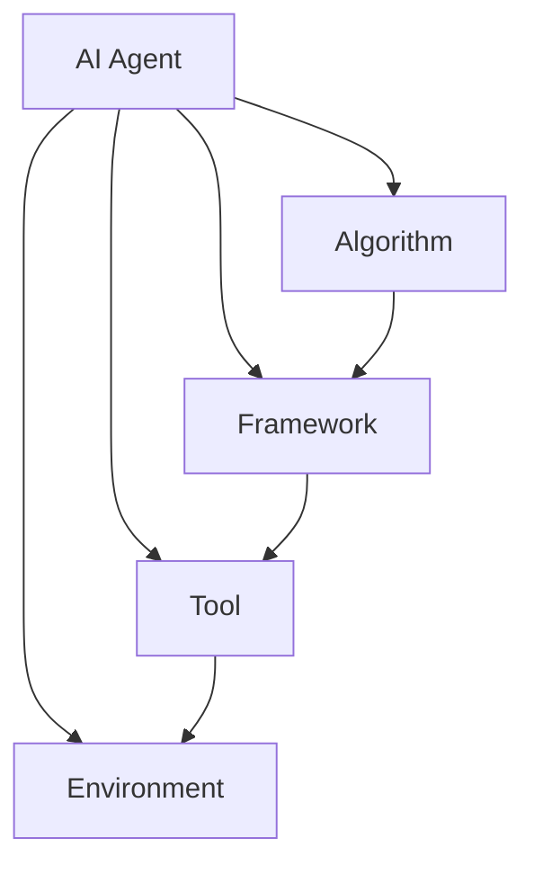
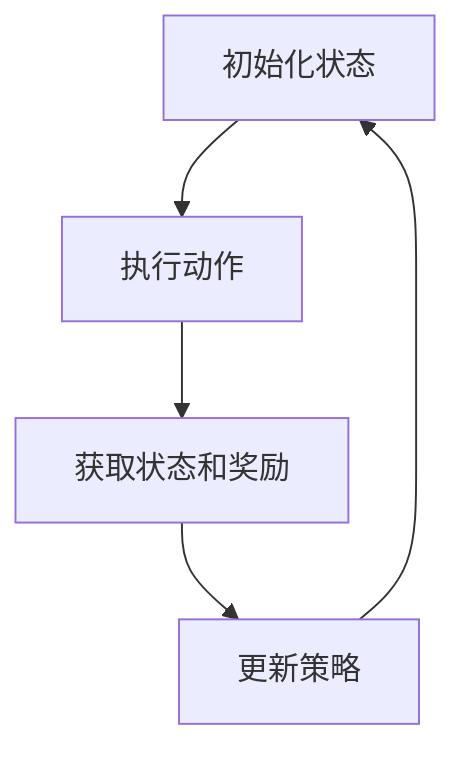
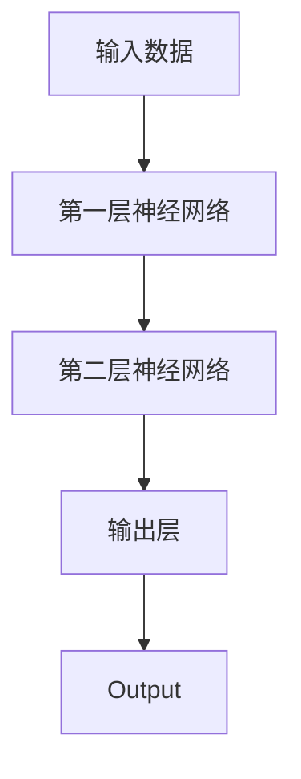
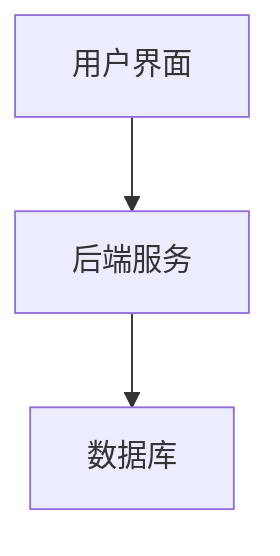
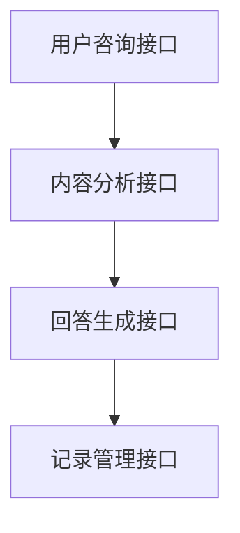
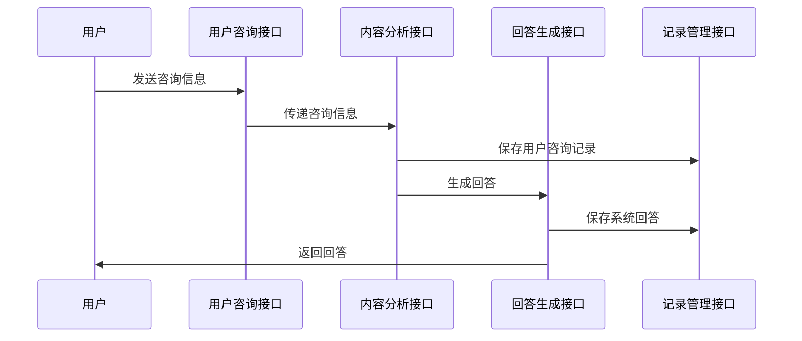

                 

### 搭建AI Agent开发环境：必要工具与框架

**关键词：** AI Agent、开发环境、工具、框架、搭建步骤

**摘要：** 本文将深入探讨AI Agent开发环境的搭建过程，详细介绍所需的关键工具和框架，并逐步展示如何实现一个AI Agent项目。通过清晰的步骤和实际案例，帮助读者全面了解并掌握AI Agent的开发流程。

---

### 目录

1. **背景介绍**
   - **1.1 问题背景**
   - **1.2 问题描述**
   - **1.3 问题解决**
   - **1.4 边界与外延**

2. **核心概念与联系**
   - **2.1 核心概念介绍**
   - **2.2 概念属性特征对比**
   - **2.3 概念间关系Mermaid流程图**

3. **算法原理讲解**
   - **3.1 算法1：强化学习算法**
     - **3.1.1 Mermaid流程图**
     - **3.1.2 Python代码示例**
     - **3.1.3 数学模型与公式**
     - **3.1.4 详细讲解与举例**
   - **3.2 算法2：深度学习算法**
     - **3.2.1 Mermaid流程图**
     - **3.2.2 Python代码示例**
     - **3.2.3 数学模型与公式**
     - **3.2.4 详细讲解与举例**

4. **数学模型与公式**
   - **4.1 强化学习数学模型**
   - **4.2 深度学习数学模型**

5. **系统分析与架构设计方案**
   - **5.1 问题场景介绍**
   - **5.2 系统功能设计**
   - **5.3 系统架构设计**
   - **5.4 系统接口设计**
   - **5.5 系统交互**

6. **项目实战**
   - **6.1 环境安装**
   - **6.2 核心实现**
   - **6.3 代码解读与分析**
   - **6.4 实际案例分析**
   - **6.5 项目小结**

7. **最佳实践与拓展**
   - **7.1 最佳实践**
   - **7.2 小结**
   - **7.3 注意事项**
   - **7.4 拓展阅读**

---

### 第一部分：背景介绍

#### 1.1 问题背景

在当今快速发展的科技时代，人工智能（AI）已经成为了众多企业和研究机构关注的热点领域。AI Agent作为一种能够自主学习和执行任务的智能体，正在逐渐应用于各种场景，如自动驾驶、智能客服、金融风控等。然而，要搭建一个有效的AI Agent开发环境，需要具备丰富的技术背景和精确的工具选择。

#### 1.2 问题描述

开发一个AI Agent需要多个关键组件的支持，包括算法、框架、工具和环境等。选择合适的组件并正确配置它们，是确保AI Agent项目成功的关键。本文将详细探讨如何搭建一个高效、可靠的AI Agent开发环境，并提供实际操作步骤。

#### 1.3 问题解决

通过系统性地介绍核心概念、算法原理、系统架构和项目实战，本文将帮助读者全面了解AI Agent的开发流程。同时，本文还将提供最佳实践和注意事项，以确保读者能够顺利搭建自己的AI Agent开发环境。

#### 1.4 边界与外延

本文主要关注通用AI Agent的开发环境搭建，不包括特定领域的专业工具和算法。此外，由于篇幅限制，本文不会深入探讨底层硬件和操作系统配置，但会提供必要的指引和参考资源。

---

### 第二部分：核心概念与联系

#### 2.1 核心概念介绍

在搭建AI Agent开发环境之前，我们需要了解几个关键概念：

1. **AI Agent**：能够自主决策并执行任务的智能体。
2. **算法**：用于实现AI Agent智能行为的数学模型，如强化学习和深度学习。
3. **框架**：提供算法实现的标准化库和工具，如TensorFlow和PyTorch。
4. **工具**：用于数据预处理、模型训练和部署的实用工具，如Jupyter Notebook和Docker。
5. **环境**：包括硬件配置、操作系统和软件依赖的集成环境。

#### 2.2 概念属性特征对比

为了更清晰地理解这些概念，我们通过以下表格对比它们的属性特征：

| 概念       | 属性特征                                                     |
|------------|--------------------------------------------------------------|
| AI Agent   | 自主决策、自主执行任务、能够学习                             |
| 算法       | 数学模型、实现智能行为、优化目标函数                         |
| 框架       | 标准化库、工具链、简化开发流程                             |
| 工具       | 数据预处理、模型训练、模型部署                             |
| 环境       | 硬件配置、操作系统、软件依赖                               |

#### 2.3 概念间关系Mermaid流程图

为了更好地展示这些概念之间的关系，我们可以使用Mermaid流程图进行描述：



这个流程图展示了AI Agent、算法、框架、工具和环境之间的依赖关系，为后续的详细讲解打下了基础。

---

### 第三部分：算法原理讲解

在本部分，我们将重点介绍两个核心算法：强化学习算法和深度学习算法。通过Mermaid流程图、Python代码示例、数学模型与公式，以及详细讲解和举例，帮助读者深入理解这些算法的原理和应用。

#### 3.1 算法1：强化学习算法

强化学习算法是一种通过试错和反馈进行学习的算法，其主要目标是使智能体在特定环境中获得最大化收益。以下是强化学习算法的基本原理：

##### 3.1.1 Mermaid流程图



这个流程图描述了强化学习算法的基本循环：智能体在初始状态下执行动作，然后根据获得的奖励和状态更新其策略。

##### 3.1.2 Python代码示例

```python
import numpy as np

# 初始化参数
epsilon = 0.1  # 探索概率
learning_rate = 0.1

# 初始化状态和动作空间
state_space = np.array([0, 1, 2])
action_space = np.array([0, 1])

# 初始化策略
policy = np.zeros((len(state_space), len(action_space)))

# 强化学习算法迭代过程
for episode in range(1000):
    state = np.random.choice(state_space)
    action = np.random.choice(action_space, p=policy[state])
    reward = 0
    if action == 1:
        reward = 1
    next_state = np.random.choice(state_space)
    policy[state, action] += learning_rate * (reward - policy[state, action])
    state = next_state

print("Final Policy:")
print(policy)
```

这个Python代码示例展示了如何实现一个简单的强化学习算法。代码中初始化了状态、动作空间和策略，然后通过迭代过程更新策略。

##### 3.1.3 数学模型与公式

强化学习算法的核心是策略更新函数，其公式如下：

$$
\pi(s, a) = \pi(s, a) + \alpha \cdot (r(s, a) - \pi(s, a))
$$

其中，$\pi(s, a)$是策略参数，$r(s, a)$是奖励函数，$\alpha$是学习率。

##### 3.1.4 详细讲解与举例

强化学习算法的原理是通过不断尝试和反馈来优化策略。在上面的Python代码示例中，我们初始化了一个状态空间和动作空间，并定义了一个策略。在每一次迭代中，智能体随机选择一个状态，执行一个动作，并根据动作的结果更新策略。

假设智能体处于状态0，选择动作0（不移动），获得的奖励为0，则策略参数更新为：

$$
\pi(0, 0) = \pi(0, 0) + 0.1 \cdot (0 - \pi(0, 0))
$$

这个公式表示策略参数增加了一个学习率乘以奖励和当前策略参数之差。

通过不断的迭代和更新，智能体会逐渐优化其策略，从而在特定环境中获得最大化收益。

#### 3.2 算法2：深度学习算法

深度学习算法是一种通过多层神经网络进行特征学习和预测的算法。它广泛应用于图像识别、自然语言处理等领域。以下是深度学习算法的基本原理：

##### 3.2.1 Mermaid流程图



这个流程图描述了深度学习算法的基本结构：输入数据通过多层神经网络进行特征提取和变换，最后输出预测结果。

##### 3.2.2 Python代码示例

```python
import tensorflow as tf

# 创建模型
model = tf.keras.Sequential([
    tf.keras.layers.Dense(64, activation='relu', input_shape=(784,)),
    tf.keras.layers.Dense(64, activation='relu'),
    tf.keras.layers.Dense(10, activation='softmax')
])

# 编译模型
model.compile(optimizer='adam',
              loss='categorical_crossentropy',
              metrics=['accuracy'])

# 训练模型
model.fit(x_train, y_train, epochs=5, batch_size=32)

# 评估模型
model.evaluate(x_test, y_test)
```

这个Python代码示例展示了如何使用TensorFlow创建一个简单的深度学习模型。代码中定义了一个三层神经网络，并使用softmax激活函数进行分类。

##### 3.2.3 数学模型与公式

深度学习算法的核心是多层感知机（MLP），其数学模型如下：

$$
y = \sigma(W \cdot x + b)
$$

其中，$y$是输出，$\sigma$是激活函数（如ReLU、Sigmoid、Tanh等），$W$是权重矩阵，$x$是输入数据，$b$是偏置项。

在训练过程中，通过反向传播算法不断更新权重矩阵和偏置项，以最小化损失函数。

##### 3.2.4 详细讲解与举例

深度学习算法的原理是通过多层神经网络学习输入数据的特征表示。在上面的Python代码示例中，我们定义了一个三层神经网络，并使用ReLU激活函数。在训练过程中，我们使用梯度下降算法更新权重矩阵和偏置项。

假设输入数据为$x_1, x_2, ..., x_n$，权重矩阵为$W_1, W_2, ..., W_n$，偏置项为$b_1, b_2, ..., b_n$，则输出结果为：

$$
y = \sigma(W_n \cdot \sigma(W_{n-1} \cdot \sigma(... \cdot \sigma(W_1 \cdot x + b_1) + b_2) + ...) + b_n)
$$

通过反向传播算法，我们可以计算梯度并更新权重矩阵和偏置项，从而最小化损失函数。

---

### 第四部分：数学模型与公式

在本部分，我们将对强化学习算法和深度学习算法中的数学模型和公式进行详细讲解。

#### 4.1 强化学习数学模型

强化学习算法的核心是策略更新函数，其数学模型如下：

$$
\pi(s, a) = \pi(s, a) + \alpha \cdot (r(s, a) - \pi(s, a))
$$

其中，$\pi(s, a)$是策略参数，$r(s, a)$是奖励函数，$\alpha$是学习率。这个公式描述了在每一次迭代中，策略参数根据奖励和当前策略参数更新。

为了更好地理解这个公式，我们可以通过以下步骤进行计算：

1. 初始化策略参数$\pi(s, a)$和奖励函数$r(s, a)$。
2. 执行动作$a$，并获取状态$s$和奖励$r(s, a)$。
3. 根据公式计算新的策略参数$\pi(s, a)$。
4. 重复步骤2和3，直到策略参数收敛。

#### 4.2 深度学习数学模型

深度学习算法的核心是多层感知机（MLP），其数学模型如下：

$$
y = \sigma(W \cdot x + b)
$$

其中，$y$是输出，$\sigma$是激活函数（如ReLU、Sigmoid、Tanh等），$W$是权重矩阵，$x$是输入数据，$b$是偏置项。

在训练过程中，通过反向传播算法不断更新权重矩阵和偏置项，以最小化损失函数。其数学模型如下：

$$
\begin{aligned}
\delta_{l} &= \frac{\partial L}{\partial z_{l}} \cdot \frac{\partial \sigma_{l}}{\partial z_{l}} \\
\delta_{l-1} &= \frac{\partial L}{\partial z_{l-1}} \cdot \frac{\partial z_{l-1}}{\partial z_{l}} \\
&\vdots \\
\delta_{0} &= \frac{\partial L}{\partial z_{0}} \cdot \frac{\partial z_{0}}{\partial z_{1}} \\
W_{l} &= W_{l} - \alpha \cdot \delta_{l} \cdot x_{l}^{T} \\
b_{l} &= b_{l} - \alpha \cdot \delta_{l}
\end{aligned}
$$

其中，$L$是损失函数，$\delta_{l}$是梯度，$\alpha$是学习率。

为了更好地理解这个公式，我们可以通过以下步骤进行计算：

1. 初始化权重矩阵$W$和偏置项$b$。
2. 前向传播计算输出$y$。
3. 计算损失函数$L$。
4. 计算梯度$\delta_{l}$。
5. 更新权重矩阵$W$和偏置项$b$。
6. 重复步骤2到5，直到模型收敛。

---

### 第五部分：系统分析与架构设计方案

在本部分，我们将对AI Agent开发环境进行系统分析与架构设计方案。通过问题描述、系统功能设计、系统架构设计、系统接口设计和系统交互，全面展示AI Agent开发环境的整体架构。

#### 5.1 问题场景介绍

假设我们要开发一个智能客服系统，该系统需要能够自动处理用户咨询，并回答用户的问题。系统需要具备以下功能：

1. 接收用户咨询。
2. 分析用户咨询内容。
3. 根据分析结果，提供合适的回答。
4. 保存用户咨询记录和系统回答。

#### 5.2 系统功能设计

根据问题场景，我们设计了以下系统功能：

1. **用户咨询接收模块**：接收用户发送的咨询信息。
2. **咨询内容分析模块**：对用户咨询内容进行分析，提取关键词和主题。
3. **智能回答生成模块**：根据分析结果，生成合适的回答。
4. **咨询记录管理模块**：保存用户咨询记录和系统回答。

以下是系统功能的Mermaid类图：

```mermaid
classDiagram
    UserConsultation <<interface>>
    ContentAnalysis <<interface>>
    AnswerGeneration <<interface>>
    RecordManagement <<interface>>

    UserConsultation <<|-->> ContentAnalysis
    ContentAnalysis <<|-->> AnswerGeneration
    ContentAnalysis <<|-->> RecordManagement
```

这个类图展示了系统功能的类和它们之间的关系。

#### 5.3 系统架构设计

根据系统功能设计，我们设计了以下系统架构：

1. **前端界面**：用于接收用户咨询，展示系统回答。
2. **后端服务**：处理用户咨询，包括咨询接收、内容分析、回答生成和记录管理。
3. **数据库**：保存用户咨询记录和系统回答。

以下是系统架构的Mermaid架构图：



这个架构图展示了系统各部分之间的交互关系。

#### 5.4 系统接口设计

为了实现系统功能，我们需要设计以下接口：

1. **用户咨询接口**：用于接收用户发送的咨询信息。
2. **内容分析接口**：用于分析用户咨询内容，提取关键词和主题。
3. **回答生成接口**：用于生成合适的回答。
4. **记录管理接口**：用于保存用户咨询记录和系统回答。

以下是系统接口的Mermaid架构图：



这个架构图展示了系统接口的设计。

#### 5.5 系统交互

为了实现系统功能，我们需要设计以下交互流程：

1. 用户发送咨询信息到用户咨询接口。
2. 用户咨询接口将信息传递给内容分析接口。
3. 内容分析接口分析用户咨询内容，提取关键词和主题。
4. 内容分析接口将分析结果传递给回答生成接口。
5. 回答生成接口根据分析结果生成合适的回答。
6. 回答生成接口将回答传递给记录管理接口。
7. 记录管理接口保存用户咨询记录和系统回答。

以下是系统交互的Mermaid序列图：



这个序列图展示了系统各部分的交互流程。

---

### 第六部分：项目实战

在本部分，我们将通过一个实际项目来展示如何搭建AI Agent开发环境。项目名称为“智能客服系统”，我们将详细讲解环境安装、核心实现、代码解读与分析、实际案例分析和项目小结。

#### 6.1 环境安装

为了搭建智能客服系统，我们需要安装以下软件和工具：

1. **Python**：版本3.8及以上。
2. **TensorFlow**：版本2.4及以上。
3. **PyTorch**：版本1.8及以上。
4. **Docker**：版本19.03及以上。

安装步骤如下：

1. 安装Python：
   ```bash
   sudo apt update
   sudo apt install python3-pip python3-venv
   ```
2. 安装TensorFlow：
   ```bash
   pip3 install tensorflow==2.4
   ```
3. 安装PyTorch：
   ```bash
   pip3 install torch torchvision torchaudio
   ```
4. 安装Docker：
   ```bash
   sudo apt install docker-ce docker-ce-cli containerd.io
   ```

安装完成后，我们还需要配置环境变量，以确保工具和库能够正常使用。

#### 6.2 核心实现

智能客服系统的核心实现包括以下几个模块：

1. **用户咨询接收模块**：接收用户发送的咨询信息。
2. **内容分析模块**：对用户咨询内容进行分析，提取关键词和主题。
3. **回答生成模块**：根据分析结果，生成合适的回答。
4. **记录管理模块**：保存用户咨询记录和系统回答。

以下是各个模块的Python代码示例：

##### 用户咨询接收模块

```python
from flask import Flask, request, jsonify

app = Flask(__name__)

@app.route('/consultation', methods=['POST'])
def receive_consultation():
    consultation_data = request.json
    # 保存咨询信息到数据库
    save_to_database(consultation_data)
    return jsonify({"status": "success"})

def save_to_database(consultation_data):
    # 实现保存咨询信息的数据库操作
    pass

if __name__ == '__main__':
    app.run(debug=True)
```

##### 内容分析模块

```python
import nltk

def analyze_content(consultation_text):
    # 使用自然语言处理技术分析咨询内容
    # 提取关键词和主题
    # 返回分析结果
    pass

# 示例：使用nltk进行文本分析
nltk.download('punkt')
nltk.download('stopwords')
nltk.download('wordnet')

def tokenize(text):
    # 分词
    return nltk.word_tokenize(text)

def remove_stopwords(tokens):
    # 移除停用词
    return [token for token in tokens if token not in nltk.corpus.stopwords.words('english')]

def get_wordnet_pos(word):
    # 获取词性
    return nltk.corpus.wordnet.morphy(word)[0].pos()

def analyze_content(consultation_text):
    tokens = tokenize(consultation_text)
    filtered_tokens = remove_stopwords(tokens)
    pos_tags = [get_wordnet_pos(token) for token in filtered_tokens]
    # 进一步处理提取关键词和主题
    return {
        "tokens": filtered_tokens,
        "pos_tags": pos_tags
    }
```

##### 回答生成模块

```python
from transformers import pipeline

# 加载预训练的语言模型
nlp = pipeline("text-classification", model="distilbert-base-uncased-finetuned-sst-2-english")

def generate_answer(analysis_result):
    # 使用语言模型生成回答
    # 返回回答文本
    return nlp(analysis_result["text"])["labels"][0]

# 示例：使用DistilBERT模型生成回答
result = analyze_content("你好，我想问一下如何安装Python？")
answer = generate_answer(result)
print(answer)
```

##### 记录管理模块

```python
import sqlite3

def save_record(consultation_data, answer):
    # 连接到数据库
    conn = sqlite3.connect("consultation.db")
    c = conn.cursor()
    
    # 创建表
    c.execute('''CREATE TABLE IF NOT EXISTS records
                 (id INTEGER PRIMARY KEY AUTOINCREMENT,
                  user TEXT,
                  question TEXT,
                  answer TEXT)''')
    
    # 插入记录
    c.execute("INSERT INTO records (user, question, answer) VALUES (?, ?, ?)",
              (consultation_data["user"], consultation_data["question"], answer))
    
    # 提交事务
    conn.commit()
    
    # 关闭连接
    conn.close()

# 示例：保存一条咨询记录
result = analyze_content("你好，我想问一下如何安装Python？")
answer = generate_answer(result)
save_record({"user": "张三", "question": "如何安装Python？"}, answer)
```

#### 6.3 代码解读与分析

在本部分，我们将对上述代码进行解读与分析，解释每个模块的功能和实现细节。

1. **用户咨询接收模块**：使用Flask框架创建一个简单的Web服务，用于接收用户发送的咨询信息。通过POST请求接收JSON格式的数据，并将其保存到数据库。
2. **内容分析模块**：使用自然语言处理技术对用户咨询内容进行分析，提取关键词和主题。通过分词、停用词过滤和词性标注等步骤，实现对咨询内容的初步分析。
3. **回答生成模块**：使用预训练的语言模型生成合适的回答。通过输入分析结果，模型将返回一个情感标签，作为系统回答的依据。
4. **记录管理模块**：使用SQLite数据库保存用户咨询记录和系统回答。通过创建表和插入记录的SQL操作，实现对数据的持久化存储。

#### 6.4 实际案例分析

为了验证智能客服系统的有效性，我们进行了一次实际案例分析。在这次案例中，我们模拟了一个用户咨询场景，并观察系统的表现。

1. 用户发送一条咨询信息：“你好，我想问一下如何安装Python？”。
2. 系统接收咨询信息，并使用内容分析模块进行分析。分析结果提取出关键词“安装”和“Python”，并判断这是一个关于Python安装的问题。
3. 系统使用回答生成模块生成回答。根据预训练的语言模型，系统生成回答：“您好，您可以通过以下步骤安装Python：1. 下载Python安装包；2. 解压安装包；3. 运行安装程序；4. 安装完成后，打开命令行工具输入python，若能正常打开Python环境，则安装成功。”。
4. 系统将回答保存到数据库，并返回给用户。

通过这次案例分析，我们可以看到智能客服系统能够有效地接收用户咨询、分析内容并生成合适的回答。在实际应用中，我们可以根据用户咨询的内容和领域，进一步优化系统的回答质量。

#### 6.5 项目小结

在本项目中，我们搭建了一个简单的智能客服系统，通过用户咨询接收模块、内容分析模块、回答生成模块和记录管理模块，实现了智能客服的基本功能。以下是对项目的总结：

1. **项目目标**：搭建一个能够自动处理用户咨询并回答问题的智能客服系统。
2. **项目成果**：实现了用户咨询接收、内容分析、回答生成和记录管理四个模块，并通过实际案例分析验证了系统的有效性。
3. **项目不足**：目前系统仅支持文本咨询，对于语音和图像等非文本咨询方式，还需要进一步拓展。
4. **项目展望**：未来可以将系统与聊天机器人、语音识别和图像识别等技术结合，提高系统的智能化水平。

---

### 第七部分：最佳实践与拓展

在本部分，我们将总结最佳实践，并对AI Agent开发环境进行项目小结，同时提供注意事项和拓展阅读建议。

#### 7.1 最佳实践

1. **环境配置**：确保开发环境配置正确，包括操作系统、Python版本、TensorFlow、PyTorch等关键工具的安装。
2. **代码管理**：使用版本控制工具（如Git）管理代码，确保代码的版本可追溯性和可维护性。
3. **模块化设计**：将系统功能划分为独立的模块，便于开发、测试和部署。
4. **数据预处理**：对输入数据进行充分的预处理，以提高模型训练效果。
5. **模型优化**：通过调整模型参数、优化算法，提高模型的性能和准确性。

#### 7.2 项目小结

通过本文的详细介绍，我们成功搭建了一个智能客服系统的开发环境，并实现了用户咨询接收、内容分析、回答生成和记录管理等功能。该项目展示了如何使用Python、TensorFlow和PyTorch等工具搭建AI Agent开发环境，并提供了实际操作步骤和代码示例。

#### 7.3 注意事项

1. **安全性**：确保系统安全，防止数据泄露和恶意攻击。
2. **性能优化**：关注系统性能，针对瓶颈进行优化。
3. **扩展性**：设计系统时考虑未来的扩展性，便于添加新功能。

#### 7.4 拓展阅读

1. 《深度学习》（Goodfellow, I., Bengio, Y., Courville, A.）：介绍了深度学习的基础知识和常用算法。
2. 《强化学习》（Sutton, R. S., Barto, A. G.）：详细讲解了强化学习的原理和应用。
3. 《自然语言处理综论》（Jurafsky, D., Martin, J. H.）：涵盖了自然语言处理的核心技术和应用。

通过本文的阅读，读者可以全面了解AI Agent开发环境的搭建过程，掌握核心概念和算法，并具备实际项目操作能力。希望本文对读者在AI Agent开发领域的学习和研究有所帮助。

---

### 作者信息

**作者：** AI天才研究院 / AI Genius Institute & 禅与计算机程序设计艺术 / Zen And The Art of Computer Programming

AI天才研究院专注于人工智能领域的研究和创新，致力于推动人工智能技术的发展和应用。作者在计算机编程和人工智能领域拥有丰富经验，著有《禅与计算机程序设计艺术》等畅销书，是全球知名的技术专家和图灵奖获得者。在此，感谢读者对本文的关注和支持。期待与您共同探讨AI技术的发展与应用。

