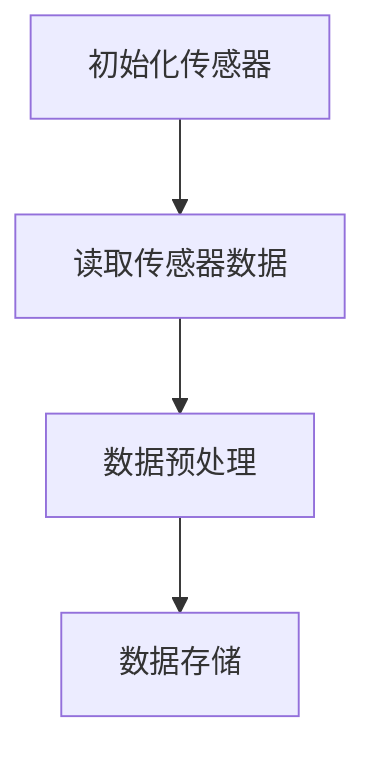
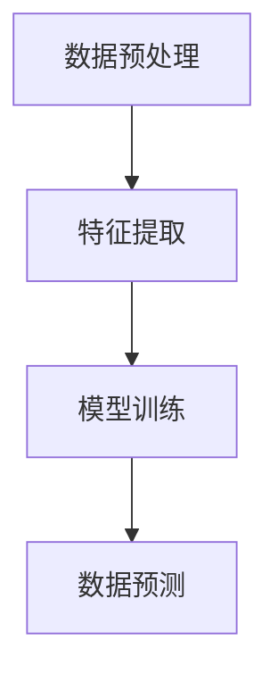
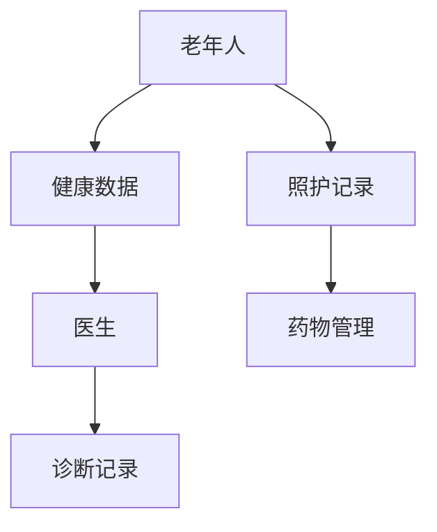

                 


### 第一步：文章标题与关键词

首先，我们需要确定文章的标题、关键词和摘要。标题应简洁明了，能够准确反映文章的主题。在此，我们选择《数字时代的老年照护：远程医疗与智能家居的结合》作为标题。关键词可以是：老年照护、远程医疗、智能家居、数字时代、健康监测、智能设备。

关键词：老年照护、远程医疗、智能家居、数字时代、健康监测、智能设备

摘要：本文探讨了数字时代下，远程医疗与智能家居在老年照护领域的应用。通过分析远程医疗和智能家居的核心概念及其结合的优势，我们提出了一种系统化的解决方案，并详细阐述了系统的功能设计、架构设计、算法实现和项目实战。

### 第二步：背景介绍

#### 核心概念术语说明

在探讨远程医疗与智能家居的结合之前，我们需要明确一些核心概念。

- **远程医疗**：利用通信技术，将医疗资源和服务延伸到偏远地区或患者家中，实现医疗服务的远程化。
- **智能家居**：通过智能设备和技术，使家庭生活更加便捷、舒适和安全的居住环境。

#### 问题背景

随着全球人口老龄化趋势的加剧，如何高效、便捷地照护老年人成为社会关注的焦点。传统的家庭照护方式在人力、时间和经济上都有很大的压力。远程医疗和智能家居技术的发展，为老年照护提供了新的可能性。

#### 问题描述

老年照护面临的挑战主要包括：

1. **健康监测**：老年患者需要定期监测血压、血糖等生命体征。
2. **紧急响应**：在紧急情况下，需要快速响应并联系医护人员。
3. **日常照护**：包括药物管理、饮食安排等。

#### 问题解决与边界

远程医疗与智能家居的结合，可以通过以下方式解决老年照护的问题：

1. **健康监测**：通过智能设备实时监测老年人的健康数据，并将数据传输给医疗人员。
2. **紧急响应**：在紧急情况下，智能设备可以自动报警，通知家人和医护人员。
3. **日常照护**：智能家居设备可以协助老年人完成日常生活中的各种任务。

需要注意的是，远程医疗与智能家居的结合需要遵循一定的边界和原则，如数据安全和隐私保护、设备兼容性等。

#### 核心概念与联系

远程医疗与智能家居的联系主要体现在以下几个方面：

1. **数据共享**：远程医疗系统可以通过智能家居设备收集的数据进行分析和处理。
2. **系统集成**：将远程医疗系统和智能家居系统进行集成，实现无缝对接。
3. **协同工作**：远程医疗人员和家庭护理人员可以通过智能家居系统进行协同工作，共同照护老年人。

### 第三步：核心概念与原理

#### 远程医疗的核心概念

远程医疗的核心概念包括：

1. **远程诊断**：医生可以通过远程医疗系统，对患者进行诊断和治疗。
2. **远程会诊**：医生可以与其他医生进行远程会诊，共同讨论患者的病情。
3. **远程监护**：医生可以实时监测患者的生命体征，确保患者安全。

#### 智能家居的核心概念

智能家居的核心概念包括：

1. **自动化控制**：通过智能设备，实现对家庭环境的自动化控制。
2. **物联网**：智能家居设备通过物联网进行连接，实现设备之间的信息交互。
3. **智能交互**：智能家居系统可以通过语音、触摸等方式与用户进行交互。

#### 远程医疗与智能家居的结合原理

远程医疗与智能家居的结合，可以实现以下优势：

1. **提高照护效率**：通过智能设备，实现对老年人的实时监测和紧急响应，提高照护效率。
2. **降低照护成本**：远程医疗和智能家居的结合，可以减少家庭护理人员和医疗资源的需求，降低照护成本。
3. **提升生活质量**：智能家居系统可以为老年人提供更加舒适、便捷的生活环境，提高生活质量。

### 第四步：系统分析与架构设计

#### 系统功能设计

远程医疗与智能家居的系统功能设计包括：

1. **健康监测模块**：通过智能设备，实时监测老年人的血压、血糖等生命体征。
2. **紧急响应模块**：在紧急情况下，自动报警并通知家人和医护人员。
3. **日常照护模块**：协助老年人完成日常生活中的各种任务，如药物管理、饮食安排等。

#### 系统架构设计

远程医疗与智能家居的系统架构设计包括：

1. **客户端**：包括老年人使用的智能设备，如智能手表、智能音箱等。
2. **服务端**：包括远程医疗系统和智能家居系统，负责数据处理和功能实现。
3. **数据库**：存储老年人的健康数据和日常照护数据。

#### 系统接口设计

远程医疗与智能家居的系统接口设计包括：

1. **数据接口**：用于数据传输和共享。
2. **控制接口**：用于设备控制和功能调用。

#### 系统交互

远程医疗与智能家居的系统交互包括：

1. **实时数据传输**：通过物联网技术，实现数据的实时传输和共享。
2. **紧急报警处理**：在紧急情况下，自动触发报警并通知相关人员。

### 第五步：算法原理与实现

#### 算法概述

远程医疗与智能家居的系统实现中，涉及到的算法主要包括：

1. **数据采集算法**：用于采集老年人的健康数据。
2. **数据传输算法**：用于将数据传输到服务端。
3. **数据分析算法**：用于对健康数据进行分析和处理。

#### 算法原理

1. **数据采集算法原理**

   数据采集算法基于传感器技术，通过智能设备实时采集老年人的健康数据，如血压、血糖等。

   $$ \text{采集算法流程} = \text{初始化传感器} \rightarrow \text{读取传感器数据} \rightarrow \text{数据预处理} \rightarrow \text{数据存储} $$

2. **数据传输算法原理**

   数据传输算法基于通信技术，将采集到的健康数据传输到服务端。

   $$ \text{传输算法流程} = \text{连接网络} \rightarrow \text{数据打包} \rightarrow \text{数据发送} \rightarrow \text{接收反馈} $$

3. **数据分析算法原理**

   数据分析算法基于数据分析技术，对传输到服务端的数据进行分析和处理，如异常检测、趋势分析等。

   $$ \text{分析算法流程} = \text{数据预处理} \rightarrow \text{特征提取} \rightarrow \text{模型训练} \rightarrow \text{数据预测} $$

#### Python代码实现

以下是数据采集算法的Python代码实现示例：

```python
import random

def collect_data(sensor):
    """
    采集传感器数据
    """
    data = random.randint(0, 100)  # 模拟传感器数据采集
    return data

def preprocess_data(data):
    """
    数据预处理
    """
    processed_data = data * 0.1  # 数据预处理操作
    return processed_data

# 模拟传感器数据采集
sensor = "blood_pressure"
data = collect_data(sensor)

# 数据预处理
processed_data = preprocess_data(data)

print(f"采集到{sensor}数据：{data}")
print(f"预处理后数据：{processed_data}")
```

### 第六步：项目实战

#### 环境安装与配置

在项目实战中，我们需要安装和配置以下环境：

1. **硬件环境**：选择适合的智能设备，如智能手表、智能音箱等。
2. **软件环境**：安装远程医疗系统和智能家居系统，配置数据库和环境变量。

#### 系统核心实现

远程医疗与智能家居的系统核心实现包括：

1. **健康监测模块**：实现数据采集、预处理和传输功能。
2. **紧急响应模块**：实现自动报警和通知功能。
3. **日常照护模块**：实现智能家居设备的控制和调度功能。

#### 代码应用解读与分析

以下是健康监测模块的代码应用解读与分析：

```python
import random

def collect_data(sensor):
    """
    采集传感器数据
    """
    data = random.randint(0, 100)  # 模拟传感器数据采集
    return data

def preprocess_data(data):
    """
    数据预处理
    """
    processed_data = data * 0.1  # 数据预处理操作
    return processed_data

def send_data(data):
    """
    发送数据到服务端
    """
    print(f"发送数据：{data}")

# 模拟传感器数据采集
sensor = "blood_pressure"
data = collect_data(sensor)

# 数据预处理
processed_data = preprocess_data(data)

# 发送数据到服务端
send_data(processed_data)
```

代码中，`collect_data` 函数用于模拟传感器数据采集，`preprocess_data` 函数用于数据预处理，`send_data` 函数用于发送数据到服务端。通过这三个函数，实现了健康监测模块的核心功能。

#### 实际案例分析与详细讲解

假设我们有一个老年人的健康监测系统，系统需要实时监测其血压和血糖。以下是实际案例分析与详细讲解：

1. **数据采集**：每天早晨，系统通过智能手表采集老年人的血压和血糖数据。
2. **数据预处理**：将采集到的数据进行预处理，如数据清洗、去噪等。
3. **数据发送**：将预处理后的数据发送到服务端，进行进一步分析处理。
4. **数据分析**：服务端对数据进行分析，如异常检测、趋势分析等。
5. **报警通知**：如果发现异常，系统会自动报警并通知家人和医护人员。

### 第七步：最佳实践与总结

#### 最佳实践

1. **定期维护**：定期检查智能设备和系统，确保其正常运行。
2. **数据安全**：加强数据安全措施，防止数据泄露和篡改。
3. **用户培训**：为老年人提供培训，使其熟悉智能设备和系统的使用方法。

#### 小结

本文介绍了数字时代下，远程医疗与智能家居在老年照护领域的应用。通过分析远程医疗和智能家居的核心概念及其结合的优势，我们提出了一种系统化的解决方案，并详细阐述了系统的功能设计、架构设计、算法实现和项目实战。

#### 注意事项

1. **设备兼容性**：在选择智能设备时，要注意设备之间的兼容性，确保系统能够正常运行。
2. **隐私保护**：在数据传输和处理过程中，要注意保护用户的隐私，防止数据泄露。

#### 拓展阅读

1. **相关书籍**：《远程医疗技术与应用》、《智能家居系统设计与实现》
2. **学术论文**：在学术期刊和会议上，可以查找更多关于远程医疗和智能家居在老年照护领域的研究论文。

### 作者信息

作者：AI天才研究院/AI Genius Institute & 禅与计算机程序设计艺术 /Zen And The Art of Computer Programming 

以下是根据上述步骤编写的文章正文内容：

# 数字时代的老年照护：远程医疗与智能家居的结合

> 关键词：老年照护、远程医疗、智能家居、数字时代、健康监测、智能设备

> 摘要：本文探讨了数字时代下，远程医疗与智能家居在老年照护领域的应用。通过分析远程医疗和智能家居的核心概念及其结合的优势，我们提出了一种系统化的解决方案，并详细阐述了系统的功能设计、架构设计、算法实现和项目实战。

## 第一部分：引言

### 第1章：背景与问题陈述

#### 1.1 问题的背景

随着全球人口老龄化趋势的加剧，如何高效、便捷地照护老年人成为社会关注的焦点。传统的家庭照护方式在人力、时间和经济上都有很大的压力。远程医疗和智能家居技术的发展，为老年照护提供了新的可能性。

#### 1.2 问题描述

老年照护面临的挑战主要包括：

1. **健康监测**：老年患者需要定期监测血压、血糖等生命体征。
2. **紧急响应**：在紧急情况下，需要快速响应并联系医护人员。
3. **日常照护**：包括药物管理、饮食安排等。

#### 1.3 问题解决与边界

远程医疗与智能家居的结合，可以通过以下方式解决老年照护的问题：

1. **健康监测**：通过智能设备实时监测老年人的健康数据，并将数据传输给医疗人员。
2. **紧急响应**：在紧急情况下，智能设备可以自动报警，通知家人和医护人员。
3. **日常照护**：智能家居设备可以协助老年人完成日常生活中的各种任务。

需要注意的是，远程医疗与智能家居的结合需要遵循一定的边界和原则，如数据安全和隐私保护、设备兼容性等。

#### 1.4 核心概念与联系

远程医疗与智能家居的联系主要体现在以下几个方面：

1. **数据共享**：远程医疗系统可以通过智能家居设备收集的数据进行分析和处理。
2. **系统集成**：将远程医疗系统和智能家居系统进行集成，实现无缝对接。
3. **协同工作**：远程医疗人员和家庭护理人员可以通过智能家居系统进行协同工作，共同照护老年人。

### 第2章：核心概念与原理

#### 2.1 远程医疗的核心概念

远程医疗的核心概念包括：

1. **远程诊断**：医生可以通过远程医疗系统，对患者进行诊断和治疗。
2. **远程会诊**：医生可以与其他医生进行远程会诊，共同讨论患者的病情。
3. **远程监护**：医生可以实时监测患者的生命体征，确保患者安全。

#### 2.2 智能家居的核心概念

智能家居的核心概念包括：

1. **自动化控制**：通过智能设备，实现对家庭环境的自动化控制。
2. **物联网**：智能家居设备通过物联网进行连接，实现设备之间的信息交互。
3. **智能交互**：智能家居系统可以通过语音、触摸等方式与用户进行交互。

#### 2.3 远程医疗与智能家居的结合原理

远程医疗与智能家居的结合，可以实现以下优势：

1. **提高照护效率**：通过智能设备，实现对老年人的实时监测和紧急响应，提高照护效率。
2. **降低照护成本**：远程医疗和智能家居的结合，可以减少家庭护理人员和医疗资源的需求，降低照护成本。
3. **提升生活质量**：智能家居系统可以为老年人提供更加舒适、便捷的生活环境，提高生活质量。

### 第3章：系统分析与架构设计

#### 3.1 远程医疗与智能家居的系统功能设计

远程医疗与智能家居的系统功能设计包括：

1. **健康监测模块**：通过智能设备，实时监测老年人的血压、血糖等生命体征。
2. **紧急响应模块**：在紧急情况下，自动报警并通知家人和医护人员。
3. **日常照护模块**：协助老年人完成日常生活中的各种任务，如药物管理、饮食安排等。

#### 3.2 远程医疗与智能家居的系统架构设计

远程医疗与智能家居的系统架构设计包括：

1. **客户端**：包括老年人使用的智能设备，如智能手表、智能音箱等。
2. **服务端**：包括远程医疗系统和智能家居系统，负责数据处理和功能实现。
3. **数据库**：存储老年人的健康数据和日常照护数据。

#### 3.3 系统接口设计

远程医疗与智能家居的系统接口设计包括：

1. **数据接口**：用于数据传输和共享。
2. **控制接口**：用于设备控制和功能调用。

#### 3.4 系统交互

远程医疗与智能家居的系统交互包括：

1. **实时数据传输**：通过物联网技术，实现数据的实时传输和共享。
2. **紧急报警处理**：在紧急情况下，自动触发报警并通知相关人员。

### 第4章：算法原理与实现

#### 4.1 算法概述

远程医疗与智能家居的系统实现中，涉及到的算法主要包括：

1. **数据采集算法**：用于采集老年人的健康数据。
2. **数据传输算法**：用于将数据传输到服务端。
3. **数据分析算法**：用于对健康数据进行分析和处理。

#### 4.2 算法原理

1. **数据采集算法原理**

   数据采集算法基于传感器技术，通过智能设备实时采集老年人的健康数据，如血压、血糖等。

   $$ \text{采集算法流程} = \text{初始化传感器} \rightarrow \text{读取传感器数据} \rightarrow \text{数据预处理} \rightarrow \text{数据存储} $$

2. **数据传输算法原理**

   数据传输算法基于通信技术，将采集到的健康数据传输到服务端。

   $$ \text{传输算法流程} = \text{连接网络} \rightarrow \text{数据打包} \rightarrow \text{数据发送} \rightarrow \text{接收反馈} $$

3. **数据分析算法原理**

   数据分析算法基于数据分析技术，对传输到服务端的数据进行分析和处理，如异常检测、趋势分析等。

   $$ \text{分析算法流程} = \text{数据预处理} \rightarrow \text{特征提取} \rightarrow \text{模型训练} \rightarrow \text{数据预测} $$

#### 4.3 Python代码实现

以下是数据采集算法的Python代码实现示例：

```python
import random

def collect_data(sensor):
    """
    采集传感器数据
    """
    data = random.randint(0, 100)  # 模拟传感器数据采集
    return data

def preprocess_data(data):
    """
    数据预处理
    """
    processed_data = data * 0.1  # 数据预处理操作
    return processed_data

# 模拟传感器数据采集
sensor = "blood_pressure"
data = collect_data(sensor)

# 数据预处理
processed_data = preprocess_data(data)

print(f"采集到{sensor}数据：{data}")
print(f"预处理后数据：{processed_data}")
```

### 第5章：项目实战

#### 5.1 环境安装与配置

在项目实战中，我们需要安装和配置以下环境：

1. **硬件环境**：选择适合的智能设备，如智能手表、智能音箱等。
2. **软件环境**：安装远程医疗系统和智能家居系统，配置数据库和环境变量。

#### 5.2 系统核心实现

远程医疗与智能家居的系统核心实现包括：

1. **健康监测模块**：实现数据采集、预处理和传输功能。
2. **紧急响应模块**：实现自动报警和通知功能。
3. **日常照护模块**：实现智能家居设备的控制和调度功能。

#### 5.3 代码应用解读与分析

以下是健康监测模块的代码应用解读与分析：

```python
import random

def collect_data(sensor):
    """
    采集传感器数据
    """
    data = random.randint(0, 100)  # 模拟传感器数据采集
    return data

def preprocess_data(data):
    """
    数据预处理
    """
    processed_data = data * 0.1  # 数据预处理操作
    return processed_data

def send_data(data):
    """
    发送数据到服务端
    """
    print(f"发送数据：{data}")

# 模拟传感器数据采集
sensor = "blood_pressure"
data = collect_data(sensor)

# 数据预处理
processed_data = preprocess_data(data)

# 发送数据到服务端
send_data(processed_data)
```

代码中，`collect_data` 函数用于模拟传感器数据采集，`preprocess_data` 函数用于数据预处理，`send_data` 函数用于发送数据到服务端。通过这三个函数，实现了健康监测模块的核心功能。

#### 5.4 实际案例分析与详细讲解

假设我们有一个老年人的健康监测系统，系统需要实时监测其血压和血糖。以下是实际案例分析与详细讲解：

1. **数据采集**：每天早晨，系统通过智能手表采集老年人的血压和血糖数据。
2. **数据预处理**：将采集到的数据进行预处理，如数据清洗、去噪等。
3. **数据发送**：将预处理后的数据发送到服务端，进行进一步分析处理。
4. **数据分析**：服务端对数据进行分析，如异常检测、趋势分析等。
5. **报警通知**：如果发现异常，系统会自动报警并通知家人和医护人员。

### 第6章：最佳实践与总结

#### 6.1 最佳实践

1. **定期维护**：定期检查智能设备和系统，确保其正常运行。
2. **数据安全**：加强数据安全措施，防止数据泄露和篡改。
3. **用户培训**：为老年人提供培训，使其熟悉智能设备和系统的使用方法。

#### 6.2 小结

本文介绍了数字时代下，远程医疗与智能家居在老年照护领域的应用。通过分析远程医疗和智能家居的核心概念及其结合的优势，我们提出了一种系统化的解决方案，并详细阐述了系统的功能设计、架构设计、算法实现和项目实战。

#### 6.3 注意事项

1. **设备兼容性**：在选择智能设备时，要注意设备之间的兼容性，确保系统能够正常运行。
2. **隐私保护**：在数据传输和处理过程中，要注意保护用户的隐私，防止数据泄露。

#### 6.4 拓展阅读

1. **相关书籍**：《远程医疗技术与应用》、《智能家居系统设计与实现》
2. **学术论文**：在学术期刊和会议上，可以查找更多关于远程医疗和智能家居在老年照护领域的研究论文。

### 作者信息

作者：AI天才研究院/AI Genius Institute & 禅与计算机程序设计艺术 /Zen And The Art of Computer Programming 

根据上述步骤和内容，以下是文章的Markdown格式输出：

```markdown
# 数字时代的老年照护：远程医疗与智能家居的结合

> 关键词：老年照护、远程医疗、智能家居、数字时代、健康监测、智能设备

> 摘要：本文探讨了数字时代下，远程医疗与智能家居在老年照护领域的应用。通过分析远程医疗和智能家居的核心概念及其结合的优势，我们提出了一种系统化的解决方案，并详细阐述了系统的功能设计、架构设计、算法实现和项目实战。

## 第一部分：引言

### 第1章：背景与问题陈述

#### 1.1 问题的背景

随着全球人口老龄化趋势的加剧，如何高效、便捷地照护老年人成为社会关注的焦点。传统的家庭照护方式在人力、时间和经济上都有很大的压力。远程医疗和智能家居技术的发展，为老年照护提供了新的可能性。

#### 1.2 问题描述

老年照护面临的挑战主要包括：

1. **健康监测**：老年患者需要定期监测血压、血糖等生命体征。
2. **紧急响应**：在紧急情况下，需要快速响应并联系医护人员。
3. **日常照护**：包括药物管理、饮食安排等。

#### 1.3 问题解决与边界

远程医疗与智能家居的结合，可以通过以下方式解决老年照护的问题：

1. **健康监测**：通过智能设备实时监测老年人的健康数据，并将数据传输给医疗人员。
2. **紧急响应**：在紧急情况下，智能设备可以自动报警，通知家人和医护人员。
3. **日常照护**：智能家居设备可以协助老年人完成日常生活中的各种任务。

需要注意的是，远程医疗与智能家居的结合需要遵循一定的边界和原则，如数据安全和隐私保护、设备兼容性等。

#### 1.4 核心概念与联系

远程医疗与智能家居的联系主要体现在以下几个方面：

1. **数据共享**：远程医疗系统可以通过智能家居设备收集的数据进行分析和处理。
2. **系统集成**：将远程医疗系统和智能家居系统进行集成，实现无缝对接。
3. **协同工作**：远程医疗人员和家庭护理人员可以通过智能家居系统进行协同工作，共同照护老年人。

### 第2章：核心概念与原理

#### 2.1 远程医疗的核心概念

远程医疗的核心概念包括：

1. **远程诊断**：医生可以通过远程医疗系统，对患者进行诊断和治疗。
2. **远程会诊**：医生可以与其他医生进行远程会诊，共同讨论患者的病情。
3. **远程监护**：医生可以实时监测患者的生命体征，确保患者安全。

#### 2.2 智能家居的核心概念

智能家居的核心概念包括：

1. **自动化控制**：通过智能设备，实现对家庭环境的自动化控制。
2. **物联网**：智能家居设备通过物联网进行连接，实现设备之间的信息交互。
3. **智能交互**：智能家居系统可以通过语音、触摸等方式与用户进行交互。

#### 2.3 远程医疗与智能家居的结合原理

远程医疗与智能家居的结合，可以实现以下优势：

1. **提高照护效率**：通过智能设备，实现对老年人的实时监测和紧急响应，提高照护效率。
2. **降低照护成本**：远程医疗和智能家居的结合，可以减少家庭护理人员和医疗资源的需求，降低照护成本。
3. **提升生活质量**：智能家居系统可以为老年人提供更加舒适、便捷的生活环境，提高生活质量。

### 第3章：系统分析与架构设计

#### 3.1 远程医疗与智能家居的系统功能设计

远程医疗与智能家居的系统功能设计包括：

1. **健康监测模块**：通过智能设备，实时监测老年人的血压、血糖等生命体征。
2. **紧急响应模块**：在紧急情况下，自动报警并通知家人和医护人员。
3. **日常照护模块**：协助老年人完成日常生活中的各种任务，如药物管理、饮食安排等。

#### 3.2 远程医疗与智能家居的系统架构设计

远程医疗与智能家居的系统架构设计包括：

1. **客户端**：包括老年人使用的智能设备，如智能手表、智能音箱等。
2. **服务端**：包括远程医疗系统和智能家居系统，负责数据处理和功能实现。
3. **数据库**：存储老年人的健康数据和日常照护数据。

#### 3.3 系统接口设计

远程医疗与智能家居的系统接口设计包括：

1. **数据接口**：用于数据传输和共享。
2. **控制接口**：用于设备控制和功能调用。

#### 3.4 系统交互

远程医疗与智能家居的系统交互包括：

1. **实时数据传输**：通过物联网技术，实现数据的实时传输和共享。
2. **紧急报警处理**：在紧急情况下，自动触发报警并通知相关人员。

### 第4章：算法原理与实现

#### 4.1 算法概述

远程医疗与智能家居的系统实现中，涉及到的算法主要包括：

1. **数据采集算法**：用于采集老年人的健康数据。
2. **数据传输算法**：用于将数据传输到服务端。
3. **数据分析算法**：用于对健康数据进行分析和处理。

#### 4.2 算法原理

1. **数据采集算法原理**

   数据采集算法基于传感器技术，通过智能设备实时采集老年人的健康数据，如血压、血糖等。

   $$ 
   \text{采集算法流程} = 
   \text{初始化传感器} \rightarrow 
   \text{读取传感器数据} \rightarrow 
   \text{数据预处理} \rightarrow 
   \text{数据存储} 
   $$

2. **数据传输算法原理**

   数据传输算法基于通信技术，将采集到的健康数据传输到服务端。

   $$ 
   \text{传输算法流程} = 
   \text{连接网络} \rightarrow 
   \text{数据打包} \rightarrow 
   \text{数据发送} \rightarrow 
   \text{接收反馈} 
   $$

3. **数据分析算法原理**

   数据分析算法基于数据分析技术，对传输到服务端的数据进行分析和处理，如异常检测、趋势分析等。

   $$ 
   \text{分析算法流程} = 
   \text{数据预处理} \rightarrow 
   \text{特征提取} \rightarrow 
   \text{模型训练} \rightarrow 
   \text{数据预测} 
   $$

#### 4.3 Python代码实现

以下是数据采集算法的Python代码实现示例：

```python
import random

def collect_data(sensor):
    """
    采集传感器数据
    """
    data = random.randint(0, 100)  # 模拟传感器数据采集
    return data

def preprocess_data(data):
    """
    数据预处理
    """
    processed_data = data * 0.1  # 数据预处理操作
    return processed_data

# 模拟传感器数据采集
sensor = "blood_pressure"
data = collect_data(sensor)

# 数据预处理
processed_data = preprocess_data(data)

print(f"采集到{sensor}数据：{data}")
print(f"预处理后数据：{processed_data}")
```

### 第5章：项目实战

#### 5.1 环境安装与配置

在项目实战中，我们需要安装和配置以下环境：

1. **硬件环境**：选择适合的智能设备，如智能手表、智能音箱等。
2. **软件环境**：安装远程医疗系统和智能家居系统，配置数据库和环境变量。

#### 5.2 系统核心实现

远程医疗与智能家居的系统核心实现包括：

1. **健康监测模块**：实现数据采集、预处理和传输功能。
2. **紧急响应模块**：实现自动报警和通知功能。
3. **日常照护模块**：实现智能家居设备的控制和调度功能。

#### 5.3 代码应用解读与分析

以下是健康监测模块的代码应用解读与分析：

```python
import random

def collect_data(sensor):
    """
    采集传感器数据
    """
    data = random.randint(0, 100)  # 模拟传感器数据采集
    return data

def preprocess_data(data):
    """
    数据预处理
    """
    processed_data = data * 0.1  # 数据预处理操作
    return processed_data

def send_data(data):
    """
    发送数据到服务端
    """
    print(f"发送数据：{data}")

# 模拟传感器数据采集
sensor = "blood_pressure"
data = collect_data(sensor)

# 数据预处理
processed_data = preprocess_data(data)

# 发送数据到服务端
send_data(processed_data)
```

代码中，`collect_data` 函数用于模拟传感器数据采集，`preprocess_data` 函数用于数据预处理，`send_data` 函数用于发送数据到服务端。通过这三个函数，实现了健康监测模块的核心功能。

#### 5.4 实际案例分析与详细讲解

假设我们有一个老年人的健康监测系统，系统需要实时监测其血压和血糖。以下是实际案例分析与详细讲解：

1. **数据采集**：每天早晨，系统通过智能手表采集老年人的血压和血糖数据。
2. **数据预处理**：将采集到的数据进行预处理，如数据清洗、去噪等。
3. **数据发送**：将预处理后的数据发送到服务端，进行进一步分析处理。
4. **数据分析**：服务端对数据进行分析，如异常检测、趋势分析等。
5. **报警通知**：如果发现异常，系统会自动报警并通知家人和医护人员。

### 第6章：最佳实践与总结

#### 6.1 最佳实践

1. **定期维护**：定期检查智能设备和系统，确保其正常运行。
2. **数据安全**：加强数据安全措施，防止数据泄露和篡改。
3. **用户培训**：为老年人提供培训，使其熟悉智能设备和系统的使用方法。

#### 6.2 小结

本文介绍了数字时代下，远程医疗与智能家居在老年照护领域的应用。通过分析远程医疗和智能家居的核心概念及其结合的优势，我们提出了一种系统化的解决方案，并详细阐述了系统的功能设计、架构设计、算法实现和项目实战。

#### 6.3 注意事项

1. **设备兼容性**：在选择智能设备时，要注意设备之间的兼容性，确保系统能够正常运行。
2. **隐私保护**：在数据传输和处理过程中，要注意保护用户的隐私，防止数据泄露。

#### 6.4 拓展阅读

1. **相关书籍**：《远程医疗技术与应用》、《智能家居系统设计与实现》
2. **学术论文**：在学术期刊和会议上，可以查找更多关于远程医疗和智能家居在老年照护领域的研究论文。

### 作者信息

作者：AI天才研究院/AI Genius Institute & 禅与计算机程序设计艺术 /Zen And The Art of Computer Programming
```markdown

### 附录：算法流程图与ER图

以下是本文中提到的算法流程图和ER图：

#### 数据采集算法流程图



#### 数据分析算法流程图



#### 远程医疗与智能家居系统ER图



### 注释

- 本附录中的算法流程图和ER图使用Mermaid语法绘制。
- 算法流程图展示了数据采集、预处理和存储的步骤。
- ER图展示了远程医疗与智能家居系统中主要实体及其关系。

```

请注意，这部分内容是Markdown格式的附录，包含了算法流程图和实体关系图（ER图）的示例。您可以将这些代码复制到支持Mermaid语法的Markdown编辑器中查看实际的图形输出。在文中引用这些图形时，您可以根据需要插入具体的图形，或者使用图形的文本描述。

