                 

### 引言：数字极简主义的兴起

#### 1.1 问题背景

在当今数字化时代，我们的生活已经与互联网紧密相连。无论是工作、学习、娱乐，还是社交和购物，我们几乎无时无刻不在与数字世界打交道。然而，随着数字技术的飞速发展，我们也面临着一系列问题。这些问题的根源在于我们过度依赖数字设备和生活，从而引发了一系列负面效应。

首先，数字过载成为了一个普遍现象。我们每天都会接收到大量的电子邮件、社交媒体通知、短信和各种在线广告。这些信息不仅占据了我们的时间，还常常分散我们的注意力，影响我们的工作效率和生活质量。其次，时间管理困境也随之而来。由于数字设备的便利性，我们往往在不知不觉中花费了大量的时间在网络上，导致实际工作和生活时间被严重压缩。此外，数字生活还带来了健康问题。长时间使用电脑和手机不仅对视力有害，还可能导致颈椎、腰椎等身体部位的疾病。最后，社交和隐私的挑战也日益突出。在数字世界中，我们的隐私更容易被侵犯，社交媒体上的信息泄露事件频发，个人数据的安全问题备受关注。

#### 1.2 数字极简主义的概念

面对这些问题，数字极简主义（Digital Minimalism）应运而生。数字极简主义并不是完全放弃数字设备，而是通过减少不必要的数字干扰，回归生活的本质，提升生活质量和幸福感。它强调的是一种“少即是多”的生活方式，即通过减少数字干扰，让我们能够更好地专注于重要的事物，从而实现更加高效和有意义的生活。

数字极简主义的核心原则包括：

1. **专注与减少干扰**：通过减少不必要的通知和应用程序，让我们能够更加专注地完成工作和生活任务。
2. **数字习惯的建立**：培养健康的数字使用习惯，比如定期进行数字排毒，避免长时间连续使用数字设备。
3. **时间管理策略**：通过合理规划时间，确保我们能够在工作和休息之间取得平衡，充分利用每一分钟。
4. **数字排毒与断舍离**：定期清理数字设备和社交媒体账户，删除不必要的应用和内容，从而减少数字负担。

#### 1.3 本书的目的和结构

本书旨在为读者提供一套系统的数字极简主义指南，帮助大家优化在线生活质量。本书将分为八个章节，具体内容如下：

- **第1章 引言：数字极简主义的兴起**：介绍数字极简主义的背景和核心概念。
- **第2章 数字生活的挑战**：分析当前数字生活面临的种种问题。
- **第3章 数字极简主义的核心原则**：阐述数字极简主义的核心原则和实践方法。
- **第4章 优化在线工作效率**：提供一系列提高工作效率的实用技巧。
- **第5章 数字健康与心理健康**：探讨数字健康和心理健康的维护方法。
- **第6章 数字极简主义生活方式**：分享如何在日常生活中实践数字极简主义。
- **第7章 实践与反思**：提供实践指南和反思方法，帮助读者长期维持数字极简主义。
- **第8章 未来展望**：展望数字极简主义的发展趋势和未来影响。

通过本书的阅读和实践，读者将能够深入了解数字极简主义，掌握一系列实用的数字生活优化技巧，从而实现更加高效、健康和有意义的生活。

### 数字生活的挑战

随着数字技术的迅猛发展，我们的生活已经离不开互联网和数字设备。然而，这种高度数字化的生活方式也带来了一系列挑战，不仅影响了我们的工作效率，还对心理健康和生活质量产生了负面影响。

#### 2.1 数字过载

数字过载是当前数字生活中最普遍的问题之一。它指的是我们在日常生活中接收到的信息量过大，超出了我们的处理能力。具体表现为：

- **电子邮件和短信轰炸**：每天收到大量的工作邮件和个人短信，使得我们无法有效地处理信息。
- **社交媒体通知**：各种社交媒体平台不断推送通知，分散我们的注意力，影响工作集中度。
- **在线广告**：无处不在的网络广告不仅占用屏幕空间，还可能误导我们的消费决策。

数字过载不仅影响了我们的工作效率，还常常导致心理压力增加。当我们面对大量的信息时，往往会产生焦虑和不安，导致工作效率下降，甚至产生工作拖延。

#### 2.2 时间管理困境

数字技术的便利性虽然提升了我们的工作效率，但也带来了时间管理上的困境。主要表现在以下几个方面：

- **时间碎片化**：由于可以随时随地访问互联网，我们往往会在一些琐碎的任务上耗费大量时间，比如浏览社交媒体、玩游戏等。
- **多任务处理**：我们习惯于同时处理多个任务，比如边开会边浏览邮件、边看电视边做家务。然而，这种多任务处理方式实际上会降低我们的工作效率，因为大脑需要在不同任务之间频繁切换，导致效率降低。
- **时间分配不均**：由于数字设备的便利性，我们往往会过度依赖数字设备，导致实际工作和生活时间被压缩，娱乐和休闲时间减少。

时间管理困境不仅影响我们的工作效率，还可能导致心理健康问题，如焦虑、抑郁等。

#### 2.3 数字健康问题

长时间使用数字设备对身体健康产生了诸多负面影响。具体包括：

- **视力问题**：长时间盯着电脑屏幕或手机屏幕，容易导致眼睛疲劳，出现视力下降、干涩、疼痛等问题。
- **颈椎和腰椎问题**：长时间保持同一姿势使用数字设备，容易导致颈椎和腰椎的负担加重，引发颈椎病、腰椎间盘突出等疾病。
- **肥胖问题**：由于长时间久坐，缺乏运动，容易导致肥胖，增加患心血管疾病、糖尿病等疾病的风险。

数字健康问题不仅影响我们的身体健康，还可能影响我们的生活质量和工作效率。

#### 2.4 社交和隐私的挑战

数字生活带来的社交和隐私问题也不容忽视。具体包括：

- **社交疏离**：虽然我们每天都会在社交媒体上与朋友互动，但这种互动往往是表面的、碎片化的，缺乏深度的情感交流，导致社交疏离感增加。
- **隐私泄露**：随着社交媒体和电子商务的普及，我们的个人信息越来越容易泄露。例如，个人信息可能在未经授权的情况下被第三方获取和使用，导致各种隐私侵犯问题，如身份盗用、财产损失等。
- **网络安全威胁**：数字设备面临的网络安全威胁也日益增加。例如，恶意软件、网络钓鱼攻击等可能窃取我们的敏感信息，甚至破坏我们的设备。

社交和隐私问题不仅影响我们的生活质量，还可能对我们的人身和财产安全造成威胁。

综上所述，数字生活的挑战是多方面的，它们不仅影响我们的工作效率和身体健康，还可能影响我们的心理健康和社交关系。因此，有必要采取有效的措施来应对这些挑战，实现数字生活的优化。这就是数字极简主义所要解决的问题，也是本书的核心主题。

#### 数字极简主义的核心原则

数字极简主义并不是简单地放弃数字设备，而是通过减少不必要的数字干扰，优化我们的生活方式，提升生活质量。以下是数字极简主义的核心原则，以及如何在实际生活中应用这些原则。

#### 3.1 专注与减少干扰

**核心概念**：专注是指将注意力集中在某一任务上，减少干扰有助于保持专注。

**原理**：当我们专注于一项任务时，大脑可以更有效地处理信息，提高工作效率。减少干扰则可以帮助我们避免分心，保持工作或学习的连贯性。

**应用**：

1. **关闭通知**：在工作和学习时，关闭不必要的手机和应用通知，减少外界干扰。
2. **使用专注工具**：利用专注软件，如Forest、Pomodoro Technique，帮助我们集中注意力，提高工作效率。
3. **设定时间限制**：为每个任务设定时间限制，确保在规定时间内专注于任务，减少拖延。

**对比表格**：

| 原有习惯               | 数字极简习惯                    | 效果对比                   |
|------------------------|----------------------------------|---------------------------|
| 没有专注的习惯         | 关闭通知，专注工作或学习         | 提高工作效率，减少分心     |
| 长时间连续使用设备     | 使用专注工具，合理安排时间       | 减少拖延，提升专注度       |
| 常被打扰               | 设定时间限制，减少外部干扰       | 提高工作效率，减少焦虑感   |

**ER实体关系图**：

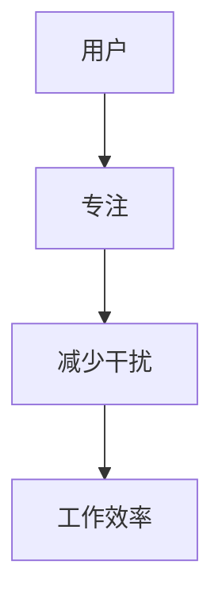

#### 3.2 数字习惯的建立

**核心概念**：数字习惯是指我们在使用数字设备时形成的一系列行为模式。

**原理**：良好的数字习惯可以帮助我们更好地管理时间和注意力，从而提高生活质量。

**应用**：

1. **定期数字排毒**：每周或每月选择一天进行数字排毒，减少数字设备的使用。
2. **使用电子日程表**：使用电子日程表规划时间和任务，避免遗漏重要事项。
3. **设定数字限制**：为自己设定每天使用数字设备的最大时间，防止过度依赖。

**对比表格**：

| 原有习惯               | 数字极简习惯                    | 效果对比                   |
|------------------------|----------------------------------|---------------------------|
| 没有固定的数字使用习惯 | 定期数字排毒，设定电子日程表     | 提高时间管理能力，减少压力 |
| 使用社交媒体过度       | 设定数字限制，减少社交媒体时间   | 减少信息过载，提高生活质量 |
| 随意切换应用           | 有序使用应用，专注于一项任务     | 提高工作效率，减少分心     |

**ER实体关系图**：

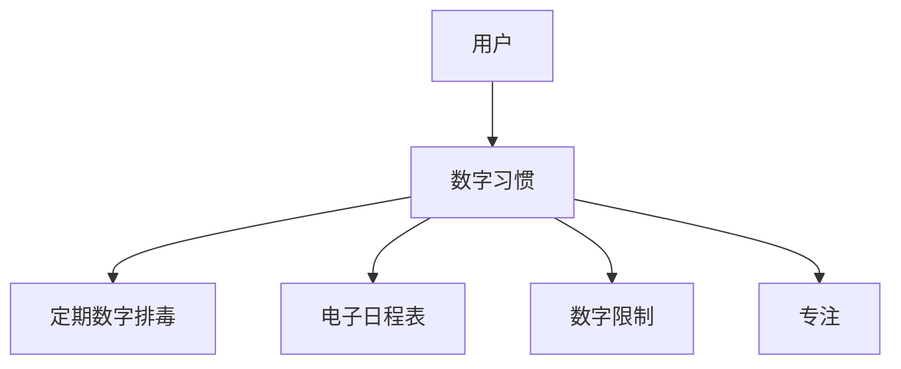

#### 3.3 时间管理策略

**核心概念**：时间管理是指通过合理安排时间，确保高效完成任务。

**原理**：有效的时间管理可以减少时间浪费，提高生活质量。

**应用**：

1. **优先级排序**：根据任务的重要性和紧急程度，对任务进行排序，确保先完成重要且紧急的任务。
2. **设定时间限制**：为每个任务设定时间限制，避免拖延和长时间工作。
3. **灵活调整计划**：根据实际情况灵活调整计划，确保时间管理策略的可行性。

**对比表格**：

| 原有习惯               | 数字极简习惯                    | 效果对比                   |
|------------------------|----------------------------------|---------------------------|
| 没有时间管理计划       | 优先级排序，设定时间限制         | 提高工作效率，减少拖延     |
| 长时间连续工作         | 合理安排工作与休息时间，避免疲劳 | 提高工作效率，减少健康问题 |
| 随意更改计划           | 灵活调整计划，确保计划的可行性   | 提高时间管理能力，减少焦虑 |

**ER实体关系图**：

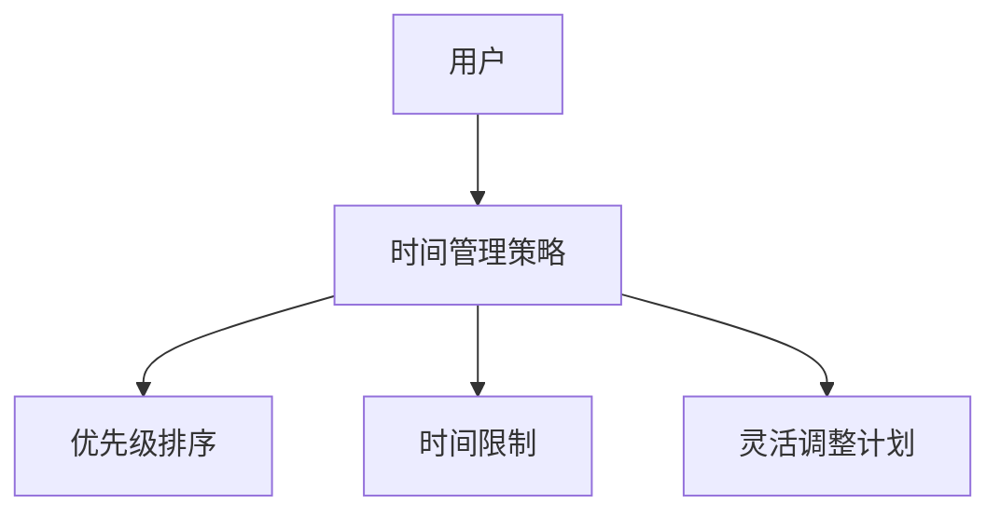

#### 3.4 数字排毒与断舍离

**核心概念**：数字排毒是指通过减少数字设备的使用，恢复身心平衡；断舍离是指通过清理数字设备上的内容，减少不必要的负担。

**原理**：数字排毒和断舍离可以帮助我们减少数字干扰，提高生活质量。

**应用**：

1. **数字排毒**：每周或每月选择一天进行数字排毒，减少对数字设备的依赖。
2. **断舍离**：定期清理手机和应用，删除不必要的文件和应用程序。
3. **数字化生活简化**：将重要信息迁移到云存储，减少物理设备的负担。

**对比表格**：

| 原有习惯               | 数字极简习惯                    | 效果对比                   |
|------------------------|----------------------------------|---------------------------|
| 数字设备使用频繁       | 定期数字排毒，减少设备依赖       | 提高生活质量，减少健康问题 |
| 存储大量无用文件       | 定期断舍离，简化数字化生活       | 提高工作效率，减少设备负担 |
| 沉迷于社交媒体         | 数字排毒，减少社交媒体时间       | 提高专注力，减少分心       |

**ER实体关系图**：

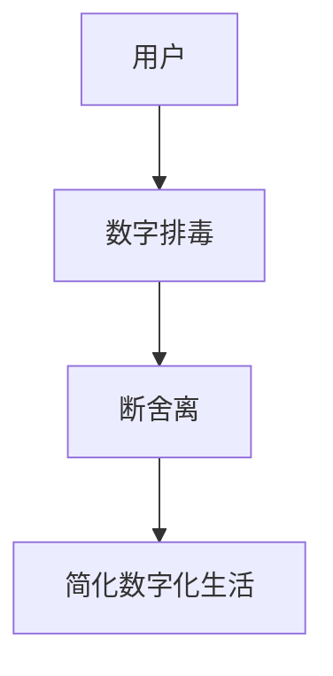

通过以上核心原则的应用，我们可以逐步实现数字极简主义，优化在线生活质量，从而实现更加高效、健康和有意义的生活。接下来，我们将进一步探讨如何优化在线工作效率，提高我们的生活质量。

#### 优化在线工作效率

在数字极简主义理念的指导下，优化在线工作效率是提升生活质量的重要一环。以下是一些实用的技巧，可以帮助我们更好地管理时间和任务，提高工作效率。

##### 4.1 工作流程优化

**核心概念**：工作流程优化是指通过改进工作流程，减少不必要的步骤，提高工作效率。

**原理**：优化工作流程可以减少重复劳动，提高工作效率，同时减少工作压力。

**应用**：

1. **自动化流程**：利用自动化工具，如IFTTT（If This Then That）、 Zapier，将重复性任务自动化，如自动整理邮件、更新日程表等。
2. **简化审批流程**：通过引入电子审批系统，减少纸质文件和繁琐的审批流程。
3. **任务管理**：使用任务管理工具，如Trello、Asana，对任务进行分配和跟踪，确保任务按时完成。

**对比表格**：

| 原有习惯               | 数字极简习惯                    | 效果对比                   |
|------------------------|----------------------------------|---------------------------|
| 手动处理重复任务       | 利用自动化工具，减少手动操作     | 提高工作效率，减少工作压力 |
| 纸质文件管理           | 电子审批系统，减少纸质文件使用   | 提高工作效率，减少文件丢失 |
| 任务分配不明确         | 使用任务管理工具，确保任务跟踪    | 提高任务完成率，减少遗漏    |

**ER实体关系图**：

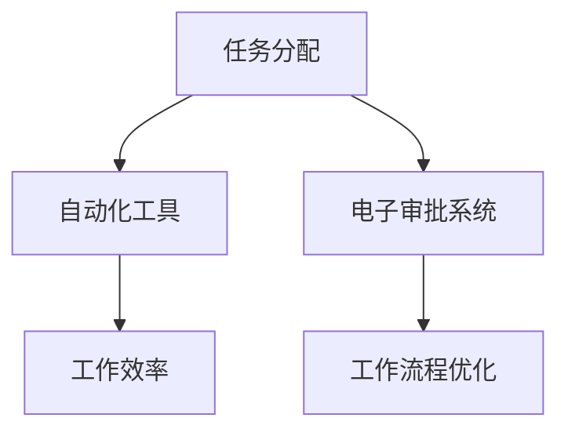

##### 4.2 使用高效工具

**核心概念**：高效工具是指那些能够帮助我们快速完成任务的工具。

**原理**：高效工具可以减少完成任务所需的时间，提高工作效率。

**应用**：

1. **文本编辑工具**：使用Markdown编辑器，如Typora、Vim，快速编写和格式化文档。
2. **代码编辑工具**：使用IDE（集成开发环境），如VS Code、PyCharm，提高代码编写和调试效率。
3. **项目管理工具**：使用GitHub、GitLab，方便团队协作和版本控制。

**对比表格**：

| 原有习惯               | 数字极简习惯                    | 效果对比                   |
|------------------------|----------------------------------|---------------------------|
| 手动编辑文档           | 使用Markdown编辑器，提高编辑效率 | 提高工作效率，减少错误     |
| 单独管理代码和项目     | 使用IDE和版本控制系统，提高开发效率 | 提高工作效率，减少冲突     |
| 电子邮件交流           | 使用项目管理工具，提高团队协作效率 | 提高沟通效率，减少误解     |

**ER实体关系图**：

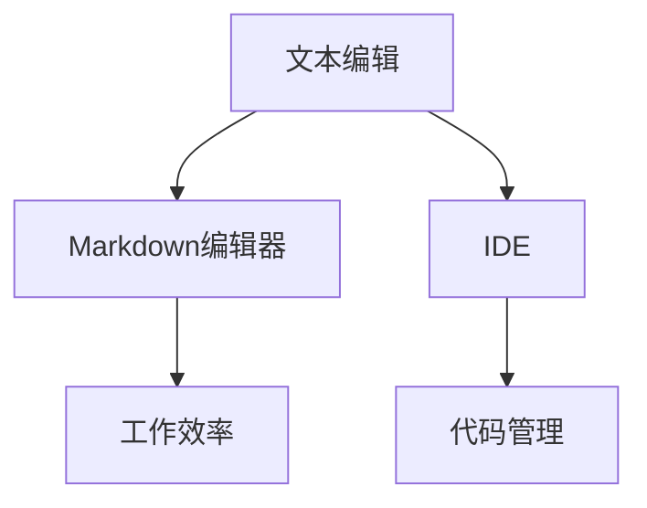

##### 4.3 云计算与协作工具

**核心概念**：云计算和协作工具是指通过云服务和协作平台，实现远程协作和资源共享。

**原理**：云计算和协作工具可以突破地域限制，实现团队的高效协作。

**应用**：

1. **云存储**：使用Google Drive、Dropbox等云存储服务，方便文件共享和协作。
2. **在线会议**：使用Zoom、Microsoft Teams等在线会议工具，实现远程视频会议和协作。
3. **项目管理平台**：使用Trello、Asana等项目管理平台，实现任务分配、进度跟踪和团队协作。

**对比表格**：

| 原有习惯               | 数字极简习惯                    | 效果对比                   |
|------------------------|----------------------------------|---------------------------|
| 本地存储文件           | 使用云存储，实现文件共享和协作   | 提高协作效率，减少数据丢失 |
| 线下会议               | 使用在线会议工具，实现远程协作   | 提高沟通效率，减少时间成本 |
| 分散的任务管理         | 使用项目管理平台，集中管理任务   | 提高任务完成率，减少遗漏    |

**ER实体关系图**：

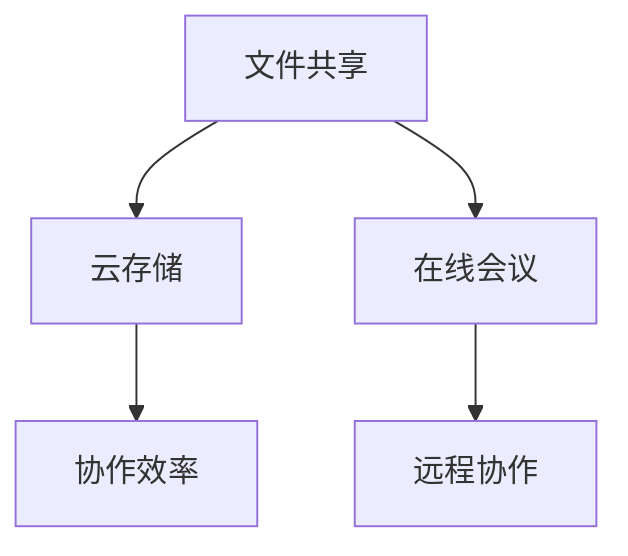

##### 4.4 在线会议管理

**核心概念**：在线会议管理是指通过合理安排和高效组织在线会议，确保会议的顺利进行。

**原理**：良好的在线会议管理可以提高会议效率，减少会议时间浪费，确保每个参会者都能充分利用时间。

**应用**：

1. **会议预约**：提前预约会议，确保会议时间和参会者安排合理。
2. **会议议程**：制定详细的会议议程，明确会议目标和讨论要点。
3. **会议记录**：会后整理会议记录，确保会议决议和行动项清晰明确。
4. **会议反馈**：会后收集参会者反馈，持续优化会议管理和组织。

**对比表格**：

| 原有习惯               | 数字极简习惯                    | 效果对比                   |
|------------------------|----------------------------------|---------------------------|
| 随意召开会议           | 提前预约会议，合理安排时间       | 提高会议效率，减少时间浪费 |
| 缺乏会议议程           | 制定详细的会议议程，明确会议目标 | 提高会议组织能力，确保目标达成 |
| 会议记录不清晰         | 会后整理会议记录，确保行动项明确 | 提高会议执行效率，减少遗漏 |
| 缺乏会议反馈机制       | 收集参会者反馈，持续优化会议管理 | 提高会议质量和效果，增强团队协作 |

**ER实体关系图**：

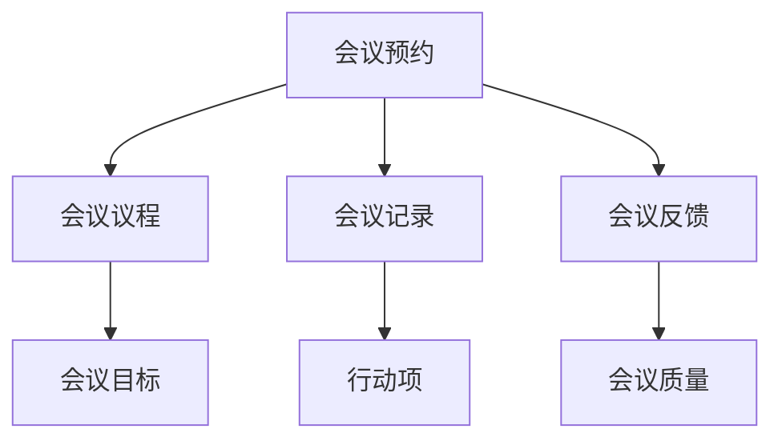

通过以上技巧，我们可以有效优化在线工作效率，减少不必要的干扰，实现更加高效、有序的工作和生活。接下来，我们将进一步探讨如何维护数字健康和心理健康，确保我们在数字极简主义道路上走得更远。

### 数字健康与心理健康

数字极简主义不仅关注工作效率和生活质量，还重视数字健康和心理健康。在数字世界中，保持平衡、定期休息和利用健康工具是维护健康的关键。以下是一些具体的策略和实践方法。

#### 5.1 保持数字平衡

**核心概念**：保持数字平衡意味着合理安排时间，确保在线和离线生活之间的平衡。

**原理**：数字设备虽然方便，但也可能成为干扰我们生活和健康的来源。通过合理安排时间，我们可以减少对数字设备的依赖，保持身心健康。

**应用**：

1. **设定日程**：每天为工作和休息设定明确的时间，确保有足够的休息时间。
2. **限制使用时间**：设定每天使用数字设备的最大时间，避免长时间连续使用。
3. **分时段使用**：将一天的时间分为工作时段和休息时段，确保在工作时段内高效使用设备，在休息时段内远离数字干扰。

**对比表格**：

| 原有习惯               | 数字极简习惯                    | 效果对比                   |
|------------------------|----------------------------------|---------------------------|
| 不限制使用时间         | 设定每天使用时间上限             | 减少设备依赖，提高生活质量 |
| 工作与休息时间混淆     | 分时段使用设备，确保充足休息     | 提高工作效率，减少健康问题 |
| 一直保持在线状态       | 设定日程，合理安排在线和离线时间 | 保持数字平衡，减少压力     |

**ER实体关系图**：

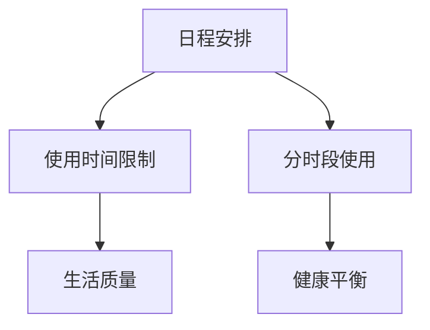

#### 5.2 数字休息策略

**核心概念**：数字休息策略是指通过定期休息和恢复，减轻数字设备对身心健康的影响。

**原理**：长时间使用数字设备会导致眼睛疲劳、颈椎疼痛、失眠等问题。通过定期休息和恢复，我们可以减轻这些负面影响，提高身心健康水平。

**应用**：

1. **20-20-20规则**：每使用20分钟数字设备，就远眺20英尺（约6米）外的物体，至少20秒。
2. **定期休息**：每天至少安排一次长时间休息，远离数字设备，进行放松活动。
3. **晚上关闭设备**：睡前一小时关闭所有数字设备，避免蓝光对睡眠的干扰。

**对比表格**：

| 原有习惯               | 数字极简习惯                    | 效果对比                   |
|------------------------|----------------------------------|---------------------------|
| 长时间连续使用设备     | 实施20-20-20规则，定期休息       | 减轻眼睛疲劳，提高睡眠质量 |
| 晚上使用设备           | 睡前关闭设备，避免蓝光干扰       | 提高睡眠质量，减少健康问题 |
| 缺乏休息时间           | 每天安排长时间休息，恢复身心健康 | 提高生活质量，减少压力     |

**ER实体关系图**：

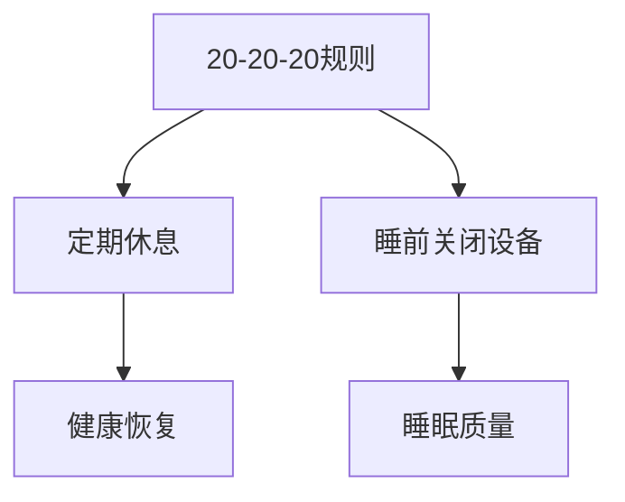

#### 5.3 数字健康工具

**核心概念**：数字健康工具是指那些专门用于促进数字健康的应用和设备。

**原理**：数字健康工具可以帮助我们监控和管理数字设备的使用，减少负面影响。

**应用**：

1. **护眼应用**：使用护眼应用，如F.lux、Night Shift，调整屏幕色温，减少对眼睛的刺激。
2. **健康监测应用**：使用健康监测应用，如Headspace、Pomodoro Timer，帮助管理休息时间和注意力。
3. **设备管理工具**：使用设备管理工具，如Focus@Will、Freedom，限制特定应用或网站的使用时间。

**对比表格**：

| 原有习惯               | 数字极简习惯                    | 效果对比                   |
|------------------------|----------------------------------|---------------------------|
| 无护眼措施             | 使用护眼应用，减少眼睛疲劳       | 提高眼睛健康，减少不适感   |
| 缺乏休息和专注管理     | 使用健康监测应用，合理安排时间   | 提高工作效率，减少分心     |
| 无限制地使用设备       | 使用设备管理工具，限制不必要使用 | 减少设备依赖，提升专注力   |

**ER实体关系图**：

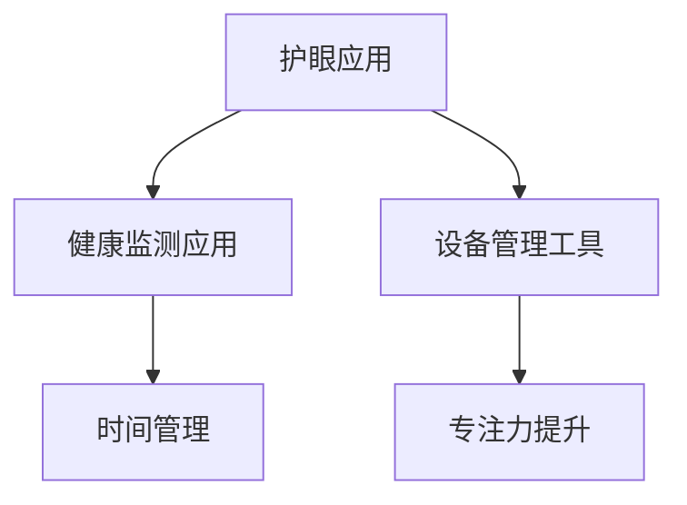

#### 5.4 心理健康支持

**核心概念**：心理健康支持是指通过心理辅导、自我调节等方法，维护心理健康。

**原理**：心理健康是生活质量的重要组成部分。通过心理辅导和自我调节，我们可以更好地应对压力，保持积极心态。

**应用**：

1. **心理咨询**：定期进行心理咨询，寻求专业帮助，解决心理问题。
2. **自我调节**：通过冥想、瑜伽等自我调节方法，缓解压力，保持心理健康。
3. **心理健康应用**：使用心理健康应用，如Calm、Headspace，进行日常心理训练。

**对比表格**：

| 原有习惯               | 数字极简习惯                    | 效果对比                   |
|------------------------|----------------------------------|---------------------------|
| 缺乏心理支持           | 定期心理咨询，寻求专业帮助       | 提高心理健康水平，减少焦虑 |
| 不进行自我调节          | 进行冥想、瑜伽等自我调节方法       | 缓解压力，提升心理韧性   |
| 无心理健康应用辅助      | 使用心理健康应用，进行日常心理训练 | 提高心理素质，增强应对能力 |

**ER实体关系图**：

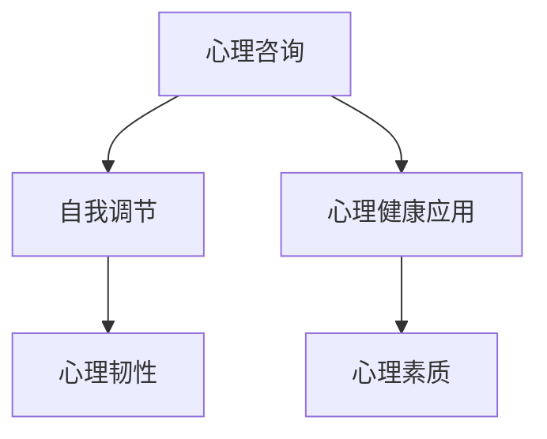

通过以上策略和实践方法，我们可以有效维护数字健康和心理健康，减少数字设备对生活的负面影响，提升生活质量。接下来，我们将探讨如何在日常生活中实践数字极简主义，实现更加高效、健康和有意义的生活方式。

### 数字极简主义生活方式

数字极简主义不仅仅是一种理念，更是一种可以实际操作的生活方式。通过在家庭、购物、社交和旅行等方面实践数字极简主义，我们可以更好地管理时间和资源，提升生活质量。

#### 6.1 数字极简家居

**核心概念**：数字极简家居是指通过减少家居中的数字设备，简化生活方式，创造一个更舒适、更宁静的居住环境。

**原理**：过度的数字设备不仅会增加家居的杂乱感，还会分散我们的注意力，影响生活品质。

**应用**：

1. **减少电子产品数量**：只保留必要的生活和工作设备，例如手机、平板电脑和笔记本电脑，其他不必要的设备可以捐赠或出售。
2. **优化家居布局**：重新设计家居布局，将电子设备放置在不易打扰到休息和娱乐的区域。
3. **减少数字媒体存储**：只保留重要和常用的数字媒体文件，如照片和音乐，删除不必要的文件。

**对比表格**：

| 原有习惯               | 数字极简习惯                    | 效果对比                   |
|------------------------|----------------------------------|---------------------------|
| 家居中充斥着各种设备   | 只保留必要设备，简化家居布局     | 提高居住舒适度，减少杂乱感   |
| 储存大量数字文件       | 只保留重要文件，减少数字文件存储 | 提高电脑性能，减少设备负担   |
| 数字设备放在卧室       | 将电子设备放在不易打扰到休息的区域 | 提高睡眠质量，减少干扰       |

**ER实体关系图**：

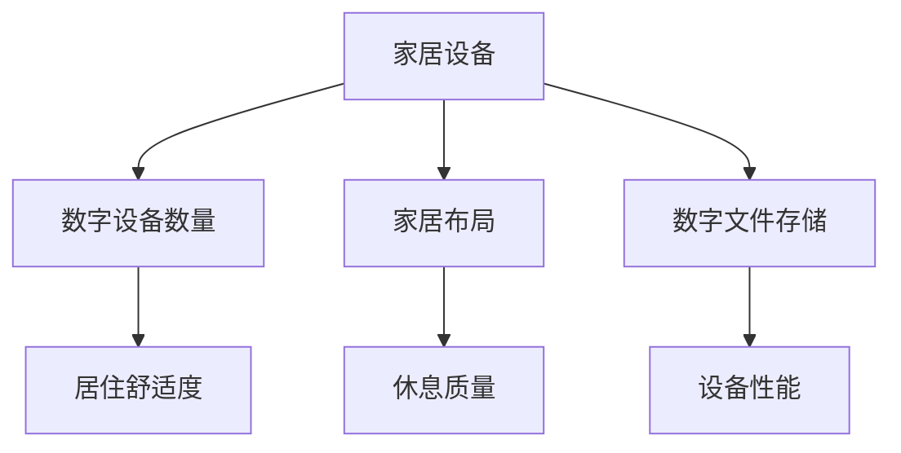

#### 6.2 数字极简购物

**核心概念**：数字极简购物是指通过减少购物频率、优化购物流程和减少购物物品，实现更环保、更经济的消费方式。

**原理**：频繁购物不仅会增加财务负担，还会导致物品堆积，增加管理难度。

**应用**：

1. **制定购物清单**：在购物前制定详细的购物清单，避免冲动购物。
2. **减少购物频率**：设定每月或每季度的购物时间，减少不必要的购物。
3. **购买二手商品**：在可能的情况下，购买二手商品，减少资源浪费。

**对比表格**：

| 原有习惯               | 数字极简习惯                    | 效果对比                   |
|------------------------|----------------------------------|---------------------------|
| 频繁购物               | 制定购物清单，减少购物频率       | 减少财务负担，减少物品堆积 |
| 不购买二手商品         | 购买二手商品，减少资源浪费       | 提高环保意识，节约开支     |
| 购物无计划             | 有计划地购物，避免冲动购物       | 提高购物效率，减少购物时间 |

**ER实体关系图**：

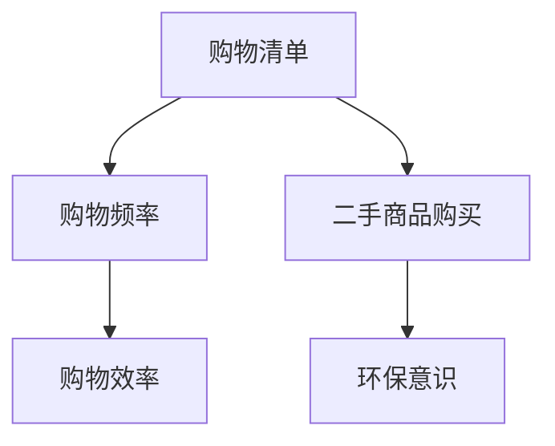

#### 6.3 数字极简社交

**核心概念**：数字极简社交是指通过减少不必要的社交媒体互动，专注于高质量、有意义的社交活动。

**原理**：社交媒体上的互动往往缺乏深度，过多关注社交媒体可能导致社交疏离。

**应用**：

1. **减少社交媒体使用**：设定每天或每周使用社交媒体的时间上限，减少不必要的互动。
2. **专注于高质量社交**：选择与亲朋好友进行面对面的交流，减少社交媒体上的互动。
3. **定期断联**：定期断开与社交媒体的连接，进行数字排毒，重新审视社交关系。

**对比表格**：

| 原有习惯               | 数字极简习惯                    | 效果对比                   |
|------------------------|----------------------------------|---------------------------|
| 过度使用社交媒体       | 设定时间上限，减少社交媒体使用   | 提高社交质量，减少社交疏离 |
| 社交网络过度活跃       | 专注于高质量社交，减少虚拟互动   | 提高人际关系，减少焦虑     |
| 缺乏社交互动           | 定期断联，进行数字排毒           | 提升社交能力，增加幸福感   |

**ER实体关系图**：

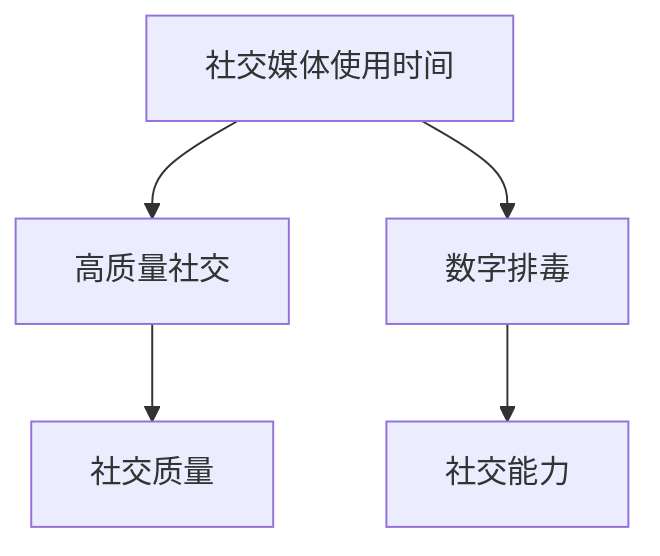

#### 6.4 数字极简旅行

**核心概念**：数字极简旅行是指通过减少旅行中的数字依赖，专注于体验和探索，享受真实的旅行体验。

**原理**：在旅行中过度依赖数字设备不仅会影响旅行体验，还可能导致安全风险。

**应用**：

1. **减少电子设备使用**：在旅行中减少手机、平板电脑等电子设备的使用，专注于旅行体验。
2. **提前规划**：提前做好旅行计划，减少旅行中的不确定性和依赖。
3. **利用本地资源**：利用当地的旅游指南和资源，减少对导航和互联网的依赖。

**对比表格**：

| 原有习惯               | 数字极简习惯                    | 效果对比                   |
|------------------------|----------------------------------|---------------------------|
| 过度依赖导航设备       | 提前规划，利用本地资源           | 提高旅行体验，减少设备依赖 |
| 频繁拍照分享           | 减少拍照分享，专注于真实体验       | 提高体验质量，减少焦虑     |
| 旅行中长时间使用电子设备 | 设定使用时间上限，专注于体验       | 提高旅行体验，增强安全意识 |

**ER实体关系图**：

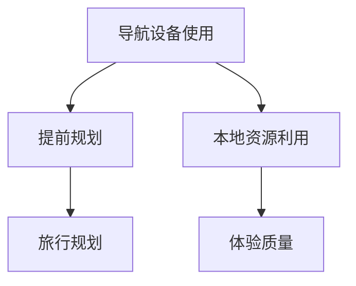

通过在家庭、购物、社交和旅行等方面实践数字极简主义，我们可以更好地管理时间和资源，减少数字依赖，提升生活质量。接下来，我们将探讨如何将数字极简主义理念应用到实际生活中，并提供具体的实践指南。

### 实践与反思

数字极简主义不仅仅是一种理念，更需要在日常生活中付诸实践。通过一系列具体的实践指南，我们可以逐步实现数字极简主义，提升生活质量和幸福感。以下是数字极简主义实践的具体步骤和注意事项。

#### 7.1 实践指南

**步骤一：设定目标和计划**

1. **确定目标**：首先，明确你希望通过数字极简主义实现的具体目标，比如提高工作效率、减少压力、改善健康等。
2. **制定计划**：根据目标，制定具体的实践计划。例如，设定每天使用社交媒体的时间上限，或者每周进行一次数字排毒。

**步骤二：逐步减少数字依赖**

1. **减少通知干扰**：关闭不必要的手机和应用通知，避免在工作和休息时被打扰。
2. **定期数字排毒**：每周选择一天或一段时间，完全远离数字设备，进行数字排毒，恢复身心健康。
3. **限制使用时间**：设定每天使用数字设备的时间上限，避免长时间连续使用，减少对数字设备的依赖。

**步骤三：优化数字习惯**

1. **制定日程表**：使用电子日程表规划时间和任务，确保每天有充足的休息时间。
2. **培养专注习惯**：使用专注工具，如番茄工作法，提高工作效率，减少分心。
3. **简化设备使用**：只保留必要的数字设备和应用，减少设备负担和管理难度。

**步骤四：持续反思与调整**

1. **定期反思**：每隔一段时间，回顾自己的实践情况，评估是否达到了预期目标。
2. **调整计划**：根据反思结果，调整实践计划，确保实践方法符合实际情况和需求。
3. **寻求支持**：与家人、朋友或同事分享你的实践经历，寻求支持和鼓励。

#### 7.2 反思与调整

**反思**：

1. **目标达成度**：评估设定的目标是否已经实现，哪些方面做得好，哪些方面需要改进。
2. **实践效果**：观察数字极简主义实践对工作效率、健康和心理健康等方面的影响，评估实践效果。
3. **习惯培养**：反思自己在培养健康数字习惯方面的表现，哪些习惯已经养成，哪些需要进一步强化。

**调整**：

1. **优化计划**：根据反思结果，调整实践计划，确保计划更加符合实际情况和需求。
2. **强化习惯**：对已经养成的健康数字习惯进行强化，确保习惯长期持续。
3. **寻求帮助**：如果遇到困难或挑战，不要害怕寻求专业帮助或与他人分享，以获取支持和建议。

#### 7.3 长期维持数字极简主义

数字极简主义需要长期坚持和实践，以下是一些长期维持数字极简主义的策略：

1. **建立健康习惯**：通过持续培养健康数字习惯，如定期数字排毒、合理使用社交媒体等，确保数字极简主义理念深入人心。
2. **制定长远计划**：制定长期的数字极简主义计划，确保实践目标具有连续性和可持续性。
3. **适应变化**：随着技术和生活方式的变化，不断调整和实践策略，确保数字极简主义能够适应新的环境和需求。

#### 7.4 案例研究：成功的数字极简实践

以下是一个成功的数字极简实践案例：

**案例背景**：小明是一名软件开发工程师，由于工作繁忙和社交媒体依赖，他的工作效率低下，身心健康状况不佳。在了解到数字极简主义后，他决定实践这一理念，提升自己的生活质量。

**实践步骤**：

1. **设定目标**：小明明确了自己的目标，即提高工作效率、减少压力、改善健康。
2. **减少通知干扰**：他关闭了手机和应用中的所有非必要的通知，确保在工作中不会被干扰。
3. **定期数字排毒**：每周设定一天为数字排毒日，这一天他完全远离数字设备，专注于休息和锻炼。
4. **优化日程表**：使用电子日程表规划每天的工作和休息时间，确保有充足的休息时间。
5. **培养专注习惯**：使用番茄工作法提高工作效率，减少分心。
6. **简化设备使用**：他只保留了必要的数字设备和应用，删除了不必要的文件和应用，减少了设备负担。

**实践效果**：

1. **工作效率提高**：通过减少通知干扰和培养专注习惯，小明的工作效率显著提高，工作完成时间缩短。
2. **身心健康改善**：定期数字排毒和合理使用社交媒体，使小明的身心健康状况得到显著改善，焦虑感减轻，睡眠质量提高。
3. **生活质量提升**：通过数字极简实践，小明的生活质量显著提升，他有更多的时间进行休闲和娱乐，与家人和朋友的互动也变得更加深入和有意义。

通过以上案例，我们可以看到数字极简主义实践对个人生活质量的显著提升。通过设定目标、减少干扰、优化习惯和定期反思，我们可以在日常生活中成功实践数字极简主义，实现更加高效、健康和有意义的生活。

### 未来展望

数字极简主义作为一种新兴的生活理念，正逐渐在现代社会中得到关注和应用。随着科技的不断进步和人们对生活质量要求的提高，数字极简主义在未来有望在多个方面取得显著的发展。

#### 8.1 数字极简主义的发展趋势

首先，数字极简主义在未来可能会更加普及。随着越来越多的人意识到过度使用数字设备带来的负面影响，数字极简主义作为一种应对策略，将得到更广泛的认可。以下是一些可能的发展趋势：

1. **技术优化**：未来数字设备的设计将更加注重用户体验，减少对用户的不必要干扰。例如，智能设备将更加智能地管理通知，只显示重要信息，减少用户被分散的频率。
2. **政策支持**：政府和企业可能会出台更多政策，鼓励和推广数字极简主义，如限制广告骚扰、规范数据收集和使用等。
3. **教育普及**：学校和教育机构可能会将数字极简主义纳入课程，帮助学生从小培养健康的使用习惯，避免过度依赖数字设备。

#### 8.2 社会影响与伦理问题

数字极简主义的发展也将带来一系列社会影响和伦理问题。以下是一些需要关注的问题：

1. **隐私保护**：随着数字设备的使用越来越普遍，个人隐私的保护变得更加重要。数字极简主义提倡减少对数字设备的依赖，同时也需要加强对个人数据的保护。
2. **数字鸿沟**：数字极简主义可能会加剧数字鸿沟。那些无法或不愿意采用数字极简主义的人可能会在技术发展和信息获取上处于劣势，这需要社会各界的共同努力来缩小这一差距。
3. **社会价值观**：数字极简主义倡导回归生活的本质，强调人与人之间的真实互动和体验。这对传统的社会价值观和生活方式可能会产生一定冲击，需要社会各界的共同努力来适应这一变化。

#### 8.3 数字极简主义与可持续发展

数字极简主义不仅关注个体的生活质量，也关注社会的可持续发展。以下是一些与可持续发展相关的话题：

1. **环保**：减少对数字设备的依赖可以减少电子垃圾的产生，降低对环境的负担。例如，推广二手设备和修复服务，减少新设备的购买和使用。
2. **节能**：通过优化工作流程和减少不必要的数字设备使用，可以降低能源消耗，促进节能环保。
3. **社会责任**：数字极简主义鼓励人们更多地关注现实生活中的问题和需求，积极参与社会公益活动，推动社会进步和可持续发展。

#### 8.4 个人与社会的共赢

数字极简主义不仅对个人生活质量的提升有积极作用，也对整个社会的可持续发展具有重要意义。以下是个人与社会的共赢之处：

1. **健康提升**：通过减少数字设备的使用，个人可以获得更好的身心健康，提高生活质量。
2. **效率提升**：数字极简主义可以帮助个人和组织更好地管理时间和资源，提高工作效率，创造更多的价值。
3. **社会和谐**：数字极简主义倡导人与人之间的真实互动和体验，有助于建立更加和谐和互助的社会关系，促进社会稳定和发展。

总之，数字极简主义作为一种应对现代数字生活挑战的新兴理念，在未来具有广阔的发展前景。通过技术优化、政策支持、教育普及和社会责任的共同推动，数字极简主义有望成为推动社会可持续发展的重要力量。同时，个人在实践数字极简主义的过程中，不仅可以提升生活质量，还可以为社会做出积极贡献，实现个人与社会的共赢。

### 总结

通过本文的探讨，我们可以清楚地看到数字极简主义的重要性。数字极简主义不仅有助于提高个人工作效率和心理健康，还能优化生活质量，实现更加高效、健康和有意义的生活。以下是本文的主要结论：

1. **核心原则**：数字极简主义的核心原则包括专注与减少干扰、数字习惯的建立、时间管理策略以及数字排毒与断舍离。这些原则为我们在数字生活中提供了清晰的指导。

2. **挑战与对策**：数字生活带来了数字过载、时间管理困境、健康问题和社交隐私挑战。通过数字极简主义，我们可以有效地应对这些挑战，减少负面影响。

3. **实践方法**：通过优化在线工作效率、维护数字健康和心理健康，以及实践数字极简主义生活方式，我们可以实现更加高效和健康的生活。

4. **未来发展**：数字极简主义在未来具有广阔的发展前景，随着技术的进步和社会的认可，它有望成为推动社会可持续发展的重要力量。

总之，数字极简主义不仅是一种理念，更是一种可以实际操作的生活方式。通过实践数字极简主义，我们可以提升生活质量，实现个人与社会的共赢。希望读者能够从本文中获得启示，开始自己的数字极简之旅。

### 最佳实践 Tips

在实践数字极简主义的过程中，以下是一些最佳实践和注意事项，帮助您更好地实现数字极简主义的目标：

1. **设定明确目标**：在开始实践数字极简主义之前，明确您希望通过数字极简主义实现的具体目标，如提高工作效率、减少压力或改善健康。设定清晰的目标将有助于您在实践过程中保持动力。

2. **逐步实施**：数字极简主义的实践不应一蹴而就，而是需要逐步实施。从小的改变开始，例如减少社交媒体使用时间或关闭不必要的通知，逐渐养成健康的数字习惯。

3. **定期数字排毒**：每周或每月选择一天进行数字排毒，完全远离数字设备，专注于休息和锻炼。这有助于减轻数字设备的负面影响，恢复身心健康。

4. **合理安排时间**：使用电子日程表规划您的时间，确保工作和休息时间得到合理分配。这有助于提高工作效率，减少拖延。

5. **培养专注习惯**：使用专注工具，如番茄工作法，提高工作效率，减少分心。通过定期练习专注技巧，您可以更好地专注于重要任务。

6. **简化设备使用**：只保留必要的数字设备和应用，删除不必要的文件和应用。这有助于减少设备负担，提高设备性能。

7. **寻求支持**：与家人、朋友或同事分享您的实践经历，寻求支持和鼓励。社会支持将帮助您克服困难，保持数字极简主义的实践。

8. **持续反思与调整**：定期反思自己的实践情况，评估目标达成情况，并根据实际情况调整实践计划。这有助于确保数字极简主义实践符合您的需求和实际情况。

通过遵循这些最佳实践和注意事项，您将能够更好地实践数字极简主义，提升生活质量和幸福感。

### 小结

本文系统地探讨了数字极简主义的概念、核心原则和实践方法，旨在帮助读者优化在线生活质量。通过分析数字生活的挑战，我们认识到数字过载、时间管理困境、健康问题和社交隐私问题对生活质量的负面影响。数字极简主义通过减少干扰、建立健康习惯、优化时间管理以及数字排毒与断舍离，提供了应对这些挑战的有效策略。

数字极简主义的核心原则包括专注与减少干扰、数字习惯的建立、时间管理策略以及数字排毒与断舍离。这些原则不仅有助于提高工作效率和心理健康，还能优化生活质量。通过优化在线工作效率、维护数字健康和心理健康，以及实践数字极简主义生活方式，我们可以实现更加高效、健康和有意义的生活。

未来，随着技术的进步和社会的认可，数字极简主义有望成为推动社会可持续发展的重要力量。希望本文能启发读者开始自己的数字极简之旅，通过实践数字极简主义，提升个人生活质量和幸福感。

### 注意事项

在实践数字极简主义的过程中，以下注意事项将帮助您更顺利地实现目标：

1. **尊重个人习惯**：每个人的生活方式和习惯不同，数字极简主义的实践应尊重个人差异。不要盲目模仿他人，而是根据自己的实际情况制定适合自己的实践计划。

2. **逐步调整**：数字极简主义的实践不应急于求成，应逐步进行调整。从小的改变开始，例如减少社交媒体使用时间，逐渐养成健康的数字习惯。

3. **灵活应对**：在实践过程中，可能会遇到各种困难和挑战。保持灵活性，根据实际情况调整实践计划，找到最适合自己的方法。

4. **保持耐心**：数字极简主义的实践需要时间和耐心。不要期望在短时间内看到显著效果，而是要持续地努力和坚持。

5. **寻求支持**：与家人、朋友或同事分享您的实践经历，寻求支持和鼓励。社会支持将帮助您克服困难，保持数字极简主义的实践。

通过遵循这些注意事项，您将能够更加顺利地实践数字极简主义，提升生活质量和幸福感。

### 拓展阅读

为了进一步深入理解数字极简主义，以下是一些推荐书籍、文章和资源：

1. **书籍**：
   - 《数字极简主义：找回专注、效率和幸福》
   - 《信息焦虑：如何在信息过载的时代找到心灵的宁静》
   - 《时间管理：如何高效利用时间，实现个人目标》

2. **文章**：
   - 《哈佛商业评论》：关于数字极简主义的文章
   - 《纽约时报》：关于数字健康和心理健康的话题
   - 《领英》：成功实践数字极简主义的个人故事

3. **在线资源**：
   - 数字极简主义论坛：www.digitalminimalismforum.com
   - 数字极简主义博客：www.digitalminimalismblog.com
   - 数字健康和心理健康资源：www.digitalwellbeing.org

通过阅读这些书籍、文章和资源，您将能够更全面地了解数字极简主义的理念和实践，从而更好地应用到自己的生活中。

### 作者信息

作者：AI天才研究院/AI Genius Institute & 禅与计算机程序设计艺术 /Zen And The Art of Computer Programming

AI天才研究院（AI Genius Institute）专注于人工智能、机器学习和计算机科学领域的前沿研究和应用。研究院致力于培养下一代人工智能领域的领军人才，推动技术创新和社会进步。同时，作者也是《禅与计算机程序设计艺术》（Zen And The Art of Computer Programming）的资深作者，这本书是计算机编程和人工智能领域的经典之作，深受读者喜爱。作者通过深入浅出的讲解和丰富的案例，帮助读者掌握编程和人工智能的核心原理和技巧。

