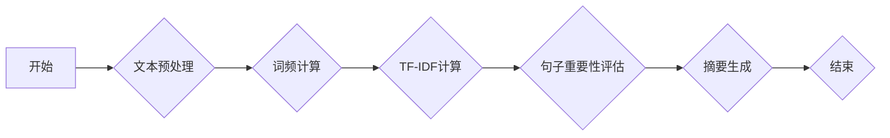

                 

### 文本摘要技术：AI Agent信息处理的利器

---

## 关键词

- 文本摘要技术
- AI Agent
- 信息处理
- 算法原理
- 系统架构
- 实际应用

## 摘要

文本摘要技术是人工智能领域的一项关键技术，它能够从大量文本中提取出关键信息，以帮助用户快速理解和掌握主要内容。AI Agent作为文本摘要技术的核心组件，扮演着信息处理的重要角色。本文将详细探讨文本摘要技术的背景、核心概念、算法原理、系统架构以及实际应用，旨在为读者提供一份全面、深入的技术指南。

---

### 目录大纲

1. **背景介绍**
   1.1. 文本摘要技术概述
   1.2. 核心概念与联系
   1.3. 研究目标与内容框架
   1.4. 边界与外延
   1.5. 本章小结

2. **核心概念与联系**
   2.1. 文本摘要算法原理
   2.2. ER实体关系图架构
   2.3. 算法流程图与数学模型
   2.4. 举例说明
   2.5. 本章小结

3. **算法原理讲解**
   3.1. 算法原理详细讲解
   3.2. Python源代码实现
   3.3. 数学模型与数学公式详细讲解
   3.4. 举例说明
   3.5. 本章小结

4. **系统分析与架构设计**
   4.1. 系统功能设计
   4.2. 系统架构设计
   4.3. 系统接口设计
   4.4. 系统交互
   4.5. 本章小结

5. **项目实战**
   5.1. 环境安装与系统核心实现
   5.2. 代码应用解读与分析
   5.3. 实际案例剖析
   5.4. 项目小结

6. **最佳实践与拓展阅读**
   6.1. 最佳实践
   6.2. 注意事项
   6.3. 拓展阅读
   6.4. 本章小结

---

### 第一部分 背景介绍

#### 1.1 文本摘要技术概述

随着互联网的快速发展，信息爆炸成为不可避免的趋势。面对海量的文本数据，用户往往无法在有限的时间内阅读和理解所有内容。这就催生了文本摘要技术的诞生，其目的是从原始文本中提取出最有价值、最核心的信息，以帮助用户快速获取关键内容。

文本摘要技术可以分为两大类：抽取式摘要和生成式摘要。

抽取式摘要主要通过规则和模式匹配，从原始文本中提取出关键句子或段落，生成摘要。这种方法在处理结构化文本时效果较好，但在处理非结构化文本时存在局限性。

生成式摘要则利用自然语言处理技术和机器学习算法，生成全新的摘要文本。这种方法能够更好地处理非结构化文本，但生成摘要的质量往往受到算法模型的影响。

#### 1.2 核心概念与联系

文本摘要技术涉及到多个核心概念，包括文本、摘要、关键信息、算法等。

文本是原始数据源，可以是新闻报道、学术论文、技术文档等。摘要是对文本的简短概括，通常包含文本的主要观点、结论和关键信息。

关键信息是摘要的核心，是用户最关心和需要了解的内容。提取关键信息是文本摘要技术的核心目标。

算法是实现文本摘要的关键，不同的算法有不同的原理和特点。常见的算法包括基于规则的方法、统计方法、深度学习方法等。

#### 1.3 研究目标与内容框架

本文的研究目标是深入探讨文本摘要技术的原理、算法和应用，为实际项目提供技术支持和指导。

内容框架包括以下几个部分：

- 文本摘要技术概述：介绍文本摘要技术的背景、核心概念和发展趋势。
- 核心概念与联系：详细解释文本、摘要、关键信息和算法等核心概念，并阐述它们之间的联系。
- 算法原理讲解：分析不同文本摘要算法的原理、特点和优缺点，并提供Python源代码实现。
- 系统分析与架构设计：设计文本摘要系统的功能、架构和接口，并绘制Mermaid流程图和序列图。
- 项目实战：介绍文本摘要技术的实际应用，包括环境安装、系统核心实现和案例分析。
- 最佳实践与拓展阅读：提供文本摘要技术的最佳实践技巧、注意事项和拓展阅读资源。

#### 1.4 边界与外延

文本摘要技术的边界主要涉及以下几个方面：

- 文本类型：文本摘要技术可以应用于不同类型的文本，包括结构化文本和非结构化文本。
- 摘要长度：摘要的长度可以根据需求进行调整，但过长或过短的摘要都可能影响用户的阅读体验。
- 算法模型：不同的算法模型适用于不同类型的文本和需求，需要根据实际情况进行选择。

文本摘要技术的应用外延非常广泛，包括但不限于以下几个方面：

- 信息检索：文本摘要是信息检索的重要辅助工具，可以提高用户的检索效率和准确度。
- 内容推荐：基于文本摘要技术，可以为用户推荐感兴趣的内容，提高内容的个性化程度。
- 自然语言处理：文本摘要是自然语言处理的重要组成部分，可以应用于文本分类、实体识别等多个领域。

#### 1.5 本章小结

本文首先介绍了文本摘要技术的背景、核心概念和发展趋势，然后详细阐述了文本、摘要、关键信息和算法等核心概念，并探讨了文本摘要技术的应用边界和外延。通过本章的学习，读者可以初步了解文本摘要技术的基本原理和应用场景。

---

### 第二部分 核心概念与联系

#### 2.1 文本摘要算法原理

文本摘要算法是文本摘要技术的核心，不同的算法有不同的原理和特点。本文将介绍几种常见的文本摘要算法，包括基于规则的方法、统计方法和深度学习方法。

##### 2.1.1 基于规则的方法

基于规则的方法通过定义一系列规则，从原始文本中提取关键句子或段落。这些规则通常基于文本的语法、语义和上下文信息。例如，可以定义一个规则：如果某个句子包含特定的关键词，则这个句子可能是关键句子。

优点：

- 实现简单，易于理解。
- 对于结构化文本效果较好。

缺点：

- 对于非结构化文本效果较差。
- 需要手工定义规则，规则复杂度较高。

##### 2.1.2 统计方法

统计方法利用文本的统计特征，如词频、句子长度等，来评估句子的重要性。常见的统计方法包括TF-IDF、LSA和LDA等。

TF-IDF（Term Frequency-Inverse Document Frequency）是一种基于词频和文档频次的统计方法，用于评估词语的重要性。词频表示某个词在文档中出现的次数，文档频次表示某个词在所有文档中出现的次数。TF-IDF值越高，表示词语在文档中越重要。

优点：

- 不需要手工定义规则，自动计算词频和文档频次。
- 对非结构化文本效果较好。

缺点：

- 没有考虑词语之间的语义关系。
- 对于高频词和低频词的评估存在偏差。

##### 2.1.3 深度学习方法

深度学习方法利用神经网络模型，从大量文本数据中自动学习句子和文档的特征。常见的深度学习方法包括序列模型、文本生成模型和实体关系模型等。

序列模型，如RNN（Recurrent Neural Network）和LSTM（Long Short-Term Memory），可以捕捉句子中的时间顺序信息，从而更好地理解句子的语义。

文本生成模型，如BERT（Bidirectional Encoder Representations from Transformers）和GPT（Generative Pre-trained Transformer），可以生成高质量的摘要文本。

实体关系模型，如ER（Entity-Relation）图，可以捕捉文本中的实体和关系，从而更好地理解文本的语义。

优点：

- 可以自动学习文本的特征，无需手工定义规则。
- 对非结构化文本效果较好。

缺点：

- 需要大量的训练数据和计算资源。
- 模型参数复杂，调优困难。

##### 2.1.4 算法属性特征对比表格

下面是一个简单的算法属性特征对比表格，用于比较不同文本摘要算法的特点：

| 算法类型 | 优点 | 缺点 | 适用场景 |
| --- | --- | --- | --- |
| 基于规则的方法 | 实现简单，易于理解 | 对于非结构化文本效果较差 | 结构化文本 |
| 统计方法 | 自动计算词频和文档频次，对非结构化文本效果较好 | 没有考虑词语之间的语义关系，对于高频词和低频词的评估存在偏差 | 非结构化文本 |
| 深度学习方法 | 可以自动学习文本的特征，对非结构化文本效果较好 | 需要大量的训练数据和计算资源，模型参数复杂，调优困难 | 非结构化文本 |

##### 2.1.5 ER实体关系图架构

实体关系图（Entity-Relationship Diagram，ER图）是一种用于描述实体和关系的图形化表示方法。在文本摘要技术中，ER图可以用来表示文本中的实体和它们之间的关系。

实体（Entity）是文本中具有独立意义的对象，如人名、地名、组织机构等。

关系（Relationship）是实体之间的相互作用或关联，如属于、参与等。

ER图的构成包括实体、关系和属性。实体用矩形表示，关系用菱形表示，属性用椭圆表示。

下面是一个简单的ER图示例：

```mermaid
erDiagram
  Customer ||--|{ Order : places }
  Product ||--|{ Order : contains }
```

在这个例子中，Customer（客户）和Product（产品）是实体，Order（订单）是关系。客户可以下单（places），产品可以包含在订单中（contains）。

##### 2.1.6 算法流程图

算法流程图是描述算法执行过程的图形化表示方法。在文本摘要技术中，算法流程图可以用来展示文本摘要算法的执行步骤和逻辑关系。

下面是一个简单的文本摘要算法流程图：



在这个例子中，算法的执行步骤包括：文本预处理、词频计算、TF-IDF计算、句子重要性评估和摘要生成。

##### 2.1.7 数学模型与公式

文本摘要算法通常涉及到一些数学模型和公式。下面是一个简单的例子：

- 词频（TF）：某个词在文档中出现的次数。
- 文档频次（DF）：某个词在所有文档中出现的次数。
- TF-IDF：词频与文档频次的乘积，用于评估词语的重要性。

公式如下：

$$
TF-IDF = \frac{TF \times ID

