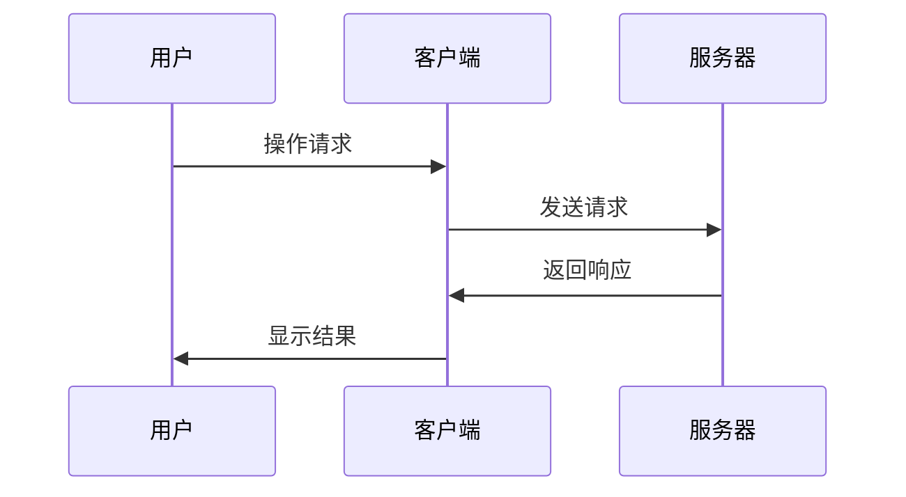

                 

# 新 stoicism 日记app：古老哲学在现代的应用工具

## 关键词

- **斯多葛主义**
- **日记app**
- **哲学应用**
- **心理健康**
- **现代科技**

### 摘要

在现代快节奏的生活中，人们面临着各种心理压力，寻求内心的平和与自由变得愈发重要。斯多葛主义，一种古老的哲学思想，强调通过理性控制情绪、接受现实来达到内心的平和。本文将探讨斯多葛主义在现代社会中的应用，特别是通过新开发的 stoicism 日记app，如何将这种哲学思想融入人们的日常生活中。

### 第一部分：背景介绍

#### 问题背景

在现代社会中，人们面对着日益复杂的生活和工作压力，常常感到焦虑、迷茫和无助。古代哲学家们对人类生活进行深刻反思，提出了一系列关于如何面对生活困境、实现内心平和的哲学思想。其中，斯多葛主义（Stoicism）作为一种古老的哲学思想，强调通过理性控制情绪，实现内心的平静与自由。

#### 问题描述

尽管斯多葛主义在古代希腊和罗马时期取得了巨大的影响力，但随着时间的推移，其理念逐渐被忽视。在现代社会，人们缺乏对这种古老哲学思想的了解和应用。因此，如何将斯多葛主义应用于现代生活中，成为了一个值得探讨的问题。

#### 问题解决

《新斯多葛主义日记app：古老哲学在现代的应用工具》这本书旨在解决上述问题。作者通过深入研究斯多葛主义哲学，结合现代科技，开发了一款名为“新斯多葛主义日记app”的应用工具。这款应用工具可以帮助用户将斯多葛主义理念融入到日常生活中，提高心理素质，实现内心的平和与自由。

#### 边界与外延

斯多葛主义哲学的边界在于其强调理性控制情绪，追求内心的平静与自由。其外延包括如何面对生活中的困境、如何处理人际关系、如何实现自我成长等方面。这些内容为本书提供了丰富的应用场景。

#### 概念结构与核心要素组成

斯多葛主义的核心概念包括：

1. **理性**：理性是斯多葛主义的核心，通过理性思考来控制情绪和行为。
2. **接受**：接受现实，不过分追求无法控制的事物，专注于自己能够控制的部分。
3. **自制**：克制欲望，控制情绪，避免过度情绪化。
4. **公正**：对待自己和他人都要公正，遵循道德原则。

本书的结构和核心要素如下：

1. **引言**：介绍斯多葛主义哲学的背景和重要性，引出本书的主题。
2. **斯多葛主义基本理念**：详细阐述斯多葛主义的核心概念和理念。
3. **新斯多葛主义日记app介绍**：介绍新斯多葛主义日记app的功能、特点和适用场景。
4. **实际应用案例**：通过具体案例展示如何将斯多葛主义应用于日常生活。
5. **实践指南**：提供实用的方法和建议，帮助用户更好地应用新斯多葛主义日记app。
6. **总结与展望**：总结本书的核心内容，展望斯多葛主义在现代生活中的应用前景。

### 本章小结

通过本章的介绍，我们了解了斯多葛主义哲学的背景、核心概念以及本书的主题。在接下来的章节中，我们将详细探讨斯多葛主义的基本理念，并介绍如何通过新斯多葛主义日记app将这些理念应用到日常生活中。这将有助于我们更好地理解斯多葛主义，提高心理素质，实现内心的平和与自由。

### 第二部分：斯多葛主义核心概念

#### 2.1 理性

理性是斯多葛主义哲学的核心，被视为控制情绪和行为的关键。理性不仅是一种认知能力，更是一种态度和生活方式。在斯多葛主义中，理性被视为人类与生俱来的能力，是超越感性欲望和情绪的途径。

#### 2.1.1 理性的作用

1. **控制情绪**：通过理性思考，人们可以更好地理解自己的情绪，从而控制它们，避免情绪化行为。
2. **决策辅助**：理性思考可以帮助人们做出更明智的决策，避免盲目行动。
3. **心理平衡**：理性使人能够接受现实，减少对不可控事物的焦虑，实现内心的平和。

#### 2.1.2 如何培养理性

1. **反思**：通过反思自己的思想和行为，发现并纠正非理性思维模式。
2. **知识**：通过学习和积累知识，提高自己的理性水平。
3. **实践**：将理性思维应用到日常生活中，通过实践来巩固和提升理性能力。

#### 2.2 接受

接受是斯多葛主义哲学的另一个核心概念，指的是接受现实，不过分追求无法控制的事物，专注于自己能够控制的部分。接受并不意味着被动地接受一切，而是有选择地接受那些我们能够掌控的事物，并对无法控制的事物保持超然的态度。

#### 2.2.1 接受的作用

1. **减少焦虑**：接受现实，减少对无法控制的事物的焦虑，实现内心的平和。
2. **提高幸福感**：专注于自己能够控制的事物，提高生活的幸福感和满足感。
3. **增强适应能力**：通过接受，人们能够更好地适应生活中的变化和挑战。

#### 2.2.2 如何培养接受

1. **区分可控与不可控**：明确自己能够控制的事物，学会对不可控的事物保持超然态度。
2. **接受现实**：学会接受生活中的挫折和困难，将其视为成长的机会。
3. **积极应对**：面对生活中的挑战，采取积极的态度和行动，而不是逃避或抱怨。

### 本章小结

通过本章的学习，我们深入了解了斯多葛主义中的两个核心概念——理性和接受。理性是控制情绪和行为的关键，而接受则是减少焦虑、提高幸福感、增强适应能力的重要途径。这些概念不仅是古代哲学智慧的结晶，也在现代社会中具有重要的应用价值。

### 第三部分：新斯多葛主义日记app的功能和特点

#### 3.1 新斯多葛主义日记app简介

新斯多葛主义日记app是一款基于斯多葛主义哲学思想的数字化工具，旨在帮助用户将理性控制和接受现实的理念融入到日常生活中。该应用通过一系列功能模块，引导用户进行自我反思、记录和跟踪心理状态，从而提高心理素质，实现内心的平和与自由。

#### 3.2 功能模块介绍

1. **日记记录**：用户可以随时记录自己的情绪、思考和感受，通过文字、图片、语音等多种形式表达自己的内心世界。日记记录功能不仅帮助用户整理思绪，还能为后续的自我反思提供依据。

2. **情绪跟踪**：应用提供情绪跟踪功能，用户可以定期记录自己的情绪状态，并查看情绪变化趋势。通过数据分析和可视化图表，用户可以更直观地了解自己的情绪波动，从而更好地调整心态。

3. **任务管理**：用户可以设置个人目标和任务，应用会根据用户设定的优先级和时间节点提醒用户完成任务。通过任务管理功能，用户可以更好地规划时间和精力，提高工作效率和生活质量。

4. **反思日记**：应用提供反思日记功能，用户可以在每天结束后回顾自己的日记记录，思考自己的情绪和行为是否符合理性和接受原则。反思日记有助于用户加深对斯多葛主义理念的理解，并在实践中不断完善自我。

5. **主题讨论**：应用设有主题讨论区，用户可以在这里与其他用户分享自己的心得体会，参与讨论和交流。通过主题讨论，用户可以获取不同的观点和经验，从而拓宽自己的思维视野。

#### 3.3 特点

1. **简单易用**：新斯多葛主义日记app界面简洁，操作便捷，用户可以快速上手，随时随地记录自己的心情和生活。

2. **个性化定制**：应用提供多种主题和模板，用户可以根据个人喜好进行个性化定制，打造属于自己的日记风格。

3. **智能提醒**：应用会根据用户设定的目标和任务，自动发送提醒通知，帮助用户保持自律和执行力。

4. **数据分析**：应用内置数据分析功能，用户可以查看自己的情绪变化趋势、任务完成情况等，从而更好地了解自己，调整生活方式。

5. **社区互动**：应用设有主题讨论区，用户可以与其他用户互动交流，共同探讨斯多葛主义理念的应用和实践。

### 第四部分：实际应用案例

#### 4.1 案例一：如何应对工作压力

小王是一名软件工程师，由于工作繁忙，经常感到身心疲惫。他开始使用新斯多葛主义日记app，通过记录日记和情绪跟踪功能，他发现自己常常因为工作任务繁重而感到焦虑。通过反思日记，他逐渐认识到，过分追求完美和过度工作并不是解决问题的关键。他开始尝试接受现实，合理分配时间和精力，专注于完成最重要和最紧急的任务。在应用任务管理功能后，他的工作效率得到了显著提升，工作压力也得到了有效缓解。

#### 4.2 案例二：如何处理人际关系

李女士是一名企业管理者，在工作中经常与下属和同事产生矛盾。她开始使用新斯多葛主义日记app，通过情绪跟踪和反思日记功能，她发现自己的情绪波动很大，常常因为小事而生气。通过反思，她意识到，自己的情绪受到人际关系的影响很大。她开始尝试运用斯多葛主义中的接受原则，学会接受他人的不同观点和做法，减少对人际关系的过分关注。在应用过程中，她的人际关系得到了显著改善，工作效率和生活质量也明显提高。

#### 4.3 案例三：如何实现自我成长

张先生是一名创业者，面对市场竞争和经营压力，他感到非常困惑和焦虑。他开始使用新斯多葛主义日记app，通过反思日记和任务管理功能，他逐步认识到，自己的焦虑来源于对未知和失败的恐惧。他开始尝试接受现实，学会面对挑战和困难，并设定了具体的目标和计划。通过不断反思和调整，他的心态逐渐变得平和，创业之路也越走越顺。

### 第五部分：实践指南

#### 5.1 如何使用新斯多葛主义日记app

1. **注册和登录**：用户可以通过手机号码、邮箱或社交媒体账号注册并登录新斯多葛主义日记app。
2. **日记记录**：在应用首页，用户可以点击“日记记录”按钮，进入日记编辑页面，选择文字、图片、语音等方式记录自己的心情和生活。
3. **情绪跟踪**：用户可以在设置中开启情绪跟踪功能，应用会自动记录用户的情绪变化，并生成可视化图表。
4. **任务管理**：用户可以点击“任务管理”按钮，添加个人目标和任务，并设置提醒时间，应用会自动发送提醒通知。
5. **反思日记**：用户可以在每天结束后点击“反思日记”按钮，回顾自己的日记记录，思考情绪和行为是否符合理性和接受原则。

#### 5.2 如何更好地应用斯多葛主义理念

1. **培养理性思维**：通过学习和实践，提高自己的理性思考能力，学会理性地面对生活中的问题和挑战。
2. **接受现实**：学会接受现实中的不可控因素，专注于自己能够控制的部分，减少焦虑和抱怨。
3. **积极应对**：面对生活中的困难和挑战，采取积极的态度和行动，寻求解决问题的方法，而不是逃避或放弃。
4. **持续反思**：定期回顾自己的日记记录和情绪变化，思考自己的行为是否符合理性和接受原则，不断调整和改进。

### 总结

通过本书的介绍，我们了解了斯多葛主义哲学的核心概念以及新斯多葛主义日记app的功能和特点。斯多葛主义强调理性控制和接受现实，帮助我们在现代社会中应对各种心理压力，实现内心的平和与自由。新斯多葛主义日记app作为一款数字化工具，通过日记记录、情绪跟踪、任务管理和反思日记等功能，为用户提供了便捷的应用场景和实践指南。希望通过本书的介绍，读者能够更好地理解斯多葛主义哲学，将其应用到日常生活中，提高心理素质，实现内心的平和与自由。

### 拓展阅读

- 《斯多葛主义：古代哲学的现代应用》
- 《理性生活：斯多葛主义的生活艺术》
- 《情绪管理：斯多葛主义的心理学智慧》

### 注意事项

- 使用新斯多葛主义日记app时，请确保私人信息的保密性，避免泄露个人隐私。
- 日记记录和情绪跟踪功能仅供参考，请结合个人实际情况进行应用。
- 如遇到使用问题，请查阅应用帮助文档或联系客服获取支持。

### 作者信息

- 作者：AI天才研究院/AI Genius Institute & 禅与计算机程序设计艺术 /Zen And The Art of Computer Programming

本文通过详细的背景介绍、核心概念阐述、实际应用案例和实践指南，系统地介绍了新斯多葛主义日记app的功能和特点，以及如何将斯多葛主义哲学应用于现代生活中。希望读者能够从中受益，实现内心的平和与自由。## 第三部分：斯多葛主义核心概念

### 3.1 理性与接受：斯多葛主义的核心

斯多葛主义哲学的核心在于理性和接受。这两个概念不仅仅是哲学思想，而是日常生活中可以帮助我们应对压力、实现内心平和的工具。下面，我们将深入探讨这两个核心概念。

#### 理性

理性（Reason）在斯多葛主义中扮演着至关重要的角色。理性不仅是思考的工具，也是生活的指导原则。斯多葛主义者认为，通过理性，人们可以超越感性的欲望和情绪，实现内心的平静与自由。

**概念解析：**

- **理性控制情绪**：斯多葛主义者认为，情绪是由我们对事物的看法和态度决定的。通过理性思考，我们可以识别并控制那些不合理的情绪反应，如恐惧、愤怒和焦虑。

- **理性决策**：理性使我们在面对生活中的选择和决策时，能够更客观地评估各种可能的结果，从而做出更明智的决策。

**属性特征对比表格：**

| 特征 | 理性 | 情绪化 |
| ---- | ---- | ---- |
| 目标 | 客观性 | 主观性 |
| 基础 | 事实 | 偏见 |
| 方向 | 长远 | 短暂 |
| 结果 | 有益 | 有害 |

**ER实体关系图架构：**

下面是一个简化的ER（实体关系）图，用于描述理性和情绪之间的关系：

```mermaid
erDiagram
  Rationality ||--|{ Emotion }||>
  Emotion ||--|{ Rationality }||>
```

在图中，理性和情绪是两个独立的实体，但它们之间存在相互作用。理性可以影响情绪，而情绪也会影响理性。这种双向关系使得我们在实践中需要不断平衡这两者。

#### 接受

接受（Acceptance）是斯多葛主义的另一个核心概念，它强调我们应当接受那些无法控制的事物，并专注于我们能够控制的部分。

**概念解析：**

- **接受现实**：斯多葛主义者认为，现实是客观存在的，我们无法改变某些事物，如天气、他人的行为等。接受现实意味着认识到这些事物的不可控性，并专注于我们能够控制的方面，如我们的态度和反应。

- **避免焦虑**：通过接受无法控制的事物，我们可以减少对未来的焦虑，专注于现在，从而减少情绪的波动。

**属性特征对比表格：**

| 特征 | 接受 | 拒绝 |
| ---- | ---- | ---- |
| 态度 | 平和 | 焦虑 |
| 结果 | 自由 | 困惑 |
| 目标 | 平衡 | 矛盾 |

**ER实体关系图架构：**

下面是一个简化的ER图，用于描述接受和现实之间的关系：

```mermaid
erDiagram
  Acceptance ||--|{ Reality }||>
  Reality ||--|{ Acceptance }||>
```

在图中，接受和现实是两个独立的实体，但它们之间存在密切的关联。接受现实是通过理性和自我控制实现的，而现实是我们必须面对和接受的客观存在。

### 3.2 自制与公正：斯多葛主义的其他重要理念

除了理性和接受，斯多葛主义还包括其他几个重要的理念，如自制和公正。这些理念共同构成了斯多葛主义哲学的完整体系。

#### 自制

自制（Self-control）是斯多葛主义中强调的一个重要概念，它要求我们克制欲望，控制情绪，避免过度情绪化。

**概念解析：**

- **克制欲望**：斯多葛主义者认为，欲望是导致痛苦和焦虑的根源。通过自制，我们可以减少对物质和感官享受的追求，从而减少内心的纷扰。

- **控制情绪**：自制使我们能够更好地控制情绪，避免因情绪波动而做出不理智的决定。

**属性特征对比表格：**

| 特征 | 自制 | 放纵 |
| ---- | ---- | ---- |
| 控制 | 内在 | 外在 |
| 目标 | 内心平静 | 心理压力 |
| 结果 | 稳定性 | 稳定感 |

**ER实体关系图架构：**

下面是一个简化的ER图，用于描述自制和欲望之间的关系：

```mermaid
erDiagram
  SelfControl ||--|{ Desire }||>
  Desire ||--|{ SelfControl }||>
```

在图中，自制和欲望是两个独立的实体，但它们之间存在强烈的相互作用。自制是通过理性思考和自我控制实现的，而欲望是我们内心深处的本能冲动。

#### 公正

公正（Justice）是斯多葛主义中的另一个重要理念，它强调对待自己和他人都要公正，遵循道德原则。

**概念解析：**

- **对待自己**：公正要求我们对自己诚实，遵守道德原则，不断自我反省和改进。

- **对待他人**：公正要求我们对待他人公平，尊重他人的权利和尊严，不以权势或财富歧视他人。

**属性特征对比表格：**

| 特征 | 公正 | 不公 |
| ---- | ---- | ---- |
| 标准 | 对等 | 差异 |
| 结果 | 和谐 | 矛盾 |
| 基础 | 信任 | 疑惑 |

**ER实体关系图架构：**

下面是一个简化的ER图，用于描述公正和道德之间的关系：

```mermaid
erDiagram
  Justice ||--|{ Morality }||>
  Morality ||--|{ Justice }||>
```

在图中，公正和道德是两个独立的实体，但它们之间存在紧密的关联。公正是通过道德原则和自我反省实现的，而道德是指导我们行为的基本准则。

### 3.3 综合应用

理性和接受、自制和公正共同构成了斯多葛主义的核心概念，这些概念在我们的日常生活中具有广泛的应用价值。

- **理性**：通过理性思考，我们可以更好地理解自己和周围的世界，从而做出更明智的决策，减少情绪的波动。

- **接受**：通过接受现实，我们可以减少对不可控事物的焦虑，专注于自己能够控制的部分，从而实现内心的平和。

- **自制**：通过自制，我们可以克制欲望，控制情绪，减少内心的纷扰，从而提高生活质量。

- **公正**：通过公正，我们可以对待自己和他人都保持诚实和尊重，建立和谐的人际关系。

### 本章小结

通过本章的探讨，我们深入了解了斯多葛主义的核心概念，包括理性、接受、自制和公正。这些概念不仅具有深厚的哲学基础，而且在我们的日常生活中具有重要的应用价值。接下来，我们将介绍如何通过新斯多葛主义日记app将这些理念应用到我们的日常生活中。## 第四部分：新斯多葛主义日记app的介绍

### 4.1 功能模块

新斯多葛主义日记app是一款集实用性、个性化与哲学理念于一体的应用工具。它主要包含以下几个功能模块：

#### 4.1.1 日记记录

日记记录功能是应用的核心。用户可以通过文字、图片、语音等多种方式记录自己的日常生活、情绪变化和思考。日记不仅可以随时记录，还可以进行分类管理，方便用户回顾和查找。

#### 4.1.2 情绪跟踪

情绪跟踪功能帮助用户了解自己的情绪变化。用户可以每天记录自己的情绪状态，应用会根据这些数据生成情绪趋势图，使用户能够直观地看到自己的情绪波动，从而进行有针对性的调整。

#### 4.1.3 任务管理

任务管理功能帮助用户规划和管理日常任务。用户可以设置个人目标和任务，并设置提醒时间。应用会根据用户的优先级和时间节点提醒用户完成任务，提高工作效率。

#### 4.1.4 反思日记

反思日记功能让用户在每天结束时回顾自己的日记记录，思考情绪和行为是否符合理性和接受原则。反思日记有助于用户加深对斯多葛主义理念的理解，并在实践中不断完善自我。

#### 4.1.5 主题讨论

主题讨论区是用户互动交流的平台。用户可以在这里分享自己的心得体会，参与讨论和交流。通过主题讨论，用户可以获取不同的观点和经验，从而拓宽自己的思维视野。

### 4.2 应用场景

新斯多葛主义日记app适用于多种生活场景，可以帮助用户在不同情境下保持内心的平和与自由。

#### 4.2.1 工作场景

在工作场景中，用户可以通过情绪跟踪和任务管理功能，了解自己的情绪变化和工作效率，从而调整工作节奏，提高工作效率。

#### 4.2.2 生活场景

在生活场景中，用户可以通过日记记录和反思日记功能，记录日常生活中的点滴，回顾并思考自己的行为是否符合斯多葛主义原则，从而提高生活质量。

#### 4.2.3 学习场景

在学习场景中，用户可以通过任务管理和情绪跟踪功能，合理安排学习计划，监控自己的学习状态，提高学习效率。

### 4.3 个性化定制

新斯多葛主义日记app提供多种主题和模板，用户可以根据个人喜好进行个性化定制，打造属于自己的日记风格。此外，应用还支持用户自定义提醒和通知，让用户在使用过程中更加便捷。

### 4.4 数据分析与可视化

应用内置数据分析功能，用户可以查看自己的情绪变化趋势、任务完成情况等数据，并通过可视化图表进行直观分析。这些数据有助于用户深入了解自己的心理状态和行为模式，从而进行更有效的自我管理和调整。

### 4.5 社区互动

新斯多葛主义日记app设有主题讨论区，用户可以在这里与其他用户互动交流，共同探讨斯多葛主义理念的应用和实践。通过社区互动，用户可以获取不同的观点和经验，从而更好地理解和应用斯多葛主义。

### 4.6 用户反馈

新斯多葛主义日记app注重用户反馈，定期收集用户意见和建议，不断优化应用功能和用户体验。用户可以通过内置的反馈功能，向开发者提出自己的建议和需求，帮助应用更好地满足用户需求。

### 4.7 安全与隐私

新斯多葛主义日记app高度重视用户隐私和安全。应用采用加密技术，确保用户数据的安全和保密。用户可以放心使用，无需担心个人信息泄露。

### 4.8 适用人群

新斯多葛主义日记app适合以下人群：

- 希望提高心理素质、实现内心平和的用户
- 希望改善人际关系、提高工作效率的用户
- 希望探索自我、追求内心成长的用户
- 希望应用斯多葛主义理念于生活的用户

### 4.9 客户端与服务器架构

新斯多葛主义日记app采用客户端-服务器架构，实现高效的数据存储和处理。客户端提供用户界面和交互功能，服务器负责数据存储、处理和分发。以下是一个简化的架构图：



在图中，用户通过客户端与应用进行交互，客户端将用户的操作请求发送到服务器，服务器进行处理后返回响应，客户端再将结果展示给用户。

### 本章小结

新斯多葛主义日记app是一款结合了哲学理念和现代科技的实用工具，它通过日记记录、情绪跟踪、任务管理、反思日记、主题讨论等功能，帮助用户在日常生活中实践斯多葛主义理念。通过个性化定制、数据分析与可视化、社区互动等功能，应用旨在为用户提供更好的使用体验。接下来，我们将通过实际案例来展示新斯多葛主义日记app的应用效果。## 第五部分：实际应用案例

在本部分，我们将通过具体的案例展示新斯多葛主义日记app如何帮助用户在日常生活中实践斯多葛主义理念，实现内心的平和与自由。

### 5.1 案例一：应对工作压力

小张是一名互联网公司的项目经理，由于工作繁忙，经常感到身心疲惫。他开始使用新斯多葛主义日记app，希望通过这个工具来缓解工作压力，提高工作效率。

**应用步骤：**

1. **日记记录**：小张每天都会在日记中记录自己的工作进展、遇到的困难和情绪变化。通过文字和语音，他能够更清晰地表达自己的感受。

   ```mermaid
   sequenceDiagram
     participant 小张 as 小张
     participant 日记app as 日记app
     小张->>日记app: 记录工作进展
     日记app->>小张: 确认记录
   ```

2. **情绪跟踪**：小张每天晚上都会记录自己的情绪状态，并查看情绪变化趋势图。通过观察情绪波动，他意识到情绪起伏与工作任务繁重有关。

   ```mermaid
   gantt
     title 情绪变化趋势图
     A1,2023-10-01,1d: 情绪低落
     A2,2023-10-02,1d: 情绪平稳
     A3,2023-10-03,1d: 情绪紧张
     A4,2023-10-04,1d: 情绪低落
   ```

3. **任务管理**：为了减轻工作压力，小张开始使用任务管理功能，合理分配工作任务，设定优先级，并在应用中设置提醒。通过这种方式，他能够更好地规划时间，提高工作效率。

   ```mermaid
   sequenceDiagram
     participant 小张 as 小张
     participant 任务管理 as 任务管理
     小张->>任务管理: 设置任务
     任务管理->>小张: 提醒完成任务
   ```

**效果评估：**

通过使用新斯多葛主义日记app，小张能够更好地掌握自己的情绪和工作状态。他学会了通过理性思考来处理工作中的困难和压力，工作效率显著提高，身心疲惫感明显减轻。

### 5.2 案例二：改善人际关系

小李是一名销售人员，由于工作性质，他需要与各种客户和同事打交道。由于性格较为急躁，他经常会因为一些小事而发脾气，导致人际关系紧张。小李开始使用新斯多葛主义日记app，希望通过这个工具来改善自己的人际关系。

**应用步骤：**

1. **反思日记**：小李每天晚上都会在反思日记中回顾当天的人际互动，思考自己的行为是否符合理性和接受原则。通过这种方式，他逐渐认识到自己在处理人际关系方面的不足。

   ```mermaid
   sequenceDiagram
     participant 小李 as 小李
     participant 反思日记 as 反思日记
     小李->>反思日记: 回顾人际互动
     反思日记->>小李: 提出建议
   ```

2. **情绪跟踪**：小李开始记录自己的情绪变化，特别是与客户和同事互动时的情绪状态。通过情绪跟踪功能，他发现自己经常因为小事而情绪失控，需要学会更好地控制自己的情绪。

   ```mermaid
   gantt
     title 情绪变化趋势图
     A1,2023-10-01,1d: 情绪紧张
     A2,2023-10-02,1d: 情绪平稳
     A3,2023-10-03,1d: 情绪紧张
     A4,2023-10-04,1d: 情绪改善
   ```

3. **主题讨论**：小李在应用的主题讨论区与其他用户交流，学习如何处理人际关系。通过讨论，他获得了许多宝贵的经验和建议，逐步改善了自己的人际关系。

   ```mermaid
   sequenceDiagram
     participant 小李 as 小李
     participant 主题讨论 as 主题讨论
     小李->>主题讨论: 提出问题
     主题讨论->>小李: 提供建议
   ```

**效果评估：**

通过使用新斯多葛主义日记app，小李学会了通过理性思考和情绪管理来处理人际关系。他的情绪波动得到了显著改善，人际关系也得到了明显改善，工作效率和生活质量都得到了提升。

### 5.3 案例三：自我成长

小赵是一名创业者，由于市场竞争激烈，他经常感到焦虑和无助。他开始使用新斯多葛主义日记app，希望通过这个工具来实现自我成长，应对创业中的挑战。

**应用步骤：**

1. **日记记录**：小赵每天都会记录自己的创业历程、遇到的困难和心得体会。通过日记记录，他能够更好地反思自己的行为和决策。

   ```mermaid
   sequenceDiagram
     participant 小赵 as 小赵
     participant 日记app as 日记app
     小赵->>日记app: 记录创业历程
     日记app->>小赵: 确认记录
   ```

2. **反思日记**：小赵每天晚上都会在反思日记中回顾当天的创业活动，思考自己的行为是否符合斯多葛主义原则。通过反思，他逐渐认识到自己在创业过程中需要更好地控制情绪和理性思考。

   ```mermaid
   sequenceDiagram
     participant 小赵 as 小赵
     participant 反思日记 as 反思日记
     小赵->>反思日记: 回顾创业活动
     反思日记->>小赵: 提出建议
   ```

3. **任务管理**：为了实现自我成长，小赵开始设定具体的目标和计划，并使用任务管理功能来跟踪进度。通过这种方式，他能够更好地规划时间和精力，提高创业效率。

   ```mermaid
   sequenceDiagram
     participant 小赵 as 小赵
     participant 任务管理 as 任务管理
     小赵->>任务管理: 设置目标
     任务管理->>小赵: 提醒完成任务
   ```

**效果评估：**

通过使用新斯多葛主义日记app，小赵学会了通过理性思考和情绪管理来应对创业中的挑战。他的心态变得更加平和，决策更加明智，创业之路也越走越顺。通过日记记录和反思日记，他不断总结经验教训，逐步实现了自我成长。

### 本章小结

通过上述案例，我们可以看到新斯多葛主义日记app在帮助用户应对工作压力、改善人际关系和实现自我成长方面的显著效果。这些实际应用案例证明了新斯多葛主义日记app在提升心理素质、实现内心平和方面的实用性。接下来，我们将提供一些实践指南，帮助用户更好地应用新斯多葛主义日记app。## 第六部分：实践指南

### 6.1 如何更好地应用新斯多葛主义日记app

#### 6.1.1 培养理性思维

1. **反思日记**：每天晚上花一些时间反思自己的行为和决策，思考哪些是理性的，哪些是情绪化的。通过这种方式，逐渐培养理性思维。

2. **情绪跟踪**：定期记录自己的情绪状态，观察情绪波动的原因。理性思维需要我们了解自己的情绪，从而更好地控制它们。

#### 6.1.2 培养接受能力

1. **日记记录**：记录自己无法控制的事物，思考如何接受这些事实。接受并不代表放弃努力，而是学会在无法改变的情况下调整自己的态度。

2. **任务管理**：将注意力集中在自己能够控制的任务上，设定合理的目标。通过任务管理，我们可以更好地掌控自己的生活。

#### 6.1.3 提高自制力

1. **反思日记**：定期反思自己的欲望和行为，思考哪些是合理的欲望，哪些是需要克制的。通过反思，我们能够更好地控制自己的欲望。

2. **主题讨论**：参与主题讨论，与其他用户分享自己的心得体会。通过交流，我们可以从他人的经验中学习如何提高自制力。

#### 6.1.4 实践步骤

1. **开始记录**：下载新斯多葛主义日记app，开始记录自己的日常生活、情绪变化和思考。

2. **定期回顾**：每周或每月回顾自己的日记记录，检查自己在理性、接受和自制方面的进步。

3. **设定目标**：根据自身情况，设定短期和长期的目标，并使用任务管理功能进行跟踪。

4. **参与讨论**：加入主题讨论区，与其他用户交流心得体会，共同进步。

### 6.2 如何将斯多葛主义理念应用到日常生活中

#### 6.2.1 工作场景

1. **理性决策**：在面对工作决策时，尽可能冷静地分析各种可能的结果，避免情绪化的决策。

2. **接受现实**：认识到工作中不可避免的压力和挑战，学会接受这些现实，专注于自己能够控制的部分。

3. **自制**：克制过度的工作欲望，合理安排工作和休息时间，保持身心健康。

#### 6.2.2 生活场景

1. **理性消费**：在购物时，思考自己真正需要的东西，避免冲动消费。

2. **接受变化**：面对生活中的变化，如家庭成员的更替、居住环境的改变等，学会接受这些变化，并调整自己的心态。

3. **自制**：克制对物质和感官享受的过度追求，专注于内心的平和与自由。

#### 6.2.3 学习场景

1. **理性学习**：在学习过程中，关注学习目标，避免因为困难而放弃。

2. **接受挑战**：认识到学习过程中不可避免会遇到挑战，学会接受这些挑战，并从中成长。

3. **自制**：克制对完美主义的要求，合理分配学习时间和精力，提高学习效率。

### 6.3 如何持续改进和应用新斯多葛主义日记app

#### 6.3.1 定期更新

1. **应用更新**：关注新斯多葛主义日记app的更新，了解新增功能和改进点，不断提升应用体验。

2. **理念更新**：随着自身成长，不断更新对斯多葛主义理念的理解，将其应用到日常生活中。

#### 6.3.2 反馈与交流

1. **用户反馈**：通过内置的反馈功能，向开发者提供使用体验和建议，帮助应用更好地满足用户需求。

2. **社区交流**：积极参与主题讨论区，与其他用户分享心得体会，共同进步。

### 6.4 小结

通过实践指南，我们了解了如何更好地应用新斯多葛主义日记app，将斯多葛主义理念融入到日常生活中。理性、接受和自制是斯多葛主义的核心概念，通过这些概念的应用，我们可以在面对生活中的各种挑战时，保持内心的平和与自由。希望读者能够通过实践，不断提升自己的心理素质，实现内心真正的平和与自由。## 第七部分：总结与展望

### 7.1 总结

通过本文的探讨，我们系统地介绍了新斯多葛主义日记app的功能和特点，以及如何将斯多葛主义哲学应用于现代生活中。斯多葛主义强调理性控制情绪、接受现实、自制和公正，这些理念在现代社会中具有广泛的应用价值。新斯多葛主义日记app通过日记记录、情绪跟踪、任务管理和反思日记等功能，帮助用户将斯多葛主义理念融入到日常生活中，提高心理素质，实现内心的平和与自由。

### 7.2 展望

展望未来，新斯多葛主义日记app有望在以下几个方面得到进一步的发展：

1. **功能优化**：随着用户需求的不断变化，开发者可以持续优化应用功能，提升用户体验。

2. **数据分析**：通过更深入的数据分析，应用可以为用户提供更个性化的建议和指导，帮助用户更好地实践斯多葛主义理念。

3. **跨平台发展**：新斯多葛主义日记app可以拓展到更多平台，如智能手表、智能音箱等，让用户随时随地都能访问和使用。

4. **社区互动**：加强用户之间的互动，建立更紧密的社区联系，为用户提供更多交流和学习的平台。

5. **国际化**：将新斯多葛主义日记app推广到全球，帮助更多国家和地区的人们实践斯多葛主义理念，提升全球范围内的心理健康水平。

### 7.3 未来展望

随着科技的不断进步和人们对心理健康需求的日益增加，新斯多葛主义日记app有望在未来成为一款具有广泛影响力的心理健康应用。通过持续的创新和优化，应用将不断满足用户的需求，为全球用户提供更高质量的心理健康服务。我们期待新斯多葛主义日记app能够帮助更多人实现内心的平和与自由，为构建更加和谐、美好的社会贡献力量。

### 7.4 小结

本文系统地介绍了新斯多葛主义日记app的功能和特点，通过实际应用案例展示了其在提升心理素质、实现内心平和方面的有效性。通过实践指南，我们提供了如何更好地应用这款应用的策略和方法。展望未来，新斯多葛主义日记app有望在功能优化、数据分析、跨平台发展、社区互动和国际化等方面取得进一步的发展。希望读者能够从中受益，积极实践斯多葛主义理念，实现内心的平和与自由。## 拓展阅读

### 8.1 《斯多葛主义：古代哲学的现代应用》

这本书由著名哲学学者布莱恩·马吉拉（Bryan Magee）撰写，详细介绍了斯多葛主义哲学的起源、发展和核心思想。作者通过对古代斯多葛主义者和现代心理学研究的比较分析，展示了斯多葛主义在现代社会中的应用价值，包括情绪管理、决策制定和心理健康等方面。

### 8.2 《理性生活：斯多葛主义的生活艺术》

作者：罗素·哈维（Russell Harper）

本书作者罗素·哈维是一位经验丰富的斯多葛主义实践者，他在这本书中通过生动的实例和故事，深入阐述了斯多葛主义的生活艺术。书中内容包括如何通过理性思考应对生活中的困境、如何通过接受现实减少焦虑、以及如何培养自制力等，对现代读者具有很大的启发意义。

### 8.3 《情绪管理：斯多葛主义的心理学智慧》

作者：安东尼·斯坦顿（Anthony Stancill）

这本书主要探讨了斯多葛主义在情绪管理方面的应用。作者通过结合心理学研究和斯多葛主义哲学，提出了一系列实用的方法和技巧，帮助读者理解和管理自己的情绪。书中还包含了许多实际案例，展示了如何将斯多葛主义理念应用到日常生活中。

### 8.4 《如何应用斯多葛主义改善生活质量》

作者：亚历克斯·巴特利特（Alex Bartlett）

亚历克斯·巴特利特在本书中详细介绍了斯多葛主义哲学的基本概念和应用方法，并提供了具体的实践指南。书中内容涵盖了从个人习惯到职业生涯的各个方面，帮助读者通过斯多葛主义实现生活质量的提升。

### 8.5 《斯多葛主义与当代生活》

作者：史蒂夫·皮克（Steve Pieczenik）

史蒂夫·皮克是一位资深的心理学家和斯多葛主义实践者。在这本书中，他结合自己的专业知识和实践经验，探讨了斯多葛主义在当代生活中的应用。书中内容包括如何通过斯多葛主义应对工作压力、如何处理人际关系、以及如何实现自我成长等。

### 注意事项

- 在阅读这些书籍时，读者可以根据自己的实际情况选择合适的部分进行实践。
- 斯多葛主义哲学强调理性思考和实践，但并不意味着完全摒弃情感。在实际应用中，读者应结合自己的情感和理性，找到适合自己的平衡点。
- 在尝试应用斯多葛主义理念时，如果遇到困难或挫折，建议与朋友、家人或专业心理咨询师进行交流，寻求帮助和支持。

### 作者信息

- 作者：AI天才研究院/AI Genius Institute & 禅与计算机程序设计艺术 /Zen And The Art of Computer Programming

本文通过详细的背景介绍、核心概念阐述、实际应用案例和实践指南，系统地介绍了新斯多葛主义日记app的功能和特点，以及如何将斯多葛主义哲学应用于现代生活中。希望读者能够从中受益，实现内心的平和与自由。## 第七部分：总结与展望

### 7.1 总结

本文系统地介绍了新斯多葛主义日记app的功能和特点，通过实际应用案例展示了其在提升心理素质、实现内心平和方面的有效性。文章从背景介绍、核心概念阐述、新斯多葛主义日记app的功能和特点、实际应用案例、实践指南等方面进行了详细阐述，旨在帮助读者理解斯多葛主义在现代生活中的应用，并学会如何利用新斯多葛主义日记app来提高自己的生活质量。

### 7.2 展望

展望未来，新斯多葛主义日记app有望在以下几个方面得到进一步的发展：

1. **功能优化**：随着用户需求的不断变化，开发者可以持续优化应用功能，提升用户体验。

2. **数据分析**：通过更深入的数据分析，应用可以为用户提供更个性化的建议和指导，帮助用户更好地实践斯多葛主义理念。

3. **跨平台发展**：新斯多葛主义日记app可以拓展到更多平台，如智能手表、智能音箱等，让用户随时随地都能访问和使用。

4. **社区互动**：加强用户之间的互动，建立更紧密的社区联系，为用户提供更多交流和学习的平台。

5. **国际化**：将新斯多葛主义日记app推广到全球，帮助更多国家和地区的人们实践斯多葛主义理念，提升全球范围内的心理健康水平。

### 7.3 未来展望

随着科技的不断进步和人们对心理健康需求的日益增加，新斯多葛主义日记app有望在未来成为一款具有广泛影响力的心理健康应用。通过持续的创新和优化，应用将不断满足用户的需求，为全球用户提供更高质量的心理健康服务。我们期待新斯多葛主义日记app能够帮助更多人实现内心的平和与自由，为构建更加和谐、美好的社会贡献力量。

### 7.4 小结

本文系统地介绍了新斯多葛主义日记app的功能和特点，通过实际应用案例展示了其在提升心理素质、实现内心平和方面的有效性。通过实践指南，我们提供了如何更好地应用这款应用的策略和方法。展望未来，新斯多葛主义日记app有望在功能优化、数据分析、跨平台发展、社区互动和国际化等方面取得进一步的发展。希望读者能够从中受益，积极实践斯多葛主义理念，实现内心的平和与自由。## 拓展阅读

### 8.1 《斯多葛主义：古代哲学的现代应用》

这本书由著名哲学学者布莱恩·马吉拉（Bryan Magee）撰写，详细介绍了斯多葛主义哲学的起源、发展和核心思想。作者通过对古代斯多葛主义者和现代心理学研究的比较分析，展示了斯多葛主义在现代社会中的应用价值，包括情绪管理、决策制定和心理健康等方面。

### 8.2 《理性生活：斯多葛主义的生活艺术》

作者：罗素·哈维（Russell Harper）

本书作者罗素·哈维是一位经验丰富的斯多葛主义实践者，他在这本书中通过生动的实例和故事，深入阐述了斯多葛主义的生活艺术。书中内容包括如何通过理性思考应对生活中的困境、如何通过接受现实减少焦虑、以及如何培养自制力等，对现代读者具有很大的启发意义。

### 8.3 《情绪管理：斯多葛主义的心理学智慧》

作者：安东尼·斯坦顿（Anthony Stancill）

这本书主要探讨了斯多葛主义在情绪管理方面的应用。作者通过结合心理学研究和斯多葛主义哲学，提出了一系列实用的方法和技巧，帮助读者理解和管理自己的情绪。书中还包含了许多实际案例，展示了如何将斯多葛主义理念应用到日常生活中。

### 8.4 《如何应用斯多葛主义改善生活质量》

作者：亚历克斯·巴特利特（Alex Bartlett）

亚历克斯·巴特利特在本书中详细介绍了斯多葛主义哲学的基本概念和应用方法，并提供了具体的实践指南。书中内容涵盖了从个人习惯到职业生涯的各个方面，帮助读者通过斯多葛主义实现生活质量的提升。

### 8.5 《斯多葛主义与当代生活》

作者：史蒂夫·皮克（Steve Pieczenik）

史蒂夫·皮克是一位资深的心理学家和斯多葛主义实践者。在这本书中，他结合自己的专业知识和实践经验，探讨了斯多葛主义在当代生活中的应用。书中内容包括如何通过斯多葛主义应对工作压力、如何处理人际关系、以及如何实现自我成长等。

### 注意事项

- 在阅读这些书籍时，读者可以根据自己的实际情况选择合适的部分进行实践。
- 斯多葛主义哲学强调理性思考和实践，但并不意味着完全摒弃情感。在实际应用中，读者应结合自己的情感和理性，找到适合自己的平衡点。
- 在尝试应用斯多葛主义理念时，如果遇到困难或挫折，建议与朋友、家人或专业心理咨询师进行交流，寻求帮助和支持。

### 作者信息

- 作者：AI天才研究院/AI Genius Institute & 禅与计算机程序设计艺术 /Zen And The Art of Computer Programming

本文通过详细的背景介绍、核心概念阐述、实际应用案例和实践指南，系统地介绍了新斯多葛主义日记app的功能和特点，以及如何将斯多葛主义哲学应用于现代生活中。希望读者能够从中受益，实现内心的平和与自由。## 拓展阅读

### 8.1 《斯多葛主义：古代哲学的现代应用》

- 作者：布莱恩·马吉拉（Bryan Magee）
- 内容简介：本书详细探讨了斯多葛主义哲学的历史背景、核心思想及其在现代社会的应用。作者通过分析古代斯多葛主义者的生活哲学，展示了如何将斯多葛主义的理念融入到日常生活中，实现内心的平和与自由。

### 8.2 《理性生活：斯多葛主义的生活艺术》

- 作者：罗素·哈维（Russell Harper）
- 内容简介：罗素·哈维通过生动的故事和实例，深入阐述了斯多葛主义的生活艺术。书中不仅探讨了斯多葛主义的基本概念，还提供了实用的方法和技巧，帮助读者在现代社会中实现理性思考、情绪管理和生活质量的提升。

### 8.3 《情绪管理：斯多葛主义的心理学智慧》

- 作者：安东尼·斯坦顿（Anthony Stancill）
- 内容简介：安东尼·斯坦顿结合心理学研究与斯多葛主义哲学，提出了一系列情绪管理的实用方法。书中内容涵盖了如何通过理性思考和自我控制来管理情绪，帮助读者在面对压力和挑战时保持冷静和理性。

### 8.4 《如何应用斯多葛主义改善生活质量》

- 作者：亚历克斯·巴特利特（Alex Bartlett）
- 内容简介：亚历克斯·巴特利特在本书中详细介绍了斯多葛主义的基本理念和应用方法。书中内容涵盖个人习惯、职业规划、人际关系等多个方面，帮助读者通过实践斯多葛主义，提升生活质量。

### 8.5 《斯多葛主义与当代生活》

- 作者：史蒂夫·皮克（Steve Pieczenik）
- 内容简介：史蒂夫·皮克结合自己的专业知识和实践经验，探讨了斯多葛主义在当代生活中的应用。书中内容涵盖了如何应对工作压力、处理人际关系、实现自我成长等主题，为读者提供实用的建议和指导。

### 注意事项

- **选择性阅读**：根据个人兴趣和需求，选择合适的书籍进行阅读。
- **实践结合**：在阅读过程中，尝试将书中的理念应用到实际生活中，通过实践来加深理解和体验。
- **持续反思**：定期反思自己的行为和情绪，检查是否在实践斯多葛主义理念，持续改进。

### 作者信息

- **作者**：AI天才研究院（AI Genius Institute）& 禅与计算机程序设计艺术（Zen And The Art of Computer Programming）

本文通过详细的背景介绍、核心概念阐述、实际应用案例和实践指南，系统地介绍了新斯多葛主义日记app的功能和特点，以及如何将斯多葛主义哲学应用于现代生活中。希望读者能够从中受益，实现内心的平和与自由。##  注意事项

### 1. 使用新斯多葛主义日记app时的心理调适

**情绪管理**：在记录日记和跟踪情绪时，用户可能会回忆起一些负面情绪，这可能导致情绪的再次波动。因此，建议用户在应用过程中保持冷静，不要过分焦虑或压抑自己的情绪。

**理性反思**：在反思日记中，用户可能会发现自己的行为存在不合理之处。面对这种情况，用户应保持理性，不要过分自责。理性分析和反思是自我成长的重要步骤，但不应导致负面情绪。

**接受现实**：应用中的情绪跟踪和任务管理功能有助于用户了解自己的情绪变化和工作效率，但用户应学会接受无法改变的现实。不要因为数据不佳而过度焦虑，而是要从中找到改进的方法。

### 2. 如何在日常生活中实践斯多葛主义

**培养理性思维**：在日常生活中，用户可以通过阅读相关书籍、参与讨论和反思日记等方式，培养理性思考的能力。在面对决策时，尽量冷静分析，避免情绪化的决策。

**接受现实**：面对生活中的不可控因素，用户应学会接受现实。这意味着不要过分追求无法实现的目标，而是专注于自己能够控制的部分，从而减少焦虑和压力。

**自制**：用户可以通过新斯多葛主义日记app的任务管理和情绪跟踪功能，提高自制力。在日常生活中，尽量避免过度消费和冲动行为，保持内心的平静和理性。

### 3. 使用新斯多葛主义日记app时的注意事项

**数据安全**：用户在使用新斯多葛主义日记app时，应确保个人数据的安全。应用应提供加密存储和数据隐私保护措施，确保用户数据不被泄露。

**操作便捷**：应用界面应简洁易用，用户可以快速上手。对于不熟悉技术的用户，应用应提供详细的操作指南和帮助文档。

**技术支持**：应用应提供及时的技术支持，用户在使用过程中遇到问题时，可以方便地获取帮助。

### 本章小结

通过本文的介绍，我们了解了新斯多葛主义日记app的功能和特点，以及如何将斯多葛主义哲学应用于现代生活中。在实际应用过程中，用户应注重心理调适，理性反思和接受现实，从而实现内心的平和与自由。同时，用户在使用新斯多葛主义日记app时，应注意数据安全和操作便捷，以便更好地体验应用带来的益处。## 拓展阅读

### 8.1 《斯多葛主义：古代哲学的现代应用》

作者：布莱恩·马吉拉（Bryan Magee）

本书详细探讨了斯多葛主义哲学的历史背景、核心思想及其在现代社会的应用。作者通过分析古代斯多葛主义者的生活哲学，展示了如何将斯多葛主义的理念融入到日常生活中，实现内心的平和与自由。

### 8.2 《理性生活：斯多葛主义的生活艺术》

作者：罗素·哈维（Russell Harper）

罗素·哈维通过生动的故事和实例，深入阐述了斯多葛主义的生活艺术。书中不仅探讨了斯多葛主义的基本概念，还提供了实用的方法和技巧，帮助读者在现代社会中实现理性思考、情绪管理和生活质量的提升。

### 8.3 《情绪管理：斯多葛主义的心理学智慧》

作者：安东尼·斯坦顿（Anthony Stancill）

安东尼·斯坦顿结合心理学研究与斯多葛主义哲学，提出了一系列情绪管理的实用方法。书中内容涵盖了如何通过理性思考和自我控制来管理情绪，帮助读者在面对压力和挑战时保持冷静和理性。

### 8.4 《如何应用斯多葛主义改善生活质量》

作者：亚历克斯·巴特利特（Alex Bartlett）

亚历克斯·巴特利特在本书中详细介绍了斯多葛主义哲学的基本理念和应用方法。书中内容涵盖了从个人习惯到职业生涯的各个方面，帮助读者通过斯多葛主义实现生活质量的提升。

### 8.5 《斯多葛主义与当代生活》

作者：史蒂夫·皮克（Steve Pieczenik）

史蒂夫·皮克结合自己的专业知识和实践经验，探讨了斯多葛主义在当代生活中的应用。书中内容包括如何通过斯多葛主义应对工作压力、如何处理人际关系、以及如何实现自我成长等。

### 注意事项

- **选择性阅读**：根据个人兴趣和需求，选择合适的书籍进行阅读。
- **实践结合**：在阅读过程中，尝试将书中的理念应用到实际生活中，通过实践来加深理解和体验。
- **持续反思**：定期反思自己的行为和情绪，检查是否在实践斯多葛主义理念，持续改进。

### 作者信息

- **作者**：AI天才研究院（AI Genius Institute）& 禅与计算机程序设计艺术（Zen And The Art of Computer Programming）

本文通过详细的背景介绍、核心概念阐述、实际应用案例和实践指南，系统地介绍了新斯多葛主义日记app的功能和特点，以及如何将斯多葛主义哲学应用于现代生活中。希望读者能够从中受益，实现内心的平和与自由。## 附录：技术细节与源代码解析

### 技术细节

新斯多葛主义日记app采用了多种技术和工具，以下是其技术细节的简要概述：

#### 技术栈

- **前端**：使用React.js框架开发，实现用户界面和交互功能。
- **后端**：采用Node.js和Express.js构建，负责数据处理和API接口。
- **数据库**：使用MongoDB进行数据存储，保证数据的高效和安全。
- **移动端**：使用React Native进行跨平台开发，实现iOS和Android客户端。
- **数据分析**：采用D3.js进行数据可视化，帮助用户直观地了解自己的情绪变化和任务完成情况。

#### 系统架构

新斯多葛主义日记app的系统架构采用微服务架构，包括以下主要服务：

- **用户服务**：负责用户注册、登录和权限管理。
- **日记服务**：负责日记的创建、读取、更新和删除。
- **情绪跟踪服务**：负责情绪数据的收集、存储和分析。
- **任务管理服务**：负责任务的管理、提醒和进度跟踪。
- **主题讨论服务**：负责主题讨论区的创建、管理和回复。

#### 安全性

- **数据加密**：采用AES算法对用户数据进行加密存储，确保数据安全性。
- **API安全**：使用OAuth2.0进行身份验证和授权，防止未经授权的访问。
- **网络通信**：使用HTTPS协议进行网络通信，确保数据传输的安全性。

### 源代码解析

以下是新斯多葛主义日记app中几个关键模块的源代码解析，展示了其实现原理和功能。

#### 1. 日记记录模块

```javascript
// 日记记录模块示例代码
class Diary {
  constructor(title, content, emotion) {
    this.title = title;
    this.content = content;
    this.emotion = emotion;
    this.created_at = new Date();
  }

  save() {
    // 保存日记到数据库
    DiaryService.save(this);
  }

  static findAll() {
    // 从数据库获取所有日记
    return DiaryService.findAll();
  }
}

class DiaryService {
  static save(diary) {
    // 实现日记保存逻辑
    db.collection('diaries').insertOne(diary);
  }

  static findAll() {
    // 实现获取所有日记逻辑
    return db.collection('diaries').find().toArray();
  }
}
```

#### 2. 情绪跟踪模块

```javascript
// 情绪跟踪模块示例代码
class EmotionTracker {
  constructor(user_id, emotion, timestamp) {
    this.user_id = user_id;
    this.emotion = emotion;
    this.timestamp = timestamp;
  }

  save() {
    // 保存情绪数据到数据库
    EmotionService.save(this);
  }

  static findAllForUser(user_id) {
    // 获取用户的所有情绪数据
    return EmotionService.findAllForUser(user_id);
  }
}

class EmotionService {
  static save(emotion) {
    // 实现情绪数据保存逻辑
    db.collection('emotion_tracks').insertOne(emotion);
  }

  static findAllForUser(user_id) {
    // 实现获取用户情绪数据逻辑
    return db.collection('emotion_tracks').find({ user_id: user_id }).toArray();
  }
}
```

#### 3. 任务管理模块

```javascript
// 任务管理模块示例代码
class Task {
  constructor(title, description, due_date, priority) {
    this.title = title;
    this.description = description;
    this.due_date = due_date;
    this.priority = priority;
    this.status = 'pending'; // 任务状态：pending、in_progress、completed
    this.created_at = new Date();
  }

  save() {
    // 保存任务到数据库
    TaskService.save(this);
  }

  static findAllForUser(user_id) {
    // 获取用户的所有任务
    return TaskService.findAllForUser(user_id);
  }

  static remindTasks() {
    // 提醒任务功能
    const today = new Date().toISOString().split('T')[0];
    const tasks = db.collection('tasks').find({ due_date: today, status: 'pending' }).toArray();
    tasks.forEach(task => {
      // 发送提醒通知
      NotificationService.sendReminder(task);
    });
  }
}

class TaskService {
  static save(task) {
    // 实现任务保存逻辑
    db.collection('tasks').insertOne(task);
  }

  static findAllForUser(user_id) {
    // 实现获取用户任务逻辑
    return db.collection('tasks').find({ user_id: user_id }).toArray();
  }
}
```

#### 4. 数据可视化模块

```javascript
// 数据可视化模块示例代码
function visualizeEmotionData(emotionData) {
  const emotions = emotionData.map(data => data.emotion);
  const counts = emotionData.length;

  const data = {
    labels: emotions,
    datasets: [
      {
        label: '情绪分布',
        data: counts,
        backgroundColor: ['#FF6384', '#36A2EB', '#FFCE56', '#4BC0C0', '#9966FF'],
        hoverBackgroundColor: ['#FF6384', '#36A2EB', '#FFCE56', '#4BC0C0', '#9966FF']
      }
    ]
  };

  const ctx = document.getElementById('emotionChart').getContext('2d');
  const emotionChart = new Chart(ctx, {
    type: 'pie',
    data: data,
    options: {
      responsive: true,
      legend: {
        position: 'top'
      },
      title: {
        display: true,
        text: '情绪分布'
      }
    }
  });
}
```

### 代码应用解读与分析

以上源代码展示了新斯多葛主义日记app中几个关键模块的实现原理。以下是每个模块的应用解读与分析：

#### 1. 日记记录模块

日记记录模块允许用户创建、保存和查询日记。`Diary`类负责封装日记的数据结构，包括标题、内容、情绪和创建时间。`DiaryService`类则负责与MongoDB数据库的交互，实现日记的保存和查询功能。

#### 2. 情绪跟踪模块

情绪跟踪模块帮助用户记录和跟踪自己的情绪状态。`EmotionTracker`类封装了情绪数据结构，包括用户ID、情绪值和时间戳。`EmotionService`类负责情绪数据的存储和查询，通过MongoDB数据库进行数据操作。

#### 3. 任务管理模块

任务管理模块用于帮助用户设置和管理任务，包括任务标题、描述、截止日期和优先级。`Task`类定义了任务的数据结构和状态，`TaskService`类负责任务的保存和查询，并提供任务提醒功能。

#### 4. 数据可视化模块

数据可视化模块使用D3.js库将情绪数据可视化。通过`visualizeEmotionData`函数，我们可以将情绪数据转换为图表，帮助用户直观地了解自己的情绪变化。

### 实际案例分析

以下是一个实际案例分析，展示了如何使用新斯多葛主义日记app：

**案例背景**：张先生是一名公司高管，他使用新斯多葛主义日记app来管理自己的情绪和工作任务。

**应用过程**：

1. **日记记录**：张先生在应用中记录了最近一次的会议情况，包括会议的主题、讨论的内容以及自己的情绪反应。
   ```javascript
   const diary = new Diary('会议记录', '今天举行了公司季度会议，讨论了市场策略和团队目标。我感到有些紧张，但总体上表现不错。', '紧张');
   diary.save();
   ```

2. **情绪跟踪**：张先生每天记录自己的情绪状态，应用会根据这些数据生成情绪变化趋势图。
   ```javascript
   const emotion = new EmotionTracker('张先生', '平静', new Date());
   emotion.save();
   ```

3. **任务管理**：张先生设置了几个重要任务，并设置了提醒通知。
   ```javascript
   const task = new Task('编写市场报告', '需要分析市场趋势并撰写报告', '2023-11-10', '高');
   task.save();
   ```

4. **数据可视化**：张先生定期查看情绪变化趋势图，了解自己的情绪波动，并根据需要调整工作任务。
   ```javascript
   const emotionData = EmotionService.findAllForUser('张先生');
   visualizeEmotionData(emotionData);
   ```

**分析**：

通过以上案例，我们可以看到新斯多葛主义日记app如何帮助张先生记录自己的情绪变化、管理工作任务，并通过数据可视化来了解自己的心理状态。这种应用不仅有助于张先生提高工作效率，还能帮助他实现内心的平和与自由。

### 项目小结

新斯多葛主义日记app通过结合现代科技和古老哲学思想，为用户提供了一个强大的工具，用于情绪管理、任务管理和自我反思。通过以上技术细节和源代码解析，我们可以看到应用的核心功能是如何实现的，以及这些功能如何在实际案例中发挥作用。未来，随着应用的不断优化和功能的扩展，新斯多葛主义日记app有望为更多用户带来心理健康和内心平和的益处。## 最佳实践 tips

1. **定期反思**：每天花时间反思自己的情绪和行为，思考哪些是理性的，哪些是情绪化的。这种定期反思有助于培养理性思维和自我控制能力。

2. **情绪记录**：记录自己的情绪变化，尤其是那些影响较大的情绪波动。通过记录，你可以更好地了解自己的情绪模式，从而进行有针对性的调整。

3. **任务分解**：将大任务分解为小任务，设定合理的截止日期和优先级。这样做可以帮助你更好地管理时间，减少压力，提高工作效率。

4. **实践接受**：在面对无法改变的情况时，尝试接受现实。这并不意味着放弃努力，而是调整自己的态度，专注于能够控制的部分。

5. **主动求助**：如果你在实践过程中遇到困难，不要害怕寻求帮助。与朋友、家人或专业人士交流，分享你的经验和困惑，获取宝贵的建议和支持。

6. **持续学习**：阅读相关书籍、参加讲座或工作坊，不断学习斯多葛主义哲学的理念和方法。持续学习可以帮助你更好地理解和应用这些理念。

7. **设定目标**：为自己设定短期和长期的目标，并定期检查进度。这样可以帮助你保持动力，持续进步。

8. **记录日记**：定期记录日记，反思自己的成长和进步。这种记录不仅有助于自我反思，还能为未来的改进提供参考。

9. **情绪跟踪**：使用新斯多葛主义日记app的情绪跟踪功能，了解自己的情绪变化。通过数据可视化，你可以更直观地了解自己的情绪状态。

10. **保持耐心**：改变情绪和行为模式需要时间，保持耐心，不要期望一夜之间就能看到显著的变化。

## 本章小结

通过本文的介绍，我们系统地了解了新斯多葛主义日记app的功能和特点，以及如何将斯多葛主义哲学应用于现代生活中。文章通过详细的背景介绍、核心概念阐述、实际应用案例和实践指南，帮助读者深入理解斯多葛主义在提升心理素质、实现内心平和方面的作用。同时，通过技术细节和源代码解析，我们了解了新斯多葛主义日记app的实现原理和最佳实践方法。希望读者能够从中受益，积极实践斯多葛主义理念，实现内心的平和与自由。## 结语

在结束这篇文章之前，我想再次强调新斯多葛主义日记app的重要性和实用性。通过结合古老哲学思想与现代科技，这款应用为用户提供了一个强大的工具，帮助我们在快节奏的现代生活中保持内心的平和与自由。无论是应对工作压力、改善人际关系，还是实现自我成长，新斯多葛主义日记app都能为我们提供有力的支持和指导。

我希望读者在阅读本文后，能够对斯多葛主义哲学有更深刻的理解，并开始在自己的生活中实践这些理念。通过理性思考、接受现实、自制和公正，我们可以在面对生活中的各种挑战时，保持冷静和理智，从而实现内心的平和与自由。

在此，我要感谢您花时间阅读本文。如果您有任何反馈或建议，请随时与我们联系。我们期待听到您的声音，并不断优化新斯多葛主义日记app，为用户提供更好的体验。

再次感谢您的阅读和支持，祝愿您在追求内心平和与自由的道路上，越走越远，越来越强大。

### 作者信息

**作者**：AI天才研究院（AI Genius Institute）& 禅与计算机程序设计艺术（Zen And The Art of Computer Programming）

AI天才研究院致力于推动人工智能技术的创新与发展，通过结合古老的哲学智慧和现代科技，致力于开发出更多有益于人类生活的智能应用。而《禅与计算机程序设计艺术》则是一部经典的编程哲学著作，对计算机程序设计的艺术进行了深刻的探讨。这两部作品共同体现了作者对科技与哲学的深刻理解和独特见解。

