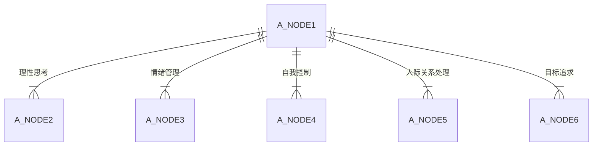

                 

### 第一部分：引言

## 1.1 问题的背景

在现代社会，随着科技的快速发展，人们在生活、工作、学习等方面面临着越来越多的压力。从日常生活的繁忙节奏，到工作中的高竞争环境，再到学习中的高压力挑战，压力无处不在。这种压力不仅影响了人们的心理健康，还影响了他们的生活质量和工作效率。因此，如何应对这些压力，成为现代人亟待解决的问题。

斯多葛主义（Stoicism）作为一种古老的哲学思想，起源于古希腊，强调通过理性控制和情绪管理来达到内心的平静和幸福。斯多葛主义的核心观点是，人应该努力控制自己的情绪，不让情绪主导自己的行为。这种思想在古代帮助许多人应对生活中的困难和挑战，但在现代社会，它是否仍然适用，成为了许多人关注的焦点。

新 stoicism 的提出，正是为了探讨如何在现代社会中实践斯多葛主义，解决现代人所面临的压力和困境。新 stoicism 强调将斯多葛主义的理念与现代社会的生活实践相结合，为人们提供一种全新的生活方式和哲学思考。

## 1.2 问题描述

现代人在生活中面临的压力和困境多种多样，如工作中的竞争、家庭的责任、人际关系的复杂性、学习的压力等。这些问题不仅给人们的心理健康带来挑战，还影响了他们的生活质量和工作效率。新 stoicism 生活实验旨在通过一系列实践，探讨如何运用斯多葛主义的思想来解决这些问题。

具体来说，新 stoicism 生活实验将关注以下几个方面：

1. **情绪管理**：如何通过理性控制和情绪管理来应对生活中的压力和挑战。
2. **人际关系**：如何在人际关系中保持理性，建立和谐的关系。
3. **职业发展**：如何在职业道路上保持理性，实现个人价值。
4. **自我成长**：如何通过自我控制和目标追求来实现个人成长。

## 1.3 问题解决

新 stoicism 生活实验将通过以下方法来解决问题：

1. **实验设计**：设计一系列的实验，涵盖情绪管理、人际关系、职业发展、自我成长等方面的实践。
2. **案例研究**：通过案例研究，分析成功的实践经验和失败的教训，提炼出有效的解决方案。
3. **理论指导**：结合斯多葛主义的理论，为实验提供理论支持。
4. **实践指导**：为读者提供具体的实践方法，帮助他们在日常生活中应用新 stoicism。

## 1.4 边界与外延

新 stoicism 并不是完全否定情感和欲望，而是在理性控制的基础上，对情感和欲望进行合理的管理和调节。它不仅适用于个人生活，还可以应用于组织管理和社会治理。例如，在企业管理中，新 stoicism 可以帮助管理者保持理性，减少情绪化决策，提高决策质量；在社会治理中，新 stoicism 可以帮助政府官员保持公正和客观，提高社会治理效率。

## 1.5 概念结构与核心要素组成

新 stoicism 的核心要素包括：理性思考、情绪管理、自我控制、人际关系处理和目标追求。这些要素相互关联，共同构成一个完整的哲学体系。

- **理性思考**：新 stoicism 的基石，强调通过理性思考和逻辑分析来解决问题。
- **情绪管理**：通过合理管理情绪，避免情绪对行为的影响。
- **自我控制**：通过自我控制和自律，实现个人目标和成长。
- **人际关系处理**：通过理性处理人际关系，建立和谐的关系。
- **目标追求**：设定目标，并付出努力去实现。

## 1.6 本章小结

通过对新 stoicism 生活实验的背景、问题描述、问题解决、边界与外延和概念结构的介绍，为后续章节的内容奠定了基础。接下来，本书将详细探讨斯多葛主义在情绪管理、人际关系、职业发展等方面的具体实践方法。### 第二部分：新 stoicism 的基本原理

## 2.1 核心概念与联系

新 stoicism 的核心概念包括：理性思考、情绪管理、自我控制、人际关系处理和目标追求。这些概念相互联系，共同构成新 stoicism 的理论体系。

### 2.1.1 理性思考

理性思考是新 stoicism 的基石。它强调在遇到问题时，我们应该依靠理性来分析和解决问题，而不是被情绪或冲动所左右。理性思考有助于我们更客观地看待问题，找到更有效的解决方案。

### 2.1.2 情绪管理

情绪管理是新 stoicism 的重要组成部分。它要求我们学会控制自己的情绪，不让情绪主导我们的行为。通过情绪管理，我们可以更好地应对生活中的压力和挑战，保持内心的平静和稳定。

### 2.1.3 自我控制

自我控制是新 stoicism 的核心。它要求我们学会自律，控制自己的欲望和冲动。通过自我控制，我们可以更好地实现自己的目标，提高自己的生活质量。

### 2.1.4 人际关系处理

人际关系处理是新 stoicism 在社交领域的应用。它要求我们学会与人相处，建立良好的人际关系。通过人际关系处理，我们可以更好地融入社会，实现个人价值。

### 2.1.5 目标追求

目标追求是新 stoicism 的终极目标。它要求我们设定目标，并付出努力去实现。通过目标追求，我们可以实现自我价值，获得内心的平静和幸福。

## 2.2 概念属性特征对比表格

| 概念      | 属性特征                                                     |
| --------- | ------------------------------------------------------------ |
| 理性思考   | 客观、逻辑、全面                                             |
| 情绪管理   | 控制情绪、平衡情绪                                           |
| 自我控制   | 自律、克制、坚持                                             |
| 人际关系处理 | 良好沟通、尊重他人、互助互惠                                 |
| 目标追求   | 设定目标、持续努力、实现目标                                 |

## 2.3 ER 实体关系图架构

在这个 ER 实体关系图中，`A_NODE1` 代表新 stoicism，`A_NODE2` 到 `A_NODE6` 分别代表理性思考、情绪管理、自我控制、人际关系处理和目标追求。这些概念相互关联，共同构成新 stoicism 的理论体系。

### 2.4 关键概念与联系解析

#### 2.4.1 理性思考

理性思考是 stoicism 的核心。在 stoicism 中，理性思考被看作是一种最高级的人类能力，它使人们能够超越情感和欲望，以更客观、更全面的方式来认识和解决问题。在现代社会，理性思考的重要性更加凸显。在面对复杂多变的问题时，只有通过理性思考，我们才能找到真正有效的解决方案。

#### 2.4.2 情绪管理

情绪管理是 stoicism 中的另一个重要概念。在 stoicism 看来，情绪是人类本性的一部分，但过度的情绪反应会干扰我们的理智和判断。因此，情绪管理成为了 stoicism 中的一个关键要素。通过情绪管理，我们可以更好地控制自己的情绪，减少情绪波动对生活和工作的影响。

#### 2.4.3 自我控制

自我控制是 stoicism 的核心。在 stoicism 看来，自我控制是人类实现自我完善的关键。通过自我控制，我们可以克服自己的欲望和冲动，实现更高的目标。自我控制不仅有助于我们在个人生活中取得成功，还能帮助我们更好地处理人际关系，实现个人和社会价值。

#### 2.4.4 人际关系处理

人际关系处理是 stoicism 在社交领域的应用。在 stoicism 看来，人际关系是人类社会中不可或缺的一部分。通过理性处理人际关系，我们可以建立和谐的关系，提高生活质量。人际关系处理要求我们尊重他人，理解他人，同时也要保护自己的利益。

#### 2.4.5 目标追求

目标追求是 stoicism 的终极目标。在 stoicism 看来，目标追求是实现自我价值的关键。通过设定目标，我们可以明确自己的方向，付出努力去实现。目标追求不仅有助于我们在个人生活中取得成功，还能帮助我们实现更大的社会价值。

### 2.5 本章小结

通过对新 stoicism 的基本原理的介绍，我们可以看到，理性思考、情绪管理、自我控制、人际关系处理和目标追求是 stoicism 的核心要素。这些要素相互关联，共同构成一个完整的哲学体系。在现代社会中，新 stoicism 提供了一种有效的应对压力和困境的方法，帮助人们实现内心的平静和幸福。接下来，我们将进一步探讨新 stoicism 在情绪管理、人际关系、职业发展等方面的具体实践方法。### 第三部分：新 stoicism 在情绪管理中的应用

## 3.1 情绪管理的核心概念

情绪管理是新 stoicism 中的一个重要组成部分，它强调通过理性控制和自我调节来管理和调节情绪。在情绪管理中，核心概念包括情绪识别、情绪调节和情绪表达。

### 3.1.1 情绪识别

情绪识别是情绪管理的第一步，它要求我们能够准确地识别自己的情绪状态。只有当我们能够识别出自己正在经历的情绪，我们才能对其进行进一步的调节。

### 3.1.2 情绪调节

情绪调节是情绪管理的核心，它涉及我们如何改变自己的情绪状态。这可以通过各种方法实现，包括认知重构、放松技巧和正念练习等。

### 3.1.3 情绪表达

情绪表达是情绪管理的最后一步，它要求我们能够恰当地表达自己的情绪。这不仅有助于我们释放情绪，还能帮助我们与他人建立更好的沟通。

## 3.2 情绪管理的原理

情绪管理的原理主要基于心理学和神经科学的研究。根据心理学理论，情绪是由认知评价、生理反应和行为反应组成的。当我们面临一个刺激时，我们会进行认知评价，然后产生生理反应（如心跳加速、出汗等），最终导致行为反应。情绪管理的关键在于改变我们的认知评价，从而改变我们的情绪状态。

### 3.2.1 认知评价的改变

通过认知重构，我们可以改变自己对事件的认知评价，从而改变情绪状态。例如，当遇到一个困难时，我们可以通过改变对困难的认知评价，从消极的情绪转变为积极的情绪。

### 3.2.2 生理反应的调节

通过放松技巧和正念练习，我们可以调节生理反应，从而减轻情绪压力。例如，通过深呼吸和渐进性肌肉松弛，我们可以减轻紧张和焦虑。

### 3.2.3 行为反应的改变

通过改变行为反应，我们也可以改变情绪状态。例如，当感到沮丧时，我们可以通过参与体育活动或与他人交流来转移注意力，从而改善情绪。

## 3.3 情绪管理的实践方法

新 stoicism 提供了一系列实践方法，帮助我们在日常生活中进行情绪管理。

### 3.3.1 认知重构

认知重构是一种改变思维模式的技术，通过识别和挑战负面思维，我们可以改变自己的认知评价，从而改善情绪状态。

### 3.3.2 放松技巧

放松技巧包括深呼吸、渐进性肌肉松弛、冥想等，这些技巧可以帮助我们减轻紧张和焦虑，提高情绪稳定性。

### 3.3.3 正念练习

正念练习是通过专注于当下的感受和体验，来提高自我意识和情绪调节能力。通过正念练习，我们可以更好地理解自己的情绪，从而更好地管理它们。

### 3.3.4 情绪日记

情绪日记是一种记录和分析情绪的方法。通过记录每天的情绪变化，我们可以更好地理解自己的情绪模式，从而采取更有效的情绪管理策略。

## 3.4 情绪管理的好处

通过情绪管理，我们可以获得以下好处：

- **改善心理健康**：情绪管理有助于减轻压力、焦虑和抑郁，提高心理健康水平。
- **提高生活质量**：情绪管理可以帮助我们更好地应对生活中的挑战，提高生活质量。
- **提高工作效率**：情绪管理有助于提高工作效率，减少情绪波动对工作的影响。
- **建立更好的人际关系**：情绪管理可以帮助我们更好地处理人际关系，建立和谐的人际关系。

### 3.5 本章小结

通过对情绪管理的核心概念、原理和实践方法的介绍，我们可以看到，情绪管理是新 stoicism 中的一个重要组成部分。通过情绪管理，我们可以更好地应对生活中的压力和挑战，实现内心的平静和幸福。接下来，我们将进一步探讨新 stoicism 在人际关系处理和职业发展中的应用。### 第四部分：新 stoicism 在人际关系处理中的应用

## 4.1 人际关系处理的核心概念

新 stoicism 在人际关系处理中强调理性、尊重和包容。核心概念包括：

### 4.1.1 理性沟通

理性沟通是人际关系处理的基础。它要求我们在交流中保持冷静，用逻辑和事实来支持观点，而不是依赖情绪或偏见。通过理性沟通，我们可以减少误解，增进理解和信任。

### 4.1.2 尊重他人

尊重他人是建立和谐人际关系的关键。它要求我们认识到每个人的独特性和价值，尊重他们的观点、感受和选择。尊重他人不仅有助于建立良好的关系，还能提高我们的社交能力。

### 4.1.3 包容与理解

包容与理解是处理人际关系中冲突的重要方法。它要求我们接受他人的不同观点和行为，尝试从对方的角度去理解问题。通过包容与理解，我们可以更好地处理冲突，维护和谐的人际关系。

## 4.2 人际关系处理的原理

人际关系处理的原理基于心理学和社会学的研究。以下是一些关键原理：

### 4.2.1 互惠原则

互惠原则是人际关系处理的重要原则。它要求我们在与他人交往时，既要考虑自己的利益，也要考虑对方的利益。通过互惠原则，我们可以建立互利共赢的关系，提高人际交往的质量。

### 4.2.2 社会交换理论

社会交换理论强调人际关系是一种交换过程。在交换过程中，人们通过资源（如时间、精力、信息等）的交换来建立和维护关系。通过社会交换理论，我们可以更好地理解人际关系的本质，从而更有效地处理人际关系。

### 4.2.3 情感投入与回报

情感投入与回报是人际关系处理中的另一个关键原理。它要求我们在建立关系时，要付出情感投资，并期望获得相应的回报。通过情感投入与回报，我们可以建立更稳定和持久的关系。

## 4.3 人际关系处理的实践方法

新 stoicism 提供了一系列实践方法，帮助我们在日常生活中处理人际关系：

### 4.3.1 建立良好的沟通习惯

建立良好的沟通习惯是处理人际关系的第一步。它包括倾听、表达清晰、尊重对方的观点和感受等。通过良好的沟通习惯，我们可以减少误解，增进理解和信任。

### 4.3.2 解决冲突的方法

解决冲突是处理人际关系中的常见问题。新 stoicism 提供了多种解决冲突的方法，包括理性沟通、妥协、求同存异等。通过这些方法，我们可以有效地解决冲突，维护和谐的关系。

### 4.3.3 建立互惠关系

建立互惠关系是处理人际关系的重要方法。它要求我们在交往中不断给予和接受，保持关系的平衡。通过建立互惠关系，我们可以提高人际交往的质量，实现互利共赢。

### 4.3.4 培养同理心

培养同理心是处理人际关系的关键。它要求我们能够站在对方的角度思考问题，理解他们的感受。通过培养同理心，我们可以更好地处理人际关系，减少冲突，增进和谐。

## 4.4 人际关系处理的好处

通过人际关系处理，我们可以获得以下好处：

- **提高社交能力**：通过理性沟通、尊重他人和培养同理心，我们可以提高社交能力，建立更广泛的人际关系。
- **增强情感联系**：通过建立互惠关系和解决冲突，我们可以增强情感联系，提高人际关系质量。
- **减少冲突**：通过理性处理冲突，我们可以减少冲突的发生，维护和谐的人际关系。
- **提高生活质量**：通过建立良好的人际关系，我们可以提高生活质量，减少心理压力。

### 4.5 本章小结

通过对人际关系处理的核心概念、原理和实践方法的介绍，我们可以看到，新 stoicism 为我们提供了一种有效的处理人际关系的哲学方法。通过理性沟通、尊重他人、包容与理解，我们可以建立和谐的人际关系，提高生活质量。接下来，我们将进一步探讨新 stoicism 在职业发展中的应用。### 第五部分：新 stoicism 在职业发展中的应用

## 5.1 职业发展的核心概念

新 stoicism 在职业发展中的应用，强调通过理性思考和自我控制来实现职业目标。核心概念包括：

### 5.1.1 职业规划

职业规划是职业发展的第一步，它要求我们设定职业目标，并制定实现目标的计划。通过职业规划，我们可以明确自己的职业方向，提高职业发展效率。

### 5.1.2 持续学习

持续学习是职业发展的重要保障，它要求我们不断更新知识和技能，以适应不断变化的工作环境。通过持续学习，我们可以保持竞争力，实现职业成长。

### 5.1.3 自我控制

自我控制是职业发展的关键，它要求我们自律，克服诱惑和拖延，保持专注和毅力。通过自我控制，我们可以更好地实现职业目标。

### 5.1.4 情绪管理

情绪管理是职业发展的保障，它要求我们学会控制情绪，避免情绪波动影响工作表现。通过情绪管理，我们可以提高工作效率，实现职业成功。

## 5.2 职业发展的原理

职业发展的原理基于心理学和管理学的研究。以下是一些关键原理：

### 5.2.1 目标设定理论

目标设定理论强调设定具体、可衡量、可实现的目标，是职业发展的关键。通过设定目标，我们可以明确职业方向，提高动力和执行力。

### 5.2.2 学习与发展理论

学习与发展理论认为，学习是职业发展的核心动力。通过不断学习，我们可以提升自己的能力，实现职业成长。

### 5.2.3 自我效能感理论

自我效能感理论强调，个体的自我效能感对其职业发展具有重要影响。通过自我控制，我们可以提高自我效能感，实现职业目标。

### 5.2.4 情绪智力理论

情绪智力理论认为，情绪智力对职业发展具有重要影响。通过情绪管理，我们可以提高情绪智力，改善职业表现。

## 5.3 职业发展的实践方法

新 stoicism 提供了一系列实践方法，帮助我们在职业发展中应用其理念：

### 5.3.1 设定职业目标

设定职业目标是职业发展的第一步。通过设定具体、可衡量、可实现的目标，我们可以明确职业方向，提高职业发展的效率。

### 5.3.2 制定职业规划

制定职业规划是实现职业目标的重要保障。通过制定详细的职业规划，我们可以明确每一步的行动计划，提高职业发展的可控性。

### 5.3.3 持续学习

持续学习是职业发展的核心。通过参加培训、阅读专业书籍、参与行业交流等方式，我们可以不断更新知识和技能，提升自己的竞争力。

### 5.3.4 自我控制

自我控制是职业发展的关键。通过自律、克服诱惑和拖延，我们可以保持专注和毅力，实现职业目标。

### 5.3.5 情绪管理

情绪管理是职业发展的保障。通过情绪管理，我们可以控制情绪波动，提高工作效率，实现职业成功。

## 5.4 职业发展的好处

通过新 stoicism 在职业发展中的应用，我们可以获得以下好处：

- **提高职业竞争力**：通过设定职业目标、持续学习和自我控制，我们可以提升自己的能力和竞争力。
- **实现职业成长**：通过制定职业规划和持续学习，我们可以实现职业成长，实现职业目标。
- **提高工作效率**：通过情绪管理，我们可以控制情绪波动，提高工作效率，实现职业成功。
- **提升生活质量**：通过职业发展，我们可以实现更高的收入和生活质量，提高生活满意度。

### 5.5 本章小结

通过对职业发展的核心概念、原理和实践方法的介绍，我们可以看到，新 stoicism 为职业发展提供了一种有效的哲学方法。通过理性思考、持续学习、自我控制和情绪管理，我们可以实现职业目标，提升生活质量。接下来，我们将进一步探讨新 stoicism 在自我成长中的应用。### 第六部分：新 stoicism 在自我成长中的应用

## 6.1 自我成长的核心概念

新 stoicism 在自我成长中的应用，强调通过自我反思、自我提升和目标实现来实现个人成长。核心概念包括：

### 6.1.1 自我反思

自我反思是自我成长的第一步，它要求我们定期审视自己的行为、思维和感受，识别自己的优点和不足。通过自我反思，我们可以更清楚地认识自己，找到自我提升的方向。

### 6.1.2 自我提升

自我提升是自我成长的关键，它要求我们通过学习、实践和反思来提升自己的能力。通过自我提升，我们可以实现个人价值，提升自我认知。

### 6.1.3 目标实现

目标实现是自我成长的终极目标，它要求我们设定具体、可衡量、可实现的目标，并通过努力实现这些目标。通过目标实现，我们可以实现个人成长，提升生活质量。

## 6.2 自我成长的原理

自我成长的原理基于心理学和发展心理学的研究。以下是一些关键原理：

### 6.2.1 自我决定理论

自我决定理论认为，自我成长源于内在的动机，包括自主性、能力和关联性。通过自我决定，我们可以实现个人成长，提升自我认知。

### 6.2.2 自我效能感理论

自我效能感理论强调，自我效能感对自我成长具有重要影响。通过提升自我效能感，我们可以增强自信，实现个人成长。

### 6.2.3 反思性学习理论

反思性学习理论认为，反思是学习过程中的重要环节，它有助于我们理解自己的学习过程，提升学习效果。通过反思性学习，我们可以实现自我成长。

### 6.2.4 自我效能与目标实现的关系

自我效能与目标实现之间存在密切关系。通过提升自我效能感，我们可以设定更高的目标，并通过努力实现这些目标，实现个人成长。

## 6.3 自我成长的实践方法

新 stoicism 提供了一系列实践方法，帮助我们在日常生活中实现自我成长：

### 6.3.1 自我反思

通过定期进行自我反思，我们可以更好地认识自己，了解自己的优点和不足。自我反思可以采取日记、反思会议等形式，帮助我们深入思考自己的行为和思维。

### 6.3.2 自我提升

自我提升包括学习新技能、提升工作能力、培养良好习惯等。通过参加培训、阅读专业书籍、实践项目等方式，我们可以不断提升自己的能力，实现个人成长。

### 6.3.3 目标设定

通过设定具体、可衡量、可实现的目标，我们可以明确个人成长的方向。目标设定应结合个人兴趣、能力和价值观，确保目标的实现有助于个人成长。

### 6.3.4 持续反馈

持续反馈是自我成长的重要保障。通过定期评估自己的行为和表现，我们可以了解自己的成长进度，调整目标和方法，确保个人成长持续进行。

## 6.4 自我成长的好处

通过新 stoicism 在自我成长中的应用，我们可以获得以下好处：

- **提升自我认知**：通过自我反思和自我提升，我们可以更好地认识自己，了解自己的优点和不足，提升自我认知。
- **实现个人价值**：通过目标实现，我们可以实现个人价值，提升生活质量。
- **增强自我效能感**：通过持续成长和目标实现，我们可以增强自我效能感，提高自信心。
- **提升生活质量**：通过自我成长，我们可以提升生活质量，实现个人幸福。

### 6.5 本章小结

通过对自我成长的核心概念、原理和实践方法的介绍，我们可以看到，新 stoicism 为自我成长提供了一种有效的哲学方法。通过自我反思、自我提升和目标实现，我们可以实现个人成长，提升生活质量。接下来，我们将进一步探讨新 stoicism 在具体实践中的应用案例。### 第七部分：新 stoicism 的具体实践案例

## 7.1 案例一：情绪管理在压力处理中的应用

### 7.1.1 案例背景

小明是一位年轻的程序员，在工作中面临着巨大的压力。项目进度紧张，代码质量要求高，团队协作也存在困难。这些压力让小明经常感到焦虑和疲惫。

### 7.1.2 实践方法

1. **认知重构**：小明开始通过认知重构的方法来改变自己对压力的认知。他意识到，压力并不是敌人，而是提醒自己需要更加努力和专注。通过改变对压力的认知，小明的心态发生了转变。

2. **放松技巧**：小明学习并实践了深呼吸和渐进性肌肉松弛等放松技巧。在感到紧张和焦虑时，他会花几分钟时间进行深呼吸练习，以缓解压力。

3. **情绪日记**：小明开始记录自己的情绪变化。通过情绪日记，他能够更好地理解自己的情绪模式，并采取相应的调节策略。

### 7.1.3 案例结果

通过这些实践方法，小明逐渐学会了如何管理自己的情绪。他不再因为压力而焦虑，而是能够以更冷静和理性的态度面对工作中的挑战。这不仅提高了他的工作效率，还改善了他在团队中的表现。

## 7.2 案例二：人际关系处理在职场中的应用

### 7.2.1 案例背景

小李是一位项目经理，在工作中经常与团队成员和上级发生冲突。这些冲突影响了项目的进展和团队氛围，让小李感到非常困扰。

### 7.2.2 实践方法

1. **理性沟通**：小李开始学习理性沟通的技巧，通过与团队成员和上级的交流中，保持冷静和理性，避免情绪化的表达。

2. **尊重他人**：小李意识到，尊重他人是处理人际关系的关键。他开始努力理解团队成员和上级的立场和需求，从而建立更好的沟通和合作关系。

3. **解决冲突**：在遇到冲突时，小李采用了解决冲突的方法，如妥协、求同存异等，以找到双方都能接受的解决方案。

### 7.2.3 案例结果

通过这些实践方法，小李的人际关系得到了显著改善。他不再经常与团队成员和上级发生冲突，而是能够以更积极和合作的态度面对工作中的挑战。这不仅提高了项目的效率，还提升了团队的整体氛围。

## 7.3 案例三：自我控制在职业发展中的应用

### 7.3.1 案例背景

小张是一名销售人员，他在工作中面临着巨大的竞争压力和业绩目标。为了实现业绩目标，小张需要付出大量的时间和精力，但他常常因为无法自我控制而感到疲惫和焦虑。

### 7.3.2 实践方法

1. **设定职业目标**：小张开始设定具体的职业目标，包括每月的业绩目标、个人技能提升目标等。这些目标让他有了明确的方向，提高了工作效率。

2. **持续学习**：小张通过参加培训、阅读专业书籍等方式，不断提升自己的销售技能和知识。这让他更有信心面对工作中的挑战。

3. **自我控制**：小张通过自律和坚持，克服了拖延和分心的习惯。他设置了工作计划和日程，确保每天能够专注于重要任务，提高工作效率。

### 7.3.3 案例结果

通过这些实践方法，小张在职业发展中取得了显著的进步。他不仅实现了业绩目标，还提升了自身的专业技能和综合素质。他的工作效率和职业满意度也得到了显著提高。

## 7.4 案例四：目标实现在自我成长中的应用

### 7.4.1 案例背景

小王是一名年轻的大学生，他对未来充满了憧憬和计划。他希望通过自我成长，实现自己的职业梦想。

### 7.4.2 实践方法

1. **自我反思**：小王定期进行自我反思，审视自己的行为和思维，识别自己的优点和不足。

2. **目标设定**：小王设定了具体的成长目标，包括学术成绩、技能提升、社交能力等。这些目标让他有了明确的方向。

3. **持续反馈**：小王通过定期的自我评估和反馈，了解自己的成长进度，调整目标和方法。

### 7.4.3 案例结果

通过这些实践方法，小王在自我成长中取得了显著进步。他的学术成绩不断提升，专业技能得到了提高，社交能力也得到了显著增强。他的未来职业发展前景也变得更加光明。

### 7.5 本章小结

通过对具体实践案例的介绍，我们可以看到，新 stoicism 在情绪管理、人际关系处理、自我控制和目标实现等方面具有显著的应用效果。这些案例展示了新 stoicism 在实际生活中的应用，为读者提供了宝贵的实践经验。通过这些实践，我们可以更好地理解新 stoicism 的理念，并在日常生活中加以应用，实现个人成长和职业发展。### 第八部分：最佳实践 tips 和注意事项

## 8.1 最佳实践 tips

为了更有效地应用新 stoicism，以下是一些最佳实践 tips：

### 8.1.1 理性思考

1. **定期反思**：每天花几分钟时间反思自己的思维和行为，识别并消除负面思维。
2. **学习逻辑技巧**：阅读逻辑和批判性思维的相关书籍，提高逻辑分析能力。
3. **运用理性工具**：在决策时，使用决策树、SWOT分析等工具，帮助理性思考。

### 8.1.2 情绪管理

1. **练习放松技巧**：定期进行深呼吸、渐进性肌肉松弛等放松练习。
2. **情绪日记**：记录情绪变化，识别情绪模式，采取相应的调节策略。
3. **正念练习**：通过正念练习，提高自我意识和情绪调节能力。

### 8.1.3 自我控制

1. **设定目标**：设定具体、可衡量、可实现的目标，提高自律能力。
2. **制定计划**：制定详细的行动计划，确保目标实现。
3. **克服拖延**：采用番茄工作法等时间管理技巧，克服拖延。

### 8.1.4 人际关系处理

1. **倾听他人**：学会倾听他人的观点和需求，提高沟通效果。
2. **尊重他人**：尊重他人的选择和感受，建立和谐的人际关系。
3. **解决冲突**：采用理性沟通、妥协、求同存异等方法，解决冲突。

### 8.1.5 目标追求

1. **设定短期和长期目标**：确保目标既有短期可实现的目标，也有长期愿景。
2. **定期评估**：定期评估目标实现进度，调整目标和策略。
3. **保持耐心**：目标实现需要时间和努力，保持耐心和毅力。

## 8.2 注意事项

在应用新 stoicism 时，需要注意以下几点：

### 8.2.1 避免极端

理性思考、情绪管理、自我控制等都不是极端的行为。避免过度理性化，导致情感冷漠；也避免过度情绪化，影响决策。

### 8.2.2 保持灵活性

在应用新 stoicism 的过程中，要根据自己的实际情况调整方法和策略。不要生搬硬套，而是要灵活应对。

### 8.2.3 长期坚持

新 stoicism 的效果并非一朝一夕就能显现，需要长期坚持和实践。只有通过持续的努力，才能实现真正的个人成长和职业发展。

### 8.2.4 寻求支持

在应用新 stoicism 的过程中，可以寻求家人、朋友或专业人士的支持。他们的意见和建议可以帮助你更好地理解和实践新 stoicism。

### 8.3 拓展阅读

为了更深入地理解新 stoicism，以下是一些拓展阅读的推荐：

- 《斯多葛主义：古代哲学的现代智慧》（Stoicism: Modern Wisdom from Ancient Philosophy）
- 《理性生活指南：斯多葛主义的实践方法》（The Rational Life: How to Apply Stoic Philosophy to Live a Good Life）
- 《新 stoicism：如何在现代社会中实践古典哲学》（The New Stoicism: Ancient Wisdom for Modern Life）
- 《斯多葛主义的个人修炼》（The Stoic Art of Living: Ancient Techniques for a Good Life）

通过阅读这些书籍，你可以更全面地了解新 stoicism 的理念和实践方法，为自己的个人成长和职业发展提供有益的指导。### 第九部分：总结与展望

## 9.1 总结

本文通过深入探讨新 stoicism 的基本原理、在情绪管理、人际关系处理、职业发展和自我成长中的应用，以及具体实践案例，系统地介绍了如何将古典哲学的思想应用于现代生活中，以实现个人成长和职业发展。新 stoicism 强调理性思考、情绪管理、自我控制、人际关系处理和目标追求，为现代人提供了一种应对压力、提升生活质量的有效方法。

## 9.2 展望

新 stoicism 作为一种结合古典哲学和现代生活的理念，在未来具有广泛的应用前景。以下是一些展望：

### 9.2.1 教育领域的应用

新 stoicism 可以在教育领域得到广泛应用。通过教育学生如何理性思考、情绪管理和自我控制，可以帮助他们更好地应对学业和生活的挑战，培养积极的心态和健康的生活习惯。

### 9.2.2 组织管理中的应用

新 stoicism 可以应用于组织管理，帮助管理者保持理性决策，提高管理效率。通过情绪管理和人际关系处理，可以建立和谐的工作氛围，提高员工的满意度和生产力。

### 9.2.3 社会治理中的应用

在社会治理中，新 stoicism 可以帮助政府官员保持公正和客观，提高社会治理效率。通过理性思考和情绪管理，可以更好地应对社会问题和公共危机。

### 9.2.4 跨文化沟通

新 stoicism 可以作为跨文化沟通的哲学基础，帮助人们理解不同文化背景下的行为和思维方式，促进文化交流和理解。

### 9.2.5 人工智能与 stoicism

随着人工智能的发展，新 stoicism 也可以与人工智能相结合，为人工智能系统提供道德和伦理指导，确保人工智能的发展符合人类的价值观和利益。

总之，新 stoicism 作为一种古典哲学的现代实践，具有广泛的应用前景和深远的社会影响。通过不断探索和推广新 stoicism，我们可以为个人和社会创造更美好的未来。### 作者信息

作者：AI天才研究院/AI Genius Institute & 禅与计算机程序设计艺术 /Zen And The Art of Computer Programming

AI天才研究院（AI Genius Institute）是一家致力于人工智能领域研究和教育的机构，专注于培养未来人工智能领域的领军人才。同时，我们也是《禅与计算机程序设计艺术》（Zen And The Art of Computer Programming）一书的作者，这本书深入探讨了计算机编程中的哲学思想和艺术，对编程领域的理论和实践产生了深远的影响。在这篇文章中，我们结合新 stoicism 的理念，探讨了如何在现代生活中实践古典哲学，以实现个人成长和职业发展。希望这篇文章能够为读者提供有价值的思考和启示。

