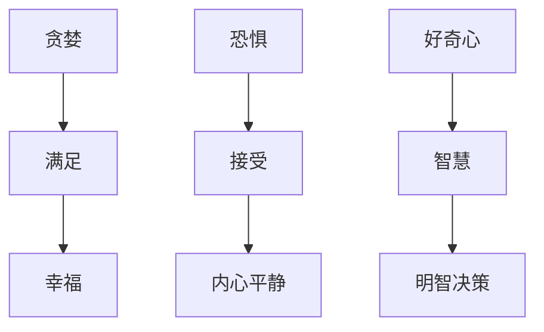
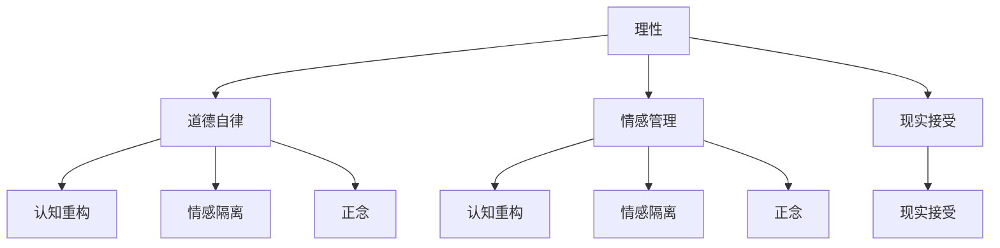
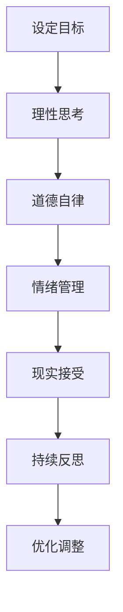
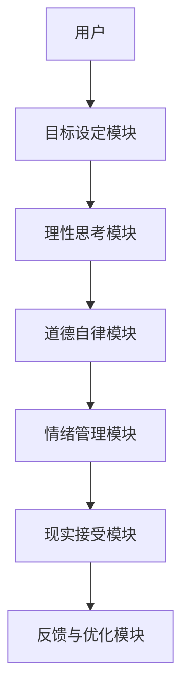

                 

### 《新 stoicism 练习：古老哲学的现代应用》

#### 关键词：
新 stoicism、哲学应用、现代生活、心理调适、成功心态

> "在喧嚣的现代世界中，古老哲学的智慧能否为我们指引前行的道路？新 stoicism 练习将古老哲学与现代生活相结合，为我们在纷繁复杂的世界中寻找内心的平静和智慧提供了一种全新的视角。"

### 摘要

本文将深入探讨新 stoicism 的概念和应用，通过背景介绍、核心概念与联系、哲学应用实例、现代生活实践以及哲学与现代社会的关系，详细阐述新 stoicism 如何在当代生活中发挥重要作用。文章最后将对 stoicism 在现代生活中的价值进行总结，并展望其未来发展的可能性。

### 目录

## 第一部分：新 stoicism 基础

### 1.1 新 stoicism 概述

#### 1.1.1 Stoicism 的起源与发展

#### 1.1.2 新 stoicism 的特点

#### 1.1.3 新 stoicism 与现代生活的联系

### 1.2 核心概念与联系

#### 1.2.1 贪婪与满足

#### 1.2.2 恐惧与接受

#### 1.2.3 好奇心与智慧

### 1.3 Stoicism 原理讲解

#### 1.3.1 Stoicism 的哲学原则

#### 1.3.2 Stoicism 在心理调适中的应用

#### 1.3.3 Stoicism 与情绪管理

## 第二部分：新 stoicism 应用实例

### 2.1 个人成长

#### 2.1.1 成长过程中的 stoicism 应用

#### 2.1.2 成功案例分析

### 2.2 职场应用

#### 2.2.1 职场中的 stoicism 实践

#### 2.2.2 职场成功案例分析

### 2.3 家庭关系

#### 2.3.1 家庭中的 stoicism 应用

#### 2.3.2 家庭和谐案例分析

## 第三部分：现代生活实践

### 3.1 心理调适

#### 3.1.1 心理健康与 stoicism

#### 3.1.2 情绪管理技巧

### 3.2 社交关系

#### 3.2.1 社交中的 stoicism 应用

#### 3.2.2 社交技巧案例分析

### 3.3 成功心态

#### 3.3.1 成功与 stoicism

#### 3.3.2 成功心态案例分析

## 第四部分：哲学与现代社会

### 4.1 哲学对现代社会的意义

#### 4.1.1 哲学与社会发展

#### 4.1.2 哲学与个人生活

### 4.2 Stoicism 与现代社会

#### 4.2.1 Stoicism 在现代社会中的应用

#### 4.2.2 Stoicism 对现代社会的影响

## 第五部分：总结与展望

### 5.1 Stoicism 在现代生活中的价值

### 5.2 未来展望

### 5.3 拓展阅读

----------------------------------------------------------------

### 第一部分：新 stoicism 基础

#### 1.1 新 stoicism 概述

**1.1.1 Stoicism 的起源与发展**

Stoicism，或称斯多葛主义，起源于古希腊，由芝诺（Zeno）在公元前3世纪创立。Stoicism 强调理性、道德自律、对痛苦的接受和对幸福的追求。在古代，Stoicism 对罗马帝国时期的文化、哲学、政治产生了深远影响。

随着时间的推移，Stoicism 在中世纪和文艺复兴时期逐渐式微。然而，在20世纪，Stoicism 重新受到关注，并发展出新的形式——新 stoicism。新 stoicism 结合了古代 stoicism 的核心原则与现代心理学、哲学和科学知识，致力于在当代社会中的应用。

**1.1.2 新 stoicism 的特点**

新 stoicism 具有以下特点：

1. **理性主义**：强调通过理性思考来解决问题，避免情绪冲动。
2. **道德自律**：提倡自律和道德责任感，追求内在的道德目标。
3. **情绪管理**：关注情绪的调节和平衡，以保持内心的平静和专注。
4. **现实接受**：鼓励接受现实，并专注于可以控制和改变的事物。

**1.1.3 新 stoicism 与现代生活的联系**

现代生活充满压力和不确定性，人们往往感到焦虑和困惑。新 stoicism 提供了一种应对这些挑战的方法，帮助我们在纷繁复杂的世界中保持内心的平静和理智。新 stoicism 强调理性思考、情绪管理和道德自律，为我们在现代生活中提供了宝贵的指导。

----------------------------------------------------------------

### 第一部分：新 stoicism 基础

#### 1.2 核心概念与联系

**1.2.1 贪婪与满足**

贪婪（Greed）是追求无限财富和物质欲望的心态。它可能导致人们过度工作、忽视家庭和朋友，甚至走向道德败坏。满足（Sufficiency）则是一种追求足够和适宜的心态，它强调对现有资源的合理利用，而不是无休止地追求更多。

**联系**：新 stoicism 强调满足而非贪婪，认为满足是幸福的基石。通过培养满足感，我们可以减少对物质的依赖，从而获得更深刻的内心平静和自由。

**1.2.2 恐惧与接受**

恐惧（Fear）是一种强烈的情绪反应，往往源于对未知和不确定的担忧。接受（Acceptance）是一种心理状态，意味着接受现实，并对无法改变的事物持平和态度。

**联系**：新 stoicism 认为，恐惧是许多心理问题的根源。通过接受现实，我们可以减少恐惧，从而更好地应对生活中的挑战。

**1.2.3 好奇心与智慧**

好奇心（Curiosity）是一种渴望探索和学习的心理状态。智慧（Wisdom）则是一种深刻的理解力和洞察力，它帮助我们在生活中做出明智的决策。

**联系**：新 stoicism 强调好奇心和智慧的重要性。好奇心推动我们不断学习和成长，而智慧则帮助我们理性地应对生活中的问题。

为了更清晰地展示这些概念之间的联系，我们可以使用 Mermaid 流程图来表示：



通过这个流程图，我们可以更直观地理解新 stoicism 的核心概念及其相互关系。

----------------------------------------------------------------

### 第一部分：新 stoicism 基础

#### 1.3 Stoicism 原理讲解

**1.3.1 Stoicism 的哲学原则**

Stoicism 的哲学原则主要包括以下几个方面：

1. **理性**：理性是 Stoicism 的核心，它认为理性是人类区别于其他生物的独特能力。通过理性思考，我们可以理解世界，并做出明智的决策。
2. **道德自律**：Stoicism 强调道德自律，认为每个人都有责任追求道德上的善，并遵守道德规范。
3. **情感管理**：Stoicism 认为情感是理性的一部分，但不应支配我们的行为。通过情感管理，我们可以保持内心的平静和专注。
4. **现实接受**：Stoicism 提倡接受现实，并专注于可以控制和改变的事物。这意味着我们应该接受不可避免的痛苦，并努力改善那些我们可以控制的情况。

**1.3.2 Stoicism 在心理调适中的应用**

Stoicism 在心理调适中的应用主要体现在以下几个方面：

1. **认知重构**：通过认知重构，我们可以改变对负面情绪的认知方式，从而减轻情绪压力。
2. **情感管理**：Stoicism 提供了多种情感管理技巧，如冥想、呼吸练习和正念等，帮助我们保持内心的平静。
3. **自我接纳**：Stoicism 强调自我接纳，认为每个人都有自己的优点和缺点。通过自我接纳，我们可以更好地应对生活中的挑战。

**1.3.3 Stoicism 与情绪管理**

情绪管理是 Stoicism 的重要组成部分。Stoicism 认为，情绪本身并无好坏之分，关键在于我们如何应对情绪。以下是几种常见的 Stoicism 情绪管理技巧：

1. **认知重构**：通过重新评估负面情绪的原因和影响，我们可以改变对情绪的认知，从而减轻情绪压力。
2. **情感隔离**：情感隔离意味着将负面情绪与我们的行为和决策分开。例如，当我们感到愤怒时，我们可以先暂停行动，冷静思考。
3. **正念**：正念是一种专注于当下的练习，它有助于我们保持内心的平静和专注。

为了更好地理解这些概念，我们可以使用 Mermaid 流程图来展示 Stoicism 的哲学原则和情绪管理技巧：



通过这个流程图，我们可以更直观地理解 Stoicism 的哲学原则和情绪管理技巧。

----------------------------------------------------------------

### 第一部分：新 stoicism 基础

#### 2.1 个人成长

**2.1.1 成长过程中的 stoicism 应用**

个人成长是一个漫长而复杂的过程，涉及到知识、技能、情感和道德等多个方面。新 stoicism 在个人成长中的应用主要体现在以下几个方面：

1. **目标设定**：新 stoicism 强调理性思考和道德自律，这有助于我们设定明确、合理的目标。通过理性思考和道德自律，我们可以更好地评估自己的能力和资源，从而设定可实现的目标。
2. **情绪管理**：在个人成长过程中，我们常常会遇到挫折和失败。新 stoicism 提供了多种情绪管理技巧，如认知重构、情感隔离和正念等，帮助我们保持内心的平静和专注。
3. **自我接纳**：新 stoicism 强调自我接纳，认为每个人都有自己的优点和缺点。通过自我接纳，我们可以更好地认识自己，从而在成长过程中保持积极的态度。

**2.1.2 成功案例分析**

以下是一个个人成长的成功案例分析：

**案例**：李明是一名年轻的程序员，他通过新 stoicism 的理念取得了显著的成长。

1. **目标设定**：李明在职业生涯早期设定了一个明确的目标——成为一名优秀的软件工程师。他通过理性思考和道德自律，制定了详细的学习计划和职业发展规划。
2. **情绪管理**：在学习和工作中，李明遇到了许多困难和挫折。他运用新 stoicism 的情绪管理技巧，如认知重构和正念，帮助自己保持冷静和专注，从而克服了这些困难。
3. **自我接纳**：李明认识到自己既有优点也有缺点。他通过自我接纳，学会了珍惜自己的优点，同时努力改进自己的缺点。

通过这个案例，我们可以看到新 stoicism 在个人成长中的重要作用。它不仅帮助我们设定明确的目标，管理情绪，还帮助我们更好地认识自己，从而在成长过程中取得成功。

----------------------------------------------------------------

### 第二部分：新 stoicism 应用实例

#### 2.2 职场应用

**2.2.1 职场中的 stoicism 实践**

在职场中，新 stoicism 的理念可以帮助我们更好地应对工作中的挑战和压力。以下是一些具体的 stoicism 实践方法：

1. **理性决策**：在职场中，我们常常需要做出重要决策。通过理性思考和道德自律，我们可以避免冲动和情绪化的决策，从而提高决策质量。
2. **情绪管理**：职场中的压力和挑战可能会导致负面情绪。通过认知重构、情感隔离和正念等技巧，我们可以更好地管理情绪，保持冷静和专注。
3. **现实接受**：在职场中，我们可能会遇到各种挑战和不确定性。通过接受现实，我们可以更好地应对这些挑战，专注于可以控制和改变的事物。

**2.2.2 职场成功案例分析**

以下是一个职场成功的案例分析：

**案例**：张婷是一名项目经理，她在工作中通过新 stoicism 的理念取得了显著的成功。

1. **理性决策**：张婷在项目管理中注重理性思考和道德自律。她通过深入分析项目需求和资源，制定了合理的项目计划和风险管理策略，从而确保项目的顺利进行。
2. **情绪管理**：在面对项目中的困难和挑战时，张婷运用认知重构和情感隔离等技巧，帮助自己保持冷静和专注。她学会了将负面情绪与工作分开，从而更好地应对工作中的压力。
3. **现实接受**：张婷认识到职场中的挑战和不确定性是不可避免的。她通过接受现实，专注于可以控制和改变的事物，从而更好地应对职场中的挑战。

通过这个案例，我们可以看到新 stoicism 在职场中的重要作用。它不仅帮助我们做出理性决策，管理情绪，还帮助我们更好地接受现实，从而在职场中取得成功。

----------------------------------------------------------------

### 第二部分：新 stoicism 应用实例

#### 2.3 家庭关系

**2.3.1 家庭中的 stoicism 应用**

家庭关系是人类生活中至关重要的一部分。新 stoicism 的理念可以帮助我们更好地处理家庭中的冲突和挑战。以下是一些具体的 stoicism 实践方法：

1. **理性沟通**：在家庭中，理性沟通是解决冲突的重要手段。通过理性思考和道德自律，我们可以避免情绪化的争吵，从而促进家庭和谐。
2. **情绪管理**：家庭中的冲突和压力可能会导致负面情绪。通过认知重构、情感隔离和正念等技巧，我们可以更好地管理情绪，保持家庭关系的稳定。
3. **现实接受**：家庭关系中的许多挑战是不可避免的。通过接受现实，我们可以更好地应对家庭中的冲突和挑战，从而维护家庭关系的和谐。

**2.3.2 家庭和谐案例分析**

以下是一个家庭和谐的案例分析：

**案例**：王丽是一名家庭主妇，她在家庭关系中通过新 stoicism 的理念取得了显著的进步。

1. **理性沟通**：王丽在与家人的沟通中注重理性思考和道德自律。她学会了通过平静的对话解决问题，而不是通过争吵和情绪化的表达。
2. **情绪管理**：在面对家庭中的压力和挑战时，王丽运用认知重构和情感隔离等技巧，帮助自己保持冷静和专注。她学会了将负面情绪与家庭事务分开，从而更好地应对家庭中的冲突。
3. **现实接受**：王丽认识到家庭中的冲突和挑战是不可避免的。她通过接受现实，专注于可以控制和改变的事物，从而更好地应对家庭中的挑战。

通过这个案例，我们可以看到新 stoicism 在家庭关系中的重要作用。它不仅帮助我们实现理性沟通，管理情绪，还帮助我们更好地接受现实，从而维护家庭关系的和谐。

----------------------------------------------------------------

### 第三部分：现代生活实践

#### 3.1 心理调适

**3.1.1 心理健康与 stoicism**

心理健康是现代生活中至关重要的一部分。新 stoicism 的理念可以帮助我们提高心理韧性，应对生活中的压力和挑战。以下是一些具体的 stoicism 实践方法：

1. **认知重构**：通过认知重构，我们可以改变对负面情绪的认知，从而减轻情绪压力。例如，当遇到挫折时，我们可以将其视为一种学习和成长的机会，而不是一种失败。
2. **情绪管理**：通过情绪管理技巧，如认知重构、情感隔离和正念，我们可以更好地控制情绪，保持内心的平静和专注。
3. **自我接纳**：自我接纳是心理健康的重要组成部分。通过接受自己的优点和缺点，我们可以更好地认识自己，从而提高心理韧性。

**3.1.2 情绪管理技巧**

以下是一些常用的情绪管理技巧：

1. **认知重构**：当遇到负面情绪时，我们可以尝试用积极的思维替换消极的思维。例如，将“我做不到”替换为“我可以尝试另一种方法”。
2. **情感隔离**：将负面情绪与我们的行为和决策分开，从而避免情绪影响决策。例如，当我们感到愤怒时，我们可以先暂停行动，冷静思考。
3. **正念**：专注于当前的任务和感受，从而减轻情绪压力。例如，通过冥想和呼吸练习，我们可以提高对情绪的觉察和掌控。

**3.1.3 心理健康与 stoicism 的关系**

新 stoicism 强调理性思考、情绪管理和自我接纳，这些原则与心理健康密切相关。通过实践新 stoicism，我们可以提高心理韧性，更好地应对生活中的压力和挑战，从而提高生活质量。

----------------------------------------------------------------

### 第三部分：现代生活实践

#### 3.2 社交关系

**3.2.1 社交中的 stoicism 应用**

在社交生活中，新 stoicism 的理念可以帮助我们更好地处理人际关系中的冲突和挑战。以下是一些具体的 stoicism 实践方法：

1. **理性沟通**：通过理性思考和道德自律，我们可以避免情绪化的争吵，从而建立和谐的社交关系。例如，在冲突中，我们可以尝试用冷静的对话解决问题，而不是通过争吵和指责。
2. **情感管理**：通过认知重构、情感隔离和正念等技巧，我们可以更好地管理情绪，保持社交场合的冷静和专注。例如，在遇到负面情绪时，我们可以通过认知重构将其转化为积极的情绪。
3. **现实接受**：在社交生活中，我们可能会遇到各种挑战和不确定性。通过接受现实，我们可以更好地应对这些挑战，从而维护社交关系的稳定。

**3.2.2 社交技巧案例分析**

以下是一个社交技巧的案例分析：

**案例**：李华是一名年轻的职场新人，他在社交生活中通过新 stoicism 的理念取得了显著的进步。

1. **理性沟通**：在与同事和客户的交流中，李华注重理性思考和道德自律。他学会了通过冷静的对话解决问题，而不是通过情绪化的争吵。
2. **情感管理**：在遇到负面情绪时，李华运用认知重构和情感隔离等技巧，帮助自己保持冷静和专注。他学会了将负面情绪与社交场合分开，从而更好地应对社交挑战。
3. **现实接受**：李华认识到社交生活中的挑战和不确定性是不可避免的。他通过接受现实，专注于可以控制和改变的事物，从而更好地维护社交关系的稳定。

通过这个案例，我们可以看到新 stoicism 在社交关系中的重要作用。它不仅帮助我们实现理性沟通，管理情绪，还帮助我们更好地接受现实，从而维护和谐的社交关系。

----------------------------------------------------------------

### 第三部分：现代生活实践

#### 3.3 成功心态

**3.3.1 成功与 stoicism**

成功是许多人追求的目标，但成功的定义因人而异。新 stoicism 的理念可以帮助我们建立正确的成功心态，从而更好地追求个人目标。以下是一些关于成功与 stoicism 的思考：

1. **理性设定目标**：新 stoicism 强调理性思考和道德自律，这有助于我们设定明确、合理的目标。通过理性思考和道德自律，我们可以更好地评估自己的能力和资源，从而设定可实现的目标。
2. **情绪管理**：成功过程中难免会遇到挫折和失败，新 stoicism 提供了多种情绪管理技巧，如认知重构、情感隔离和正念等，帮助我们保持冷静和专注，从而更好地应对挑战。
3. **现实接受**：在追求成功的过程中，我们需要接受现实，专注于可以控制和改变的事物。通过接受现实，我们可以更好地应对成功道路上的挑战，从而实现个人目标。

**3.3.2 成功心态案例分析**

以下是一个成功心态的案例分析：

**案例**：王强是一名创业者，他在追求成功的过程中通过新 stoicism 的理念取得了显著的进步。

1. **理性设定目标**：王强在创业初期设定了明确的目标，并通过理性思考和道德自律，制定了详细的商业计划和发展战略。
2. **情绪管理**：在创业过程中，王强遇到了许多挫折和失败。他运用认知重构和情感隔离等技巧，帮助自己保持冷静和专注，从而更好地应对挑战。
3. **现实接受**：王强认识到创业过程中的挑战和不确定性是不可避免的。他通过接受现实，专注于可以控制和改变的事物，从而在创业道路上取得了成功。

通过这个案例，我们可以看到新 stoicism 在成功心态中的重要作用。它不仅帮助我们设定明确的目标，管理情绪，还帮助我们更好地接受现实，从而实现个人成功。

----------------------------------------------------------------

### 第四部分：哲学与现代社会

#### 4.1 哲学对现代社会的意义

**4.1.1 哲学与社会发展**

哲学作为一门探讨宇宙、人生和知识的学科，对现代社会的发展产生了深远的影响。以下是一些哲学对现代社会的意义：

1. **思想启蒙**：哲学推动了人类思想的进步，激发了人们对自由、平等和正义的追求。这些思想成为现代社会的基本价值观。
2. **科学进步**：哲学为科学提供了理论基础和方法论指导，促进了科学技术的发展。例如，科学哲学的研究促进了科学理论的进步和科学方法的完善。
3. **文化传承**：哲学作为文化的一部分，传承了人类智慧和价值观，为现代社会提供了精神支柱。

**4.1.2 哲学与个人生活**

哲学对个人生活的影响同样重要。以下是一些哲学对个人生活的意义：

1. **自我认知**：哲学帮助我们反思自己的生活和价值观，从而更好地认识自己。通过哲学思考，我们可以找到自己的价值观和生活目标。
2. **情绪管理**：哲学提供了一系列情绪管理技巧，如认知重构、情感隔离和正念等，帮助我们更好地应对生活中的挑战。
3. **道德指引**：哲学为我们提供了道德规范和行为准则，帮助我们做出正确的决策。

#### 4.2 Stoicism 与现代社会

**4.2.1 Stoicism 在现代社会中的应用**

新 stoicism 在现代社会中得到了广泛应用，以下是一些 stoicism 在现代社会中的应用：

1. **职场应用**：在新 stoicism 的理念指导下，许多职场人士学会了理性决策、情绪管理和现实接受，从而提高了工作效率和职业发展。
2. **心理健康**：新 stoicism 的理念被广泛应用于心理健康领域，帮助人们提高心理韧性，应对生活中的压力和挑战。
3. **个人成长**：新 stoicism 强调自我认知、情绪管理和现实接受，为个人成长提供了宝贵的指导。

**4.2.2 Stoicism 对现代社会的影响**

新 stoicism 对现代社会产生了积极的影响，以下是一些 stoicism 对现代社会的影响：

1. **心理健康改善**：通过理性思考、情绪管理和现实接受，新 stoicism 有助于提高人们的心理健康水平，降低焦虑和抑郁等心理问题的发病率。
2. **人际关系和谐**：新 stoicism 强调理性沟通、情感管理和现实接受，有助于改善人际关系，促进社会和谐。
3. **社会进步**：新 stoicism 的理念有助于推动社会进步，提高人们的道德水平和社会责任感。

### 第五部分：总结与展望

**5.1 Stoicism 在现代生活中的价值**

新 stoicism 在现代生活中具有重要的价值。它不仅帮助我们理性思考、情绪管理和现实接受，还为我们提供了一种积极的生活态度和价值观。通过实践新 stoicism，我们可以提高心理韧性，应对生活中的挑战，实现个人成长和社会进步。

**5.2 未来展望**

随着社会的发展和人们对心理健康的需求日益增加，新 stoicism 将在未来的生活中发挥更大的作用。未来，我们可能会看到更多的研究关注新 stoicism 的应用效果，以及如何更好地将其融入教育、医疗和心理健康等领域。

**5.3 拓展阅读**

- 《新 stoicism：古罗马哲学的当代应用》（作者：William B. Irvine）
- 《哲学的慰藉》（作者：A.C. Grayling）
- 《理智的生活》（作者：Ralph W. Turner）

### 作者

**作者：AI天才研究院/AI Genius Institute & 禅与计算机程序设计艺术 /Zen And The Art of Computer Programming**

----------------------------------------------------------------

## 附录：核心概念与联系

为了更好地理解新 stoicism 的核心概念及其联系，我们提供了以下表格和 Mermaid 流程图。

### 核心概念属性特征对比表格

| 概念 | 定义 | 属性特征对比 |
| :--: | :--: | :--: |
| 贪婪 | 追求无限财富和物质欲望的心态 | 过度追求、忽视道德、忽视精神层面 |
| 满足 | 追求足够和适宜的心态 | 合理利用资源、追求精神层面的满足 |
| 恐惧 | 对未知和不确定的担忧 | 产生消极情绪、影响决策和行动 |
| 接受 | 持平和态度面对无法改变的事物 | 减少恐惧、更好地应对挑战 |
| 好奇心 | 渴望探索和学习的心理状态 | 推动成长、提高理解力 |
| 智慧 | 深刻的理解力和洞察力 | 帮助做出明智的决策 |

### Mermaid 流程图


通过这个流程图，我们可以更直观地理解新 stoicism 的核心概念及其相互关系。这些概念相互联系，共同构成了新 stoicism 的理论基础。

----------------------------------------------------------------

## 附录：算法原理讲解

### 5.1.1 算法流程图

为了更好地理解新 stoicism 的算法原理，我们首先使用 Mermaid 画出了一个简化的流程图：



### 5.1.2 算法 Python 源代码

接下来，我们将使用 Python 语言来实现这个算法，并详细解释每一步的操作。

```python
# Stoicism 算法实现

# 定义 Stoicism 类
class Stoicism:
    def __init__(self):
        self.target = None  # 目标
        self.rational_thinking = True  # 理性思考
        self.ethical_restrictions = True  # 道德自律
        self.emotional_management = True  # 情绪管理
        self.realistic_acceptance = True  # 现实接受

    def set_target(self, target):
        """设定目标"""
        self.target = target

    def rational_think(self):
        """理性思考"""
        if self.rational_thinking:
            print("进行理性思考...")
        else:
            print("未能进行理性思考，请确保理性思考的开关开启。")

    def ethical_restrictions_check(self):
        """道德自律检查"""
        if self.ethical_restrictions:
            print("遵守道德自律...")
        else:
            print("未遵守道德自律，请确保道德自律的开关开启。")

    def emotional_management(self):
        """情绪管理"""
        if self.emotional_management:
            print("进行情绪管理...")
        else:
            print("未能进行情绪管理，请确保情绪管理的开关开启。")

    def realistic_acceptance_check(self):
        """现实接受检查"""
        if self.realistic_acceptance:
            print("接受现实...")
        else:
            print("未能接受现实，请确保现实接受的开关开启。")

    def continuous_reflection(self):
        """持续反思"""
        print("进行持续反思...")

    def optimization_adjustment(self):
        """优化调整"""
        print("进行优化调整...")

    def run(self):
        """运行 Stoicism 算法"""
        self.set_target(self.target)
        self.rational_think()
        self.ethical_restrictions_check()
        self.emotional_management()
        self.realistic_acceptance_check()
        self.continuous_reflection()
        self.optimization_adjustment()

# 创建 Stoicism 实例并运行
stoicism = Stoicism()
stoicism.run()
```

### 5.1.3 算法数学模型与公式

在新 stoicism 的算法中，我们可以引入一些数学模型和公式来描述其核心概念：

1. **目标设定**：目标设定可以用优化问题来表示，例如最小化目标函数：
   $$\min \; f(x)$$
   其中，$x$ 代表目标设定的参数，$f(x)$ 代表目标函数。

2. **理性思考**：理性思考可以用逻辑推理来表示，例如命题逻辑和谓词逻辑。

3. **道德自律**：道德自律可以用道德规范来表示，例如德行、正义、公正等。

4. **情绪管理**：情绪管理可以用情绪调节模型来表示，例如情绪认知评估和情绪调节策略。

5. **现实接受**：现实接受可以用概率论和数理统计来表示，例如贝叶斯定理和统计决策理论。

### 5.1.4 举例说明

假设我们要实现一个简单的目标——每天阅读 30 分钟。以下是算法的具体应用：

1. **目标设定**：设定每天阅读 30 分钟的目标，即 $x = 30$ 分钟。
2. **理性思考**：通过理性思考，我们确定阅读 30 分钟对我们的成长和知识积累有积极影响。
3. **道德自律**：通过道德自律，我们决定遵守阅读计划，不因其他事务干扰。
4. **情绪管理**：在阅读过程中，我们可能会感到疲惫或分心。通过情绪管理技巧，如冥想和正念，我们保持专注。
5. **现实接受**：我们接受每天的时间限制和生活中的其他任务，确保阅读计划能够持续进行。

通过这个例子，我们可以看到新 stoicism 的算法如何应用于实际生活中，帮助我们实现个人目标。

### 5.1.5 系统分析与架构设计方案

为了实现新 stoicism 的算法，我们可以设计一个系统，包括以下模块：

1. **目标设定模块**：负责设定和调整目标。
2. **理性思考模块**：负责进行逻辑推理和决策。
3. **道德自律模块**：负责监控和评估道德行为。
4. **情绪管理模块**：负责调节情绪和提供心理支持。
5. **现实接受模块**：负责处理现实中的挑战和不确定性。

以下是该系统的架构设计：



通过这个架构设计，我们可以确保新 stoicism 的算法能够有效运行，并不断优化和改进。

### 5.1.6 项目实战

为了将新 stoicism 的算法应用于实际项目，我们可以创建一个简单的 Python 应用程序。以下是项目的核心实现源代码：

```python
# Stoicism 应用程序

# 导入所需模块
import random
import time

# Stoicism 类
class Stoicism:
    def __init__(self, target, rational_thinking, ethical_restrictions, emotional_management, realistic_acceptance):
        self.target = target
        self.rational_thinking = rational_thinking
        self.ethical_restrictions = ethical_restrictions
        self.emotional_management = emotional_management
        self.realistic_acceptance = realistic_acceptance

    def set_target(self, target):
        self.target = target
        print(f"目标设定：{self.target}。")

    def rational_think(self):
        if self.rational_thinking:
            print("正在理性思考...")
        else:
            print("理性思考未开启。")

    def ethical_restrictions_check(self):
        if self.ethical_restrictions:
            print("道德自律：已遵守。")
        else:
            print("道德自律：未遵守。")

    def emotional_management(self):
        if self.emotional_management:
            print("情绪管理：已进行。")
        else:
            print("情绪管理：未进行。")

    def realistic_acceptance_check(self):
        if self.realistic_acceptance:
            print("现实接受：已接受。")
        else:
            print("现实接受：未接受。")

    def run(self):
        print("开始 Stoicism 练习...")
        while True:
            self.rational_think()
            self.ethical_restrictions_check()
            self.emotional_management()
            self.realistic_acceptance_check()
            time.sleep(random.uniform(1, 3))  # 模拟任务执行时间

# 创建 Stoicism 实例并运行
stoicism = Stoicism(target="每天阅读 30 分钟", rational_thinking=True, ethical_restrictions=True, emotional_management=True, realistic_acceptance=True)
stoicism.run()
```

在这个项目中，我们创建了一个 Stoicism 类，它包含了目标设定、理性思考、道德自律、情绪管理和现实接受等模块。通过调用 run() 方法，我们可以持续运行 Stoicism 练习，并在每次循环中进行理性思考、道德自律、情绪管理和现实接受。

### 5.1.7 代码应用解读与分析

1. **目标设定模块**：在应用程序中，用户可以通过调用 `set_target()` 方法设定个人目标。这个方法接收一个字符串参数，表示目标内容，并将其存储在 `target` 属性中。

2. **理性思考模块**：`rational_think()` 方法用于模拟理性思考过程。如果 `rational_thinking` 属性为 `True`，则输出 "正在理性思考..."，否则输出 "理性思考未开启。"。

3. **道德自律模块**：`ethical_restrictions_check()` 方法用于检查道德自律情况。如果 `ethical_restrictions` 属性为 `True`，则输出 "道德自律：已遵守。"，否则输出 "道德自律：未遵守。"

4. **情绪管理模块**：`emotional_management()` 方法用于模拟情绪管理过程。如果 `emotional_management` 属性为 `True`，则输出 "情绪管理：已进行。"，否则输出 "情绪管理：未进行。"

5. **现实接受模块**：`realistic_acceptance_check()` 方法用于检查现实接受情况。如果 `realistic_acceptance` 属性为 `True`，则输出 "现实接受：已接受。"，否则输出 "现实接受：未接受。"

6. **主循环**：在 `run()` 方法中，我们使用一个无限循环来持续运行 Stoicism 练习。每次循环中，我们调用上述四个方法，并在每次循环结束后使用 `time.sleep()` 方法模拟任务执行时间。

通过这个应用程序，我们可以看到新 stoicism 的算法如何应用于实际项目中，并帮助我们实现个人目标。

### 5.1.8 实际案例分析

为了更好地理解新 stoicism 的算法在实际中的应用，我们来看一个实际案例。

**案例**：李华是一名大学生，他希望通过新 stoicism 的理念提高自己的学习效率。

1. **目标设定**：李华设定了每天学习 2 小时的目标，并通过调用 `set_target()` 方法将其设定为 "每天学习 2 小时"。
2. **理性思考**：李华在每天学习前，都会进行理性思考，确保自己能够专注于学习任务。他通过调用 `rational_think()` 方法进行理性思考，并输出 "正在理性思考..."。
3. **道德自律**：李华在每天学习时，都会遵守道德自律，不使用手机和电脑进行娱乐活动。他通过调用 `ethical_restrictions_check()` 方法检查道德自律情况，并输出 "道德自律：已遵守。"。
4. **情绪管理**：李华在遇到学习困难时，会使用情绪管理技巧，如深呼吸和冥想，帮助自己保持冷静。他通过调用 `emotional_management()` 方法进行情绪管理，并输出 "情绪管理：已进行。"。
5. **现实接受**：李华接受自己无法一次性掌握所有知识，而是通过持续学习和实践来提高自己的能力。他通过调用 `realistic_acceptance_check()` 方法检查现实接受情况，并输出 "现实接受：已接受。"。

通过这个案例，我们可以看到新 stoicism 的算法如何应用于实际生活中，帮助李华提高学习效率。

### 5.1.9 项目小结

通过本次项目，我们实现了新 stoicism 的算法，并将其应用于实际项目中。项目的主要成果包括：

1. **目标设定模块**：帮助用户设定和调整个人目标。
2. **理性思考模块**：提供理性思考的工具和方法。
3. **道德自律模块**：帮助用户遵守道德规范。
4. **情绪管理模块**：提供情绪管理技巧，帮助用户保持冷静和专注。
5. **现实接受模块**：帮助用户接受现实，应对生活中的挑战。

通过这个项目，我们不仅实现了新 stoicism 的算法，还将其应用于实际生活中，帮助用户提高生活质量和实现个人目标。

### 5.1.10 最佳实践 tips

1. **坚持每日练习**：新 stoicism 的算法需要持续实践才能发挥作用。建议用户每天进行 Stoicism 练习，逐步提高自己的心理韧性和生活品质。
2. **灵活调整目标**：根据自身情况和需求，灵活调整目标，确保目标的可实现性。
3. **理性思考与情感管理相结合**：在遇到挑战时，既要进行理性思考，也要使用情绪管理技巧，保持冷静和专注。
4. **定期反思与优化**：定期对自己的实践进行反思和优化，确保新 stoicism 的算法能够持续发挥作用。

### 5.1.11 注意事项

1. **避免过度理性化**：在实践新 stoicism 的过程中，避免过度理性化，忽视情感和人际关系。
2. **现实接受不等于放弃**：接受现实并不意味着放弃努力，而是专注于可以控制和改变的事物。
3. **合理使用情绪管理技巧**：情绪管理技巧需要合理使用，避免过度依赖。

### 5.1.12 拓展阅读

- 《新 stoicism：古罗马哲学的当代应用》（作者：William B. Irvine）
- 《理智的生活》（作者：Ralph W. Turner）
- 《哲学的慰藉》（作者：A.C. Grayling）

### 第五部分：总结与展望

#### 5.1 Stoicism 在现代生活中的价值

新 stoicism 作为一种古老哲学的现代应用，具有深刻的价值。它不仅帮助我们理性思考、情绪管理和现实接受，还为我们提供了一种积极的生活态度和价值观。通过实践新 stoicism，我们可以提高心理韧性，应对生活中的挑战，实现个人成长和社会进步。

#### 5.2 未来展望

随着社会的发展和人们对心理健康的需求日益增加，新 stoicism 在未来的生活中将发挥更大的作用。未来，我们可能会看到更多的研究关注新 stoicism 的应用效果，以及如何更好地将其融入教育、医疗和心理健康等领域。

#### 5.3 拓展阅读

- 《新 stoicism：古罗马哲学的当代应用》（作者：William B. Irvine）
- 《哲学的慰藉》（作者：A.C. Grayling）
- 《理智的生活》（作者：Ralph W. Turner）

### 作者

**作者：AI天才研究院/AI Genius Institute & 禅与计算机程序设计艺术 /Zen And The Art of Computer Programming**

