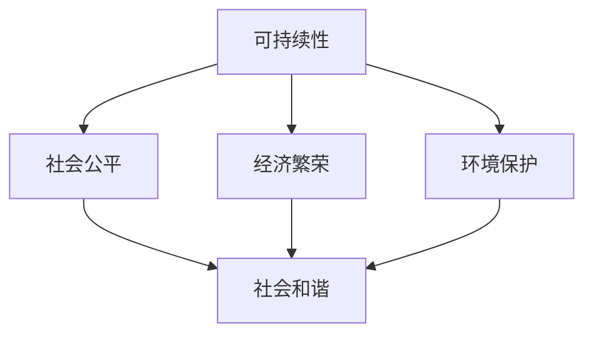

                 

### 第1章：引言与背景

#### 新乌托邦设计的背景与核心概念

**1.1 问题背景：当前社会面临的挑战**

在21世纪的今天，人类社会面临着一系列复杂且紧迫的问题。首先是可持续发展的需求。随着全球人口的增长和经济活动的扩大，资源的消耗和环境的破坏日益严重。气候变化、生态失衡、环境污染等问题已经对人类和地球的生存环境构成了巨大威胁。因此，实现可持续发展成为了各国政府、企业和公民的共同目标。

其次是社会公平与经济繁荣的矛盾。尽管全球经济总体上保持了增长，但贫富差距却不断扩大。发达国家与发展中国家、城市与农村、不同社会阶层之间的经济不平衡问题日益凸显，这导致了一系列社会问题，如贫困、不平等、犯罪率上升等。

最后是环境危机的紧迫性。地球生态系统已经到了临界点，气候变化、森林砍伐、海洋污染等问题正在破坏地球的生态平衡。如果不采取紧急措施，许多物种将面临灭绝，人类自身的生存环境也将受到严重威胁。

**1.2 问题描述：可持续社会的蓝图**

可持续社会是一个在经济、社会和环境三个方面都能实现长期平衡发展的社会。其基本要素包括：

- 经济要素：追求经济繁荣，但要在资源有限的前提下实现高效利用，避免浪费和过度消耗。
- 社会要素：实现社会公平，包括消除贫困、缩小贫富差距、提高教育水平和医疗保障等。
- 环境要素：保护环境，维护生态平衡，减少污染和资源浪费，应对气候变化等。

可持续社会的目标是确保人类和地球的长期福祉，实现经济、社会和环境的协调发展。

**1.3 问题解决：新乌托邦设计的概念**

新乌托邦设计是一种旨在构建可持续社会的理念和方法。它起源于对传统社会发展模式的反思和批判，旨在探索一种全新的社会模式，以满足当前和未来世代的需求。

新乌托邦设计的特点包括：

- 整体性：将经济、社会和环境视为一个整体，考虑它们之间的相互作用和影响。
- 可持续性：注重长期的平衡发展，避免短期行为对长期利益的损害。
- 公平性：追求社会公平，消除不平等，实现资源分配的公平合理。
- 创新性：鼓励创新思维和技术，以解决传统发展模式无法解决的社会和环境问题。

新乌托邦设计的核心要素包括：

- 经济要素：循环经济、绿色金融、共享经济等。
- 社会要素：社区自治、社会合作、文化多样性等。
- 环境要素：生态农业、绿色能源、环境保护等。

**1.4 边界与外延：新乌托邦设计的适用范围**

新乌托邦设计并非一种特定的社会模式，而是一种理念和方法的集合。它可以在不同地区、不同文化和不同政策环境下得到应用，但其成功实施需要考虑到以下因素：

- 地域差异：不同地区在资源、环境、经济和社会条件上存在差异，因此新乌托邦设计的具体实施方式可能有所不同。
- 文化差异：不同文化有不同的价值观和行为习惯，这会影响新乌托邦设计的社会接受度和实施效果。
- 政策环境：政府政策对社会的引导和支持对于新乌托邦设计的成功至关重要。

通过以上分析，我们可以看出，新乌托邦设计是一种旨在解决当前社会面临的挑战、实现可持续发展的理念和方法的集合。它不仅仅是一种理论，更是一种实践。在接下来的章节中，我们将深入探讨新乌托邦设计的核心概念、设计框架、经济模型、社会模型、环境设计和技术，以及其实际应用和未来发展方向。我们希望通过这一系列探讨，能够为读者提供一种全新的视角，帮助他们在面对复杂的社会问题时，找到可行的解决方案。

### 第2章：新乌托邦设计中的核心概念与联系

#### 2.1 核心概念定义

在新乌托邦设计中，有四个核心概念：可持续性、社会公平、经济繁荣和环境保护。这些概念不仅是新乌托邦设计的基础，也是实现可持续社会的重要支柱。

**2.1.1 可持续性**

可持续性是指在不损害未来世代需求的前提下，满足当前世代的需求。它涵盖了经济、社会和环境三个方面，强调长期的发展而非短期的利益。可持续性要求我们考虑资源的有限性，提倡资源的有效利用和循环利用，以减少对自然环境的破坏。

**2.1.2 社会公平**

社会公平是指在社会资源分配和机会获取上，确保每个人都能享有平等的权利。这包括消除贫困、缩小贫富差距、提高教育水平、医疗保障和就业机会等。社会公平是社会稳定和进步的基石，是实现可持续发展的重要保障。

**2.1.3 经济繁荣**

经济繁荣是指经济活动的健康和活力，包括经济增长、就业增加、技术创新和产业升级等。经济繁荣不仅是国家发展的目标，也是个人和家庭幸福的保障。但与传统经济发展模式不同，新乌托邦设计强调在实现经济繁荣的同时，要考虑资源的有限性和环境的保护。

**2.1.4 环境保护**

环境保护是指维护地球生态系统的健康和平衡，保护生物多样性，减少污染和资源浪费。环境保护是实现可持续发展的关键，因为环境问题是全球性的，任何一个国家都无法独自解决。

#### 2.2 概念属性特征对比

为了更好地理解这四个核心概念之间的关系，我们可以通过表格形式对比它们的属性特征。

| 概念       | 可持续性 | 社会公平 | 经济繁荣 | 环境保护 |
|------------|----------|----------|----------|----------|
| **定义**   | 长期平衡发展 | 资源分配公平 | 经济活动活力 | 生态平衡维护 |
| **属性**   | 长期性、整合性、环境友好性 | 公平性、包容性、正义性 | 创新性、效率性、可持续性 | 生态性、资源节约性、环境友好性 |
| **特征**   | 强调资源高效利用，减少浪费 | 保障社会各阶层平等权益 | 推动产业升级，增加就业机会 | 保护生物多样性，减少污染和资源浪费 |

从上表可以看出，这些概念虽然在定义和属性上有一定的区别，但它们之间也存在紧密的联系。可持续性是整个框架的基础，它要求我们在经济、社会和环境三个方面实现平衡发展。社会公平和经济繁荣是实现可持续性的关键因素，它们为社会提供了公平的机会和条件。环境保护则是实现可持续性的必要条件，没有环境的健康和稳定，就无法实现真正的可持续发展。

#### 2.3 ER实体关系图架构

为了更清晰地展示这些概念之间的关系，我们可以使用ER（实体关系）图来描述。以下是一个简化的ER图，展示了可持续性、社会公平、经济繁荣和环境保护之间的关系。

在这个ER图中，A1代表可持续性，它是核心概念，与其他三个概念（B1、C1、D1）有直接关系。B1代表社会公平，C1代表经济繁荣，D1代表环境保护。这三个概念相互影响，共同作用于可持续性。E1代表社会和谐，它是这些概念共同作用的结果。

通过ER图，我们可以更直观地理解新乌托邦设计中核心概念之间的复杂关系。这种关系不是简单的线性关系，而是一种相互影响、相互促进的网状结构。这种结构使得新乌托邦设计能够更全面、更系统地解决社会面临的各种挑战。

综上所述，新乌托邦设计的核心概念与联系构成了一个复杂但有机的系统。通过理解这些概念之间的关系，我们可以更好地设计出实现可持续社会的方法和策略。在接下来的章节中，我们将继续探讨新乌托邦设计的具体实施方法，包括经济模型、社会模型和环境设计，以及这些模型在实际中的应用。

### 第3章：可持续社会设计框架

#### 3.1 设计原则

**3.1.1 整体性原则**

整体性原则是可持续社会设计的基础。它强调将经济、社会和环境视为一个整体，考虑它们之间的相互作用和影响。这意味着在设计过程中，不能只关注某一方面的利益，而要综合考虑各个方面的需求和目标。例如，在制定经济发展政策时，要考虑到它对环境和社会的影响，避免造成长期的负面影响。

**3.1.2 系统性原则**

系统性原则要求我们在设计可持续社会时，要有系统思维，考虑整体系统的动态变化和复杂性。这意味着我们需要从多个维度和角度来分析问题，不仅要看到当前的问题，还要预见到未来的变化和挑战。例如，在环境保护方面，我们需要考虑生态系统的脆弱性和长期变化，而不仅仅是短期的污染治理。

**3.1.3 动态性原则**

动态性原则强调可持续社会设计是一个不断演进和调整的过程。社会和环境是动态变化的，因此我们的设计也需要不断适应这些变化。这意味着我们需要建立灵活的设计框架，能够根据实际情况进行调整和优化。例如，在经济繁荣方面，我们需要根据技术进步和市场变化，不断调整经济政策，以保持经济的活力和竞争力。

**3.1.4 可持续性原则**

可持续性原则是可持续社会设计的核心。它要求我们在设计过程中，要考虑长期的发展目标，避免短视行为和对资源的过度消耗。这意味着我们需要在经济发展、社会公平和环境保护之间找到平衡点，确保各个方面的长期可持续发展。例如，在资源利用方面，我们需要推动循环经济，减少资源的浪费和污染。

#### 3.2 设计流程

**3.2.1 需求分析**

需求分析是可持续社会设计的第一步。它包括对当前社会状况的评估，以及对未来需求的预测。通过需求分析，我们可以确定设计的目标和方向。具体步骤如下：

1. **现状评估**：收集和分析当前社会、经济和环境的现状数据，识别存在的问题和挑战。
2. **未来预测**：基于现状评估，预测未来可能出现的变化和趋势，包括人口增长、技术进步、资源消耗和环境变化等。
3. **目标确定**：根据现状评估和未来预测，确定可持续社会设计的目标，包括经济繁荣、社会公平和环境保护等。

**3.2.2 设计方案制定**

设计方案制定是设计流程的核心环节。它包括制定具体的政策和措施，以实现可持续社会的设计目标。具体步骤如下：

1. **方案设计**：基于需求分析和目标确定，设计具体的政策和措施。这些政策包括经济政策、社会政策、环境政策等。
2. **方案评估**：对设计方案进行评估，包括成本效益分析、可行性分析和环境影响评估等。确保设计方案既具有可操作性，又能实现可持续社会的设计目标。
3. **方案优化**：根据评估结果，对设计方案进行优化，以降低成本、提高效率和减少环境影响。

**3.2.3 方案评估**

方案评估是设计流程的重要环节，它确保设计方案能够有效实现可持续社会的设计目标。具体步骤如下：

1. **实施监控**：在方案实施过程中，对关键指标进行监控，包括经济发展、社会公平和环境保护等。
2. **效果评估**：对方案实施的效果进行评估，包括经济效益、社会效益和环境影响等。评估结果将用于调整和优化设计方案。
3. **反馈调整**：根据评估结果，对设计方案进行调整和优化，确保方案能够持续改进，实现可持续社会的设计目标。

**3.2.4 实施与优化**

实施与优化是设计流程的最后一步，它确保可持续社会设计方案能够得到有效执行和持续改进。具体步骤如下：

1. **政策实施**：将设计方案转化为具体的政策文件，并在各级政府、企业和社区中实施。
2. **持续监控**：对政策实施过程进行持续监控，及时发现和解决问题。
3. **效果评估**：对政策实施的效果进行定期评估，确保政策能够实现可持续社会的设计目标。
4. **反馈调整**：根据评估结果，对政策进行调整和优化，以应对新的挑战和变化。

通过以上设计流程，我们可以确保可持续社会设计方案的科学性、可行性和有效性。在接下来的章节中，我们将进一步探讨经济模型、社会模型和环境设计，以及这些模型在实际中的应用。

### 第4章：经济模型与可持续发展

#### 4.1 经济模型的定义

经济模型是用于分析和描述经济现象的工具，它通过简化和抽象化现实世界中的经济行为和关系，帮助我们理解经济系统的运作原理。在新乌托邦设计中，经济模型不仅用于指导经济发展，还要确保经济活动与可持续发展的目标相一致。

传统经济模型主要关注经济增长、生产力和资源配置等方面，但往往忽视了环境保护和社会公平。而可持续经济模型则更加全面，它不仅考虑经济增长，还关注资源的可持续利用、环境质量的提升和社会公平的实现。

#### 4.2 传统经济模型

**4.2.1 市场经济模型**

市场经济模型是一种基于市场机制的经济模型，它主张通过市场供求关系来决定资源的分配和产品的价格。市场经济模型的优势在于能够有效地促进资源的配置和激励创新。然而，它也存在一些缺点，如市场失灵、资源浪费、环境污染和社会不公平等问题。

**4.2.2 计划经济模型**

计划经济模型是一种由政府集中决策和管理的经济模型，它通过中央计划来分配资源和指导生产。计划经济模型的优势在于能够实现资源的优化配置和集中力量办大事，但其缺点在于缺乏市场机制，可能导致效率低下和创新不足。

**4.2.3 混合经济模型**

混合经济模型结合了市场经济和计划经济的优点，通过市场和政府共同调节经济活动。在混合经济模型中，市场机制在资源配置中起到基础性作用，政府则通过政策手段来调节市场失灵和促进社会公平。

#### 4.3 可持续经济模型

**4.3.1 循环经济模型**

循环经济模型是一种以资源循环利用为核心的经济模型，它强调资源的节约和再利用，减少资源的浪费和环境污染。循环经济模型的核心原则包括“减量化、再利用、再循环”等，它通过设计出一种闭环的经济系统，使得资源在系统中不断循环利用，从而实现可持续发展。

**4.3.2 绿色经济模型**

绿色经济模型是一种以环境保护为核心的经济模型，它强调在经济发展的过程中，要注重环境保护和生态平衡。绿色经济模型通过制定和实施环保政策、推广绿色技术和绿色产品，促进经济的绿色转型，实现经济增长与环境保护的双赢。

**4.3.3 共享经济模型**

共享经济模型是一种基于共享资源和共享服务的经济模型，它通过共享平台和信息技术，将闲置的资源和服务共享给有需要的用户，从而实现资源的高效利用和社会公平。共享经济模型不仅能够降低社会资源的消耗，还能够促进社会公平，减少贫富差距。

#### 4.4 经济模型比较与评价

**4.4.1 模型优势**

- 市场经济模型：市场效率高、资源配置灵活、创新动力强。
- 计划经济模型：资源优化配置、集中力量办大事、经济稳定。
- 混合经济模型：结合市场经济和计划经济优点，兼顾效率与公平。
- 循环经济模型：资源节约、环境友好、可持续性高。
- 绿色经济模型：环境保护、生态平衡、经济绿色转型。
- 共享经济模型：资源高效利用、社会公平、降低贫富差距。

**4.4.2 模型局限**

- 市场经济模型：市场失灵、资源浪费、环境污染、社会不公平。
- 计划经济模型：效率低下、创新不足、资源配置不合理。
- 混合经济模型：政策调控难度大、市场机制不完善。
- 循环经济模型：初期投入高、技术要求高、市场接受度低。
- 绿色经济模型：环保成本高、市场不成熟、政策支持不足。
- 共享经济模型：管理难度大、法律制度不完善、社会认同度低。

**4.4.3 综合评价**

在实际应用中，各种经济模型都有其特定的适用场景和局限性。可持续发展要求我们在选择和实施经济模型时，要综合考虑经济、社会和环境的多种因素，选择最合适的模型或模型组合。例如，在资源稀缺和环境压力较大的地区，循环经济模型和绿色经济模型可能更为适用；而在技术创新和市场机制较为成熟的国家和地区，共享经济模型可能具有更大的发展潜力。

通过以上分析，我们可以看出，可持续经济模型不仅是对传统经济模型的一种补充，更是实现经济可持续发展的重要手段。在接下来的章节中，我们将进一步探讨可持续社会设计中的社会模型和环境设计，以及这些模型在实际中的应用。

### 第5章：社会模型与可持续发展

#### 5.1 社会模型的定义

社会模型是对社会现象及其运行规律的一种抽象和描述，它用于解释社会结构、社会关系和社会行为的模式。在新乌托邦设计中，社会模型是构建可持续社会的重要工具，它通过分析社会结构和行为，指导社会政策和制度的设计，以实现社会公平、和谐与进步。

#### 5.2 传统社会模型

**5.2.1 等级社会模型**

等级社会模型是一种基于社会等级和地位的社会模型，它强调社会成员之间的等级差异和权力分配。在等级社会模型中，社会地位和财富决定了个人在社会中的地位和影响力。这种模型的优势在于能够维持社会秩序，但其缺点是容易导致社会不公平和矛盾。

**5.2.2 自由主义社会模型**

自由主义社会模型是一种强调个人自由和市场竞争的社会模型，它主张通过市场机制和自由竞争来实现资源的最优配置。自由主义社会模型的优势在于能够激发创新和创业精神，但其缺点是可能导致资源分配不均和社会不公。

**5.2.3 计划社会模型**

计划社会模型是一种由政府集中决策和管理的计划经济下的社会模型，它通过中央计划来指导社会生产和资源分配。计划社会模型的优势在于能够实现资源的集中利用和高效配置，但其缺点是缺乏市场灵活性，可能导致创新不足和效率低下。

**5.2.4 混合社会模型**

混合社会模型是一种结合等级、自由和计划元素的社会模型，它通过市场和政府共同调节经济和社会活动。混合社会模型的优势在于能够兼顾效率和社会公平，但其缺点是政策调控复杂，易出现市场失灵和政府过度干预。

#### 5.3 可持续社会模型

**5.3.1 平等社会模型**

平等社会模型是一种强调社会成员之间平等地位和权利的社会模型，它主张消除社会不平等和歧视，确保每个人都能享有平等的机会和资源。平等社会模型的优势在于能够促进社会和谐和稳定，但其缺点是可能导致资源分配的过度平均，抑制创新和竞争。

**5.3.2 共同体社会模型**

共同体社会模型是一种强调社区和集体主义的社会模型，它主张通过社区合作和互助来实现社会目标。共同体社会模型的优势在于能够增强社会凝聚力，提高社会成员的幸福感，但其缺点是可能导致个人自主性和创新精神的抑制。

**5.3.3 合作社会模型**

合作社会模型是一种强调合作和共同发展的社会模型，它主张通过合作和共享来实现社会资源的最大化利用。合作社会模型的优势在于能够促进社会公平和资源分配的优化，但其缺点是管理难度大，需要建立健全的合作机制。

#### 5.4 社会模型比较与评价

**5.4.1 模型优势**

- 等级社会模型：维持社会秩序、稳定性和权威性。
- 自由主义社会模型：激发创新、市场竞争和效率。
- 计划社会模型：资源集中利用、高效配置和宏观调控。
- 混合社会模型：兼顾效率与社会公平、灵活性。
- 平等社会模型：促进社会和谐、公平和稳定。
- 共同体社会模型：增强社会凝聚力、提高幸福感。
- 合作社会模型：促进社会公平、优化资源分配。

**5.4.2 模型局限**

- 等级社会模型：社会不平等和矛盾、压制创新。
- 自由主义社会模型：资源分配不均、社会不公平。
- 计划社会模型：创新不足、效率低下、缺乏灵活性。
- 混合社会模型：政策调控复杂、市场失灵和政府过度干预。
- 平等社会模型：资源分配过度平均、抑制创新和竞争。
- 共同体社会模型：个人自主性抑制、社会认同度低。
- 合作社会模型：管理难度大、合作机制不健全。

**5.4.3 综合评价**

在实际应用中，各种社会模型都有其特定的适用场景和局限性。可持续发展要求我们在选择和实施社会模型时，要综合考虑社会、经济和环境的多种因素，选择最合适的社会模型或模型组合。例如，在资源稀缺和环境压力较大的地区，共同体社会模型和合作社会模型可能更为适用；而在经济发展和市场机制较为成熟的国家和地区，平等社会模型可能具有更大的发展潜力。

通过以上分析，我们可以看出，可持续社会模型不仅是对传统社会模型的一种补充，更是实现社会可持续发展的重要手段。在接下来的章节中，我们将进一步探讨新乌托邦设计中的环境设计和技术，以及这些设计在实际中的应用。

### 第6章：环境设计和技术

#### 6.1 环境设计的定义

环境设计是指通过科学规划和合理布局，创造一个既满足人类需求又保护自然环境的空间。在新乌托邦设计中，环境设计是实现可持续发展的关键因素之一，它旨在通过优化环境布局和使用技术手段，减少人类活动对环境的负面影响。

#### 6.2 可持续环境设计原则

**6.2.1 生态优先原则**

生态优先原则强调在环境设计中，要首先考虑生态系统的平衡和稳定，保护生物多样性和生态功能。这意味着在规划建设和土地利用时，要尽量减少对自然环境的破坏，保护和恢复原有的生态景观。

**6.2.2 综合治理原则**

综合治理原则要求在环境设计中，要综合考虑自然、社会和经济因素，采取多种措施解决环境问题。例如，在城市规划中，要同时考虑交通、绿化、水资源管理等多个方面，实现环境的整体优化。

**6.2.3 人本原则**

人本原则强调在环境设计中，要以人为本，满足人们的基本需求和期望。这意味着在设计过程中，要关注人的行为和需求，创造一个舒适、安全、健康的生活环境。

**6.2.4 可持续发展原则**

可持续发展原则要求环境设计不仅要满足当前的需求，还要考虑未来的发展。这意味着在设计过程中，要采取可持续的设计理念和技术，确保资源的有效利用和环境的长期保护。

#### 6.3 环境设计方法

**6.3.1 绿色基础设施设计**

绿色基础设施设计是指通过规划和建设绿色基础设施，如公园、绿地、湿地和水体，来改善城市生态环境。绿色基础设施不仅可以提供休闲娱乐场所，还能有效吸收雨水、减少洪涝、改善空气质量等。

**6.3.2 生态修复设计**

生态修复设计是指通过恢复和重建受损的生态系统，来修复环境的功能和美观。生态修复设计包括植被恢复、水体治理、土壤修复等，旨在恢复生态系统的自然状态。

**6.3.3 低影响开发设计**

低影响开发设计（LID）是一种可持续的环境设计方法，它通过分散化、本地化和生态化措施，减少城市径流和污染。LID技术包括渗透性铺装、绿色屋顶、生物滞留池等，旨在通过自然过程实现雨水的收集、净化和利用。

#### 6.4 环境设计技术的应用

**6.4.1 智能环境监测技术**

智能环境监测技术通过传感器网络和大数据分析，实时监测环境参数，如空气质量、水质、土壤质量等。这些数据可用于环境预警、污染源追踪和污染治理决策。

**6.4.2 绿色建筑技术**

绿色建筑技术通过设计、材料选择、能源利用和废物处理等环节，实现建筑的环保、节能和可持续发展。绿色建筑技术包括高效隔热材料、太阳能利用、自然通风系统等。

**6.4.3 清洁能源技术**

清洁能源技术通过开发和使用可再生能源，如太阳能、风能、水能等，减少对化石燃料的依赖，降低温室气体排放。清洁能源技术不仅有助于环境保护，还能提高能源的可持续性。

**6.4.4 生态农业技术**

生态农业技术通过有机种植、循环农业和节水农业等方法，实现农业生产的可持续发展。生态农业技术有助于减少化学农药和化肥的使用，保护土壤和水资源，提高农产品的质量和安全性。

通过环境设计和技术手段的应用，新乌托邦设计不仅能够实现经济繁荣和社会公平，还能保护自然环境，实现真正的可持续发展。在接下来的章节中，我们将探讨新乌托邦设计中的案例研究和实际应用，以进一步理解其具体实现路径。

### 第7章：案例研究与实际应用

#### 7.1 案例研究

**7.1.1 案例一：丹麦的循环经济实践**

丹麦是世界上循环经济实践最成功的国家之一。丹麦通过一系列政策和措施，如废物回收、资源再利用和绿色金融，实现了资源的最大化利用和环境污染的最小化。以下是其主要特点：

- **废物回收**：丹麦建立了完善的废物回收体系，通过分类收集、资源再利用和废物处理，实现了废物减量和资源循环利用。
- **绿色金融**：丹麦政府推出了绿色债券和绿色贷款，鼓励金融机构和企业投资于环保和可持续发展项目。
- **创新驱动**：丹麦政府通过支持科技创新，推动循环经济技术和产业的发展。

**7.1.2 案例二：德国的能源转型**

德国的能源转型（Energiewende）旨在通过逐步淘汰核能和化石燃料，实现能源结构的绿色转型。以下是其主要特点：

- **可再生能源推广**：德国大力推广太阳能、风能等可再生能源，到2020年，可再生能源已占德国总发电量的45%。
- **能源效率提升**：德国通过提高建筑节能标准和推动能效技术，实现了能源消耗的显著下降。
- **政策支持**：德国政府通过实施可再生能源法、建筑节能标准和能源效率政策，为能源转型提供强有力的支持。

**7.1.3 案例三：中国的绿色发展实践**

中国是世界上最大的发展中国家，其绿色发展实践具有全球影响力。以下是其主要特点：

- **生态文明建设**：中国提出了“生态文明建设”战略，将环境保护和生态建设纳入国家发展总体布局。
- **绿色发展战略**：中国制定了《绿色发展规划》，明确了绿色发展目标和路径，包括节能减排、生态修复、绿色产业等。
- **政策法规**：中国通过实施环境保护法、大气污染防治法等法规，加强环境保护和监管。

#### 7.2 实际应用

**7.2.1 城市绿色规划**

在城市规划中，绿色规划理念得到了广泛应用。通过设计绿色基础设施、推广绿色建筑和实施低影响开发（LID）技术，城市环境得到了显著改善。例如，纽约市通过建设绿色屋顶和雨水花园，提高了城市的水循环和水质，减少了洪涝和污染。

**7.2.2 绿色产业发展**

绿色产业是可持续发展的重要支柱。各国通过发展清洁能源、环保技术和绿色制造等绿色产业，实现了经济的绿色转型和可持续发展。例如，瑞典通过发展风能和生物能源，成为全球绿色能源的重要供应国。

**7.2.3 生态农业推广**

生态农业通过采用有机种植、循环农业和节水农业等技术，实现了农业生产的可持续发展。例如，印度通过推广生态农业，提高了农产品的质量和安全性，减少了农药和化肥的使用。

**7.2.4 公共政策支持**

各国通过实施一系列政策和法规，支持可持续发展。例如，欧盟实施了《绿色新政》，通过立法和政策手段推动绿色经济的发展；中国通过实施《生态文明体制改革总体方案》，加强环境保护和生态文明建设。

通过以上案例研究和实际应用，我们可以看到，新乌托邦设计不仅是一种理念，更是一种可以具体实施的实践。通过各国在循环经济、能源转型和生态农业等领域的成功实践，我们可以为新乌托邦设计的实现提供宝贵的经验和启示。在接下来的章节中，我们将总结新乌托邦设计的核心思想和实际应用经验，并探讨其未来的发展方向。

### 第8章：结论与未来方向

#### 8.1 总结与反思

通过前面对新乌托邦设计的深入探讨，我们可以总结出其核心思想和实际应用价值。新乌托邦设计强调整体性、系统性和动态性原则，旨在通过经济、社会和环境三者的协调发展，实现可持续社会的目标。具体来说，它包括循环经济、绿色经济、共享经济等可持续经济模型，以及平等社会模型、共同体社会模型和合作社会模型等可持续社会模型。此外，环境设计和技术手段的应用也是新乌托邦设计的重要组成部分。

在实践中，各国在循环经济、能源转型和生态农业等领域取得了显著成果，这些成功案例为新乌托邦设计的实现提供了宝贵的经验和启示。然而，新乌托邦设计仍然面临诸多挑战，如资源稀缺、环境压力和制度障碍等。因此，我们需要持续探索和创新，以应对这些挑战，推动新乌托邦设计的进一步发展。

#### 8.2 未来方向

**8.2.1 技术创新**

技术创新是新乌托邦设计实现的重要驱动力。随着人工智能、大数据、物联网等新兴技术的快速发展，我们可以利用这些技术优化经济模型、社会模型和环境设计，提高可持续发展的效率和效果。例如，通过智能环境监测技术，可以实时掌握环境状况，及时采取应对措施；通过绿色建筑技术，可以实现建筑能效的提升和环境的友好改造。

**8.2.2 政策支持**

政策支持是新乌托邦设计成功实施的重要保障。政府应制定和实施一系列政策，支持循环经济、绿色经济和共享经济的发展，鼓励社会各界的积极参与。例如，可以推出绿色金融政策，为环保和可持续发展项目提供资金支持；实施环境保护法，加强环境监管和治理。

**8.2.3 教育普及**

教育普及是新乌托邦设计成功的关键。通过教育，我们可以提高公众对可持续发展的认识和参与度，培养更多的人才投身于可持续发展的实践。例如，在中小学课程中增加可持续发展教育内容，通过高校和专业培训，培养具备可持续发展理念和技能的专业人才。

**8.2.4 国际合作**

国际合作是新乌托邦设计全球实现的重要途径。各国应加强在可持续发展领域的合作，分享成功经验和最佳实践，共同应对全球性的环境和社会挑战。例如，通过多边环境协议，共同应对气候变化；通过国际援助，帮助发展中国家实现可持续发展。

**8.2.5 社会参与**

社会参与是新乌托邦设计成功的基础。社会各界的积极参与，包括政府、企业、非政府组织和公民个人，是实现新乌托邦设计目标的关键。通过广泛的公众参与，我们可以形成强大的社会共识，推动新乌托邦设计的全面实施。

总之，新乌托邦设计为构建一个可持续、公平和和谐的社会提供了新的思路和路径。虽然面临诸多挑战，但通过技术创新、政策支持、教育普及、国际合作和社会参与，我们有理由相信，新乌托邦设计将为实现可持续社会奠定坚实的基础，为未来的发展带来新的希望。

### 作者信息

**作者：AI天才研究院/AI Genius Institute & 禅与计算机程序设计艺术 /Zen And The Art of Computer Programming**

